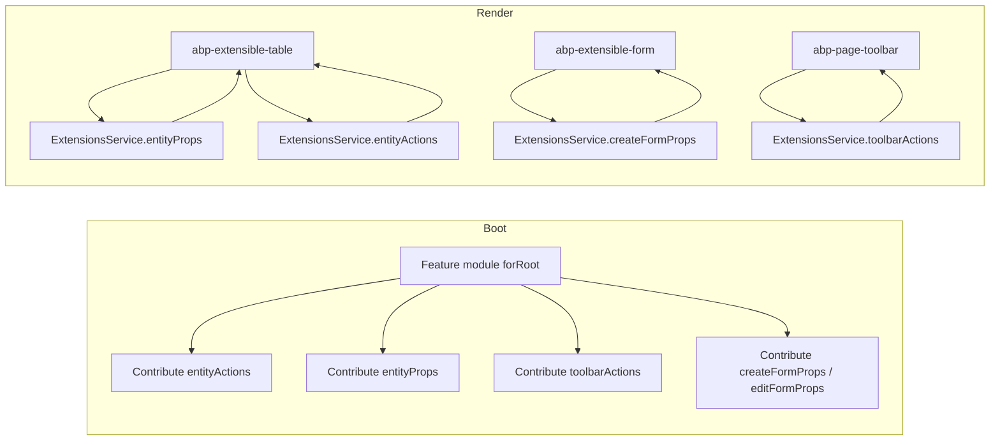

`@abp/ng.components` is the umbrella package for the ABP Angular reusable UI building blocks that go beyond the simple primitives in [`@abp/ng.theme.shared`](/ng/theme-shared). It is published as a single npm package but exposed through **four secondary entry points** — `chart.js`, `extensible`, `page`, and `tree` — so consumers can import only what they need without pulling in `chart.js` or `ng-zorro-antd` unnecessarily.

The package declares `@abp/ng.core` and `@abp/ng.theme.shared` as **peer dependencies**: it expects them to already be installed by another package higher up the tree (typically `@abp/ng.theme.basic`).

## Package layout

```text npm/ng-packs/packages/components/
components/
├── package.json          # name: "@abp/ng.components"
├── src/
│   └── public-api.ts     # empty — re-exports happen via the secondary entry points
├── chart.js/             # entry point: @abp/ng.components/chart.js
│   ├── ng-package.json
│   └── src/
│       ├── chart.component.ts
│       ├── chart.module.ts
│       ├── widget-utils.ts
│       └── public-api.ts
├── extensible/           # entry point: @abp/ng.components/extensible
│   ├── ng-package.json
│   └── src/
│       ├── lib/
│       │   ├── components/   # extensible-form, extensible-table, page-toolbar, ...
│       │   ├── directives/
│       │   ├── enums/
│       │   ├── models/       # entity-actions, entity-props, form-props, ...
│       │   ├── pipes/
│       │   ├── services/     # extensions.service.ts, extensible-form-prop.service.ts
│       │   ├── tokens/
│       │   ├── utils/
│       │   └── extensible.module.ts
│       └── public-api.ts
├── page/                 # entry point: @abp/ng.components/page
│   ├── ng-package.json
│   └── src/
│       ├── page.component.ts
│       ├── page.component.html
│       ├── page-parts.component.ts
│       ├── page-part.directive.ts
│       ├── page.module.ts
│       └── public-api.ts
└── tree/                 # entry point: @abp/ng.components/tree
    ├── ng-package.json
    └── src/
        ├── lib/
        │   ├── components/tree.component.ts
        │   ├── templates/
        │   │   ├── tree-node-template.directive.ts
        │   │   └── expanded-icon-template.directive.ts
        │   ├── utils/nz-tree-adapter.ts
        │   ├── disable-tree-style-loading.token.ts
        │   └── tree.module.ts
        └── public-api.ts
```

| Entry point | Imports as | Provides |
| --- | --- | --- |
| `@abp/ng.components/chart.js` | `ChartModule`, `ChartComponent` | Lazy-loaded chart.js wrapper for dashboards. |
| `@abp/ng.components/extensible` | `ExtensibleModule`, `ExtensionsService`, `PageToolbarComponent`, `ExtensibleFormComponent`, `ExtensibleTableComponent`, `GridActionsComponent`, `ExtensibleDateTimePickerComponent` | The "Extensible Entity Action System" — the engine behind the [Identity](/modules/identity) and [Tenant Management](/modules/tenant-management) grids. |
| `@abp/ng.components/page` | `PageModule`, `PageComponent`, `PageParts` | The standard `<abp-page>` chrome with title, breadcrumb, and toolbar slots. |
| `@abp/ng.components/tree` | `TreeModule`, `TreeComponent`, `TreeNodeTemplateDirective`, `ExpandedIconTemplateDirective`, `NzTreeAdapter` | A wrapper around `ng-zorro-antd/tree` used by the permission tree and OU tree. |

<Tip>
Each secondary entry point has its own `ng-package.json` so Angular's `ng-packagr` emits separate FESM bundles. That is why `import { ChartComponent } from '@abp/ng.components/chart.js'` is tree-shakable away from a build that does not use charts.
</Tip>

## chart.js — `@abp/ng.components/chart.js`

`ChartModule` exports a single `ChartComponent` that lazy-loads chart.js (the global `Chart` variable is resolved at runtime so the bundle is not eagerly downloaded):

```ts npm/ng-packs/packages/components/chart.js/src/chart.module.ts
@NgModule({
  imports: [CommonModule],
  exports: [ChartComponent],
  declarations: [ChartComponent],
  providers: [],
})
export class ChartModule {}
```

The component renders a `<canvas>` whose dimensions track the inputs `width`, `height`, and `responsive`:

```ts npm/ng-packs/packages/components/chart.js/src/chart.component.ts
@Component({
  selector: 'abp-chart',
  template: `
    <div
      style="position:relative"
      [style.width]="responsive && !width ? null : width"
      [style.height]="responsive && !height ? null : height"
    >
      <canvas #canvas
        [attr.width]="responsive && !width ? null : width"
        [attr.height]="responsive && !height ? null : height"
        (click)="onCanvasClick($event)"
      ></canvas>
    </div>
  `,
  changeDetection: ChangeDetectionStrategy.OnPush,
})
export class ChartComponent implements AfterViewInit, OnChanges, OnDestroy { /* ... */ }
```

Use it in dashboards along with `widget-utils.ts`, which exports helpers for building widget configurations from the application state.

## page — `@abp/ng.components/page`

`PageModule` provides the `<abp-page>` wrapper that every CRUD screen uses. It declares a single `PageComponent` and three slot containers picked up via `@ContentChild`:

```ts npm/ng-packs/packages/components/page/src/page.module.ts
@NgModule({
  declarations: [...exportedDeclarations],
  imports: [CoreModule, ThemeSharedModule, PageToolbarComponent],
  exports: [...exportedDeclarations],
})
export class PageModule {}
```

`PageComponent` exposes a `title`, an optional `toolbar` payload, and a `breadcrumb` toggle. The host template projects three named slots through `abpPagePart`:

```ts npm/ng-packs/packages/components/page/src/page.component.ts
@Component({
  selector: 'abp-page',
  templateUrl: './page.component.html',
  encapsulation: ViewEncapsulation.None,
})
export class PageComponent {
  @Input() title?: string;

  toolbarVisible = false;
  _toolbarData: any;
  @Input() set toolbar(val: any) {
    this._toolbarData = val;
    this.toolbarVisible = true;
  }

  @Input() breadcrumb = true;

  pageParts = {
    title: PageParts.title,
    breadcrumb: PageParts.breadcrumb,
    toolbar: PageParts.toolbar,
  };

  @ContentChild(PageTitleContainerComponent) customTitle?: PageTitleContainerComponent;
  @ContentChild(PageBreadcrumbContainerComponent) customBreadcrumb?: PageBreadcrumbContainerComponent;
  @ContentChild(PageToolbarContainerComponent) customToolbar?: PageToolbarContainerComponent;
}
```

Usage pattern (taken from the per-module packages):

```html
<abp-page [title]="'AbpIdentity::Users' | abpLocalization" [toolbar]="usersToolbarData">
  <!-- optional: <ng-template abpPagePart="title">...</ng-template> -->
  <abp-extensible-table [data]="data$ | async" [recordsTotal]="total$ | async"></abp-extensible-table>
</abp-page>
```

The breadcrumb slot delegates to `BreadcrumbComponent` from [`@abp/ng.theme.shared`](/ng/theme-shared#breadcrumb), and the toolbar slot delegates to `PageToolbarComponent` from the `extensible` entry point.

## tree — `@abp/ng.components/tree`

`TreeModule` wraps `ng-zorro-antd/tree` (`NzTreeModule`) with ABP-friendly templates and a token to disable lazy style loading when the application bundles its own zorro styles.

```ts npm/ng-packs/packages/components/tree/src/lib/tree.module.ts
@NgModule({
  imports: [CoreModule, NzTreeModule, NgbDropdownModule, NzNoAnimationModule],
  exports: [...exported],
  declarations: [...exported],
})
export class TreeModule {}
```

Public surface from `public-api.ts`:

```ts npm/ng-packs/packages/components/tree/src/public-api.ts
export * from './lib/tree.module';
export * from './lib/components/tree.component';
export * from './lib/utils/nz-tree-adapter';
export * from './lib/templates/tree-node-template.directive';
export * from './lib/templates/expanded-icon-template.directive';
export * from './lib/disable-tree-style-loading.token';
```

| Symbol | Purpose |
| --- | --- |
| `TreeComponent` | `<abp-tree>` — entrypoint, exposes `[data]`, `[expandedIcons]`, search, drag-and-drop. |
| `TreeNodeTemplateDirective` (`*abpTreeNodeTemplate`) | Custom rendering for each node. Used by the permission tree to show grant state. |
| `ExpandedIconTemplateDirective` (`*abpExpandedIconTemplate`) | Override the chevron icon. |
| `NzTreeAdapter` | Converts an `ABP.TreeNode<T>[]` (see `RoutesService`) into the `NzTreeNodeOptions[]` shape `ng-zorro-antd/tree` expects. |
| `DISABLE_TREE_STYLE_LOADING` (token) | Skip lazy loading the `ng-zorro-antd` stylesheet if you already bundle it. |

The same component renders:

- The permission tree opened from a user / role row — see [`@abp/ng.permission-management`](/modules/permission-management) and `PermissionService`.
- The organization unit tree under [`@abp/ng.identity`](/modules/identity).
- Any custom hierarchical picker your application needs.

## extensible — `@abp/ng.components/extensible`

The **extensible** entry point is the engine that drives every CRUD page in ABP. It exposes a typed registry — `ExtensionsService` — together with five "factories" that record the entity actions, toolbar actions, grid props, and create/edit form props for a given resource:

```ts npm/ng-packs/packages/components/extensible/src/lib/services/extensions.service.ts
@Injectable({ providedIn: 'root' })
export class ExtensionsService<R = any> {
  readonly entityActions = new EntityActionsFactory<R>();
  readonly toolbarActions = new ToolbarActionsFactory<R[]>();
  readonly entityProps = new EntityPropsFactory<R>();
  readonly createFormProps = new CreateFormPropsFactory<R>();
  readonly editFormProps = new EditFormPropsFactory<R>();
}
```

`ExtensibleModule` declares the composite components that read from the registry:

```ts npm/ng-packs/packages/components/extensible/src/lib/extensible.module.ts
const importWithExport = [
  DisabledDirective,
  ExtensibleDateTimePickerComponent,
  ExtensibleFormPropComponent,
  GridActionsComponent,
  PropDataDirective,
  PageToolbarComponent,
  CreateInjectorPipe,
  ExtensibleFormComponent,
  ExtensibleTableComponent,
];

@NgModule({
  declarations: [],
  imports: [
    CoreModule,
    ThemeSharedModule,
    NgxValidateCoreModule,
    NgbDatepickerModule, NgbDropdownModule, NgbTimepickerModule,
    NgbTooltipModule, NgbTypeaheadModule,
    ...importWithExport,
  ],
  exports: [...importWithExport],
})
export class ExtensibleModule {}
```

| Component / directive | Role |
| --- | --- |
| `ExtensibleTableComponent` | Renders a `ngx-datatable` driven by the `entityProps` factory. Reads sort, paging and selection state from `@abp/ng.theme.shared`'s `ListService` integration. |
| `ExtensibleFormComponent` | Renders a reactive form whose controls come from the `createFormProps` or `editFormProps` factory. |
| `ExtensibleFormPropComponent` | Renders a single control inside `ExtensibleFormComponent` based on its `FormProp.type`. |
| `ExtensibleDateTimePickerComponent` | NgBootstrap date+time picker honoring the localization-aware `DateParserFormatter`. |
| `GridActionsComponent` | Renders the per-row action dropdown using `entityActions`. |
| `PageToolbarComponent` | Renders the top-of-page action bar using `toolbarActions`. Used by `@abp/ng.components/page`. |
| `PropDataDirective` | Allows projecting per-prop custom templates. |
| `CreateInjectorPipe` | Builds a transient `Injector` per row so action callbacks can `inject(Service)` against the row's context. |
| `DisabledDirective` | Re-exported from `@abp/ng.theme.shared`. |

The factories use the same builder pattern — you call `add(name, props)`, `addContributor(fn)`, or `addAfter(name, ...)`. See the `models/` folder of the package (`entity-actions.ts`, `entity-props.ts`, `form-props.ts`, `toolbar-actions.ts`) for the exact builder methods.

### How a CRUD page wires the registry

The flow is identical across the `@abp/ng.identity` (users / roles), `@abp/ng.tenant-management`, and `@abp/ng.feature-management` UIs:



In practice the module's `forRoot` returns providers that push descriptors onto each factory; when a CRUD route activates, `ExtensibleTableComponent` and `ExtensibleFormComponent` pull those descriptors back out and render them.

### Where it appears in the modules

- The Users grid in [`@abp/ng.identity`](/modules/identity) — entity actions include "Edit", "Permissions" (opens `@abp/ng.permission-management`), and "Delete".
- The Tenants grid in [`@abp/ng.tenant-management`](/modules/tenant-management) — entity actions include "Features" (opens `@abp/ng.feature-management`) and "Manage host database".
- The Roles grid in [`@abp/ng.identity`](/modules/identity) — entity actions include "Permissions" and "Claims".

<Note>
The "Permissions" entity action opens a modal that mounts the tree from `@abp/ng.components/tree`, fed by `PermissionService`. So every ABP CRUD page is in fact a composition of `page` → `extensible` → `tree` → primitives from `theme-shared`.
</Note>

## Choosing the right entry point

| You want to… | Import from |
| --- | --- |
| Render the standard page header with title + toolbar slots | `@abp/ng.components/page` |
| Render an extensible CRUD table with `<abp-extensible-table>` | `@abp/ng.components/extensible` |
| Render an extensible form with `<abp-extensible-form>` | `@abp/ng.components/extensible` |
| Render a tree (permissions, OUs, custom) | `@abp/ng.components/tree` |
| Render a chart in a dashboard widget | `@abp/ng.components/chart.js` |

## Cross-references

- The components above call into the runtime services from [`@abp/ng.core`](/ng/core): `PermissionService`, `ConfigStateService`, `ListService`, `RoutesService`.
- Visual primitives — buttons, modals, toasts, confirmations — live in [`@abp/ng.theme.shared`](/ng/theme-shared).
- The layout components in [`@abp/ng.theme.basic`](/ng/theme-basic) mount `<abp-page>` inside `<abp-layout-application>`.
- Schematics like `proxy-add` and `api` generate the typed services that `ExtensibleTableComponent` calls — see [Schematics & Generators](/ng/schematics-and-generators).
- The feature module integrations live with the matching backend docs: [Identity](/modules/identity), [Permission Management](/modules/permission-management), [Setting Management](/modules/setting-management), [Feature Management](/modules/feature-management), [Tenant Management](/modules/tenant-management).
