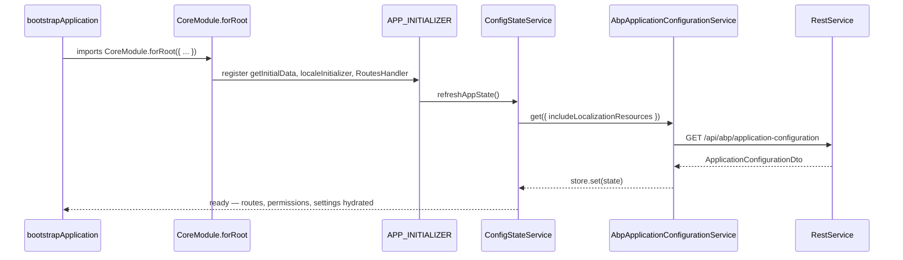

`@abp/ng.core` is the foundation of the ABP Angular UI. Every other `@abp/ng.*` package depends on it, either as a hard `dependencies` entry or through `peerDependencies`. The library hosts the root module bootstrapper, the runtime configuration store fed by ABP's `/api/abp/application-configuration` endpoint, the typed `RestService` clients that every generated proxy uses, the authentication abstraction that `@abp/ng.oauth` plugs into, plus the localization, permission, session, and routing services that drive the rest of the UI.

If you are reading the ABP Angular source for the first time, this is the package to read first — almost every type referenced from `@abp/ng.theme.shared`, `@abp/ng.theme.basic`, or the per-module packages is re-exported from here.

## File inventory

```text npm/ng-packs/packages/core/src/lib/
abstracts/        # auth.service.ts, auth.guard.ts, auth-response.model.ts, ng-model.component.ts
clients/          # ExternalHttpClient wrapper around HttpClient
components/       # dynamic-layout, replaceable-route-container, router-outlet
constants/        # DEFAULT_DYNAMIC_LAYOUTS and other constants
core.module.ts    # CoreModule.forRoot / forChild — entry point
directives/       # autofocus, debounce, for, form-submit, init, permission, replaceable-template, stop-propagation
enums/
guards/
handlers/         # routes.handler.ts  (runs on APP_INITIALIZER)
interceptors/     # api.interceptor.ts  (ApiInterceptor base — OAuth replaces it)
localization.module.ts
models/           # auth, common (ABP.* namespace), environment, rest, session, ...
pipes/            # localization, sort, safe-html, short-date, short-time, short-date-time, to-injector
providers/        # cookie-language, locale, include-localization-resources
proxy/            # generated proxies (volo/abp/asp-net-core/mvc/application-configurations, multi-tenancy, ...)
services/         # the runtime services described below
strategies/       # content / context / cross-origin / loading / projection
tokens/           # InjectionTokens — CORE_OPTIONS, TENANT_KEY, LOCALIZATIONS, DYNAMIC_LAYOUTS_TOKEN, ...
utils/
validators/
```

The runtime entry point is `core.module.ts`:

| Symbol | Purpose |
| --- | --- |
| `BaseCoreModule` | Re-exports `CommonModule`, `HttpClientModule`, `FormsModule`, `ReactiveFormsModule`, `RouterModule`, `LocalizationModule`, ABP pipes and the standalone ABP directives. Imported by every other ABP `@NgModule`. |
| `RootCoreModule` | Adds `HttpClientXsrfModule` with the ABP-specific cookie + header (`XSRF-TOKEN` / `RequestVerificationToken`). |
| `CoreModule.forRoot(options)` | Called once in the host application. Registers locale + language providers, four `APP_INITIALIZER` factories, the localization contributor, the queue manager, the sort compare function, and the dynamic layouts map. |
| `CoreModule.forChild(options)` | Called by lazy-loaded ABP feature modules to contribute localization keys without re-running the root initializers. |

## Bootstrapping with `CoreModule.forRoot`

The `forRoot` factory below is the canonical wiring you will see inside `app.module.ts` of an ABP Angular application:

```ts npm/ng-packs/packages/core/src/lib/core.module.ts
static forRoot(options = {} as ABP.Root): ModuleWithProviders<RootCoreModule> {
  return {
    ngModule: RootCoreModule,
    providers: [
      LocaleProvider,
      CookieLanguageProvider,
      { provide: 'CORE_OPTIONS', useValue: options },
      { provide: CORE_OPTIONS, useFactory: coreOptionsFactory, deps: ['CORE_OPTIONS'] },
      { provide: APP_INITIALIZER, multi: true, deps: [Injector],            useFactory: getInitialData },
      { provide: APP_INITIALIZER, multi: true, deps: [Injector],            useFactory: localeInitializer },
      { provide: APP_INITIALIZER, multi: true, deps: [LocalizationService], useFactory: noop },
      { provide: APP_INITIALIZER, multi: true, deps: [RoutesHandler],       useFactory: noop },
      { provide: TENANT_KEY, useValue: options.tenantKey || '__tenant' },
      { provide: LOCALIZATIONS, multi: true,
        useValue: localizationContributor(options.localizations),
        deps: [LocalizationService] },
      { provide: SORT_COMPARE_FUNC, useFactory: compareFuncFactory },
      { provide: QUEUE_MANAGER, useClass: DefaultQueueManager },
      { provide: OTHERS_GROUP, useValue: options.othersGroup || 'AbpUi::OthersGroup' },
      AuthErrorFilterService,
      IncludeLocalizationResourcesProvider,
      { provide: DYNAMIC_LAYOUTS_TOKEN,
        useValue: options.dynamicLayouts || DEFAULT_DYNAMIC_LAYOUTS },
    ],
  };
}
```

Four `APP_INITIALIZER` factories run before the application starts rendering:

1. `getInitialData` — calls `ConfigStateService.refreshAppState()` so the in-memory store is populated before any guard or component runs.
2. `localeInitializer` — registers the Angular `LOCALE_ID` provider based on the current culture.
3. `LocalizationService` — pre-warms the localization map so synchronous lookups during the first render do not fail.
4. `RoutesHandler` — converts the contributed `ABP.Route[]` declarations into the runtime tree consumed by `RoutesService`.

<Tip>
`TENANT_KEY` defaults to `'__tenant'`, which matches the cookie/header that the [Multi-Tenancy module](/modules/tenant-management) reads on the server. Override it through `CoreModule.forRoot({ tenantKey: '...' })` only if you also reconfigured the backend.
</Tip>

## Services reference

The table summarizes the public services exported from `src/lib/services/index.ts` and `src/lib/abstracts/index.ts`. Detailed signatures follow.

| Service | Provided in | Responsibility |
| --- | --- | --- |
| `RestService` | `'root'` | Wraps `HttpClient`, resolves the API URL from `EnvironmentService`, dispatches errors through `HttpErrorReporterService`. |
| `EnvironmentService` | `'root'` | In-memory store of the `Environment` object (apis, oAuthConfig, application info). |
| `ConfigStateService` | `'root'` | In-memory store of the `ApplicationConfigurationDto` returned by `/api/abp/application-configuration`. |
| `AbpApplicationConfigurationService` | `'root'` | Generated proxy that calls the configuration endpoint. |
| `SessionStateService` | `'root'` | Persists `language`, `tenant`, and other session bits in `localStorage` under key `abpSession`. |
| `SubscriptionService` | per component | Aggregating `Subscription` you `provide` at component level for automatic teardown. |
| `PermissionService` | `'root'` | Reads `auth.grantedPolicies` from `ConfigStateService` and evaluates `policy1 || policy2` expressions. |
| `LocalizationService` | `'root'` | Resolves `L::Key` / `LocalizationParam` against the contributed localization map. |
| `RoutesService` | `'root'` | Tree of ABP routes contributed via `CoreModule.forRoot({ routes })` or `forChild`. |
| `HttpErrorReporterService` | `'root'` | Emits `Subject<HttpErrorResponse>` that `@abp/ng.theme.shared` subscribes to. |
| `HttpWaitService` | `'root'` | Tracks in-flight `HttpRequest` for the global loader bar. |
| `AbpLocalStorageService` | `'root'` | Thin wrapper around `localStorage` (used by `SessionStateService`, `OAuthStorage`). |
| `AuthService` (abstract) | `'root'` | Default placeholder. Replaced by `AbpOAuthService` from [`@abp/ng.oauth`](/ng/oauth) via `useClass`. |

### `RestService`

`RestService` is what every generated proxy under `src/lib/proxy/**` calls. It normalizes the request URL by resolving the API base from `EnvironmentService`, applies the configured query encoder, and pipes errors through `HttpErrorReporterService` unless `skipHandleError` is set:

```ts npm/ng-packs/packages/core/src/lib/services/rest.service.ts
@Injectable({ providedIn: 'root' })
export class RestService {
  constructor(
    @Inject(CORE_OPTIONS) protected options: ABP.Root,
    protected http: HttpClient,
    protected externalHttp: ExternalHttpClient,
    protected environment: EnvironmentService,
    protected httpErrorReporter: HttpErrorReporterService,
  ) {}

  request<T, R>(
    request: HttpRequest<T> | Rest.Request<T>,
    config?: Rest.Config,
    api?: string,
  ): Observable<R> {
    config = config || ({} as Rest.Config);
    api = api || this.getApiFromStore(config.apiName);
    const { method, params, ...options } = request;
    const { observe = Rest.Observe.Body, skipHandleError } = config;
    const url = this.removeDuplicateSlashes(api + request.url);

    const httpClient: HttpClient = this.getHttpClient(config.skipAddingHeader);
    return httpClient
      .request<R>(method, url, {
        observe,
        ...(params && { params: this.getParams(params, config.httpParamEncoder) }),
        ...options,
      } as any)
      .pipe(catchError(err => (skipHandleError ? throwError(err) : this.handleError(err))));
  }
}
```

`Rest.Config` carries the per-call options recognised by `RestService`:

- `apiName` — selects an entry from `EnvironmentService.apis` (defaults to `"default"`).
- `skipHandleError` — disables the global error reporter for this call.
- `skipAddingHeader` — routes the request through `ExternalHttpClient` (no ABP headers, no XSRF).
- `httpParamEncoder` — custom `HttpParameterCodec`.
- `observe` — defaults to `Rest.Observe.Body`; switch to `Response` to access status/headers.

### `EnvironmentService`

`EnvironmentService` holds a typed `Environment` object — the same shape you put inside `src/environments/environment.ts`. `RestService` calls `getApiUrl(apiName)` to resolve absolute base URLs and `@abp/ng.oauth` reads `getIssuer()` to configure `angular-oauth2-oidc`.

```ts npm/ng-packs/packages/core/src/lib/services/environment.service.ts
@Injectable({ providedIn: 'root' })
export class EnvironmentService {
  private readonly store = new InternalStore({} as Environment);

  getEnvironment(): Environment { return this.store.state; }
  getEnvironment$(): Observable<Environment> {
    return this.store.sliceState(state => state);
  }
  getApiUrl(key: string | undefined) { return mapToApiUrl(key)(this.store.state?.apis); }
  getApiUrl$(key: string) {
    return this.store.sliceState(state => state.apis).pipe(map(mapToApiUrl(key)));
  }
  setState(environment: Environment) { this.store.set(environment); }
  getIssuer() {
    const issuer = this.store.state?.oAuthConfig?.issuer;
    return mapToIssuer(issuer);
  }
}
```

The `mapToIssuer` helper guarantees the issuer ends with a trailing `/`, which `angular-oauth2-oidc` requires.

### `ConfigStateService` + `AbpApplicationConfigurationService`

`ConfigStateService` is the in-memory snapshot of the ABP application configuration. The constructor refreshes the store every time `refreshAppState()` is called by calling the generated proxy below and merging the localization payload back into the state:

```ts npm/ng-packs/packages/core/src/lib/proxy/.../abp-application-configuration.service.ts
@Injectable({ providedIn: 'root' })
export class AbpApplicationConfigurationService {
  apiName = 'abp';

  get = (options: ApplicationConfigurationRequestOptions) =>
    this.restService.request<any, ApplicationConfigurationDto>(
      {
        method: 'GET',
        url: '/api/abp/application-configuration',
        params: { includeLocalizationResources: options.includeLocalizationResources },
      },
      { apiName: this.apiName },
    );

  constructor(private restService: RestService) {}
}
```

The merging happens in `ConfigStateService.initUpdateStream()`:

```ts npm/ng-packs/packages/core/src/lib/services/config-state.service.ts
private initUpdateStream() {
  this.updateSubject
    .pipe(
      switchMap(() =>
        this.abpConfigService.get({
          includeLocalizationResources: !!this.includeLocalizationResources,
        }),
      ),
    )
    .pipe(switchMap(appState => this.getLocalizationAndCombineWithAppState(appState)))
    .subscribe(res => this.store.set(res));
}

refreshAppState() {
  this.updateSubject.next();
  return this.createOnUpdateStream(state => state).pipe(take(1));
}
```

Consumers typically subscribe with the selector helpers:

- `getOne$(prop)` / `getOne(prop)` — top-level key lookup.
- `getDeep$('localization.currentCulture.cultureName')` — dotted path lookup.
- `getFeature$(key)` / `getSetting$(key)` — type-safe shortcuts.
- `getGrantedPolicy$('AbpIdentity.Users.Update')` — delegates to `PermissionService`.

### `SessionStateService`

`SessionStateService` persists the user's chosen language and tenant in `localStorage` under the key `abpSession`. It also reacts to the server's `localization.currentCulture.cultureName` and re-fetches the application configuration when the language changes.

```ts npm/ng-packs/packages/core/src/lib/services/session-state.service.ts
@Injectable({ providedIn: 'root' })
export class SessionStateService {
  private readonly store = new InternalStore({} as Session.State);

  constructor(
    private configState: ConfigStateService,
    private localStorageService: AbpLocalStorageService,
  ) {
    this.init();
    this.setInitialLanguage();
  }

  private init() {
    const session = this.localStorageService.getItem('abpSession');
    if (session) this.store.set(JSON.parse(session));
    this.store.sliceUpdate(state => state).subscribe(this.updateLocalStorage);
  }
}
```

Use `setLanguage(lang)` and `setTenant(tenant)` to mutate state; everything else (`onLanguageChange$`, `onTenantChange$`, `getLanguage`, `getTenant`) is read-only.

### `SubscriptionService`

A scoped `Subscription` aggregator. Provide it at the component level (`providers: [SubscriptionService]`) and add to it via `addOne`; the service unsubscribes automatically in `ngOnDestroy`.

```ts npm/ng-packs/packages/core/src/lib/services/subscription.service.ts
@Injectable()
export class SubscriptionService implements OnDestroy {
  private subscription = new Subscription();

  addOne<T>(source$: Observable<T>, next?: (value: T) => void,
            error?: (error: any) => void): Subscription;
  addOne<T>(source$: Observable<T>, observer?: PartialObserver<T>): Subscription;
  addOne<T>(source$: Observable<T>, nextOrObserver?: PartialObserver<T> | Next<T>,
            error?: (error: any) => void): Subscription {
    const subscription = source$.subscribe(nextOrObserver as Next<T>, error);
    this.subscription.add(subscription);
    return subscription;
  }

  closeAll() { this.subscription.unsubscribe(); }
  reset() { this.subscription.unsubscribe(); this.subscription = new Subscription(); }
  ngOnDestroy(): void { this.subscription.unsubscribe(); }
}
```

### `PermissionService`

`PermissionService` reads `auth.grantedPolicies` from `ConfigStateService` and supports `||` / `&&` expressions in permission keys.

```ts npm/ng-packs/packages/core/src/lib/services/permission.service.ts
@Injectable({ providedIn: 'root' })
export class PermissionService {
  constructor(protected configState: ConfigStateService) {}

  getGrantedPolicy$(key: string) {
    return this.getStream().pipe(
      map(grantedPolicies => this.isPolicyGranted(key, grantedPolicies)),
    );
  }

  getGrantedPolicy(key: string | undefined) {
    const policies = this.getSnapshot();
    return this.isPolicyGranted(key, policies);
  }

  filterItemsByPolicy<T extends ABP.HasPolicy>(items: Array<T>) {
    const policies = this.getSnapshot();
    return items.filter(
      item => !item.requiredPolicy || this.isPolicyGranted(item.requiredPolicy, policies),
    );
  }
}
```

The `PermissionDirective` (`*abpPermission="'AbpIdentity.Users.Update'"`) and the `[abpPermission]` attribute selector both build on this service.

## Authentication abstraction

`@abp/ng.core` ships an abstract `AuthService` and a default no-op implementation. Production apps register `@abp/ng.oauth` (see [/ng/oauth](/ng/oauth)) which provides `AbpOAuthService` via `useClass`.

```ts npm/ng-packs/packages/core/src/lib/abstracts/auth.service.ts
@Injectable({ providedIn: 'root' })
export class AuthService implements IAuthService {
  private warningMessage() {
    console.error('You should add @abp/ng-oauth packages or create your own auth packages.');
  }

  init(): Promise<any> { this.warningMessage(); return Promise.resolve(undefined); }
  login(params: LoginParams): Observable<any> { this.warningMessage(); return of(undefined); }
  logout(queryParams?: Params): Observable<any> { this.warningMessage(); return of(undefined); }
  navigateToLogin(queryParams?: Params): void {}
  get isInternalAuth(): boolean { throw new Error('not implemented'); }
  get isAuthenticated(): boolean { this.warningMessage(); return false; }
  loginUsingGrant(grantType: string, parameters: object, headers?: HttpHeaders): Promise<AbpAuthResponse> {
    return Promise.reject(new Error('not implemented'));
  }
}
```

The `IAuthService` interface is the contract every flow strategy implements. `@abp/ng.oauth` selects between the **code flow** and **password flow** strategies based on the runtime `oAuthConfig.responseType`.

## HTTP interceptor

`ApiInterceptor` is the base class. The version in `@abp/ng.core` only tracks in-flight requests for `HttpWaitService` — the authentication-aware version lives in `@abp/ng.oauth` and is swapped in via `{ provide: ApiInterceptor, useClass: OAuthApiInterceptor }`:

```ts npm/ng-packs/packages/core/src/lib/interceptors/api.interceptor.ts
@Injectable({ providedIn: 'root' })
export class ApiInterceptor implements IApiInterceptor {
  constructor(private httpWaitService: HttpWaitService) {}

  getAdditionalHeaders(existingHeaders?: HttpHeaders) {
    return existingHeaders || new HttpHeaders();
  }

  intercept(request: HttpRequest<any>, next: HttpHandler) {
    this.httpWaitService.addRequest(request);
    return next.handle(request).pipe(finalize(() => this.httpWaitService.deleteRequest(request)));
  }
}
```

`HttpWaitService` is what powers the global `LoaderBarComponent` in `@abp/ng.theme.shared`. Every outgoing request increases the counter; every completion decreases it.

<Note>
The OAuth-aware `OAuthApiInterceptor` adds the `Authorization: Bearer …` header, the current tenant header (`TENANT_KEY`), the `Accept-Language` header, and `X-Requested-With: XMLHttpRequest`. See [`@abp/ng.oauth`](/ng/oauth#oauthapiinterceptor) for the full implementation.
</Note>

## Tokens you will inject

The tokens under `src/lib/tokens/` are the main extension points for end-user applications:

| Token | Purpose |
| --- | --- |
| `CORE_OPTIONS` | Frozen `ABP.Root` passed to `CoreModule.forRoot`. |
| `TENANT_KEY` | Header / cookie name used by [Multi-Tenancy](/modules/tenant-management). Default `__tenant`. |
| `LOCALIZATIONS` | Multi-provider for adding localization keys at runtime. |
| `OTHERS_GROUP` | Localization key for the "Others" navigation group. |
| `DYNAMIC_LAYOUTS_TOKEN` | Map from `eLayoutType` to layout components, consumed by `DynamicLayoutComponent`. |
| `INCUDE_LOCALIZATION_RESOURCES_TOKEN` | Whether `/api/abp/application-configuration` should embed localization resources. (Note: `INCUDE` is the actual symbol in source — there is a long-standing typo for the missing `L`.) |
| `PIPE_TO_LOGIN_FN_KEY` | Function used by guards to redirect to the login flow (`@abp/ng.oauth` provides one). |
| `CHECK_AUTHENTICATION_STATE_FN_KEY` | Function used by `RoutesHandler` to decide if a route is reachable. |
| `MANAGE_PROFILE_TOKEN` | URL/component used to navigate to "Manage profile". |
| `QUEUE_MANAGER` | Provides `DefaultQueueManager` (used by lazy load / route hooks). |
| `SORT_COMPARE_FUNC` | Comparator passed to `SortPipe` and `AbstractTreeService`. |

## How modules consume `@abp/ng.core`

The pattern is repeated across `@abp/ng.identity`, `@abp/ng.permission-management`, `@abp/ng.setting-management`, `@abp/ng.feature-management`, `@abp/ng.tenant-management`, and `@abp/ng.account.core`:

1. The feature module calls `CoreModule.forChild({ localizations })` to contribute localization keys without re-running the root initializers.
2. Generated proxies under `src/lib/proxy/**` of each package call `RestService` with their `apiName`.
3. Components read state through `ConfigStateService` selectors (`getOne$`, `getDeep$`, `getSetting$`, `getFeature$`).
4. Routes are contributed through `RoutesService.add(...)` so they appear in the side menu rendered by `@abp/ng.theme.basic`.

Cross-references:

- The [Permission Management module](/modules/permission-management) is consumed via `PermissionService` and `*abpPermission`.
- The [Setting Management module](/modules/setting-management) exposes settings through `ConfigStateService.getSetting$`.
- The [Feature Management module](/modules/feature-management) exposes feature flags through `ConfigStateService.getFeature$`.
- The [Tenant Management module](/modules/tenant-management) consumes `SessionStateService.setTenant` to switch tenant.
- The [Account module](/modules/account) drives the login/register screens rendered by `@abp/ng.theme.basic`'s `AccountLayoutComponent`.

## Runtime data flow



After bootstrap, every component can synchronously read `ConfigStateService.getOne('auth')` or subscribe to `ConfigStateService.getDeep$('setting.values.Abp.Localization.DefaultLanguage')` to react to runtime changes.

## Where to go next

- [`@abp/ng.theme.shared`](/ng/theme-shared) — UI primitives (toast, modal, confirmation, validation) that consume `LocalizationService` and `HttpErrorReporterService`.
- [`@abp/ng.theme.basic`](/ng/theme-basic) — default layouts that consume `RoutesService` and `SessionStateService`.
- [`@abp/ng.oauth`](/ng/oauth) — replaces the placeholder `AuthService` with the real OpenID Connect implementation.
- [Schematics & Generators](/ng/schematics-and-generators) — generate proxies that call `RestService` for new backend modules.
