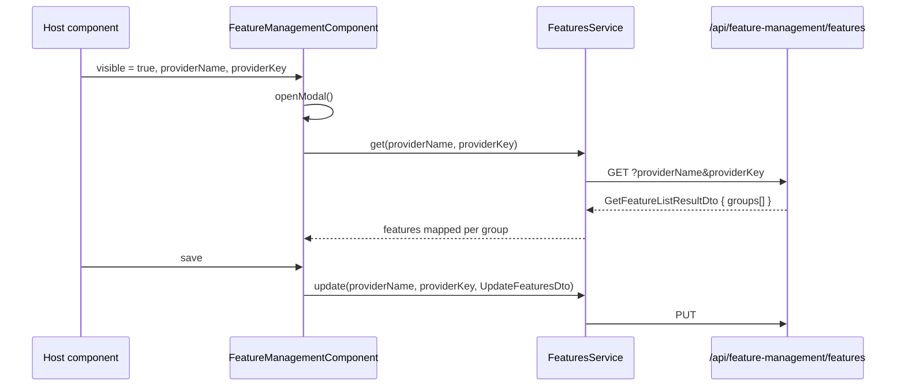

`@abp/ng.feature-management` is the Angular UI for the **Feature Management** modal: a tabbed dialog that lists grouped features (toggle, free-text, or selection), edits their values for the current `providerName` / `providerKey` (typically `T` + a tenant id), and persists them through the `FeaturesService` proxy. The package also contributes a tab to the central Setting Management screen, allowing host admins to manage host-level features from `Administration → Settings → Feature Management`.

Other UI modules — `@abp/ng.tenant-management`, `@abp/ng.identity` — embed `<abp-feature-management>` against the `eFeatureManagementComponents.FeatureManagement` replaceable-component key.

<Info>
  Published as **`@abp/ng.feature-management`** from `npm/ng-packs/packages/feature-management`. Generated proxies live at **`@abp/ng.feature-management/proxy`**.
</Info>

## File inventory

```text packages/feature-management/src/lib
src/lib/
├── feature-management.module.ts          # FeatureManagementModule.forRoot
├── components/
│   ├── index.ts
│   ├── feature-management/
│   │   └── feature-management.component.ts   # <abp-feature-management>
│   └── feature-management-tab/
│       └── feature-management-tab.component.ts # <abp-feature-management-tab>
├── directives/
│   ├── index.ts
│   └── free-text-input.directive.ts      # [abpFeatureManagementFreeText]
├── enums/
│   ├── components.ts                     # eFeatureManagementComponents
│   ├── feature-management-tab-names.ts   # eFeatureManagementTabNames
│   └── index.ts
├── models/
│   ├── feature-management.ts             # FeatureManagement namespace
│   └── index.ts
└── providers/
    ├── feature-management-settings.provider.ts # APP_INITIALIZER → SettingTabsService.add
    └── index.ts
```

```text packages/feature-management/proxy/src/lib/proxy
proxy/
├── feature-management/
│   ├── features.service.ts               # FeaturesService
│   └── models.ts                         # FeatureDto, FeatureGroupDto, ...
└── validation/
    └── string-values/models.ts           # IStringValueType, ToggleStringValueType, ...
```

| File | Symbol | Kind |
| --- | --- | --- |
| `feature-management.module.ts` | `FeatureManagementModule` | NgModule (`forRoot`) |
| `components/feature-management/...` | `FeatureManagementComponent` | `<abp-feature-management>` (modal) |
| `components/feature-management-tab/...` | `FeatureManagementTabComponent` | `<abp-feature-management-tab>` (settings tab) |
| `directives/free-text-input.directive.ts` | `FreeTextInputDirective` | sets `<input type>` from validator |
| `providers/feature-management-settings.provider.ts` | `FEATURE_MANAGEMENT_SETTINGS_PROVIDERS` | APP_INITIALIZER |
| `enums/components.ts` | `eFeatureManagementComponents` | replaceable keys |
| `models/feature-management.ts` | `FeatureManagement.*` | inputs / outputs typings |

## Public API

```ts packages/feature-management/src/public-api.ts
export * from './lib/components';
export * from './lib/directives';
export * from './lib/providers';
export * from './lib/enums/components';
export * from './lib/feature-management.module';
export * from './lib/models';
```

## FeatureManagementModule

```ts packages/feature-management/src/lib/feature-management.module.ts
const exported = [
  FeatureManagementComponent,
  FreeTextInputDirective,
  FeatureManagementTabComponent,
];

@NgModule({
  declarations: [...exported],
  imports: [CoreModule, ThemeSharedModule, NgbNavModule],
  exports: [...exported],
})
export class FeatureManagementModule {
  static forRoot(): ModuleWithProviders<FeatureManagementModule> {
    return {
      ngModule: FeatureManagementModule,
      providers: [FEATURE_MANAGEMENT_SETTINGS_PROVIDERS],
    };
  }
}
```

`forRoot()` is what registers the **Feature Management** settings tab. Modules that only need to open the modal (e.g. tenant-management) import the module without `forRoot`.

## FeatureManagementComponent

```ts packages/feature-management/src/lib/components/feature-management/feature-management.component.ts
@Component({
  selector: 'abp-feature-management',
  templateUrl: './feature-management.component.html',
  exportAs: 'abpFeatureManagement',
})
export class FeatureManagementComponent
  implements
    FeatureManagement.FeatureManagementComponentInputs,
    FeatureManagement.FeatureManagementComponentOutputs
{
  @Input() providerKey: string;
  @Input() providerName: string;

  selectedGroupDisplayName: string;
  groups: Pick<FeatureGroupDto, 'name' | 'displayName'>[] = [];
  features: {
    [group: string]: Array<FeatureDto & { style?: { [key: string]: number }; initialValue: any }>;
  };

  valueTypes = ValueTypes;          // 'ToggleStringValueType' | 'FreeTextStringValueType' | 'SelectionStringValueType'

  protected _visible;
  @Input() get visible(): boolean { return this._visible; }
  set visible(value: boolean) {
    if (this._visible === value) return;
    this._visible = value;
    this.visibleChange.emit(value);
    if (value) this.openModal();
  }

  @Output() readonly visibleChange = new EventEmitter<boolean>();
  modalBusy = false;

  constructor(
    public readonly track: TrackByService,
    private toasterService: ToasterService,
    protected service: FeaturesService,
    protected configState: ConfigStateService,
    protected confirmationService: ConfirmationService,
  ) {}

  openModal() {
    if (!this.providerName) throw new Error('providerName is required.');
    this.getFeatures();
  }
}
```

The contract is declared in:

```ts packages/feature-management/src/lib/models/feature-management.ts
export namespace FeatureManagement {
  export interface FeatureManagementComponentInputs {
    visible: boolean;
    readonly providerName: string;
    readonly providerKey: string;
  }
  export interface FeatureManagementComponentOutputs {
    readonly visibleChange: EventEmitter<boolean>;
  }
}
```

### Usage from a host component

```html
<abp-feature-management
  [(visible)]="visibleFeatures"
  providerName="T"
  [providerKey]="selectedTenantId">
</abp-feature-management>
```

`providerName = "T"` targets a tenant; `"E"` targets an edition; an empty string targets the host. The set of providers comes from the server-side `IFeatureManagementProvider` chain.

### Replaceable key

```ts packages/feature-management/src/lib/enums/components.ts
export const enum eFeatureManagementComponents {
  FeatureManagement = 'FeatureManagement.FeatureManagementComponent',
}
```

`@abp/ng.tenant-management` uses this key when rendering its row action: see [Tenant Management UI](/ng/tenant-management-ui).

## FeatureManagementTabComponent

The thin wrapper that hosts the modal inside the central settings screen:

```ts packages/feature-management/src/lib/components/feature-management-tab/feature-management-tab.component.ts
@Component({
  selector: 'abp-feature-management-tab',
  templateUrl: './feature-management-tab.component.html',
})
export class FeatureManagementTabComponent {
  visibleFeatures = false;
  providerKey: string;

  openFeaturesModal() { this.visibleFeatures = true; }
  onVisibleFeaturesChange = (value: boolean) => { this.visibleFeatures = value; };
}
```

It is registered as a `SettingTabsService` entry by the provider below.

## FreeTextInputDirective

Mutates `<input type>` to `number` when the server-side validator metadata is numeric — so free-text features that expect counts render the right keyboard / spinner:

```ts packages/feature-management/src/lib/directives/free-text-input.directive.ts
export const INPUT_TYPES = {
  numeric: 'number',
  default: 'text',
};

@Directive({
  selector: 'input[abpFeatureManagementFreeText]',
  exportAs: 'inputAbpFeatureManagementFreeText',
})
export class FreeTextInputDirective {
  _feature: FreeTextType;
  @Input('abpFeatureManagementFreeText') set feature(val: FreeTextType) {
    this._feature = val;
    this.setInputType();
  }
  get feature() { return this._feature; }

  @HostBinding('type') type: string;

  private setInputType() {
    const validatorType = this.feature?.valueType?.validator?.name.toLowerCase();
    this.type = INPUT_TYPES[validatorType] ?? INPUT_TYPES.default;
  }
}
```

## Settings-tab provider

```ts packages/feature-management/src/lib/providers/feature-management-settings.provider.ts
export const FEATURE_MANAGEMENT_SETTINGS_PROVIDERS = [
  {
    provide: APP_INITIALIZER,
    useFactory: configureSettingTabs,
    deps: [SettingTabsService],
    multi: true,
  },
];

export function configureSettingTabs(settingtabs: SettingTabsService) {
  return () => {
    settingtabs.add([
      {
        name: eFeatureManagementTabNames.FeatureManagement,
        order: 100,
        requiredPolicy: 'FeatureManagement.ManageHostFeatures',
        component: FeatureManagementTabComponent,
      },
    ]);
  };
}
```

```ts packages/feature-management/src/lib/enums/feature-management-tab-names.ts
export const enum eFeatureManagementTabNames {
  FeatureManagement = 'AbpFeatureManagement::Permission:FeatureManagement',
}
```

The tab only shows when the current user has `FeatureManagement.ManageHostFeatures` — `SettingTabsService` extends the framework's `AbstractNavTreeService<ABP.Tab>` and filters with `PermissionService`. See [Setting Management UI](/ng/setting-management-ui).

## FeaturesService proxy

```ts packages/feature-management/proxy/src/lib/proxy/feature-management/features.service.ts
@Injectable({ providedIn: 'root' })
export class FeaturesService {
  apiName = 'AbpFeatureManagement';

  delete = (providerName: string, providerKey: string) =>
    this.restService.request<any, void>(
      { method: 'DELETE',
        url: '/api/feature-management/features',
        params: { providerName, providerKey } },
      { apiName: this.apiName });

  get = (providerName: string, providerKey: string) =>
    this.restService.request<any, GetFeatureListResultDto>(
      { method: 'GET',
        url: '/api/feature-management/features',
        params: { providerName, providerKey } },
      { apiName: this.apiName });

  update = (providerName: string, providerKey: string, input: UpdateFeaturesDto) =>
    this.restService.request<any, void>(
      { method: 'PUT',
        url: '/api/feature-management/features',
        params: { providerName, providerKey },
        body: input },
      { apiName: this.apiName });

  constructor(private restService: RestService) {}
}
```

### DTOs

```ts packages/feature-management/proxy/src/lib/proxy/feature-management/models.ts
export interface FeatureDto {
  name?: string;
  displayName?: string;
  value?: string;
  provider: FeatureProviderDto;
  description?: string;
  valueType: IStringValueType;        // discriminated union
  depth: number;
  parentName?: string;
}

export interface FeatureGroupDto {
  name?: string;
  displayName?: string;
  features: FeatureDto[];
}

export interface FeatureProviderDto { name?: string; key?: string; }

export interface GetFeatureListResultDto { groups: FeatureGroupDto[]; }

export interface UpdateFeatureDto  { name?: string; value?: string; }
export interface UpdateFeaturesDto { features: UpdateFeatureDto[]; }
```

`IStringValueType` lives under `validation/string-values/models.ts` and discriminates between **Toggle** (checkbox), **FreeText** (input), and **Selection** (`<select>` with a `localizableItems` array). The `FeatureManagementComponent` template branches on `valueTypes` and uses `FreeTextInputDirective` to choose the right HTML input.

## How it loads features



## Module dependency graph

```mermaid
graph LR
  AppModule
  Settings[SettingManagementConfigModule]
  FM[FeatureManagementModule]
  Tenant[TenantManagementModule]
  Identity[IdentityModule]
  Proxy[@abp/ng.feature-management/proxy]

  AppModule -. eager .-> Settings
  AppModule -. lazy /feature-management .-> FM
  FM --> Proxy
  Tenant --> FM
  Identity -. composition .-> FM
```

## Embedding the modal

<Steps>
  <Step title="Import the module (no forRoot for embedders)">
    ```ts
    @NgModule({
      imports: [FeatureManagementModule],
    })
    ```
  </Step>
  <Step title="Add the host element">
    ```html
    <button (click)="open = true">Edit features</button>
    <abp-feature-management
      [(visible)]="open"
      providerName="T"
      [providerKey]="tenant.id">
    </abp-feature-management>
    ```
  </Step>
  <Step title="(Optional) replace via ReplaceableComponentsService">
    Use key `eFeatureManagementComponents.FeatureManagement` to swap the modal for a branded version.
  </Step>
</Steps>

## Configuration recipes

<CardGroup cols={2}>
  <Card title="Per-edition features" icon="layer-group">
    Use `providerName="E"` and pass the edition id as `providerKey` — the same endpoint resolves through `IFeatureValueProvider`s.
  </Card>
  <Card title="Manage host features" icon="server">
    Grant `FeatureManagement.ManageHostFeatures` and the host tab appears under **Settings**.
  </Card>
  <Card title="Reset to defaults" icon="rotate-left">
    Call `featuresService.delete(providerName, providerKey)` from a custom action; the UI re-fetches and shows inherited values.
  </Card>
  <Card title="Custom value type" icon="puzzle-piece">
    Register a new `IStringValueType` server-side; extend the component's template through ReplaceableComponents to render it.
  </Card>
</CardGroup>

## Related pages

<CardGroup cols={2}>
  <Card title="Setting Management UI" href="/ng/setting-management-ui" icon="sliders">
    `SettingTabsService` host that renders `<abp-feature-management-tab>`.
  </Card>
  <Card title="Tenant Management UI" href="/ng/tenant-management-ui" icon="building">
    Row-level "Features" action that opens this modal with `providerName="T"`.
  </Card>
  <Card title="ng.core" href="/ng/core" icon="cubes">
    `ConfigStateService`, `ConfirmationService`, `TrackByService`.
  </Card>
  <Card title="Feature Management module" href="/modules/feature-management" icon="flag">
    Server-side `/api/feature-management/features` endpoint and provider contracts.
  </Card>
</CardGroup>
