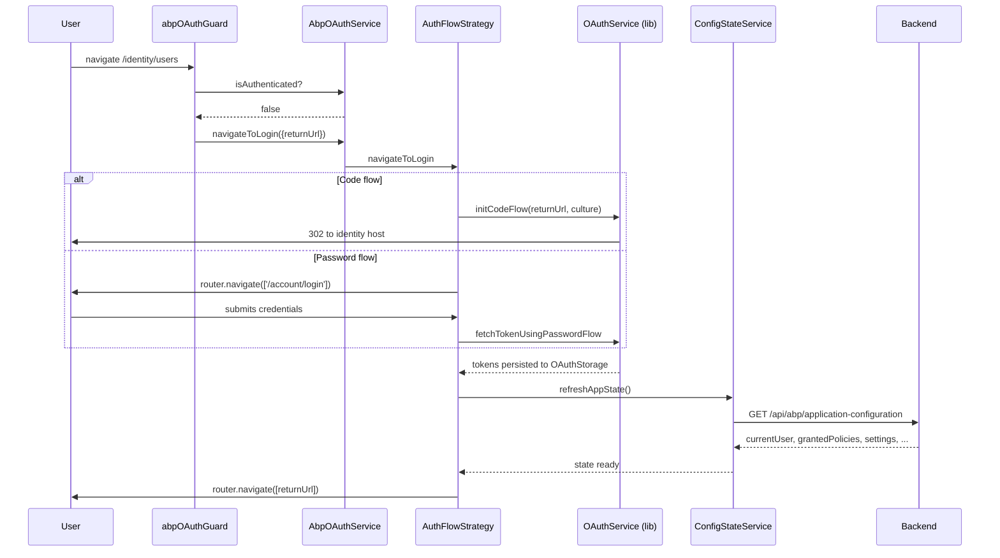

`@abp/ng.oauth` is the package that turns an ABP Angular app into a working OpenID Connect client. It wraps the third-party [`angular-oauth2-oidc`](https://github.com/manfredsteyer/angular-oauth2-oidc) library and provides two interchangeable flow strategies — Authorization Code with PKCE for "separate IdentityServer / OpenIddict" setups, and Resource Owner Password for "embedded login" setups — selecting between them at runtime based on `oAuthConfig.responseType`.

It is a peer of [`@abp/ng.core`](/ng/core), not a replacement: `@abp/ng.oauth` swaps the placeholder `AuthService` for a real one, installs an authentication-aware `ApiInterceptor`, and registers a `CanActivateFn` that gates protected routes. Everything else — `ConfigStateService`, `RestService`, `SessionStateService` — stays the same.

## Package layout

```text npm/ng-packs/packages/oauth/src/lib/
guards/
  oauth.guard.ts             AbpOAuthGuard + abpOAuthGuard CanActivateFn
handlers/
  oauth-configuration.handler.ts   reacts to EnvironmentService updates
interceptors/
  api.interceptor.ts         OAuthApiInterceptor (attaches Bearer + tenant + language)
providers/
  index.ts                   NavigateToManageProfileProvider
services/
  oauth.service.ts           AbpOAuthService (the IAuthService implementation)
  oauth-error-filter.service.ts  OAuthErrorFilterService (signal-based)
strategies/
  auth-flow-strategy.ts      abstract AuthFlowStrategy
  auth-code-flow-strategy.ts AuthCodeFlowStrategy (PKCE)
  auth-password-flow-strategy.ts AuthPasswordFlowStrategy (ROPC)
tokens/
  auth-flow-strategy.ts      AUTH_FLOW_STRATEGY map (Code / Password factories)
utils/
  auth-utils.ts              pipeToLogin, setRememberMe, removeRememberMe
  check-access-token.ts      checkAccessToken (clears storage on mismatch)
  clear-o-auth-storage.ts    clearOAuthStorage (removes 12 oidc keys)
  oauth-storage.ts           oAuthStorage = localStorage
oauth.module.ts              AbpOAuthModule.forRoot
```

## `AbpOAuthModule.forRoot`

The module registers `AbpOAuthService` against the abstract `AuthService` from `@abp/ng.core`, the `OAuthApiInterceptor` against `ApiInterceptor`, and the guards against the existing `AuthGuard` / `authGuard` tokens. It also seeds the function tokens `PIPE_TO_LOGIN_FN_KEY` and `CHECK_AUTHENTICATION_STATE_FN_KEY` that `@abp/ng.core` already declared.

```ts npm/ng-packs/packages/oauth/src/lib/oauth.module.ts
@NgModule({ imports: [CommonModule, OAuthModule] })
export class AbpOAuthModule {
  static forRoot(): ModuleWithProviders<AbpOAuthModule> {
    return {
      ngModule: AbpOAuthModule,
      providers: [
        { provide: AuthService, useClass: AbpOAuthService },
        { provide: AuthGuard, useClass: AbpOAuthGuard },
        { provide: authGuard, useValue: abpOAuthGuard },
        { provide: ApiInterceptor, useClass: OAuthApiInterceptor },
        { provide: PIPE_TO_LOGIN_FN_KEY, useValue: pipeToLogin },
        { provide: CHECK_AUTHENTICATION_STATE_FN_KEY, useValue: checkAccessToken },
        { provide: HTTP_INTERCEPTORS, useExisting: ApiInterceptor, multi: true },
        NavigateToManageProfileProvider,
        { provide: APP_INITIALIZER, multi: true,
          deps: [OAuthConfigurationHandler], useFactory: noop },
        OAuthModule.forRoot().providers as Provider[],
        { provide: OAuthStorage, useClass: AbpLocalStorageService },
        { provide: AuthErrorFilterService, useExisting: OAuthErrorFilterService },
      ],
    };
  }
}
```

| Provider | Replaces / contributes |
| --- | --- |
| `AuthService → AbpOAuthService` | Real implementation of `IAuthService` from `@abp/ng.core`. |
| `AuthGuard → AbpOAuthGuard` (legacy) and `authGuard → abpOAuthGuard` (function) | Route protection for both class-style and function-style guards. |
| `ApiInterceptor → OAuthApiInterceptor` | Adds `Authorization`, tenant, `Accept-Language`, `X-Requested-With` headers. |
| `PIPE_TO_LOGIN_FN_KEY → pipeToLogin` | After login: refresh app state and navigate to `returnUrl`. |
| `CHECK_AUTHENTICATION_STATE_FN_KEY → checkAccessToken` | Detect "valid token but no current user" and clear storage. |
| `OAuthStorage → AbpLocalStorageService` | Ensures the SSR-safe storage wrapper from `@abp/ng.core` is used. |
| `OAuthConfigurationHandler` | Re-configures `OAuthService` whenever `EnvironmentService.oAuthConfig` changes. |
| `NavigateToManageProfileProvider` | Provides `NAVIGATE_TO_MANAGE_PROFILE` consumed by [`@abp/ng.theme.basic`](/ng/theme-basic#user-menu-provider). |
| `AuthErrorFilterService → OAuthErrorFilterService` | Signal-based registry of OAuth error filters. |

## `AbpOAuthService`

`AbpOAuthService` implements `IAuthService` and delegates almost everything to a runtime-selected `AuthFlowStrategy`. The strategy is selected on `init()` based on the environment configuration — `responseType: 'code'` picks the code flow, anything else picks the password flow:

```ts npm/ng-packs/packages/oauth/src/lib/services/oauth.service.ts
@Injectable({ providedIn: 'root' })
export class AbpOAuthService implements IAuthService {
  private strategy!: AuthFlowStrategy;
  private readonly oAuthService: OAuthService;

  get isInternalAuth() { return this.strategy.isInternalAuth; }

  constructor(protected injector: Injector) {
    this.oAuthService = this.injector.get(OAuthService);
  }

  async init() {
    const environmentService = this.injector.get(EnvironmentService);
    const result$ = environmentService.getEnvironment$().pipe(
      map(env => env?.oAuthConfig),
      filter(Boolean),
      tap(oAuthConfig => {
        this.strategy =
          oAuthConfig.responseType === 'code'
            ? AUTH_FLOW_STRATEGY.Code(this.injector)
            : AUTH_FLOW_STRATEGY.Password(this.injector);
      }),
      switchMap(() => from(this.strategy.init())),
      take(1),
    );
    return await lastValueFrom(result$);
  }

  logout(queryParams?: Params): Observable<any> {
    if (!this.strategy) return EMPTY;
    return this.strategy.logout(queryParams);
  }

  navigateToLogin(queryParams?: Params) { this.strategy.navigateToLogin(queryParams); }
  login(params: LoginParams) { return this.strategy.login(params); }
  get isAuthenticated(): boolean { return this.oAuthService.hasValidAccessToken(); }

  loginUsingGrant(grantType: string, parameters: object, headers?: HttpHeaders): Promise<AbpAuthResponse> {
    const { clientId: client_id, dummyClientSecret: client_secret } = this.oAuthService;
    const access_token = this.oAuthService.getAccessToken();
    const p = { access_token, grant_type: grantType, client_id, ...parameters };
    if (client_secret) p['client_secret'] = client_secret;
    return this.oAuthService.fetchTokenUsingGrant(grantType, p, headers);
  }
}
```

`loginUsingGrant` is the entry point for non-standard grants like the "impersonation" grants used by the [Tenant Management module](/modules/tenant-management) when a host user impersonates a tenant user.

## Strategy factories

The strategy type is chosen at runtime from a single map. This is what keeps `AbpOAuthService` flow-agnostic.

```ts npm/ng-packs/packages/oauth/src/lib/tokens/auth-flow-strategy.ts
export const AUTH_FLOW_STRATEGY = {
  Code(injector: Injector) {
    return new AuthCodeFlowStrategy(injector);
  },
  Password(injector: Injector) {
    return new AuthPasswordFlowStrategy(injector);
  },
};
```

## `AuthFlowStrategy` (base class)

The base class wires up the shared dependencies — `EnvironmentService`, `ConfigStateService`, `SessionStateService`, `HttpErrorReporterService`, `OAuthService`, `Router`, `TENANT_KEY`, `OAuthErrorFilterService` — and provides the abstract slots each strategy fills.

```ts npm/ng-packs/packages/oauth/src/lib/strategies/auth-flow-strategy.ts
export abstract class AuthFlowStrategy {
  abstract readonly isInternalAuth: boolean;

  protected httpErrorReporter: HttpErrorReporterService;
  protected environment: EnvironmentService;
  protected configState: ConfigStateService;
  protected oAuthService: OAuthService2;
  protected oAuthConfig!: AuthConfig;
  protected sessionState: SessionStateService;
  protected localStorageService: AbpLocalStorageService;
  protected tenantKey: string;
  protected router: Router;

  protected readonly oAuthErrorFilterService: OAuthErrorFilterService;

  abstract checkIfInternalAuth(queryParams?: Params): boolean;
  abstract navigateToLogin(queryParams?: Params): void;
  abstract logout(queryParams?: Params): Observable<any>;
  abstract login(params?: LoginParams | Params): Observable<any>;

  async init(): Promise<any> {
    if (this.oAuthConfig.clientId) {
      const shouldClear = shouldStorageClear(this.oAuthConfig.clientId, oAuthStorage);
      if (shouldClear) clearOAuthStorage(oAuthStorage);
    }
    this.oAuthService.configure(this.oAuthConfig);

    this.oAuthService.events
      .pipe(filter(event => event.type === 'token_refresh_error'))
      .subscribe(() => this.navigateToLogin());

    this.navigateToPreviousUrl();
  }
}
```

The shared `init()`:

1. Compares the stored `client_id` to the configured one and clears the OAuth storage if they differ — preventing tokens from a previous tenant/client leaking into the new session.
2. Configures the underlying `OAuthService` from `angular-oauth2-oidc`.
3. Subscribes to `token_refresh_error` and redirects to login automatically.
4. Calls `navigateToPreviousUrl` so a deep-link is preserved across redirects.

## `AuthCodeFlowStrategy` — Authorization Code with PKCE

Used when ABP runs in an *external* identity setup (IdentityServer or OpenIddict on a separate host). `isInternalAuth = false`, so the [`@abp/ng.account`](/modules/account) login page is **not** rendered — clicking "Login" issues a 302 to the identity host.

```ts npm/ng-packs/packages/oauth/src/lib/strategies/auth-code-flow-strategy.ts
export class AuthCodeFlowStrategy extends AuthFlowStrategy {
  readonly isInternalAuth = false;

  async init() {
    return super
      .init()
      .then(() => this.oAuthService.tryLogin().catch(noop))
      .then(() => this.oAuthService.setupAutomaticSilentRefresh({}, 'access_token'));
  }

  navigateToLogin(queryParams?: Params) {
    let additionalState = '';
    if (queryParams?.returnUrl) additionalState = queryParams.returnUrl;
    const cultureParams = this.getCultureParams(queryParams);
    this.oAuthService.initCodeFlow(additionalState, cultureParams);
  }

  checkIfInternalAuth(queryParams?: Params) {
    this.oAuthService.initCodeFlow('', this.getCultureParams(queryParams));
    return false;
  }

  logout(queryParams?: Params) {
    return from(this.oAuthService.revokeTokenAndLogout(this.getCultureParams(queryParams)));
  }

  login(queryParams?: Params) {
    this.oAuthService.initCodeFlow('', this.getCultureParams(queryParams));
    return of(null);
  }

  private getCultureParams(queryParams?: Params) {
    const lang = this.sessionState.getLanguage();
    const culture = { culture: lang, 'ui-culture': lang };
    return { ...(lang && culture), ...queryParams };
  }
}
```

Notable behaviors:

- `tryLogin` runs on every bootstrap to consume the `?code=...` redirect after a successful login.
- `setupAutomaticSilentRefresh` watches the `access_token` expiry and rotates it through a hidden iframe.
- Logout calls `revokeTokenAndLogout` so the refresh token is revoked server-side, then the browser is redirected to `end_session_endpoint`.
- The current culture is propagated as `culture` and `ui-culture` query params so the identity host renders its login page in the user's language (the [Account module](/modules/account) reads them).

## `AuthPasswordFlowStrategy` — Resource Owner Password

Used when ABP runs in *internal* identity mode and the login form is part of the Angular app (`isInternalAuth = true`). The strategy listens for `token_expires` and either refreshes the token or logs the user out.

```ts npm/ng-packs/packages/oauth/src/lib/strategies/auth-password-flow-strategy.ts
export class AuthPasswordFlowStrategy extends AuthFlowStrategy {
  readonly isInternalAuth = true;
  private cookieKey = 'rememberMe';
  private storageKey = 'passwordFlow';

  async init() {
    if (!getCookieValueByName(this.cookieKey) && localStorage.getItem(this.storageKey)) {
      this.oAuthService.logOut();
    }
    return super.init().then(() => this.listenToTokenExpiration());
  }

  navigateToLogin(queryParams?: Params) {
    const router = this.injector.get(Router);
    return router.navigate(['/account/login'], { queryParams });
  }

  checkIfInternalAuth() { return true; }

  login(params: LoginParams): Observable<any> {
    const tenant = this.sessionState.getTenant();
    return from(
      this.oAuthService.fetchTokenUsingPasswordFlow(
        params.username,
        params.password,
        new HttpHeaders({ ...(tenant && tenant.id && { [this.tenantKey]: tenant.id }) }),
      ),
    ).pipe(pipeToLogin(params, this.injector));
  }

  logout() {
    const router = this.injector.get(Router);
    const noRedirectToLogoutUrl = true;
    return from(this.oAuthService.revokeTokenAndLogout(noRedirectToLogoutUrl)).pipe(
      switchMap(() => this.configState.refreshAppState()),
      tap(() => {
        router.navigateByUrl('/');
        removeRememberMe(this.localStorageService);
      }),
    );
  }
}
```

Notice the **tenant header** — when a user enters credentials in a multi-tenant setup, the password grant carries the current tenant id so the backend resolves the correct user database. This is the same `TENANT_KEY` configured by [`@abp/ng.core`](/ng/core).

The `"Remember me"` checkbox writes a long-lived cookie alongside the localStorage entry; if either is missing on the next visit the user is logged out. See `auth-utils.ts`:

```ts npm/ng-packs/packages/oauth/src/lib/utils/auth-utils.ts
export const pipeToLogin: PipeToLoginFn = function (
  params: Pick<LoginParams, 'redirectUrl' | 'rememberMe'>,
  injector: Injector,
) {
  const configState = injector.get(ConfigStateService);
  const router = injector.get(Router);
  const localStorage = injector.get(AbpLocalStorageService);
  return pipe(
    switchMap(() => configState.refreshAppState()),
    tap(() => {
      setRememberMe(params.rememberMe, localStorage);
      if (params.redirectUrl) router.navigate([params.redirectUrl]);
    }),
  );
};
```

## `OAuthApiInterceptor`

The OAuth-aware interceptor replaces the basic `ApiInterceptor` from `@abp/ng.core`. It attaches the `Authorization`, tenant, language, and `X-Requested-With` headers to every non-external request:

```ts npm/ng-packs/packages/oauth/src/lib/interceptors/api.interceptor.ts
@Injectable({ providedIn: 'root' })
export class OAuthApiInterceptor implements IApiInterceptor {
  constructor(
    private oAuthService: OAuthService,
    private sessionState: SessionStateService,
    private httpWaitService: HttpWaitService,
    @Inject(TENANT_KEY) private tenantKey: string,
  ) {}

  intercept(request: HttpRequest<any>, next: HttpHandler) {
    this.httpWaitService.addRequest(request);
    const isExternalRequest = request.context?.get(IS_EXTERNAL_REQUEST);
    const newRequest = isExternalRequest
      ? request
      : request.clone({ setHeaders: this.getAdditionalHeaders(request.headers) });

    return next
      .handle(newRequest)
      .pipe(finalize(() => this.httpWaitService.deleteRequest(request)));
  }

  getAdditionalHeaders(existingHeaders?: HttpHeaders) {
    const headers = {} as any;
    const token = this.oAuthService.getAccessToken();
    if (!existingHeaders?.has('Authorization') && token) {
      headers['Authorization'] = `Bearer ${token}`;
    }
    const lang = this.sessionState.getLanguage();
    if (!existingHeaders?.has('Accept-Language') && lang) {
      headers['Accept-Language'] = lang;
    }
    const tenant = this.sessionState.getTenant();
    if (!existingHeaders?.has(this.tenantKey) && tenant?.id) {
      headers[this.tenantKey] = tenant.id;
    }
    headers['X-Requested-With'] = 'XMLHttpRequest';
    return headers;
  }
}
```

Requests flagged with `HttpContext.set(IS_EXTERNAL_REQUEST, true)` (the same token re-exported from `@abp/ng.core`) bypass the headers — useful when calling third-party APIs that would reject the ABP-specific `__tenant` header.

## Guards

`AbpOAuthGuard` is the legacy class-style guard; `abpOAuthGuard` is the new function-style guard recommended for standalone components.

```ts npm/ng-packs/packages/oauth/src/lib/guards/oauth.guard.ts
@Injectable({ providedIn: 'root' })
export class AbpOAuthGuard implements IAbpGuard {
  protected readonly oAuthService = inject(OAuthService);
  protected readonly authService = inject(AuthService);

  canActivate(
    route: ActivatedRouteSnapshot,
    state: RouterStateSnapshot,
  ): Observable<boolean> | boolean | UrlTree {
    const hasValidAccessToken = this.oAuthService.hasValidAccessToken();
    if (hasValidAccessToken) return true;

    const params = { returnUrl: state.url };
    this.authService.navigateToLogin(params);
    return false;
  }
}
```

When the guard denies access, `AuthService.navigateToLogin` is called — and because `AuthService` is `AbpOAuthService`, it dispatches to the active flow strategy (code or password) so the user ends up on the right login screen automatically.

## Error filtering

`OAuthErrorFilterService` exposes a signal-based registry of `AuthErrorFilter<OAuthErrorEvent>`. The handlers wired by [`@abp/ng.theme.shared`](/ng/theme-shared#error-handling-pipeline) consult it before displaying a toast or wrapping the page — useful when you want to silence a specific error (e.g. `invalid_grant` on stale refresh tokens) without disabling the global error handler.

```ts npm/ng-packs/packages/oauth/src/lib/services/oauth-error-filter.service.ts
@Injectable({ providedIn: 'root' })
export class OAuthErrorFilterService extends AbstractAuthErrorFilter<
  AuthErrorFilter<OAuthErrorEvent>,
  OAuthErrorEvent
> {
  protected readonly _filters = signal<Array<AuthErrorFilter<OAuthErrorEvent>>>([]);
  readonly filters = this._filters.asReadonly();

  add(filter: AuthErrorFilter<OAuthErrorEvent>): void {
    this._filters.update(items => [...items, filter]);
  }

  run(event: OAuthErrorEvent): boolean {
    return this.filters()
      .filter(({ executable }) => !!executable)
      .map(({ execute }) => execute(event))
      .some(item => item);
  }
}
```

## Utility helpers

| Function | Purpose |
| --- | --- |
| `checkAccessToken` | Detects "valid token but `configState.currentUser.id` empty" and calls `clearOAuthStorage`. Provided as `CHECK_AUTHENTICATION_STATE_FN_KEY`. |
| `clearOAuthStorage` | Removes the 12 OIDC keys (`access_token`, `id_token`, `refresh_token`, `nonce`, `PKCE_verifier`, `expires_at`, `id_token_claims_obj`, `id_token_expires_at`, `id_token_stored_at`, `access_token_stored_at`, `granted_scopes`, `session_state`). |
| `pipeToLogin` | Post-login RxJS pipe used by both flows — refresh app state, set remember-me, navigate to `returnUrl`. |
| `setRememberMe` / `removeRememberMe` | Writes/clears the `rememberMe` cookie + the `passwordFlow` localStorage flag. |
| `oAuthStorage` | Currently `localStorage` — re-exported so consumers can override. |

```ts npm/ng-packs/packages/oauth/src/lib/utils/check-access-token.ts
export const checkAccessToken: CheckAuthenticationStateFn = function (injector: Injector) {
  const configState = injector.get(ConfigStateService);
  const oAuth = injector.get(OAuthService);
  if (oAuth.hasValidAccessToken() && !configState.getDeep('currentUser.id')) {
    clearOAuthStorage();
  }
};
```

## Configuration handler

`OAuthConfigurationHandler` is constructed lazily through an `APP_INITIALIZER` factory. It watches `EnvironmentService` for changes to `oAuthConfig` and re-configures the underlying `OAuthService` — necessary when the environment is refreshed at runtime (e.g. tenant switch in a multi-tenant host application).

```ts npm/ng-packs/packages/oauth/src/lib/handlers/oauth-configuration.handler.ts
@Injectable({ providedIn: 'root' })
export class OAuthConfigurationHandler {
  constructor(
    private oAuthService: OAuthService,
    private environmentService: EnvironmentService,
    @Inject(CORE_OPTIONS) private options: ABP.Root,
  ) {
    this.listenToSetEnvironment();
  }

  private listenToSetEnvironment() {
    this.environmentService
      .createOnUpdateStream(state => state)
      .pipe(
        map(environment => environment.oAuthConfig as AuthConfig),
        filter(config => !compare(config, this.options.environment.oAuthConfig)),
      )
      .subscribe(config => { this.oAuthService.configure(config); });
  }
}
```

## End-to-end login sequence



## Choosing a flow

| Setup | `responseType` | Strategy | Login screen owned by |
| --- | --- | --- | --- |
| Separate IdentityServer / OpenIddict host | `'code'` | `AuthCodeFlowStrategy` (PKCE) | [Account module](/modules/account) on the identity host |
| Embedded login in the Angular app | (anything else, typically `'password'`) | `AuthPasswordFlowStrategy` | [`@abp/ng.account`](/modules/account) inside this Angular app |

<Warning>
Resource Owner Password is deprecated by the OAuth 2.0 working group. Use code flow with PKCE for new applications. ABP keeps password flow because the embedded login is a common requirement for migration projects from earlier ABP versions.
</Warning>

## Cross-references

- [`@abp/ng.core`](/ng/core) — abstract `AuthService`, `EnvironmentService`, `ConfigStateService`, `SessionStateService`, and the token contracts replaced here.
- [`@abp/ng.theme.basic`](/ng/theme-basic) — calls `AuthService.logout()` from the user menu and registers `NAVIGATE_TO_MANAGE_PROFILE`.
- [`@abp/ng.theme.shared`](/ng/theme-shared) — registers error handlers that consult `OAuthErrorFilterService`.
- The [Account module](/modules/account) — owns the login / register UI presented when the password flow is active.
- The [Tenant Management module](/modules/tenant-management) — switches the active tenant, which causes `SessionStateService.onTenantChange$` to emit and the OAuth strategy to re-issue tokens scoped to the new tenant.
- The [Identity module](/modules/identity) — provides the user store the OAuth strategies authenticate against.
