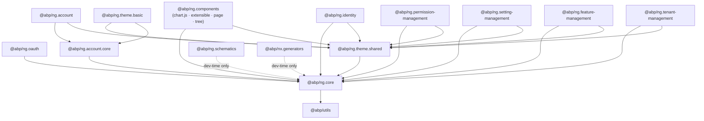
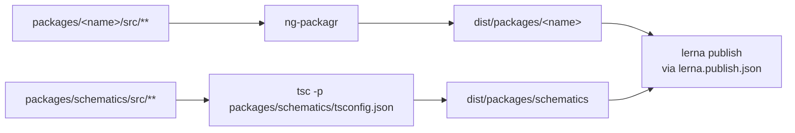

The ABP Angular packages live in a single Nx-managed monorepo at `npm/ng-packs/` inside the [abpframework/abp](https://github.com/abpframework/abp) repository. Together they form the **ABP Angular UI** — the official client-side companion to the ASP.NET Core ABP framework. Every published `@abp/ng.*` and `@abp/nx.*` npm package is built from this folder, with internal dependencies pinned to the same release train (currently the `8.0.x` line) so an `abp.io` template generated on the back end always lines up with a compatible Angular stack on the front end.

This page is the orientation map for the rest of the `ng/` documentation: where each package lives, what role it plays, how the workspace is wired together with Nx, and which version pins matter when you upgrade.

## Repository layout

`npm/ng-packs/` is a self-contained Angular CLI + Nx workspace. Top-level files declare the workspace; folders host libraries, the development application, and build tooling.

```text npm/ng-packs/ — top level
npm/ng-packs/
├── apps/
│   ├── dev-app/            # Sample Angular app used to drive ABP integration smoke tests
│   └── dev-app-e2e/        # Cypress e2e suite against dev-app
├── packages/               # All publishable @abp/ng.* and @abp/nx.* libraries (libsDir)
├── scripts/                # Build / publish / template-sync TypeScript scripts
├── tools/                  # tsconfig.tools.json + ad-hoc Node scripts
├── source-code-requirements/
├── nx.json                 # Nx workspace config (libsDir: packages, appsDir: "")
├── package.json            # Root scripts: nx, build:all, build:schematics, ...
├── tsconfig.base.json
├── lerna.publish.json
├── lerna.version.json
└── migrations.json
```

The Nx layout configuration declares every folder under `packages/` to be a library and treats the root as the apps directory:

```json npm/ng-packs/nx.json
{
  "workspaceLayout": {
    "libsDir": "packages",
    "appsDir": ""
  },
  "defaultProject": "dev-app",
  "affected": { "defaultBase": "dev" }
}
```

The root `package.json` exposes the everyday commands you will use against the workspace:

```json npm/ng-packs/package.json (excerpt)
"scripts": {
  "ng": "nx",
  "nx": "nx",
  "start": "nx serve",
  "build:all": "nx run-many --target=build --all --exclude=dev-app,schematics --prod &&  npm run build:schematics",
  "test:all": "nx run-many --target=test --all",
  "affected:build": "nx affected:build --parallel 1",
  "build:schematics": "cd scripts && yarn && yarn build:schematics && cd ..",
  "update-version": "nx generate @abp/nx.generators:update-version"
}
```

<Note>
The `dev-app` and `schematics` projects are deliberately excluded from `build:all` because they are either an internal application or use a different (non-`ng-packages`) build pipeline. Schematics are compiled by `scripts/build-schematics.ts` (see [Schematics & Generators](/ng/schematics-and-generators)).
</Note>

## The package matrix

Every directory under `npm/ng-packs/packages/` ships as its own npm package. The table lists each one with the published name, version at the time of writing (read straight from each `package.json`), and a one-line role.

| Directory | Published name | Version | Role |
| --- | --- | --- | --- |
| `core` | `@abp/ng.core` | `8.0.2` | Root module, `RestService`, `ConfigStateService`, `EnvironmentService`, auth abstraction, generated proxies |
| `components` | `@abp/ng.components` | `8.0.2` | Umbrella for the `chart.js`, `extensible`, `page`, `tree` secondary entry points |
| `theme-shared` | `@abp/ng.theme.shared` | `8.0.2` | Shared UI primitives — breadcrumb, toast, modal, confirmation, error wrapper, validation styling |
| `theme-basic` | `@abp/ng.theme.basic` | `8.0.2` | Default Bootstrap 5 layout (`ApplicationLayoutComponent`, `AccountLayoutComponent`, `EmptyLayoutComponent`) |
| `oauth` | `@abp/ng.oauth` | `8.0.2` | OpenID Connect integration on top of `angular-oauth2-oidc`, code and password flow strategies |
| `account` | `@abp/ng.account` | `8.0.2` | Account UI routes (login, register, manage profile, security logs) |
| `account-core` | `@abp/ng.account.core` | `8.0.2` | Headless account services + proxies consumed by `@abp/ng.account` |
| `identity` | `@abp/ng.identity` | `8.0.2` | Users, roles, organization units, claim types — UI for the [Identity module](/modules/identity) |
| `permission-management` | `@abp/ng.permission-management` | `8.0.2` | Permission tree modal for the [Permission Management module](/modules/permission-management) |
| `setting-management` | `@abp/ng.setting-management` | `8.0.2` | Setting tabs for the [Setting Management module](/modules/setting-management) |
| `feature-management` | `@abp/ng.feature-management` | `8.0.2` | Feature flag modal for the [Feature Management module](/modules/feature-management) |
| `tenant-management` | `@abp/ng.tenant-management` | `8.0.2` | Tenant CRUD UI for the [Tenant Management module](/modules/tenant-management) |
| `schematics` | `@abp/ng.schematics` | `8.0.2` | Angular CLI schematics (`proxy-add`, `proxy-index`, `proxy-refresh`, `proxy-remove`, `api`, `create-lib`, `change-theme`) |
| `generators` | `@abp/nx.generators` | `8.0.2` | Nx generators (`generate-proxy`, `update-version`, `change-theme`) |

<Tip>
The Lepton-X commercial theme (`@abp/ng.theme.lepton-x`) lives in a separate repository but is referenced as a `devDependency` of the workspace root so `dev-app` can render it during development. It is **not** part of this monorepo.
</Tip>

## Peer dependency pins

Internal packages depend on each other through `dependencies` or `peerDependencies` with a tilde pin to keep patch updates in sync. The patterns below are taken verbatim from each `package.json`.

| Package | Internal pin | External pin |
| --- | --- | --- |
| `@abp/ng.core` | `@abp/utils ~8.0.2` | `just-clone ^6.0.0`, `just-compare ^2.0.0`, `ts-toolbelt 6.15.4`, `tslib ^2.0.0` |
| `@abp/ng.components` | peer `@abp/ng.core >=8.0.2`, peer `@abp/ng.theme.shared >=8.0.2` | `chart.js ^3.5.1`, `ng-zorro-antd ^17.0.0` |
| `@abp/ng.theme.shared` | `@abp/ng.core ~8.0.2` | `@ng-bootstrap/ng-bootstrap ~16.0.0`, `@swimlane/ngx-datatable ^20.0.0`, `bootstrap ^5.2.0`, `@fortawesome/fontawesome-free ^5.15.4`, `@ngx-validate/core ^0.2.0`, `@popperjs/core ~2.11.2` |
| `@abp/ng.theme.basic` | `@abp/ng.account.core ~8.0.2`, `@abp/ng.theme.shared ~8.0.2` | `tslib ^2.0.0` |
| `@abp/ng.oauth` | `@abp/ng.core ~8.0.2`, `@abp/utils ~8.0.2` | `angular-oauth2-oidc ^15.0.0`, `just-clone ^6.0.0`, `just-compare ^2.0.0` |
| `@abp/ng.schematics` | — | `@angular-devkit/core ~16.2.0`, `@angular-devkit/schematics ~16.2.0`, `@angular/cli ~16.2.0`, `got ^11.5.2`, `jsonc-parser ^2.3.0`, `should-quote ^1.0.0`, `typescript 5.0.4` |
| `@abp/nx.generators` | — | (Nx tooling provided by workspace) |

<Warning>
`@abp/ng.components` declares `@abp/ng.core` and `@abp/ng.theme.shared` as **peer** dependencies, not direct dependencies. That means consumers must install them explicitly — `@abp/ng.theme.basic` pulls them in transitively through `@abp/ng.theme.shared`, which is why the default ABP Angular template just installs `@abp/ng.theme.basic`.
</Warning>

## Dependency graph

The arrows below describe what each package imports from a peer package. `@abp/ng.core` is the root: every other library imports from it. `@abp/ng.theme.basic` sits at the top of the chain because it both renders the application layout and depends on the account UI being available.



`@abp/ng.schematics` and `@abp/nx.generators` are dev-time only: they do not appear in the runtime bundle. They are installed as `devDependencies` of the generated host app and invoked through `ng generate` / `nx generate`.

## What each page covers

<CardGroup cols={2}>
  <Card title="@abp/ng.core" icon="cube" href="/ng/core">
    Root module bootstrap, `RestService`, `ConfigStateService`, `EnvironmentService`, `AuthService`, `SessionStateService`, `SubscriptionService`.
  </Card>
  <Card title="@abp/ng.components" icon="puzzle-piece" href="/ng/components">
    Extensible form/table system, page toolbar, chart wrapper, tree component, page chrome.
  </Card>
  <Card title="@abp/ng.theme.shared" icon="palette" href="/ng/theme-shared">
    Breadcrumb, toast, modal, confirmation, http-error-wrapper, validation blueprints.
  </Card>
  <Card title="@abp/ng.theme.basic" icon="window-maximize" href="/ng/theme-basic">
    `ApplicationLayoutComponent`, `AccountLayoutComponent`, `EmptyLayoutComponent`, default route providers.
  </Card>
  <Card title="@abp/ng.oauth" icon="key" href="/ng/oauth">
    `AbpOAuthService`, `AuthFlowStrategy`, code and password flows, OAuth interceptor.
  </Card>
  <Card title="Schematics & Generators" icon="terminal" href="/ng/schematics-and-generators">
    Every `ng generate` and `nx generate` command shipped by ABP — `proxy-add`, `api`, `create-lib`, `change-theme`, `update-version`.
  </Card>
</CardGroup>

## Pairing with backend modules

Each Angular module package mirrors a backend ABP module. The runtime contract is the *application configuration endpoint* exposed at `/api/abp/application-configuration` (see [`@abp/ng.core`](/ng/core)) — the backend tells the client which permissions, settings, features, and tenants are currently in scope, and the matching Angular module consumes that state.

| Backend module | Angular package | Notes |
| --- | --- | --- |
| [Identity](/modules/identity) | `@abp/ng.identity` | Users, roles, organization units, claim types |
| [Account](/modules/account) | `@abp/ng.account` + `@abp/ng.account.core` | Login, register, manage profile, security logs |
| [Permission Management](/modules/permission-management) | `@abp/ng.permission-management` | Permission tree modal opened from Identity / Tenant / Role grids |
| [Setting Management](/modules/setting-management) | `@abp/ng.setting-management` | Settings tabs page |
| [Feature Management](/modules/feature-management) | `@abp/ng.feature-management` | Feature flag modal opened from Tenant grid |
| [Tenant Management](/modules/tenant-management) | `@abp/ng.tenant-management` | Tenants list & host-side admin |

<Note>
The `dev-app` under `npm/ng-packs/apps/dev-app/` is the canonical example of how to wire all of these together. Treat it as living documentation — every PR to the monorepo runs against it.
</Note>

## Versioning model

Every `@abp/ng.*` package shares a single version number, driven by `lerna.version.json` and the `@abp/nx.generators:update-version` Nx generator (see [Schematics & Generators](/ng/schematics-and-generators#update-version)). When you upgrade an ABP backend application you should run the generator on your Angular host so the `~8.0.2` peer pins on every package line up again. A mismatch — for example a `@abp/ng.core 8.0.2` paired with `@abp/ng.theme.shared 7.4.0` — typically surfaces as a token injection error inside `LayoutService` or `ConfigStateService`.

<Tip>
If you only need to know *which* version to upgrade to, the source of truth is the latest tag of `abpframework/abp` and the matching `volo/abp.*` NuGet packages. The Nx generator reads the version you pass it (`--abpVersion`) and rewrites every dependency in the workspace consistently.
</Tip>

## The `dev-app` reference application

The Nx workspace boots a sample Angular CLI application under `apps/dev-app/` whose only purpose is to wire every `@abp/ng.*` package together as fast as possible. It is the canonical reference for what a host app looks like:

```text npm/ng-packs/apps/dev-app/
src/
├── app/
│   ├── app.module.ts          # CoreModule.forRoot + ThemeSharedModule.forRoot
│   │                          # + ThemeBasicModule.forRoot + AbpOAuthModule.forRoot
│   │                          # + per-module @abp/ng.identity, @abp/ng.tenant-management, ...
│   ├── app-routing.module.ts  # Lazy-loaded feature routes
│   └── environments/          # apis: { default: { url: ... } }, oAuthConfig: { ... }
└── ...
```

`dev-app-e2e/` next to it runs Cypress against the live `dev-app` — every PR that touches a package is verified end-to-end against this application before it is merged.

<Tip>
If you are migrating an existing Angular project to ABP, copy the imports list from `dev-app/src/app/app.module.ts` into your own root module. The order matters — `CoreModule.forRoot` must come before `ThemeSharedModule.forRoot`, and `AbpOAuthModule.forRoot` must come after both.
</Tip>

## Build pipeline

Each library is built with `ng-packagr` and emits an Angular Package Format (APF) bundle into `dist/packages/<name>/`. The `build:all` script runs the libraries in parallel through Nx and then compiles the schematics package separately with `tsc` (schematics ship `.js` rather than APF):



The published artifacts are what end users install via `npm install @abp/ng.core`. Inside the monorepo, however, dependent libraries import each other through the **TypeScript path mappings** declared in `tsconfig.base.json` so a change in `core` is picked up by `theme-shared` immediately without a rebuild.

## Where each piece is published from

Every directory under `packages/` has the same minimal set of files:

```text packages/&lt;name&gt;/
package.json          # name, version, dependencies, peerDependencies
ng-package.json       # ng-packagr entry — points at src/public-api.ts
project.json          # Nx target definitions: build, test, lint
src/
  public-api.ts       # The package's exported surface
  test-setup.ts       # Jest setup
  lib/                # Implementation
tsconfig.json
tsconfig.lib.json
tsconfig.lib.prod.json
tsconfig.spec.json
jest.config.ts
```

The exception is `components/`, which is the umbrella package: its `src/public-api.ts` is empty and the real entry points live under `chart.js/`, `extensible/`, `page/`, and `tree/` each with their own `ng-package.json`. See [`@abp/ng.components`](/ng/components) for details.

## Tooling folders

| Folder | Purpose |
| --- | --- |
| `scripts/` | TypeScript build / publish helpers — `build-schematics.ts`, `publish.ts`, `prod-build.ts`, `copy-packages-to-templates.ts`, plus a `mock-schematic/` folder used to test schematics locally. |
| `tools/` | Project-level `tsconfig.tools.json` and a `scripts/` directory hosting Nx-specific helpers. |
| `source-code-requirements/` | Documents the constraints every contributor must follow (lint rules, naming, signature conventions). |

The root scripts you will reach for most often:

```json npm/ng-packs/package.json (excerpt)
"start":            "nx serve",
"build:all":        "nx run-many --target=build --all --exclude=dev-app,schematics --prod && npm run build:schematics",
"test:all":         "nx run-many --target=test --all",
"affected:build":   "nx affected:build --parallel 1",
"affected:test":    "nx affected:test",
"affected:lint":    "nx affected:lint",
"update-version":   "nx generate @abp/nx.generators:update-version",
"copy-to:app":      "cd scripts && yarn && yarn copy-to-templates -t app"
```

`copy-to:app` is what the ABP team uses to copy a fresh build into the project template — it is not something a typical end user needs to invoke.

## Glossary

A handful of terms recur throughout the rest of the documentation:

- **Application configuration** — The JSON object returned by `GET /api/abp/application-configuration` that drives `ConfigStateService`. It carries the current user, granted policies, settings, features, multi-tenancy state, and localization resources.
- **Replaceable component** — Any layout part (logo, side menu, account auth wrapper, etc.) registered against `ReplaceableComponentsService` so consumers can swap it out without forking the theme.
- **Extensibility registry** — The `ExtensionsService` from [`@abp/ng.components`](/ng/components#extensible--abpngcomponentsextensible) where modules contribute entity actions, toolbar actions, grid props, and create/edit form props.
- **Routes service** — `RoutesService` from [`@abp/ng.core`](/ng/core) holds the navigation tree consumed by `<abp-routes>` in the application layout.
- **Auth flow strategy** — One of `AuthCodeFlowStrategy` or `AuthPasswordFlowStrategy` from [`@abp/ng.oauth`](/ng/oauth) — selected at runtime from `oAuthConfig.responseType`.

## Next steps

- Start with [`@abp/ng.core`](/ng/core) to understand the runtime services that every other package builds on.
- Read [`@abp/ng.theme.shared`](/ng/theme-shared) before reaching for `@abp/ng.theme.basic` — almost every UI primitive lives in `theme-shared`.
- If you are generating client proxies from a Swagger / ABP API endpoint, jump to [Schematics & Generators](/ng/schematics-and-generators).
- Pair the runtime documentation with the per-module references for [Identity](/modules/identity), [Account](/modules/account), [Permission Management](/modules/permission-management), [Setting Management](/modules/setting-management), [Feature Management](/modules/feature-management), and [Tenant Management](/modules/tenant-management) — those backend modules each expose an Angular package that consumes the runtime services described here.
