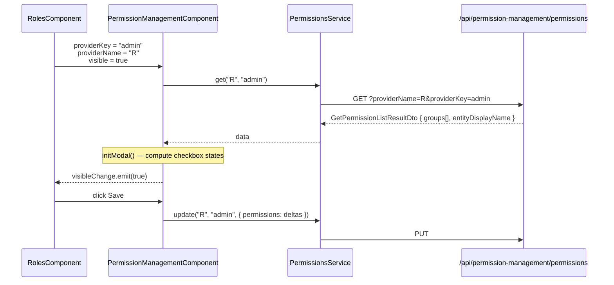

`@abp/ng.permission-management` is a single-component Angular library that renders the **Permissions** modal embedded throughout the ABP admin UI. It loads the permission tree for a given `providerName` / `providerKey` (user, role, or client), supports flat and grouped checkboxes with parent / child cascading, and persists deltas back via `PermissionsService`. `@abp/ng.identity` consumes this module to manage user and role permissions; `@abp/ng.tenant-management` re-uses it for tenant-scoped policy granting in custom flows.

The module is intentionally tiny — one component, one proxy, no routes — so it can be imported as a leaf dependency without dragging menu providers along.

<Info>
  Published as **`@abp/ng.permission-management`** from `npm/ng-packs/packages/permission-management`. Generated proxies live at **`@abp/ng.permission-management/proxy`**.
</Info>

## File inventory

```text packages/permission-management/src/lib
src/lib/
├── permission-management.module.ts            # PermissionManagementModule
├── components/
│   ├── index.ts
│   └── permission-management.component.ts     # <abp-permission-management>
├── enums/
│   └── components.ts                          # ePermissionManagementComponents
└── models/
    ├── index.ts
    └── permission-management.ts               # PermissionManagement namespace
```

```text packages/permission-management/proxy/src/lib/proxy
proxy/
├── permissions.service.ts                     # PermissionsService
└── models.ts                                  # GetPermissionListResultDto, PermissionGroupDto, ...
```

| File | Symbol | Kind |
| --- | --- | --- |
| `permission-management.module.ts` | `PermissionManagementModule` | NgModule |
| `components/permission-management.component.ts` | `PermissionManagementComponent` | `<abp-permission-management>` |
| `enums/components.ts` | `ePermissionManagementComponents.PermissionManagement` | replaceable key |
| `proxy/permissions.service.ts` | `PermissionsService` | proxy |
| `proxy/models.ts` | `PermissionGrantInfoDto`, `PermissionGroupDto`, `ProviderInfoDto`, `UpdatePermissionDto`, `UpdatePermissionsDto`, `GetPermissionListResultDto` | DTOs |

## Public API

```ts packages/permission-management/src/public-api.ts
export * from './lib/components';
export * from './lib/enums/components';
export * from './lib/models';
export * from './lib/permission-management.module';
```

## PermissionManagementModule

```ts packages/permission-management/src/lib/permission-management.module.ts
@NgModule({
  declarations: [PermissionManagementComponent],
  imports:     [CoreModule, ThemeSharedModule],
  exports:     [PermissionManagementComponent],
})
export class PermissionManagementModule {}
```

There is no `forRoot` / `forChild` because the component is providerless (no contributors, no menu entries) — every host module imports `PermissionManagementModule` directly and uses the selector.

## PermissionManagementComponent

The modal is driven entirely by `@Input`s — host components bind `providerName`, `providerKey`, `visible`, and react to `visibleChange`:

```ts packages/permission-management/src/lib/components/permission-management.component.ts
@Component({
  selector: 'abp-permission-management',
  templateUrl: './permission-management.component.html',
  exportAs: 'abpPermissionManagement',
  styles: [`
    .overflow-scroll { max-height: 70vh; overflow-y: scroll; }
    .scroll-in-modal { overflow: auto; max-height: calc(100vh - 15rem); }
  `],
})
export class PermissionManagementComponent
  implements
    PermissionManagement.PermissionManagementComponentInputs,
    PermissionManagement.PermissionManagementComponentOutputs
{
  @Input() readonly providerName!: string;
  @Input() readonly providerKey!: string;
  @Input() readonly hideBadges = false;
  @Input() entityDisplayName: string | undefined;

  protected _visible = false;
  @Input() get visible(): boolean { return this._visible; }
  set visible(value: boolean) {
    if (value === this._visible) return;
    if (value) {
      this.openModal().subscribe(() => {
        this._visible = true;
        this.visibleChange.emit(true);
        concat(this.selectAllInAllTabsRef.changes, this.selectAllInThisTabsRef.changes)
          .pipe(take(1))
          .subscribe(() => this.initModal());
      });
    } else {
      this.setSelectedGroup(null);
      this._visible = false;
      this.visibleChange.emit(false);
    }
  }

  @Output() readonly visibleChange = new EventEmitter<boolean>();

  @ViewChildren('selectAllInThisTabsRef') selectAllInThisTabsRef!: QueryList<ElementRef<HTMLInputElement>>;
  @ViewChildren('selectAllInAllTabsRef') selectAllInAllTabsRef!: QueryList<ElementRef<HTMLInputElement>>;

  data: GetPermissionListResultDto = { groups: [], entityDisplayName: '' };
  selectedGroup?: PermissionGroupDto | null;
  permissions: PermissionWithGroupName[] = [];

  selectThisTab = false;
  selectAllTab  = false;
  disableSelectAllTab = false;
  disabledSelectAllInAllTabs = false;
  modalBusy = false;

  selectedGroupPermissions: PermissionWithStyle[] = [];
  trackByFn: TrackByFunction<PermissionGroupDto> = (_, item) => item.name;

  constructor(
    protected service: PermissionsService,
    protected configState: ConfigStateService,
  ) {}
}
```

The contract namespace declares the `@Input` / `@Output` boundary:

```ts packages/permission-management/src/lib/models/permission-management.ts
export namespace PermissionManagement {
  export interface State { permissionRes: GetPermissionListResultDto; }

  export interface PermissionManagementComponentInputs {
    visible: boolean;
    readonly providerName: string;
    readonly providerKey: string;
    readonly hideBadges: boolean;
  }
  export interface PermissionManagementComponentOutputs {
    readonly visibleChange: EventEmitter<boolean>;
  }
}
```

| Input | Meaning |
| --- | --- |
| `providerName` | Server-side provider key — e.g. `"U"` (user), `"R"` (role), `"C"` (client) |
| `providerKey` | The id whose grants are edited (user id, role name, ...) |
| `visible` (two-way) | Opens / closes the modal; triggers `openModal()` on transition `false → true` |
| `hideBadges` | Suppresses the "granted by Role X / Y" provenance badges |
| `entityDisplayName` | Shown in the modal title |

| Output | Emitted when |
| --- | --- |
| `visibleChange` | After modal data has loaded and the dialog is actually displayed (so two-way bindings stay in sync) |

### Cascading and "select all in all tabs"

The component owns three checkbox roles, rendered through `<input #selectAllInThisTabsRef>` and `<input #selectAllInAllTabsRef>` `@ViewChildren` queries:

- **Per-permission** — toggles a single `PermissionGrantInfoDto`. Selecting a child requires the parent be selected; deselecting a parent cascades to all children.
- **Select all in this tab** — bound to `selectThisTab`; toggles every permission in the active group.
- **Select all in all tabs** — bound to `selectAllTab`; toggles every group at once.

`disabledSelectAllInAllTabs` / `disableSelectAllTab` go true when at least one permission was *granted by another provider* (a role grants it to a user, for instance) and is therefore not directly editable. The modal calls `service.update(providerName, providerKey, { permissions: [...] })` with only the deltas in `UpdatePermissionsDto`.

### Replaceable-component key

```ts packages/permission-management/src/lib/enums/components.ts
export const enum ePermissionManagementComponents {
  PermissionManagement = 'PermissionManagement.PermissionManagementComponent',
}
```

`@abp/ng.identity` references this key in [`UsersComponent`](/ng/identity-ui#userscomponent) and `RolesComponent`:

```ts
permissionManagementKey = ePermissionManagementComponents.PermissionManagement;
```

It is used as a `key` for both rendering through `ReplaceableRouteContainerComponent` and embedding via `<abp-replaceable-template-directive>` patterns. Theme packages can override the whole modal.

## PermissionsService proxy

```ts packages/permission-management/proxy/src/lib/proxy/permissions.service.ts
@Injectable({ providedIn: 'root' })
export class PermissionsService {
  apiName = 'AbpPermissionManagement';

  get = (providerName: string, providerKey: string) =>
    this.restService.request<any, GetPermissionListResultDto>(
      {
        method: 'GET',
        url: '/api/permission-management/permissions',
        params: { providerName, providerKey },
      },
      { apiName: this.apiName },
    );

  update = (providerName: string, providerKey: string, input: UpdatePermissionsDto) =>
    this.restService.request<any, void>(
      {
        method: 'PUT',
        url: '/api/permission-management/permissions',
        params: { providerName, providerKey },
        body: input,
      },
      { apiName: this.apiName },
    );

  constructor(private restService: RestService) {}
}
```

### DTOs

```ts packages/permission-management/proxy/src/lib/proxy/models.ts
export interface GetPermissionListResultDto {
  entityDisplayName?: string;
  groups: PermissionGroupDto[];
}

export interface PermissionGrantInfoDto {
  name?: string;
  displayName?: string;
  parentName?: string;
  isGranted: boolean;
  allowedProviders: string[];        // ["R", "U"] etc.
  grantedProviders: ProviderInfoDto[];
}

export interface PermissionGroupDto {
  name?: string;
  displayName?: string;
  permissions: PermissionGrantInfoDto[];
}

export interface ProviderInfoDto {
  providerName?: string;
  providerKey?: string;
}

export interface UpdatePermissionDto  { name?: string; isGranted: boolean; }
export interface UpdatePermissionsDto { permissions: UpdatePermissionDto[]; }
```

The `grantedProviders` array is what the badge column renders — e.g. *Granted via role: admin* — and what `hideBadges` suppresses.

## Sequence — opening for a role



## Embedding the modal

<Steps>
  <Step title="Import the module">
    ```ts
    @NgModule({ imports: [PermissionManagementModule] })
    ```
  </Step>
  <Step title="Add the element">
    ```html
    <abp-permission-management
      [(visible)]="permissionsVisible"
      [providerName]="'R'"
      [providerKey]="role.name"
      [hideBadges]="false"
      [entityDisplayName]="role.name">
    </abp-permission-management>
    ```
  </Step>
  <Step title="React to outputs">
    ```ts
    onVisiblePermissionChange = (event: boolean) => { this.visiblePermissions = event; };
    ```
    (This is the exact pattern used by `RolesComponent` / `UsersComponent`.)
  </Step>
</Steps>

## Module dependency graph

```mermaid
graph LR
  Identity[IdentityModule]
  Tenant[TenantManagementModule]
  Custom[Your feature module]
  PM[PermissionManagementModule]
  Proxy[@abp/ng.permission-management/proxy]
  Core[@abp/ng.core]
  Theme[@abp/ng.theme.shared]

  Identity --> PM
  Tenant -. composition .-> PM
  Custom --> PM
  PM --> Proxy
  PM --> Core
  PM --> Theme
```

## Common providers

| `providerName` | Editing | Where used |
| --- | --- | --- |
| `"U"` | Per-user grants | `UsersComponent` row action |
| `"R"` | Per-role grants | `RolesComponent` row action |
| `"C"` | OpenIddict client permissions | OpenIddict UI |
| custom | App-defined | Anywhere — define on server through `IPermissionManagementProvider` |

## Related pages

<CardGroup cols={2}>
  <Card title="Identity UI" href="/ng/identity-ui" icon="users-gear">
    The primary embedder — users and roles use this modal.
  </Card>
  <Card title="ng.core" href="/ng/core" icon="cubes">
    `RestService`, `ConfigStateService`, `PermissionService`.
  </Card>
  <Card title="ng.theme.shared" href="/ng/components" icon="palette">
    Modal chrome, toaster, locale direction.
  </Card>
  <Card title="Permission Management module" href="/modules/permission-management" icon="lock">
    Server-side providers, grant storage, `/api/permission-management/permissions` endpoint.
  </Card>
</CardGroup>
