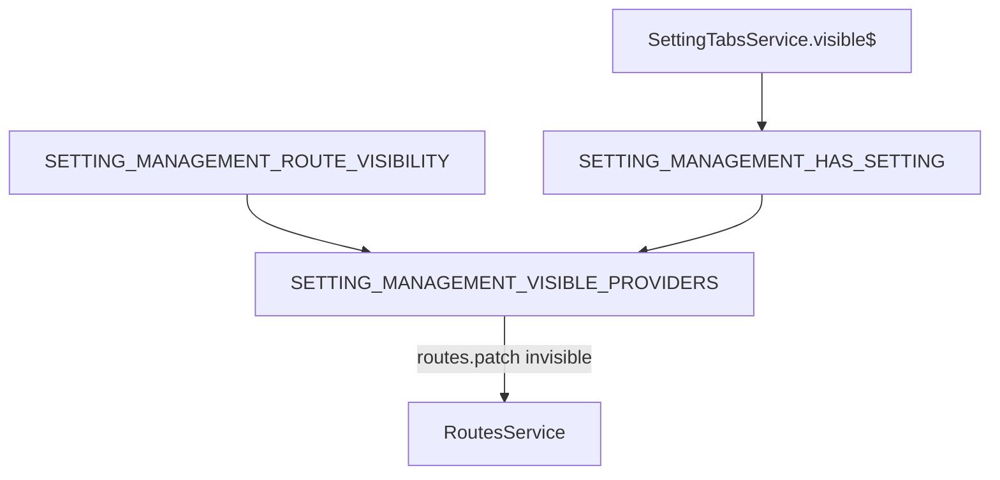

`@abp/ng.setting-management` is the *host* for ABP's central **Settings** screen. It owns no settings of its own — instead, it renders a tabbed page where every other module (`@abp/ng.feature-management`, custom feature libs, etc.) contributes a tab through `SettingTabsService`. The accompanying `config` entrypoint registers the route in the side menu, exposes the EmailSettingGroup tab (SMTP settings), and ships an `APP_INITIALIZER` that hides the whole menu node when the `SettingManagement.Enable` feature flag is off.

This page documents the public surface across three secondary entrypoints — `src`, `config`, and `proxy` — so you can both consume the screen and contribute new tabs.

<Info>
  Published as **`@abp/ng.setting-management`** from `npm/ng-packs/packages/setting-management`. Companion entrypoints: **`@abp/ng.setting-management/config`** and **`@abp/ng.setting-management/proxy`**.
</Info>

## File inventory

```text packages/setting-management/src/lib
src/lib/
├── setting-management.module.ts          # SettingManagementModule.forChild / forLazy
├── setting-management-routing.module.ts  # single replaceable route
├── components/
│   └── setting-management.component.ts   # <abp-setting-management>
└── enums/
    ├── components.ts                     # eSettingManagementComponents
    ├── route-names.ts                    # eSettingManagementRouteNames
    └── index.ts
```

```text packages/setting-management/config/src
config/src/
├── public-api.ts
├── lib/
│   ├── setting-management-config.module.ts
│   ├── components/
│   │   └── email-setting-group/
│   │       └── email-setting-group.component.ts  # <abp-email-setting-group>
│   ├── enums/
│   │   ├── policy-names.ts
│   │   ├── route-names.ts
│   │   └── setting-tab-names.ts
│   ├── providers/
│   │   ├── features.token.ts             # SETTING_MANAGEMENT_FEATURES / _ROUTE_VISIBILITY
│   │   ├── route.provider.ts             # configureRoutes + SETTING_MANAGEMENT_HAS_SETTING
│   │   ├── setting-tab.provider.ts       # registers EmailSettingGroup tab
│   │   └── visible.provider.ts           # hides menu node based on tabs + feature
│   ├── proxy/
│   │   ├── email-settings.service.ts     # @deprecated re-export
│   │   └── models.ts
│   └── services/
│       └── settings-tabs.service.ts      # SettingTabsService (the contributor surface)
```

```text packages/setting-management/proxy/src/lib/proxy
proxy/
├── email-settings.service.ts             # EmailSettingsService
├── time-zone-settings.service.ts         # TimeZoneSettingsService
└── volo/abp/models.ts                    # NameValue
```

| File | Symbol | Kind |
| --- | --- | --- |
| `setting-management.module.ts` | `SettingManagementModule` | NgModule |
| `setting-management-routing.module.ts` | `SettingManagementRoutingModule` | Routes |
| `components/setting-management.component.ts` | `SettingManagementComponent` | `<abp-setting-management>` |
| `config/.../setting-management-config.module.ts` | `SettingManagementConfigModule` | NgModule (`forRoot`) |
| `config/.../services/settings-tabs.service.ts` | `SettingTabsService` | `AbstractNavTreeService<ABP.Tab>` |
| `config/.../components/email-setting-group/...` | `EmailSettingGroupComponent` | `<abp-email-setting-group>` |
| `config/.../providers/setting-tab.provider.ts` | `SETTING_MANAGEMENT_SETTING_TAB_PROVIDERS` | APP_INITIALIZER |
| `config/.../providers/features.token.ts` | `SETTING_MANAGEMENT_FEATURES`, `SETTING_MANAGEMENT_ROUTE_VISIBILITY` | InjectionTokens |
| `config/.../providers/visible.provider.ts` | `SETTING_MANAGEMENT_VISIBLE_PROVIDERS` | APP_INITIALIZER (route patcher) |
| `proxy/email-settings.service.ts` | `EmailSettingsService` | proxy |
| `proxy/time-zone-settings.service.ts` | `TimeZoneSettingsService` | proxy |

## Public API (UI package)

```ts packages/setting-management/src/public-api.ts
export * from './lib/setting-management.module';
export * from './lib/components/setting-management.component';
export * from './lib/enums';
```

## SettingManagementModule

```ts packages/setting-management/src/lib/setting-management.module.ts
@NgModule({
  declarations: [SettingManagementComponent],
  exports:      [SettingManagementComponent],
  imports:      [SettingManagementRoutingModule, CoreModule, ThemeSharedModule, PageModule],
})
export class SettingManagementModule {
  static forChild(): ModuleWithProviders<SettingManagementModule> {
    return { ngModule: SettingManagementModule, providers: [] };
  }

  static forLazy(): NgModuleFactory<SettingManagementModule> {
    return new LazyModuleFactory(SettingManagementModule.forChild());
  }
}
```

## Routing

A single route, gated by `authGuard` and the `AbpAccount.SettingManagement` policy:

```ts packages/setting-management/src/lib/setting-management-routing.module.ts
const routes: Routes = [
  {
    path: '',
    component: RouterOutletComponent,
    canActivate: [authGuard],
    children: [
      {
        path: '',
        component: ReplaceableRouteContainerComponent,
        data: {
          requiredPolicy: 'AbpAccount.SettingManagement',
          replaceableComponent: {
            key: eSettingManagementComponents.SettingManagement,
            defaultComponent: SettingManagementComponent,
          } as ReplaceableComponents.RouteData,
        },
      },
    ],
  },
];
```

```ts packages/setting-management/src/lib/enums/components.ts
export const enum eSettingManagementComponents {
  SettingManagement = 'SettingManagement.SettingManagementComponent',
}
```

## SettingManagementComponent

The host is intentionally featureless — it iterates the tabs `SettingTabsService` exposes and renders each via dynamic component output:

```ts packages/setting-management/src/lib/components/setting-management.component.ts
@Component({
  selector: 'abp-setting-management',
  templateUrl: './setting-management.component.html',
})
export class SettingManagementComponent implements OnDestroy, OnInit {
  private subscription = new Subscription();
  settings: ABP.Tab[] = [];
  selected!: ABP.Tab;

  trackByFn: TrackByFunction<ABP.Tab> = (_, item) => item.name;

  constructor(private settingTabsService: SettingTabsService) {}

  ngOnDestroy() { this.subscription.unsubscribe(); }

  ngOnInit() {
    this.subscription.add(
      this.settingTabsService.visible$.subscribe(settings => {
        this.settings = settings;
        if (!this.selected) this.selected = this.settings[0];
      }),
    );
  }
}
```

The `visible$` stream is what filters tabs by policy and (in `forRoot` registrations) by feature flag.

## Contributor pattern — SettingTabsService

`SettingTabsService` extends the framework's tree-of-nav-items service:

```ts packages/setting-management/config/src/lib/services/settings-tabs.service.ts
@Injectable({ providedIn: 'root' })
export class SettingTabsService extends AbstractNavTreeService<ABP.Tab> {}
```

`ABP.Tab` is the same shape used by routes / menu entries — `{ name, order, requiredPolicy?, requiredFeature?, component, parentName? }` — and `AbstractNavTreeService` (from `@abp/ng.core`) provides `add`, `patch`, `remove`, `find`, `visible$`, and `tree$`.

### How feature-management registers itself

```ts packages/feature-management/src/lib/providers/feature-management-settings.provider.ts
export function configureSettingTabs(settingtabs: SettingTabsService) {
  return () => {
    settingtabs.add([
      {
        name: eFeatureManagementTabNames.FeatureManagement,
        order: 100,
        requiredPolicy: 'FeatureManagement.ManageHostFeatures',
        component: FeatureManagementTabComponent,
      },
    ]);
  };
}
```

That same pattern is the one custom modules use to publish their own tab — see [Feature Management UI](/ng/feature-management-ui#settings-tab-provider) for the full APP_INITIALIZER wiring.

## SettingManagementConfigModule

```ts packages/setting-management/config/src/lib/setting-management-config.module.ts
@NgModule({
  imports:      [CoreModule, ThemeSharedModule, NgxValidateCoreModule],
  declarations: [EmailSettingGroupComponent],
  exports:      [EmailSettingGroupComponent],
})
export class SettingManagementConfigModule {
  static forRoot(): ModuleWithProviders<SettingManagementConfigModule> {
    return {
      ngModule: SettingManagementConfigModule,
      providers: [
        SETTING_MANAGEMENT_ROUTE_PROVIDERS,
        SETTING_MANAGEMENT_SETTING_TAB_PROVIDERS,
        SETTING_MANAGEMENT_FEATURES_PROVIDERS,
        SETTING_MANAGEMENT_VISIBLE_PROVIDERS,
      ],
    };
  }
}
```

`forRoot()` wires four APP_INITIALIZER groups:

1. **Routes** — adds the `Settings` menu entry under `Administration`.
2. **Tabs** — registers the built-in **Email Setting Group** tab.
3. **Features** — subscribes to the `SettingManagement.Enable` flag.
4. **Visibility** — patches `Settings` route to `invisible: true` when either the feature flag is off or no tabs are visible.

### Route contribution

```ts packages/setting-management/config/src/lib/providers/route.provider.ts
export function configureRoutes(routesService: RoutesService) {
  return () => {
    routesService.add([
      {
        name: eSettingManagementRouteNames.Settings,
        path: '/setting-management',
        parentName: eThemeSharedRouteNames.Administration,
        layout: eLayoutType.application,
        order: 100,
        iconClass: 'fa fa-cog',
      },
    ]);
  };
}

export const SETTING_MANAGEMENT_HAS_SETTING = new InjectionToken<Observable<boolean>>(
  'SETTING_MANAGEMENT_HAS_SETTING',
  {
    factory: () => {
      const settingTabsService = inject(SettingTabsService);
      return settingTabsService.visible$.pipe(
        debounceTime(0),
        map(nodes => !!nodes.length),
      );
    },
  },
);
```

### Feature-flag tokens

```ts packages/setting-management/config/src/lib/providers/features.token.ts
export const SETTING_MANAGEMENT_FEATURES = new InjectionToken<Observable<{ enable: boolean }>>(
  'SETTING_MANAGEMENT_FEATURES',
  {
    providedIn: 'root',
    factory: () => {
      const configState = inject(ConfigStateService);
      const featureKey = 'SettingManagement.Enable';
      const mapFn = (features: Record<string, string>) => ({
        enable: features[featureKey].toLowerCase() !== 'false',
      });
      return featuresFactory(configState, [featureKey], mapFn);
    },
  },
);

export const SETTING_MANAGEMENT_ROUTE_VISIBILITY = new InjectionToken<Observable<boolean>>(
  'SETTING_MANAGEMENT_ROUTE_VISIBILITY',
  {
    providedIn: 'root',
    factory: () => {
      const stream = inject(SETTING_MANAGEMENT_FEATURES);
      return stream.pipe(map(features => features.enable));
    },
  },
);
```

### Visibility patcher

```ts packages/setting-management/config/src/lib/providers/visible.provider.ts
export function setSettingManagementVisibility(injector: Injector) {
  return () => {
    const settingManagementHasSetting$  = injector.get(SETTING_MANAGEMENT_HAS_SETTING);
    const isSettingManagementFeatureEnable$ = injector.get(SETTING_MANAGEMENT_ROUTE_VISIBILITY);
    const routes = injector.get(RoutesService);
    combineLatest([settingManagementHasSetting$, isSettingManagementFeatureEnable$]).subscribe(
      ([hasSetting, featureEnabled]) => {
        routes.patch(eSettingManagementRouteNames.Settings, {
          invisible: !(hasSetting && featureEnabled),
        });
      },
    );
  };
}
```

This is the canonical example of *menu-as-state* in ABP Angular — `RoutesService.patch` mutates the same tree the chrome subscribes to.

## EmailSettingGroupComponent

The built-in SMTP-settings tab:

```ts packages/setting-management/config/src/lib/components/email-setting-group/email-setting-group.component.ts
@Component({
  selector: 'abp-email-setting-group',
  templateUrl: 'email-setting-group.component.html',
  animations: [collapse],
})
export class EmailSettingGroupComponent implements OnInit {
  form!: UntypedFormGroup;
  emailTestForm: UntypedFormGroup;
  saving = false;
  emailingPolicy = SettingManagementPolicyNames.Emailing;
  isEmailTestModalOpen = false;
  modalSize: NgbModalOptions = { size: 'lg' };

  constructor(
    private emailSettingsService: EmailSettingsService,   // @abp/ng.setting-management/proxy
    private fb: UntypedFormBuilder,
    private toasterService: ToasterService,
  ) {}

  ngOnInit() { this.getData(); }
}
```

Bound to `eSettingManamagementSettingTabNames.EmailSettingGroup` (`AbpSettingManagement::Menu:Emailing`) at order `100` with `requiredPolicy: 'SettingManagement.Emailing'`.

## Proxies

### EmailSettingsService

```ts packages/setting-management/proxy/src/lib/proxy/email-settings.service.ts
@Injectable({ providedIn: 'root' })
export class EmailSettingsService {
  apiName = 'SettingManagement';

  get = (config?: Partial<Rest.Config>) =>
    this.restService.request<any, EmailSettingsDto>(
      { method: 'GET', url: '/api/setting-management/emailing' },
      { apiName: this.apiName, ...config },
    );

  sendTestEmail = (input: SendTestEmailInput, config?: Partial<Rest.Config>) =>
    this.restService.request<any, void>(
      { method: 'POST', url: '/api/setting-management/emailing/send-test-email', body: input },
      { apiName: this.apiName, ...config },
    );

  update = (input: UpdateEmailSettingsDto, config?: Partial<Rest.Config>) =>
    this.restService.request<any, void>(
      { method: 'POST', url: '/api/setting-management/emailing', body: input },
      { apiName: this.apiName, ...config },
    );

  constructor(private restService: RestService) {}
}
```

### TimeZoneSettingsService

```ts packages/setting-management/proxy/src/lib/proxy/time-zone-settings.service.ts
@Injectable({ providedIn: 'root' })
export class TimeZoneSettingsService {
  apiName = 'SettingManagement';

  get = (config?: Partial<Rest.Config>) =>
    this.restService.request<any, string>(
      { method: 'GET', responseType: 'text', url: '/api/setting-management/timezone' },
      { apiName: this.apiName, ...config },
    );

  getTimezones = (config?: Partial<Rest.Config>) =>
    this.restService.request<any, NameValue[]>(
      { method: 'GET', url: '/api/setting-management/timezone/timezones' },
      { apiName: this.apiName, ...config },
    );

  update = (timezone: string, config?: Partial<Rest.Config>) =>
    this.restService.request<any, void>(
      { method: 'POST', url: '/api/setting-management/timezone', params: { timezone } },
      { apiName: this.apiName, ...config },
    );

  constructor(private restService: RestService) {}
}
```

### DTOs

```ts packages/setting-management/config/src/lib/proxy/models.ts
export interface EmailSettingsDto {
  smtpHost?: string;
  smtpPort: number;
  smtpUserName?: string;
  smtpPassword?: string;
  smtpDomain?: string;
  smtpEnableSsl: boolean;
  smtpUseDefaultCredentials: boolean;
  defaultFromAddress?: string;
  defaultFromDisplayName?: string;
}

export interface SendTestEmailInput {
  senderEmailAddress: string;
  targetEmailAddress: string;
  subject: string;
  body?: string;
}

export interface UpdateEmailSettingsDto {
  smtpHost?: string;
  smtpPort: number;
  smtpUserName?: string;
  smtpPassword?: string;
  smtpDomain?: string;
  smtpEnableSsl: boolean;
  smtpUseDefaultCredentials: boolean;
  defaultFromAddress: string;
  defaultFromDisplayName: string;
}
```

## Contributing a custom tab

<Steps>
  <Step title="Build the tab component">
    A standard `@Component` — no special base class. It will be projected inside `<ng-template>` by `SettingManagementComponent`.
  </Step>
  <Step title="Add an APP_INITIALIZER">
    ```ts
    export const MY_SETTINGS_TAB_PROVIDERS = [
      {
        provide: APP_INITIALIZER,
        useFactory: (tabs: SettingTabsService) => () =>
          tabs.add([{
            name: 'MyApp::Settings:MyGroup',
            order: 200,
            requiredPolicy: 'MyApp.ManageSettings',
            component: MySettingsTabComponent,
          }]),
        deps: [SettingTabsService],
        multi: true,
      },
    ];
    ```
  </Step>
  <Step title="Register from app.module.ts">
    ```ts
    providers: [...MY_SETTINGS_TAB_PROVIDERS],
    ```
    The host immediately picks the new entry up through `visible$`.
  </Step>
</Steps>

## Visibility flow



## Module dependency graph

```mermaid
graph LR
  App[AppModule]
  Cfg[SettingManagementConfigModule]
  UI[SettingManagementModule]
  FM[@abp/ng.feature-management]
  Core[@abp/ng.core]
  ProxyPkg[@abp/ng.setting-management/proxy]

  App --> Cfg
  App -. lazy /setting-management .-> UI
  Cfg --> Core
  UI --> Core
  FM -. forRoot tab .-> Cfg
  Cfg --> ProxyPkg
```

## Related pages

<CardGroup cols={2}>
  <Card title="ng.core" href="/ng/core" icon="cubes">
    `AbstractNavTreeService`, `RoutesService`, `featuresFactory`, `ConfigStateService`.
  </Card>
  <Card title="Feature Management UI" href="/ng/feature-management-ui" icon="flag">
    Canonical tab contributor — registers `<abp-feature-management-tab>`.
  </Card>
  <Card title="ng.components" href="/ng/components" icon="puzzle-piece">
    `@abp/ng.components/page` shell used by the host.
  </Card>
  <Card title="Setting Management module" href="/modules/setting-management" icon="server">
    Server-side providers, `/api/setting-management/emailing`, `/timezone`.
  </Card>
</CardGroup>
