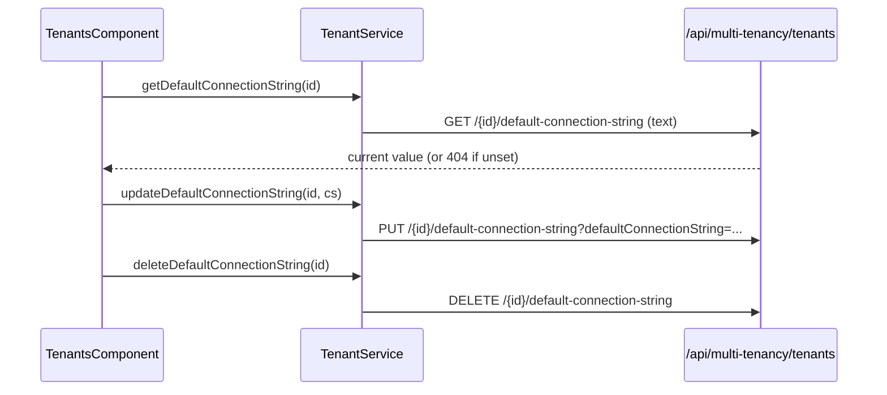

`@abp/ng.tenant-management` is the Angular UI for ABP's **Saas → Tenant Management** screen. It declares a single feature component, `TenantsComponent`, which lists, creates, edits, and deletes tenants, manages the per-tenant default connection string, and opens the feature-management modal scoped to `providerName = "T"`. The package mirrors `@abp/ng.identity` structurally: lazy module with `forChild`/`forLazy`, five contributor tokens for extensible grids and forms, and a sibling `config` entrypoint that registers the route under **Administration** in the side menu.

This page lists every file under `src/lib`, shows the real component signatures, documents the proxy, and walks through the contributor model used by hosts to extend the Tenant grid.

<Info>
  Published as **`@abp/ng.tenant-management`** from `npm/ng-packs/packages/tenant-management`. Proxies live at **`@abp/ng.tenant-management/proxy`**; menu wiring is at **`@abp/ng.tenant-management/config`**.
</Info>

## File inventory

```text packages/tenant-management/src/lib
src/lib/
├── tenant-management.module.ts          # TenantManagementModule.forChild / forLazy
├── tenant-management-routing.module.ts  # /tenants
├── components/
│   ├── index.ts
│   └── tenants/tenants.component.ts     # <abp-tenants>
├── defaults/
│   ├── default-tenants-entity-actions.ts
│   ├── default-tenants-entity-props.ts
│   ├── default-tenants-form-props.ts
│   └── default-tenants-toolbar-actions.ts
├── enums/
│   ├── components.ts                    # eTenantManagementComponents
│   └── index.ts
├── guards/
│   └── extensions.guard.ts              # TenantManagementExtensionsGuard
├── models/
│   ├── config-options.ts                # TenantManagementConfigOptions
│   ├── tenant-management.ts
│   └── index.ts
├── resolvers/
│   └── extensions.resolver.ts           # tenantManagementExtensionsResolver
└── tokens/
    ├── extensions.token.ts              # 5 InjectionTokens
    └── index.ts
```

```text packages/tenant-management/proxy/src/lib/proxy
proxy/
├── tenant.service.ts                    # TenantService
├── models.ts                            # TenantDto, TenantCreateDto, TenantUpdateDto, GetTenantsInput
└── index.ts
```

```text packages/tenant-management/config/src
config/src/
├── public-api.ts
├── tenant-management-config.module.ts
├── enums/
│   ├── policy-names.ts                  # eTenantManagementPolicyNames
│   └── route-names.ts                   # eTenantManagementRouteNames
└── providers/
    └── route.provider.ts                # APP_INITIALIZER → RoutesService.add
```

| File | Symbol | Kind |
| --- | --- | --- |
| `tenant-management.module.ts` | `TenantManagementModule` | NgModule (`forChild`/`forLazy`) |
| `tenant-management-routing.module.ts` | `TenantManagementRoutingModule` | Routes |
| `components/tenants/tenants.component.ts` | `TenantsComponent` | `<abp-tenants>` |
| `guards/extensions.guard.ts` | `TenantManagementExtensionsGuard` | extensions warm-up |
| `resolvers/extensions.resolver.ts` | `tenantManagementExtensionsResolver` | `ResolveFn` |
| `tokens/extensions.token.ts` | 5 contributor tokens + `DEFAULT_*` maps | DI |
| `enums/components.ts` | `eTenantManagementComponents` | replaceable keys |
| `proxy/tenant.service.ts` | `TenantService` | proxy |
| `config/tenant-management-config.module.ts` | `TenantManagementConfigModule` | NgModule (`forRoot`) |

## Public API

```ts packages/tenant-management/src/public-api.ts
export * from './lib/components';
export * from './lib/enums';
export * from './lib/guards';
export * from './lib/models';
export * from './lib/tenant-management.module';
export * from './lib/tokens';
export * from './lib/resolvers';
```

## TenantManagementModule

```ts packages/tenant-management/src/lib/tenant-management.module.ts
@NgModule({
  declarations: [TenantsComponent],
  exports:      [TenantsComponent],
  imports: [
    TenantManagementRoutingModule,
    NgxValidateCoreModule,
    CoreModule,
    ThemeSharedModule,
    NgbDropdownModule,
    FeatureManagementModule,
    ExtensibleModule,
    PageModule,
  ],
})
export class TenantManagementModule {
  static forChild(
    options: TenantManagementConfigOptions = {},
  ): ModuleWithProviders<TenantManagementModule> {
    return {
      ngModule: TenantManagementModule,
      providers: [
        { provide: TENANT_MANAGEMENT_ENTITY_ACTION_CONTRIBUTORS,    useValue: options.entityActionContributors },
        { provide: TENANT_MANAGEMENT_TOOLBAR_ACTION_CONTRIBUTORS,   useValue: options.toolbarActionContributors },
        { provide: TENANT_MANAGEMENT_ENTITY_PROP_CONTRIBUTORS,      useValue: options.entityPropContributors },
        { provide: TENANT_MANAGEMENT_CREATE_FORM_PROP_CONTRIBUTORS, useValue: options.createFormPropContributors },
        { provide: TENANT_MANAGEMENT_EDIT_FORM_PROP_CONTRIBUTORS,   useValue: options.editFormPropContributors },
        TenantManagementExtensionsGuard,
      ],
    };
  }

  static forLazy(
    options: TenantManagementConfigOptions = {},
  ): NgModuleFactory<TenantManagementModule> {
    return new LazyModuleFactory(TenantManagementModule.forChild(options));
  }
}
```

The module hard-imports `FeatureManagementModule` because the tenant edit dropdown opens `<abp-feature-management>` directly.

## Routing

```ts packages/tenant-management/src/lib/tenant-management-routing.module.ts
const routes: Routes = [
  { path: '', redirectTo: 'tenants', pathMatch: 'full' },
  {
    path: '',
    component: RouterOutletComponent,
    canActivate: [authGuard, permissionGuard],
    resolve: [tenantManagementExtensionsResolver],
    children: [
      {
        path: 'tenants',
        component: ReplaceableRouteContainerComponent,
        data: {
          requiredPolicy: 'AbpTenantManagement.Tenants',
          replaceableComponent: {
            key: eTenantManagementComponents.Tenants,
            defaultComponent: TenantsComponent,
          } as ReplaceableComponents.RouteData<TenantsComponent>,
        },
      },
    ],
  },
];
```

```ts packages/tenant-management/src/lib/enums/components.ts
export const enum eTenantManagementComponents {
  Tenants = 'TenantManagement.TenantsComponent',
}
```

## TenantsComponent

```ts packages/tenant-management/src/lib/components/tenants/tenants.component.ts
@Component({
  selector: 'abp-tenants',
  templateUrl: './tenants.component.html',
  providers: [
    ListService,
    { provide: EXTENSIONS_IDENTIFIER, useValue: eTenantManagementComponents.Tenants },
  ],
})
export class TenantsComponent implements OnInit {
  data: PagedResultDto<TenantDto> = { items: [], totalCount: 0 };

  selected!: TenantDto;
  tenantForm!: UntypedFormGroup;
  isModalVisible!: boolean;

  visibleFeatures = false;
  providerKey!: string;
  modalBusy = false;

  featureManagementKey = eFeatureManagementComponents.FeatureManagement;

  get hasSelectedTenant(): boolean {
    return Boolean(this.selected.id);
  }
}
```

Wiring notes:

- `ListService<GetTenantsInput>` — the standard ABP paged-query helper from `@abp/ng.core`.
- `EXTENSIONS_IDENTIFIER` — gives the embedded `<abp-extensible-form>` / `<abp-extensible-table>` the key `TenantManagement.TenantsComponent` to look up contributor sets.
- `featureManagementKey` — `'FeatureManagement.FeatureManagementComponent'`, used to render `<abp-feature-management>` for the selected tenant.

When the user picks **Features** on a row, the component sets:

```ts
this.providerKey = this.selected.id;     // tenant id
this.visibleFeatures = true;             // opens <abp-feature-management>
```

`<abp-feature-management>` receives `providerName="T"` and the tenant id, hitting `/api/feature-management/features` with the right scope — see [Feature Management UI](/ng/feature-management-ui).

## Extension hooks

```ts packages/tenant-management/src/lib/models/config-options.ts
export type TenantManagementEntityActionContributors = Partial<{
  [eTenantManagementComponents.Tenants]: EntityActionContributorCallback<TenantDto>[];
}>;
export type TenantManagementToolbarActionContributors = Partial<{
  [eTenantManagementComponents.Tenants]: ToolbarActionContributorCallback<TenantDto[]>[];
}>;
export type TenantManagementEntityPropContributors = Partial<{
  [eTenantManagementComponents.Tenants]: EntityPropContributorCallback<TenantDto>[];
}>;
export type TenantManagementCreateFormPropContributors = Partial<{
  [eTenantManagementComponents.Tenants]: CreateFormPropContributorCallback<TenantCreateDto>[];
}>;
export type TenantManagementEditFormPropContributors = Partial<{
  [eTenantManagementComponents.Tenants]: EditFormPropContributorCallback<TenantUpdateDto>[];
}>;

export interface TenantManagementConfigOptions {
  entityActionContributors?:  TenantManagementEntityActionContributors;
  toolbarActionContributors?: TenantManagementToolbarActionContributors;
  entityPropContributors?:    TenantManagementEntityPropContributors;
  createFormPropContributors?: TenantManagementCreateFormPropContributors;
  editFormPropContributors?:   TenantManagementEditFormPropContributors;
}
```

| Token | Contributes to | Default constant |
| --- | --- | --- |
| `TENANT_MANAGEMENT_ENTITY_ACTION_CONTRIBUTORS` | Row dropdown (Edit / Delete / Features / Manage connection string) | `DEFAULT_TENANTS_ENTITY_ACTIONS` |
| `TENANT_MANAGEMENT_TOOLBAR_ACTION_CONTRIBUTORS` | "New tenant" button | `DEFAULT_TENANTS_TOOLBAR_ACTIONS` |
| `TENANT_MANAGEMENT_ENTITY_PROP_CONTRIBUTORS` | Grid columns | `DEFAULT_TENANTS_ENTITY_PROPS` |
| `TENANT_MANAGEMENT_CREATE_FORM_PROP_CONTRIBUTORS` | New tenant modal | `DEFAULT_TENANTS_CREATE_FORM_PROPS` |
| `TENANT_MANAGEMENT_EDIT_FORM_PROP_CONTRIBUTORS` | Edit tenant modal | `DEFAULT_TENANTS_EDIT_FORM_PROPS` |

The defaults are merged with user contributions inside `TenantManagementExtensionsGuard` (provided by `forChild`) — that guard runs through `tenantManagementExtensionsResolver` so the grid is rendered with the final set.

## TenantService proxy

```ts packages/tenant-management/proxy/src/lib/proxy/tenant.service.ts
@Injectable({ providedIn: 'root' })
export class TenantService {
  apiName = 'AbpTenantManagement';

  create = (input: TenantCreateDto) =>
    this.restService.request<any, TenantDto>(
      { method: 'POST', url: '/api/multi-tenancy/tenants', body: input },
      { apiName: this.apiName });

  delete = (id: string) =>
    this.restService.request<any, void>(
      { method: 'DELETE', url: `/api/multi-tenancy/tenants/${id}` },
      { apiName: this.apiName });

  deleteDefaultConnectionString = (id: string) =>
    this.restService.request<any, void>(
      { method: 'DELETE', url: `/api/multi-tenancy/tenants/${id}/default-connection-string` },
      { apiName: this.apiName });

  get = (id: string) =>
    this.restService.request<any, TenantDto>(
      { method: 'GET', url: `/api/multi-tenancy/tenants/${id}` },
      { apiName: this.apiName });

  getDefaultConnectionString = (id: string) =>
    this.restService.request<any, string>(
      {
        method: 'GET',
        responseType: 'text',
        url: `/api/multi-tenancy/tenants/${id}/default-connection-string`,
      },
      { apiName: this.apiName });

  getList = (input: GetTenantsInput) =>
    this.restService.request<any, PagedResultDto<TenantDto>>(
      {
        method: 'GET',
        url: '/api/multi-tenancy/tenants',
        params: {
          filter: input.filter, sorting: input.sorting,
          skipCount: input.skipCount, maxResultCount: input.maxResultCount,
        },
      },
      { apiName: this.apiName });

  update = (id: string, input: TenantUpdateDto) =>
    this.restService.request<any, TenantDto>(
      { method: 'PUT', url: `/api/multi-tenancy/tenants/${id}`, body: input },
      { apiName: this.apiName });

  updateDefaultConnectionString = (id: string, defaultConnectionString: string) =>
    this.restService.request<any, void>(
      {
        method: 'PUT',
        url: `/api/multi-tenancy/tenants/${id}/default-connection-string`,
        params: { defaultConnectionString },
      },
      { apiName: this.apiName });

  constructor(private restService: RestService) {}
}
```

### DTOs

```ts packages/tenant-management/proxy/src/lib/proxy/models.ts
export interface GetTenantsInput extends PagedAndSortedResultRequestDto {
  filter?: string;
}

export interface TenantCreateDto extends TenantCreateOrUpdateDtoBase {
  adminEmailAddress: string;
  adminPassword: string;
}

export interface TenantCreateOrUpdateDtoBase extends ExtensibleObject {
  name: string;
}

export interface TenantDto extends ExtensibleEntityDto<string> {
  name?: string;
  concurrencyStamp?: string;
}

export interface TenantUpdateDto extends TenantCreateOrUpdateDtoBase {
  concurrencyStamp?: string;
}
```

## `@abp/ng.tenant-management/config`

```ts packages/tenant-management/config/src/tenant-management-config.module.ts
@NgModule()
export class TenantManagementConfigModule {
  static forRoot(): ModuleWithProviders<TenantManagementConfigModule> {
    return {
      ngModule: TenantManagementConfigModule,
      providers: [TENANT_MANAGEMENT_ROUTE_PROVIDERS],
    };
  }
}
```

```ts packages/tenant-management/config/src/providers/route.provider.ts
export function configureRoutes(routes: RoutesService) {
  return () => {
    routes.add([
      {
        path: undefined,
        name: eTenantManagementRouteNames.TenantManagement,
        parentName: eThemeSharedRouteNames.Administration,
        requiredPolicy: eTenantManagementPolicyNames.TenantManagement,
        layout: eLayoutType.application,
        iconClass: 'fa fa-users',
        order: 2,
      },
      {
        path: '/tenant-management/tenants',
        name: eTenantManagementRouteNames.Tenants,
        parentName: eTenantManagementRouteNames.TenantManagement,
        requiredPolicy: eTenantManagementPolicyNames.Tenants,
        order: 1,
      },
    ]);
  };
}
```

```ts packages/tenant-management/config/src/enums/policy-names.ts
export const enum eTenantManagementPolicyNames {
  TenantManagement = 'AbpTenantManagement.Tenants',
  Tenants          = 'AbpTenantManagement.Tenants',
}
```

```ts packages/tenant-management/config/src/enums/route-names.ts
export const enum eTenantManagementRouteNames {
  TenantManagement = 'AbpTenantManagement::Menu:TenantManagement',
  Tenants          = 'AbpTenantManagement::Tenants',
}
```

## Module dependency graph

```mermaid
graph LR
  App[AppModule]
  Cfg[TenantManagementConfigModule]
  UI[TenantManagementModule]
  FM[@abp/ng.feature-management]
  Ext[@abp/ng.components/extensible]
  Page[@abp/ng.components/page]
  Core[@abp/ng.core]
  ProxyT[@abp/ng.tenant-management/proxy]

  App --> Cfg
  App -. lazy /tenant-management .-> UI
  UI --> FM
  UI --> Ext
  UI --> Page
  UI --> Core
  UI --> ProxyT
```

## Adding a "country" column

<Steps>
  <Step title="Write a prop contributor">
    ```ts
    const tenantsEntityPropContributor: EntityPropContributorCallback<TenantDto> = props => {
      props.addByIndex(
        new EntityProp<TenantDto>({
          type: 'string',
          name: 'country',
          displayName: 'MyApp::Country',
          valueResolver: data => of(data.record['country'] as string),
        }),
        2,
      );
    };
    ```
  </Step>
  <Step title="Provide it through forLazy">
    ```ts
    TenantManagementModule.forLazy({
      entityPropContributors: {
        [eTenantManagementComponents.Tenants]: [tenantsEntityPropContributor],
      },
    })
    ```
  </Step>
  <Step title="Refresh — the column appears at index 2">
    `TenantManagementExtensionsGuard` rebuilds the merged set, the grid picks the new column up through `EXTENSIONS_IDENTIFIER` lookup.
  </Step>
</Steps>

## Default-connection-string flow



## Configuration recipes

<CardGroup cols={2}>
  <Card title="Per-tenant features" icon="flag">
    Use the **Features** row action — opens `<abp-feature-management>` with `providerName="T"`, `providerKey=tenant.id`. See [Feature Management UI](/ng/feature-management-ui).
  </Card>
  <Card title="Custom toolbar action" icon="bolt">
    Provide a `ToolbarActionContributorCallback<TenantDto[]>` under `TENANT_MANAGEMENT_TOOLBAR_ACTION_CONTRIBUTORS`.
  </Card>
  <Card title="Replace the whole screen" icon="paint-roller">
    Register a replacement for `eTenantManagementComponents.Tenants` via `ReplaceableComponentsService`.
  </Card>
  <Card title="Hide menu when policy fails" icon="eye-slash">
    The route declares `requiredPolicy: 'AbpTenantManagement.Tenants'` — `RoutesService` filters it out for users lacking it.
  </Card>
</CardGroup>

## Related pages

<CardGroup cols={2}>
  <Card title="ng.core" href="/ng/core" icon="cubes">
    `ListService`, `RoutesService`, `permissionGuard`, `RestService`.
  </Card>
  <Card title="ng.components — extensible" href="/ng/components" icon="puzzle-piece">
    `EXTENSIONS_IDENTIFIER`, `EntityProp`, contributor callback types.
  </Card>
  <Card title="Feature Management UI" href="/ng/feature-management-ui" icon="flag">
    Modal opened from the row action.
  </Card>
  <Card title="Tenant Management module" href="/modules/tenant-management" icon="building">
    Server-side `/api/multi-tenancy/tenants` endpoints and connection-string storage.
  </Card>
</CardGroup>
