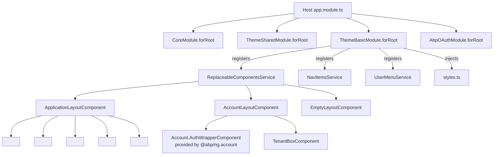

`@abp/ng.theme.basic` is the default theme that ships with the ABP Angular template. It composes the primitives in [`@abp/ng.theme.shared`](/ng/theme-shared) into the three standard layouts every ABP application uses: the main application chrome, the account (login/register) chrome, and the empty chrome. Out of the box it gives you the Bootstrap 5 + ng-bootstrap navigation, a collapsible side menu, language and user menus, validation styling, and the lazy-loaded Bootstrap stylesheet.

It depends on [`@abp/ng.theme.shared`](/ng/theme-shared) for the primitives and on `@abp/ng.account.core` for the manage-profile navigation contract. If you swap to Lepton or LeptonX the same `<router-outlet>` keys are honored, so layout-aware feature modules keep working.

## Package layout

```text npm/ng-packs/packages/theme-basic/src/lib/
components/
  account-layout/            <abp-layout-account>
    account-layout.component.ts
    auth-wrapper/
    tenant-box/
  application-layout/        <abp-layout-application>
    application-layout.component.{ts,html}
  empty-layout/              <abp-layout-empty>
    empty-layout.component.ts
  logo/                      <abp-logo>
  nav-items/                 NavItemsComponent, CurrentUserComponent, LanguagesComponent
  page-alert-container/      PageAlertContainerComponent
  routes/                    <abp-routes> (renders the side menu)
  validation-error/          ValidationErrorComponent
constants/                   styles.ts — the Bootstrap-based theme CSS
enums/
  components.ts              eThemeBasicComponents (replaceable-component keys)
  user-menu-items.ts         eUserMenuItems
handlers/                    lazy-style.handler.ts
models/
providers/
  nav-item.provider.ts       BASIC_THEME_NAV_ITEM_PROVIDERS
  styles.provider.ts         BASIC_THEME_STYLES_PROVIDERS
  user-menu.provider.ts      BASIC_THEME_USER_MENU_PROVIDERS
services/
  layout.service.ts          window-size + sidebar collapse state
theme-basic.module.ts        ThemeBasicModule.forRoot
tokens/
```

## Bootstrapping with `ThemeBasicModule.forRoot`

The module is consumed once in the host app. The `forRoot` factory wires three things: nav items, the user dropdown, and the lazy-loaded Bootstrap stylesheet:

```ts npm/ng-packs/packages/theme-basic/src/lib/theme-basic.module.ts
@NgModule({
  exports: [BaseThemeBasicModule],
  imports: [BaseThemeBasicModule],
})
export class ThemeBasicModule {
  static forRoot(): ModuleWithProviders<ThemeBasicModule> {
    return {
      ngModule: ThemeBasicModule,
      providers: [
        BASIC_THEME_NAV_ITEM_PROVIDERS,
        BASIC_THEME_USER_MENU_PROVIDERS,
        BASIC_THEME_STYLES_PROVIDERS,
        { provide: VALIDATION_ERROR_TEMPLATE, useValue: ValidationErrorComponent },
        { provide: VALIDATION_TARGET_SELECTOR, useValue: '.form-group' },
        { provide: VALIDATION_INVALID_CLASSES, useValue: 'is-invalid' },
        LazyStyleHandler,
        { provide: APP_INITIALIZER, useFactory: noop, multi: true, deps: [LazyStyleHandler] },
      ],
    };
  }
}
```

The three validation providers come from `@ngx-validate/core` — Theme Basic tells the validation engine to render errors with `ValidationErrorComponent`, look for an enclosing `.form-group`, and apply the Bootstrap `is-invalid` class to invalid controls.

`LazyStyleHandler` waits for the layout to render and then lazy-loads the theme stylesheet declared in `styles.ts` — the application bundle stays small and the Bootstrap CSS is only fetched when the theme actually paints.

## The three layouts

`@abp/ng.core` exposes an `eLayoutType` enum: `application`, `account`, and `empty`. Each ABP route is tagged with a `data.layout = eLayoutType.application` so `DynamicLayoutComponent` knows which shell to render. Theme Basic supplies one component per layout type.

| Component | Selector | `static type` | Composes |
| --- | --- | --- | --- |
| `ApplicationLayoutComponent` | `<abp-layout-application>` | `eLayoutType.application` | Top bar, side menu, breadcrumb, page area |
| `AccountLayoutComponent` | `<abp-layout-account>` | `eLayoutType.account` | Centered card for login / register / forgot-password |
| `EmptyLayoutComponent` | `<abp-layout-empty>` | `eLayoutType.empty` | Bare `<router-outlet>` |

### `ApplicationLayoutComponent`

The main chrome — header, side menu, content area, breadcrumb, page alert container, toaster, loader bar. Each is composed from `@abp/ng.theme.shared` primitives plus this package's `LogoComponent`, `NavItemsComponent`, and `RoutesComponent`.

```ts npm/ng-packs/packages/theme-basic/src/lib/components/application-layout/application-layout.component.ts
@Component({
  selector: 'abp-layout-application',
  templateUrl: './application-layout.component.html',
  animations: [slideFromBottom, collapseWithMargin],
  providers: [LayoutService, SubscriptionService],
})
export class ApplicationLayoutComponent implements AfterViewInit {
  // required for dynamic component
  static type = eLayoutType.application;

  constructor(public service: LayoutService) {}

  ngAfterViewInit() {
    this.service.subscribeWindowSize();
  }
}
```

`LayoutService` is provided at the component level — every layout instance has its own collapse state, small-screen flag, and replaceable-component keys:

```ts npm/ng-packs/packages/theme-basic/src/lib/services/layout.service.ts
@Injectable()
export class LayoutService {
  isCollapsed = true;
  smallScreen!: boolean;

  logoComponentKey = eThemeBasicComponents.Logo;
  routesComponentKey = eThemeBasicComponents.Routes;
  navItemsComponentKey = eThemeBasicComponents.NavItems;

  constructor(
    private subscription: SubscriptionService,
    private cdRef: ChangeDetectorRef,
    routerEvents: RouterEvents,
  ) {
    subscription.addOne(routerEvents.getNavigationEvents('End'), () => {
      this.isCollapsed = true;
    });
  }
}
```

When the route changes the sidebar collapses automatically. The replaceable-component keys allow you to swap out the logo, the routes panel, or the nav-items strip without forking the layout — pass a different component to `ReplaceableComponentsService.add({ key: 'Theme.LogoComponent', component: MyLogo })`.

### `AccountLayoutComponent`

The chrome used for login, register, forgot-password, and tenant-switch flows. It hosts the `AuthWrapperComponent` (replaceable via `'Account.AuthWrapperComponent'`) and the `TenantBoxComponent` shown when multi-tenancy is enabled.

```ts npm/ng-packs/packages/theme-basic/src/lib/components/account-layout/account-layout.component.ts
@Component({
  selector: 'abp-layout-account',
  templateUrl: './account-layout.component.html',
  providers: [LayoutService, SubscriptionService],
})
export class AccountLayoutComponent implements AfterViewInit {
  // required for dynamic component
  static type = eLayoutType.account;

  authWrapperKey = 'Account.AuthWrapperComponent';

  constructor(public service: LayoutService) {}

  ngAfterViewInit() {
    this.service.subscribeWindowSize();
  }
}
```

The actual login form is provided by the [`Account` module](/modules/account) — Theme Basic only owns the chrome.

### `EmptyLayoutComponent`

A trivial container for routes that should not render any chrome (e.g. a maintenance page or an embedded preview):

```ts npm/ng-packs/packages/theme-basic/src/lib/components/empty-layout/empty-layout.component.ts
@Component({
  selector: 'abp-layout-empty',
  template: `
    <router-outlet></router-outlet>
  `,
})
export class EmptyLayoutComponent {
  static type = eLayoutType.empty;
}
```

## Replaceable component keys

Theme Basic exposes a `const enum` of keys so every replaceable point is discoverable from one file:

```ts npm/ng-packs/packages/theme-basic/src/lib/enums/components.ts
export const enum eThemeBasicComponents {
  ApplicationLayout = 'Theme.ApplicationLayoutComponent',
  AccountLayout = 'Theme.AccountLayoutComponent',
  EmptyLayout = 'Theme.EmptyLayoutComponent',
  Logo = 'Theme.LogoComponent',
  Routes = 'Theme.RoutesComponent',
  NavItems = 'Theme.NavItemsComponent',
  CurrentUser = 'Theme.CurrentUserComponent',
  Languages = 'Theme.LanguagesComponent',
}
```

`BASIC_THEME_STYLES_PROVIDERS` registers the three layout components under these keys so the dynamic-layout system can render them:

```ts npm/ng-packs/packages/theme-basic/src/lib/providers/styles.provider.ts
export const BASIC_THEME_STYLES_PROVIDERS = [
  { provide: APP_INITIALIZER, useFactory: configureStyles,
    deps: [DomInsertionService, ReplaceableComponentsService], multi: true },
];

export function configureStyles(
  domInsertion: DomInsertionService,
  replaceableComponents: ReplaceableComponentsService,
) {
  return () => {
    domInsertion.insertContent(CONTENT_STRATEGY.AppendStyleToHead(styles));
    initLayouts(replaceableComponents);
  };
}

function initLayouts(replaceableComponents: ReplaceableComponentsService) {
  replaceableComponents.add({
    key: eThemeBasicComponents.ApplicationLayout,
    component: ApplicationLayoutComponent,
  });
  replaceableComponents.add({
    key: eThemeBasicComponents.AccountLayout,
    component: AccountLayoutComponent,
  });
  replaceableComponents.add({
    key: eThemeBasicComponents.EmptyLayout,
    component: EmptyLayoutComponent,
  });
  /* ... */
}
```

To replace, say, the logo: register your component under `eThemeBasicComponents.Logo` *after* `ThemeBasicModule.forRoot()` runs and your component will be picked up by `<abp-replaceable-route-container>`.

## Nav items provider

`BASIC_THEME_NAV_ITEM_PROVIDERS` adds the language switcher and current-user dropdown to the global `NavItemsService` registry:

```ts npm/ng-packs/packages/theme-basic/src/lib/providers/nav-item.provider.ts
export const BASIC_THEME_NAV_ITEM_PROVIDERS = [
  {
    provide: APP_INITIALIZER,
    useFactory: configureNavItems,
    deps: [NavItemsService],
    multi: true,
  },
];

export function configureNavItems(navItems: NavItemsService) {
  return () => {
    navItems.addItems([
      {
        id: eThemeBasicComponents.Languages,
        order: 100,
        component: LanguagesComponent,
      },
      {
        id: eThemeBasicComponents.CurrentUser,
        order: 100,
        component: CurrentUserComponent,
      },
    ]);
  };
}
```

`NavItemsService` is owned by [`@abp/ng.theme.shared`](/ng/theme-shared#services) — Theme Basic's `NavItemsComponent` reads from it and renders the items in order. Feature modules (Identity, Tenant Management, etc.) push entries into the same registry from their own `forRoot`.

## User menu provider

`BASIC_THEME_USER_MENU_PROVIDERS` populates the user dropdown — "My account" navigates to the [Account module](/modules/account) manage-profile route, and "Logout" delegates to `AuthService` (provided by [`@abp/ng.oauth`](/ng/oauth) in practice):

```ts npm/ng-packs/packages/theme-basic/src/lib/providers/user-menu.provider.ts
export function configureUserMenu(injector: Injector) {
  const userMenu = injector.get(UserMenuService);
  const authService = injector.get(AuthService);
  const navigateToManageProfile = injector.get(NAVIGATE_TO_MANAGE_PROFILE);

  return () => {
    userMenu.addItems([
      {
        id: eUserMenuItems.MyAccount,
        order: 100,
        textTemplate: { text: 'AbpAccount::MyAccount', icon: 'fa fa-cog' },
        action: () => navigateToManageProfile(),
      },
      {
        id: eUserMenuItems.Logout,
        order: 101,
        textTemplate: { text: 'AbpUi::Logout', icon: 'fa fa-power-off' },
        action: () => { authService.logout().subscribe(); },
      },
    ]);
  };
}
```

The `NAVIGATE_TO_MANAGE_PROFILE` token is provided by `@abp/ng.oauth`'s `NavigateToManageProfileProvider`. It resolves to a function that either navigates to the in-app `/account/manage` route or pops out to the standalone account application, depending on the configured account host.

## Routing & menu

Side-menu items are not declared here — they are contributed by feature modules through `RoutesService.add(...)`. `RoutesComponent` (`<abp-routes>`) consumes the tree and is mounted inside `ApplicationLayoutComponent`'s template. It also reacts to permissions via `PermissionService` so hidden items disappear automatically.

```ts npm/ng-packs/packages/theme-basic/src/lib/components/routes/routes.component.ts
@Component({
  selector: 'abp-routes',
  templateUrl: 'routes.component.html',
})
export class RoutesComponent {
  @Input() smallScreen?: boolean;

  @ViewChildren('childrenContainer') childrenContainers!: QueryList<ElementRef<HTMLDivElement>>;

  rootDropdownExpand = {} as { [key: string]: boolean };

  trackByFn: TrackByFunction<TreeNode<ABP.Route>> = (_, item) => item.name;

  constructor(public readonly routesService: RoutesService, protected renderer: Renderer2) {}

  isDropdown(node: TreeNode<ABP.Route>) {
    return !node?.isLeaf || this.routesService.hasChildren(node.name);
  }
}
```

## Composition diagram



## How feature modules plug in

| Feature module | Plug-in surface |
| --- | --- |
| [Identity](/modules/identity) | Contributes routes (`AbpIdentity::Menu:UserManagement`), nav items, and replaces grids using `@abp/ng.components`. |
| [Account](/modules/account) | Provides `Account.AuthWrapperComponent` consumed by `AccountLayoutComponent`. |
| [Permission Management](/modules/permission-management) | Contributes the permissions modal opened from entity grids. |
| [Setting Management](/modules/setting-management) | Contributes the settings page mounted at `/setting-management`. |
| [Feature Management](/modules/feature-management) | Contributes the feature flags modal. |
| [Tenant Management](/modules/tenant-management) | Contributes the tenants page and the `TenantBoxComponent` host data. |

<Note>
Switching to Lepton or LeptonX is a single import change in `app.module.ts`. The replaceable-component keys (`Theme.ApplicationLayoutComponent`, `Theme.AccountLayoutComponent`, `Theme.EmptyLayoutComponent`) are *contracts* — every official theme registers components under the same keys.
</Note>

## Cross-references

- Primitives used inside the layouts live in [`@abp/ng.theme.shared`](/ng/theme-shared).
- Extensible tables / forms inside the page area come from [`@abp/ng.components`](/ng/components).
- Authentication and the `Logout` action come from [`@abp/ng.oauth`](/ng/oauth).
- Localization, routing, permissions, and `eLayoutType` come from [`@abp/ng.core`](/ng/core).
- The Account chrome content comes from the [Account module](/modules/account).
