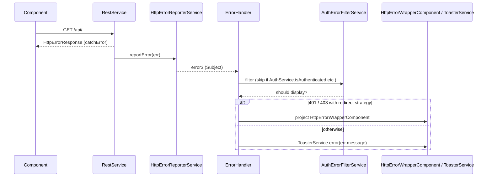

`@abp/ng.theme.shared` is the cross-theme companion to [`@abp/ng.core`](/ng/core). It provides the Bootstrap 5 + ng-bootstrap-based UI primitives that every ABP Angular theme — Basic, Lepton, LeptonX — composes into a full shell. If you swap themes, the breadcrumb, toast, modal, confirmation dialog, http-error wrapper, validation messages, and `ngx-datatable` defaults remain the same; only the surrounding layout changes.

Because almost every feature module (`@abp/ng.identity`, `@abp/ng.tenant-management`, etc.) depends on `@abp/ng.theme.shared`, learning it is the prerequisite to consuming the rest of the ABP Angular stack.

## Package layout

```text npm/ng-packs/packages/theme-shared/src/lib/
adapters/
animations/
components/
  breadcrumb/           BreadcrumbComponent — reads RoutesService
  breadcrumb-items/     BreadcrumbItemsComponent
  button/               ButtonComponent (loading state)
  card/                 CardModule
  checkbox/             FormCheckboxComponent
  confirmation/         ConfirmationComponent + ConfirmationService
  form-input/           FormInputComponent — generic reactive-forms wrapper
  http-error-wrapper/   HttpErrorWrapperComponent — 401/403/404/500 screens
  internet-connection-status/
  loader-bar/           LoaderBarComponent (driven by HttpWaitService)
  loading/              LoadingComponent + *abpLoading
  modal/                ModalComponent + ModalCloseDirective
  password/             PasswordComponent (visibility toggle)
  toast/                ToastComponent
  toast-container/      ToastContainerComponent + ToasterService
constants/              validation.ts (DEFAULT_VALIDATION_BLUEPRINTS)
directives/             EllipsisDirective, LoadingDirective, NgxDatatableDefaultDirective,
                        NgxDatatableListDirective, AbpVisibleDirective, DisabledDirective
enums/                  route-names, error-screen
handlers/               document-dir.handler.ts, error.handler.ts
models/                 confirmation, toaster, http-error
providers/              ERROR_HANDLERS_PROVIDERS, NG_BOOTSTRAP_CONFIG_PROVIDERS,
                        THEME_SHARED_ROUTE_PROVIDERS, tenant-not-found.provider
services/               confirmation.service.ts, toaster.service.ts,
                        page-alert.service.ts, nav-items.service.ts,
                        user-menu.service.ts, *error-handler.service.ts
theme-shared.module.ts  ThemeSharedModule.forRoot
tokens/                 HTTP_ERROR_CONFIG, CONFIRMATION_ICONS, THEME_SHARED_APPEND_CONTENT
utils/
```

The root entry point is `theme-shared.module.ts`:

```ts npm/ng-packs/packages/theme-shared/src/lib/theme-shared.module.ts
const declarationsWithExports = [
  BreadcrumbComponent,
  BreadcrumbItemsComponent,
  ButtonComponent,
  ConfirmationComponent,
  LoaderBarComponent,
  LoadingComponent,
  ModalComponent,
  ToastComponent,
  ToastContainerComponent,
  LoadingDirective,
  ModalCloseDirective,
  FormInputComponent,
  FormCheckboxComponent,
];

@NgModule({
  imports: [
    CoreModule, NgxDatatableModule, NgxValidateCoreModule, NgbPaginationModule,
    EllipsisDirective, CardModule, PasswordComponent,
    NgxDatatableDefaultDirective, NgxDatatableListDirective,
    DisabledDirective, AbpVisibleDirective,
  ],
  declarations: [...declarationsWithExports, HttpErrorWrapperComponent],
  exports: [
    NgxDatatableModule, NgxValidateCoreModule, CardModule,
    DisabledDirective, AbpVisibleDirective,
    NgxDatatableListDirective, NgxDatatableDefaultDirective,
    ...declarationsWithExports,
  ],
  providers: [DatePipe],
})
export class BaseThemeSharedModule {}
```

## `ThemeSharedModule.forRoot`

Application hosts call `forRoot` once. Notice the option bag — `httpErrorConfig`, `validation`, `confirmationIcons` — is the standard way to customize the package without subclassing:

```ts npm/ng-packs/packages/theme-shared/src/lib/theme-shared.module.ts
static forRoot(
  { httpErrorConfig, validation = {}, confirmationIcons = {} } = {} as RootParams,
): ModuleWithProviders<ThemeSharedModule> {
  return {
    ngModule: ThemeSharedModule,
    providers: [
      { provide: APP_INITIALIZER, multi: true, deps: [ErrorHandler], useFactory: noop },
      THEME_SHARED_ROUTE_PROVIDERS,
      { provide: APP_INITIALIZER, multi: true, deps: [THEME_SHARED_APPEND_CONTENT], useFactory: noop },
      { provide: HTTP_ERROR_CONFIG, useValue: httpErrorConfig },
      { provide: 'HTTP_ERROR_CONFIG', useFactory: httpErrorConfigFactory, deps: [HTTP_ERROR_CONFIG] },
      { provide: NgbDateParserFormatter, useClass: DateParserFormatter },
      NG_BOOTSTRAP_CONFIG_PROVIDERS,
      { provide: VALIDATION_BLUEPRINTS,
        useValue: { ...DEFAULT_VALIDATION_BLUEPRINTS, ...(validation.blueprints || {}) } },
      { provide: VALIDATION_MAP_ERRORS_FN, useValue: validation.mapErrorsFn || defaultMapErrorsFn },
      { provide: VALIDATION_VALIDATE_ON_SUBMIT, useValue: validation.validateOnSubmit },
      DocumentDirHandlerService,
      { provide: APP_INITIALIZER, useFactory: noop, multi: true, deps: [DocumentDirHandlerService] },
      { provide: CONFIRMATION_ICONS,
        useValue: { ...DEFAULT_CONFIRMATION_ICONS, ...(confirmationIcons || {}) } },
      tenantNotFoundProvider,
      ERROR_HANDLERS_PROVIDERS,
    ],
  };
}
```

The four notable side-effects:

1. `ErrorHandler` is force-instantiated as an `APP_INITIALIZER` so it can subscribe to `HttpErrorReporterService` (the source of every error toast).
2. `DocumentDirHandlerService` sets `<html dir="rtl">` when the active locale is RTL.
3. `tenantNotFoundProvider` and `ERROR_HANDLERS_PROVIDERS` register the strategies that decide whether to show a toast, the [`HttpErrorWrapperComponent`](#httperrorwrappercomponent), or redirect to login.
4. `THEME_SHARED_ROUTE_PROVIDERS` contributes the "404", "500", and "Account not confirmed" routes the package owns.

## Components

| Component | Selector | Purpose |
| --- | --- | --- |
| `BreadcrumbComponent` | `<abp-breadcrumb>` | Renders the page breadcrumb from `RoutesService` tree. |
| `BreadcrumbItemsComponent` | `<abp-breadcrumb-items>` | Individual breadcrumb segment renderer. |
| `ButtonComponent` | `<abp-button>` | Bootstrap button with `loading` state and icon slots. |
| `CardModule` | `<abp-card>` | Lightweight card wrapper. |
| `ConfirmationComponent` | (dynamic) | Modal projected by `ConfirmationService`. |
| `FormInputComponent` | `<abp-form-input>` | Reactive-forms-compatible input with label, hint, and validation message. |
| `FormCheckboxComponent` | `<abp-form-checkbox>` | Checkbox variant. |
| `HttpErrorWrapperComponent` | (dynamic) | Full-screen error component for 401/403/404/500. |
| `InternetConnectionStatusComponent` | `<abp-internet-connection-status>` | Banner shown when offline. |
| `LoaderBarComponent` | `<abp-loader-bar>` | Top-of-page progress bar driven by `HttpWaitService`. |
| `LoadingComponent` + `LoadingDirective` | `*abpLoading` | Spinner overlay. |
| `ModalComponent` + `ModalCloseDirective` | `<abp-modal>`, `abp-modal-close` | NgBootstrap modal wrapper. |
| `PasswordComponent` | `<abp-password>` | Password input with visibility toggle. |
| `ToastComponent` + `ToastContainerComponent` | (dynamic) | Toast UI created by `ToasterService`. |

### Breadcrumb

`BreadcrumbComponent` walks the current route up to the root via `RoutesService` and emits the segments. Notice it uses the `SubscriptionService` from `@abp/ng.core` to scope all subscriptions to the component lifetime:

```ts npm/ng-packs/packages/theme-shared/src/lib/components/breadcrumb/breadcrumb.component.ts
@Component({
  selector: 'abp-breadcrumb',
  templateUrl: './breadcrumb.component.html',
  changeDetection: ChangeDetectionStrategy.OnPush,
  providers: [SubscriptionService],
})
export class BreadcrumbComponent implements OnInit {
  segments: Partial<ABP.Route>[] = [];

  constructor(
    public readonly cdRef: ChangeDetectorRef,
    private router: Router,
    private routes: RoutesService,
    private subscription: SubscriptionService,
    private routerEvents: RouterEvents,
  ) {}

  ngOnInit(): void {
    this.subscription.addOne(
      this.routerEvents.getNavigationEvents('End').pipe(
        startWith(null),
        map(() => this.routes.search({ path: getRoutePath(this.router) })),
      ),
      route => { /* walk parent chain into this.segments */ },
    );
  }
}
```

### `HttpErrorWrapperComponent`

The component the `ErrorHandler` projects when the backend returns a 401, 403, 404, 500 or a tenant-not-found error. The host application can supply a custom component through `HTTP_ERROR_CONFIG.errorScreen.component` for any of these screens.

```ts npm/ng-packs/packages/theme-shared/src/lib/components/http-error-wrapper/http-error-wrapper.component.ts
@Component({
  selector: 'abp-http-error-wrapper',
  templateUrl: './http-error-wrapper.component.html',
  styleUrls: ['http-error-wrapper.component.scss'],
  providers: [SubscriptionService],
})
export class HttpErrorWrapperComponent implements OnInit, AfterViewInit, OnDestroy {
  protected readonly document = inject(DOCUMENT);
  protected readonly window = this.document.defaultView;

  appRef!: ApplicationRef;
  cfRes!: ComponentFactoryResolver;
  injector!: Injector;

  status: ErrorScreenErrorCodes = 0;
  title: LocalizationParam = 'Oops!';
  details: LocalizationParam = 'Sorry, an error has occured.';
  customComponent: Type<any> | undefined = undefined;
  destroy$!: Subject<void>;
  hideCloseIcon = false;
  backgroundColor!: string;
  /* ... */
}
```

## Services

| Service | Provided in | Responsibility |
| --- | --- | --- |
| `ConfirmationService` | `'root'` | Project a `ConfirmationComponent` and return a `Confirmation.Status` observable. |
| `ToasterService` | `'root'` | Project a `ToastContainerComponent` and `info/success/warn/error/show` toast. |
| `PageAlertService` | `'root'` | Inline page alerts (sticky banner inside the page chrome). |
| `NavItemsService` | `'root'` | Registry of side-menu nav items. Consumed by `@abp/ng.theme.basic`. |
| `UserMenuService` | `'root'` | Registry of the user dropdown items (manage profile, logout, language). |
| `AbpFormatErrorHandler` | `'root'` | Formats `HttpErrorResponse` payloads into `LocalizationParam`. |
| `RouterErrorHandler`, `StatusCodeErrorHandler`, `UnknownStatusCodeErrorHandler`, `TenantResolveErrorHandler` | `'root'` | Strategy classes registered via `ERROR_HANDLERS_PROVIDERS`. |
| `CreateErrorComponent` | `'root'` | Factory that mounts `HttpErrorWrapperComponent` into the DOM. |

### `ConfirmationService`

`ConfirmationService` uses `ContentProjectionService` (from `@abp/ng.core`) to append the modal to `<body>` and exposes typed shortcuts:

```ts npm/ng-packs/packages/theme-shared/src/lib/services/confirmation.service.ts
@Injectable({ providedIn: 'root' })
export class ConfirmationService {
  status$!: Subject<Confirmation.Status>;
  confirmation$ = new ReplaySubject<Confirmation.DialogData | null>(1);

  private containerComponentRef!: ComponentRef<ConfirmationComponent>;

  clear = (status: Confirmation.Status = Confirmation.Status.dismiss) => {
    this.confirmation$.next(null);
    this.status$.next(status);
  };

  constructor(private contentProjectionService: ContentProjectionService) {}

  info(message: LocalizationParam, title: LocalizationParam,
       options?: Partial<Confirmation.Options>): Observable<Confirmation.Status> {
    return this.show(message, title, 'info', options);
  }
  success(message, title, options?) { return this.show(message, title, 'success', options); }
  warn(message, title, options?)    { return this.show(message, title, 'warning', options); }
  error(message, title, options?)   { return this.show(message, title, 'error', options); }
}
```

`Confirmation.Status` is a `'confirm' | 'reject' | 'dismiss'` enum — perfect for piping into `filter(s => s === 'confirm')` before invoking a destructive action.

### `ToasterService`

The toaster mirrors the confirmation API — `info`, `success`, `warn`, `error`, and the more generic `show`. Each call returns a `Toaster.ToasterId` you can later pass to `remove(id)` to dismiss the toast programmatically.

```ts npm/ng-packs/packages/theme-shared/src/lib/services/toaster.service.ts
@Injectable({ providedIn: 'root' })
export class ToasterService implements ToasterContract {
  private toasts$ = new ReplaySubject<Toaster.Toast[]>(1);
  private lastId = -1;
  private toasts = [] as Toaster.Toast[];

  constructor(private contentProjectionService: ContentProjectionService) {}

  info(message: LocalizationParam, title?: LocalizationParam,
       options?: Partial<Toaster.ToastOptions>): Toaster.ToasterId {
    return this.show(message, title, 'info', options);
  }
  success(message, title?, options?) { return this.show(message, title, 'success', options); }
  /* warn, error, show ... */
}
```

The `LocalizationParam` shape means you can pass either a localization key string (`'AbpUi::DeletedSuccessfully'`) or a tuple `['AbpUi::DeletedItem', itemName]` and `ToasterService` will resolve it through `LocalizationService` at render time.

## Validation blueprints

`@abp/ng.theme.shared` ships the default mapping from `@ngx-validate/core` error keys to ABP localization keys, so any reactive form whose template uses `<abp-form-input>` automatically displays localized validation messages aligned with the ASP.NET Core defaults:

```ts npm/ng-packs/packages/theme-shared/src/lib/constants/validation.ts
export const DEFAULT_VALIDATION_BLUEPRINTS = {
  creditCard: 'AbpValidation::ThisFieldIsNotAValidCreditCardNumber.',
  email: 'AbpValidation::ThisFieldIsNotAValidEmailAddress.',
  invalid: 'AbpValidation::ThisFieldIsNotValid.',
  max: 'AbpValidation::ThisFieldMustBeLessOrEqual{0}[{{ max }}]',
  maxlength:
    'AbpValidation::ThisFieldMustBeAStringOrArrayTypeWithAMaximumLengthOf{0}[{{ requiredLength }}]',
  min: 'AbpValidation::ThisFieldMustBeGreaterThanOrEqual{0}[{{ min }}]',
  minlength:
    'AbpValidation::ThisFieldMustBeAStringOrArrayTypeWithAMinimumLengthOf{0}[{{ requiredLength }}]',
  ngbDate: 'AbpValidation::ThisFieldIsNotValid.',
  passwordMismatch: 'AbpIdentity::Volo.Abp.Identity:PasswordConfirmationFailed',
  range: 'AbpValidation::ThisFieldMustBeBetween{0}And{1}[{{ min }},{{ max }}]',
  required: 'AbpValidation::ThisFieldIsRequired.',
  url: 'AbpValidation::ThisFieldIsNotAValidFullyQualifiedHttpHttpsOrFtpUrl',
  passwordRequiresLower: 'AbpIdentity::Volo.Abp.Identity:PasswordRequiresLower',
  passwordRequiresUpper: 'AbpIdentity::Volo.Abp.Identity:PasswordRequiresUpper',
  passwordRequiresDigit: 'AbpIdentity::Volo.Abp.Identity:PasswordRequiresDigit',
  passwordRequiresNonAlphanumeric: 'AbpIdentity::Volo.Abp.Identity:PasswordRequiresNonAlphanumeric',
  usernamePattern: 'AbpIdentity::Volo.Abp.Identity:InvalidUserName[{{ actualValue }}]',
  customMessage: '{{ customMessage }}',
};
```

Pass your own keys via `ThemeSharedModule.forRoot({ validation: { blueprints: { required: 'My::Custom' } } })`. The values are merged — you only override the keys you care about.

<Tip>
The `AbpIdentity::*` keys above are owned by the [Identity module](/modules/identity). When you swap your backend to use a different identity provider, override these blueprints rather than redefining the localization keys.
</Tip>

## Tokens & providers

| Token | Purpose |
| --- | --- |
| `HTTP_ERROR_CONFIG` | `httpErrorConfigFactory` merges defaults with user overrides. Controls which status codes redirect to login, which show a toast, and which mount `HttpErrorWrapperComponent`. |
| `CONFIRMATION_ICONS` | Icon class map for `info/success/warn/error` confirmations. |
| `THEME_SHARED_APPEND_CONTENT` | Tokens consumed by an `APP_INITIALIZER` that appends `<abp-toast-container>` etc. to `<body>`. |
| `VALIDATION_BLUEPRINTS` | Re-export from `@ngx-validate/core` — populated with `DEFAULT_VALIDATION_BLUEPRINTS`. |
| `THEME_SHARED_ROUTE_PROVIDERS` | Contributes the standard error routes via `RoutesService`. |
| `NG_BOOTSTRAP_CONFIG_PROVIDERS` | Defaults for `NgbDatepicker`, `NgbModal`, `NgbTooltip`. |

## Error handling pipeline



The strategy classes registered via `ERROR_HANDLERS_PROVIDERS` (`RouterErrorHandler`, `StatusCodeErrorHandler`, `TenantResolveErrorHandler`, `UnknownStatusCodeErrorHandler`) decide which branch runs.

## How themes use this package

`@abp/ng.theme.basic` and `@abp/ng.theme.lepton-x` both:

- Import `ThemeSharedModule` so `<abp-breadcrumb>`, `<abp-toast-container>`, and friends are available inside their layout templates.
- Re-use `ConfirmationService` and `ToasterService` directly — none of the toast/confirmation logic is duplicated per theme.
- Override Bootstrap variables for the look-and-feel but keep the component contracts identical, which is why you can switch themes by changing one `import` in your app module.

## Cross-references

- Page chrome and extensible tables live in [`@abp/ng.components`](/ng/components).
- Layout chrome (`<abp-layout-application>`, `<abp-layout-account>`, `<abp-layout-empty>`) lives in [`@abp/ng.theme.basic`](/ng/theme-basic).
- Authentication / token attachment lives in [`@abp/ng.oauth`](/ng/oauth).
- The error wrapper status codes use the validation keys owned by [Identity](/modules/identity).
- The tenant-not-found handler reports through the [Tenant Management module](/modules/tenant-management).
- The 401/403 redirect uses `AuthService.navigateToLogin` documented in [`@abp/ng.core`](/ng/core#authentication-abstraction).
