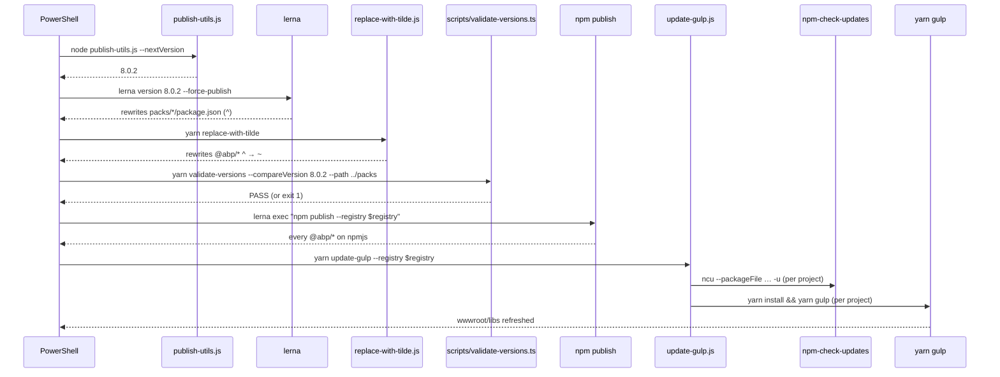

ABP's npm workspace is glued together by a thin layer of TypeScript and JavaScript tooling that lives at the `npm/` root and inside the `npm/scripts/` directory. None of these tools are shipped to npmjs.org — they exist to keep the 50+ `@abp/*` packs and the Angular libraries in lockstep with the NuGet release version held in `common.props`. This page documents what each script does, the command-line surface it exposes, and where it plugs into the publish pipeline described in [`/npm/build-scripts`](/npm/build-scripts).

In addition the page covers the gulp tooling that ships **inside** `@abp/aspnetcore.mvc.ui` (`gulp/copy-resources.js`) because it is the only piece of "tooling" that is also a published npm package consumed at the build time of every ABP MVC project.

## File inventory

<Files>
```
npm/
├── package.json                    ← script host (lerna, ncu, fs-extra, glob, semver)
├── update-gulp.js                  ← walks every .csproj+gulpfile.js pair under the repo
├── replace-with-tilde.js           ← rewrites @abp/* dep ranges from ^ to ~
├── publish-utils.js                ← reads <Version> from common.props
├── package-update-script.js        ← ncu sweep over package.json files
└── scripts/                        ← TS scripts, ts-node executed
    ├── package.json                ← name: "abp-npm-scripts"
    ├── tsconfig.json
    ├── change-package-version.ts
    ├── validate-versions.ts
    ├── remove-lock-files.ts
    └── utils/
        └── log.ts

npm/packs/aspnetcore.mvc.ui/
└── gulp/
    └── copy-resources.js           ← the published gulp helper
```
</Files>

`npm/scripts/package.json` registers three yarn scripts and uses `ts-node -r tsconfig-paths/register` to run them directly without a build step:

```json npm/scripts/package.json
{
  "name": "abp-npm-scripts",
  "version": "1.0.0",
  "description": "",
  "scripts": {
    "remove-lock-files":
      "yarn && ts-node -r tsconfig-paths/register remove-lock-files.ts",
    "validate-versions":
      "yarn && ts-node -r tsconfig-paths/register validate-versions.ts",
    "change-package-version":
      "ts-node -r tsconfig-paths/register change-package-version.ts"
  },
  "dependencies": {
    "axios": "^0.24.0",
    "chalk": "^4.1.0",
    "commander": "^11.0.0",
    "execa": "^5.1.1",
    "fs-extra": "^9.0.1",
    "glob": "^7.1.6",
    "npm-check-updates": "^9.0.1",
    "typescript": "^4.0.2"
  },
  "devDependencies": {
    "@types/fs-extra": "^9.0.1",
    "ts-node": "^9.0.0",
    "tsconfig-paths": "^3.9.0"
  }
}
```

## `scripts/validate-versions.ts`

This is the gatekeeper for the entire publish flow. After `lerna version` bumps every `packs/*/package.json` and after `replace-with-tilde.js` rewrites the ranges, `publish-mvc.ps1` runs:

```
yarn validate-versions --compareVersion $Version --path ../packs
```

The script reads every folder under `--path`, opens its `package.json`, and:

1. fails if `pkgJson.version !== compareVersion`;
2. walks `dependencies` (peer deps are intentionally skipped per the inline TODO) and fails if any `@abp/*` or `@volo/*` package points to a version different from `compareVersion`.

```ts npm/scripts/validate-versions.ts (excerpt)
function initCommander() {
  program.requiredOption(
    '-v, --compareVersion <version>',
    'version to compare'
  );
  program.requiredOption('-p, --path <path>', 'NPM packages folder path');
  program.option(
    '-ep, --excludedPackages <excludedpackages>',
    'Packages that will not be checked. Can be passed with separeted comma (like @abp/utils,@abp/core)',
    ''
  );
  program.parse(process.argv);

  excludedPackages = program.opts().excludedPackages.split(',');
}

async function compare() {
  let { compareVersion, path: packagesPath } = program.opts();
  packagesPath = path.resolve(packagesPath);
  const packageFolders = await fse.readdir(packagesPath);

  for (let i = 0; i < packageFolders.length; i++) {
    const folder = packageFolders[i];
    const pkgJsonPath = `${packagesPath}/${folder}/package.json`;
    let pkgJson;
    try {
      pkgJson = await fse.readJSON(pkgJsonPath);
    } catch (error) {}

    if (
      !excludedPackages.includes(pkgJson.name) &&
      pkgJson.version !== compareVersion
    ) {
      throwError(pkgJsonPath, pkgJson.name, pkgJson.version);
    }

    const { dependencies, peerDependencies } = pkgJson;
    if (dependencies) await compareDependencies(dependencies, pkgJsonPath);
    // if (peerDependencies) { // TODO: update peerDependencies while updating version
    //   await compareDependencies(peerDependencies, pkgJsonPath);
    // }
  }
}
```

Both `@abp` and `@volo` are matched via regex:

```ts
async function compareDependencies(
  dependencies: Record<string, string>,
  filePath: string
) {
  const { compareVersion } = program.opts();
  const entries = Object.entries(dependencies);

  for (let i = 0; i < entries.length; i++) {
    const entry = entries[i];
    const packageName = entry[0];
    const version = getCleanVersionName(entry[1]);
    const cleanCompareVersion = getCleanVersionName(compareVersion);
    if (
      !excludedPackages.includes(entry[0]) &&
      packageName.match(/@(abp|volo)/)?.length &&
      version !== cleanCompareVersion
    ) {
      throwError(filePath, entry[0], cleanCompareVersion);
    }
  }
}

function getCleanVersionName(version) {
  // Remove caret (^) or tilde (~) from the beginning of the version number
  return version.replace(/^[\^~]+/, '');
}
```

`getCleanVersionName` strips the leading `^` or `~` before comparison so the test is purely on the semver triple.

A failure is printed via `chalk` and exits with code 1:

```ts npm/scripts/utils/log.ts
import { bold } from 'chalk';

export const log = {
  info: (message: string) => console.log(bold.blue(`\n${message}\n`)),
  error: (message: string) => console.log(bold.underline.red(`\n${message}\n`)),
};
```

## `scripts/change-package-version.ts`

A bulk find-and-replace for any single package across **every** `package.json` in the repository (excluding `node_modules`, `dist`, `build`, `scripts`, `wwwroot`). It is invoked manually when a third-party package — say `@angular/core` or `@volo/ngx-lepton-x.lite` — needs to be bumped across all templates and the dev-app at once.

```ts npm/scripts/change-package-version.ts (excerpt)
(function findPackageJsonFiles() {
  setupCommander();
  const options = {
    ignore: [
      "../../**/node_modules/**",
      "../../**/dist/**",
      "../../**/build/**",
      "../../**/scripts/**",
      "../../**/wwwroot/**"
    ]
  };

  const workingDir = "../../";
  glob(`${workingDir}**/package.json`, options, (err, files) => {
    if (err) throw err;

    const { packageName, targetVersion } = program.opts();

    for (const file of files) {
      readPackageJsonFile(file, packageName, targetVersion);
    }
  });
})();
```

It mutates each section that contains the target key:

```ts
fse.readJson(path, (err, packageObj) => {
    if (err) throw err;

    const { dependencies, peerDependencies, devDependencies } = packageObj;
    const results = [];

    let result = { ...packageObj };
    if (dependencies) {
      const [founded, d] = replace(dependencies, key, newVersion);
      results.push(founded);
      result = { ...result, dependencies: d };
    }
    if (peerDependencies) { /* same shape */ }
    if (devDependencies)  { /* same shape */ }

    const anyChanges = !results.some(x => x);
    if (anyChanges) return;
    console.log("changed", path);
    writeFile(path, result);
  }
);
```

The semver pattern it matches:

```ts
export const semverRegex =
  /\d+\.\d+\.\d+(?:-[a-zA-Z0-9]+(?:\.[a-zA-Z0-9-]+)*)?(?:\+[a-zA-Z0-9]+(?:\.[a-zA-Z0-9-]+)*)?$/;
```

Usage:

```bash
cd npm/scripts
yarn change-package-version --packageName @abp/ng.core --targetVersion 8.0.2
```

The CLI surface, defined via Commander:

```ts
function setupCommander() {
  program
    .option("-n, --packageName <packageName>", "Package name")
    .option("-v, --targetVersion <targetVersion>", "Version number of the package");
  program.parse(process.argv);
}
```

## `scripts/remove-lock-files.ts`

Run from `publish-ng.ps1` after the Angular libraries have been built, this script deletes `yarn.lock` and `package-lock.json` from the three Angular template projects so that `yarn install` inside the templates is forced to pick up the freshly published `@abp/ng.*` versions on the next `dotnet new`:

```ts npm/scripts/remove-lock-files.ts
import fse from 'fs-extra';
import { log } from './utils/log';

removeLockFiles();

export async function removeLockFiles() {
  const folders = [
    '../../templates/app/angular',
    '../../templates/app/react-native',
    '../../templates/module/angular',
  ];

  try {
    for (let i = 0; i < folders.length; i++) {
      await fse.remove(`${folders[i]}/yarn.lock`);
      await fse.remove(`${folders[i]}/package-lock.json`);
    }
  } catch (error) {
    throwError(error?.message || error);
  }
}
```

It is invoked as part of the Angular publish chain:

```powershell npm/publish-ng.ps1 (excerpt)
$commands = (
  "cd ng-packs",
  "yarn install",
  $UpdateNgPacksCommand,
  "cd scripts",
  "yarn install",
  $NgPacksPublishCommand,
  "cd ../../",
  "cd scripts",
  "yarn remove-lock-files",
  "cd ..",
  $UpdateGulpCommand
)
```

## Root-level Node scripts

### `publish-utils.js` — single source of version truth

```js npm/publish-utils.js
const { program } = require('commander');
const fse = require('fs-extra');
const semverParse = require('semver/functions/parse');

program.version('0.0.1');
program.option('-n, --nextVersion', 'version in common.props');
program.option('-pr, --prerelease', 'whether version is prerelease');
program.option('-cv, --customVersion <customVersion>', 'set exact version');

program.parse(process.argv);

if (program.nextVersion) console.log(getVersion());

if (program.prerelease)
  console.log(!!semverParse(getVersion()).prerelease?.length);

function getVersion() {
  if (program.customVersion) return program.customVersion;
  const commonProps = fse.readFileSync('../common.props').toString();
  const versionTag = '<Version>';
  const versionEndTag = '</Version>';
  const first = commonProps.indexOf(versionTag) + versionTag.length;
  const last = commonProps.indexOf(versionEndTag);
  return commonProps.substring(first, last);
}
```

Every PowerShell publish script calls `node publish-utils.js --nextVersion` to read the canonical version, and `--prerelease --customVersion <v>` to decide whether to add the `--tag next` flag to `npm publish`.

### `replace-with-tilde.js` — caret to tilde

This is run between `lerna version` and `validate-versions`. Lerna writes ranges like `"@abp/core": "^8.0.2"`; the team's convention is `~`. The script glob-walks every `packs/**/package.json` and rewrites `@abp/*` entries:

```js npm/replace-with-tilde.js
const glob = require("glob");
const fse = require("fs-extra");

function replace(filePath) {
  const pkg = fse.readJsonSync(filePath);
  const { dependencies } = pkg;
  if (!dependencies) return;

  Object.keys(dependencies).forEach((key) => {
    if (key.includes("@abp/")) {
      dependencies[key] = dependencies[key].replace("^", "~");
    }
  });

  fse.writeJsonSync(filePath, { ...pkg, dependencies }, { spaces: 2 });
}

glob("./packs/**/package.json", {}, (er, files) => {
  files.forEach((path) => {
    if (path.includes("node_modules")) return;
    replace(path);
  });
});
```

Why tilde? Because the npm packs strictly follow ABP's release cadence — patches are safe inside a minor, but a minor bump may ship breaking changes to the gulp resource maps, so `~` is the correct range.

### `update-gulp.js` — refresh `wwwroot/libs` everywhere

Used at the end of `publish-ng.ps1` to refresh the static-asset bundles of every MVC/Razor host in the repository. It walks every folder that contains both a `.csproj` and a `gulpfile.js`, updates the `@abp/*` versions in its `package.json` via `npm-check-updates`, deletes the existing `wwwroot/libs`, then runs `yarn install && yarn gulp`:

```js npm/update-gulp.js
const glob = require('fast-glob');
const path = require('path');
const childProcess = require('child_process');
const execa = require('execa');
const fse = require('fs-extra');
const { program } = require('commander');

program.version('0.0.1');
program.option('-pr, --prerelease', 'whether version is prerelease');
program.option(
  '-rg, --registry <registry>',
  'NPM server registry',
  'https://registry.npmjs.org'
);
program.parse(process.argv);

const gulp = (folderPath) => {
  if (
    !fse.existsSync(folderPath + 'gulpfile.js') ||
    !glob.sync(folderPath + '*.csproj').length
  ) {
    return;
  }

  try {
    fse.removeSync(`${folderPath}/wwwroot/libs`);
    execa.sync('yarn', ['install'], { cwd: folderPath, stdio: 'inherit' });
    execa.sync('yarn', ['gulp'], { cwd: folderPath, stdio: 'inherit' });
  } catch (error) {
    console.log('\x1b[31m', 'Error: ' + error.message);
  }
};

const updatePackages = (pkgJsonPath) => {
  try {
    const result = childProcess
      .execSync(
        `ncu "/^@abp.*$/" --packageFile ${pkgJsonPath} -u${
          program.prerelease ? ' --target newest' : ''
        } --registry ${program.registry}`
      )
      .toString();
    console.log('\x1b[0m', result);
  } catch (error) {
    console.log('\x1b[31m', 'Error: ' + error.message);
  }
};
```

The `ncu` invocation only matches `@abp/*` regex `/^@abp.*$/` and targets the newest pre-release when `--prerelease` is passed, otherwise it uses the default `--target` (which is `latest`).

### `package-update-script.js` — generic ncu sweep

A more general variant of `update-gulp.js`, usable as `node package-update-script.js <folder> <scope>` to upgrade either `@abp` (default) or any scope passed as the second arg. It does **not** run gulp afterwards; it only rewrites `package.json` files:

```js npm/package-update-script.js (excerpt)
const packages = (process.argv[3] || 'abp').split(',').join('|');

const check = (pkgJsonPath) => {
  try {
    return childProcess
      .execSync(
        `ncu "/^@(${packages}).*$/" --packageFile ${pkgJsonPath} -u${
          program.prerelease ? ' --target greatest' : ' --target patch'
        }${program.registry ? ` --registry ${program.registry}` : ''}`
      )
      .toString();
  } catch (error) {
    console.log('exec error: ' + error.message);
    process.exit(error.status);
  }
};

const folder = process.argv[2] || '.';

glob(folder + '/**/package.json', {}, (er, files) => {
  files.forEach((file) => {
    if (
      file.includes('node_modules') ||
      file.includes('ng-packs/dist') ||
      file.includes('wwwroot') ||
      file.includes('bin/Debug')
    ) {
      return;
    }
    console.log(check(file));
  });
});
```

Note the scope difference vs. `update-gulp.js`: this one uses `--target greatest` for pre-release and `--target patch` for stable, whereas `update-gulp.js` uses `--target newest` / default. The exposed `yarn update` script at the root maps to this:

```json npm/package.json (excerpt)
"scripts": {
  "lerna": "lerna",
  "ncu": "ncu",
  "update-gulp": "node update-gulp.js",
  "replace-with-tilde": "node replace-with-tilde.js",
  "update": "node package-update-script.js"
}
```

## Nx-side counterparts (`npm/ng-packs/scripts/`)

The Angular workspace has its own near-identical set of helpers. They are documented in the [Angular pages](/ng/overview), but the entry points relevant to the publish pipeline are summarised here so you know which side of the workspace runs them.

| Script | Purpose |
| --- | --- |
| `scripts/build.ts` | Runs `yarn install` (unless `--noInstall`) and then `nx run-many --target build --prod --projects core,theme-shared,components` followed by feature/permission/account-core, etc., to materialise `dist/`. |
| `scripts/prod-build.ts` | A smaller "build everything then re-copy `@abp` into the Angular template" step used during CI of the template app. |
| `scripts/publish.ts` | The big one: bumps versions via `nx generate @abp/nx.generators:update-version`, builds, swaps `lerna.publish.json` ↔ `lerna.json`, runs `lerna exec npm publish --registry $registry [--tag next|preview]`, commits, swaps back. |
| `scripts/replace-with-tilde.ts` | Sister of the root `replace-with-tilde.js`, scoped to `ng-packs/packages/**`. |
| `scripts/replace-with-preview.ts` | Used when `--preview` is passed to `publish.ts` to tag versions for the preview feed. |
| `scripts/remove-tilde-or-caret.ts` | Inverse of `replace-with-tilde` — used by the build step. |
| `scripts/build-schematics.ts` | Compiles `packages/schematics` into `dist/packages/schematics` so the generators ship with the Angular libraries. |
| `scripts/copy-packages-to-templates.ts` | Pushes locally built `@abp/ng.*` artefacts into the Angular template under `templates/app/angular/node_modules/@abp` for offline smoke tests. |

The `publish.ts` CLI surface:

```ts npm/ng-packs/scripts/publish.ts (excerpt)
program
  .option('-v, --nextVersion <version>',
    'next semantic version. Available versions: ["major", "minor", "patch", "premajor", "preminor", "prepatch", "prerelease", "or type a custom version"]')
  .option('-r, --registry <registry>', 'target npm server registry')
  .option('-p, --preview', 'publishes with preview tag')
  .option('-sg, --skipGit', 'skips git push')
  .option('-sv, --skipVersionValidation', 'skips version validation');
```

A rollback path is built in: if any step throws, the script rewinds to the previous version:

```ts
} catch (error) {
  console.error(error.stderr);
  console.error('\n\nAn error has occurred! Rolling back the changed package versions.');
  await updateVersion(oldVersion);
  process.exit(1);
}
```

```ts
async function updateVersion(version: string) {
  await execa('yarn', ['update-version', version], { stdout: 'inherit', cwd: '../' });
  await execa('yarn', ['replace-with-tilde']);
}
```

## The gulp helper inside `@abp/aspnetcore.mvc.ui`

The single npm-published "tool" is `@abp/aspnetcore.mvc.ui/gulp/copy-resources.js`. It is what every ABP MVC application's `gulpfile.js` calls to populate `wwwroot/libs/` from `node_modules`. Its public surface is one function:

```js packs/aspnetcore.mvc.ui/gulp/copy-resources.js (entry point)
function copyResourcesTask (path) {
    rootPath = path;
    resourceMapping = normalizeResourceMapping(buildResourceMapping(rootPath));

    cleanDirsAndFiles(resourceMapping.clean);

    var tasks = [];

    if (resourceMapping.mappings) {
        for (var mapping in resourceMapping.mappings) {
            if (resourceMapping.mappings.hasOwnProperty(mapping)) {
                var destination = replaceAliases(resourceMapping.mappings[mapping]);
                if (fs.existsSync(destination)) continue;

                var source = replaceAliases(mapping);
                tasks.push(
                    gulp.src(source).pipe(gulp.dest(destination))
                );
            }
        }
    }

    return merge(tasks);
}

module.exports = copyResourcesTask;
```

Defaults applied by `normalizeResourceMapping`:

```js
function normalizeResourceMapping(resourcemapping) {
    var defaultSettings = {
        aliases: {
            "@node_modules": "./node_modules",
            "@libs": "./wwwroot/libs"
        },
        clean: [
            "@libs"
        ]
    };
    extendObject(defaultSettings.aliases, resourcemapping.aliases);
    resourcemapping.aliases = defaultSettings.aliases;
    resourcemapping.clean = resourcemapping.clean || defaultSettings.clean;
    return resourcemapping;
}
```

Transitive merge of all `abp.resourcemapping.js` files reachable through `dependencies`:

```js
function buildResourceMapping(packagePath) {
    if (investigatedPackagePaths[packagePath]) return {};
    investigatedPackagePaths[packagePath] = 'OK';

    var packageJson = requireOptional(path.join(packagePath, 'package.json'));
    var resourcemapping =
        requireOptional(path.join(packagePath, 'abp.resourcemapping.js')) || {};

    if (packageJson && packageJson.dependencies) {
        var aliases = {};
        var mappings = {};
        for (var dependency in packageJson.dependencies) {
            if (packageJson.dependencies.hasOwnProperty(dependency)) {
                var dependedPackagePath =
                    path.join(rootPath, 'node_modules', dependency);
                var importedResourceMapping =
                    buildResourceMapping(dependedPackagePath);
                extendObject(aliases, importedResourceMapping.aliases);
                extendObject(mappings, importedResourceMapping.mappings);
            }
        }
        extendObject(aliases, resourcemapping.aliases);
        extendObject(mappings, resourcemapping.mappings);
        resourcemapping.aliases = aliases;
        resourcemapping.mappings = mappings;
    }
    return resourcemapping;
}
```

Glob-driven cleanup of stale files:

```js
function cleanDirsAndFiles(patterns) {
    const { dirs, files } = findDirsAndFiles(patterns);

    files.forEach(file => {
        try { fs.unlinkSync(file); } catch (_) {}
    });

    dirs.sort((a, b) => a < b ? 1 : -1);

    dirs.forEach(dir => {
        if (fs.readdirSync(dir).length) return;
        try { fs.rmdirSync(dir, {}); } catch (_) {}
    });
}
```

See [`/npm/aspnetcore-mvc-ui-packages`](/npm/aspnetcore-mvc-ui-packages) for the matching mapping files that drive this gulp pipeline.

## How the tools chain together



## Related pages

<CardGroup cols={2}>
<Card title="npm workspace overview" icon="folder-tree" href="/npm/overview">
Lerna packs, Nx ng-packs, scripts, publishing pipeline — the top-down picture.
</Card>
<Card title="MVC UI packs" icon="cubes" href="/npm/aspnetcore-mvc-ui-packages">
The packs themselves and the `abp.resourcemapping.js` files this tooling drives.
</Card>
<Card title="Build & publish scripts" icon="terminal" href="/npm/build-scripts">
The PowerShell entry points (`publish-mvc.ps1`, `publish-ng.ps1`, `preview-publish.ps1`).
</Card>
<Card title="Source-code tooling" icon="hammer" href="/source-code-tooling">
The .NET side — `common.props`, `Directory.Build.props`, `build/*.ps1` — which `publish-utils.js` reads.
</Card>
<Card title="Angular libraries" icon="angular" href="/ng/overview">
Full coverage of the Nx workspace and the `@abp/ng.*` libraries that `ng-packs/scripts/publish.ts` ships.
</Card>
</CardGroup>
