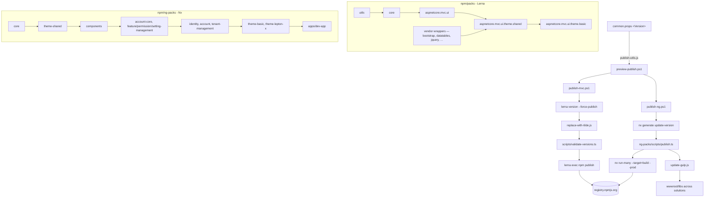

The `npm/` folder at the root of [abpframework/abp](https://github.com/abpframework/abp) hosts every JavaScript and TypeScript artifact that ABP ships to npmjs.org under the `@abp/*` and `@abp/ng.*` scopes. It is split into two distinct sub-workspaces: a [Lerna](https://lerna.js.org/) monorepo under `npm/packs/` that publishes the MVC/UI runtime packages (`@abp/core`, `@abp/bootstrap`, `@abp/datatables.net-bs5`, `@abp/jquery`, etc.), and an [Nx](https://nx.dev/) workspace under `npm/ng-packs/` that builds the Angular libraries (`@abp/ng.core`, `@abp/ng.theme.shared`, `@abp/ng.account`, `@abp/ng.schematics`, …) together with a runnable `dev-app` for local development. A small collection of Node and PowerShell scripts at the `npm/` root wires those two worlds together — they bump versions from `common.props`, validate that every package agrees on the same `~x.y.z` range, install gulp dependencies inside ASP.NET Core MVC projects, and finally invoke `npm publish` against the configured registry.

This page gives a top-down map of the workspace so the more focused pages (`/npm/aspnetcore-mvc-ui-packages`, `/npm/abp-tooling`, `/npm/build-scripts`, `/npm/dev-app`) can dive into each subsystem without re-introducing the structure.

## Top-level layout

<Files>
```
npm/
├── lerna.json
├── package.json
├── package-lock.json / yarn.lock
├── package-update-script.js
├── update-gulp.js
├── replace-with-tilde.js
├── publish-utils.js
├── publish-mvc.ps1
├── publish-ng.ps1
├── preview-publish.ps1
├── scripts/                  ← shared TS tooling (validate-versions, change-package-version, …)
├── verdaccio-containers/     ← Docker compose files for a local npm registry
├── packs/                    ← Lerna packages → @abp/* runtime libs
└── ng-packs/                 ← Nx workspace → @abp/ng.* + dev-app
```
</Files>

The root `package.json` and `lerna.json` describe the Lerna side of the world; the Nx side has its own `package.json`, `nx.json`, `angular.json` and `tsconfig.base.json` inside `npm/ng-packs/`.

### Root `package.json`

```json npm/package.json
{
  "version": "2.3.0",
  "scripts": {
    "lerna": "lerna",
    "ncu": "ncu",
    "update-gulp": "node update-gulp.js",
    "replace-with-tilde": "node replace-with-tilde.js",
    "update": "node package-update-script.js"
  },
  "devDependencies": {
    "@types/fs-extra": "^8.0.1",
    "glob": "^7.1.5",
    "lerna": "^3.18.4",
    "npm-check-updates": "^11.3.0"
  },
  "dependencies": {
    "commander": "^6.0.0",
    "execa": "^3.4.0",
    "fast-glob": "^3.2.7",
    "fs-extra": "^8.1.0",
    "semver": "^7.3.5"
  }
}
```

This file is intentionally minimal — it is a script host, not a published package. Its `version` field is only used for the script collection itself; the canonical ABP version lives in `common.props` at the repository root and is read by [`publish-utils.js`](#publish-utils-js).

### `lerna.json`

```json npm/lerna.json
{
  "version": "8.0.2",
  "packages": [
    "packs/*"
  ],
  "npmClient": "yarn",
  "lerna": "3.18.4"
}
```

Lerna is scoped to `packs/*` only. The Angular libraries are not managed by Lerna; they are built and published by the Nx `scripts/publish.ts` pipeline under `npm/ng-packs/scripts/`. The version `8.0.2` shown here mirrors `<Version>` in `common.props`.

## The two sub-workspaces

<CardGroup cols={2}>
<Card title="packs/ — Lerna monorepo" icon="cube" href="/npm/aspnetcore-mvc-ui-packages">
50+ runtime packages consumed by ASP.NET Core MVC/Razor Pages apps. Includes vendored bundles for Bootstrap, jQuery, DataTables, Sweetalert2, TUI Editor, etc., plus the ABP-authored `@abp/core`, `@abp/utils` and `@abp/aspnetcore.mvc.ui` gulp tooling.
</Card>
<Card title="ng-packs/ — Nx + Angular CLI" icon="angular" href="/ng/overview">
Angular libraries (`@abp/ng.core`, `@abp/ng.theme.shared`, `@abp/ng.identity`, …), schematics, generators, and the `dev-app` host application used to develop and end-to-end test them locally.
</Card>
</CardGroup>

### `npm/packs/` — quick inventory

<AccordionGroup>
<Accordion title="ABP-authored core/runtime packs">
- `@abp/core` — base abp namespace (`abp.js`, `abp.css`) consumed by every other pack
- `@abp/utils` — generic TypeScript utilities shared with `@abp/ng.core`
- `@abp/aspnetcore.mvc.ui` — gulp helpers (`abp.resourcemapping.js` runner) that copy `wwwroot/libs/*` from `node_modules`
- `@abp/aspnetcore.mvc.ui.theme.shared` — meta-package: empty `dependencies` aggregating every theme-shared vendor library
- `@abp/aspnetcore.mvc.ui.theme.basic` — meta-package adding the basic-theme bundle
- `@abp/aspnetcore.components.server.theming` / `…basictheme` — Blazor Server theming packs
</Accordion>
<Accordion title="Vendor wrappers (one folder per library)">
`anchor-js`, `bootstrap`, `bootstrap-datepicker`, `bootstrap-daterangepicker`, `chart.js`, `clipboard`, `codemirror`, `cropperjs`, `datatables.net`, `datatables.net-bs4`, `datatables.net-bs5`, `flag-icon-css`, `flag-icons`, `font-awesome`, `highlight.js`, `jquery`, `jquery-form`, `jquery-validation`, `jquery-validation-unobtrusive`, `jstree`, `lodash`, `luxon`, `malihu-custom-scrollbar-plugin`, `markdown-it`, `moment`, `owl.carousel`, `popper.js`, `prismjs`, `qrcode`, `select2`, `signalr`, `slugify`, `star-rating-svg`, `sweetalert2`, `timeago`, `toastr`, `tui-editor`, `uppy`, `vee-validate`, `virtual-file-explorer`, `vue`, `zxcvbn`.

Each one carries a small `abp.resourcemapping.js` describing which files inside `node_modules` should land in `wwwroot/libs/<lib>/`. See [`/npm/aspnetcore-mvc-ui-packages`](/npm/aspnetcore-mvc-ui-packages).
</Accordion>
<Accordion title="Module-bound packs">
`blogging`, `cms-kit`, `cms-kit.admin`, `cms-kit.public`, `docs` — JavaScript shipped by the Blogging, CMS Kit and Docs modules.
</Accordion>
</AccordionGroup>

### `npm/ng-packs/` — quick inventory

The Nx workspace uses `packages/` as the libs directory (see `nx.json`) and `apps/` as the apps directory:

```json npm/ng-packs/nx.json (excerpt)
{
  "workspaceLayout": {
    "libsDir": "packages",
    "appsDir": ""
  },
  "defaultProject": "dev-app"
}
```

<Files>
```
npm/ng-packs/
├── apps/
│   ├── dev-app/              ← Angular host app for local dev (see /npm/dev-app)
│   └── dev-app-e2e/
├── packages/                 ← Angular libraries (see /ng/*)
│   ├── core/                 ← @abp/ng.core
│   ├── components/
│   ├── account/   account-core/
│   ├── identity/  feature-management/  permission-management/  setting-management/  tenant-management/
│   ├── theme-basic/  theme-shared/
│   ├── oauth/
│   ├── schematics/  generators/
├── scripts/                  ← TS scripts: build.ts, publish.ts, prod-build.ts, build-schematics.ts, …
├── tools/scripts/            ← publish.mjs and other Nx tools
├── source-code-requirements/ ← README + base tsconfig snippets for generated libs
├── nx.json                   ← Nx config (defaultProject = dev-app)
├── angular.json
├── tsconfig.base.json
└── package.json              ← name "abp-ng-packs", private workspace
```
</Files>

The whole `ng-packs/` subtree, including each `packages/*` library and the `dev-app` host, is covered by the dedicated [`/ng/*`](/ng/overview) pages. This page intentionally stops at the workspace boundary.

## The publishing pipeline

ABP ships npm packages from two PowerShell entry points — `publish-mvc.ps1` for the Lerna packs and `publish-ng.ps1` for the Angular libraries — both invoked by `preview-publish.ps1`:

```powershell npm/preview-publish.ps1
param(
  [string]$Version,
  [string]$Registry
)
$commands = (
  ".\publish-mvc.ps1 $Version $Registry",
  ".\publish-ng.ps1 $Version $Registry"
);

$NextVersion = $(node publish-utils.js --nextVersion)
$RootFolder = (Get-Item -Path "./" -Verbose).FullName

if(-Not $Version) {
$Version = $NextVersion;
}
```

When `$Version` is omitted the next version is sourced from `<Version>` in the root `common.props`:

```js npm/publish-utils.js
function getVersion() {
  if (program.customVersion) return program.customVersion;
  const commonProps = fse.readFileSync('../common.props').toString();
  const versionTag = '<Version>';
  const versionEndTag = '</Version>';
  const first = commonProps.indexOf(versionTag) + versionTag.length;
  const last = commonProps.indexOf(versionEndTag);
  return commonProps.substring(first, last);
}
```

That single read is what keeps the NuGet, npm and Angular package versions in lock-step.

### MVC flow (`publish-mvc.ps1`)

The flow for `npm/packs/`:

1. `yarn install` at `npm/`
2. `npm run lerna -- version $Version --yes --no-commit-hooks --no-git-tag-version --no-push --force-publish`
3. `yarn replace-with-tilde` — rewrites every `@abp/*` dependency range from `^` to `~`
4. `cd scripts && yarn install && yarn validate-versions --compareVersion $Version --path ../packs`
5. `npm run lerna -- exec 'npm publish --registry $Registry'` (with `--tag next` if `$Version` is a pre-release)

Steps 3–4 are the safety net: `replace-with-tilde.js` removes carets, then [`scripts/validate-versions.ts`](/npm/abp-tooling) walks every `packs/*/package.json`, asserts that `version === $Version`, and that every internal `@abp/*` reference also resolves to `$Version`.

### Angular flow (`publish-ng.ps1`)

The Nx side runs through `npm/ng-packs/scripts/publish.ts` rather than Lerna:

```ts npm/ng-packs/scripts/publish.ts (excerpt)
program
  .option('-v, --nextVersion <version>',
    'next semantic version. Available versions: ["major", "minor", "patch", "premajor", "preminor", "prepatch", "prerelease", "or type a custom version"]')
  .option('-r, --registry <registry>', 'target npm server registry')
  .option('-p, --preview', 'publishes with preview tag')
  .option('-sg, --skipGit', 'skips git push')
  .option('-sv, --skipVersionValidation', 'skips version validation');
```

The PowerShell script orchestrates:

1. `cd ng-packs && yarn install`
2. `nx generate @abp/nx.generators:update-version $Version` (the `update-version` Nx generator)
3. `cd scripts && yarn install && npm run publish-packages -- --nextVersion $Version --skipGit --registry $Registry --skipVersionValidation`
4. Back at `npm/`, `cd scripts && yarn remove-lock-files && cd ..`
5. `yarn update-gulp --registry $Registry` — walks every `.csproj` folder that has a `gulpfile.js` under the solution, refreshes `@abp/*` packages via `npm-check-updates`, then re-runs `yarn gulp` to repopulate `wwwroot/libs/`.

```js npm/update-gulp.js (excerpt)
const gulp = (folderPath) => {
  if (
    !fse.existsSync(folderPath + 'gulpfile.js') ||
    !glob.sync(folderPath + '*.csproj').length
  ) {
    return;
  }
  try {
    fse.removeSync(`${folderPath}/wwwroot/libs`);
    execa.sync('yarn', ['install'], { cwd: folderPath, stdio: 'inherit' });
    execa.sync('yarn', ['gulp'], { cwd: folderPath, stdio: 'inherit' });
  } catch (error) {
    console.log('\x1b[31m', 'Error: ' + error.message);
  }
};
```

`replace-with-tilde.js` runs before publishing to make the `@abp/*` dependency ranges tilde-pinned:

```js npm/replace-with-tilde.js
glob("./packs/**/package.json", {}, (er, files) => {
  files.forEach((path) => {
    if (path.includes("node_modules")) return;
    replace(path);
  });
});

function replace(filePath) {
  const pkg = fse.readJsonSync(filePath);
  const { dependencies } = pkg;
  if (!dependencies) return;
  Object.keys(dependencies).forEach((key) => {
    if (key.includes("@abp/")) {
      dependencies[key] = dependencies[key].replace("^", "~");
    }
  });
  fse.writeJsonSync(filePath, { ...pkg, dependencies }, { spaces: 2 });
}
```

## End-to-end picture



## Where to go next

<CardGroup cols={2}>
<Card title="ASP.NET Core MVC UI packs" icon="cubes" href="/npm/aspnetcore-mvc-ui-packages">
The shape of a `packs/<name>` folder, the `abp.resourcemapping.js` convention, and the dependency layering that builds the basic theme bundle.
</Card>
<Card title="ABP npm tooling" icon="screwdriver-wrench" href="/npm/abp-tooling">
`scripts/` — `validate-versions.ts`, `change-package-version.ts`, `remove-lock-files.ts` — plus `update-gulp.js`, `package-update-script.js` and the gulp pipeline inside `@abp/aspnetcore.mvc.ui`.
</Card>
<Card title="Build & publish scripts" icon="terminal" href="/npm/build-scripts">
Every PowerShell entry point under `build/` and `npm/`, with the exact command graph each one runs.
</Card>
<Card title="Angular dev-app" icon="rocket" href="/npm/dev-app">
The `apps/dev-app` host application — what it imports, how OAuth is wired, and how it consumes the libraries under `packages/*`.
</Card>
<Card title="Angular libraries (ng-packs)" icon="angular" href="/ng/overview">
Full coverage of `@abp/ng.core`, `@abp/ng.theme.shared`, identity, OAuth, schematics and more.
</Card>
<Card title="Source-code tooling" icon="hammer" href="/source-code-tooling">
The .NET side — `Directory.Build.props`, `common.props`, `configureawait.props` and the PowerShell scripts under `build/`.
</Card>
</CardGroup>
