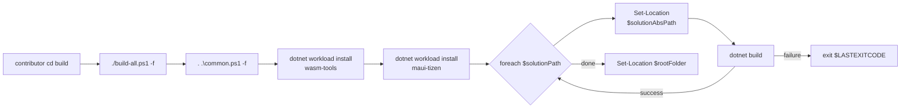
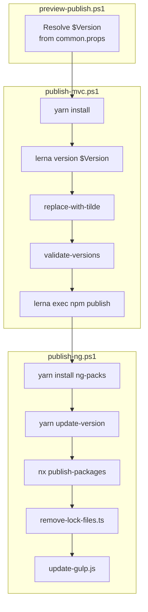

The ABP source tree does not have a top-level `make` or `cake` build. Compilation and packaging are driven from a small set of PowerShell scripts that loop over every solution under `framework/`, `modules/`, `templates/`, and `abp_io/`. The dotnet side lives in `build/` at the repository root, and the JavaScript side lives in `npm/`. Both halves share the same `common.props` `<Version>` element as their source of truth, so when you tag a release, `build-all-release.ps1` and `publish-mvc.ps1` end up producing artifacts stamped with the same number.

This page walks each entry point line by line, identifies the implicit conventions (dot-sourcing, exit-code propagation, the `-f` "full" flag), and shows how the GitHub Actions workflow `build-and-test.yml` wires the dotnet scripts into CI.

<Note>
The parent task brief refers to `build/build-all-test.ps1` and `npm/build-and-deploy.ps1`. Those filenames do not exist in this repository. The actual scripts are `build/build-all.ps1`, `build/build-all-release.ps1`, `build/test-all.ps1`, `npm/preview-publish.ps1`, `npm/publish-mvc.ps1`, and `npm/publish-ng.ps1`, and those are the ones documented below.
</Note>

## Inventory

<Files>
```
abp/
├── build/
│   ├── common.ps1               # shared $rootFolder + $solutionPaths
│   ├── build-all.ps1            # dotnet build (Debug) every solution
│   ├── build-all-release.ps1    # dotnet build --configuration Release /maxcpucount
│   └── test-all.ps1             # dotnet test --no-build --no-restore --collect:"XPlat Code Coverage"
├── npm/
│   ├── preview-publish.ps1      # wrapper: calls publish-mvc.ps1 then publish-ng.ps1
│   ├── publish-mvc.ps1          # Lerna version + npm publish for packs/*
│   ├── publish-ng.ps1           # yarn update-version + Nx publish for ng-packs/*
│   ├── publish-utils.js         # reads <Version> from common.props
│   └── replace-with-tilde.js    # ^ → ~ on @abp/* deps before publishing
├── delete-bin-obj.ps1           # purges all bin/ obj/ folders
└── common.props                 # <Version>8.0.2</Version> (single source of truth)
```
</Files>

## The dotnet pipeline

### `build/common.ps1` — the solution list

Every script in `build/` starts with `. ".\common.ps1" $full` (dot-sourcing). That pulls two variables into scope: `$rootFolder` (the working directory of the invoker) and `$solutionPaths`, the ordered list of folders that contain `*.sln` files and therefore need building.

```powershell title="build/common.ps1"
$full = $args[0]

# COMMON PATHS
$rootFolder = (Get-Item -Path "./" -Verbose).FullName

# List of solutions used only in development mode
$solutionPaths = @(
        "../framework",
        "../modules/basic-theme",
        "../modules/users",
        "../modules/permission-management",
        "../modules/setting-management",
        "../modules/feature-management",
        "../modules/identity",
        "../modules/identityserver",
        "../modules/openiddict",
        "../modules/tenant-management",
        "../modules/audit-logging",
        "../modules/background-jobs",
        "../modules/account",
        "../modules/cms-kit",
        "../modules/blob-storing-database"
    )

if ($full -eq "-f")
{
    # List of additional solutions required for full build
    $solutionPaths += (
        "../modules/client-simulation",
        "../modules/virtual-file-explorer",
        "../modules/docs",
        "../modules/blogging",
        "../templates/module/aspnet-core",
        "../templates/app/aspnet-core",
        "../templates/console",
        "../templates/wpf",
        "../templates/app-nolayers/aspnet-core",
        "../abp_io/AbpIoLocalization",
        "../source-code"
    )
}else{
    Write-host ""
    Write-host ":::::::::::::: !!! You are in development mode !!! ::::::::::::::" -ForegroundColor red -BackgroundColor  yellow
    Write-host ""
}
```

Two important things follow from this design:

<CardGroup cols={2}>
  <Card title="Development vs. full mode" icon="layer-group">
    Without `-f`, fifteen solutions build (the framework plus the "core" modules). With `-f`, eleven additional ones are appended — large modules like `blogging`, every startup template, and the `abp_io` localization solution.
  </Card>
  <Card title="Relative paths" icon="folder-tree">
    All entries start with `../` because every script is meant to be invoked **from inside `build/`**. The GitHub Actions step sets `working-directory: ./build` for exactly this reason.
  </Card>
</CardGroup>

The `if/else` branch also prints a bright red "development mode" banner when `-f` is omitted, which is the most common cue that a contributor forgot to ask for the full build before running the release pipeline.

### `build/build-all.ps1` — the dev build

This is the script the contribution guide tells you to run after cloning. It builds in the default (Debug) configuration and additionally installs two `dotnet workload`s that the templates need.

```powershell title="build/build-all.ps1"
$full = $args[0]

. ".\common.ps1" $full

# Build all solutions

Write-Host $solutionPaths

dotnet workload install wasm-tools
dotnet workload install maui-tizen

foreach ($solutionPath in $solutionPaths) {
    $solutionAbsPath = (Join-Path $rootFolder $solutionPath)
    Set-Location $solutionAbsPath
    dotnet build
    if (-Not $?) {
        Write-Host ("Build failed for the solution: " + $solutionPath)
        Set-Location $rootFolder
        exit $LASTEXITCODE
    }
}

Set-Location $rootFolder
```



<Warning>
The script uses `Set-Location` (not `Push-Location`/`Pop-Location`), so if you abort mid-loop your shell ends up in the last solution folder. The post-loop `Set-Location $rootFolder` only runs on the happy path.
</Warning>

The `if (-Not $?)` check is the canonical PowerShell-after-native-tool exit-code propagation: `$?` is `false` whenever the previous command exited non-zero, at which point the script bails out with `$LASTEXITCODE` so CI sees the right red cross.

### `build/build-all-release.ps1` — the release build

The release script is structurally identical, but it forces `--configuration Release` and parallelizes MSBuild via `/maxcpucount`:

```powershell title="build/build-all-release.ps1"
. ".\common.ps1" -f

# Build all solutions

foreach ($solutionPath in $solutionPaths) {
    $solutionAbsPath = (Join-Path $rootFolder $solutionPath)
    Set-Location $solutionAbsPath
    dotnet build --configuration Release -- /maxcpucount
    if (-Not $?) {
        Write-Host ("Build failed for the solution: " + $solutionPath)
        Set-Location $rootFolder
        exit $LASTEXITCODE
    }
}

Set-Location $rootFolder
```

Three differences from `build-all.ps1`:

<AccordionGroup>
  <Accordion title="Always full mode" icon="boxes-stacked">
    `common.ps1` is dot-sourced with the hard-coded `-f`, not `$args[0]`. A Release build always covers every solution including templates and `abp_io`. There is no "Release in dev mode" path.
  </Accordion>
  <Accordion title="No dotnet workload step" icon="forward">
    Release builds run in CI where workloads are already provisioned by `actions/setup-dotnet`, so the script skips the `wasm-tools`/`maui-tizen` installs that `build-all.ps1` performs.
  </Accordion>
  <Accordion title="MSBuild /maxcpucount" icon="microchip">
    The `--` separator passes `/maxcpucount` straight through to MSBuild, telling it to use one node per logical core. On a 16-core CI runner this cuts wall-clock by roughly an order of magnitude versus the single-threaded default.
  </Accordion>
</AccordionGroup>

The Release configuration is also the trigger that brings `configureawait.props` into play: `ConfigureAwait.Fody` only weaves on `Release` (see [tooling/directory-build-props](/tooling/directory-build-props)).

### `build/test-all.ps1` — running every test project

```powershell title="build/test-all.ps1"
$full = $args[0]

. ".\common.ps1" $full

# Test all solutions

foreach ($solutionPath in $solutionPaths) {
    $solutionAbsPath = (Join-Path $rootFolder $solutionPath)
    Set-Location $solutionAbsPath
    dotnet test --no-build --no-restore --collect:"XPlat Code Coverage"
    if (-Not $?) {
        Write-Host ("Test failed for the solution: " + $solutionPath)
        Set-Location $rootFolder
        exit $LASTEXITCODE
    }
}

Set-Location $rootFolder
```

The flags matter:

| Flag | Effect |
| --- | --- |
| `--no-build` | Assumes `build-all.ps1` already ran for the same configuration. Skips MSBuild entirely. |
| `--no-restore` | Same — skips `dotnet restore`. Without this, every test project would re-resolve transitive packages. |
| `--collect:"XPlat Code Coverage"` | Uses Coverlet (the collector is added to every test project automatically by `Directory.Build.props`) to write `coverage.cobertura.xml`. |

The `Directory.Build.props` at the root injects `coverlet.collector` into every project whose name ends in `.Tests` or `.TestBase` and whose path contains `test` — that is what makes `--collect` produce meaningful output without any per-project configuration. See [tooling/directory-build-props](/tooling/directory-build-props) for the full snippet.

### CI wiring: `.github/workflows/build-and-test.yml`

The dotnet scripts are stitched into CI by a single workflow:

```yaml title=".github/workflows/build-and-test.yml"
jobs:
  build-test:
    runs-on: ubuntu-latest
    if: ${{ !github.event.pull_request.draft }}
    steps:
    - uses: actions/checkout@v2
    - uses: actions/setup-dotnet@master
      with:
        dotnet-version: 8.0.100

    - name: chown
      run: |
        sudo chown -R $USER:$USER /home/runneradmin

    - name: Build All
      run: ./build-all.ps1
      working-directory: ./build
      shell: pwsh

    - name: Test All
      run: ./test-all.ps1
      working-directory: ./build
      shell: pwsh

    - name: Codecov
      uses: codecov/codecov-action@v2
```

Note that CI runs `./build-all.ps1` **without** `-f`, i.e. in development mode. Templates and `abp_io` are only built in the release pipeline. The `dotnet-version: 8.0.100` here matches `global.json`'s `sdk.version`.

A complete tour of every workflow under `.github/workflows/` lives in [ops/devops](/ops/devops).

## The npm pipeline

### `npm/preview-publish.ps1` — the umbrella

`preview-publish.ps1` is the script you actually invoke. It calls the two real publishers in sequence:

```powershell title="npm/preview-publish.ps1"
param(
  [string]$Version,
  [string]$Registry
)
$commands = (
  ".\publish-mvc.ps1 $Version $Registry",
  ".\publish-ng.ps1 $Version $Registry"
);

$NextVersion = $(node publish-utils.js --nextVersion)
$RootFolder = (Get-Item -Path "./" -Verbose).FullName

if(-Not $Version) {
$Version = $NextVersion;
}

if(-Not $Registry) {
exit
}

foreach ($command in $commands) {
  Write-Host $command
  Invoke-Expression $command
  if($LASTEXITCODE -ne '0' -And $command -notlike '*cd *') {
    Write-Host ("Process failed! " + $command)
    Set-Location $RootFolder
    exit $LASTEXITCODE
  }
}
```

Three behaviours worth noting:

<CardGroup cols={2}>
  <Card title="Version defaulting" icon="tag">
    If `$Version` is empty, the script reads `<Version>` from `common.props` via `node publish-utils.js --nextVersion` — that JS file lives next to the PowerShell script and parses the XML by string-slice.
  </Card>
  <Card title="Registry is mandatory" icon="server">
    `if(-Not $Registry) { exit }` — without an explicit registry argument, the umbrella exits silently. This is a safety latch so an accidental run never publishes to npmjs.org.
  </Card>
</CardGroup>

```javascript title="npm/publish-utils.js (excerpt)"
function getVersion() {
  if (program.customVersion) return program.customVersion;
  const commonProps = fse.readFileSync('../common.props').toString();
  const versionTag = '<Version>';
  const versionEndTag = '</Version>';
  const first = commonProps.indexOf(versionTag) + versionTag.length;
  const last = commonProps.indexOf(versionEndTag);
  return commonProps.substring(first, last);
}
```

The `getVersion()` reader is also used by `publish-utils.js --prerelease`, which returns `true` whenever `semver.parse(version).prerelease.length > 0`. Both `publish-mvc.ps1` and `publish-ng.ps1` use that to decide whether to publish with `--tag next` or to add `--prerelease` flags downstream.

### `npm/publish-mvc.ps1` — packs under `npm/packs/`

This script publishes the 50+ MVC/Bootstrap/jQuery wrappers (`@abp/core`, `@abp/jquery`, `@abp/datatables.net`, …) listed in [npm/aspnetcore-mvc-ui-packages](/npm/aspnetcore-mvc-ui-packages):

```powershell title="npm/publish-mvc.ps1"
param(
  [string]$Version,
  [string]$Registry
)

yarn install

$NextVersion = $(node publish-utils.js --nextVersion)
$RootFolder = (Get-Item -Path "./" -Verbose).FullName

if (-Not $Version) {
  $Version = $NextVersion;
}

if (-Not $Registry) {
  $Registry = "https://registry.npmjs.org";
}

$PacksPublishCommand = "npm run lerna -- exec 'npm publish --registry $Registry'"

$IsPrerelease = $(node publish-utils.js --prerelease --customVersion $Version) -eq "true";

if ($IsPrerelease) {
  $PacksPublishCommand = $PacksPublishCommand.Substring(0, $PacksPublishCommand.Length - 1) + " --tag next'"
}

$commands = (
  "npm run lerna -- version $Version --yes --no-commit-hooks --no-git-tag-version --no-push --force-publish",
  "yarn replace-with-tilde",
  "cd scripts",
  "yarn install",
  "yarn validate-versions --compareVersion $Version --path ../packs",
  "cd ..",
  $PacksPublishCommand
)
```

Walking the command array top-to-bottom:

| Step | Command | Purpose |
| --- | --- | --- |
| 1 | `npm run lerna -- version $Version …` | Bump every `packs/*/package.json` to `$Version`. Flags skip git commits/tags/pushes so the script stays idempotent. |
| 2 | `yarn replace-with-tilde` | Runs `replace-with-tilde.js`, which rewrites `"@abp/*": "^…"` to `"@abp/*": "~…"` in every package.json so consumers get patch upgrades but not minors. |
| 3 | `cd scripts` + `yarn install` | Enters the `npm/scripts/` TypeScript project (`change-package-version.ts`, `validate-versions.ts`, `remove-lock-files.ts`). |
| 4 | `yarn validate-versions …` | Walks `../packs/*` and asserts every `@abp/*` dep matches `$Version`. Fails loud on drift. |
| 5 | `cd ..` | Back to `npm/`. |
| 6 | `npm run lerna -- exec 'npm publish …'` | The actual publish, one `npm publish` per package. `--tag next` is appended when `$IsPrerelease`. |

The wrapping `foreach ($command in $commands)` is wall-clock-aware:

```powershell title="npm/publish-mvc.ps1 (loop)"
foreach ($command in $commands) {
  $timer = [System.Diagnostics.Stopwatch]::StartNew()
  Write-Host $command
  Invoke-Expression $command
  if ($LASTEXITCODE -ne '0' -And $command -notlike '*cd *') {
    Write-Host ("Process failed! " + $command)
    Set-Location $RootFolder
    exit $LASTEXITCODE
  }
  $timer.Stop()
  $total = $timer.Elapsed
  Write-Output "-------------------------"
  Write-Output "$command command took $total (Hours:Minutes:Seconds.Milliseconds)"
  Write-Output "-------------------------"
}
```

The `-notlike '*cd *'` clause means a non-zero `$LASTEXITCODE` from a previous step is ignored when the current "command" is `cd scripts` or `cd ..` (`cd` does not reset `$LASTEXITCODE`, so a stale failure from another tool could otherwise abort the next directory change). The stopwatch gives you per-step timings in the publish log, which is invaluable when a `validate-versions` walk balloons.

A deeper write-up of the `@abp/*` graph is in [tooling/npm-publish](/tooling/npm-publish) and [npm/build-scripts](/npm/build-scripts).

### `npm/publish-ng.ps1` — the Angular packs

The Angular side lives in `npm/ng-packs/` and uses Nx (not Lerna):

```powershell title="npm/publish-ng.ps1 (commands)"
$UpdateNgPacksCommand = "yarn update-version $Version"
$NgPacksPublishCommand = "npm run publish-packages -- --nextVersion $Version --skipGit --registry $Registry --skipVersionValidation"
$UpdateGulpCommand = "yarn update-gulp --registry $Registry"

$IsPrerelease = $(node publish-utils.js --prerelease --customVersion $Version) -eq "true";

if ($IsPrerelease) {
  $UpdateGulpCommand += " --prerelease"
  $UpdateNgPacksCommand += " --prerelease"
}

$commands = (
  "cd ng-packs",
  "yarn install",
  $UpdateNgPacksCommand,
  "cd scripts",
  "yarn install",
  $NgPacksPublishCommand,
  "cd ../../",
  "cd scripts",
  "yarn remove-lock-files",
  "cd ..",
  $UpdateGulpCommand
)
```

The sequence is:

1. `cd ng-packs && yarn install` — install all Nx-workspace dependencies.
2. `yarn update-version $Version` — Nx-aware version bump across `ng-packs/packages/*`.
3. `cd scripts && yarn install` — enter the Nx publish helper.
4. `npm run publish-packages -- --nextVersion $Version --skipGit --registry …` — invokes `nx run-many --target=publish`.
5. `cd ../../scripts && yarn remove-lock-files` — runs `remove-lock-files.ts`, deleting `yarn.lock`/`package-lock.json` from `templates/app/angular`, `templates/app/react-native`, and `templates/module/angular`. That keeps the startup templates from pinning the old `@abp/*` versions.
6. `yarn update-gulp --registry …` — updates the gulp-driven copy of `@abp/*` into the MVC templates' `wwwroot/libs`.



## Composing the scripts

A full local "build everything, test everything, publish to a local Verdaccio" loop looks like this:

```bash title="local release rehearsal"
# 1. Compile every solution in Release
cd build
pwsh ./build-all-release.ps1

# 2. Run every test project with coverage
pwsh ./test-all.ps1 -f

# 3. Publish the npm side to a private registry
cd ../npm
pwsh ./preview-publish.ps1 -Version 8.0.2-rc.1 -Registry http://localhost:4873
```

Steps 1 and 2 produce the NuGet `.nupkg` files in each project's `bin/Release/` — see [tooling/nuget-publish](/tooling/nuget-publish) for how those get pushed. Step 3 covers both `npm/packs/*` and `npm/ng-packs/packages/*` thanks to the umbrella.

<Tip>
If you want a clean slate before re-running, the repository ships `delete-bin-obj.ps1` at the root. It walks the tree once and deletes every `bin/` and `obj/` folder, which is faster than `dotnet clean` because it does not need to resolve project graphs.
</Tip>

## Related

- [ops/testing](/ops/testing) — the `Volo.Abp.TestBase` and `AbpAspNetCoreIntegratedTestBase` machinery that `test-all.ps1` ultimately exercises.
- [ops/devops](/ops/devops) — every workflow under `.github/workflows/` and what it runs.
- [tooling/nuget-publish](/tooling/nuget-publish) — how the NuGet `<Version>` flows from `common.props` to the `.nupkg`s.
- [tooling/npm-publish](/tooling/npm-publish) — the Lerna/Nx topology of `@abp/*`.
- [npm/build-scripts](/npm/build-scripts) — a more JavaScript-centric tour of the same scripts.
- [cli/overview](/cli/overview) — the `abp` CLI, which is built by the same `dotnet build` pass.
