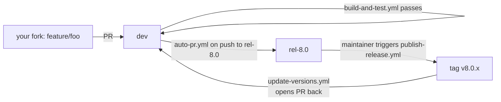
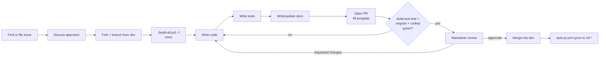

The abpframework/abp repository is community-driven and intentionally low-ceremony. The full written guidance is split across three files at the root — `CONTRIBUTING.md`, `README.md`, and `CODE_OF_CONDUCT.md` — plus the longer-form contribution guide at `docs/en/Contribution/Index.md`. This page collects all of it in one place, identifies the branch model implied by the GitHub Actions workflows, and walks through what a maintainer expects to see on a PR.

Nothing on this page is invented: every requirement is cited from a file in the repository.

## The three documents at the root

<Files>
```
abp/
├── CONTRIBUTING.md      # 3-line pointer
├── CODE_OF_CONDUCT.md   # Contributor Covenant v2.0
├── SECURITY.md          # responsible disclosure
├── README.md            # what ABP is + Quick Start
└── docs/en/Contribution/
    ├── Index.md         # full contribution guide
    └── How-to-Contribute-abp.io-as-a-frontend-developer.md
```
</Files>

`CONTRIBUTING.md` itself is a single redirect:

```markdown title="CONTRIBUTING.md"
## Contribution

See the [contribution guide](docs/en/Contribution/Index.md).
```

The real text lives at `docs/en/Contribution/Index.md`. Everything below summarises that file.

## Local environment

The contribution guide pins the local-build expectation:

> Fork the ABP repository from GitHub. **Build the repository using the `/build/build-all.ps1 -f` for one time.** Make the necessary changes, including unit/integration tests. Send a pull request.

So the first thing every contributor does is:

```bash title="one-time bootstrap"
git clone https://github.com/<your-fork>/abp.git
cd abp/build
pwsh ./build-all.ps1 -f
```

The `-f` flag is the "full" mode that `common.ps1` toggles — without it, templates and `abp_io` are skipped (see [ops/build-and-pack](/ops/build-and-pack) for the script walk-through). The first full build can take 20–30 minutes because it installs the `wasm-tools` and `maui-tizen` dotnet workloads as part of the script.

The guide also warns about Visual Studio's IntelliSense behavior:

> When you open a solution in Visual Studio, you may need to execute `dotnet restore` in the root folder of the solution for one time, after it is fully opened in the Visual Studio. This is needed since VS can't properly resolves local references to projects out of the solution.

This is a consequence of how the framework uses `<ProjectReference>` across solution boundaries.

### Required tooling

| Tool | Version | Source of truth |
| --- | --- | --- |
| .NET SDK | 8.0.100 (or any feature band ≥ 8.0.100 via `rollForward`) | [`global.json`](/tooling/directory-build-props) |
| PowerShell | 7+ (any platform) | All build scripts are `.ps1`; CI runs `shell: pwsh` |
| Node.js + Yarn | latest LTS | `npm/package.json` uses Lerna 3 and Yarn workspaces |
| Git | any recent | required for `peter-evans/create-pull-request` if you run the auto-PR workflow locally |

## The branch model

Although `CONTRIBUTING.md` does not spell out a Git workflow in prose, the `.github/workflows/` directory codifies one — and the workflows are the authoritative source for what merges to where.



The flow:

<Steps>
  <Step title="Branch from dev">
    All work — features, bug fixes, docs — targets `dev`. There are no long-lived feature branches in the upstream repo; contributors branch in their forks.
  </Step>
  <Step title="Open a PR against dev">
    `build-and-test.yml` runs on every non-draft PR whose changes touch `.cs`, `.cshtml`, `.csproj`, `.razor`, or the two central props files. `angular.yml` runs on changes under `npm/ng-packs/`. CodeQL runs on both languages. See [ops/devops](/ops/devops).
  </Step>
  <Step title="Mark Ready for Review">
    Both `build-and-test.yml` and `angular.yml` are gated by `if: ${{ !github.event.pull_request.draft }}`. Drafts don't burn runner minutes; mark "Ready" to kick CI.
  </Step>
  <Step title="Maintainer review and merge">
    Once green and reviewed, a maintainer merges into `dev`.
  </Step>
  <Step title="Release branch sync">
    When maintainers push to `rel-8.0` (typically hotfix cherry-picks), `auto-pr.yml` opens an auto-merged PR that brings `dev` back into the release branch — keeping the two from diverging.
  </Step>
  <Step title="Release tag">
    A maintainer triggers `publish-release.yml` (a `workflow_dispatch`) with a tag name. This creates the GitHub Release; the NuGet/npm publish itself runs from a maintainer machine via the scripts in [tooling/nuget-publish](/tooling/nuget-publish) and [tooling/npm-publish](/tooling/npm-publish).
  </Step>
  <Step title="Latest-versions PR">
    `update-versions.yml` reacts to the published release by editing `latest-versions.json` and opening a PR back to `dev`, routed to three maintainers.
  </Step>
</Steps>

## What an acceptable PR looks like

The PR template lays out the expectations:

```markdown title=".github/pull_request_template.md"
### Description

Resolves #xxxx (write the related issue number if available)

TODO: Describe what this PR has changed, add screenshot or animated GIF if available, write if it is a breaking change, and how to fix the breaking changes for existing applications if so.

### Checklist

- [ ] I fully tested it as developer / designer and created unit / integration tests
- [ ] I documented it (or no need to document or I will create a separate documentation issue)

### How to test it?

Please describe how this can be tested by the test engineers if it is not already explicit - or remove this section if no need to description.
```

Translating that into hard requirements:

<CardGroup cols={2}>
  <Card title="Link an issue" icon="link">
    The PR description starts with `Resolves #xxxx`. The contribution guide says: "Before making any change, please discuss it on the GitHub issues. In this way, no other developer will work on the same issue and your PR will have a better chance to be accepted."
  </Card>
  <Card title="Tests are mandatory" icon="vial">
    The first checklist item — "I fully tested it as developer / designer and created unit / integration tests" — is enforced on review. See [ops/testing](/ops/testing) for the `AbpIntegratedTest<TModule>` and `AbpWebApplicationFactoryIntegratedTest<TProgram>` base classes.
  </Card>
  <Card title="Documentation is expected" icon="book">
    The second checkbox — documentation — is also expected. Either land doc changes in the same PR or open a separate documentation issue.
  </Card>
  <Card title="Breaking changes call them out" icon="triangle-exclamation">
    The TODO line specifically asks: "write if it is a breaking change, and how to fix the breaking changes for existing applications if so."
  </Card>
</CardGroup>

## Coding conventions

The repository encodes most coding conventions in MSBuild, not prose. They show up in the props files described in [tooling/directory-build-props](/tooling/directory-build-props):

```xml title="common.props (excerpts that imply conventions)"
<LangVersion>latest</LangVersion>
<NoWarn>$(NoWarn);CS1591;CS0436</NoWarn>
<GenerateDocumentationFile>true</GenerateDocumentationFile>
```

| Setting | What it means for contributors |
| --- | --- |
| `LangVersion=latest` | Use any C# language feature your installed SDK supports. |
| `GenerateDocumentationFile=true` | Public APIs *should* have XML doc comments — the warning is suppressed only because not every internal type has them yet, not because comments are discouraged. |
| `NoWarn CS1591` | Missing XML doc warnings are off; don't rely on the compiler to enforce them. |
| `NoWarn CS0436` | The "Type conflicts with imported type" warning is suppressed (common when shipping multi-targeted assemblies). |

Test projects additionally pick up the convention from the root `Directory.Build.props`:

```xml title="Directory.Build.props"
<IsTestProject Condition="$(MSBuildProjectFullPath.Contains('test')) and ($(MSBuildProjectName.EndsWith('.Tests')) or $(MSBuildProjectName.EndsWith('.TestBase')))">true</IsTestProject>
```

So a new test project must:

1. Live somewhere whose path contains `test/`.
2. Be named ending in `.Tests` or `.TestBase`.

If both conditions are met, the root automatically pulls in `coverlet.collector`, and `--collect:"XPlat Code Coverage"` in CI will pick it up.

### Async conventions: `ConfigureAwait.Fody`

The release configuration weaves `ConfigureAwait(false)` into every `await` automatically:

```xml title="configureawait.props"
<Project>
  <ItemGroup Condition="'$(Configuration)' == 'Release'">
      <PackageReference Include="ConfigureAwait.Fody" PrivateAssets="All" />
      <PackageReference Include="Fody">
        <PrivateAssets>All</PrivateAssets>
        <IncludeAssets>runtime; build; native; contentfiles; analyzers</IncludeAssets>
      </PackageReference>
  </ItemGroup>
</Project>
```

So **contributors should not hand-write `.ConfigureAwait(false)`** in framework source — Fody adds it on Release. This keeps the codebase readable and consistent. Hand-written `ConfigureAwait` calls in PRs are routinely asked to be removed.

### `.editorconfig` / `common.DotSettings`

There is a `common.DotSettings` file at the root for Rider/ReSharper users. It is not enforced by CI, but PRs that wildly violate the prevailing style (e.g. tab indentation in a space-indented file) are routinely re-formatted by maintainers before merge.

## Issue flow

The contribution guide is explicit about the order of operations:

> Before making any change, please discuss it on the GitHub issues. In this way, no other developer will work on the same issue and your PR will have a better chance to be accepted.

The `ISSUE_TEMPLATE/` directory exposes five forms:

| Template | When to use |
| --- | --- |
| `01_bug_report.yml` | Reproducible defect with steps + expected/actual |
| `02_feature_request.yml` | "I want X" — discussion first |
| `03_article_request.yml` | Suggest a community.abp.io article |
| `04_performance_issue.md` | Perf regressions with measurements |
| `05_blank_issue.md` | Everything else |

Plus `ISSUE_TEMPLATE/config.yml`, which adds non-issue contact links (community.abp.io, Discord, Stack Overflow).

## Non-code contributions

The contribution guide lists three first-class non-code paths.

### Document translation

> You may want to translate the complete documentation (including this one) to your mother language.

The recipe:

1. Clone the repo.
2. Create `docs/<culture>/` (e.g. `docs/es/`, `docs/fr/`) — culture codes follow MSDN's list.
3. Mirror the structure of `docs/en/` for file/folder names.
4. Send one PR per document; don't wait to finish a whole language.

Three documents are the minimum for a language to be published on docs.abp.io:

- Index (Home)
- Getting Started
- Web Application Development Tutorial

### Resource localization (UI strings)

The framework's UI strings live in JSON files like `framework/src/Volo.Abp.UI/Localization/Resources/AbpUi/en.json`. The guide recommends the `abp translate` CLI:

```bash
abp translate -c <culture-name>      # generate abp-translation.json with missing strings
# edit abp-translation.json
abp translate -a                      # apply edits back to the resource files
```

See [cli/overview](/cli/overview) and [cli/misc-commands](/cli/misc-commands) for `abp translate`.

### Frontend contribution to abp.io

A dedicated guide — `docs/en/Contribution/How-to-Contribute-abp.io-as-a-frontend-developer.md` — covers contributing to the abp.io website itself. The contribution guide just points there.

## Code of Conduct

The repository adopts Contributor Covenant v2.0, badged in `README.md`:

```markdown title="README.md (badge)"
[](https://github.com/abpframework/abp/blob/dev/CODE_OF_CONDUCT.md)
```

The full text is at `CODE_OF_CONDUCT.md`. Violations are reported via the email address listed in that file.

## Contributor License Agreement

The `README.md` shows a CLA badge:

```markdown title="README.md (badge)"
[](https://cla-assistant.io/abpframework/abp)
```

The CLA is administered by cla-assistant.io. The CLA bot comments on the first PR a contributor opens and supplies a signing link. Until it's signed, the PR cannot merge.

## Security disclosures

`SECURITY.md` at the root is the canonical place for vulnerability reports. Do **not** open public GitHub issues for security bugs — follow the disclosure address there.

## Recap: the contributor's loop



## Related

- [ops/build-and-pack](/ops/build-and-pack) — `build-all.ps1 -f`, the one-time bootstrap.
- [ops/testing](/ops/testing) — the `AbpIntegratedTest<TModule>` base every PR's tests inherit from.
- [ops/devops](/ops/devops) — the workflows that decide whether your PR passes.
- [tooling/directory-build-props](/tooling/directory-build-props) — the props files that encode coding conventions in MSBuild.
- [cli/overview](/cli/overview) — `abp translate` and the other CLI commands referenced from the contribution guide.
