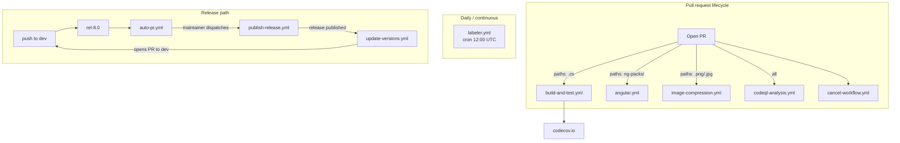

The ABP repository runs a deliberately small set of GitHub Actions workflows. There is no monorepo-wide reusable pipeline, no orchestration via `workflow_call`, and no per-module matrix: each YAML file owns one concern and is triggered by a precise `paths:` filter so unrelated PRs don't pay for unrelated jobs. This page lists every workflow file in `.github/workflows/`, identifies its trigger and steps, and ties each one back to the script or external action it relies on.

The other pieces under `.github/` — issue templates, the labeler config, the stale/lock bots, the pull-request template, and the `update_versions.py` script — are covered at the end.

## Inventory

<Files>
```
.github/
├── workflows/
│   ├── build-and-test.yml      # dotnet build + test on push/PR (dev branch)
│   ├── angular.yml             # Nx affected lint/build/test for ng-packs
│   ├── codeql-analysis.yml     # GitHub CodeQL (csharp + javascript)
│   ├── cancel-workflow.yml     # styfle/cancel-workflow-action on every push
│   ├── image-compression.yml   # calibreapp/image-actions on image PRs
│   ├── auto-pr.yml             # auto-merge dev → rel-8.0
│   ├── publish-release.yml     # manual workflow_dispatch release creator
│   ├── update-versions.yml     # post-release: edits latest-versions.json
│   └── labeler.yml             # daily cron: applies path labels to PRs
├── scripts/
│   └── update_versions.py      # PyGithub script invoked by update-versions.yml
├── ISSUE_TEMPLATE/
│   ├── 01_bug_report.yml
│   ├── 02_feature_request.yml
│   ├── 03_article_request.yml
│   ├── 04_performance_issue.md
│   ├── 05_blank_issue.md
│   └── config.yml
├── labeler.yml                 # path → label map for the labeler workflow
├── lock.yml                    # dessant/lock-threads-app config (30d)
├── stale.yml                   # probot-stale config (60d, 7d close)
└── pull_request_template.md
```
</Files>

## Continuous integration

### `build-and-test.yml` — the dotnet pipeline

This is the canonical workflow gating every PR that touches C# code. It runs the two PowerShell scripts described in [ops/build-and-pack](/ops/build-and-pack) and uploads coverage to Codecov.

```yaml title=".github/workflows/build-and-test.yml"
name: "build and test"
on:
  push:
    branches:
      - dev
    paths:
      - 'framework/**/*.cs'
      - 'framework/**/*.cshtml'
      - 'framework/**/*.csproj'
      - 'framework/**/*.razor'
      - 'modules/**/*.cs'
      - 'modules/**/*.cshtml'
      - 'modules/**/*.csproj'
      - 'modules/**/*.razor'
      - 'templates/**/*.cs'
      - 'templates/**/*.cshtml'
      - 'templates/**/*.csproj'
      - 'templates/**/*.razor'
      - 'Directory.Build.props'
      - 'Directory.Packages.props'

  pull_request:
    paths:
      - 'framework/**/*.cs'
      # …same list as above…
    types:
      - opened
      - synchronize
      - reopened
      - ready_for_review
permissions:
  contents: read

jobs:
  build-test:
    runs-on: ubuntu-latest
    if: ${{ !github.event.pull_request.draft }}
    steps:
    - uses: actions/checkout@v2
    - uses: actions/setup-dotnet@master
      with:
        dotnet-version: 8.0.100

    - name: chown
      run: |
        sudo chown -R $USER:$USER /home/runneradmin

    - name: Build All
      run: ./build-all.ps1
      working-directory: ./build
      shell: pwsh

    - name: Test All
      run: ./test-all.ps1
      working-directory: ./build
      shell: pwsh

    - name: Codecov
      uses: codecov/codecov-action@v2
```

Things to notice:

<CardGroup cols={2}>
  <Card title="paths: filter" icon="filter">
    Only changes to C#, Razor, csproj, or the two central props files trigger the workflow. A pure documentation PR doesn't pay for a full dotnet build.
  </Card>
  <Card title="dev-only push" icon="code-branch">
    The `push` trigger fires on `dev` and nowhere else. Release branches don't re-run the same job; they instead inherit the green state via the auto-merge workflow below.
  </Card>
  <Card title="!draft" icon="pen-ruler">
    The job-level `if` skips draft PRs to save runner minutes — authors mark "Ready for review" to kick CI.
  </Card>
  <Card title="chown step" icon="user-shield">
    `sudo chown -R $USER:$USER /home/runneradmin` works around a `actions/setup-dotnet` permission quirk on Ubuntu runners; without it the .NET SDK install can fail to write to the user's home.
  </Card>
</CardGroup>

The `dotnet-version: 8.0.100` here mirrors `global.json`:

```json title="global.json"
{
  "sdk": {
    "version": "8.0.100",
    "rollForward": "latestFeature"
  }
}
```

`rollForward: latestFeature` means CI accepts any 8.0.x feature-band SDK ≥ 8.0.100, which keeps the workflow from breaking when GitHub's runner image upgrades the SDK patch.

### `angular.yml` — Nx affected pipeline

Angular sources live under `npm/ng-packs/`. The workflow uses Nx's "affected" graph to lint, build, and test only what a given PR changed:

```yaml title=".github/workflows/angular.yml"
name: 'Angular'
on:
  pull_request:
    paths:
      - 'npm/ng-packs/**/*.ts'
      - 'npm/ng-packs/**/*.html'
      - 'npm/ng-packs/*.json'
      - '!npm/ng-packs/scripts/**'
      - '!npm/ng-packs/packages/schematics/**'
    branches:
      - 'rel-*'
      - 'dev'
    types:
      - opened
      - synchronize
      - reopened
      - ready_for_review

jobs:
  build-test-lint:
    if: ${{ !github.event.pull_request.draft }}
    runs-on: ubuntu-latest
    steps:
      - uses: actions/checkout@v2
        with:
          fetch-depth: 0

      - uses: actions/cache@v2
        with:
          path: 'npm/ng-packs/node_modules'
          key: ${{ runner.os }}-${{ hashFiles('npm/ng-packs/yarn.lock') }}

      - uses: actions/cache@v2
        with:
          path: 'templates/app/angular/node_modules'
          key: ${{ runner.os }}-${{ hashFiles('templates/app/angular/yarn.lock') }}

      - name: Install packages
        run: yarn install
        working-directory: npm/ng-packs

      - name: Run lint
        run: yarn affected:lint --base=remotes/origin/${{ github.base_ref }}
        working-directory: npm/ng-packs

      - name: Run build
        run: yarn affected:build --base=remotes/origin/${{ github.base_ref }}
        working-directory: npm/ng-packs

      - name: Run test
        run: yarn affected:test --base=remotes/origin/${{ github.base_ref }}
        working-directory: npm/ng-packs
```

| Detail | Why |
| --- | --- |
| `fetch-depth: 0` | Nx needs the full git history to compute affected projects vs. `base_ref`. |
| Two `actions/cache` calls | One for `ng-packs/node_modules`, one for the Angular template's `node_modules` (which lint pulls into the graph). |
| `--base=remotes/origin/${{ github.base_ref }}` | Compares against the PR target branch's tip rather than the local `HEAD~1`. |
| Negative `paths:` | `!npm/ng-packs/scripts/**` and `!npm/ng-packs/packages/schematics/**` exclude PRs that only touch the publish scripts or the `@abp/schematics` package. |

### `codeql-analysis.yml` — security scanning

The CodeQL workflow runs the official GitHub action on `csharp` and `javascript`:

```yaml title=".github/workflows/codeql-analysis.yml (excerpt)"
strategy:
  fail-fast: false
  matrix:
    language: ["csharp", "javascript"]

steps:
  - uses: actions/checkout@v2
    with:
      fetch-depth: 2

  - run: git checkout HEAD^2
    if: ${{ github.event_name == 'pull_request' }}

  - name: Initialize CodeQL
    uses: github/codeql-action/init@v1
    with:
      languages: ${{ matrix.language }}

  - name: Autobuild
    uses: github/codeql-action/autobuild@v1

  - name: Perform CodeQL Analysis
    uses: github/codeql-action/analyze@v1
```

The triggers narrow scanning to `abp/**/*.{js,cs,cshtml,csproj,razor}`. `git checkout HEAD^2` is the standard CodeQL trick that, on PRs, analyzes the merge-base commit rather than GitHub's synthetic merge commit — that way the alerts attribute correctly to the author's commits.

`fail-fast: false` is critical: a flaky scan in one language must not cancel the other.

### `cancel-workflow.yml` — auto-cancel previous runs

This workflow trades runner minutes for fresher feedback. On every push (any branch), it cancels in-flight runs of the listed workflow IDs so a force-push doesn't queue a redundant build:

```yaml title=".github/workflows/cancel-workflow.yml"
name: cancel-workflow
on: [push]
permissions:
  contents: read

jobs:
  cancel:
    permissions:
      actions: write
    name: 'Cancel Previous Runs'
    runs-on: ubuntu-latest
    timeout-minutes: 3
    steps:
      - uses: styfle/cancel-workflow-action@0.6.0
        with:
          workflow_id: 10629,1299107,2792859,8268314
          access_token: ${{ github.token }}
```

The four `workflow_id`s are the numeric IDs of `build-and-test.yml`, `angular.yml`, `codeql-analysis.yml`, and one of the older retired pipelines — they are passed as integers because `styfle/cancel-workflow-action@0.6.0` predates the modern slug-based API.

### `image-compression.yml` — calibreapp/image-actions

The workflow runs `calibreapp/image-actions` against PRs that touch raster images and commits compressed versions back:

```yaml title=".github/workflows/image-compression.yml"
on:
  pull_request:
    paths:
      - "**.jpg"
      - "**.jpeg"
      - "**.png"
      - "**.webp"
      - "**.gif"
    types:
      - opened
      - synchronize
      - reopened
      - ready_for_review
jobs:
  build:
    if: github.event.pull_request.head.repo.full_name == github.repository && !github.event.pull_request.draft
    runs-on: ubuntu-latest
    steps:
      - uses: actions/checkout@v2
      - uses: calibreapp/image-actions@main
        with:
          githubToken: ${{ secrets.GITHUB_TOKEN }}
```

The `head.repo.full_name == github.repository` guard prevents the action from running on fork-originated PRs — the action would otherwise fail to push back to a forked branch.

## Release and version management

### `auto-pr.yml` — merge dev into the release branch

After every push to `rel-8.0`, this workflow opens a PR that brings the latest `dev` into the release branch and auto-merges it:

```yaml title=".github/workflows/auto-pr.yml"
name: Merge branch dev with rel-8.0
on:
  push:
    branches:
      - rel-8.0

jobs:
  merge-dev-with-rel-8-0:
    permissions:
      contents: write
      pull-requests: write
    runs-on: ubuntu-latest
    steps:
      - uses: actions/checkout@v2
        with:
          ref: dev
      - name: Reset promotion branch
        run: |
          git fetch origin rel-8.0:rel-8.0
          git reset --hard rel-8.0
      - name: Create Pull Request
        uses: peter-evans/create-pull-request@v3
        with:
          branch: auto-merge/rel-8-0/${{github.run_number}}
          title: Merge branch dev with rel-8.0
          body: This PR generated automatically to merge dev with rel-8.0. Please review the changed files before merging to prevent any errors that may occur.
          reviewers: maliming
          token: ${{ github.token }}
      - name: Merge Pull Request
        env:
          GH_TOKEN: ${{ secrets.BOT_SECRET }}
        run: |
          gh pr review auto-merge/rel-8-0/${{github.run_number}} --approve
          gh pr merge auto-merge/rel-8-0/${{github.run_number}} --merge --auto --delete-branch
```

The branch model implied by this YAML is:

```mermaid
gitGraph
  commit id: "dev: feat A"
  branch rel-8.0
  checkout rel-8.0
  commit id: "rel: hotfix"
  checkout dev
  commit id: "dev: feat B"
  checkout rel-8.0
  merge dev id: "auto-pr: dev → rel-8.0"
  commit id: "rel: cherry"
```

Every direct commit to `rel-8.0` triggers a sync-from-`dev` PR, which keeps the branches from diverging.

<Warning>
The workflow is hard-wired to `rel-8.0` as both the trigger branch and the PR target. When 9.0 is cut, a copy of the file (or a parameterized rewrite) is what creates the new auto-PR pipeline.
</Warning>

### `publish-release.yml` — manual release entry point

This is a `workflow_dispatch` workflow — it does *not* run on its own. A maintainer triggers it from the Actions tab:

```yaml title=".github/workflows/publish-release.yml"
name: Create Release
on:
  workflow_dispatch:
    inputs:
      tag_name:
        description: 'Tag Name'
        required: true
      prerelease:
        description: 'Pre-release?'
        required: true
      branchName:
        description: 'Branch Name'
        required: true

jobs:
  build:
    runs-on: ubuntu-latest
    steps:
      - name: Checkout code
        uses: actions/checkout@v2
        with:
          ref: ${{ github.event.inputs.branchName }}

      - name: Create Release
        id: create_release
        uses: actions/create-release@v1
        env:
          GITHUB_TOKEN: ${{ secrets.RELEASE_TOKEN }}
        with:
          tag_name: ${{ github.event.inputs.tag_name }}
          release_name: ${{ github.event.inputs.tag_name }}
          draft: false
          prerelease: ${{ github.event.inputs.prerelease }}

      - name: Checkout code at tag
        uses: actions/checkout@v2
        with:
          ref: ${{ github.event.inputs.tag_name }}

      - name: Build Project
        run: |
          # add your build commands here, depending on your project's requirements.
          echo "Build project here"
```

It creates the GitHub Release and the corresponding tag, then checks out the tag. The actual NuGet/npm publish is *not* in this workflow — it is run from a maintainer's machine using the scripts in [tooling/nuget-publish](/tooling/nuget-publish) and [tooling/npm-publish](/tooling/npm-publish). The "Build Project" placeholder in the YAML is intentional: the publish handshake is intentionally out-of-band.

### `update-versions.yml` — propagate the published tag

Once a release is published (via the workflow above), this one picks it up:

```yaml title=".github/workflows/update-versions.yml"
name: Update Latest Versions

on:
  release:
    types:
      - published

permissions:
  contents: write
  pull-requests: write

jobs:
  update-versions:
    runs-on: ubuntu-latest
    steps:
      - name: Checkout repository
        uses: actions/checkout@v2

      - name: Set up Python
        uses: actions/setup-python@v2
        with:
          python-version: 3.x

      - name: Install dependencies
        run: |
          python -m pip install --upgrade pip
          pip install PyGithub

      - name: Update latest-versions.json and create PR
        env:
          GITHUB_TOKEN: ${{ secrets.RELEASE_TOKEN }}
        run: |
          python .github/scripts/update_versions.py
```

The Python script bumps `latest-versions.json` and opens a PR against `dev`:

```python title=".github/scripts/update_versions.py (excerpt)"
def update_latest_versions():
    version = os.environ["GITHUB_REF"].split("/")[-1]

    if "rc" in version:
        return False

    with open("latest-versions.json", "r") as f:
        latest_versions = json.load(f)

    latest_versions[0]["version"] = version

    with open("latest-versions.json", "w") as f:
        json.dump(latest_versions, f, indent=2)

    return True

def create_pr():
    g = Github(os.environ["GITHUB_TOKEN"])
    repo = g.get_repo("abpframework/abp")

    branch_name = f"update-latest-versions-{os.environ['GITHUB_REF'].split('/')[-1]}"
    base = repo.get_branch("dev")
    repo.create_git_ref(ref=f"refs/heads/{branch_name}", sha=base.commit.sha)
    # … repo.update_file(...) and repo.create_pull(...) …
    pr.create_review_request(reviewers=["ebicoglu", "gizemmutukurt", "skoc10"])
```

The shape of `latest-versions.json` is a single-element array:

```json title="latest-versions.json"
[
  {
    "version": "7.4.2",
    "releaseDate": "",
    "type": "stable",
    "message": ""
  }
]
```

The `"rc" in version` guard means RC tags don't trigger a PR — only stable releases bump the file. The PR is automatically routed to three maintainers for review.

## Bot configuration

### `labeler.yml` workflow — periodic labeling

The workflow itself runs once a day:

```yaml title=".github/workflows/labeler.yml"
name: Pull request labeler
on:
  schedule:
    - cron: '0 12 */1 * *'
permissions:
  contents: read
jobs:
  labeler:
    permissions:
      pull-requests: write
    runs-on: ubuntu-latest
    steps:
      - uses: paulfantom/periodic-labeler@master
        env:
          GITHUB_TOKEN: ${{ secrets.GITHUB_TOKEN }}
          GITHUB_REPOSITORY: ${{ github.repository }}
```

The label-to-path map lives in `.github/labeler.yml` (note: same filename as the workflow, but at `.github/` not `.github/workflows/`):

```yaml title=".github/labeler.yml (excerpt)"
ui-angular:
  - npm/ng-packs/*
  - npm/ng-packs/**/*
  - templates/app/angular/*
  - templates/app/angular/**/*
  - templates/module/angular/*
  - templates/module/angular/**/*
```

So a PR touching anything under `npm/ng-packs/` ends up with the `ui-angular` label, regardless of when it was opened.

### `stale.yml` and `lock.yml` — probot apps

These are not GitHub Actions workflows — they are config files read by the legacy `probot/stale` and `dessant/lock-threads-app` GitHub Apps. They live at `.github/` (not `.github/workflows/`).

```yaml title=".github/stale.yml"
daysUntilStale: 60
daysUntilClose: 7
exemptMilestones: true
staleLabel: inactive
markComment: >
  This issue has been automatically marked as stale because it has not had
  recent activity. It will be closed if no further activity occurs. Thank you
  for your contributions.
closeComment: false
```

```yaml title=".github/lock.yml"
daysUntilLock: 30
skipCreatedBefore: false
exemptLabels: []
lockLabel: false
lockComment: >
  This thread has been automatically locked since there has not been
  any recent activity after it was closed. Please open a new issue for
  related bugs.
setLockReason: true
```

So an issue with no activity for 60 days is marked `inactive`; after another 7 days it is closed; 30 days after it closes it gets locked.

### Issue and PR templates

`ISSUE_TEMPLATE/` holds five entry forms — bug, feature, article request, performance, blank — plus a `config.yml` that points users to community.abp.io and discord. The PR template is brief:

```markdown title=".github/pull_request_template.md"
### Description

Resolves #xxxx (write the related issue number if available)

TODO: Describe what this PR has changed, add screenshot or animated GIF if available, write if it is a breaking change, and how to fix the breaking changes for existing applications if so.

### Checklist

- [ ] I fully tested it as developer / designer and created unit / integration tests
- [ ] I documented it (or no need to document or I will create a separate documentation issue)

### How to test it?

Please describe how this can be tested by the test engineers if it is not already explicit - or remove this section if no need to description.
```

The two checkboxes correspond to the contribution-guide items in [ops/contributing](/ops/contributing) — tests and documentation are required for every change.

## Overall pipeline



## Related

- [ops/build-and-pack](/ops/build-and-pack) — the PowerShell scripts that `build-and-test.yml` invokes.
- [ops/testing](/ops/testing) — what `dotnet test` actually runs.
- [ops/contributing](/ops/contributing) — the human side: branch model, conventions, and the contribution guide.
- [tooling/nuget-publish](/tooling/nuget-publish) — the manual NuGet step that follows `publish-release.yml`.
- [tooling/npm-publish](/tooling/npm-publish) — the matching npm publish step.
- [cli/overview](/cli/overview) — the `abp` CLI, which contributors install via `dotnet tool install` and which is itself built through this pipeline.
