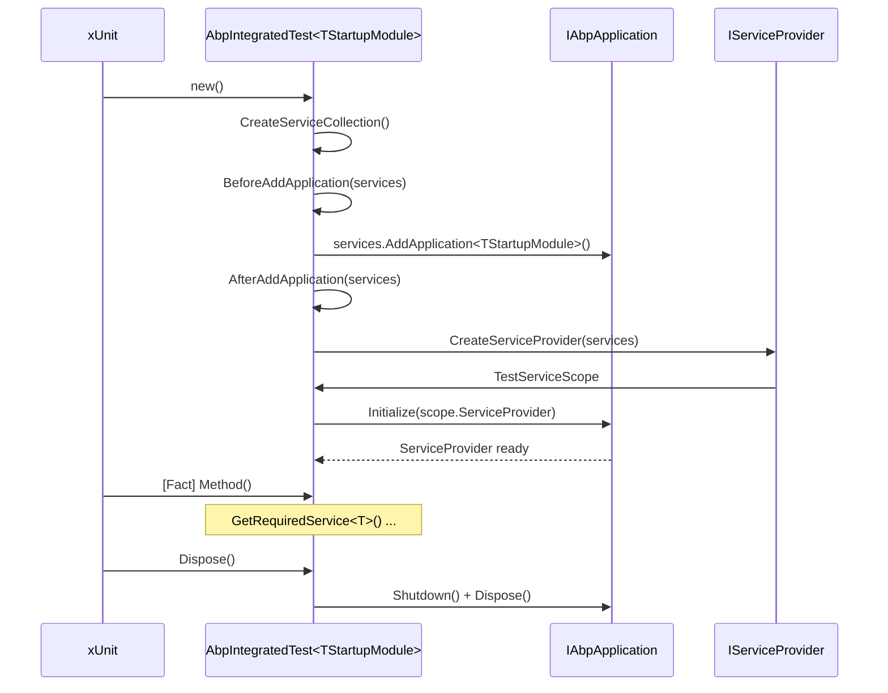

ABP's test infrastructure is built around two reusable NuGet packages — `Volo.Abp.TestBase` and `Volo.Abp.AspNetCore.TestBase` — plus one in-repository helper project, `framework/test/AbpTestBase`, that exists only as a `ProjectReference` from the other test projects. The pattern is consistent everywhere: each test fixture inherits from a `*TestBase` class that itself inherits from `AbpIntegratedTest<TStartupModule>`, the startup module wires in `[DependsOn(...)]` everything the system under test needs, and individual tests use xUnit's `[Fact]`/`[Theory]` plus Shouldly's fluent assertions.

This page documents the base classes, the test-module pattern, the helpers in `AbpTestBase`, and the conventions that propagate through every project in `framework/test/`.

## Inventory

<Files>
```
framework/
├── src/
│   ├── Volo.Abp.TestBase/                       # NuGet: Volo.Abp.TestBase
│   │   └── Volo/Abp/
│   │       ├── AbpTestBaseModule.cs             # empty AbpModule, the leaf dependency
│   │       ├── AbpTestBaseWithServiceProvider.cs# GetService<T>, GetRequiredService<T>, …
│   │       └── Testing/
│   │           ├── AbpIntegratedTest.cs         # sync ctor-based fixture
│   │           ├── AbpAsyncIntegratedTest.cs    # IAsyncLifetime variant
│   │           └── Utils/{ITestCounter,TestCounter}.cs
│   └── Volo.Abp.AspNetCore.TestBase/            # NuGet: Volo.Abp.AspNetCore.TestBase
│       └── Volo/Abp/AspNetCore/TestBase/
│           ├── AbpAspNetCoreIntegratedTestBase.cs        # [Obsolete] generic-host based
│           ├── AbpAspNetCoreAsyncIntegratedTestBase.cs
│           ├── AbpWebApplicationFactoryIntegratedTest.cs # current WebApplicationFactory<T>
│           ├── AbpAspNetCoreTestBaseModule.cs            # [DependsOn] HttpClient + AspNetCore + Autofac
│           ├── AbpNoopHostLifetime.cs                    # no-op IHostLifetime for test runs
│           ├── TestNoopHostLifetime.cs
│           ├── TestServerAccessor.cs / ITestServerAccessor.cs
│           ├── TestStartup.cs                            # adapter for AbpModule → IStartup
│           ├── WebHostBuilderExtensions.cs               # UseAbpTestServer()
│           ├── WebApplicationBuilderExtensions.cs        # RunAbpModuleAsync<TModule>()
│           └── DynamicProxying/AspNetCoreTestProxyHttpClientFactory.cs
└── test/
    └── AbpTestBase/                             # local-only helper, not packed
        ├── AbpTestBase.csproj                   # references xunit, NSubstitute, Shouldly
        ├── Microsoft/Extensions/DependencyInjection/
        │   └── ServiceCollectionShouldlyExtensions.cs
        └── Volo/Abp/TestBase/Logging/ICanLogOnObject.cs
```
</Files>

## `Volo.Abp.TestBase`

### `AbpTestBaseModule` — the empty leaf

The root of every test module graph is a five-line empty class:

```csharp title="framework/src/Volo.Abp.TestBase/Volo/Abp/AbpTestBaseModule.cs"
using Volo.Abp.Modularity;

namespace Volo.Abp;

public class AbpTestBaseModule : AbpModule
{

}
```

Its only purpose is to give other test modules something to `[DependsOn(typeof(AbpTestBaseModule))]` so the dependency graph has a single, deterministic leaf — which makes module initialization order predictable across every test project.

### `AbpTestBaseWithServiceProvider` — the DI accessor

Every fixture eventually exposes its `IServiceProvider`. The non-generic helper that does so is `AbpTestBaseWithServiceProvider`:

```csharp title="framework/src/Volo.Abp.TestBase/Volo/Abp/AbpTestBaseWithServiceProvider.cs"
public abstract class AbpTestBaseWithServiceProvider
{
    protected IServiceProvider ServiceProvider { get; set; } = default!;

    protected virtual T? GetService<T>()
    {
        return ServiceProvider.GetService<T>();
    }

    protected virtual T GetRequiredService<T>() where T : notnull
    {
        return ServiceProvider.GetRequiredService<T>();
    }

    protected virtual T? GetKeyedServices<T>(object? serviceKey)
    {
        return ServiceProvider.GetKeyedService<T>(serviceKey);
    }

    protected virtual T GetRequiredKeyedService<T>(object? serviceKey) where T : notnull
    {
        return ServiceProvider.GetRequiredKeyedService<T>(serviceKey);
    }
}
```

The `GetRequiredService<T>` overload is what every test uses. The reason it's `protected` and not `public` is that the test fixture itself is meant to be the only caller — tests should never escape the fixture to walk DI by hand.

### `AbpIntegratedTest<TStartupModule>` — the synchronous fixture

This is the workhorse. Every non-ASP.NET-Core test base inherits from it, parameterized by the startup module that brings in the system under test.

```csharp title="framework/src/Volo.Abp.TestBase/Volo/Abp/Testing/AbpIntegratedTest.cs"
public abstract class AbpIntegratedTest<TStartupModule> : AbpTestBaseWithServiceProvider, IDisposable
    where TStartupModule : IAbpModule
{
    protected IAbpApplication Application { get; }
    protected IServiceProvider RootServiceProvider { get; }
    protected IServiceScope TestServiceScope { get; }

    protected AbpIntegratedTest()
    {
        var services = CreateServiceCollection();

        BeforeAddApplication(services);

        var application = services.AddApplication<TStartupModule>(SetAbpApplicationCreationOptions);
        Application = application;

        AfterAddApplication(services);

        RootServiceProvider = CreateServiceProvider(services);
        TestServiceScope = RootServiceProvider.CreateScope();

        application.Initialize(TestServiceScope.ServiceProvider);
        ServiceProvider = Application.ServiceProvider;
    }
```

The constructor is the entire fixture lifecycle. Reading it top-to-bottom:

<Steps>
  <Step title="CreateServiceCollection()">
    Default is `new ServiceCollection()`. Override to start from a non-empty collection — for example to pre-register a fake clock that needs to exist before module configuration.
  </Step>
  <Step title="BeforeAddApplication(services)">
    Hook for adding services that the modules will *consume* during `ConfigureServices`. Use this to register `IConfiguration` overrides.
  </Step>
  <Step title="services.AddApplication<TStartupModule>(...)">
    Runs the full ABP module initialization for the startup module and all its `[DependsOn]` ancestors. `SetAbpApplicationCreationOptions` is your hook for `options.UseAutofac()` and friends.
  </Step>
  <Step title="AfterAddApplication(services)">
    Hook for replacing services *after* modules have registered them — this is where service substitution happens (see [Replacing services](#replacing-services-in-tests) below).
  </Step>
  <Step title="CreateServiceProvider(services)">
    Default is `services.BuildServiceProviderFromFactory()`, which honours any `IServiceProviderFactory` already registered (Autofac, for example, registers its own via `UseAutofac()`).
  </Step>
  <Step title="Application.Initialize(TestServiceScope.ServiceProvider)">
    Triggers `OnApplicationInitialization` on every module. The fixture stores both the root provider and the scoped one — `ServiceProvider` (the one used by `GetRequiredService`) is the scoped one.
  </Step>
</Steps>

`Dispose()` reverses the sequence: shutdown, dispose the scope, dispose the application. xUnit calls it once per `[Fact]` because xUnit constructs a fresh fixture per test by default.

### `AbpAsyncIntegratedTest<TStartupModule>` — the IAsyncLifetime variant

For modules whose `OnApplicationInitializationAsync` does meaningful work (database seeding, distributed-cache priming), the async base implements xUnit's `IAsyncLifetime`:

```csharp title="framework/src/Volo.Abp.TestBase/Volo/Abp/Testing/AbpAsyncIntegratedTest.cs"
public class AbpAsyncIntegratedTest<TStartupModule> : AbpTestBaseWithServiceProvider
    where TStartupModule : IAbpModule
{
    protected IAbpApplication Application { get; set; } = default!;
    protected IServiceProvider RootServiceProvider { get; set; } = default!;
    protected IServiceScope TestServiceScope { get; set; } = default!;

    public virtual async Task InitializeAsync()
    {
        var services = await CreateServiceCollectionAsync();

        await BeforeAddApplicationAsync(services);
        var application = await services.AddApplicationAsync<TStartupModule>(
            await SetAbpApplicationCreationOptionsAsync());
        await AfterAddApplicationAsync(services);

        RootServiceProvider = await CreateServiceProviderAsync(services);
        TestServiceScope = RootServiceProvider.CreateScope();
        await application.InitializeAsync(TestServiceScope.ServiceProvider);
        ServiceProvider = application.ServiceProvider;
        Application = application;

        await InitializeServicesAsync();
    }

    public virtual async Task DisposeAsync()
    {
        await Application.ShutdownAsync();
        TestServiceScope.Dispose();
        Application.Dispose();
    }
```

The shape mirrors the sync version, but every hook has an `Async` suffix and returns a `Task`. The extra `InitializeServicesAsync()` at the end is a hook reserved for "I need the service provider built before I can prime my fixture state" — for example, resolving an `ICurrentTenant` to set the test tenant.



## `Volo.Abp.AspNetCore.TestBase`

### Module wiring

The ASP.NET Core test base composes four modules — its own logic, plus HttpClient, AspNetCore, and Autofac:

```csharp title="framework/src/Volo.Abp.AspNetCore.TestBase/Volo/Abp/AspNetCore/TestBase/AbpAspNetCoreTestBaseModule.cs"
[DependsOn(typeof(AbpHttpClientModule))]
[DependsOn(typeof(AbpAspNetCoreModule))]
[DependsOn(typeof(AbpTestBaseModule))]
[DependsOn(typeof(AbpAutofacModule))]
public class AbpAspNetCoreTestBaseModule : AbpModule
{

}
```

Autofac is hard-wired in because most ABP services rely on property-injection and dynamic proxies that only Autofac's container fully supports.

### `AbpWebApplicationFactoryIntegratedTest<TProgram>` — the current API

This is what new tests use. It inherits from `Microsoft.AspNetCore.Mvc.Testing.WebApplicationFactory<TProgram>` so the host is started lazily on the first `CreateClient()` call:

```csharp title="framework/src/Volo.Abp.AspNetCore.TestBase/Volo/Abp/AspNetCore/TestBase/AbpWebApplicationFactoryIntegratedTest.cs"
public abstract class AbpWebApplicationFactoryIntegratedTest<TProgram> : WebApplicationFactory<TProgram>
    where TProgram : class
{
    protected HttpClient Client { get; set; }

    protected IServiceProvider ServiceProvider => Services;

    protected AbpWebApplicationFactoryIntegratedTest()
    {
        Client = CreateClient(new WebApplicationFactoryClientOptions
        {
            AllowAutoRedirect = false
        });
        ServiceProvider.GetRequiredService<ITestServerAccessor>().Server = Server;
    }

    protected override IHost CreateHost(IHostBuilder builder)
    {
        builder
            .AddAppSettingsSecretsJson()
            .ConfigureServices(ConfigureServices);
        return base.CreateHost(builder);
    }
```

Two details matter:

<CardGroup cols={2}>
  <Card title="AllowAutoRedirect = false" icon="ban">
    The `HttpClient` is configured *not* to follow redirects. ABP tests routinely assert on 302 responses (multi-tenancy switches, login redirects), and silent following would mask those assertions.
  </Card>
  <Card title="ITestServerAccessor" icon="server">
    The test host's `TestServer` is published into DI via a singleton accessor. Tests that need raw `TestServer` access (for example to spawn additional clients) resolve `ITestServerAccessor`.
  </Card>
</CardGroup>

The `GetUrl<TController>()` helpers in the base produce conventional URLs by stripping suffixes:

```csharp title="framework/src/Volo.Abp.AspNetCore.TestBase/.../AbpWebApplicationFactoryIntegratedTest.cs"
protected virtual string GetUrl<TController>()
{
    return "/" + typeof(TController).Name
        .RemovePostFix("Controller", "AppService",
                       "ApplicationService", "IntService",
                       "IntegrationService", "Service");
}
```

`GetUrl<UserAppService>()` therefore returns `/User`.

### `AbpAspNetCoreIntegratedTestBase<TStartupModule>` — the obsolete generic-host base

The older base is marked `[Obsolete]` but still exists because dozens of test projects in `framework/test/` reference it:

```csharp title="framework/src/Volo.Abp.AspNetCore.TestBase/.../AbpAspNetCoreIntegratedTestBase.cs"
[Obsolete("Use AbpWebApplicationFactoryIntegratedTest instead.")]
public abstract class AbpAspNetCoreIntegratedTestBase<TStartupModule>
    : AbpTestBaseWithServiceProvider, IDisposable
    where TStartupModule : class
{
    protected TestServer Server { get; }
    protected HttpClient Client { get; }
    private readonly IHost _host;

    protected AbpAspNetCoreIntegratedTestBase()
    {
        var builder = CreateHostBuilder();

        _host = builder.Build();
        _host.Start();

        Server = _host.GetTestServer();
        Client = _host.GetTestClient();

        ServiceProvider = Server.Services;

        ServiceProvider.GetRequiredService<ITestServerAccessor>().Server = Server;
    }

    protected virtual IHostBuilder CreateHostBuilder()
    {
        return Host.CreateDefaultBuilder()
            .AddAppSettingsSecretsJson()
            .ConfigureWebHostDefaults(webBuilder =>
            {
                if (typeof(TStartupModule).IsAssignableTo<IAbpModule>())
                {
                    webBuilder.UseStartup<TestStartup<TStartupModule>>();
                }
                else
                {
                    webBuilder.UseStartup<TStartupModule>();
                }

                webBuilder.UseAbpTestServer();
            })
            .UseAutofac()
            .ConfigureServices(ConfigureServices);
    }
```

The polymorphic branch lets `TStartupModule` be either an `IAbpModule` (the ABP convention) or an old-style `Startup` class. When it is a module, `TestStartup<TStartupModule>` runs `services.AddApplicationAsync(typeof(TStartupModule))` synchronously:

```csharp title="framework/src/Volo.Abp.AspNetCore.TestBase/.../TestStartup.cs"
internal class TestStartup<TStartupModule>
{
    public void ConfigureServices(IServiceCollection services)
    {
        AsyncHelper.RunSync(() => services.AddApplicationAsync(typeof(TStartupModule)));
    }

    public void Configure(IApplicationBuilder app)
    {
        AsyncHelper.RunSync(app.InitializeApplicationAsync);
    }
}
```

The `UseAbpTestServer()` extension wires `TestServer` and `AbpNoopHostLifetime` into DI:

```csharp title="framework/src/Volo.Abp.AspNetCore.TestBase/.../WebHostBuilderExtensions.cs"
public static class AbpWebHostBuilderExtensions
{
    public static IWebHostBuilder UseAbpTestServer(this IWebHostBuilder builder)
    {
        return builder.ConfigureServices(services =>
        {
            services.AddScoped<IHostLifetime, AbpNoopHostLifetime>();
            services.AddScoped<IServer, TestServer>();
        });
    }
}
```

`AbpNoopHostLifetime` exists because the default `ConsoleLifetime` would otherwise hook `Ctrl-C` and `SIGTERM`, which is incoherent inside an xUnit run:

```csharp title="framework/src/Volo.Abp.AspNetCore.TestBase/.../AbpNoopHostLifetime.cs"
public class AbpNoopHostLifetime : IHostLifetime
{
    public Task StopAsync(CancellationToken cancellationToken)
    {
        return Task.CompletedTask;
    }

    public Task WaitForStartAsync(CancellationToken cancellationToken)
    {
        return Task.CompletedTask;
    }
}
```

### `WebApplicationBuilderExtensions.RunAbpModuleAsync<TModule>`

For tests that boot a real `WebApplicationBuilder` (not `WebApplicationFactory`), the package ships a one-liner:

```csharp title="framework/src/Volo.Abp.AspNetCore.TestBase/.../WebApplicationBuilderExtensions.cs"
public async static Task RunAbpModuleAsync<TModule>(this WebApplicationBuilder builder,
    Action<AbpApplicationCreationOptions>? optionsAction = null)
    where TModule : IAbpModule
{
    var assemblyName = typeof(TModule).Assembly.GetName()?.Name;
    if (!assemblyName.IsNullOrWhiteSpace())
    {
        // Set the application name as the assembly name of the module will automatically
        // add assembly to the ApplicationParts of MVC application.
        builder.Environment.ApplicationName = assemblyName!;
    }
    builder.Host.UseAutofac();
    await builder.AddApplicationAsync<TModule>(optionsAction);
    var app = builder.Build();
    await app.InitializeApplicationAsync();
    await app.RunAsync();
}
```

Forcing `Environment.ApplicationName = typeof(TModule).Assembly.GetName().Name` is what makes MVC pick up the test module's assembly as an `ApplicationPart` — without it, controllers defined in the test module would not be discovered.

## The per-project test-module pattern

Every test project in `framework/test/` follows the same shape. Here is `Volo.Abp.Authorization.Tests`:

```csharp title="framework/test/Volo.Abp.Authorization.Tests/.../AbpAuthorizationTestModule.cs"
[DependsOn(typeof(AbpAutofacModule))]
[DependsOn(typeof(AbpAuthorizationModule))]
[DependsOn(typeof(AbpExceptionHandlingModule))]
public class AbpAuthorizationTestModule : AbpModule
{
    public override void PreConfigureServices(ServiceConfigurationContext context)
    {
        context.Services.OnRegistered(onServiceRegistredContext =>
        {
            if (typeof(IMyAuthorizedService1).IsAssignableFrom(onServiceRegistredContext.ImplementationType) &&
                !DynamicProxyIgnoreTypes.Contains(onServiceRegistredContext.ImplementationType))
            {
                onServiceRegistredContext.Interceptors.TryAdd<AuthorizationInterceptor>();
            }
        });
    }

    public override void ConfigureServices(ServiceConfigurationContext context)
    {
        Configure<AbpPermissionOptions>(options =>
        {
            options.ValueProviders.Add<TestPermissionValueProvider1>();
            options.ValueProviders.Add<TestPermissionValueProvider2>();
        });
    }
}
```

The module:

1. `[DependsOn]` the production module(s) being tested plus `AbpAutofacModule` (test fixtures always use Autofac).
2. Configures `AbpPermissionOptions` (or whichever options type) with test-only value providers.
3. Wires up extra interceptors when the test needs to exercise a dynamic-proxy code path.

The per-project base then sets `UseAutofac()` and any per-test state:

```csharp title="framework/test/Volo.Abp.Authorization.Tests/.../AuthorizationTestBase.cs"
public class AuthorizationTestBase : AbpIntegratedTest<AbpAuthorizationTestModule>
{
    protected override void SetAbpApplicationCreationOptions(AbpApplicationCreationOptions options)
    {
        options.UseAutofac();
    }

    protected override void AfterAddApplication(IServiceCollection services)
    {
        var claims = new List<Claim>() {
                                new Claim(AbpClaimTypes.UserName, "Douglas"),
                                new Claim(AbpClaimTypes.UserId, "1fcf46b2-28c3-48d0-8bac-fa53268a2775"),
                                new Claim(AbpClaimTypes.Role, "MyRole")
                            };

        var identity = new ClaimsIdentity(claims);
        var claimsPrincipal = new ClaimsPrincipal(identity);
        var principalAccessor = Substitute.For<ICurrentPrincipalAccessor>();
        principalAccessor.Principal.Returns(ci => claimsPrincipal);
        Thread.CurrentPrincipal = claimsPrincipal;
    }
}
```

Notice the `Substitute.For<ICurrentPrincipalAccessor>()` from NSubstitute. ABP tests use NSubstitute for mocking; the package is referenced from `AbpTestBase.csproj`.

## Replacing services in tests

The canonical seam for swapping a production service with a fake is `AfterAddApplication(IServiceCollection)` on the synchronous base (or `AfterAddApplicationAsync` on the async one). At that point every production module has already called `Add*` on the collection, and the DI container has not yet been built, so a final `Replace` wins:

```csharp title="example pattern"
protected override void AfterAddApplication(IServiceCollection services)
{
    var fakeClock = Substitute.For<IClock>();
    fakeClock.Now.Returns(new DateTime(2024, 1, 1));

    services.Replace(ServiceDescriptor.Singleton<IClock>(fakeClock));
}
```

When the substitute itself needs to read from the live `IServiceProvider`, fall back to `OnApplicationInitialization` in a custom test module — `[DependsOn]` it from `AbpAuthorizationTestModule`-style modules and resolve from `context.ServiceProvider`.

## `framework/test/AbpTestBase` — Shouldly extensions for `IServiceCollection`

The locally-referenced `AbpTestBase` project (not the NuGet `Volo.Abp.TestBase`) ships one piece of glue: assertion helpers that read directly from an `IServiceCollection`. These are used by tests that exercise `AddXxx()` extension methods and want to assert on the resulting registrations without spinning up a host.

```csharp title="framework/test/AbpTestBase/.../ServiceCollectionShouldlyExtensions.cs"
public static class ServiceCollectionShouldlyExtensions
{
    public static void ShouldContainTransient(this IServiceCollection services,
        Type serviceType, Type implementationType = null)
    {
        var serviceDescriptor = services.FirstOrDefault(s => s.ServiceType == serviceType);

        serviceDescriptor.ShouldNotBeNull();
        serviceDescriptor.ImplementationType.ShouldBe(implementationType ?? serviceType);
        serviceDescriptor.ImplementationFactory.ShouldBeNull();
        serviceDescriptor.ImplementationInstance.ShouldBeNull();
        serviceDescriptor.Lifetime.ShouldBe(ServiceLifetime.Transient);
    }

    public static void ShouldContainTransientImplementationFactory(this IServiceCollection services,
        Type serviceType)
    {
        var serviceDescriptor = services.FirstOrDefault(s => s.ServiceType == serviceType);

        serviceDescriptor.ShouldNotBeNull();
        serviceDescriptor.ImplementationType.ShouldBeNull();
        serviceDescriptor.ImplementationFactory.ShouldNotBeNull();
        serviceDescriptor.ImplementationInstance.ShouldBeNull();
        serviceDescriptor.Lifetime.ShouldBe(ServiceLifetime.Transient);
    }

    public static void ShouldContainSingleton(this IServiceCollection services,
        Type serviceType, Type implementationType = null) { /* … */ }

    public static void ShouldContainScoped(this IServiceCollection services,
        Type serviceType, Type implementationType = null) { /* … */ }

    public static void ShouldContain(this IServiceCollection services,
        Type serviceType, Type implementationType, ServiceLifetime lifetime) { /* … */ }

    public static void ShouldNotContainService(this IServiceCollection services,
        Type serviceType) { /* … */ }
}
```

A test using them reads cleanly:

```csharp
services.ShouldContainTransient(typeof(IFooService), typeof(FooService));
services.ShouldContainSingleton(typeof(IClock));
services.ShouldNotContainService(typeof(IInternalDetail));
```

There is also a tiny logging interface — `ICanLogOnObject` — used by handful of tests that want to capture log lines via property:

```csharp title="framework/test/AbpTestBase/Volo/Abp/TestBase/Logging/ICanLogOnObject.cs"
public interface ICanLogOnObject
{
    List<string> Logs { get; }
}
```

## xUnit conventions

Every test in `framework/test/` follows the same handful of conventions. The relevant package references are declared in `AbpTestBase.csproj`:

```xml title="framework/test/AbpTestBase/AbpTestBase.csproj"
<ItemGroup>
  <PackageReference Include="Microsoft.NET.Test.Sdk" />
  <PackageReference Include="NSubstitute" />
  <PackageReference Include="Shouldly" />
  <PackageReference Include="xunit" />
  <PackageReference Include="xunit.extensibility.execution" />
  <PackageReference Include="xunit.runner.visualstudio" />
</ItemGroup>
```

| Convention | Example | Notes |
| --- | --- | --- |
| Synchronous fixtures inherit `AbpIntegratedTest<TModule>` | `class PermissionChecker_Tests : AuthorizationTestBase` | Use ctor for fixture-time setup; resolve services with `GetRequiredService<T>()`. |
| Async fixtures inherit `AbpAsyncIntegratedTest<TModule>` and override `InitializeAsync` | When you need to seed via `IDataSeeder` | xUnit calls `InitializeAsync` before the first `[Fact]`. |
| `[Fact]` for parameterless tests, `[Theory]` + `[InlineData]` for table-driven | `[Theory] [InlineData("MyPermission1")] public async Task IsGrantedAsync(string name)` | Plain xUnit. |
| Assertions use Shouldly | `(await checker.IsGrantedAsync("X")).ShouldBe(true)` | Avoid `Assert.True` — Shouldly's failure messages are richer. |
| Mocks use NSubstitute | `var x = Substitute.For<IClock>(); x.Now.Returns(...)` | Never `Mock<T>` — Moq is not referenced. |
| Test class names end in `_Tests` | `PermissionChecker_Tests`, `Authorization_Tests` | Used by the `IsTestProject` heuristic in `Directory.Build.props`. |

A canonical example from `framework/test/Volo.Abp.Authorization.Tests/`:

```csharp title="framework/test/Volo.Abp.Authorization.Tests/.../PermissionChecker_Tests.cs"
public class PermissionChecker_Tests: AuthorizationTestBase
{
    private readonly IPermissionChecker _permissionChecker;

    public PermissionChecker_Tests()
    {
        _permissionChecker = GetRequiredService<IPermissionChecker>();
    }

    [Fact]
    public async Task IsGrantedAsync()
    {
        (await _permissionChecker.IsGrantedAsync("MyPermission5")).ShouldBe(true);
        (await _permissionChecker.IsGrantedAsync("UndefinedPermission")).ShouldBe(false);
    }
}
```

The fixture is constructed once per `[Fact]` by xUnit. Sharing expensive state between tests is done with xUnit's `IClassFixture<T>` pattern — but every project under `framework/test/` chooses fresh fixtures over shared ones, accepting the per-test boot cost in exchange for hermeticity.

## Running tests locally

The whole suite runs via [`build/test-all.ps1`](/ops/build-and-pack):

```bash
cd build
pwsh ./build-all.ps1
pwsh ./test-all.ps1
```

`test-all.ps1` passes `--collect:"XPlat Code Coverage"` to every `dotnet test`, and the root `Directory.Build.props` injects `coverlet.collector` into every `*.Tests`/`*.TestBase` project (see [tooling/directory-build-props](/tooling/directory-build-props)), so each project emits a `coverage.cobertura.xml` that the CI step uploads to Codecov.

## Related

- [ops/build-and-pack](/ops/build-and-pack) — the PowerShell scripts that drive `dotnet test`.
- [ops/devops](/ops/devops) — `.github/workflows/build-and-test.yml` runs `test-all.ps1` and uploads to Codecov.
- [tooling/directory-build-props](/tooling/directory-build-props) — the `IsTestProject` heuristic and Coverlet injection.
- [modularity](/modularity) — `AbpModule`, `[DependsOn]`, and the application lifecycle that fixtures replay.
- [cli/overview](/cli/overview) — the `abp` CLI that contributors use to scaffold solutions whose tests follow these same conventions.
