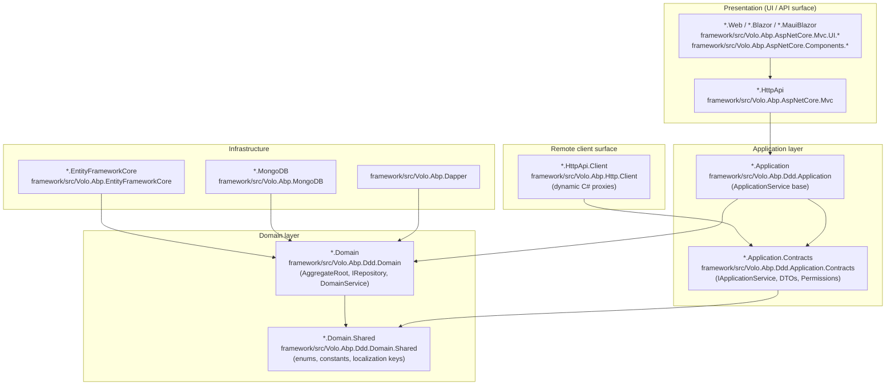
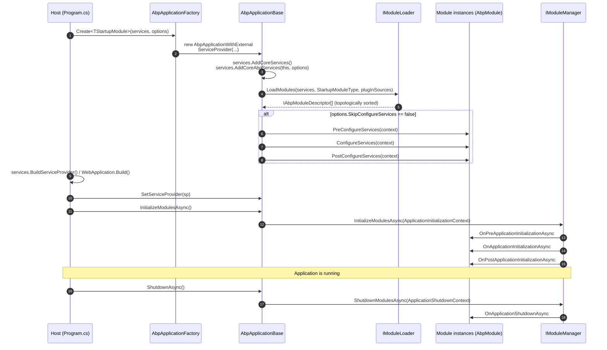

The ABP Framework is built as a layered, modular ASP.NET Core infrastructure. The runtime fabric lives in `framework/src/` (≈150+ `Volo.Abp.*` packages), pre-built business modules live in `modules/`, opinionated solution scaffolds live in `templates/`, and the Angular UI counterpart lives in `npm/ng-packs/packages/`. This page walks the layered onion architecture, the module composition mechanism that holds it together, and the deterministic startup sequence implemented in `framework/src/Volo.Abp.Core`. Every section names the file or symbol that owns the concept so you can jump straight from the diagram to the implementation.

<Note>
  This page focuses on the *.NET runtime* side. For the Angular stack see `npm/ng-packs/packages/core` and the [DI overview](/di/overview); for module specifics see [/modularity/overview](/modularity/overview).
</Note>

## The onion in source

ABP standardises the Domain Driven Design layering popularised by Eric Evans and the .NET microservices guidance, then ships a NuGet package per layer so a feature can be sliced cleanly. The same layer names recur in `framework/src/` (for the framework itself), `modules/identity/src/` (for application modules), and the `*.Domain`, `*.Application`, `*.HttpApi`, `*.HttpApi.Client`, `*.EntityFrameworkCore`, `*.MongoDB` and `*.Web` / `*.Blazor` projects produced by `templates/app/`.



The arrows are the *only* allowed compile-time dependencies. Domain has no knowledge of EF Core; the Application layer never references infrastructure directly; the HttpApi controllers thinly wrap `IApplicationService` implementations through ASP.NET Core MVC conventions implemented in `framework/src/Volo.Abp.AspNetCore.Mvc`.

### Domain.Shared — the universal pebble

`*.Domain.Shared` projects hold types that every other layer (including JavaScript-bound DTOs) is allowed to see: enums, constant strings, localization resource keys, and global exception codes. They have no behavior. The framework's own `Volo.Abp.Ddd.Domain.Shared` package lives at `framework/src/Volo.Abp.Ddd.Domain.Shared/` and is referenced transitively by every higher layer through `[DependsOn(typeof(AbpDddDomainSharedModule))]`.

### Domain — entities, aggregates, repositories, domain services

`Volo.Abp.Ddd.Domain` defines `AggregateRoot`, `Entity`, `IRepository`, and the `IDomainService` marker. The aggregate base lives at `framework/src/Volo.Abp.Ddd.Domain/Volo/Abp/Domain/Entities/AggregateRoot.cs`:

```csharp framework/src/Volo.Abp.Ddd.Domain/Volo/Abp/Domain/Entities/AggregateRoot.cs
[Serializable]
public abstract class AggregateRoot : BasicAggregateRoot,
    IHasExtraProperties,
    IHasConcurrencyStamp
{
    public virtual ExtraPropertyDictionary ExtraProperties { get; protected set; }

    [DisableAuditing]
    public virtual string ConcurrencyStamp { get; set; }

    protected AggregateRoot()
    {
        ConcurrencyStamp = Guid.NewGuid().ToString("N");
        ExtraProperties = new ExtraPropertyDictionary();
        this.SetDefaultsForExtraProperties();
    }
}
```

The repository abstraction is split between a marker interface and the typed generic counterpart in `framework/src/Volo.Abp.Ddd.Domain/Volo/Abp/Domain/Repositories/IRepository.cs`. Domain services derive from `DomainService` (`framework/src/Volo.Abp.Ddd.Domain/Volo/Abp/Domain/Services/DomainService.cs`) which exposes `LazyServiceProvider`, `Clock`, `GuidGenerator`, `CurrentTenant`, and `AsyncExecuter` so domain code never touches the raw `IServiceProvider`.

### Application.Contracts and Application

`Application.Contracts` is the public *shape* of an application: DTOs, the `IApplicationService` interfaces, permission and feature definitions. The marker interface is intentionally empty so it can carry conventions only:

```csharp framework/src/Volo.Abp.Ddd.Application.Contracts/Volo/Abp/Application/Services/IApplicationService.cs
namespace Volo.Abp.Application.Services;

/// <summary>
/// This interface must be implemented by all application services to register and identify them by convention.
/// </summary>
public interface IApplicationService : IRemoteService
{

}
```

`Volo.Abp.Ddd.Application` provides `ApplicationService`, the standard base with `LazyServiceProvider`, `IObjectMapper`, `ICurrentUser`, permission/feature/setting accessors, and authorization helpers. Because it derives from a contracts-only interface, the same `Application.Contracts` project can be re-used by an `HttpApi.Client` to build a *remote* in-process proxy that calls the server via HTTP — see `framework/src/Volo.Abp.Http.Client/Volo/Abp/Http/Client/ClientProxying/`.

### HttpApi and HttpApi.Client — symmetric remote surface

`*.HttpApi` exposes application services as MVC controllers using the conventional routing in `framework/src/Volo.Abp.AspNetCore.Mvc`. `*.HttpApi.Client` reverses that: it generates dynamic C# clients from the same `IApplicationService` interfaces so a Blazor WebAssembly or MAUI client can `await _bookAppService.CreateAsync(...)` and the call is transparently shipped over HTTP. The plumbing lives in `framework/src/Volo.Abp.Http.Client/Microsoft/Extensions/DependencyInjection/ServiceCollectionHttpClientProxyExtensions.cs`.

### EntityFrameworkCore, MongoDB, Dapper

Persistence packages each contribute a module (e.g. `Volo.Abp.EntityFrameworkCore.AbpEntityFrameworkCoreModule`) that wires `AbpDbContext`, conventional repositories, and a `IDbContextProvider`. The provider matrix lives in:

- `framework/src/Volo.Abp.EntityFrameworkCore` (core)
- `framework/src/Volo.Abp.EntityFrameworkCore.SqlServer`
- `framework/src/Volo.Abp.EntityFrameworkCore.PostgreSql`
- `framework/src/Volo.Abp.EntityFrameworkCore.MySQL`
- `framework/src/Volo.Abp.EntityFrameworkCore.Sqlite`
- `framework/src/Volo.Abp.EntityFrameworkCore.Oracle`
- `framework/src/Volo.Abp.EntityFrameworkCore.Oracle.Devart`
- `framework/src/Volo.Abp.MongoDB`
- `framework/src/Volo.Abp.Dapper`
- `framework/src/Volo.Abp.MemoryDb`

Replacing a provider means swapping the package in the EF Core / Mongo module — the domain and application layers never change.

### Web / Blazor / MAUI presentation

ABP ships three UI families, each behind its own module package:

<CardGroup cols={3}>
  <Card title="MVC / Razor Pages" icon="window">
    `framework/src/Volo.Abp.AspNetCore.Mvc.UI` plus theme packages (`Volo.Abp.AspNetCore.Mvc.UI.Bootstrap`, `*.Theme.Shared`, `Volo.Abp.AspNetCore.Mvc.UI.Bundling`).
  </Card>
  <Card title="Blazor Server / WASM / MAUI" icon="bolt">
    `Volo.Abp.AspNetCore.Components.Server`, `*.WebAssembly`, `*.MauiBlazor` and the Blazorise wrapper in `Volo.Abp.BlazoriseUI`.
  </Card>
  <Card title="Angular" icon="code">
    `npm/ng-packs/packages/core`, `theme-basic`, `theme-shared`, plus per-module packages: `account`, `identity`, `tenant-management`, `feature-management`, `setting-management`, `permission-management`.
  </Card>
</CardGroup>

## Module composition with `[DependsOn]`

Every ABP project that contributes services derives an `AbpModule` class and decorates it with `[DependsOn]` for any other module whose services it relies on. The attribute is the thin declarative graph the loader walks at startup.

```csharp framework/src/Volo.Abp.Core/Volo/Abp/Modularity/DependsOnAttribute.cs
/// <summary>
/// Used to define dependencies of a type.
/// </summary>
[AttributeUsage(AttributeTargets.Class, AllowMultiple = true)]
public class DependsOnAttribute : Attribute, IDependedTypesProvider
{
    public Type[] DependedTypes { get; }

    public DependsOnAttribute(params Type[]? dependedTypes)
    {
        DependedTypes = dependedTypes ?? Type.EmptyTypes;
    }

    public virtual Type[] GetDependedTypes()
    {
        return DependedTypes;
    }
}
```

`AbpModule` itself is an opt-in base that implements every lifecycle hook with virtual no-op methods, so modules override only what they care about:

```csharp framework/src/Volo.Abp.Core/Volo/Abp/Modularity/AbpModule.cs
public abstract class AbpModule :
    IAbpModule,
    IOnPreApplicationInitialization,
    IOnApplicationInitialization,
    IOnPostApplicationInitialization,
    IOnApplicationShutdown,
    IPreConfigureServices,
    IPostConfigureServices
{
    protected internal bool SkipAutoServiceRegistration { get; protected set; }
```

A typical infrastructure module wires a sub-system in 5 lines:

```csharp framework/src/Volo.Abp.BackgroundWorkers/Volo/Abp/BackgroundWorkers/AbpBackgroundWorkersModule.cs
[DependsOn(typeof(AbpThreadingModule))]
public class AbpBackgroundWorkersModule : AbpModule
{
    // ConfigureServices, OnApplicationInitialization, OnApplicationShutdown ...
}
```

See [/modularity/depends-on-and-plug-ins](/modularity/depends-on-and-plug-ins) for the full traversal semantics, [/modularity/abp-module](/modularity/abp-module) for the lifecycle hooks (`PreConfigureServices`, `ConfigureServices`, `PostConfigureServices`, `OnPreApplicationInitialization`, `OnApplicationInitialization`, `OnPostApplicationInitialization`, `OnApplicationShutdown`), and [/modularity/module-descriptor-loader](/modularity/module-descriptor-loader) for the topological sort implemented behind `IModuleLoader`:

```csharp framework/src/Volo.Abp.Core/Volo/Abp/Modularity/IModuleLoader.cs
public interface IModuleLoader
{
    [NotNull]
    IAbpModuleDescriptor[] LoadModules(
        [NotNull] IServiceCollection services,
        [NotNull] Type startupModuleType,
        [NotNull] PlugInSourceList plugInSources
    );
}
```

## Cross-cutting subsystems mapped to packages

Cross-cutting infrastructure is sliced into independent, opt-in NuGet packages. Each row below names the headline interface and the package that owns it.

| Concern | Headline interface / class | Owning package |
| --- | --- | --- |
| Dependency injection conventions | `ITransientDependency`, `ISingletonDependency`, `IScopedDependency` | `framework/src/Volo.Abp.Core/Volo/Abp/DependencyInjection/` |
| Conventional registration | `IConventionalRegistrar`, `DefaultConventionalRegistrar` | `framework/src/Volo.Abp.Core/Volo/Abp/DependencyInjection/` |
| Module loader | `IModuleLoader`, `IAbpModuleDescriptor` | `framework/src/Volo.Abp.Core/Volo/Abp/Modularity/` |
| Autofac integration | `AbpAutofacServiceProviderFactory` | `framework/src/Volo.Abp.Autofac/` |
| Unit of work | `IUnitOfWork`, `[UnitOfWork]` | `framework/src/Volo.Abp.Uow/` |
| Local events | `ILocalEventBus` | `framework/src/Volo.Abp.EventBus.Abstractions/Volo/Abp/EventBus/Local/` |
| Distributed events | `IDistributedEventBus` (+ RabbitMQ/Kafka/Azure/Dapr/Rebus impls) | `framework/src/Volo.Abp.EventBus.Abstractions`, `Volo.Abp.EventBus.RabbitMQ`, `*.Kafka`, `*.Azure`, `*.Dapr`, `*.Rebus` |
| Background jobs | `IBackgroundJobStore`, `IBackgroundJobWorker` | `framework/src/Volo.Abp.BackgroundJobs[.HangFire/.Quartz/.RabbitMQ]` |
| Background workers | `IBackgroundWorker`, `PeriodicBackgroundWorkerBase` | `framework/src/Volo.Abp.BackgroundWorkers[.Hangfire/.Quartz]` |
| Authorization | `IPermissionChecker`, `PermissionDefinition` | `framework/src/Volo.Abp.Authorization.Abstractions/Volo/Abp/Authorization/Permissions/` |
| Multi-tenancy | `ICurrentTenant`, `ITenantResolver` | `framework/src/Volo.Abp.MultiTenancy/` |
| Features | `IFeatureChecker`, `FeatureDefinition` | `framework/src/Volo.Abp.Features/` |
| Settings | `ISettingProvider`, `SettingDefinition` | `framework/src/Volo.Abp.Settings/` |
| Auditing | `IAuditingStore`, `[Audited]` | `framework/src/Volo.Abp.Auditing/` |
| Caching | `IDistributedCache<T>` (typed) | `framework/src/Volo.Abp.Caching[.StackExchangeRedis]` |
| Localization | `IStringLocalizer<T>` (ABP-extended), `LocalizationResource` | `framework/src/Volo.Abp.Localization[.Abstractions]` |
| Validation | `IObjectValidator`, FluentValidation bridge | `framework/src/Volo.Abp.Validation[.Abstractions]`, `Volo.Abp.FluentValidation` |
| Object mapping | `IObjectMapper` (+ AutoMapper bridge) | `framework/src/Volo.Abp.ObjectMapping`, `Volo.Abp.AutoMapper` |
| Virtual file system | `IVirtualFileProvider` | `framework/src/Volo.Abp.VirtualFileSystem/` |
| BLOB storing | `IBlobContainer<T>`, providers (Azure/AWS/Minio/FileSystem/Aliyun) | `framework/src/Volo.Abp.BlobStoring[.Azure/.Aws/.Minio/.FileSystem/.Aliyun]` |
| Email / SMS | `IEmailSender`, `ISmsSender` | `framework/src/Volo.Abp.Emailing`, `Volo.Abp.MailKit`, `Volo.Abp.Sms[.Aliyun]` |
| Distributed locking | `IAbpDistributedLock` | `framework/src/Volo.Abp.DistributedLocking[.Abstractions/.Dapr]` |
| Text templating | `ITemplateRenderer` (Scriban / Razor) | `framework/src/Volo.Abp.TextTemplating[.Core/.Scriban/.Razor]` |
| Imaging | `IImageResizer`, providers | `framework/src/Volo.Abp.Imaging.Abstractions`, `.ImageSharp`, `.MagickNet`, `.SkiaSharp` |
| HTTP API description | `IApiDescriptionModelProvider` | `framework/src/Volo.Abp.Http/Volo/Abp/Http/Modeling/` |
| Remote services / dynamic proxy | `AbpHttpClient*`, `ServiceCollectionHttpClientProxyExtensions` | `framework/src/Volo.Abp.Http.Client/` |

<Tip>
  Each package targets a *single* concern and depends only on its own abstractions package. That is what allows the `Volo.Abp.EventBus.Abstractions` interface set to be referenced by domain code without dragging in a specific transport.
</Tip>

## Startup sequence

Bootstrapping always goes through the static factory `AbpApplicationFactory`. It has overloads for "internal" service providers (the ABP host owns DI) and "external" (you pass in an existing `IServiceCollection`, which is what `WebApplicationBuilder` does):

```csharp framework/src/Volo.Abp.Core/Volo/Abp/AbpApplicationFactory.cs
public static IAbpApplicationWithExternalServiceProvider Create(
    [NotNull] Type startupModuleType,
    [NotNull] IServiceCollection services,
    Action<AbpApplicationCreationOptions>? optionsAction = null)
{
    return new AbpApplicationWithExternalServiceProvider(startupModuleType, services, optionsAction);
}
```

The shared `AbpApplicationBase` constructor does the heavy lifting — it registers core ABP services, runs the module loader, and (unless `SkipConfigureServices` was set) immediately walks the configure-services phases:

```csharp framework/src/Volo.Abp.Core/Volo/Abp/AbpApplicationBase.cs
internal AbpApplicationBase(
    [NotNull] Type startupModuleType,
    [NotNull] IServiceCollection services,
    Action<AbpApplicationCreationOptions>? optionsAction)
{
    // ...
    services.AddSingleton<IAbpApplication>(this);
    services.AddSingleton<IApplicationInfoAccessor>(this);
    services.AddSingleton<IModuleContainer>(this);
    services.AddSingleton<IAbpHostEnvironment>(new AbpHostEnvironment()
    {
        EnvironmentName = options.Environment
    });

    services.AddCoreServices();
    services.AddCoreAbpServices(this, options);

    Modules = LoadModules(services, options);

    if (!options.SkipConfigureServices)
    {
        ConfigureServices();
    }
}
```

`ConfigureServices()` then iterates every module three times — Pre, main, Post — and each iteration is wrapped in an `AbpInitializationException` translator so any failure points at the offending module's `AssemblyQualifiedName`:

```csharp framework/src/Volo.Abp.Core/Volo/Abp/AbpApplicationBase.cs
//PreConfigureServices
foreach (var module in Modules.Where(m => m.Instance is IPreConfigureServices))
{
    try
    {
        ((IPreConfigureServices)module.Instance).PreConfigureServices(context);
    }
    catch (Exception ex)
    {
        throw new AbpInitializationException($"An error occurred during {nameof(IPreConfigureServices.PreConfigureServices)} phase of the module {module.Type.AssemblyQualifiedName}. See the inner exception for details.", ex);
    }
}
```

After the container is built, the host calls `InitializeModulesAsync()` (or its sync sibling), which delegates to `IModuleManager` — that fans out the three "OnApplication" hooks in dependency order:

```csharp framework/src/Volo.Abp.Core/Volo/Abp/AbpApplicationBase.cs
protected virtual async Task InitializeModulesAsync()
{
    using (var scope = ServiceProvider.CreateScope())
    {
        WriteInitLogs(scope.ServiceProvider);
        await scope.ServiceProvider
            .GetRequiredService<IModuleManager>()
            .InitializeModulesAsync(new ApplicationInitializationContext(scope.ServiceProvider));
    }
}
```

Shutdown is symmetrical:

```csharp framework/src/Volo.Abp.Core/Volo/Abp/AbpApplicationBase.cs
public virtual async Task ShutdownAsync()
{
    using (var scope = ServiceProvider.CreateScope())
    {
        await scope.ServiceProvider
            .GetRequiredService<IModuleManager>()
            .ShutdownModulesAsync(new ApplicationShutdownContext(scope.ServiceProvider));
    }
}
```

### End-to-end sequence diagram



### Walking the phases

<Steps>
  <Step title="Static factory entry">
    `AbpApplicationFactory.Create*` (sync) or `CreateAsync*` (async) is the single public entry — see `framework/src/Volo.Abp.Core/Volo/Abp/AbpApplicationFactory.cs`. The async overloads force `SkipConfigureServices = true` so they can `await ConfigureServicesAsync()` afterwards.
  </Step>
  <Step title="Core service seeding">
    `AbpApplicationBase` registers itself as `IAbpApplication`, `IApplicationInfoAccessor` and `IModuleContainer`, then calls `services.AddCoreServices()` and `services.AddCoreAbpServices(this, options)` to add the logger, options system, module loader (`IModuleLoader`), and conventional registrar infrastructure.
  </Step>
  <Step title="Module loading">
    `LoadModules` resolves `IModuleLoader` (a singleton already pushed to the collection) and asks it to traverse `[DependsOn]` from the startup module. The result is an ordered `IAbpModuleDescriptor[]` with all transitive dependencies and plug-in sources.
  </Step>
  <Step title="Service configuration (Pre / main / Post)">
    `ConfigureServices()` runs three passes. The middle pass also calls `services.AddAssembly(assembly)` for every module assembly that does not opt out via `SkipAutoServiceRegistration`, which is what makes conventional `ITransientDependency` / `ISingletonDependency` / `IScopedDependency` registration work.
  </Step>
  <Step title="Container build">
    Whoever owns the host — `WebApplicationBuilder.Build()`, `Host.CreateDefaultBuilder().Build()`, or the Autofac integration in `framework/src/Volo.Abp.Autofac` — finalises the container.
  </Step>
  <Step title="Application initialization">
    The host calls `InitializeModulesAsync()`. `IModuleManager` runs `OnPreApplicationInitialization`, `OnApplicationInitialization`, then `OnPostApplicationInitialization` in dependency order. UseEndpoints, UseRouting, UseStaticFiles wiring lives in the OnApplicationInitialization of `AbpAspNetCoreMvcModule` and friends.
  </Step>
  <Step title="Shutdown">
    `ShutdownAsync()` / `Shutdown()` resolve `IModuleManager` in a fresh scope and invoke `OnApplicationShutdown` in reverse dependency order, letting modules close connections, flush queues, and dispose `IBackgroundWorker` instances cleanly.
  </Step>
</Steps>

## How a slice flows through the layers

Putting it together, a single feature ("create book") in a generated ABP solution touches each layer through stable contracts:

<CardGroup cols={2}>
  <Card title="Inbound" icon="arrow-right">
    `HTTP POST /api/app/book` → MVC controller from `framework/src/Volo.Abp.AspNetCore.Mvc` → `IBookAppService.CreateAsync(...)` resolved from DI.
  </Card>
  <Card title="Application orchestration" icon="layer-group">
    `BookAppService : ApplicationService` uses `IObjectMapper`, `IRepository<Book>`, `IPermissionChecker` (all injected via `LazyServiceProvider`) and emits domain events through the aggregate.
  </Card>
  <Card title="Domain rules" icon="cube">
    The `Book` aggregate (extending `AggregateRoot<Guid>`) validates invariants. Domain services from `framework/src/Volo.Abp.Ddd.Domain/Volo/Abp/Domain/Services/` encapsulate cross-aggregate logic.
  </Card>
  <Card title="Infrastructure commit" icon="database">
    `IUnitOfWork` (`framework/src/Volo.Abp.Uow/Volo/Abp/Uow/IUnitOfWork.cs`) commits the EF Core or MongoDB transaction; the unit of work's "OnCompleted" hook dispatches the queued domain/integration events through `ILocalEventBus` and `IDistributedEventBus`.
  </Card>
</CardGroup>

## Related pages

<CardGroup cols={2}>
  <Card title="Repository layout" icon="folder-tree" href="/overview/repository-layout">
    The annotated top-level map: `framework/`, `modules/`, `templates/`, `npm/`, `studio/`, `source-code/`, and the build/deploy/tooling roots.
  </Card>
  <Card title="Design principles" icon="compass" href="/overview/design-principles">
    Why modularity, DI conventions, multi-tenancy, opinionated database options and the `source-code/` replacement story all reinforce the same architecture.
  </Card>
  <Card title="Module lifecycle" icon="rotate" href="/modularity/module-lifecycle">
    Deep dive into each `OnPreApplicationInitialization` / `OnApplicationInitialization` / `OnApplicationShutdown` hook with real module examples.
  </Card>
  <Card title="DDD overview" icon="cube" href="/ddd/overview">
    Entities, aggregates, repositories, domain services, value objects with every base class located in `framework/src/Volo.Abp.Ddd.Domain`.
  </Card>
</CardGroup>
