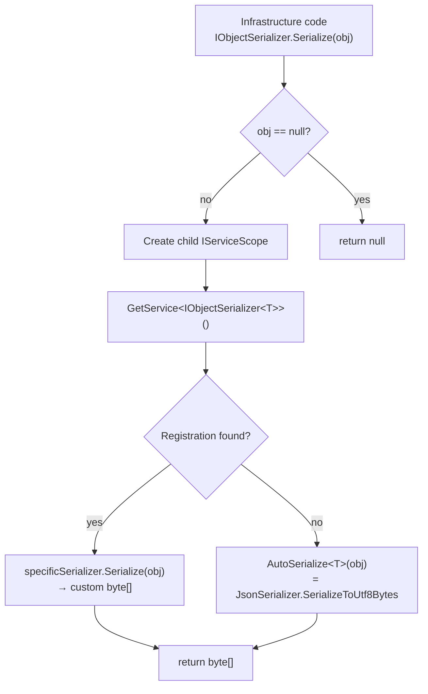
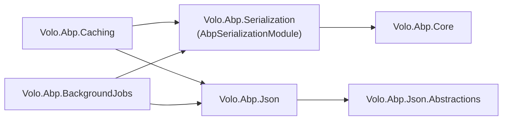

`Volo.Abp.Serialization` is the byte-oriented counterpart to the string-based `IJsonSerializer` covered in [Serialization overview](/serialization/overview). It exists for one purpose: produce and consume `byte[]` payloads in a way that lets infrastructure code — distributed caches, message buses, background-job stores — round-trip arbitrary CLR objects without each subsystem hand-rolling its own format. The package is intentionally tiny: a single open-generic interface, a closed marker interface, one default implementation, and one bootstrap module. There is no built-in `BinaryFormatter`-based serializer (and there should not be — `BinaryFormatter` is obsolete in modern .NET); the default falls back to UTF-8 JSON over `System.Text.Json`, and per-type overrides plug in through `IObjectSerializer<T>`.

This page walks through the four types in the package, the conventional registration trick that exposes `IObjectSerializer<T>` automatically, and the patterns for replacing the default with a custom format (MessagePack, Protobuf, raw `Span<byte>` formats, etc.). For the string-oriented sibling that handles HTTP payloads and DTO round-tripping, see [Serialization overview](/serialization/overview); for the largest in-tree consumer see [Distributed cache](/caching/distributed-cache).

## Package layout

| File | Type | Role |
| --- | --- | --- |
| `Volo.Abp.Serialization/Volo/Abp/Serialization/AbpSerializationModule.cs` | `AbpModule` | Hooks into `OnExposing` so that any class implementing `IObjectSerializer<T>` exposes that closed-generic service automatically. |
| `Volo.Abp.Serialization/Volo/Abp/Serialization/IObjectSerializer.cs` | Interface | Two abstractions: the closed `IObjectSerializer` for the dispatcher and the open `IObjectSerializer<T>` for per-type overrides. |
| `Volo.Abp.Serialization/Volo/Abp/Serialization/DefaultObjectSerializer.cs` | `IObjectSerializer` | Default dispatcher: prefer a registered `IObjectSerializer<T>`, fall back to `JsonSerializer.SerializeToUtf8Bytes`. |
| `Volo.Abp.Serialization/Volo.Abp.Serialization.csproj` | Project | Targets `netstandard2.0`, `netstandard2.1`, `net8.0`; depends only on `Volo.Abp.Core`. |

The package's only project reference is `Volo.Abp.Core` — by design, the abstraction is *below* the JSON layer and can be referenced by modules that must not transitively pull in `System.Text.Json` configuration (`Volo.Abp.BackgroundJobs`, for example, uses both pieces independently).

## The two interfaces

```csharp title="framework/src/Volo.Abp.Serialization/Volo/Abp/Serialization/IObjectSerializer.cs"
public interface IObjectSerializer
{
    byte[]? Serialize<T>(T? obj);

    T? Deserialize<T>(byte[] bytes);
}

public interface IObjectSerializer<T>
{
    byte[]? Serialize(T? obj);

    T? Deserialize(byte[]? bytes);
}
```

Two interfaces, two roles:

- `IObjectSerializer` is the **dispatcher** that application and framework code injects. It picks the right strategy per call based on `T`.
- `IObjectSerializer<T>` is the **per-type override**. Implementing it for a specific `T` is enough to make every `IObjectSerializer.Serialize<T>(...)` call defer to your implementation — no registration code required.

Both methods are nullable-friendly: `Serialize` returns `null` for a `null` input, and `Deserialize` returns `default(T)` for a `null` byte array.

## `AbpSerializationModule`

The module's only job is to teach ABP's conventional registration that an `IObjectSerializer<T>` implementation should be registered against its closed-generic interface, not just against its own type. Without this hook, a class that implemented `IObjectSerializer<MyDto>` would not be discoverable through `IServiceProvider.GetService<IObjectSerializer<MyDto>>()`.

```csharp title="framework/src/Volo.Abp.Serialization/Volo/Abp/Serialization/AbpSerializationModule.cs"
public class AbpSerializationModule : AbpModule
{
    public override void PreConfigureServices(ServiceConfigurationContext context)
    {
        context.Services.OnExposing(onServiceExposingContext =>
        {
            //Register types for IObjectSerializer<T> if implements
            onServiceExposingContext.ExposedTypes.AddRange(
                ReflectionHelper.GetImplementedGenericTypes(
                    onServiceExposingContext.ImplementationType,
                    typeof(IObjectSerializer<>)
                )
            );
        });
    }
}
```

`OnExposing` is the convention-registration hook covered in [Exposed services](/di/exposed-services). When ABP scans a class for the services it should be registered as, it now also pulls every closed `IObjectSerializer<T>` that the class implements. Combined with `ITransientDependency` (or `IScopedDependency` / `ISingletonDependency`) on the implementation, a single class definition is enough:

```csharp
public class JpegPhotoSerializer
    : IObjectSerializer<Photo>, ITransientDependency
{
    public byte[]? Serialize(Photo? obj)        => obj is null ? null : JpegEncode(obj);
    public Photo?  Deserialize(byte[]? bytes)   => bytes is null ? null : JpegDecode(bytes);
}
```

After this class is in the application, any call of the form `objectSerializer.Serialize(somePhoto)` flows through your JPEG codec rather than the JSON fallback.

The module performs no other work — there is no options object, no global registry, no `OnApplicationInitialization` hook. Discovery is entirely driven by the type system.

## `DefaultObjectSerializer`

`DefaultObjectSerializer` is the concrete `IObjectSerializer` registered out of the box. It is transient, takes `IServiceProvider` directly (so that it can create per-call scopes for typed serializer lookups), and falls back to `System.Text.Json` for any `T` that has no typed serializer registered:

```csharp title="framework/src/Volo.Abp.Serialization/Volo/Abp/Serialization/DefaultObjectSerializer.cs"
public class DefaultObjectSerializer : IObjectSerializer, ITransientDependency
{
    private readonly IServiceProvider _serviceProvider;

    public DefaultObjectSerializer(IServiceProvider serviceProvider)
    {
        _serviceProvider = serviceProvider;
    }

    public virtual byte[]? Serialize<T>(T? obj)
    {
        if (obj == null)
        {
            return null;
        }

        //Check if a specific serializer is registered
        using (var scope = _serviceProvider.CreateScope())
        {
            var specificSerializer = scope.ServiceProvider.GetService<IObjectSerializer<T>>();
            if (specificSerializer != null)
            {
                return specificSerializer.Serialize(obj);
            }
        }

        return AutoSerialize(obj);
    }

    public virtual T? Deserialize<T>(byte[]? bytes)
    {
        if (bytes == null)
        {
            return default;
        }

        //Check if a specific serializer is registered
        using (var scope = _serviceProvider.CreateScope())
        {
            var specificSerializer = scope.ServiceProvider.GetService<IObjectSerializer<T>>();
            if (specificSerializer != null)
            {
                return specificSerializer.Deserialize(bytes);
            }
        }

        return AutoDeserialize<T>(bytes);
    }

    protected virtual byte[] AutoSerialize<T>(T obj)
    {
        return JsonSerializer.SerializeToUtf8Bytes(obj);
    }

    protected virtual T? AutoDeserialize<T>(byte[] bytes)
    {
        return JsonSerializer.Deserialize<T>(bytes);
    }
}
```

A few details worth pointing out:

- **Per-call scope.** Every `Serialize`/`Deserialize` call creates a child scope to look up `IObjectSerializer<T>`. This protects scoped per-tenant overrides (the typed serializer can depend on `ICurrentTenant`, `ICurrentUser`, etc.) without leaking those scopes back to the caller.
- **No JSON serializer indirection.** The `AutoSerialize` fallback uses `System.Text.Json` *directly*, not the configured `IJsonSerializer`. This is deliberate: `IObjectSerializer` is meant to be a low-level, infrastructure-only primitive — most callers want `IObjectSerializer<T>` overrides to make their format choice explicit, and the bytes-on-bytes default should not surprise anyone with `AbpJsonOptions` date-time rules.
- **`AutoSerialize`/`AutoDeserialize` are virtual.** The recommended pattern for swapping the fallback format wholesale (for example, to MessagePack) is to subclass `DefaultObjectSerializer` and override these two methods. See *Replacing the default* below.

<Warning>
Because `AutoSerialize` uses raw `System.Text.Json` without ABP's customizations, payloads produced by the fallback path will **not** honor `AbpJsonOptions.OutputDateTimeFormat`, will **not** route through the clock-aware `AbpDateTimeConverter`, and will **not** participate in the `JsonTypeInfo` modifier pipeline described in [System.Text.Json](/serialization/json-system-text). If you need that pipeline for distributed-cache values, use the `IJsonSerializer` path (which is what `Volo.Abp.Caching/Utf8JsonDistributedCacheSerializer` actually does) or register an `IObjectSerializer<T>` that delegates to `IJsonSerializer`.
</Warning>

## End-to-end dispatch flow



The deserialize path is the mirror image; nullability is reversed so an explicit `null`/empty buffer returns `default(T)`.

## When to register `IObjectSerializer<T>`

The typed interface should be used whenever the wire format of a specific type *must* differ from the default JSON dump. Recurring scenarios in ABP applications:

| Scenario | Why a typed serializer helps |
| --- | --- |
| Cache items containing third-party classes that are not annotated for JSON | Avoid JSON-specific exceptions and the cost of reflecting over irrelevant properties. |
| Binary blobs (PDF, image, encrypted bytes) wrapped in a DTO | The DTO already *is* the byte payload — pass it through with zero conversion. |
| Wire-compatible IPC with a non-.NET service | Speak MessagePack or Protobuf for one specific message type while keeping JSON everywhere else. |
| Cryptographic envelopes | Sign or encrypt the payload after format conversion without touching the rest of the cache. |

Once the typed implementation is in DI, every framework component that uses `IObjectSerializer` — including the distributed-cache code path documented in [Distributed cache](/caching/distributed-cache) — will pick it up automatically.

```csharp
public class MessagePackBackgroundJobSerializer<TArgs>
    : IObjectSerializer<TArgs>, ITransientDependency
{
    public byte[]? Serialize(TArgs? obj)
        => obj is null ? null : MessagePackSerializer.Serialize(obj);

    public TArgs? Deserialize(byte[]? bytes)
        => bytes is null ? default : MessagePackSerializer.Deserialize<TArgs>(bytes);
}
```

<Note>
Generic implementations such as `MessagePackBackgroundJobSerializer<TArgs>` are picked up by the same `OnExposing` mechanism — `ReflectionHelper.GetImplementedGenericTypes` recognises that the open generic implements `IObjectSerializer<>` for any closed `TArgs`.
</Note>

## Replacing the default dispatcher

The default registration is `[DefaultObjectSerializer : IObjectSerializer, ITransientDependency]`. To swap it for a custom dispatcher, ABP's standard `[Dependency(ReplaceServices = true)]` attribute is the supported route — see [Conventional registration](/di/conventional-registration):

```csharp
[Dependency(ReplaceServices = true)]
public class MessagePackObjectSerializer : DefaultObjectSerializer
{
    public MessagePackObjectSerializer(IServiceProvider serviceProvider)
        : base(serviceProvider)
    {
    }

    protected override byte[] AutoSerialize<T>(T obj)
        => MessagePackSerializer.Serialize(obj);

    protected override T? AutoDeserialize<T>(byte[] bytes)
        => MessagePackSerializer.Deserialize<T>(bytes);
}
```

Because the typed-serializer lookup remains untouched, you can still register per-type overrides for the corner cases — for example, a `IObjectSerializer<Photo>` that keeps raw JPEG bytes — even after replacing the default.

## Why no `BinaryFormatter`?

The page title mentions "binary" because callers think of `byte[]` as a binary payload — but the framework deliberately does **not** ship a `BinaryFormatter`-based default.

<CardGroup cols={2}>
<Card title="`BinaryFormatter` is deprecated" icon="triangle-exclamation">
.NET 5+ marked `BinaryFormatter` as obsolete and dangerous for security reasons. ABP targets `netstandard2.0`, `netstandard2.1`, and `net8.0`, so a default backed by `BinaryFormatter` would emit obsoletion warnings (or refuse to run) on modern hosts.
</Card>
<Card title="UTF-8 JSON is the safe default" icon="shield">
JSON over UTF-8 is fast, deterministic, debuggable, and round-trip-safe for the DTO shapes that ABP modules use. When you need a real binary format, register an `IObjectSerializer<T>` and pick one that matches your wire (MessagePack, Protobuf, CBOR).
</Card>
</CardGroup>

If your application has a legacy hot path that genuinely needs `BinaryFormatter` semantics, wrap it behind an explicit `IObjectSerializer<T>` so the deprecated codec is contained to the one type that needs it — do not subclass `DefaultObjectSerializer` to make every type pay the cost.

## Comparison to `IJsonSerializer`

| Aspect | `IJsonSerializer` | `IObjectSerializer` |
| --- | --- | --- |
| Payload | `string` (UTF-16 in memory) | `byte[]` (UTF-8 or arbitrary) |
| Default implementation | `AbpSystemTextJsonSerializer` (configurable via `AbpSystemTextJsonSerializerOptions`) | `DefaultObjectSerializer` (forwards to raw `System.Text.Json`) |
| Per-call options | `camelCase`, `indented` | None — formatting is owned by the chosen serializer |
| Per-type override | One global pipeline, modifier-based | Explicit `IObjectSerializer<T>` registration |
| Typical callers | Application services, HTTP proxies, content formatters | Distributed cache (`Utf8JsonDistributedCacheSerializer`), background-job payload stores |
| Date normalization | Through `AbpDateTimeConverter` and `AbpJsonOptions` | Whatever the chosen serializer does — not bridged by default |

The two pipelines coexist because their consumers differ. HTTP-layer code that emits a JSON body always picks `IJsonSerializer` (it wants the configured ABP semantics); infrastructure code that stuffs an opaque payload into a binary slot picks `IObjectSerializer` (it wants `byte[]` and a per-type override hook).

## Module dependency picture



Note the absence of a `Serialization → Json` edge: the two layers are siblings. They depend on `Volo.Abp.Core` only, and the consumers (`Caching`, `BackgroundJobs`) wire them together at the type level rather than at the module level.

## Custom typed serializer recipe

A worked example: ship a `PhotoCacheItem` through the distributed cache as raw JPEG bytes rather than as a JSON-wrapped base64 string.

```csharp
public class PhotoCacheItem
{
    public byte[] JpegBytes { get; init; } = Array.Empty<byte>();
    public int Width  { get; init; }
    public int Height { get; init; }
}

public class PhotoCacheItemSerializer
    : IObjectSerializer<PhotoCacheItem>, ITransientDependency
{
    public byte[]? Serialize(PhotoCacheItem? obj)
    {
        if (obj is null)
        {
            return null;
        }

        // 4 bytes width, 4 bytes height, then raw JPEG payload.
        var bytes = new byte[8 + obj.JpegBytes.Length];
        BinaryPrimitives.WriteInt32LittleEndian(bytes.AsSpan(0, 4), obj.Width);
        BinaryPrimitives.WriteInt32LittleEndian(bytes.AsSpan(4, 4), obj.Height);
        obj.JpegBytes.CopyTo(bytes, 8);
        return bytes;
    }

    public PhotoCacheItem? Deserialize(byte[]? bytes)
    {
        if (bytes is null || bytes.Length < 8)
        {
            return null;
        }

        var width  = BinaryPrimitives.ReadInt32LittleEndian(bytes.AsSpan(0, 4));
        var height = BinaryPrimitives.ReadInt32LittleEndian(bytes.AsSpan(4, 4));
        var jpeg   = bytes.AsSpan(8).ToArray();

        return new PhotoCacheItem
        {
            JpegBytes = jpeg,
            Width  = width,
            Height = height
        };
    }
}
```

With this class in the application, the distributed cache writes a compact binary frame instead of a JSON object — and reads it back into the same DTO without the caching code needing to know any of these details. The cache configuration itself (covered in [Distributed cache](/caching/distributed-cache)) is unchanged.

## Testing typed serializers

Because typed serializers are plain DI components, the standard ABP integration-test base classes work without further setup. Add `AbpSerializationModule` to your test module, register your serializer, and resolve `IObjectSerializer` from the container:

```csharp
[DependsOn(typeof(AbpAutofacModule), typeof(AbpSerializationModule), typeof(AbpTestBaseModule))]
public class PhotoSerializationTestModule : AbpModule
{
}

public class PhotoCacheItemSerializer_Tests : AbpIntegratedTest<PhotoSerializationTestModule>
{
    [Fact]
    public void RoundTrip_Should_Preserve_Width_Height_And_Bytes()
    {
        var serializer = GetRequiredService<IObjectSerializer>();
        var item = new PhotoCacheItem
        {
            JpegBytes = new byte[] { 0xFF, 0xD8, 0xFF, 0xE0 },
            Width = 640,
            Height = 480
        };

        var bytes = serializer.Serialize(item);
        bytes.ShouldNotBeNull();

        var back = serializer.Deserialize<PhotoCacheItem>(bytes!);
        back.ShouldNotBeNull();
        back!.Width.ShouldBe(640);
        back.Height.ShouldBe(480);
        back.JpegBytes.ShouldBe(new byte[] { 0xFF, 0xD8, 0xFF, 0xE0 });
    }
}
```

The test asserts the dispatcher actually picked your typed serializer; if it accidentally falls back to the JSON path, you would get a JSON object back rather than the 8-byte-prefixed binary payload, and the byte-equality assertion would fail loudly.

## Related pages

- [Serialization overview](/serialization/overview) — `IJsonSerializer` and the string-payload sibling.
- [System.Text.Json](/serialization/json-system-text) — the default JSON back-end used by the dispatcher's fallback.
- [Newtonsoft.Json](/serialization/json-newtonsoft) — alternative JSON back-end for `IJsonSerializer` (does not affect `IObjectSerializer`).
- [Caching overview](/caching/overview) and [Distributed cache](/caching/distributed-cache) — the largest in-tree consumer.
- [Exposed services](/di/exposed-services) — the `OnExposing` mechanism this module relies on.
- [Conventional registration](/di/conventional-registration) — how `[Dependency(ReplaceServices = true)]` swaps the default dispatcher.
