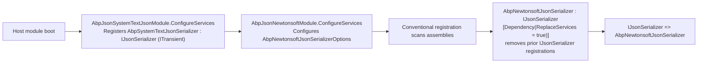
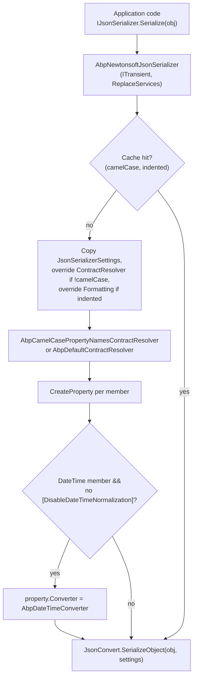

`Volo.Abp.Json.Newtonsoft` is the optional drop-in for hosts that need Newtonsoft.Json semantics — typically because they share DTOs with legacy modules, depend on `TypeNameHandling`, or use third-party libraries that emit `[JsonProperty]` attributes from `Newtonsoft.Json`. The package re-implements the same `IJsonSerializer` contract on top of `JsonConvert.SerializeObject`/`DeserializeObject`, attaches a clock-aware `AbpDateTimeConverter`, and registers itself with `[Dependency(ReplaceServices = true)]` so that referencing the module is the only step required to make the swap effective framework-wide.

This page covers the four classes that make up the module — `AbpJsonNewtonsoftModule`, `AbpNewtonsoftJsonSerializer`, `AbpNewtonsoftJsonSerializerOptions`, and the two contract resolvers — plus the converter. For the parent abstractions and the alternative back-end see [Serialization overview](/serialization/overview) and [System.Text.Json](/serialization/json-system-text).

## Package layout

| File | Type | Role |
| --- | --- | --- |
| `AbpJsonNewtonsoftModule.cs` | `AbpModule` | Depends on `AbpJsonAbstractionsModule` and `AbpTimingModule`; wires the camel-case contract resolver. |
| `AbpNewtonsoftJsonSerializer.cs` | `IJsonSerializer` | `[Dependency(ReplaceServices = true)]` implementation that replaces `AbpSystemTextJsonSerializer`. |
| `AbpNewtonsoftJsonSerializerOptions.cs` | Options | Holds the `JsonSerializerSettings` template applied on every call. |
| `AbpDateTimeConverter.cs` | `DateTimeConverterBase` | Clock-aware `DateTime` converter that honors `AbpJsonOptions`. |
| `AbpCamelCasePropertyNamesContractResolver.cs` | Contract resolver | Default resolver — camel-case names and the date converter on every `DateTime` member. |
| `AbpDefaultContractResolver.cs` | Contract resolver | Pascal-case resolver used when the caller opts out of camel-case. |

The package targets `netstandard2.0`, `netstandard2.1`, and `net8.0`, and lists a single external NuGet dependency — `Newtonsoft.Json`.

## `AbpJsonNewtonsoftModule`

The module performs all of its work inside an `AddOptions<...>.Configure<IServiceProvider>` callback. The captured root service provider is used to resolve `AbpDateTimeConverter` when the contract resolver is constructed — `AbpDateTimeConverter` carries `ITransientDependency` and depends on `IClock`, so it cannot simply be `new`'d:

```csharp title="framework/src/Volo.Abp.Json.Newtonsoft/Volo/Abp/Json/Newtonsoft/AbpJsonNewtonsoftModule.cs"
[DependsOn(typeof(AbpJsonAbstractionsModule), typeof(AbpTimingModule))]
public class AbpJsonNewtonsoftModule : AbpModule
{
    public override void ConfigureServices(ServiceConfigurationContext context)
    {
        context.Services.AddOptions<AbpNewtonsoftJsonSerializerOptions>()
            .Configure<IServiceProvider>((options, rootServiceProvider) =>
            {
                options.JsonSerializerSettings.ContractResolver = new AbpCamelCasePropertyNamesContractResolver(
                    rootServiceProvider.GetRequiredService<AbpDateTimeConverter>());
            });
    }
}
```

Notice that the module does **not** register any custom converters on the settings object — the date converter is attached lazily by the contract resolver on a per-property basis (so that `[DisableDateTimeNormalization]` can opt individual members out), and there is no Newtonsoft equivalent of System.Text.Json's `AbpStringToBooleanConverter` / `AbpStringToGuidConverter` because Newtonsoft already accepts those token shapes by default.

The module's dependency on `AbpTimingModule` is what brings `IClock` into the container — see [Threading & Timing](/concurrency/timing-and-clock) — and through it the `DateTimeKind` that the converter normalizes against.

## `AbpNewtonsoftJsonSerializerOptions`

Like its System.Text.Json sibling, the options object owns the underlying settings template. Newtonsoft's default `JsonSerializerSettings` is intentionally pristine, leaving the contract resolver as the only ABP-applied default after the module runs:

```csharp title="framework/src/Volo.Abp.Json.Newtonsoft/Volo/Abp/Json/Newtonsoft/AbpNewtonsoftJsonSerializerOptions.cs"
public class AbpNewtonsoftJsonSerializerOptions
{
    public JsonSerializerSettings JsonSerializerSettings { get; }

    public AbpNewtonsoftJsonSerializerOptions()
    {
        JsonSerializerSettings = new JsonSerializerSettings();
    }
}
```

To customize anything Newtonsoft-specific — `TypeNameHandling`, `MissingMemberHandling`, additional `JsonConverter`s — configure it the standard way:

```csharp
Configure<AbpNewtonsoftJsonSerializerOptions>(options =>
{
    options.JsonSerializerSettings.TypeNameHandling = TypeNameHandling.Auto;
    options.JsonSerializerSettings.Converters.Add(new StringEnumConverter());
});
```

## `AbpNewtonsoftJsonSerializer`

The serializer reflects the System.Text.Json shape closely: a per-call `JsonSerializerSettings` is constructed by copying every field from the configured template, then layering in the requested `camelCase` and `indented` overrides. The result is cached in a static `ConcurrentDictionary` keyed by the `(camelCase, indented)` tuple so subsequent calls reuse the same settings object:

```csharp title="framework/src/Volo.Abp.Json.Newtonsoft/Volo/Abp/Json/Newtonsoft/AbpNewtonsoftJsonSerializer.cs"
[Dependency(ReplaceServices = true)]
public class AbpNewtonsoftJsonSerializer : IJsonSerializer, ITransientDependency
{
    protected IRootServiceProvider RootServiceProvider { get; }
    protected IOptions<AbpNewtonsoftJsonSerializerOptions> Options { get; }

    public AbpNewtonsoftJsonSerializer(
        IRootServiceProvider rootServiceProvider,
        IOptions<AbpNewtonsoftJsonSerializerOptions> options)
    {
        RootServiceProvider = rootServiceProvider;
        Options = options;
    }

    public string Serialize(object obj, bool camelCase = true, bool indented = false)
    {
        return JsonConvert.SerializeObject(obj, CreateJsonSerializerOptions(camelCase, indented));
    }

    public T Deserialize<T>(string jsonString, bool camelCase = true)
    {
        return JsonConvert.DeserializeObject<T>(jsonString, CreateJsonSerializerOptions(camelCase))!;
    }

    public object Deserialize(Type type, string jsonString, bool camelCase = true)
    {
        return JsonConvert.DeserializeObject(jsonString, type, CreateJsonSerializerOptions(camelCase))!;
    }

    private readonly static ConcurrentDictionary<object, JsonSerializerSettings> JsonSerializerOptionsCache =
        new ConcurrentDictionary<object, JsonSerializerSettings>();
    // ...
}
```

The `CreateJsonSerializerOptions` body is verbose because Newtonsoft offers no copy constructor for `JsonSerializerSettings`; the implementation explicitly copies every public property from the template:

```csharp
protected virtual JsonSerializerSettings CreateJsonSerializerOptions(bool camelCase = true, bool indented = false)
{
    return JsonSerializerOptionsCache.GetOrAdd(new { camelCase, indented }, _ =>
    {
        var settings = new JsonSerializerSettings
        {
            Binder = Options.Value.JsonSerializerSettings.Binder,
            CheckAdditionalContent = Options.Value.JsonSerializerSettings.CheckAdditionalContent,
            Context = Options.Value.JsonSerializerSettings.Context,
            ContractResolver = Options.Value.JsonSerializerSettings.ContractResolver,
            ConstructorHandling = Options.Value.JsonSerializerSettings.ConstructorHandling,
            Converters = Options.Value.JsonSerializerSettings.Converters,
            Culture = Options.Value.JsonSerializerSettings.Culture,
            DateFormatHandling = Options.Value.JsonSerializerSettings.DateFormatHandling,
            DateFormatString = Options.Value.JsonSerializerSettings.DateFormatString,
            DateParseHandling = Options.Value.JsonSerializerSettings.DateParseHandling,
            DateTimeZoneHandling = Options.Value.JsonSerializerSettings.DateTimeZoneHandling,
            DefaultValueHandling = Options.Value.JsonSerializerSettings.DefaultValueHandling,
            Error = Options.Value.JsonSerializerSettings.Error,
            EqualityComparer = Options.Value.JsonSerializerSettings.EqualityComparer,
            FloatFormatHandling = Options.Value.JsonSerializerSettings.FloatFormatHandling,
            FloatParseHandling = Options.Value.JsonSerializerSettings.FloatParseHandling,
            Formatting = Options.Value.JsonSerializerSettings.Formatting,
            MaxDepth = Options.Value.JsonSerializerSettings.MaxDepth,
            // ... every remaining public property is copied verbatim ...
            TypeNameHandling = Options.Value.JsonSerializerSettings.TypeNameHandling,
            TypeNameAssemblyFormatHandling = Options.Value.JsonSerializerSettings.TypeNameAssemblyFormatHandling
        };

        if (!camelCase)
        {
            //Default contract resolver is AbpCamelCasePropertyNamesContractResolver
            settings.ContractResolver = new AbpDefaultContractResolver(
                RootServiceProvider.GetRequiredService<AbpDateTimeConverter>());
        }

        if (indented)
        {
            settings.Formatting = Formatting.Indented;
        }

        return settings;
    });
}
```

Two important consequences:

1. The cache is keyed only on `(camelCase, indented)`. If you mutate `Options.Value.JsonSerializerSettings` after the first call, the change is *not* visible to subsequent calls until you restart the process or clear the cache. Configure the settings inside `ConfigureServices` and treat them as immutable afterwards.
2. `IRootServiceProvider` is captured for the lifetime of the serializer — the date converter is resolved only when the resolver needs to be rebuilt for the non-camel-case path. This is intentional: the typical hot path (camel-case, non-indented) reuses the resolver that the module installed up-front.

## `[Dependency(ReplaceServices = true)]`

The `Dependency` attribute is what makes the swap work. ABP's conventional registration — see [Conventional registration](/di/conventional-registration) — interprets `ReplaceServices = true` as "use this implementation for every service this class exposes". Because `AbpNewtonsoftJsonSerializer` exposes `IJsonSerializer` (via `ITransientDependency`), it replaces the System.Text.Json registration installed earlier in the boot sequence.



If both modules are referenced, Newtonsoft wins. If you want the System.Text.Json default *and* keep a per-call Newtonsoft escape hatch, resolve `AbpNewtonsoftJsonSerializer` by its concrete type — both serializers are registered as themselves in addition to the interface.

## `AbpDateTimeConverter`

The Newtonsoft date converter inherits from `DateTimeConverterBase` and applies the same `AbpJsonOptions` contract as its System.Text.Json sibling — try each `InputDateTimeFormats` entry on the way in, format with `OutputDateTimeFormat` on the way out, and always pass values through `IClock.Normalize`:

```csharp title="framework/src/Volo.Abp.Json.Newtonsoft/Volo/Abp/Json/Newtonsoft/AbpDateTimeConverter.cs"
public class AbpDateTimeConverter : DateTimeConverterBase, ITransientDependency
{
    private const string DefaultDateTimeFormat = "yyyy'-'MM'-'dd'T'HH':'mm':'ss.FFFFFFFK";
    private readonly DateTimeStyles _dateTimeStyles = DateTimeStyles.RoundtripKind;
    private readonly CultureInfo _culture = CultureInfo.InvariantCulture;
    private readonly IClock _clock;
    private readonly AbpJsonOptions _options;

    public AbpDateTimeConverter(IClock clock, IOptions<AbpJsonOptions> options)
    {
        _clock = clock;
        _options = options.Value;
    }

    public override bool CanConvert(Type objectType)
    {
        return objectType == typeof(DateTime) || objectType == typeof(DateTime?);
    }
    // ...
}
```

`DefaultDateTimeFormat` — the ISO-8601 round-trip format — is the fallback used when `AbpJsonOptions.OutputDateTimeFormat` is null or whitespace.

### Read path

```csharp
public override object? ReadJson(JsonReader reader, Type objectType, object? existingValue, JsonSerializer serializer)
{
    var nullable = Nullable.GetUnderlyingType(objectType) != null;
    if (reader.TokenType == JsonToken.Null)
    {
        if (!nullable)
        {
            throw new JsonSerializationException($"Cannot convert null value to {objectType.FullName}.");
        }

        return null;
    }

    if (reader.TokenType == JsonToken.Date)
    {
        return _clock.Normalize(reader.Value!.To<DateTime>());
    }

    if (reader.TokenType != JsonToken.String)
    {
        throw new JsonSerializationException($"Unexpected token parsing date. Expected String, got {reader.TokenType}.");
    }

    var dateText = reader.Value?.ToString();

    if (dateText.IsNullOrEmpty() && nullable)
    {
        return null;
    }

    if (_options.InputDateTimeFormats.Any())
    {
        foreach (var format in _options.InputDateTimeFormats)
        {
            if (DateTime.TryParseExact(dateText, format, _culture, _dateTimeStyles, out var d1))
            {
                return _clock.Normalize(d1);
            }
        }
    }

    var date = DateTime.Parse(dateText!, _culture, _dateTimeStyles);
    return _clock.Normalize(date);
}
```

Two subtleties worth flagging:

- An empty string maps to `null` only on the nullable path — a non-nullable `DateTime` member that arrives with `""` will throw inside `DateTime.Parse`.
- `DateTimeStyles.RoundtripKind` preserves the `Kind` flag from the input; `IClock.Normalize` then aligns it with the configured `AbpClockOptions.Kind`.

### Write path

```csharp
public override void WriteJson(JsonWriter writer, object? value, JsonSerializer serializer)
{
    if (value != null)
    {
        value = _clock.Normalize(value.To<DateTime>());
    }

    if (value is DateTime dateTime)
    {
        if ((_dateTimeStyles & DateTimeStyles.AdjustToUniversal) == DateTimeStyles.AdjustToUniversal ||
            (_dateTimeStyles & DateTimeStyles.AssumeUniversal) == DateTimeStyles.AssumeUniversal)
        {
            dateTime = dateTime.ToUniversalTime();
        }

        writer.WriteValue(_options.OutputDateTimeFormat.IsNullOrWhiteSpace()
            ? dateTime.ToString(DefaultDateTimeFormat, _culture)
            : dateTime.ToString(_options.OutputDateTimeFormat, _culture));
    }
    else
    {
        throw new JsonSerializationException(
            $"Unexpected value when converting date. Expected DateTime or DateTimeOffset, got {value?.GetType()}.");
    }
}
```

### Opt-out hook

The same `[DisableDateTimeNormalization]` attribute described in the [Serialization overview](/serialization/overview) controls whether a property gets the converter at all. The decision is made by the contract resolver via:

```csharp
static internal bool ShouldNormalize(MemberInfo member, JsonProperty property)
{
    if (property.PropertyType != typeof(DateTime) &&
        property.PropertyType != typeof(DateTime?))
    {
        return false;
    }

    return ReflectionHelper
        .GetSingleAttributeOfMemberOrDeclaringTypeOrDefault<DisableDateTimeNormalizationAttribute>(member) == null;
}
```

`ReflectionHelper.GetSingleAttributeOfMemberOrDeclaringTypeOrDefault` walks the chain `[member] -> [member.DeclaringType]`, so the attribute can be placed at either level.

## Contract resolvers

Newtonsoft's `IContractResolver` is the per-type metadata seam. ABP ships two: a camel-case resolver (the default) and a Pascal-case fallback used when the caller passes `camelCase: false`.

### `AbpCamelCasePropertyNamesContractResolver`

```csharp title="framework/src/Volo.Abp.Json.Newtonsoft/Volo/Abp/Json/Newtonsoft/AbpCamelCasePropertyNamesContractResolver.cs"
public class AbpCamelCasePropertyNamesContractResolver : CamelCasePropertyNamesContractResolver
{
    private readonly AbpDateTimeConverter _dateTimeConverter;

    public AbpCamelCasePropertyNamesContractResolver(AbpDateTimeConverter dateTimeConverter)
    {
        _dateTimeConverter = dateTimeConverter;

        NamingStrategy = new CamelCaseNamingStrategy
        {
            ProcessDictionaryKeys = false
        };
    }

    protected override JsonProperty CreateProperty(MemberInfo member, MemberSerialization memberSerialization)
    {
        var property = base.CreateProperty(member, memberSerialization);

        if (AbpDateTimeConverter.ShouldNormalize(member, property))
        {
            property.Converter = _dateTimeConverter;
        }

        return property;
    }
}
```

Two notable settings:

- `ProcessDictionaryKeys = false` keeps `Dictionary<string, T>` keys as-is (important for `ExtraProperties`, OpenIddict properties, and any cache key that needs deterministic round-tripping).
- The base type, `CamelCasePropertyNamesContractResolver`, applies `CamelCaseNamingStrategy` to property names.

### `AbpDefaultContractResolver`

```csharp title="framework/src/Volo.Abp.Json.Newtonsoft/Volo/Abp/Json/Newtonsoft/AbpDefaultContractResolver.cs"
public class AbpDefaultContractResolver : DefaultContractResolver
{
    private readonly AbpDateTimeConverter _dateTimeConverter;

    public AbpDefaultContractResolver(AbpDateTimeConverter dateTimeConverter)
    {
        _dateTimeConverter = dateTimeConverter;
    }

    protected override JsonProperty CreateProperty(MemberInfo member, MemberSerialization memberSerialization)
    {
        var property = base.CreateProperty(member, memberSerialization);

        if (AbpDateTimeConverter.ShouldNormalize(member, property))
        {
            property.Converter = _dateTimeConverter;
        }

        return property;
    }
}
```

`AbpDefaultContractResolver` leaves property names untouched (`DefaultContractResolver` does no naming-strategy work by default) but otherwise behaves identically to its camel-case sibling. It is instantiated lazily inside `AbpNewtonsoftJsonSerializer.CreateJsonSerializerOptions` whenever a caller passes `camelCase: false`.

## End-to-end picture



Once cached, every subsequent call for the same `(camelCase, indented)` pair hits the right-hand branch only — the contract resolver and its property metadata are reused.

## Migration notes

<Note>
If you are switching from the System.Text.Json default *after* an application has been running, remember that cached JSON in distributed caches and persisted background jobs may have been produced under different rules. Newtonsoft's defaults for `null` handling and numeric serialization are not identical to System.Text.Json — review `Volo.Abp.Caching` cache items and `Volo.Abp.BackgroundJobs` argument types before flipping the switch.
</Note>

The minimum host change to adopt the Newtonsoft back-end is a single `[DependsOn]` entry:

```csharp
[DependsOn(
    typeof(AbpJsonNewtonsoftModule),
    /* the rest of your module list */
)]
public class MyHostModule : AbpModule
{
}
```

You do *not* need to remove `AbpJsonModule` from your dependency chain — it will still pull in `AbpJsonSystemTextJsonModule`, but the conventional `ReplaceServices` flag wins at registration time.

## Differences from the System.Text.Json back-end

| Aspect | System.Text.Json | Newtonsoft.Json |
| --- | --- | --- |
| Module bootstrap path | Pre-registered converters + `JsonTypeInfo` modifier | Camel-case contract resolver installed on `JsonSerializerSettings` |
| String-to-boolean / Guid converters | Shipped (`AbpStringToBooleanConverter`, `AbpStringToGuidConverter`) | Not needed — Newtonsoft already accepts those token shapes |
| Enum write format | Integer (via inner `JsonStringEnumConverter`) | Integer by default; add `StringEnumConverter` for names |
| Object property type inference | `ObjectToInferredTypesConverter` | Newtonsoft already infers `long`/`double`/`string`/`DateTime` natively |
| ExtraProperties support | `AbpIncludeExtraPropertiesModifiers` | Built-in (Newtonsoft can deserialize into read-only collection properties when the value already exists) |
| Encoder customization | `JavaScriptEncoder.UnsafeRelaxedJsonEscaping` by default | Not applicable |
| Dependency on `AbpDataModule` | Required (for `IHasExtraProperties`) | Not required |

The behavior gap is small enough that switching back-ends is a config-time decision rather than a code-level migration for the vast majority of DTOs.

## Related pages

- [Serialization overview](/serialization/overview) — the `IJsonSerializer` contract.
- [System.Text.Json](/serialization/json-system-text) — the default back-end this module replaces.
- [Binary / object serialization](/serialization/binary-serialization) — `IObjectSerializer` for byte payloads.
- [Distributed cache](/caching/distributed-cache) and [Caching overview](/caching/overview) — caches that swap their wire format with this module.
- [Content formatters](/web/content-formatters) — how the ASP.NET Core MVC pipeline picks up Newtonsoft.
