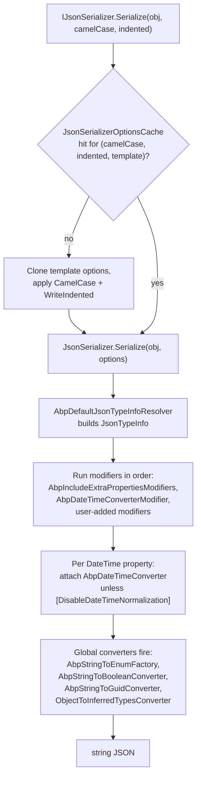

`Volo.Abp.Json.SystemTextJson` is the default back-end for `IJsonSerializer`. It wraps `System.Text.Json.JsonSerializer` with an ABP-flavored set of converters (string-to-boolean, string-to-enum, string-to-Guid, object-to-inferred-types) and adds a `JsonTypeInfo` modifier pipeline that lets the framework attach the clock-aware `AbpDateTimeConverter` on a per-property basis without scanning attributes on every serialize call. The module also relaxes a couple of `JsonSerializerOptions` defaults — comments are skipped, trailing commas are accepted, and the `UnsafeRelaxedJsonEscaping` encoder is used so that non-ASCII characters in API responses are not escaped to `\u` sequences.

The whole package is small — eight types under `Volo.Abp.Json.SystemTextJson` and seven converters under `Volo.Abp.Json.SystemTextJson.JsonConverters`. This page walks through the module's wiring, the options object, the seven converters, and the four modifiers, and ends with a per-converter behavior table built from the in-tree tests. For the higher-level `IJsonSerializer` contract see [Serialization overview](/serialization/overview); for the optional drop-in replacement see [Newtonsoft.Json](/serialization/json-newtonsoft).

## Package layout

| File | Type | Role |
| --- | --- | --- |
| `AbpJsonSystemTextJsonModule.cs` | `AbpModule` | Registers options, default converters, and the `AbpDefaultJsonTypeInfoResolver`. |
| `AbpSystemTextJsonSerializer.cs` | `IJsonSerializer` | The actual `JsonSerializer.Serialize/Deserialize` wrapper. |
| `AbpSystemTextJsonSerializerOptions.cs` | Options | Holds the `JsonSerializerOptions` template applied on every call. |
| `AbpSystemTextJsonSerializerModifiersOptions.cs` | Options | List of `Action<JsonTypeInfo>` modifiers run by the resolver. |
| `AbpDefaultJsonTypeInfoResolver.cs` | Resolver | `DefaultJsonTypeInfoResolver` subclass that injects the modifiers. |
| `JsonConverters/AbpDateTimeConverter.cs` | `JsonConverter<DateTime>` | Clock-aware `DateTime` converter with `AbpJsonOptions` formats. |
| `JsonConverters/AbpNullableDateTimeConverter.cs` | `JsonConverter<DateTime?>` | Nullable sibling of `AbpDateTimeConverter`. |
| `JsonConverters/AbpStringToEnumFactory.cs` | `JsonConverterFactory` | Builds `AbpStringToEnumConverter<T>` instances on demand. |
| `JsonConverters/AbpStringToEnumConverter.cs` | `JsonConverter<T>` | Reads enums by name or number, writes the integer value. |
| `JsonConverters/AbpStringToBooleanConverter.cs` | `JsonConverter<bool>` | Parses `"true"`/`"false"` strings into `bool`. |
| `JsonConverters/AbpStringToGuidConverter.cs` | `JsonConverter<Guid>` | Parses Guid strings in `N`/`D`/`B`/`P`/`X` formats. |
| `JsonConverters/AbpNullableStringToGuidConverter.cs` | `JsonConverter<Guid?>` | Nullable sibling of `AbpStringToGuidConverter`. |
| `JsonConverters/ObjectToInferredTypesConverter.cs` | `JsonConverter<object>` | Reads `JsonElement`-like values into native CLR types. |
| `Modifiers/AbpDateTimeConverterModifier.cs` | Modifier | Attaches the clock-aware `DateTime` converters to properties. |
| `Modifiers/AbpIncludeExtraPropertiesModifiers.cs` | Modifier | Lets `IHasExtraProperties.ExtraProperties` round-trip even when the setter is non-public. |
| `Modifiers/AbpIncludeNonPublicPropertiesModifiers.cs` | Modifier | Generic helper that exposes a non-public setter for one property. |
| `Modifiers/AbpIgnorePropertiesModifiers.cs` | Modifier | Generic helper that drops a property from the serialized payload. |

## `AbpJsonSystemTextJsonModule`

The module performs all of its work inside two `AddOptions<...>.Configure<IServiceProvider>` callbacks. The root service provider is captured so that scoped services — most notably `AbpDateTimeConverter`, which depends on `IClock` — can be resolved when the type-info resolver fires:

```csharp title="framework/src/Volo.Abp.Json.SystemTextJson/Volo/Abp/Json/SystemTextJson/AbpJsonSystemTextJsonModule.cs"
[DependsOn(typeof(AbpJsonAbstractionsModule), typeof(AbpTimingModule), typeof(AbpDataModule))]
public class AbpJsonSystemTextJsonModule : AbpModule
{
    public override void ConfigureServices(ServiceConfigurationContext context)
    {
        context.Services.AddOptions<AbpSystemTextJsonSerializerOptions>()
            .Configure<IServiceProvider>((options, rootServiceProvider) =>
            {
                // If the user hasn't explicitly configured the encoder, use the less strict
                // encoder that does not encode all non-ASCII characters.
                options.JsonSerializerOptions.Encoder ??= JavaScriptEncoder.UnsafeRelaxedJsonEscaping;

                options.JsonSerializerOptions.Converters.Add(new AbpStringToEnumFactory());
                options.JsonSerializerOptions.Converters.Add(new AbpStringToBooleanConverter());
                options.JsonSerializerOptions.Converters.Add(new AbpStringToGuidConverter());
                options.JsonSerializerOptions.Converters.Add(new AbpNullableStringToGuidConverter());
                options.JsonSerializerOptions.Converters.Add(new ObjectToInferredTypesConverter());

                options.JsonSerializerOptions.TypeInfoResolver = new AbpDefaultJsonTypeInfoResolver(
                    rootServiceProvider.GetRequiredService<IOptions<AbpSystemTextJsonSerializerModifiersOptions>>());
            });

        context.Services.AddOptions<AbpSystemTextJsonSerializerModifiersOptions>()
            .Configure<IServiceProvider>((options, rootServiceProvider) =>
            {
                options.Modifiers.Add(
                    new AbpDateTimeConverterModifier().CreateModifyAction(rootServiceProvider));
            });
    }
}
```

Two things to notice:

1. `Encoder` uses null-coalescing assignment (`??=`), so a host that wants the strict default can set its own encoder before the ABP module runs without it being clobbered.
2. The `TypeInfoResolver` is set *unconditionally*. If you want to keep your own resolver, install it inside an additional `Configure<AbpSystemTextJsonSerializerOptions>` callback that runs after the module.

The module depends on `AbpDataModule` solely so that `AbpIncludeExtraPropertiesModifiers` (registered by the modifier options constructor — see below) can reference `IHasExtraProperties` and `ExtraPropertyDictionary`.

## `AbpSystemTextJsonSerializerOptions`

The options object owns a single `JsonSerializerOptions` template seeded with the `JsonSerializerDefaults.Web` profile, which already turns on case-insensitive property matching and camel-case naming. Two extra tweaks are applied:

```csharp title="framework/src/Volo.Abp.Json.SystemTextJson/Volo/Abp/Json/SystemTextJson/AbpSystemTextJsonSerializerOptions.cs"
public class AbpSystemTextJsonSerializerOptions
{
    public JsonSerializerOptions JsonSerializerOptions { get; }

    public AbpSystemTextJsonSerializerOptions()
    {
        JsonSerializerOptions = new JsonSerializerOptions(JsonSerializerDefaults.Web)
        {
            ReadCommentHandling = JsonCommentHandling.Skip,
            AllowTrailingCommas = true
        };
    }
}
```

You can mutate `JsonSerializerOptions` directly from your module:

```csharp
Configure<AbpSystemTextJsonSerializerOptions>(options =>
{
    options.JsonSerializerOptions.DefaultIgnoreCondition =
        JsonIgnoreCondition.WhenWritingNull;

    options.JsonSerializerOptions.Converters.Add(new MyCustomConverter());
});
```

Changes are visible to every subsequent `IJsonSerializer` call. They are *not* visible to ASP.NET Core's MVC pipeline unless you also configure `MvcJsonOptions` — see [Content formatters](/web/content-formatters) for how that is bridged.

## `AbpSystemTextJsonSerializer`

The serializer is a thin wrapper that builds a per-call `JsonSerializerOptions` from the configured template, layering in the requested `camelCase`/`indented` flags. To avoid allocating a new options instance per call (which would also invalidate the System.Text.Json metadata cache), the resulting options are memoized in a `ConcurrentDictionary` keyed by the tuple of inputs:

```csharp title="framework/src/Volo.Abp.Json.SystemTextJson/Volo/Abp/Json/SystemTextJson/AbpSystemTextJsonSerializer.cs"
public class AbpSystemTextJsonSerializer : IJsonSerializer, ITransientDependency
{
    protected AbpSystemTextJsonSerializerOptions Options { get; }

    public AbpSystemTextJsonSerializer(IOptions<AbpSystemTextJsonSerializerOptions> options)
    {
        Options = options.Value;
    }

    public string Serialize(object obj, bool camelCase = true, bool indented = false)
    {
        return JsonSerializer.Serialize(obj, CreateJsonSerializerOptions(camelCase, indented));
    }

    public T Deserialize<T>(string jsonString, bool camelCase = true)
    {
        return JsonSerializer.Deserialize<T>(jsonString, CreateJsonSerializerOptions(camelCase))!;
    }

    public object Deserialize(Type type, string jsonString, bool camelCase = true)
    {
        return JsonSerializer.Deserialize(jsonString, type, CreateJsonSerializerOptions(camelCase))!;
    }

    private static readonly ConcurrentDictionary<object, JsonSerializerOptions> JsonSerializerOptionsCache =
        new ConcurrentDictionary<object, JsonSerializerOptions>();

    protected virtual JsonSerializerOptions CreateJsonSerializerOptions(bool camelCase = true, bool indented = false)
    {
        return JsonSerializerOptionsCache.GetOrAdd(new
        {
            camelCase,
            indented,
            Options.JsonSerializerOptions
        }, _ =>
        {
            var settings = new JsonSerializerOptions(Options.JsonSerializerOptions);

            if (camelCase)
            {
                settings.PropertyNamingPolicy = JsonNamingPolicy.CamelCase;
            }

            if (indented)
            {
                settings.WriteIndented = true;
            }

            return settings;
        });
    }
}
```

The cache key includes the `JsonSerializerOptions` template instance itself, so mutating `Options.JsonSerializerOptions` *after* the first call invalidates the cache automatically (the new reference produces a new dictionary key).

<Warning>
If you replace `AbpSystemTextJsonSerializer` with your own subclass, do not forget that `JsonSerializerOptionsCache` is `static readonly` — it is shared across the whole process. Override `CreateJsonSerializerOptions` and use an instance field for the cache if you need per-tenant divergence.
</Warning>

## End-to-end Serialize flow



The resolver runs **once per CLR type** thanks to `JsonTypeInfo` caching inside `DefaultJsonTypeInfoResolver`, which means the modifier pipeline is amortized across every subsequent call for the same type.

## The modifier pipeline

ABP attaches custom behavior to specific property types without registering a global `JsonConverter` — instead it uses the `JsonTypeInfo` modifier extensibility introduced in .NET 7. `AbpDefaultJsonTypeInfoResolver` simply appends each configured modifier to the `Modifiers` list of `DefaultJsonTypeInfoResolver`:

```csharp title="framework/src/Volo.Abp.Json.SystemTextJson/Volo/Abp/Json/SystemTextJson/AbpDefaultJsonTypeInfoResolver.cs"
public class AbpDefaultJsonTypeInfoResolver : DefaultJsonTypeInfoResolver
{
    public AbpDefaultJsonTypeInfoResolver(IOptions<AbpSystemTextJsonSerializerModifiersOptions> options)
    {
        foreach (var modifier in options.Value.Modifiers)
        {
            Modifiers.Add(modifier);
        }
    }
}
```

The modifier options object pre-seeds itself with the extensible-object modifier, and the module adds the date-time modifier on top:

```csharp title="framework/src/Volo.Abp.Json.SystemTextJson/Volo/Abp/Json/SystemTextJson/AbpSystemTextJsonSerializerModifiersOptions.cs"
public class AbpSystemTextJsonSerializerModifiersOptions
{
    public List<Action<JsonTypeInfo>> Modifiers { get; }

    public AbpSystemTextJsonSerializerModifiersOptions()
    {
        Modifiers = new List<Action<JsonTypeInfo>>
        {
            AbpIncludeExtraPropertiesModifiers.Modify,
        };
    }
}
```

### `AbpDateTimeConverterModifier`

The date-time modifier walks every `DateTime`/`DateTime?` property of the incoming type and attaches the clock-aware converter resolved from DI — unless the property or its declaring type carries `[DisableDateTimeNormalization]`:

```csharp title="framework/src/Volo.Abp.Json.SystemTextJson/Volo/Abp/Json/SystemTextJson/Modifiers/AbpDateTimeConverterModifier.cs"
private void Modify(JsonTypeInfo jsonTypeInfo)
{
    if (ReflectionHelper.GetAttributesOfMemberOrDeclaringType<DisableDateTimeNormalizationAttribute>(jsonTypeInfo.Type).Any())
    {
        return;
    }

    foreach (var property in jsonTypeInfo.Properties
        .Where(x => x.PropertyType == typeof(DateTime) || x.PropertyType == typeof(DateTime?)))
    {
        if (property.AttributeProvider == null ||
            !property.AttributeProvider.GetCustomAttributes(typeof(DisableDateTimeNormalizationAttribute), false).Any())
        {
            property.CustomConverter = property.PropertyType == typeof(DateTime)
                ? _serviceProvider.GetRequiredService<AbpDateTimeConverter>()
                : _serviceProvider.GetRequiredService<AbpNullableDateTimeConverter>();
        }
    }
}
```

Because the converter is resolved from the root provider, every property gets the same instance — `AbpDateTimeConverter` is `ITransientDependency` but the resolver caches the resulting `JsonTypeInfo`, so the converter is reused for the lifetime of the type info.

### `AbpIncludeExtraPropertiesModifiers`

ABP's `ExtensibleObject` exposes `ExtraProperties` as a read-only property (no public setter). System.Text.Json normally refuses to deserialize into such a property; the modifier installs a manual setter that delegates to `ObjectHelper.TrySetProperty`:

```csharp title="framework/src/Volo.Abp.Json.SystemTextJson/Volo/Abp/Json/SystemTextJson/Modifiers/AbpIncludeExtraPropertiesModifiers.cs"
public static void Modify(JsonTypeInfo jsonTypeInfo)
{
    if (typeof(IHasExtraProperties).IsAssignableFrom(jsonTypeInfo.Type))
    {
        var propertyJsonInfo = jsonTypeInfo.Properties
            .Where(x => x.AttributeProvider is MemberInfo)
            .FirstOrDefault(x =>
                x.PropertyType == typeof(ExtraPropertyDictionary) &&
                x.AttributeProvider!.As<MemberInfo>().Name == nameof(ExtensibleObject.ExtraProperties) &&
                x.Set == null);

        if (propertyJsonInfo != null)
        {
            propertyJsonInfo.Set = (obj, value) =>
            {
                ObjectHelper.TrySetProperty(obj.As<IHasExtraProperties>(), x => x.ExtraProperties, () => value);
            };
        }
    }
}
```

This is why DTOs that derive from `ExtensibleObject` can carry extra properties across the wire without any per-type setup.

### Optional helpers

Two opt-in modifier helpers are shipped but **not** registered by default — host modules add them only when needed:

```csharp title="Modifiers/AbpIgnorePropertiesModifiers.cs"
public class AbpIgnorePropertiesModifiers<TClass, TProperty>
    where TClass : class
{
    private Expression<Func<TClass, TProperty>> _propertySelector = default!;

    public Action<JsonTypeInfo> CreateModifyAction(Expression<Func<TClass, TProperty>> propertySelector)
    {
        _propertySelector = propertySelector;
        return Modify;
    }

    public void Modify(JsonTypeInfo jsonTypeInfo)
    {
        if (jsonTypeInfo.Type == typeof(TClass))
        {
            jsonTypeInfo.Properties.RemoveAll(
                x => x.AttributeProvider is MemberInfo memberInfo &&
                     memberInfo.Name == _propertySelector.Body.As<MemberExpression>().Member.Name);
        }
    }
}
```

`AbpIncludeNonPublicPropertiesModifiers<TClass, TProperty>` is the inverse: it locates a non-public setter on the target property and exposes it to the serializer.

Wire either of them up from a host module:

```csharp
Configure<AbpSystemTextJsonSerializerModifiersOptions>(options =>
{
    options.Modifiers.Add(
        new AbpIgnorePropertiesModifiers<UserDto, string>()
            .CreateModifyAction(u => u.PasswordHash));
});
```

## Shipped converters

### `AbpDateTimeConverter` / `AbpNullableDateTimeConverter`

Both converters take an `IClock` and an `AbpJsonOptions` snapshot. They try every configured input format in turn before falling back to `Utf8JsonReader.TryGetDateTime`, and they emit either the default ISO-8601 round-trip form or the configured output format:

```csharp title="framework/src/Volo.Abp.Json.SystemTextJson/Volo/Abp/Json/SystemTextJson/JsonConverters/AbpDateTimeConverter.cs"
public override DateTime Read(ref Utf8JsonReader reader, Type typeToConvert, JsonSerializerOptions options)
{
    if (_options.InputDateTimeFormats.Any())
    {
        if (reader.TokenType == JsonTokenType.String)
        {
            foreach (var format in _options.InputDateTimeFormats)
            {
                var s = reader.GetString();
                if (DateTime.TryParseExact(s, format, CultureInfo.CurrentUICulture, DateTimeStyles.None, out var d1))
                {
                    return _clock.Normalize(d1);
                }
            }
        }
        else
        {
            throw new JsonException("Reader's TokenType is not String!");
        }
    }

    if (reader.TryGetDateTime(out var d3))
    {
        return _clock.Normalize(d3);
    }

    throw new JsonException("Can't get datetime from the reader!");
}

public override void Write(Utf8JsonWriter writer, DateTime value, JsonSerializerOptions options)
{
    if (_options.OutputDateTimeFormat.IsNullOrWhiteSpace())
    {
        writer.WriteStringValue(_clock.Normalize(value));
    }
    else
    {
        writer.WriteStringValue(
            _clock.Normalize(value).ToString(_options.OutputDateTimeFormat, CultureInfo.CurrentUICulture));
    }
}
```

The nullable variant is structurally identical but writes `null` for absent values rather than throwing.

### `AbpStringToEnumFactory` and `AbpStringToEnumConverter<T>`

The factory builds a typed converter per enum type the serializer encounters:

```csharp title="framework/src/Volo.Abp.Json.SystemTextJson/Volo/Abp/Json/SystemTextJson/JsonConverters/AbpStringToEnumFactory.cs"
public class AbpStringToEnumFactory : JsonConverterFactory
{
    private readonly JsonNamingPolicy? _namingPolicy;
    private readonly bool _allowIntegerValues;

    public AbpStringToEnumFactory()
        : this(namingPolicy: null, allowIntegerValues: true)
    {
    }

    public AbpStringToEnumFactory(JsonNamingPolicy? namingPolicy, bool allowIntegerValues)
    {
        _namingPolicy = namingPolicy;
        _allowIntegerValues = allowIntegerValues;
    }

    public override bool CanConvert(Type typeToConvert) => typeToConvert.IsEnum;

    public override JsonConverter CreateConverter(Type typeToConvert, JsonSerializerOptions options)
    {
        return (JsonConverter)Activator.CreateInstance(
            typeof(AbpStringToEnumConverter<>).MakeGenericType(typeToConvert),
            BindingFlags.Instance | BindingFlags.Public,
            binder: null,
            new object?[] { _namingPolicy, _allowIntegerValues },
            culture: null)!;
    }
}
```

The converter itself delegates *reads* to System.Text.Json's built-in `JsonStringEnumConverter` (with the converter list rebuilt to exclude the ABP factory to avoid infinite recursion), but *writes* the raw enum value — i.e. the integer underlying number:

```csharp title="framework/src/Volo.Abp.Json.SystemTextJson/Volo/Abp/Json/SystemTextJson/JsonConverters/AbpStringToEnumConverter.cs"
public override T Read(ref Utf8JsonReader reader, Type typeToConvert, JsonSerializerOptions options)
{
    _readJsonSerializerOptions ??= JsonSerializerOptionsHelper.Create(options, x =>
            x == this ||
            x.GetType() == typeof(AbpStringToEnumFactory),
        _innerJsonStringEnumConverter.CreateConverter(typeToConvert, options));

    return JsonSerializer.Deserialize<T>(ref reader, _readJsonSerializerOptions);
}

public override void Write(Utf8JsonWriter writer, T value, JsonSerializerOptions options)
{
    JsonSerializer.Serialize(writer, value);
}
```

The dictionary-key path is supported through `ReadAsPropertyName` / `WriteAsPropertyName`, both of which use the enum name.

### `AbpStringToBooleanConverter`

This converter exists so that JS clients that send `"true"` / `"false"` as quoted strings — common when working with HTML form values — still deserialize:

```csharp title="framework/src/Volo.Abp.Json.SystemTextJson/Volo/Abp/Json/SystemTextJson/JsonConverters/AbpStringToBooleanConverter.cs"
public override bool Read(ref Utf8JsonReader reader, Type typeToConvert, JsonSerializerOptions options)
{
    if (reader.TokenType == JsonTokenType.String)
    {
        var span = reader.HasValueSequence ? reader.ValueSequence.ToArray() : reader.ValueSpan;
        if (Utf8Parser.TryParse(span, out bool b1, out var bytesConsumed) && span.Length == bytesConsumed)
        {
            return b1;
        }

        if (bool.TryParse(reader.GetString(), out var b2))
        {
            return b2;
        }
    }

    return reader.GetBoolean();
}
```

Writes are always the unquoted JSON boolean.

### `AbpStringToGuidConverter` / `AbpNullableStringToGuidConverter`

Both walk the standard five `Guid` format specifiers — `N`, `D`, `B`, `P`, `X` — and fall back to `Utf8JsonReader.TryGetGuid`. The nullable variant returns `null` when none of the formats match and the underlying reader cannot produce a `Guid`.

```csharp title="framework/src/Volo.Abp.Json.SystemTextJson/Volo/Abp/Json/SystemTextJson/JsonConverters/AbpStringToGuidConverter.cs"
public override Guid Read(ref Utf8JsonReader reader, Type typeToConvert, JsonSerializerOptions options)
{
    if (reader.TokenType == JsonTokenType.String)
    {
        var guidString = reader.GetString();
        string[] formats = { "N", "D", "B", "P", "X" };
        foreach (var format in formats)
        {
            if (Guid.TryParseExact(guidString, format, out var guid))
            {
                return guid;
            }
        }
    }

    return reader.GetGuid();
}
```

### `ObjectToInferredTypesConverter`

System.Text.Json defaults to a `JsonElement` when the destination property is typed as `object`. ABP's converter swaps that for inferred CLR primitives:

```csharp title="framework/src/Volo.Abp.Json.SystemTextJson/Volo/Abp/Json/SystemTextJson/JsonConverters/ObjectToInferredTypesConverter.cs"
public override object Read(
    ref Utf8JsonReader reader,
    Type typeToConvert,
    JsonSerializerOptions options) => (reader.TokenType switch
{
    JsonTokenType.True => true,
    JsonTokenType.False => false,
    JsonTokenType.Number when reader.TryGetInt64(out long l) => l,
    JsonTokenType.Number => reader.GetDouble(),
    JsonTokenType.String when reader.TryGetDateTime(out DateTime datetime) => datetime,
    JsonTokenType.String => reader.GetString(),
    _ => JsonDocument.ParseValue(ref reader).RootElement.Clone()
})!;

public override void Write(
    Utf8JsonWriter writer,
    object objectToWrite,
    JsonSerializerOptions options) =>
    JsonSerializer.Serialize(writer, objectToWrite, objectToWrite.GetType(), options);
```

This is exactly what makes `ExtraProperties["price"]` deserialize back into a `long` or `double` rather than a `JsonElement` you have to unwrap manually.

## Behavior matrix

The framework's test project (`framework/test/Volo.Abp.Json.Tests`) exercises every shipped converter. Selected expectations:

| Input JSON | Target type | Result |
| --- | --- | --- |
| `"{\"name\":\"abp\",\"IsDeleted\":\"fAlSe\"}"` | `bool IsDeleted` | `false` (case-insensitive string accepted). |
| `"{\"name\":\"abp\",\"IsDeleted\":null}"` | `bool? IsDeleted` | `null` (nullable boolean path). |
| `"{\"Type\":\"Exe\"}"` | `enum FileType { Zip = 0, Exe = 2 }` | `FileType.Exe` (name match). |
| `"{\"Type\":2}"` | same enum | `FileType.Exe` (integer fallback because `allowIntegerValues=true`). |
| `"{\"Id\":\"6f9619ff-8b86-d011-b42d-00cf4fc964ff\"}"` | `Guid` | parsed via `D` format. |
| `"{\"DateTime1\":\"2016*04*13\"}"` with `InputDateTimeFormats = ["yyyy*MM*dd"]` | `DateTime` | `2016-04-13` with `Kind = Utc` when `AbpClockOptions.Kind = Utc`. |

The full set of expectations lives in `AbpSystemTextJsonSerializerProvider_Tests`, `AbpStringToBoolean_Tests`, `AbpStringToEnum_Tests`, `AbpStringToGuid_Tests`, and `InputAndOutputDateTimeFormat_Tests` — these tests are the ground truth for the converter semantics described above.

## Adding your own converter

Because the module accumulates converters into the configured options bag, the recommended pattern is the standard ASP.NET Core `Configure<...>` pattern:

```csharp
public override void ConfigureServices(ServiceConfigurationContext context)
{
    Configure<AbpSystemTextJsonSerializerOptions>(options =>
    {
        options.JsonSerializerOptions.Converters.Add(new MoneyConverter());
    });
}
```

Custom converters run *before* the ABP-shipped ones for any given type because they are registered after them by your module — `JsonSerializerOptions.Converters` is searched in order. If you need to *replace* the ABP default for `DateTime`, remove the modifier instead of competing with it:

```csharp
Configure<AbpSystemTextJsonSerializerModifiersOptions>(options =>
{
    options.Modifiers.RemoveAll(m => m.Method.DeclaringType == typeof(AbpDateTimeConverterModifier));
});

Configure<AbpSystemTextJsonSerializerOptions>(options =>
{
    options.JsonSerializerOptions.Converters.Add(new MyDateTimeConverter());
});
```

## Related pages

- [Serialization overview](/serialization/overview) — the `IJsonSerializer` contract and how this module fits in.
- [Newtonsoft.Json](/serialization/json-newtonsoft) — the alternative back-end.
- [Binary / object serialization](/serialization/binary-serialization) — `IObjectSerializer` for byte payloads.
- [Distributed cache](/caching/distributed-cache) — top consumer through `Utf8JsonDistributedCacheSerializer`.
- [Content formatters](/web/content-formatters) — how the MVC pipeline mirrors these settings.
