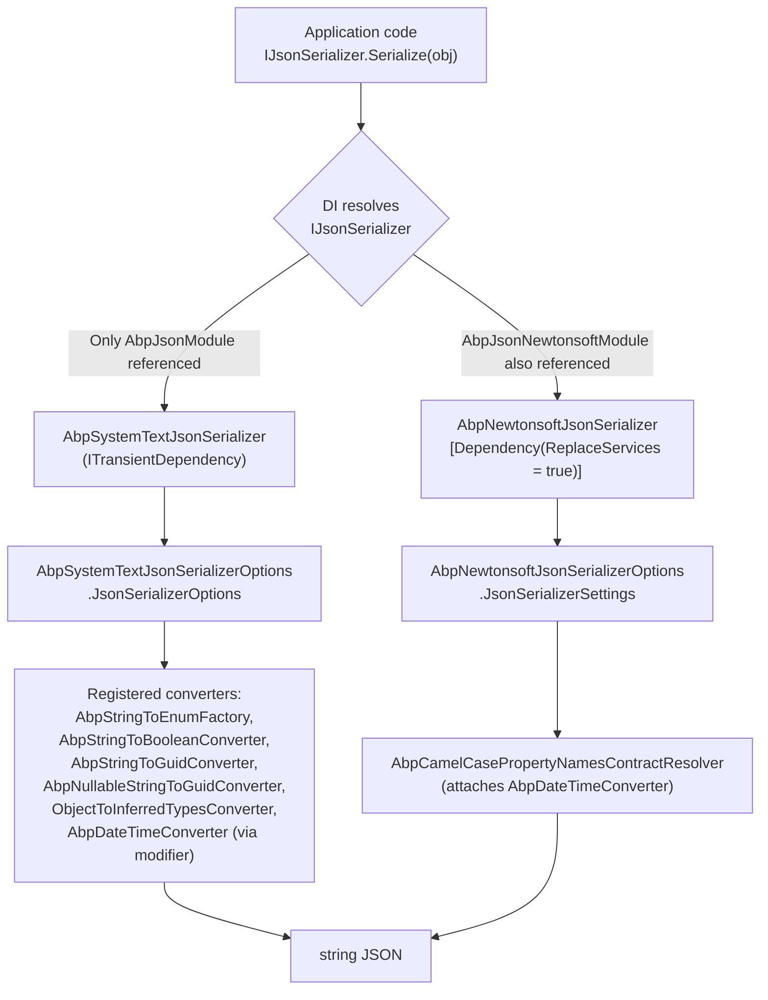
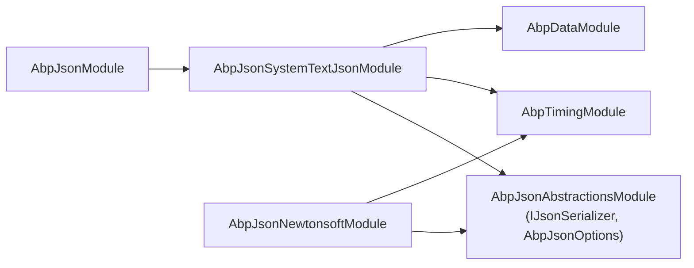

JSON serialization in ABP is intentionally shallow: a single `IJsonSerializer` interface with three methods, an `AbpJsonOptions` POCO for date-time formatting, and a default System.Text.Json implementation that is dropped in by the `AbpJsonModule`. Application code asks for `IJsonSerializer` from DI, and the rest of the framework — distributed caching, background jobs, dynamic HTTP proxies, OpenIddict serialization, Razor view rendering — does the same. Swapping the active implementation is a one-line change: depend on `AbpJsonNewtonsoftModule` instead of `AbpJsonSystemTextJsonModule`, and every consumer transparently picks up Newtonsoft.Json with the same `IJsonSerializer` calls.

This page walks through the three packages that form the JSON layer — `Volo.Abp.Json.Abstractions`, `Volo.Abp.Json`, and the two concrete back-ends — and shows how the `AbpJsonOptions.InputDateTimeFormats` / `OutputDateTimeFormat` settings are honored by both back-ends through their own date converters. Implementation details and converters are covered in [System.Text.Json](/serialization/json-system-text) and [Newtonsoft.Json](/serialization/json-newtonsoft); the byte-oriented `IObjectSerializer` used for distributed caching and background-job payloads is documented in [Binary / object serialization](/serialization/binary-serialization).

## Package layout

The JSON layer is split across four projects under `framework/src`. The abstractions package contains only the interface and the options class; the default implementation forwards to System.Text.Json; the Newtonsoft variant lives in a sibling package and replaces the registration when included.

| File | Type | Role |
| --- | --- | --- |
| `Volo.Abp.Json.Abstractions/Volo/Abp/Json/AbpJsonAbstractionsModule.cs` | `AbpModule` | Empty marker module that other JSON modules depend on. |
| `Volo.Abp.Json.Abstractions/Volo/Abp/Json/IJsonSerializer.cs` | Interface | The three-method `IJsonSerializer` contract. |
| `Volo.Abp.Json.Abstractions/Volo/Abp/Json/AbpJsonOptions.cs` | Options | `InputDateTimeFormats` list and `OutputDateTimeFormat` string. |
| `Volo.Abp.Json/Volo/Abp/Json/AbpJsonModule.cs` | `AbpModule` | Convenience module that pulls in `AbpJsonSystemTextJsonModule`. |
| `Volo.Abp.Json.SystemTextJson/Volo/Abp/Json/SystemTextJson/AbpJsonSystemTextJsonModule.cs` | `AbpModule` | Registers `AbpSystemTextJsonSerializer` and all default `JsonConverter`s. |
| `Volo.Abp.Json.SystemTextJson/Volo/Abp/Json/SystemTextJson/AbpSystemTextJsonSerializer.cs` | `IJsonSerializer` | Default `IJsonSerializer` implementation on `System.Text.Json`. |
| `Volo.Abp.Json.Newtonsoft/Volo/Abp/Json/Newtonsoft/AbpJsonNewtonsoftModule.cs` | `AbpModule` | Configures `AbpNewtonsoftJsonSerializerOptions` and the camel-case contract resolver. |
| `Volo.Abp.Json.Newtonsoft/Volo/Abp/Json/Newtonsoft/AbpNewtonsoftJsonSerializer.cs` | `IJsonSerializer` | Replaces the default via `[Dependency(ReplaceServices = true)]`. |

The companion `DisableDateTimeNormalizationAttribute` used by both back-ends to opt a property or class out of clock-normalization lives in the timing abstractions:

| File | Type | Role |
| --- | --- | --- |
| `framework/src/Volo.Abp.Timing/Volo/Abp/Timing/DisableDateTimeNormalizationAttribute.cs` | Attribute | Skip `IClock.Normalize` on the decorated `DateTime` member or its declaring type. |

## `IJsonSerializer`

`IJsonSerializer` is the single seam between application code and the underlying JSON library. The default arguments are aligned with ABP's HTTP-layer conventions: camel-case property names are produced and accepted, and output is compact unless the caller asks for indentation.

```csharp title="framework/src/Volo.Abp.Json.Abstractions/Volo/Abp/Json/IJsonSerializer.cs"
public interface IJsonSerializer
{
    string Serialize(object obj, bool camelCase = true, bool indented = false);

    T Deserialize<T>(string jsonString, bool camelCase = true);

    object Deserialize(Type type, string jsonString, bool camelCase = true);
}
```

A typical application service simply injects the interface and lets the active module decide which back-end runs the call:

```csharp
public class WebhookPublisher : ITransientDependency
{
    private readonly IJsonSerializer _jsonSerializer;
    private readonly HttpClient _httpClient;

    public WebhookPublisher(IJsonSerializer jsonSerializer, HttpClient httpClient)
    {
        _jsonSerializer = jsonSerializer;
        _httpClient = httpClient;
    }

    public async Task PublishAsync(WebhookEvent webhookEvent, string url)
    {
        var payload = _jsonSerializer.Serialize(webhookEvent);
        using var content = new StringContent(payload, Encoding.UTF8, "application/json");
        await _httpClient.PostAsync(url, content);
    }
}
```

Because `IJsonSerializer` is registered as transient (both implementations carry `ITransientDependency`), there is no per-call allocation surprise: the underlying `JsonSerializerOptions` / `JsonSerializerSettings` instance is held by the options object and cached internally per `(camelCase, indented)` tuple.

## `AbpJsonModule`

`AbpJsonModule` is the convenience module that most application modules transitively pick up. It exists only to forward to `AbpJsonSystemTextJsonModule` so that downstream packages can express a generic "ABP JSON" dependency without committing to a back-end:

```csharp title="framework/src/Volo.Abp.Json/Volo/Abp/Json/AbpJsonModule.cs"
[DependsOn(typeof(AbpJsonSystemTextJsonModule))]
public class AbpJsonModule : AbpModule
{

}
```

Packages such as `Volo.Abp.Caching` and `Volo.Abp.BackgroundJobs` declare `[DependsOn(typeof(AbpJsonModule))]`. As long as your host application also brings in `AbpJsonNewtonsoftModule`, ABP's dependency-injection convention — see [Conventional registration](/di/conventional-registration) — favors the Newtonsoft serializer because it is annotated with `[Dependency(ReplaceServices = true)]`.

<Note>
There is **no** "hybrid serializer" registered out of the box in the current sources. Some older ABP migration notes mention a `UseHybridSerializer` switch and a `HybridJsonSerializer`; those are historical and have been replaced by `IJsonSerializer` with explicit module replacement. If both modules are referenced, the Newtonsoft implementation wins by virtue of `ReplaceServices = true`.
</Note>

## `AbpJsonOptions`

`AbpJsonOptions` is a tiny POCO that both serializer back-ends consult during date-time formatting. It is the recommended extension point for tweaking how `DateTime` values flow over the wire:

```csharp title="framework/src/Volo.Abp.Json.Abstractions/Volo/Abp/Json/AbpJsonOptions.cs"
public class AbpJsonOptions
{
    /// <summary>
    /// Formats of input JSON date, Empty string means default format.
    /// </summary>
    public List<string> InputDateTimeFormats { get; set; }

    /// <summary>
    /// Format of output json date, Null or empty string means default format.
    /// </summary>
    public string? OutputDateTimeFormat { get; set; }

    public AbpJsonOptions()
    {
        InputDateTimeFormats = new List<string>();
    }
}
```

`InputDateTimeFormats` is tried in order on the way *in*: the first format that produces a `DateTime.TryParseExact` match wins, and the resulting value is run through `IClock.Normalize` before it reaches your DTO. `OutputDateTimeFormat` controls the wire shape on the way *out*; a null or whitespace value falls back to the back-end's default (ISO-8601 round-trip).

Configure it from your module's `ConfigureServices`:

```csharp
public override void ConfigureServices(ServiceConfigurationContext context)
{
    Configure<AbpJsonOptions>(options =>
    {
        options.InputDateTimeFormats = new List<string>
        {
            "yyyy*MM*dd",
            "yyyy-MM-dd HH:mm:ss"
        };
        options.OutputDateTimeFormat = "yyyy*MM-dd HH:mm:ss";
    });

    Configure<AbpClockOptions>(options =>
    {
        options.Kind = DateTimeKind.Utc;
    });
}
```

The above snippet is taken verbatim from `InputAndOutputDateTimeFormatSystemTextJsonTests` in the framework's test suite — it round-trips two `DateTime` properties through the custom format and confirms that the parsed values come back with `Kind == Utc`.

## How a `Serialize` call flows

The diagram below shows the path that a single `IJsonSerializer.Serialize(...)` call takes when both candidate back-ends are referenced. The decision is made at DI registration time, not on every call.



The "modifier" mentioned in the System.Text.Json path is the `AbpDateTimeConverterModifier`: it is a `JsonTypeInfo` action installed through `DefaultJsonTypeInfoResolver` that attaches `AbpDateTimeConverter` to every `DateTime`/`DateTime?` property at metadata-resolution time, rather than as a global converter. The Newtonsoft path achieves the same effect through `AbpCamelCasePropertyNamesContractResolver.CreateProperty`.

## Wiring at the DI level

Both serializers are conventional `ITransientDependency` implementations. The Newtonsoft variant additionally carries `[Dependency(ReplaceServices = true)]`, which is what makes it win when both packages are referenced from the host:

```csharp title="framework/src/Volo.Abp.Json.Newtonsoft/Volo/Abp/Json/Newtonsoft/AbpNewtonsoftJsonSerializer.cs"
[Dependency(ReplaceServices = true)]
public class AbpNewtonsoftJsonSerializer : IJsonSerializer, ITransientDependency
{
    protected IRootServiceProvider RootServiceProvider { get; }
    protected IOptions<AbpNewtonsoftJsonSerializerOptions> Options { get; }

    public AbpNewtonsoftJsonSerializer(
        IRootServiceProvider rootServiceProvider,
        IOptions<AbpNewtonsoftJsonSerializerOptions> options)
    {
        RootServiceProvider = rootServiceProvider;
        Options = options;
    }
    // ...
}
```

If you need to override only some types — for example, force Newtonsoft for one specific DTO that uses `JsonConverterAttribute` from `Newtonsoft.Json` — keep the default System.Text.Json registration and inject `AbpNewtonsoftJsonSerializer` directly by its concrete type. Both implementations are registered as themselves in addition to the `IJsonSerializer` service interface.

## Module dependency tree

The relationships between the three JSON modules are direct and acyclic. `AbpJsonSystemTextJsonModule` also depends on `AbpTimingModule` (for `IClock`) and `AbpDataModule` (for `IHasExtraProperties` support), reflecting that ABP's "JSON" is more than the basic serializer — it understands ABP's domain conventions.



A host that wants Newtonsoft for everything depends on `AbpJsonNewtonsoftModule` *and* still transitively gets `AbpJsonSystemTextJsonModule` (because most framework packages bring in `AbpJsonModule`). The override happens at the `IJsonSerializer` interface, not at the module level — both modules coexist, but only the Newtonsoft service responds to `IJsonSerializer` requests.

## Consumers of `IJsonSerializer`

`IJsonSerializer` is the de-facto JSON pipe for the rest of the framework. A non-exhaustive list of in-tree call sites:

| Consumer | Use case |
| --- | --- |
| `Volo.Abp.Caching/Utf8JsonDistributedCacheSerializer` | Serializes `TCacheItem` objects to UTF-8 bytes before they hit the distributed cache; see [Distributed cache](/caching/distributed-cache). |
| `Volo.Abp.BackgroundJobs/JsonBackgroundJobSerializer` | Serializes background-job argument payloads. |
| `Volo.Abp.Http.Client/*` dynamic proxies | Encodes request bodies and decodes responses for ABP's [dynamic C# proxies](/http/dynamic-c-sharp-proxies). |
| `Volo.Abp.AspNetCore.Mvc` script controllers | Serializes the application configuration and localization scripts emitted by the [content formatters](/web/content-formatters) endpoints. |
| `Volo.Abp.AzureServiceBus/Utf8JsonAzureServiceBusSerializer` | Distributed event-bus message payloads. |

Because everything funnels through `IJsonSerializer`, configuring `AbpJsonOptions` once in your `Application.Module` is enough to alter the wire format of every one of these pipelines. There is no per-pipeline JSON config to chase.

## DateTime normalization and `DisableDateTimeNormalizationAttribute`

Both back-ends defer to `IClock.Normalize(...)` whenever they read or write a `DateTime`. On a host configured with `AbpClockOptions.Kind = DateTimeKind.Utc`, that turns every materialized `DateTime` into UTC — regardless of how the JSON producer encoded the value.

To opt a property *out* of normalization (for example, a "local birthday" that must not shift on read), decorate either the member or its declaring type:

```csharp
public class Person
{
    public string Name { get; set; } = default!;

    [DisableDateTimeNormalization]
    public DateTime LocalBirthday { get; set; }
}
```

The System.Text.Json modifier checks this attribute on `JsonTypeInfo.Type` *and* on each `JsonPropertyInfo.AttributeProvider`; the Newtonsoft contract resolvers do the same in `AbpDateTimeConverter.ShouldNormalize`. Both back-ends consult `ReflectionHelper.GetAttributesOfMemberOrDeclaringType<DisableDateTimeNormalizationAttribute>` so class-level and member-level placement behave identically.

## When to pick which back-end

<CardGroup cols={2}>
<Card title="Stick with System.Text.Json" icon="bolt">
- New greenfield applications.
- Performance-sensitive paths.
- You don't need polymorphic `TypeNameHandling` or `[JsonProperty]` attribute compatibility.
- You want the source-generator-friendly `JsonTypeInfo` modifier pipeline.
</Card>
<Card title="Switch to Newtonsoft.Json" icon="rotate">
- You are migrating code that relies on `[JsonProperty]`, `[JsonIgnore]` from `Newtonsoft.Json`, or custom `JsonConverter` subclasses.
- You need `TypeNameHandling` for polymorphic payloads.
- A third-party library you embed already configures `JsonSerializerSettings`.
</Card>
</CardGroup>

The two back-ends are interchangeable from the application's point of view. Pick one and stick with it: mixing serializers per-pipeline is supported (resolve the concrete class) but defeats the "one knob to turn" benefit of `AbpJsonOptions`.

## Lifetime and threading

Both back-end serializers are registered as transient (`ITransientDependency`), but they are effectively *stateless* in practice — the only fields they hold are the immutable `Options` snapshot and a `static readonly ConcurrentDictionary` cache of fully-built `JsonSerializerOptions` / `JsonSerializerSettings` per `(camelCase, indented)` pair. Resolving `IJsonSerializer` is therefore cheap and safe from any thread; the underlying `JsonSerializer.Serialize` / `JsonConvert.SerializeObject` calls are themselves thread-safe.

There is no per-tenant scoping of the JSON options out of the box. If a tenant must override the wire format (for example, a tenant on a legacy integration that expects PascalCase JSON), the recommended pattern is to layer a thin `ITenantJsonSerializer` over `IJsonSerializer`, not to fork `AbpJsonOptions` per tenant — see [Current tenant](/multitenancy/current-tenant) for the scoping primitives.

## Interaction with other ABP options

`AbpJsonOptions` is the JSON-specific options bag, but it does not stand alone. Two adjacent options containers influence how `DateTime` values look on the wire:

| Options | Influence |
| --- | --- |
| `AbpClockOptions.Kind` | Drives `IClock.Normalize`. With `Utc`, every parsed `DateTime` ends up `Kind == Utc`; with `Unspecified`, the converter leaves the kind alone. |
| `AbpJsonOptions.InputDateTimeFormats` | List of formats tried before falling back to `Utf8JsonReader.TryGetDateTime` / `DateTime.Parse`. First match wins. |
| `AbpJsonOptions.OutputDateTimeFormat` | If null or whitespace, the back-end default ISO-8601 is used; otherwise this format string is fed to `DateTime.ToString`. |

The same `AbpJsonOptions` snapshot is shared by both back-ends — switching from System.Text.Json to Newtonsoft does not require re-configuring the date-time formats.

## Common pitfalls

<AccordionGroup>
<Accordion title="Mutating JsonSerializerOptions after the first call">
Both back-ends snapshot the configured template into a per-call options object and memoize the result. If you mutate `Options.JsonSerializerOptions` (System.Text.Json) or `Options.JsonSerializerSettings` (Newtonsoft) *after* the first `Serialize` call, the cached options on the hot path will not pick up the change until the process restarts. Always apply mutations from `ConfigureServices`, not from runtime code.
</Accordion>
<Accordion title="Expecting AbpJsonOptions to affect IObjectSerializer">
`AbpJsonOptions` only governs the `IJsonSerializer` path. The byte-oriented `IObjectSerializer` covered in [Binary / object serialization](/serialization/binary-serialization) uses raw `System.Text.Json` in its fallback, so a custom `OutputDateTimeFormat` is *not* applied to cache items that take the auto-serialize path. The distributed-cache layer side-steps this by going through `IJsonSerializer` directly in `Utf8JsonDistributedCacheSerializer`.
</Accordion>
<Accordion title="`[DisableDateTimeNormalization]` on the wrong element">
The attribute is honored both on the member *and* on its declaring type — but if you put it on an interface that the runtime type does not actually carry at reflection time (for example, `IHasCreationTime` for a property declared on the concrete entity), neither back-end will see it. Decorate the concrete member or its concrete declaring class.
</Accordion>
<Accordion title="Newtonsoft `TypeNameHandling` with System.Text.Json producers">
If part of your system speaks Newtonsoft with `TypeNameHandling.Auto` (`"$type": "..."` fields) and another part speaks System.Text.Json, you will get one-way compatibility at best. Pick a single back-end for any wire that must round-trip polymorphic payloads.
</Accordion>
</AccordionGroup>

## Quick reference

<Tabs>
<Tab title="Serialize a DTO">
```csharp
var payload = jsonSerializer.Serialize(dto);                  // camelCase, compact
var pretty  = jsonSerializer.Serialize(dto, indented: true);  // camelCase, indented
var pascal  = jsonSerializer.Serialize(dto, camelCase: false);// PascalCase property names
```
</Tab>
<Tab title="Deserialize a DTO">
```csharp
var dto      = jsonSerializer.Deserialize<MyDto>(json);
var dynamic  = jsonSerializer.Deserialize(typeof(MyDto), json);
var pascal   = jsonSerializer.Deserialize<MyDto>(json, camelCase: false);
```
</Tab>
<Tab title="Configure date formats">
```csharp
Configure<AbpJsonOptions>(options =>
{
    options.InputDateTimeFormats.Add("yyyy-MM-dd");
    options.OutputDateTimeFormat = "yyyy-MM-ddTHH:mm:ssZ";
});
```
</Tab>
<Tab title="Opt out per property">
```csharp
public class Reservation
{
    [DisableDateTimeNormalization]
    public DateTime LocalCheckIn { get; set; }
}
```
</Tab>
</Tabs>

## Related pages

- [System.Text.Json](/serialization/json-system-text) — the default back-end, converters, and `JsonTypeInfo` modifiers.
- [Newtonsoft.Json](/serialization/json-newtonsoft) — the opt-in back-end, contract resolvers, and date converter.
- [Binary / object serialization](/serialization/binary-serialization) — `IObjectSerializer`, the byte-oriented sibling used by caches and job payloads.
- [Caching overview](/caching/overview) and [Distributed cache](/caching/distributed-cache) — the largest consumer of `IJsonSerializer`.
- [Content formatters](/web/content-formatters) — how the ASP.NET Core MVC layer hooks into the same options.
- [Timing and clock](/concurrency/timing-and-clock) — `IClock` and `AbpClockOptions` referenced by every date converter.
