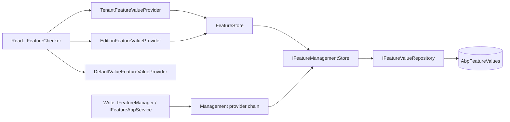

`modules/feature-management/` turns ABP's framework-level feature flags into a fully manageable, tenant-aware capability. It registers a real `IFeatureStore` over an `AbpFeatureValues` table (EF Core) or collection (MongoDB), adds a parallel chain of `IFeatureManagementProvider`s for *writing* values per `(providerName, providerKey)` tuple, exposes `IFeatureManager`, an `IFeatureAppService`, and a Razor Pages / Blazor / Angular management UI. Like its setting-management sibling, the framework primitives (`IFeatureChecker`, definitions, `[RequiresFeature]`) keep working without this module; pull it in when tenant admins need to override edition defaults at runtime.

<Info>
  Source root: `modules/feature-management/src/`. Pair with [Features overview](/settings-features/features-overview) and [Feature providers](/settings-features/feature-providers) first — this module mirrors that framework chain on the write side.
</Info>

## Project layout

| Project | Purpose |
| --- | --- |
| `Volo.Abp.FeatureManagement.Domain.Shared` | Constants (`FeatureValueConsts`, `FeatureDefinitionRecordConsts`, `AbpFeatureManagementDbProperties`), localisation resource. |
| `Volo.Abp.FeatureManagement.Domain` | `FeatureValue` aggregate, `FeatureManager`, `IFeatureManagementProvider` chain, `FeatureStore`, dynamic definition store. |
| `Volo.Abp.FeatureManagement.EntityFrameworkCore` | EF Core repositories + DbContext. |
| `Volo.Abp.FeatureManagement.MongoDB` | MongoDB equivalents. |
| `Volo.Abp.FeatureManagement.Application.Contracts` | `IFeatureAppService`, DTOs, `FeatureManagementPermissions`. |
| `Volo.Abp.FeatureManagement.Application` | `FeatureAppService`. |
| `Volo.Abp.FeatureManagement.HttpApi` / `.HttpApi.Client` | REST surface. |
| `Volo.Abp.FeatureManagement.Web` | Razor Pages modal: `Pages/FeatureManagement/FeatureManagementModal.cshtml`. |
| `Volo.Abp.FeatureManagement.Blazor` / `.Blazor.Server` / `.Blazor.WebAssembly` | Blazor management modal + DI bootstrap. |
| `Volo.Abp.FeatureManagement.Installer` | NuGet installer hook. |

## Key domain files

| File | Symbol | Role |
| --- | --- | --- |
| `FeatureValue.cs` | `FeatureValue : Entity<Guid>, IAggregateRoot<Guid>` | Persisted row: `Name`, `Value`, `ProviderName`, `ProviderKey`. |
| `FeatureDefinitionRecord.cs` / `FeatureGroupDefinitionRecord.cs` | dynamic definition rows | Persisted when `SaveStaticFeaturesToDatabase = true`. |
| `IFeatureManager.cs` / `FeatureManager.cs` | `IFeatureManager` | Read/write façade with `(providerName, providerKey)` addressing. |
| `IFeatureManagementProvider.cs` / `FeatureManagementProvider.cs` | `IFeatureManagementProvider` | Per-scope write provider, parallel to `IFeatureValueProvider`. |
| `DefaultValueFeatureManagementProvider.cs` | provider `"D"` | Read-only — returns the definition default. |
| `EditionFeatureManagementProvider.cs` | provider `"E"` | Read/write at edition scope. |
| `TenantFeatureManagementProvider.cs` | provider `"T"` | Read/write keyed by tenant; handles `ICurrentTenant` context. |
| `IFeatureManagementStore.cs` / `FeatureManagementStore.cs` | `IFeatureManagementStore` | Repository-level read/write/delete over `FeatureValue`. |
| `FeatureStore.cs` | `FeatureStore : IFeatureStore` | Bridges framework `IFeatureStore` to `IFeatureManagementStore`. |
| `DynamicFeatureDefinitionStore.cs` | `IDynamicFeatureDefinitionStore` impl | Returns `FeatureDefinitionRecord`s as `FeatureDefinition`s. |
| `StaticFeatureSaver.cs` | `IStaticFeatureSaver` | At boot, persists definitions to `AbpFeatureGroups` + `AbpFeatures`. |
| `FeatureManagementOptions.cs` | `FeatureManagementOptions` | Configures providers, per-provider permission policies, static-to-DB sync. |
| `FeatureNameValueWithGrantedProvider.cs` | DTO | Returned by the app service: which provider granted the value. |
| `AbpFeatureManagementDomainModule.cs` | module | Registers providers + background dynamic-store init. |

## Tenant + edition writes — the management provider chain

```csharp
// AbpFeatureManagementDomainModule.cs
Configure<FeatureManagementOptions>(options =>
{
    options.Providers.Add<DefaultValueFeatureManagementProvider>();
    options.Providers.Add<EditionFeatureManagementProvider>();

    //TODO: Should be moved to the Tenant Management module
    options.Providers.Add<TenantFeatureManagementProvider>();
    options.ProviderPolicies[TenantFeatureValueProvider.ProviderName]
        = "AbpTenantManagement.Tenants.ManageFeatures";
});
```

`ProviderPolicies` maps a provider `Name` (e.g. `"T"`) to the authorization policy required to write features at that scope. The `FeatureAppService` checks the matching policy before calling `IFeatureManager.SetAsync` — that's how "only host admins can manage tenant features" is enforced.

### `IFeatureManagementProvider`

```csharp
public interface IFeatureManagementProvider
{
    string Name { get; }
    bool Compatible(string providerName);
    Task<IAsyncDisposable> HandleContextAsync(string providerName, string providerKey);

    Task<string> GetOrNullAsync(FeatureDefinition feature, string providerKey);
    Task SetAsync(FeatureDefinition feature, string value, string providerKey);
    Task ClearAsync(FeatureDefinition feature, string providerKey);
}
```

`Compatible(providerName)` answers "does this provider see writes addressed to that scope?" — feature providers can chain (the tenant provider falls back to edition, edition to default).

`HandleContextAsync` is the interesting bit: when management code reads features as if it *were* a specific tenant, the tenant provider needs to swap `ICurrentTenant` temporarily so deeper providers see the right tenant id.

```csharp
// TenantFeatureManagementProvider.cs
public override Task<IAsyncDisposable> HandleContextAsync(string providerName, string providerKey)
{
    if (providerName == Name && !providerKey.IsNullOrWhiteSpace())
    {
        if (Guid.TryParse(providerKey, out var tenantId))
        {
            var disposable = CurrentTenant.Change(tenantId);
            return Task.FromResult<IAsyncDisposable>(new AsyncDisposeFunc(() =>
            {
                disposable.Dispose();
                return Task.CompletedTask;
            }));
        }
    }

    return base.HandleContextAsync(providerName, providerKey);
}

protected override Task<string> NormalizeProviderKeyAsync(string providerKey)
{
    if (providerKey != null) return Task.FromResult(providerKey);
    return Task.FromResult(CurrentTenant.Id?.ToString());
}
```

So `IFeatureAppService.UpdateAsync("T", "<tenantId>", ...)` actually:

1. Authorises via `ProviderPolicies["T"] = "AbpTenantManagement.Tenants.ManageFeatures"`.
2. `HandleContextAsync` calls `CurrentTenant.Change(tenantId)`.
3. Writes go to `FeatureValue` rows with `ProviderName = "T"`, `ProviderKey = tenantId`.
4. Disposing reverts the tenant scope.

## Bridging into the framework chain

```csharp
// FeatureStore.cs (modules/.../Domain/Volo/Abp/FeatureManagement/FeatureStore.cs)
public class FeatureStore : IFeatureStore, ITransientDependency
{
    protected IFeatureManagementStore ManagementStore { get; }

    public FeatureStore(IFeatureManagementStore managementStore)
    {
        ManagementStore = managementStore;
    }

    public virtual Task<string> GetOrNullAsync(string name, string providerName, string providerKey)
        => ManagementStore.GetOrNullAsync(name, providerName, providerKey);
}
```

`FeatureStore` (`ITransientDependency`) replaces `NullFeatureStore` (registered with `TryRegister = true`). The framework providers `TenantFeatureValueProvider` / `EditionFeatureValueProvider` automatically start hitting the database — no extra wiring on the consumer side.



## `IFeatureManager`

```csharp
public interface IFeatureManager
{
    Task<string> GetOrNullAsync(string name, string providerName, string providerKey, bool fallback = true);
    Task<List<FeatureNameValue>> GetAllAsync(string providerName, string providerKey, bool fallback = true);
    Task<FeatureNameValueWithGrantedProvider> GetOrNullWithProviderAsync(string name, string providerName, string providerKey, bool fallback = true);
    Task<List<FeatureNameValueWithGrantedProvider>> GetAllWithProviderAsync(string providerName, string providerKey, bool fallback = true);
    Task SetAsync(string name, string value, string providerName, string providerKey, bool forceToSet = false);
    Task DeleteAsync(string providerName, string providerKey);
}
```

The `*WithProvider` variants additionally tell you which provider actually answered — important for management UIs that need to render "Inherited from Edition (Pro)" badges.

Per-scope extensions live in `TenantFeatureManagerExtensions`, `EditionFeatureManagerExtensions`, `DefaultValueFeatureManagerExtensions`:

```csharp
await featureManager.GetOrNullForTenantAsync("MyApp.Reports.Export", tenantId);
await featureManager.SetForTenantAsync("MyApp.Reports.Export", "true", tenantId);
await featureManager.GetOrNullForEditionAsync("MyApp.Reports.Export", editionId);
await featureManager.SetForEditionAsync("MyApp.Reports.Export", "true", editionId);
await featureManager.GetOrNullDefaultAsync("MyApp.Reports.Export");
```

## Persistence

### Entity

```csharp
public class FeatureValue : Entity<Guid>, IAggregateRoot<Guid>
{
    public virtual string Name { get; protected set; }
    public virtual string Value { get; internal set; }
    public virtual string ProviderName { get; protected set; }
    public virtual string ProviderKey { get; protected set; }
}
```

### EF Core

The mapping (in `FeatureManagementDbContextModelBuilderExtensions`) sets the `AbpFeatureValues` table with a uniqueness index on `(Name, ProviderName, ProviderKey)`. Three more tables back the dynamic definition store: `AbpFeatures`, `AbpFeatureGroups`, `AbpFeatureValues` — managed by `EfCoreFeatureValueRepository`, `EfCoreFeatureDefinitionRecordRepository`, `EfCoreFeatureGroupDefinitionRecordRepository`.

### MongoDB

`Volo.Abp.FeatureManagement.MongoDB` maps the same three aggregates to MongoDB collections under the same names.

## Static-to-dynamic sync

```csharp
public class FeatureManagementOptions
{
    public ITypeList<IFeatureManagementProvider> Providers { get; }
    public Dictionary<string, string> ProviderPolicies { get; }
    public bool SaveStaticFeaturesToDatabase { get; set; } = true;
    public bool IsDynamicFeatureStoreEnabled { get; set; } // default false
}
```

The domain module's `OnApplicationInitializationAsync` runs a background task that (with Polly retries) calls `IStaticFeatureSaver.SaveAsync()` to upsert every static `FeatureDefinition` / `FeatureGroupDefinition` into the corresponding tables, then pre-warms `IDynamicFeatureDefinitionStore.GetAllAsync()`. In a data-migration environment both flags are forced off.

```csharp
if (context.Services.IsDataMigrationEnvironment())
{
    Configure<FeatureManagementOptions>(options =>
    {
        options.SaveStaticFeaturesToDatabase = false;
        options.IsDynamicFeatureStoreEnabled = false;
    });
}
```

## Application service

```csharp
public interface IFeatureAppService : IApplicationService
{
    Task<GetFeatureListResultDto> GetAsync([NotNull] string providerName, string providerKey);
    Task UpdateAsync([NotNull] string providerName, string providerKey, UpdateFeaturesDto input);
    Task DeleteAsync([NotNull] string providerName, string providerKey);
}
```

`FeatureAppService` checks `FeatureManagementOptions.ProviderPolicies[providerName]` against `IAuthorizationService` and (for the host scope) `FeatureManagementPermissions.ManageHostFeatures`:

```csharp
public class FeatureManagementPermissions
{
    public const string GroupName = "FeatureManagement";
    public const string ManageHostFeatures = GroupName + ".ManageHostFeatures";
}
```

The DTO `FeatureDto` is the UI-friendly projection of a `FeatureDefinition` + its currently-effective `Value` + provider info; `UpdateFeaturesDto` is a `[{ name, value }]` list.

## Management UI

The Razor Pages variant ships `Pages/FeatureManagement/FeatureManagementModal.cshtml` — a Bootstrap modal opened from the tenant grid in the tenant-management module (and editable elsewhere via the `abp-feature-management` tag helper). Blazor and Angular hosts ship parallel modals that hit the same HTTP API.

Open it programmatically from the Razor side:

```html
<abp-button id="ManageHostFeaturesButton"
            button-type="Primary"
            text="@L["ManageHostFeatures"].Value" />

<script>
    document.getElementById('ManageHostFeaturesButton').addEventListener('click', function () {
        abp.modals.featureManagement.open({ providerName: 'H', providerKey: null });
    });
</script>
```

The provider names `"H"` (host) and `"T"` (tenant) are conventional addresses understood by the API.

## Wiring it into a host

```csharp
[DependsOn(
    typeof(AbpFeatureManagementApplicationModule),
    typeof(AbpFeatureManagementEntityFrameworkCoreModule),
    typeof(AbpFeatureManagementHttpApiModule),
    typeof(AbpFeatureManagementWebModule) // or Blazor / WebAssembly equivalents
)]
public class MyHostModule : AbpModule { /* ... */ }
```

DbContext side:

```csharp
public class MyAppDbContext : AbpDbContext<MyAppDbContext>, IFeatureManagementDbContext
{
    public DbSet<FeatureValue> FeatureValues { get; set; }
    public DbSet<FeatureGroupDefinitionRecord> FeatureGroups { get; set; }
    public DbSet<FeatureDefinitionRecord> Features { get; set; }

    protected override void OnModelCreating(ModelBuilder builder)
    {
        base.OnModelCreating(builder);
        builder.ConfigureFeatureManagement();
    }
}
```

Add EF migration; on first boot the background task seeds the definition tables and the management modal lights up.

## Caching and invalidation

`FeatureValueCacheItem` + `FeatureValueCacheItemInvalidator` keep `IDistributedCache` in sync with the `AbpFeatureValues` table — invalidation entries fire on `SetAsync` and `ClearAsync`, so multi-host deployments see the same effective value within the cache TTL. The dynamic definition store has its own in-memory cache (`DynamicFeatureDefinitionStoreInMemoryCache`) refreshed on a timer.

## Cross-references

- [Features overview](/settings-features/features-overview) — the framework-level abstractions this module sits on top of.
- [Feature providers](/settings-features/feature-providers) — read chain that returns values written here.
- [Setting management module](/settings-features/setting-management-module) — sibling module with the same shape for settings.
- [Global features](/settings-features/global-features) — different, compile-time gating; does **not** flow through this module.
- [Multi-tenancy](/multitenancy) — `ICurrentTenant.Change(...)` is what `TenantFeatureManagementProvider.HandleContextAsync` calls.
- [Authorization](/authz) — `ProviderPolicies` and `FeatureManagementPermissions.ManageHostFeatures` gate management API calls.

<Tip>
  Want only host admins to ever change a tenant's plan? Keep `options.ProviderPolicies["T"] = "AbpTenantManagement.Tenants.ManageFeatures"` and grant the permission only to host roles. The `FeatureAppService.UpdateAsync` path checks that policy before delegating to `IFeatureManager.SetAsync`.
</Tip>
