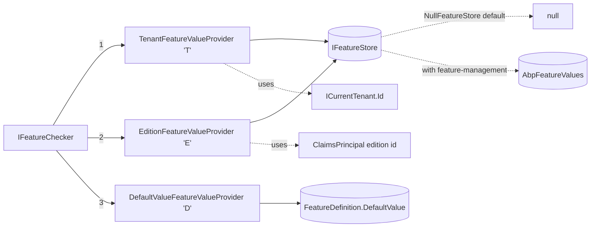
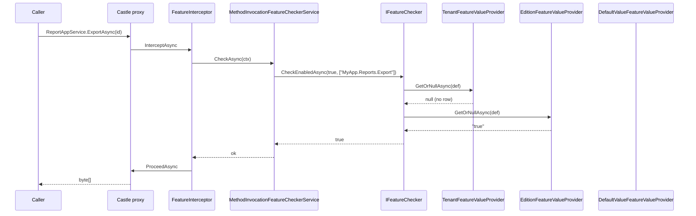

A feature value in ABP is resolved by walking an ordered chain of `IFeatureValueProvider`s. The three providers shipped by `Volo.Abp.Features` are deliberately minimal: each maps one scope (default, edition, tenant) to the uniform `(FeatureDefinition) -> string?` contract. The chain is registered as `Default → Edition → Tenant`, then reversed at read-time inside `FeatureChecker` so the most specific scope wins. There is no per-user feature provider in the framework — features are tenant-shaped, not user-shaped (settings cover the per-user axis).

<Info>
  Source root: `framework/src/Volo.Abp.Features/Volo/Abp/Features/`. The persistent backing — `IFeatureStore` — is `NullFeatureStore` by default and gets replaced by `FeatureStore` from the [feature-management module](/settings-features/feature-management-module).
</Info>

## Source map

| File | Symbol | Role |
| --- | --- | --- |
| `IFeatureValueProvider.cs` | `IFeatureValueProvider` | Contract: `Name`, `GetOrNullAsync(FeatureDefinition)`. |
| `FeatureValueProvider.cs` | `FeatureValueProvider` (abstract) | Base class injecting `IFeatureStore`. |
| `DefaultValueFeatureValueProvider.cs` | provider `"D"` | Returns `feature.DefaultValue`. |
| `EditionFeatureValueProvider.cs` | provider `"E"` | Reads `IFeatureStore` keyed by `ICurrentPrincipalAccessor.FindEditionId()`. |
| `TenantFeatureValueProvider.cs` | provider `"T"` | Reads `IFeatureStore` keyed by `ICurrentTenant.Id`. |
| `IFeatureStore.cs` / `NullFeatureStore.cs` | `IFeatureStore` | `(name, providerName, providerKey) -> string?`. |
| `FeatureChecker.cs` | `FeatureChecker` | Materialises the chain from `AbpFeatureOptions.ValueProviders`, reverses it, runs it. |

## The contracts

```csharp
// IFeatureValueProvider.cs
public interface IFeatureValueProvider
{
    string Name { get; }
    Task<string?> GetOrNullAsync([NotNull] FeatureDefinition feature);
}
```

```csharp
// FeatureValueProvider.cs
public abstract class FeatureValueProvider : IFeatureValueProvider, ITransientDependency
{
    public abstract string Name { get; }
    protected IFeatureStore FeatureStore { get; }

    protected FeatureValueProvider(IFeatureStore featureStore)
    {
        FeatureStore = featureStore;
    }

    public abstract Task<string?> GetOrNullAsync(FeatureDefinition feature);
}
```

Note there is no `GetAllAsync` on `IFeatureValueProvider` — feature reads happen one name at a time. `IFeatureChecker.GetOrNullAsync` is the entry point.

```csharp
// IFeatureStore.cs
public interface IFeatureStore
{
    Task<string?> GetOrNullAsync(
        [NotNull] string name,
        string? providerName,
        string? providerKey
    );
}
```

The persistence shape is identical to settings: a `(name, providerName, providerKey)` row. The feature-management module's EF mapping puts a uniqueness index on that triple.

## Provider chain diagram



Resolution loop inside `FeatureChecker`:

```csharp
public override async Task<string?> GetOrNullAsync(string name)
{
    var featureDefinition = await FeatureDefinitionManager.GetAsync(name);
    var providers = Enumerable.Reverse(Providers);

    if (featureDefinition.AllowedProviders.Any())
    {
        providers = providers.Where(p => featureDefinition.AllowedProviders.Contains(p.Name));
    }

    return await GetOrNullValueFromProvidersAsync(providers, featureDefinition);
}

protected virtual async Task<string?> GetOrNullValueFromProvidersAsync(
    IEnumerable<IFeatureValueProvider> providers,
    FeatureDefinition feature)
{
    foreach (var provider in providers)
    {
        var value = await provider.GetOrNullAsync(feature);
        if (value != null)
        {
            return value;
        }
    }
    return null;
}
```

`Providers` is a `Lazy<List<IFeatureValueProvider>>` resolved once from `AbpFeatureOptions.ValueProviders`.

## Provider 1 — `DefaultValueFeatureValueProvider`

```csharp
public class DefaultValueFeatureValueProvider : FeatureValueProvider
{
    public const string ProviderName = "D";
    public override string Name => ProviderName;

    public DefaultValueFeatureValueProvider(IFeatureStore settingStore) : base(settingStore) { }

    public override Task<string?> GetOrNullAsync(FeatureDefinition setting)
    {
        return Task.FromResult<string?>(setting.DefaultValue);
    }
}
```

The "always answers" rung. Because `DefaultValueFeatureValueProvider` returns a non-null value whenever the definition has one, it terminates the chain — so `IFeatureChecker.GetOrNullAsync` returns `null` only when the entire `DefaultValue` is `null` *and* no tenant/edition row exists.

## Provider 2 — `EditionFeatureValueProvider`

```csharp
public class EditionFeatureValueProvider : FeatureValueProvider
{
    public const string ProviderName = "E";
    public override string Name => ProviderName;

    protected ICurrentPrincipalAccessor PrincipalAccessor;

    public EditionFeatureValueProvider(IFeatureStore featureStore,
                                       ICurrentPrincipalAccessor principalAccessor)
        : base(featureStore)
    {
        PrincipalAccessor = principalAccessor;
    }

    public override async Task<string?> GetOrNullAsync(FeatureDefinition feature)
    {
        var editionId = PrincipalAccessor.Principal?.FindEditionId();
        if (editionId == null) return null;
        return await FeatureStore.GetOrNullAsync(feature.Name, Name, editionId.Value.ToString());
    }
}
```

The edition id is sourced from the current principal claims via `FindEditionId()` (extension method on `ClaimsPrincipal` in `Volo.Abp.Security.Claims`). Editions are SaaS plans — `Free`, `Pro`, `Enterprise` — and a tenant is assigned to one. So an edition feature override is "what does the Pro plan unlock?". If the principal carries no edition claim, the provider returns `null` and falls through.

## Provider 3 — `TenantFeatureValueProvider`

```csharp
public class TenantFeatureValueProvider : FeatureValueProvider
{
    public const string ProviderName = "T";
    public override string Name => ProviderName;

    protected ICurrentTenant CurrentTenant { get; }

    public TenantFeatureValueProvider(IFeatureStore featureStore, ICurrentTenant currentTenant)
        : base(featureStore)
    {
        CurrentTenant = currentTenant;
    }

    public override async Task<string?> GetOrNullAsync(FeatureDefinition feature)
    {
        return await FeatureStore.GetOrNullAsync(feature.Name, Name, CurrentTenant.Id?.ToString());
    }
}
```

The tenant provider is unconditional — even when `CurrentTenant.Id` is `null` (host context) it asks the store. The store treats `providerKey = null` as "the host" — most rows under `"T"` will have a non-null key, but the host scope is a valid row too.

This is why **tenant wins over edition**: tenants can override their edition's defaults from their own management UI.

## How the chain is registered

```csharp
// AbpFeaturesModule.cs
context.Services.Configure<AbpFeatureOptions>(options =>
{
    options.ValueProviders.Add<DefaultValueFeatureValueProvider>();
    options.ValueProviders.Add<EditionFeatureValueProvider>();
    options.ValueProviders.Add<TenantFeatureValueProvider>();
});
```

Order of `Add<>()` calls is the order in `AbpFeatureOptions.ValueProviders`. `FeatureChecker` reverses it — so **at read time**: Tenant → Edition → Default.

## Allowed-providers filter

Like settings, `FeatureDefinition.AllowedProviders` can narrow the chain for a specific feature:

```csharp
billing.AddFeature("MyApp.Reports.HostOnly",
    defaultValue: "false",
    valueType: new ToggleStringValueType())
    .WithProviders(DefaultValueFeatureValueProvider.ProviderName,
                   EditionFeatureValueProvider.ProviderName);
// Tenants cannot override this.
```

Filtered out at the `Where(p => feature.AllowedProviders.Contains(p.Name))` step inside `FeatureChecker.GetOrNullAsync`.

## `NullFeatureStore` — the default backing

Without the feature-management module, `IFeatureStore` is the no-op:

```csharp
[Dependency(TryRegister = true)]
public class NullFeatureStore : IFeatureStore, ISingletonDependency
{
    public Task<string?> GetOrNullAsync(string name, string? providerName, string? providerKey)
        => Task.FromResult<string?>(null);
}
```

Result: `IFeatureChecker.GetOrNullAsync("any")` returns `DefaultValue` always. Useful when you only want code-side `[RequiresFeature]` checks against compile-time defaults, but for tenant-managed features you need the [feature-management module](/settings-features/feature-management-module) to register `FeatureStore`.

## Adding a custom provider

For a per-organisation-unit feature (an example not shipped in the framework):

```csharp
public class OrganizationUnitFeatureValueProvider : FeatureValueProvider
{
    public const string ProviderName = "OU";
    public override string Name => ProviderName;

    private readonly ICurrentOrganizationUnit _currentOu;

    public OrganizationUnitFeatureValueProvider(
        IFeatureStore featureStore,
        ICurrentOrganizationUnit currentOu)
        : base(featureStore)
    {
        _currentOu = currentOu;
    }

    public override async Task<string?> GetOrNullAsync(FeatureDefinition feature)
    {
        if (_currentOu.Id == null) return null;
        return await FeatureStore.GetOrNullAsync(feature.Name, Name, _currentOu.Id.ToString());
    }
}
```

Insert at the right rung:

```csharp
public override void ConfigureServices(ServiceConfigurationContext context)
{
    Configure<AbpFeatureOptions>(options =>
    {
        var idx = options.ValueProviders.IndexOf(typeof(TenantFeatureValueProvider));
        options.ValueProviders.Insert(idx + 1, typeof(OrganizationUnitFeatureValueProvider));
        // Reverse-order means: OU resolved before Tenant.
    });
}
```

You'd also want a matching `IFeatureManagementProvider` (in the management module) with the same `Name` so writes target the same rows.

## Per-provider summary table

| Provider | `Name` | Backing source | Per-request scope | Notes |
| --- | --- | --- | --- | --- |
| `DefaultValueFeatureValueProvider` | `"D"` | `FeatureDefinition.DefaultValue` | constant | Last resort; always answers if the definition has a default. |
| `EditionFeatureValueProvider` | `"E"` | `IFeatureStore` keyed by edition id claim | per-edition | Short-circuits to `null` if no edition claim. |
| `TenantFeatureValueProvider` | `"T"` | `IFeatureStore` keyed by `ICurrentTenant.Id` | per-tenant | Highest priority — tenant override beats edition default. |
| (added by feature-management) `IFeatureManagementProvider "T"/"E"` | — | writes `AbpFeatureValues` row | — | Write counterpart; see [feature management](/settings-features/feature-management-module). |

## How a `[RequiresFeature]` call resolves



If `E` had returned `null` and `D` returned `"false"`, `CheckEnabledAsync` throws `AbpAuthorizationException(code: AbpFeatureErrorCodes.FeatureIsNotEnabled)`.

## Cross-references

- [Features overview](/settings-features/features-overview) — definitions, groups, `[RequiresFeature]`, `IFeatureDefinitionManager`.
- [Feature management module](/settings-features/feature-management-module) — `IFeatureManagementProvider` write chain, EF/Mongo persistence, app service + UI.
- [Setting providers](/settings-features/setting-providers) — sibling system with a similar chain pattern but per-user/global semantics.
- [Multi-tenancy](/multitenancy) — `ICurrentTenant` and the edition claim are the inputs to provider keys.
- [Authorization](/authz) — `CheckEnabledAsync` throws an `AbpAuthorizationException`, integrating feature gating with the auth pipeline.
