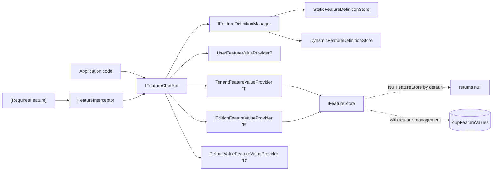

ABP's feature system is a tenant-scoped flag-and-value mechanism that lives in `framework/src/Volo.Abp.Features/`. It looks superficially like settings but answers a different question: "does **this** tenant or edition have access to **that** capability?". Definitions are declared in C# via `FeatureDefinitionProvider`, grouped by `FeatureGroupDefinition`, optionally parent/child for sub-feature gating, and typed via an `IStringValueType` (toggle, free-text, selection). Resolution flows through `IFeatureChecker` and a chain of `IFeatureValueProvider`s that resolve user → tenant → edition → default. The `[RequiresFeature]` attribute and a Castle interceptor (`FeatureInterceptor`) plug feature checks into method calls without scattering `if (await checker.IsEnabledAsync(...))`.

<Info>
  Source root: `framework/src/Volo.Abp.Features/Volo/Abp/Features/`. Module: `AbpFeaturesModule.cs`. Pulled in by `Volo.Abp.Ddd.Application.Contracts` and most application modules.
</Info>

## File inventory

| File | Symbol | Role |
| --- | --- | --- |
| `AbpFeaturesModule.cs` | `AbpFeaturesModule` | Module: registers default value providers, auto-discovers `IFeatureDefinitionProvider`s, hooks `FeatureInterceptorRegistrar`. |
| `AbpFeatureOptions.cs` | `AbpFeatureOptions` | Ordered `ITypeList<IFeatureDefinitionProvider>` / `ITypeList<IFeatureValueProvider>`, deleted-feature lists. |
| `FeatureDefinition.cs` | `FeatureDefinition` | Metadata + parent/child relationship, `IStringValueType`, `AllowedProviders`. |
| `FeatureGroupDefinition.cs` | `FeatureGroupDefinition` | Group with N features, used as a UI section. |
| `IFeatureDefinitionProvider.cs` / `FeatureDefinitionProvider.cs` | `FeatureDefinitionProvider` | Authoring entry point. |
| `IFeatureDefinitionContext.cs` / `FeatureDefinitionContext.cs` | `IFeatureDefinitionContext` | `AddGroup`, `GetGroupOrNull`, `RemoveGroup`. |
| `IFeatureDefinitionManager.cs` / `FeatureDefinitionManager.cs` | `IFeatureDefinitionManager` | Singleton: merged static + dynamic definitions, groups. |
| `IStaticFeatureDefinitionStore.cs` / `StaticFeatureDefinitionStore.cs` | static store | Materialises providers into a dictionary. |
| `IDynamicFeatureDefinitionStore.cs` / `NullDynamicFeatureDefinitionStore.cs` | dynamic store | Hook for runtime-defined features (overridden by `feature-management`). |
| `IFeatureChecker.cs` / `FeatureCheckerBase.cs` / `FeatureChecker.cs` | `IFeatureChecker` | Public read facade. |
| `FeatureCheckerExtensions.cs` | extension methods | `IsEnabledAsync(requiresAll, names)`, `CheckEnabledAsync`, `GetAsync<T>`. |
| `IFeatureValueProvider.cs` / `FeatureValueProvider.cs` | `IFeatureValueProvider` | One rung in the resolution chain. |
| `IFeatureStore.cs` / `NullFeatureStore.cs` | `IFeatureStore` | Backing key/value store contract. |
| `DefaultValueFeatureValueProvider.cs` | provider `"D"` | Reads `FeatureDefinition.DefaultValue`. |
| `EditionFeatureValueProvider.cs` | provider `"E"` | Reads `IFeatureStore` keyed by edition id (from `ICurrentPrincipalAccessor.FindEditionId`). |
| `TenantFeatureValueProvider.cs` | provider `"T"` | Reads `IFeatureStore` keyed by `ICurrentTenant.Id`. |
| `RequiresFeatureAttribute.cs` | `RequiresFeatureAttribute` | `[AttributeUsage(Class | Method)]` declarative gate. |
| `DisableFeatureCheckAttribute.cs` | `DisableFeatureCheckAttribute` | Opts a method out of the interceptor. |
| `FeatureInterceptor.cs` / `FeatureInterceptorRegistrar.cs` | dynamic-proxy interceptor | Wires `[RequiresFeature]` into Castle proxies. |
| `IMethodInvocationFeatureCheckerService.cs` / `MethodInvocationFeatureCheckerService.cs` | `IMethodInvocationFeatureCheckerService` | Picks up class+method attributes and calls `CheckEnabledAsync`. |
| `RequireFeaturesSimpleStateChecker.cs` | simple-state checker | Plugs feature gating into `IHasSimpleStateCheckers`. |

## Concept map



## `IFeatureChecker`

```csharp
// IFeatureChecker.cs
public interface IFeatureChecker
{
    Task<string?> GetOrNullAsync([NotNull] string name);
    Task<bool> IsEnabledAsync(string name);
}
```

`IsEnabledAsync` is just `bool.Parse` on the resolved string:

```csharp
// FeatureCheckerBase.cs
public virtual async Task<bool> IsEnabledAsync(string name)
{
    var value = await GetOrNullAsync(name);
    if (value.IsNullOrEmpty()) return false;
    try { return bool.Parse(value!); }
    catch (Exception ex)
    {
        throw new AbpException(
            $"The value '{value}' for the feature '{name}' should be a boolean, but was not!", ex);
    }
}
```

Feature values are stored as `string` (so a "max projects" feature can hold `"10"`); `IsEnabledAsync` is the boolean shortcut for the most common case — a toggle. For typed reads use the extension:

```csharp
// FeatureCheckerExtensions.cs
public static async Task<T> GetAsync<T>(this IFeatureChecker featureChecker,
                                        string name, T defaultValue = default)
    where T : struct
{
    var value = await featureChecker.GetOrNullAsync(name);
    return value?.To<T>() ?? defaultValue;
}
```

`CheckEnabledAsync` throws `AbpAuthorizationException(code: AbpFeatureErrorCodes.FeatureIsNotEnabled)` — making feature gating consistent with permission denial.

### Chain resolution

```csharp
// FeatureChecker.cs
public override async Task<string?> GetOrNullAsync(string name)
{
    var featureDefinition = await FeatureDefinitionManager.GetAsync(name);
    var providers = Enumerable.Reverse(Providers);

    if (featureDefinition.AllowedProviders.Any())
    {
        providers = providers.Where(p => featureDefinition.AllowedProviders.Contains(p.Name));
    }

    return await GetOrNullValueFromProvidersAsync(providers, featureDefinition);
}
```

Same pattern as settings — providers registered in `AbpFeatureOptions.ValueProviders` are iterated in reverse, first non-null wins. The shipped default order makes resolution `Tenant → Edition → Default`:

```csharp
// AbpFeaturesModule.cs
context.Services.Configure<AbpFeatureOptions>(options =>
{
    options.ValueProviders.Add<DefaultValueFeatureValueProvider>();
    options.ValueProviders.Add<EditionFeatureValueProvider>();
    options.ValueProviders.Add<TenantFeatureValueProvider>();
});
```

Drill into each rung in [Feature providers](/settings-features/feature-providers).

## `FeatureDefinition`

The richest definition class in the framework — features have parents, children, and a `ValueType`:

```csharp
public FeatureDefinition(
    string name,
    string? defaultValue = null,
    ILocalizableString? displayName = null,
    ILocalizableString? description = null,
    IStringValueType? valueType = null,
    bool isVisibleToClients = true,
    bool isAvailableToHost = true)
```

Key members:

| Member | Type | Meaning |
| --- | --- | --- |
| `Name` | `string` | Unique key. |
| `DisplayName` / `Description` | `ILocalizableString` | UI labels. |
| `Parent` | `FeatureDefinition?` | If set, the parent must also be enabled (semantic contract enforced at the UI/management layer). |
| `Children` | `IReadOnlyList<FeatureDefinition>` | Child features; created via `CreateChild(...)`. |
| `DefaultValue` | `string?` | Read by `DefaultValueFeatureValueProvider`. |
| `IsVisibleToClients` | `bool` | Default `true` — opposite of settings. |
| `IsAvailableToHost` | `bool` | If `false`, the feature only makes sense per tenant. |
| `AllowedProviders` | `List<string>` | Allow-list of `IFeatureValueProvider.Name` codes. |
| `Properties` | `Dictionary<string, object?>` | Free-form bag (e.g. `WithProperty("Group", "Billing")`). |
| `ValueType` | `IStringValueType?` | Defaults to `ToggleStringValueType()`. Used by the UI/validator. |

Fluent helpers `WithProperty`, `WithProviders`, plus parent/child constructors:

```csharp
public FeatureDefinition CreateChild(
    string name,
    string? defaultValue = null,
    ILocalizableString? displayName = null,
    ILocalizableString? description = null,
    IStringValueType? valueType = null,
    bool isVisibleToClients = true,
    bool isAvailableToHost = true);
```

`RemoveChild(string)` removes a child and clears its `Parent` pointer.

## `FeatureGroupDefinition`

Features are always created under a group — groups are the UI's left-nav sections:

```csharp
public class FeatureGroupDefinition : ICanCreateChildFeature
{
    public string Name { get; }
    public ILocalizableString DisplayName { get; set; }
    public IReadOnlyList<FeatureDefinition> Features => _features.ToImmutableList();
    public Dictionary<string, object?> Properties { get; }

    public virtual FeatureDefinition AddFeature(
        string name,
        string? defaultValue = null,
        ILocalizableString? displayName = null,
        ILocalizableString? description = null,
        IStringValueType? valueType = null,
        bool isVisibleToClients = true,
        bool isAvailableToHost = true);

    public virtual List<FeatureDefinition> GetFeaturesWithChildren();
}
```

`GetFeaturesWithChildren()` flattens the parent/child tree — used by the management UI to render a single ordered list.

## Authoring features

```csharp
public class MyAppFeatureDefinitionProvider : FeatureDefinitionProvider
{
    public override void Define(IFeatureDefinitionContext context)
    {
        var billing = context.AddGroup(
            "MyApp.Billing",
            L("MyApp.Features:Group:Billing"));

        var reports = billing.AddFeature(
            name: "MyApp.Reports",
            defaultValue: "false",
            displayName: L("MyApp.Features:Reports"),
            valueType: new ToggleStringValueType());

        reports.CreateChild(
            "MyApp.Reports.Export",
            defaultValue: "false",
            displayName: L("MyApp.Features:Reports.Export"));

        billing.AddFeature(
            name: "MyApp.Projects.MaxCount",
            defaultValue: "5",
            displayName: L("MyApp.Features:Projects.MaxCount"),
            valueType: new FreeTextStringValueType(new NumericValueValidator()));
    }
}
```

Subclassing `FeatureDefinitionProvider` is enough — `AbpFeaturesModule.AutoAddDefinitionProviders` registers any `IFeatureDefinitionProvider` implementation it finds at startup:

```csharp
private static void AutoAddDefinitionProviders(IServiceCollection services)
{
    var definitionProviders = new List<Type>();

    services.OnRegistered(context =>
    {
        if (typeof(IFeatureDefinitionProvider).IsAssignableFrom(context.ImplementationType))
        {
            definitionProviders.Add(context.ImplementationType);
        }
    });

    services.Configure<AbpFeatureOptions>(options =>
    {
        options.DefinitionProviders.AddIfNotContains(definitionProviders);
    });
}
```

## Declarative checks: `[RequiresFeature]`

```csharp
[AttributeUsage(AttributeTargets.Class | AttributeTargets.Method)]
public class RequiresFeatureAttribute : Attribute
{
    public string[] Features { get; }
    public bool RequiresAll { get; set; }    // default false → ANY enabled passes

    public RequiresFeatureAttribute(params string[] features)
    {
        Features = features ?? Array.Empty<string>();
    }
}
```

Applied either at the type or the method. The interceptor (registered via `FeatureInterceptorRegistrar.RegisterIfNeeded` in `PreConfigureServices`) calls `MethodInvocationFeatureCheckerService.CheckAsync`:

```csharp
public async Task CheckAsync(MethodInvocationFeatureCheckerContext context)
{
    if (IsFeatureCheckDisabled(context)) return;

    foreach (var requiresFeatureAttribute in GetRequiredFeatureAttributes(context.Method))
    {
        await _featureChecker.CheckEnabledAsync(
            requiresFeatureAttribute.RequiresAll,
            requiresFeatureAttribute.Features);
    }
}
```

The `if` rule: a public method picks up both its own `[RequiresFeature]` and its declaring type's. `[DisableFeatureCheck]` on a method opts it out entirely.

### Usage

```csharp
[RequiresFeature("MyApp.Reports")]
public class ReportAppService : ApplicationService
{
    [RequiresFeature("MyApp.Reports.Export", RequiresAll = true)]
    public Task<byte[]> ExportAsync(Guid id) { /* ... */ }

    [DisableFeatureCheck]
    public Task PingAsync() => Task.CompletedTask;
}
```

If the tenant doesn't have `MyApp.Reports` enabled, both calls throw `AbpAuthorizationException` with code `AbpFeatureErrorCodes.FeatureIsNotEnabled`. `PingAsync()` always runs.

## Simple-state checker integration

For state-driven entities (e.g. an `IsActive` flag depending on features), implement `IHasSimpleStateCheckers<TState>` and add:

```csharp
state.AddStateChecker(new RequireFeaturesSimpleStateChecker<TState>("MyApp.Reports"));
```

The checker resolves `IFeatureChecker` from the scope and calls `IsEnabledAsync(requiresAll, FeatureNames)`. Useful when the gate is data-driven instead of class-attribute-driven.

## Definition lookup

`FeatureDefinitionManager` mirrors `SettingDefinitionManager` — static store first, dynamic store as a fallback, merged into one immutable list:

```csharp
public virtual async Task<FeatureDefinition?> GetOrNullAsync(string name)
{
    Check.NotNull(name, nameof(name));
    return await StaticStore.GetOrNullAsync(name) ?? await DynamicStore.GetOrNullAsync(name);
}

public virtual async Task<IReadOnlyList<FeatureDefinition>> GetAllAsync()
{
    var staticFeatures = await StaticStore.GetFeaturesAsync();
    var staticFeatureNames = staticFeatures.Select(p => p.Name).ToImmutableHashSet();
    var dynamicFeatures = await DynamicStore.GetFeaturesAsync();
    /* We prefer static features over dynamics */
    return staticFeatures
        .Concat(dynamicFeatures.Where(d => !staticFeatureNames.Contains(d.Name)))
        .ToImmutableList();
}
```

`GetGroupsAsync()` does the same merge for groups. The dynamic store ships as `NullDynamicFeatureDefinitionStore` by default; the [feature-management module](/settings-features/feature-management-module) replaces it with a database-backed implementation.

## Module wiring

```csharp
[DependsOn(
    typeof(AbpLocalizationModule),
    typeof(AbpMultiTenancyModule),
    typeof(AbpValidationModule),
    typeof(AbpAuthorizationAbstractionsModule)
)]
public class AbpFeaturesModule : AbpModule
{
    public override void PreConfigureServices(ServiceConfigurationContext context)
    {
        context.Services.OnRegistered(FeatureInterceptorRegistrar.RegisterIfNeeded);
        AutoAddDefinitionProviders(context.Services);
    }
    /* ... */
}
```

The `AbpMultiTenancyModule` dependency is real — tenant feature resolution requires `ICurrentTenant`. The `AbpAuthorizationAbstractionsModule` dependency is what gives `CheckEnabledAsync` the right exception type to throw.

## Cross-references

- [Feature providers](/settings-features/feature-providers) — chain of value providers (default, edition, tenant) in detail.
- [Feature management module](/settings-features/feature-management-module) — persistence (`AbpFeatureValues` table), `IFeatureManager`, management UI.
- [Settings overview](/settings-features/settings-overview) — sibling system. Settings vary per user/global/tenant; features vary per tenant/edition.
- [Global features](/settings-features/global-features) — compile-time, host-static feature gating (different system, lives in `Volo.Abp.GlobalFeatures`).
- [Multi-tenancy](/multitenancy) — supplies `ICurrentTenant` and the edition id claim consumed by the value providers.
- [Authorization](/authz) — `CheckEnabledAsync` throws `AbpAuthorizationException`; UI permissions for managing features live in the feature-management module.

<Tip>
  Features and settings look similar but have different *scope semantics*. Use a setting when the answer can vary per user. Use a feature when the answer is shaped by the tenant's plan/edition. Use a [global feature](/settings-features/global-features) when the answer is fixed at host startup and should remove code paths entirely.
</Tip>
