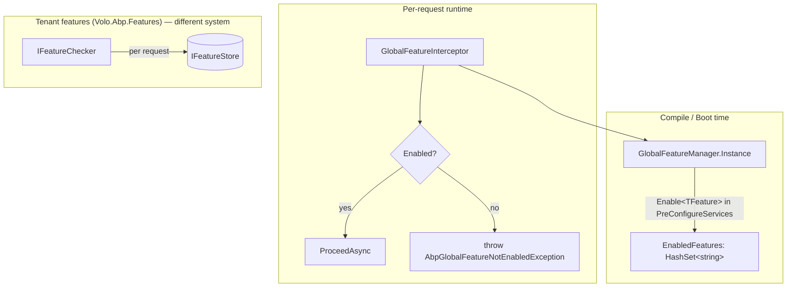

Global features are ABP's *compile-time*, host-static toggles — set once at application startup (typically in `PreConfigureServices`) and never per-tenant or per-user. They exist to remove whole subsystems from a host: an e-commerce product can ship modules for "Reviews", "Wishlist", "TaxJar integration"; the host module enables only the ones the product owner wants for that deployment. The runtime then refuses to materialise services from disabled features, hides their navigation entries, and trips a `simple-state checker` so domain logic gated by `RequireGlobalFeatures(...)` short-circuits cleanly. This is a different system from the [tenant feature flags](/settings-features/features-overview) — there is no per-request resolution, no database, no UI: only a static `HashSet<string>` on `GlobalFeatureManager.Instance`.

<Info>
  Source root: `framework/src/Volo.Abp.GlobalFeatures/Volo/Abp/GlobalFeatures/`. Module: `AbpGlobalFeaturesModule.cs`. The whole package depends only on `AbpLocalizationModule`, `AbpVirtualFileSystemModule`, `AbpAuthorizationAbstractionsModule`.
</Info>

## File inventory

| File | Symbol | Role |
| --- | --- | --- |
| `AbpGlobalFeaturesModule.cs` | `AbpGlobalFeaturesModule` | Module: wires `GlobalFeatureInterceptorRegistrar`, localisation. |
| `GlobalFeatureManager.cs` | `GlobalFeatureManager` (with `static Instance`) | Hash-set of enabled feature names; `Enable<T>()`, `Disable<T>()`, `IsEnabled<T>()`. |
| `GlobalFeature.cs` | `GlobalFeature` (abstract) | One feature owned by a `GlobalModuleFeatures`; bridges `IsEnabled` to the manager. |
| `GlobalModuleFeatures.cs` | `GlobalModuleFeatures` (abstract) | Per-module bag of `GlobalFeature`s with `EnableAll` / `DisableAll`. |
| `GlobalModuleFeaturesDictionary.cs` | `GlobalModuleFeaturesDictionary` | `Dictionary<string, GlobalModuleFeatures>` exposed by the manager. |
| `GlobalFeatureDictionary.cs` | `GlobalFeatureDictionary` | `Dictionary<string, GlobalFeature>` per module. |
| `GlobalFeatureNameAttribute.cs` | `[GlobalFeatureName("...")]` | Maps a CLR type to its global feature name. |
| `RequiresGlobalFeatureAttribute.cs` | `[RequiresGlobalFeature(typeof(X))]` / `("X")` | Class-level declarative gate. |
| `IGlobalFeatureCheckingEnabled.cs` | marker interface | Tells the registrar "intercept me". |
| `GlobalFeatureInterceptor.cs` | `GlobalFeatureInterceptor` | Castle interceptor: throws `AbpGlobalFeatureNotEnabledException`. |
| `GlobalFeatureInterceptorRegistrar.cs` | static | Adds the interceptor to every `IGlobalFeatureCheckingEnabled` service. |
| `GlobalFeatureHelper.cs` | `GlobalFeatureHelper.IsGlobalFeatureEnabled(type, out attr)` | Single reflection-based check. |
| `RequireGlobalFeaturesSimpleStateChecker.cs` | simple-state checker | Plugs global features into `IHasSimpleStateCheckers`. |
| `GlobalFeatureSimpleStateCheckerExtensions.cs` | `state.RequireGlobalFeatures(...)` | Fluent attach. |
| `AbpGlobalFeatureNotEnabledException.cs` | exception | Thrown by the interceptor; carries `Code` (`AbpGlobalFeatureErrorCodes.GlobalFeatureIsNotEnabled`) and `ServiceName` / `GlobalFeatureName` data. |

## How it differs from tenant features



| | Global features | Tenant features |
| --- | --- | --- |
| Where defined | C# types decorated with `[GlobalFeatureName(...)]` | `FeatureDefinitionProvider.Define(...)` |
| Where enabled | `PreConfigureServices` in a module — once | Runtime, per-tenant, via [feature-management module](/settings-features/feature-management-module) |
| Storage | `HashSet<string>` on a static singleton | `AbpFeatureValues` table |
| Per-tenant variation | none | yes |
| Removed code paths | yes — interceptor throws, navigation/menu hidden | no — code path stays, feature check returns `false` |
| Cross-host change | requires redeploy | live |

A typical ABP commercial module ships both: a class-level `[RequiresGlobalFeature(typeof(MyModule.MyAdvancedSubFeature))]` to remove the subsystem from hosts that don't want it, and `FeatureDefinitionProvider`-defined tenant flags to gate per-tenant usage *within* hosts that did enable it.

## `GlobalFeatureManager`

```csharp
public class GlobalFeatureManager
{
    public static GlobalFeatureManager Instance { get; protected set; } = new GlobalFeatureManager();

    public Dictionary<object, object> Configuration { get; }
    public GlobalModuleFeaturesDictionary Modules { get; }
    protected HashSet<string> EnabledFeatures { get; }

    public virtual bool IsEnabled<TFeature>() => IsEnabled(typeof(TFeature));
    public virtual bool IsEnabled(Type featureType)
        => IsEnabled(GlobalFeatureNameAttribute.GetName(featureType));
    public virtual bool IsEnabled(string featureName)
        => EnabledFeatures.Contains(featureName);

    public virtual void Enable<TFeature>() => Enable(typeof(TFeature));
    public virtual void Enable(Type featureType)
        => Enable(GlobalFeatureNameAttribute.GetName(featureType));
    public virtual void Enable(string featureName)
        => EnabledFeatures.AddIfNotContains(featureName);

    public virtual void Disable<TFeature>() => Disable(typeof(TFeature));
    public virtual void Disable(Type featureType)
        => Disable(GlobalFeatureNameAttribute.GetName(featureType));
    public virtual void Disable(string featureName)
        => EnabledFeatures.Remove(featureName);

    public virtual IEnumerable<string> GetEnabledFeatureNames()
        => EnabledFeatures;
}
```

The `Instance` static is the key — there is intentionally no DI seam. The manager has to be readable from places that don't have an `IServiceProvider`: type initialisers, source generators, navigation contributors. The trade-off is testability — global features in tests must be set/cleared around each test (or use `[Collection]` to serialise them).

### Why `Configuration` exists

`Configuration` is a freeform `Dictionary<object, object>` used by modules to attach payloads that *describe* the enabled feature — e.g. an integration module may store a `ConnectionStringName` on it once enabled. The dictionary is consulted by other startup code without going through DI.

## Defining a feature

Two attributes plus a class per feature, grouped under a module's `GlobalModuleFeatures` bag.

```csharp
// 1. The feature type — a marker class with [GlobalFeatureName].
[GlobalFeatureName("MyApp.Reviews")]
public class ReviewsFeature : GlobalFeature
{
    internal ReviewsFeature(MyAppGlobalFeatures module) : base(module) { }
}

// 2. The module bag — usually owned by the module that defines the features.
public class MyAppGlobalFeatures : GlobalModuleFeatures
{
    public MyAppGlobalFeatures(GlobalFeatureManager featureManager) : base(featureManager)
    {
        AddFeature(Reviews = new ReviewsFeature(this));
        AddFeature(Wishlist = new WishlistFeature(this));
    }

    public ReviewsFeature Reviews { get; }
    public WishlistFeature Wishlist { get; }
}

// 3. A static accessor — the convention you'll see in Volo's commercial modules.
public static class MyAppGlobalFeatureConfigurator
{
    private static readonly OneTimeRunner OneTimeRunner = new();

    public static void Configure(Action<MyAppGlobalFeatures> configureAction)
    {
        OneTimeRunner.Run(() =>
        {
            GlobalFeatureManager.Instance.Modules.AddIfNotContains(
                "MyApp",
                () => new MyAppGlobalFeatures(GlobalFeatureManager.Instance));
        });

        configureAction(
            GlobalFeatureManager.Instance.Modules.Get<MyAppGlobalFeatures>("MyApp"));
    }
}
```

The host module then enables what it wants in `PreConfigureServices`:

```csharp
public override void PreConfigureServices(ServiceConfigurationContext context)
{
    MyAppGlobalFeatureConfigurator.Configure(features =>
    {
        features.Reviews.Enable();
        features.Wishlist.Disable();
        // or: features.EnableAll();
    });
}
```

`GlobalFeature` itself wires `IsEnabled` straight to the manager:

```csharp
public abstract class GlobalFeature
{
    public GlobalModuleFeatures Module { get; }
    public GlobalFeatureManager FeatureManager { get; }
    public string FeatureName { get; }

    public bool IsEnabled
    {
        get => FeatureManager.IsEnabled(FeatureName);
        set => SetEnabled(value);
    }

    protected GlobalFeature(GlobalModuleFeatures module)
    {
        Module = Check.NotNull(module, nameof(module));
        FeatureManager = Module.FeatureManager;
        FeatureName = GlobalFeatureNameAttribute.GetName(GetType());
    }

    public virtual void Enable() => FeatureManager.Enable(FeatureName);
    public virtual void Disable() => FeatureManager.Disable(FeatureName);
    public void SetEnabled(bool isEnabled) { if (isEnabled) Enable(); else Disable(); }
}
```

`GlobalFeatureNameAttribute.GetName(type)` requires the type to carry `[GlobalFeatureName]` — it throws `AbpException` otherwise.

## Class-level gating: `[RequiresGlobalFeature]`

The most common use — gate an entire application service or controller:

```csharp
[RequiresGlobalFeature(typeof(ReviewsFeature))]
public class ReviewAppService : ApplicationService, IReviewAppService, IGlobalFeatureCheckingEnabled
{
    public Task<ReviewDto> GetAsync(Guid id) { /* ... */ }
}
```

Three pieces collaborate:

1. **`IGlobalFeatureCheckingEnabled`** — marker interface. Without it, the registrar does not attach the interceptor.
2. **`GlobalFeatureInterceptorRegistrar`** — registers `GlobalFeatureInterceptor` on every service whose `ImplementationType` implements the marker.
3. **`GlobalFeatureInterceptor`** — at call time:

```csharp
public override async Task InterceptAsync(IAbpMethodInvocation invocation)
{
    if (AbpCrossCuttingConcerns.IsApplied(invocation.TargetObject,
                                          AbpCrossCuttingConcerns.GlobalFeatureChecking))
    {
        await invocation.ProceedAsync();
        return;
    }

    if (!GlobalFeatureHelper.IsGlobalFeatureEnabled(
            invocation.TargetObject.GetType(), out var attribute))
    {
        throw new AbpGlobalFeatureNotEnabledException(
                code: AbpGlobalFeatureErrorCodes.GlobalFeatureIsNotEnabled)
            .WithData("ServiceName", invocation.TargetObject.GetType().FullName!)
            .WithData("GlobalFeatureName", attribute!.Name!);
    }

    await invocation.ProceedAsync();
}
```

```csharp
// GlobalFeatureHelper.cs
public static bool IsGlobalFeatureEnabled(Type type, out RequiresGlobalFeatureAttribute? attribute)
{
    attribute = ReflectionHelper.GetSingleAttributeOrDefault<RequiresGlobalFeatureAttribute>(type);
    return attribute == null || GlobalFeatureManager.Instance.IsEnabled(attribute.GetFeatureName());
}
```

So an unattributed type is always allowed; an attributed type only proceeds when the manager reports the feature enabled.

The attribute supports both forms:

```csharp
[RequiresGlobalFeature(typeof(ReviewsFeature))]   // resolved via [GlobalFeatureName]
[RequiresGlobalFeature("MyApp.Reviews")]           // raw name
```

```csharp
public RequiresGlobalFeatureAttribute(Type type)  { Type = type; }
public RequiresGlobalFeatureAttribute(string name) { Name = name; }
public virtual string GetFeatureName()
    => Name ?? GlobalFeatureNameAttribute.GetName(Type!);
```

## Module wiring

```csharp
[DependsOn(
    typeof(AbpLocalizationModule),
    typeof(AbpVirtualFileSystemModule),
    typeof(AbpAuthorizationAbstractionsModule)
)]
public class AbpGlobalFeaturesModule : AbpModule
{
    public override void PreConfigureServices(ServiceConfigurationContext context)
    {
        context.Services.OnRegistered(GlobalFeatureInterceptorRegistrar.RegisterIfNeeded);
    }
    /* localisation wiring omitted */
}
```

Registrar:

```csharp
public static void RegisterIfNeeded(IOnServiceRegistredContext context)
{
    if (ShouldIntercept(context.ImplementationType))
    {
        context.Interceptors.TryAdd<GlobalFeatureInterceptor>();
    }
}

private static bool ShouldIntercept(Type type)
    => !DynamicProxyIgnoreTypes.Contains(type)
       && typeof(IGlobalFeatureCheckingEnabled).IsAssignableFrom(type);
```

Note this is a **module-level concern** but enabling/disabling happens *before* DI is built. The interceptor reads `GlobalFeatureManager.Instance` directly — no service-provider scope needed.

## Simple-state checking

For domain entities whose state depends on which subsystem ships, plug a `RequireGlobalFeaturesSimpleStateChecker`:

```csharp
public class Product : AggregateRoot<Guid>, IHasSimpleStateCheckers<Product>
{
    public List<ISimpleStateChecker<Product>> StateCheckers { get; } = new();

    public Product()
    {
        this.RequireGlobalFeatures(typeof(ReviewsFeature));
        // or by name: this.RequireGlobalFeatures("MyApp.Reviews");
    }
}
```

The checker (`RequireGlobalFeaturesSimpleStateChecker<TState>`) returns:

```csharp
public Task<bool> IsEnabledAsync(SimpleStateCheckerContext<TState> context)
{
    var isEnabled = RequiresAll
        ? GlobalFeatureNames.All(x => GlobalFeatureManager.Instance.IsEnabled(x))
        : GlobalFeatureNames.Any(x => GlobalFeatureManager.Instance.IsEnabled(x));
    return Task.FromResult(isEnabled);
}
```

Useful for things like "this entity's `IsActive` should be `false` when the Reviews feature is off in this deployment". The fluent extensions live in `GlobalFeatureSimpleStateCheckerExtensions`:

```csharp
public static TState RequireGlobalFeatures<TState>(this TState state,
                                                   params Type[] globalFeatures)
    where TState : IHasSimpleStateCheckers<TState>
    => state.RequireGlobalFeatures(true, globalFeatures);
```

## Exception shape

When a gated service is called while disabled, the interceptor throws:

```csharp
public class AbpGlobalFeatureNotEnabledException : AbpException, IHasErrorCode
{
    public string? Code { get; }
    public AbpGlobalFeatureNotEnabledException(string? message = null,
                                               string? code = null,
                                               Exception? innerException = null)
        : base(message, innerException) { Code = code; }

    public AbpGlobalFeatureNotEnabledException WithData(string name, object value)
    { Data[name] = value; return this; }
}
```

The `Code` is `AbpGlobalFeatureErrorCodes.GlobalFeatureIsNotEnabled`; the `Data` dictionary carries `ServiceName` and `GlobalFeatureName`. The exception is mapped to a localised message via `AbpExceptionLocalizationOptions.MapCodeNamespace("Volo.GlobalFeature", typeof(AbpGlobalFeatureResource))`. In an HTTP API context the standard exception-to-HTTP middleware turns it into a 403 with a structured body.

## Bypass

If you need to call a globally-disabled service from a startup-time admin tool, wrap the call with the cross-cutting-concern marker:

```csharp
using (AbpCrossCuttingConcerns.Applying(target, AbpCrossCuttingConcerns.GlobalFeatureChecking))
{
    await target.SomeOperation();
}
```

The interceptor's first `if` short-circuits on that marker and proceeds.

## When to choose what

| Need | Use |
| --- | --- |
| Strip a subsystem at deployment time and never run it | global feature (`[RequiresGlobalFeature]`) |
| Vary a capability per tenant | [tenant feature](/settings-features/features-overview) (`[RequiresFeature]`) |
| Vary a value per user (preferred language, page size) | [setting](/settings-features/settings-overview) (`ISettingProvider`) |
| Authorise an *action* | [permission](/authz) (`[Authorize]`) |

## Cross-references

- [Features overview](/settings-features/features-overview) — tenant/edition feature flags. Different system; resolved per request.
- [Feature management module](/settings-features/feature-management-module) — persistence and management UI for tenant features (not global ones).
- [Settings overview](/settings-features/settings-overview) — per-user/global setting values.
- [Multi-tenancy](/multitenancy) — orthogonal: a global feature is host-wide and doesn't vary by tenant.
- [Authorization](/authz) — `AbpGlobalFeatureNotEnabledException` reaches the same exception-to-HTTP pipeline that handles `AbpAuthorizationException`.

<Tip>
  For unit tests, snapshot `GlobalFeatureManager.Instance.GetEnabledFeatureNames()` at setup and restore at teardown — or wrap test code in `using var _ = AbpCrossCuttingConcerns.Applying(target, AbpCrossCuttingConcerns.GlobalFeatureChecking)` to bypass the interceptor.
</Tip>
