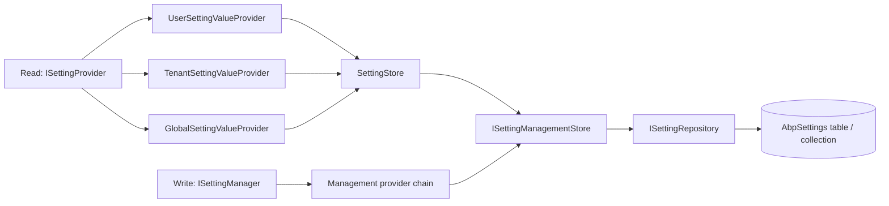

`modules/setting-management/` is the optional, opinionated layer that turns ABP's framework-level setting system into a fully manageable feature. It registers a real `ISettingStore` on top of an `AbpSettings` table (or MongoDB collection), adds a parallel chain of `ISettingManagementProvider`s for *writing* values per provider/key, exposes `ISettingManager` plus `IEmailSettingsAppService` / `ITimeZoneSettingsAppService`, and ships a settings UI (Razor Pages, Blazor, Angular). The framework primitives still live in `Volo.Abp.Settings` and stay reusable on their own; this module is what most production hosts pull in to make settings durable and editable.

<Info>
  Source root: `modules/setting-management/src/`. Pair with [Settings overview](/settings-features/settings-overview) and [Setting providers](/settings-features/setting-providers) before reading this page — the management module mirrors that framework chain almost shape-for-shape.
</Info>

## Project layout

| Project | Purpose |
| --- | --- |
| `Volo.Abp.SettingManagement.Domain.Shared` | Shared constants (`SettingConsts`, `SettingDefinitionRecordConsts`), `AbpSettingManagementDbProperties`. |
| `Volo.Abp.SettingManagement.Domain` | `Setting` aggregate, `SettingManager`, `ISettingManagementProvider` chain, `SettingStore`, dynamic definition store. |
| `Volo.Abp.SettingManagement.EntityFrameworkCore` | `EfCoreSettingRepository`, `EfCoreSettingDefinitionRecordRepository`, `SettingManagementDbContext`. |
| `Volo.Abp.SettingManagement.MongoDB` | MongoDB equivalents. |
| `Volo.Abp.SettingManagement.Application.Contracts` | `IEmailSettingsAppService`, `ITimeZoneSettingsAppService`, DTOs, `SettingManagementPermissions`. |
| `Volo.Abp.SettingManagement.Application` | `EmailSettingsAppService`, `TimeZoneSettingsAppService`, `UserDeletedEventHandler`. |
| `Volo.Abp.SettingManagement.HttpApi` / `.HttpApi.Client` | REST surface for the two app services. |
| `Volo.Abp.SettingManagement.Web` | Razor Pages UI: `Pages/SettingManagement/Index.cshtml`, page-contributor extensibility. |
| `Volo.Abp.SettingManagement.Blazor` / `.Blazor.Server` / `.Blazor.WebAssembly` | Blazor management pages. |
| `Volo.Abp.SettingManagement.Installer` | NuGet installer hook used by the ABP CLI. |

## Key domain files

| File | Symbol | Role |
| --- | --- | --- |
| `Setting.cs` | `Setting : Entity<Guid>, IAggregateRoot<Guid>` | Persisted row: `Name`, `Value`, `ProviderName`, `ProviderKey`. |
| `SettingDefinitionRecord.cs` | `SettingDefinitionRecord` | Persisted definition (used when `SaveStaticSettingsToDatabase = true`). |
| `ISettingManager.cs` / `SettingManager.cs` | `ISettingManager` | Read/write façade with `(providerName, providerKey)` addressing. |
| `ISettingManagementProvider.cs` / `SettingManagementProvider.cs` | `ISettingManagementProvider` | Per-scope write providers, parallel to `ISettingValueProvider`. |
| `DefaultValueSettingManagementProvider.cs` | provider `"D"` | Read-only — returns `SettingDefinition.DefaultValue`. |
| `ConfigurationSettingManagementProvider.cs` | provider `"C"` | Read-only — reads `IConfiguration`. |
| `GlobalSettingManagementProvider.cs` | provider `"G"` | Read/write at global scope. |
| `TenantSettingManagementProvider.cs` | provider `"T"` | Read/write keyed by `ICurrentTenant.Id`. |
| `UserSettingManagementProvider.cs` | provider `"U"` | Read/write keyed by user id. |
| `ISettingManagementStore.cs` / `SettingManagementStore.cs` | `ISettingManagementStore` | Repository-level read/write/delete over `Setting`. |
| `SettingStore.cs` | `SettingStore : ISettingStore` | Bridges the framework `ISettingStore` to `ISettingManagementStore` so framework reads see the same rows. |
| `DynamicSettingDefinitionStore.cs` | `IDynamicSettingDefinitionStore` impl | Returns `SettingDefinitionRecord`s as `SettingDefinition`s. |
| `StaticSettingSaver.cs` | `IStaticSettingSaver` | At boot, persists definitions from `ISettingDefinitionProvider`s to `AbpSettingDefinitions`. |
| `SettingManagementOptions.cs` | `SettingManagementOptions` | Configures the management providers and the static→DB sync. |
| `AbpSettingManagementDomainModule.cs` | module | Registers providers and kicks off background dynamic-store init. |

## Tenant + global writes — the management provider chain

The management module installs its *own* chain on `SettingManagementOptions.Providers` — independent of the framework's `AbpSettingOptions.ValueProviders` but addressing the same `(name, providerName, providerKey)` tuple in storage:

```csharp
// AbpSettingManagementDomainModule.cs
Configure<SettingManagementOptions>(options =>
{
    options.Providers.Add<DefaultValueSettingManagementProvider>();
    options.Providers.Add<ConfigurationSettingManagementProvider>();
    options.Providers.Add<GlobalSettingManagementProvider>();
    options.Providers.Add<TenantSettingManagementProvider>();
    options.Providers.Add<UserSettingManagementProvider>();
});
```

`ISettingManagementProvider` is the write counterpart of `ISettingValueProvider`:

```csharp
public interface ISettingManagementProvider
{
    string Name { get; }
    Task<string> GetOrNullAsync(SettingDefinition setting, string providerKey);
    Task SetAsync(SettingDefinition setting, string value, string providerKey);
    Task ClearAsync(SettingDefinition setting, string providerKey);
}
```

The shared base class normalizes the key (so the tenant provider, for instance, picks up the ambient `ICurrentTenant.Id` when the caller passes `null`):

```csharp
// SettingManagementProvider.cs
public virtual async Task<string> GetOrNullAsync(SettingDefinition setting, string providerKey)
    => await SettingManagementStore.GetOrNullAsync(setting.Name, Name, NormalizeProviderKey(providerKey));

public virtual async Task SetAsync(SettingDefinition setting, string value, string providerKey)
    => await SettingManagementStore.SetAsync(setting.Name, value, Name, NormalizeProviderKey(providerKey));

public virtual async Task ClearAsync(SettingDefinition setting, string providerKey)
    => await SettingManagementStore.DeleteAsync(setting.Name, Name, NormalizeProviderKey(providerKey));

protected virtual string NormalizeProviderKey(string providerKey) => providerKey;
```

```csharp
// TenantSettingManagementProvider.cs
public override string Name => TenantSettingValueProvider.ProviderName; // "T"

protected override string NormalizeProviderKey(string providerKey)
{
    if (providerKey != null) return providerKey;
    return CurrentTenant.Id?.ToString();
}
```

That's the only difference between providers: the override of `NormalizeProviderKey` (or, for `UserSettingManagementProvider`, reading `ICurrentUser.Id`).

## Bridging into the framework chain

The reason a setting *written* via `ISettingManager.SetAsync(name, value, "T", tenantId)` is *read* by `TenantSettingValueProvider` is `SettingStore`:

```csharp
public class SettingStore : ISettingStore, ITransientDependency
{
    protected ISettingManagementStore ManagementStore { get; }

    public SettingStore(ISettingManagementStore managementStore)
    {
        ManagementStore = managementStore;
    }

    public virtual Task<string> GetOrNullAsync(string name, string providerName, string providerKey)
        => ManagementStore.GetOrNullAsync(name, providerName, providerKey);

    public virtual Task<List<SettingValue>> GetAllAsync(string[] names, string providerName, string providerKey)
        => ManagementStore.GetListAsync(names, providerName, providerKey);
}
```

`SettingStore` is `ITransientDependency` — its registration overrides the framework's `NullSettingStore` (which uses `TryRegister = true`). The `GlobalSettingValueProvider` / `UserSettingValueProvider` and the (added-here) `TenantSettingValueProvider` then transparently hit the EF/Mongo backing.



## `ISettingManager` — the read/write facade

```csharp
// ISettingManager.cs
public interface ISettingManager
{
    Task<string> GetOrNullAsync(string name, string providerName, string providerKey, bool fallback = true);
    Task<List<SettingValue>> GetAllAsync(string providerName, string providerKey, bool fallback = true);
    Task SetAsync(string name, string value, string providerName, string providerKey, bool forceToSet = false);
    Task DeleteAsync(string providerName, string providerKey);
}
```

Plus typed extensions for each scope:

```csharp
await settingManager.GetOrNullDefaultAsync("MyApp.PageSize");
await settingManager.GetOrNullGlobalAsync("MyApp.PageSize");
await settingManager.GetOrNullForCurrentTenantAsync("MyApp.PageSize");
await settingManager.SetForCurrentTenantAsync("MyApp.PageSize", "50");
await settingManager.SetGlobalAsync("MyApp.PageSize", "20");
```

These live in `*SettingManagerExtensions.cs` files (`GlobalSettingManagerExtensions`, `TenantSettingManagerExtensions`, `UserSettingManagerExtensions`, `DefaultValueSettingManagerExtensions`, `ConfigurationValueSettingManagerExtensions`).

### Read with fallback

`SettingManager.GetAllAsync(providerName, providerKey, fallback = true)` walks the configured chain **from the target rung downward** (`SkipWhile(c => c.Name != providerName)`), accumulating values so a more-specific rung overrides a less-specific one. When `fallback = false`, only the matching rung answers — useful for "what is set *just* at this tenant?" in management UIs.

### Write semantics

`SettingManager.SetAsync` looks up the definition, validates the value, encrypts it if `IsEncrypted`, then calls the matching provider's `SetAsync`. If the new value equals the *resolved* value from the fallback chain, the row is *cleared* instead of inserted — keeping the table sparse. `forceToSet = true` overrides that optimisation.

## Persistence

### Entity

```csharp
public class Setting : Entity<Guid>, IAggregateRoot<Guid>
{
    public virtual string Name { get; protected set; }
    public virtual string Value { get; internal set; }
    public virtual string ProviderName { get; protected set; }
    public virtual string ProviderKey { get; protected set; }
    // ctor: (id, name, value, providerName = null, providerKey = null)
}
```

### EF Core mapping

```csharp
// SettingManagementDbContextModelBuilderExtensions.cs
builder.Entity<Setting>(b =>
{
    b.ToTable(AbpSettingManagementDbProperties.DbTablePrefix + "Settings",
              AbpSettingManagementDbProperties.DbSchema);
    b.ConfigureByConvention();
    b.Property(x => x.Name).HasMaxLength(SettingConsts.MaxNameLength).IsRequired();
    if (builder.IsUsingOracle()) { SettingConsts.MaxValueLengthValue = 2000; }
    b.Property(x => x.Value).HasMaxLength(SettingConsts.MaxValueLengthValue).IsRequired();
    b.Property(x => x.ProviderName).HasMaxLength(SettingConsts.MaxProviderNameLength);
    b.Property(x => x.ProviderKey).HasMaxLength(SettingConsts.MaxProviderKeyLength);
    b.HasIndex(x => new { x.Name, x.ProviderName, x.ProviderKey }).IsUnique(true);
    b.ApplyObjectExtensionMappings();
});
```

The composite uniqueness on `(Name, ProviderName, ProviderKey)` is what guarantees one row per (setting, scope) tuple. A `SettingDefinitionRecord` table is also configured for the dynamic store.

### MongoDB

`Volo.Abp.SettingManagement.MongoDB` maps the same aggregates to `AbpSettings` / `AbpSettingDefinitions` collections. Pick the DB technology by depending on either `Volo.Abp.SettingManagement.EntityFrameworkCore` or `Volo.Abp.SettingManagement.MongoDB` in your host.

## Static-to-dynamic sync

`SettingManagementOptions` controls how compile-time `SettingDefinition`s get into the database so they can be managed by tenants and the dynamic store:

```csharp
public class SettingManagementOptions
{
    public ITypeList<ISettingManagementProvider> Providers { get; }
    public bool SaveStaticSettingsToDatabase { get; set; } = true;
    public bool IsDynamicSettingStoreEnabled { get; set; } // default false
}
```

At application startup the domain module spawns a background task:

```csharp
// AbpSettingManagementDomainModule.cs (excerpt)
public override Task OnApplicationInitializationAsync(ApplicationInitializationContext context)
{
    InitializeDynamicSettings(context);
    return Task.CompletedTask;
}
```

It uses Polly for retry, then calls `IStaticSettingSaver.SaveAsync()` to upsert `SettingDefinitionRecord` rows, and finally pre-warms `IDynamicSettingDefinitionStore.GetAllAsync()`. In data-migration environments (`IsDataMigrationEnvironment()`), both flags are disabled — the host is not supposed to mutate setting definitions while running `dotnet ef database update`.

## Application services

Two app services ship out of the box:

```csharp
public interface IEmailSettingsAppService : IApplicationService
{
    Task<EmailSettingsDto> GetAsync();
    Task UpdateAsync(UpdateEmailSettingsDto input);
    Task SendTestEmailAsync(SendTestEmailInput input);
}

public interface ITimeZoneSettingsAppService : IApplicationService
{
    // (see source — Get / Update plus a list of system time zones)
}
```

Both delegate to `ISettingManager` under the hood. Permissions live in `SettingManagementPermissions`:

```csharp
public class SettingManagementPermissions
{
    public const string GroupName = "SettingManagement";
    public const string Emailing = GroupName + ".Emailing";
    public const string EmailingTest = Emailing + ".Test";
    public const string TimeZone = GroupName + ".TimeZone";
}
```

`SettingManagementPermissionDefinitionProvider` registers them; the [authorization system](/authz) checks them on `[Authorize(SettingManagementPermissions.Emailing)]` attributes (or via dynamic `IAuthorizationService` calls).

## Management UI

The Web project ships a `/SettingManagement` page composed of *contributors*:

```csharp
// ISettingPageContributor.cs
public interface ISettingPageContributor
{
    Task ConfigureAsync(SettingPageCreationContext context);
    Task<bool> CheckPermissionsAsync(SettingPageCreationContext context);
}
```

Two contributors ship: `EmailingPageContributor`, `TimeZonePageContributor`. Modules add their own contributors via `Configure<SettingManagementPageOptions>(o => o.Contributors.Add<MyContributor>())`. Blazor and Angular hosts have parallel UI assemblies that consume the same HTTP API.

## Wiring it into a host

```csharp
[DependsOn(
    typeof(AbpSettingManagementApplicationModule),
    typeof(AbpSettingManagementEntityFrameworkCoreModule),
    typeof(AbpSettingManagementHttpApiModule),
    typeof(AbpSettingManagementWebModule) // or Blazor / WebAssembly equivalents
)]
public class MyHostModule : AbpModule { /* ... */ }
```

Then in the DbContext:

```csharp
public class MyAppDbContext : AbpDbContext<MyAppDbContext>, ISettingManagementDbContext
{
    public DbSet<Setting> Settings { get; set; }
    public DbSet<SettingDefinitionRecord> SettingDefinitionRecords { get; set; }

    protected override void OnModelCreating(ModelBuilder builder)
    {
        base.OnModelCreating(builder);
        builder.ConfigureSettingManagement();
    }
}
```

Add an EF migration; on first run the dynamic-store background task upserts every defined static setting into `AbpSettingDefinitions` and the management UI lights up.

## How user deletion is handled

`UserDeletedEventHandler` (in `.Application`) listens for the user-deleted distributed event and calls `ISettingManager.DeleteAsync("U", userId)` to garbage-collect any user-scoped settings — so removing a user does not leave orphan rows.

## Cross-references

- [Settings overview](/settings-features/settings-overview) — the framework-level abstractions this module sits on top of.
- [Setting providers](/settings-features/setting-providers) — value provider chain that reads rows written by `ISettingManager`.
- [Feature management module](/settings-features/feature-management-module) — sibling module with the same shape for feature flags.
- [Authorization](/authz) — permission definitions and policy checks gating the management endpoints.
- [Multi-tenancy](/multitenancy) — how `ICurrentTenant` resolves the `"T"` provider key automatically.
- Source: `modules/setting-management/src/` and corresponding test projects in `modules/setting-management/test/`.

<Tip>
  Need an edition-scoped setting? Add a `EditionSettingValueProvider` (framework side) **and** a matching `EditionSettingManagementProvider` (this module). Both must report the same `Name` (e.g. `"E"`) so a row written via the management provider is read back through the value provider.
</Tip>
