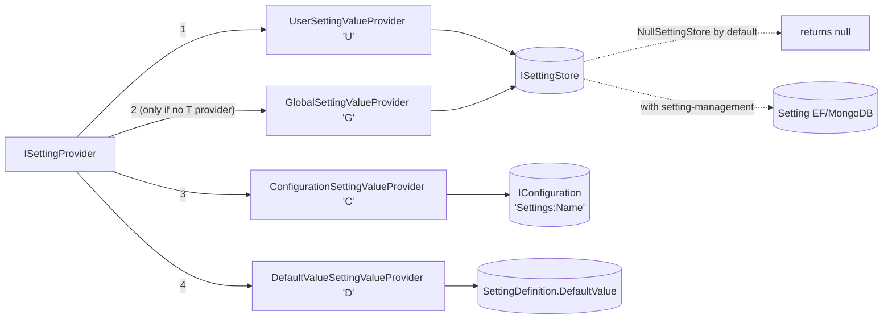

A single setting read in ABP walks an ordered chain of `ISettingValueProvider` instances and returns the first non-null value. The chain itself is configured through `AbpSettingOptions.ValueProviders` (an `ITypeList<ISettingValueProvider>`), resolved lazily by `SettingValueProviderManager`, and reversed at read-time inside `SettingProvider`. The four built-in providers live alongside their abstractions in `framework/src/Volo.Abp.Settings/Volo/Abp/Settings/` — they are deliberately tiny, each one mapping a single backing source (default value, configuration, global key/value, user key/value) to the uniform `(SettingDefinition) -> string?` contract.

<Info>
  The persistent backing — `ISettingStore` — has a no-op default (`NullSettingStore`). It only becomes useful when the [setting-management module](/settings-features/setting-management-module) replaces it with `SettingStore` over an EF Core or MongoDB repository.
</Info>

## Source map

| File | Symbol | Responsibility |
| --- | --- | --- |
| `ISettingValueProvider.cs` | `ISettingValueProvider` | Contract: `Name`, `GetOrNullAsync(SettingDefinition)`, `GetAllAsync(SettingDefinition[])`. |
| `SettingValueProvider.cs` | `SettingValueProvider` (abstract) | Base class injecting `ISettingStore`. |
| `DefaultValueSettingValueProvider.cs` | provider `"D"` | Returns `setting.DefaultValue`. |
| `ConfigurationSettingValueProvider.cs` | provider `"C"` | Reads `IConfiguration["Settings:<Name>"]`. |
| `GlobalSettingValueProvider.cs` | provider `"G"` | Reads `ISettingStore.GetOrNullAsync(name, "G", null)`. |
| `UserSettingValueProvider.cs` | provider `"U"` | Reads `ISettingStore` with `providerKey = ICurrentUser.Id`. |
| `ISettingStore.cs` | `ISettingStore` | `(name, providerName, providerKey) -> string?`. |
| `NullSettingStore.cs` | `NullSettingStore` | Default `try-register` no-op store. |
| `ISettingValueProviderManager.cs` / `SettingValueProviderManager.cs` | `ISettingValueProviderManager` | `Lazy<List<ISettingValueProvider>>` resolved from options. |

## The contracts

```csharp
// ISettingValueProvider.cs
public interface ISettingValueProvider
{
    string Name { get; }

    Task<string?> GetOrNullAsync([NotNull] SettingDefinition setting);

    Task<List<SettingValue>> GetAllAsync([NotNull] SettingDefinition[] settings);
}
```

```csharp
// SettingValueProvider.cs
public abstract class SettingValueProvider : ISettingValueProvider, ITransientDependency
{
    public abstract string Name { get; }

    protected ISettingStore SettingStore { get; }

    protected SettingValueProvider(ISettingStore settingStore)
    {
        SettingStore = settingStore;
    }

    public abstract Task<string?> GetOrNullAsync(SettingDefinition setting);
    public abstract Task<List<SettingValue>> GetAllAsync(SettingDefinition[] settings);
}
```

`SettingValueProvider` is registered as `ITransientDependency` — every concrete provider that inherits it is auto-registered. The provider that does not need an `ISettingStore` (`ConfigurationSettingValueProvider`) implements `ISettingValueProvider` directly and brings its own `ITransientDependency` marker.

```csharp
// ISettingStore.cs
public interface ISettingStore
{
    Task<string?> GetOrNullAsync(
        [NotNull] string name,
        string? providerName,
        string? providerKey
    );

    Task<List<SettingValue>> GetAllAsync(
        [NotNull] string[] names,
        string? providerName,
        string? providerKey
    );
}
```

The `(providerName, providerKey)` tuple is the persistence-level discriminator. `"G"` + `null` is the host/global value; `"U"` + `"<user-guid>"` is a user-scoped override; the [setting-management module](/settings-features/setting-management-module) adds `"T"` + `"<tenant-guid>"` via a `TenantSettingValueProvider` and matching `TenantSettingManagementProvider`.

## Provider chain diagram



The chain is iterated by `SettingProvider.GetOrNullValueFromProvidersAsync`:

```csharp
protected virtual async Task<string?> GetOrNullValueFromProvidersAsync(
    IEnumerable<ISettingValueProvider> providers,
    SettingDefinition setting)
{
    foreach (var provider in providers)
    {
        var value = await provider.GetOrNullAsync(setting);
        if (value != null)
        {
            return value;
        }
    }
    return null;
}
```

A `null` value from a provider means "I don't have it" — empty string or `"false"` are *resolved* values that short-circuit the chain.

## Provider 1 — `DefaultValueSettingValueProvider`

The last resort. Reads from the definition object itself.

```csharp
// DefaultValueSettingValueProvider.cs
public class DefaultValueSettingValueProvider : SettingValueProvider
{
    public const string ProviderName = "D";

    public override string Name => ProviderName;

    public DefaultValueSettingValueProvider(ISettingStore settingStore)
        : base(settingStore) { }

    public override Task<string?> GetOrNullAsync(SettingDefinition setting)
    {
        return Task.FromResult(setting.DefaultValue);
    }

    public override Task<List<SettingValue>> GetAllAsync(SettingDefinition[] settings)
    {
        return Task.FromResult(
            settings.Select(x => new SettingValue(x.Name, x.DefaultValue)).ToList()
        );
    }
}
```

Note: it takes an `ISettingStore` to fit the base class but never uses it.

## Provider 2 — `ConfigurationSettingValueProvider`

Reads `IConfiguration` with a fixed `Settings:` prefix. This is how you ship a config-driven override (env var, `appsettings.json`, Azure App Configuration, …).

```csharp
// ConfigurationSettingValueProvider.cs
public class ConfigurationSettingValueProvider : ISettingValueProvider, ITransientDependency
{
    public const string ConfigurationNamePrefix = "Settings:";
    public const string ProviderName = "C";

    public string Name => ProviderName;

    protected IConfiguration Configuration { get; }

    public ConfigurationSettingValueProvider(IConfiguration configuration)
    {
        Configuration = configuration;
    }

    public virtual Task<string?> GetOrNullAsync(SettingDefinition setting)
    {
        return Task.FromResult(Configuration[ConfigurationNamePrefix + setting.Name]);
    }

    public Task<List<SettingValue>> GetAllAsync(SettingDefinition[] settings)
    {
        return Task.FromResult(
            settings.Select(x => new SettingValue(
                x.Name, Configuration[ConfigurationNamePrefix + x.Name])).ToList());
    }
}
```

So a setting named `MyApp.PageSize` is overridden by `Settings:MyApp.PageSize` in `appsettings.json` or by an environment variable `Settings__MyApp.PageSize` (per ASP.NET Core's double-underscore convention):

```json
{
  "Settings": {
    "MyApp.PageSize": "50",
    "Abp.Localization.DefaultLanguage": "en"
  }
}
```

Because the prefix is a `const` string and the provider is unconditional, the configuration path is always probed (unless the definition's `Providers` allow-list excludes `"C"`).

## Provider 3 — `GlobalSettingValueProvider`

The host-wide persistent value. `providerKey` is `null`.

```csharp
// GlobalSettingValueProvider.cs
public class GlobalSettingValueProvider : SettingValueProvider
{
    public const string ProviderName = "G";

    public override string Name => ProviderName;

    public GlobalSettingValueProvider(ISettingStore settingStore) : base(settingStore) { }

    public override Task<string?> GetOrNullAsync(SettingDefinition setting)
    {
        return SettingStore.GetOrNullAsync(setting.Name, Name, null);
    }

    public override Task<List<SettingValue>> GetAllAsync(SettingDefinition[] settings)
    {
        return SettingStore.GetAllAsync(settings.Select(x => x.Name).ToArray(), Name, null);
    }
}
```

Out of the box this hits `NullSettingStore` (returns `null`). With the [setting-management module](/settings-features/setting-management-module) installed, the same call walks `SettingStore → ISettingManagementProvider` and resolves to the global row in the `AbpSettings` table (`Name = X`, `ProviderName = "G"`, `ProviderKey IS NULL`).

## Provider 4 — `UserSettingValueProvider`

The most-specific built-in scope. `providerKey` is `ICurrentUser.Id.ToString()`.

```csharp
// UserSettingValueProvider.cs
public class UserSettingValueProvider : SettingValueProvider
{
    public const string ProviderName = "U";

    public override string Name => ProviderName;

    protected ICurrentUser CurrentUser { get; }

    public UserSettingValueProvider(ISettingStore settingStore, ICurrentUser currentUser)
        : base(settingStore)
    {
        CurrentUser = currentUser;
    }

    public override async Task<string?> GetOrNullAsync(SettingDefinition setting)
    {
        if (CurrentUser.Id == null)
        {
            return null;
        }
        return await SettingStore.GetOrNullAsync(setting.Name, Name, CurrentUser.Id.ToString());
    }

    public override async Task<List<SettingValue>> GetAllAsync(SettingDefinition[] settings)
    {
        if (CurrentUser.Id == null)
        {
            return settings.Select(x => new SettingValue(x.Name, null)).ToList();
        }
        return await SettingStore.GetAllAsync(
            settings.Select(x => x.Name).ToArray(), Name, CurrentUser.Id.ToString());
    }
}
```

Unauthenticated requests short-circuit to `null` so the chain falls through to global → configuration → default. This is why the `User → Global → Configuration → Default` order is correct: when no user is logged in, the user provider quietly passes the buck.

## The chain manager

The chain itself is materialised once per host lifetime by `SettingValueProviderManager`:

```csharp
// SettingValueProviderManager.cs
public class SettingValueProviderManager : ISettingValueProviderManager, ISingletonDependency
{
    public List<ISettingValueProvider> Providers => _lazyProviders.Value;
    protected AbpSettingOptions Options { get; }
    private readonly Lazy<List<ISettingValueProvider>> _lazyProviders;

    public SettingValueProviderManager(
        IServiceProvider serviceProvider,
        IOptions<AbpSettingOptions> options)
    {
        Options = options.Value;

        _lazyProviders = new Lazy<List<ISettingValueProvider>>(
            () => Options
                .ValueProviders
                .Select(type => serviceProvider.GetRequiredService(type) as ISettingValueProvider)
                .ToList()!,
            true
        );
    }
}
```

The list preserves the order of `Options.ValueProviders`. `SettingProvider` reverses it; `SettingProvider.GetAllAsync(string[] names)` also iterates in reverse and *removes* names that resolved at the current rung, so an inner loop never reprocesses an already-answered setting.

## How `Providers` allow-list narrows the chain

Inside `SettingProvider`:

```csharp
var providers = Enumerable.Reverse(SettingValueProviderManager.Providers);
if (setting.Providers.Any())
{
    providers = providers.Where(p => setting.Providers.Contains(p.Name));
}
```

So a definition can opt out of certain rungs:

```csharp
new SettingDefinition("Abp.Mailing.Smtp.Password", isEncrypted: true)
    .WithProviders(GlobalSettingValueProvider.ProviderName);
// → only "G" — never read from configuration, never user-scoped.
```

This is how sensitive settings are confined to the database/global scope and never leak via `IConfiguration` or a user override.

## `ISettingStore` and the null default

```csharp
// NullSettingStore.cs
[Dependency(TryRegister = true)]
public class NullSettingStore : ISettingStore, ISingletonDependency
{
    public ILogger<NullSettingStore> Logger { get; set; } = NullLogger<NullSettingStore>.Instance;

    public Task<string?> GetOrNullAsync(string name, string? providerName, string? providerKey)
        => Task.FromResult((string?)null);

    public Task<List<SettingValue>> GetAllAsync(string[] names, string? providerName, string? providerKey)
        => Task.FromResult(names.Select(x => new SettingValue(x, null)).ToList());
}
```

The `[Dependency(TryRegister = true)]` marker means a more specific `ISettingStore` registration wins — the setting-management module registers `SettingStore` and the null one is shaken out. `NullSettingStore` keeps unit-tested and minimal hosts working without any storage dependency.

## Adding a custom value provider

Subclass `SettingValueProvider` (or implement `ISettingValueProvider` directly if you don't need the store) and insert it into `AbpSettingOptions.ValueProviders` at the right rung.

```csharp
public class EditionSettingValueProvider : SettingValueProvider
{
    public const string ProviderName = "E";
    public override string Name => ProviderName;

    private readonly ICurrentPrincipalAccessor _principalAccessor;

    public EditionSettingValueProvider(
        ISettingStore settingStore,
        ICurrentPrincipalAccessor principalAccessor)
        : base(settingStore)
    {
        _principalAccessor = principalAccessor;
    }

    public override async Task<string?> GetOrNullAsync(SettingDefinition setting)
    {
        var editionId = _principalAccessor.Principal?.FindEditionId();
        if (editionId == null) return null;
        return await SettingStore.GetOrNullAsync(setting.Name, Name, editionId.Value.ToString());
    }

    public override async Task<List<SettingValue>> GetAllAsync(SettingDefinition[] settings)
    {
        var editionId = _principalAccessor.Principal?.FindEditionId();
        if (editionId == null)
            return settings.Select(s => new SettingValue(s.Name, null)).ToList();
        return await SettingStore.GetAllAsync(
            settings.Select(s => s.Name).ToArray(), Name, editionId.Value.ToString());
    }
}
```

Wire it after Global (so Tenant > Edition > Global in the *reverse* read order):

```csharp
public override void ConfigureServices(ServiceConfigurationContext context)
{
    Configure<AbpSettingOptions>(options =>
    {
        var idx = options.ValueProviders.IndexOf(typeof(GlobalSettingValueProvider));
        options.ValueProviders.Insert(idx + 1, typeof(EditionSettingValueProvider));
    });
}
```

You'll also need an `ISettingManagementProvider` with the same `Name = "E"` if you want the [setting-management module](/settings-features/setting-management-module) to *write* edition-scoped values.

## Per-provider summary table

| Provider | `Name` | Backing source | Per-request scope | Notes |
| --- | --- | --- | --- | --- |
| `DefaultValueSettingValueProvider` | `"D"` | `SettingDefinition.DefaultValue` | constant | Always returns the same value for a given definition. |
| `ConfigurationSettingValueProvider` | `"C"` | `IConfiguration["Settings:<Name>"]` | host | Independent of `ISettingStore`. |
| `GlobalSettingValueProvider` | `"G"` | `ISettingStore` with `providerKey = null` | host | Persisted by setting-management. |
| `UserSettingValueProvider` | `"U"` | `ISettingStore` with `providerKey = ICurrentUser.Id` | per-user | Short-circuits to `null` for anonymous. |
| (extension) `TenantSettingValueProvider` | `"T"` | `ISettingStore` with `providerKey = ICurrentTenant.Id` | per-tenant | Added by setting-management. Sits above `"G"` in resolution order. |

<Tip>
  When debugging "why does my setting always come back as the default?" — check `AbpSettingOptions.ValueProviders` ordering, the `SettingDefinition.Providers` allow-list, and whether `ISettingStore` is the null one. The four checks cover ~95% of misconfigurations.
</Tip>

## Cross-references

- [Settings overview](/settings-features/settings-overview) — definitions, definition manager, `ISettingProvider`.
- [Setting management module](/settings-features/setting-management-module) — `SettingStore`, `ISettingManager`, EF/MongoDB persistence.
- [Features overview](/settings-features/features-overview) — sibling system; `IFeatureValueProvider` mirrors `ISettingValueProvider` for tenant/edition feature flags.
- [Multi-tenancy](/multitenancy) — how `ICurrentTenant` flows into the tenant-scoped provider.
- [Authorization](/authz) — permissions guarding the setting-management endpoints.
