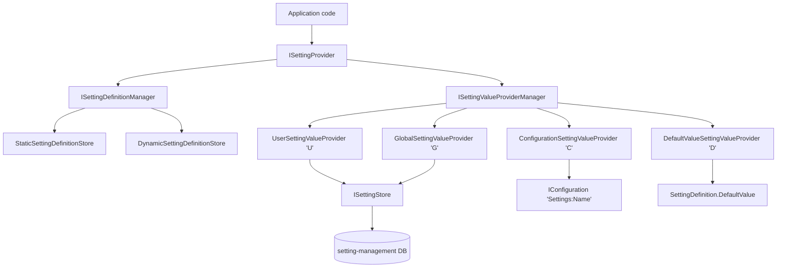

The setting system is ABP's way to expose strongly-named, hierarchically resolved configuration values to application code. Definitions are declared in C# (`SettingDefinitionProvider`), discovered at startup, and read at runtime through a single `ISettingProvider` facade that walks an ordered chain of `ISettingValueProvider` instances (user → global → configuration → default). The whole package — `framework/src/Volo.Abp.Settings/` — is small, framework-agnostic, and depends only on `Volo.Abp.Localization.Abstractions`, `Volo.Abp.Security`, and `Volo.Abp.Data`. Persistence is opt-in: by default an in-memory `NullSettingStore` is registered, and the `setting-management` module replaces it with a real store backed by EF Core or MongoDB.

<Info>
  Source root for this page: `framework/src/Volo.Abp.Settings/Volo/Abp/Settings/`. Module entry point: `AbpSettingsModule.cs`. Pulled in transitively by `Volo.Abp.Ddd.Domain.Shared` and most application modules.
</Info>

## File inventory

| File | Symbol | Role |
| --- | --- | --- |
| `AbpSettingsModule.cs` | `AbpSettingsModule` | Module: auto-discovers `ISettingDefinitionProvider`s, registers the four default value providers. |
| `AbpSettingOptions.cs` | `AbpSettingOptions` | Options: ordered `ITypeList<ISettingDefinitionProvider>` and `ITypeList<ISettingValueProvider>`; `DeletedSettings`. |
| `SettingDefinition.cs` | `SettingDefinition` | Metadata for one setting (name, default, providers allow-list, encryption flag, properties bag). |
| `ISettingDefinitionProvider.cs` / `SettingDefinitionProvider.cs` | `ISettingDefinitionProvider`, `SettingDefinitionProvider` | Author definitions via `Define(ISettingDefinitionContext)`. |
| `ISettingDefinitionContext.cs` / `SettingDefinitionContext.cs` | `ISettingDefinitionContext`, `SettingDefinitionContext` | Mutable bag (`Add`, `GetOrNull`, `GetAll`) passed into providers at startup. |
| `ISettingDefinitionManager.cs` / `SettingDefinitionManager.cs` | `ISettingDefinitionManager` | Singleton lookup over the merged static + dynamic definition stores. |
| `IStaticSettingDefinitionStore.cs` / `StaticSettingDefinitionStore.cs` | `IStaticSettingDefinitionStore` | Materialises the `Define()` calls into an in-memory dictionary. |
| `IDynamicSettingDefinitionStore.cs` / `NullDynamicSettingDefinitionStore.cs` | `IDynamicSettingDefinitionStore` | Hook for runtime-defined settings; replaced by `setting-management`. |
| `ISettingProvider.cs` / `SettingProvider.cs` | `ISettingProvider` | Public facade: `GetOrNullAsync`, `GetAllAsync`. |
| `SettingProviderExtensions.cs` | extension methods | `IsTrueAsync`, `GetAsync<T>(...)`. |
| `ISettingValueProvider.cs` / `SettingValueProvider.cs` | `ISettingValueProvider` | Single rung in the resolution chain. |
| `ISettingValueProviderManager.cs` / `SettingValueProviderManager.cs` | `ISettingValueProviderManager` | Lazily resolves the configured chain from `AbpSettingOptions.ValueProviders`. |
| `DefaultValueSettingValueProvider.cs` | provider `"D"` | Returns `SettingDefinition.DefaultValue`. |
| `ConfigurationSettingValueProvider.cs` | provider `"C"` | Reads `IConfiguration["Settings:<Name>"]`. |
| `GlobalSettingValueProvider.cs` | provider `"G"` | Reads `ISettingStore` for a host-wide value. |
| `UserSettingValueProvider.cs` | provider `"U"` | Reads `ISettingStore` keyed by `ICurrentUser.Id`. |
| `ISettingStore.cs` / `NullSettingStore.cs` | `ISettingStore` | Backing key/value store contract; null by default. |
| `SettingValue.cs` | `SettingValue` | `NameValue<string?>` DTO. |
| `ISettingEncryptionService.cs` / `SettingEncryptionService.cs` | `ISettingEncryptionService` | Symmetric encryption for `IsEncrypted = true` settings. |

## Resolution flow



`SettingProvider.GetOrNullAsync` iterates the chain **in reverse order of registration** — `User → Global → Configuration → Default` — returning the first non-null hit. That is the ordering registered by `AbpSettingsModule`:

```csharp
// AbpSettingsModule.cs
Configure<AbpSettingOptions>(options =>
{
    options.ValueProviders.Add<DefaultValueSettingValueProvider>();
    options.ValueProviders.Add<ConfigurationSettingValueProvider>();
    options.ValueProviders.Add<GlobalSettingValueProvider>();
    options.ValueProviders.Add<UserSettingValueProvider>();
});
```

The reversal happens inside `SettingProvider`:

```csharp
// SettingProvider.cs
public virtual async Task<string?> GetOrNullAsync(string name)
{
    var setting = await SettingDefinitionManager.GetAsync(name);
    var providers = Enumerable.Reverse(SettingValueProviderManager.Providers);

    if (setting.Providers.Any())
    {
        providers = providers.Where(p => setting.Providers.Contains(p.Name));
    }

    var value = await GetOrNullValueFromProvidersAsync(providers, setting);
    if (value != null && setting.IsEncrypted)
    {
        value = SettingEncryptionService.Decrypt(setting, value);
    }

    return value;
}
```

If a `SettingDefinition` has a non-empty `Providers` list, the chain is filtered to only the named providers — that's how a setting becomes "global only" or "user only".

## Authoring a definition

Subclass `SettingDefinitionProvider`. It is registered automatically by `AbpSettingsModule.AutoAddDefinitionProviders`.

```csharp
public class MySettingDefinitionProvider : SettingDefinitionProvider
{
    public override void Define(ISettingDefinitionContext context)
    {
        context.Add(
            new SettingDefinition(
                name: "MyApp.PageSize",
                defaultValue: "20",
                displayName: L("DisplayName:MyApp.PageSize"),
                description: L("Description:MyApp.PageSize"),
                isVisibleToClients: true)
                .WithProviders(UserSettingValueProvider.ProviderName,
                               GlobalSettingValueProvider.ProviderName)
        );
    }
}
```

### `SettingDefinition` shape

Real constructor and members from `SettingDefinition.cs`:

```csharp
public SettingDefinition(
    string name,
    string? defaultValue = null,
    ILocalizableString? displayName = null,
    ILocalizableString? description = null,
    bool isVisibleToClients = false,
    bool isInherited = true,
    bool isEncrypted = false)
```

| Member | Type | Meaning |
| --- | --- | --- |
| `Name` | `string` | Unique key — also used in the `Settings:<Name>` configuration prefix. |
| `DisplayName` | `ILocalizableString` | Localised label shown by the management UI. |
| `Description` | `ILocalizableString?` | Optional tooltip / help text. |
| `DefaultValue` | `string?` | Returned by `DefaultValueSettingValueProvider`. |
| `IsVisibleToClients` | `bool` | If `true`, the value is sent to JS / Blazor clients via the application-configuration endpoint. |
| `Providers` | `List<string>` | Allow-list of `ISettingValueProvider.Name` codes (`"U"`, `"G"`, `"C"`, `"D"`). Empty = all. |
| `IsInherited` | `bool` | Inheritance hint (see comment in `SettingProvider.GetOrNullAsync` — `TODO: How to implement setting.IsInherited?`). |
| `Properties` | `Dictionary<string, object>` | Free-form bag, accessed through `WithProperty`. |
| `IsEncrypted` | `bool` | When `true`, persisted values pass through `ISettingEncryptionService`. |

`WithProviders(params string[])` and `WithProperty(string, object)` are fluent helpers that mutate and return the definition.

## Reading values at runtime

Inject `ISettingProvider`:

```csharp
public class ProductListAppService
{
    private readonly ISettingProvider _settingProvider;
    public ProductListAppService(ISettingProvider settingProvider)
        => _settingProvider = settingProvider;

    public async Task<int> GetPageSizeAsync()
        => await _settingProvider.GetAsync<int>("MyApp.PageSize", defaultValue: 10);

    public async Task<bool> IsFeatureOnAsync()
        => await _settingProvider.IsTrueAsync("MyApp.NewCheckout");
}
```

The strongly-typed helpers come from `SettingProviderExtensions`:

```csharp
public static async Task<bool> IsTrueAsync(this ISettingProvider settingProvider, string name)
    => string.Equals(await settingProvider.GetOrNullAsync(name), "true",
                     StringComparison.OrdinalIgnoreCase);

public static async Task<T> GetAsync<T>(this ISettingProvider settingProvider,
                                        string name, T defaultValue = default)
    where T : struct
{
    var value = await settingProvider.GetOrNullAsync(name);
    return value?.To<T>() ?? defaultValue;
}
```

`GetAllAsync()` returns one `SettingValue` per defined setting. `SettingProvider.GetAllAsync(string[] names)` is a denser path — it loops providers once and removes resolved names progressively, short-circuiting when nothing remains.

## Definition lookup

`ISettingDefinitionManager` is a singleton that merges the static and dynamic stores:

```csharp
// SettingDefinitionManager.cs
public virtual async Task<SettingDefinition?> GetOrNullAsync(string name)
{
    Check.NotNull(name, nameof(name));
    return await StaticStore.GetOrNullAsync(name) ?? await DynamicStore.GetOrNullAsync(name);
}

public virtual async Task<IReadOnlyList<SettingDefinition>> GetAllAsync()
{
    var staticSettings = await StaticStore.GetAllAsync();
    var staticSettingNames = staticSettings.Select(p => p.Name).ToImmutableHashSet();
    var dynamicSettings = await DynamicStore.GetAllAsync();
    /* We prefer static settings over dynamics */
    return staticSettings
        .Concat(dynamicSettings.Where(d => !staticSettingNames.Contains(d.Name)))
        .ToImmutableList();
}
```

`StaticSettingDefinitionStore` builds its dictionary once, lazily, by resolving every registered `ISettingDefinitionProvider` from a scoped `IServiceProvider` and invoking `Define`:

```csharp
protected virtual IDictionary<string, SettingDefinition> CreateSettingDefinitions()
{
    var settings = new Dictionary<string, SettingDefinition>();
    using (var scope = ServiceProvider.CreateScope())
    {
        var providers = Options.DefinitionProviders
            .Select(p => scope.ServiceProvider.GetRequiredService(p) as ISettingDefinitionProvider)
            .ToList();
        foreach (var provider in providers)
            provider?.Define(new SettingDefinitionContext(settings));
    }
    return settings;
}
```

The dynamic store contract `IDynamicSettingDefinitionStore` ships with a `NullDynamicSettingDefinitionStore` no-op default; the `setting-management` module replaces it with `DynamicSettingDefinitionStore` to support settings defined at runtime by feature/tenant modules.

## Encryption

Settings with `IsEncrypted = true` are decrypted at read-time inside `SettingProvider.GetOrNullAsync` and `GetAllAsync`. The contract is in `ISettingEncryptionService.cs`:

```csharp
public interface ISettingEncryptionService
{
    string? Encrypt(SettingDefinition settingDefinition, string? plainValue);
    string? Decrypt(SettingDefinition settingDefinition, string? encryptedValue);
}
```

The default implementation (`SettingEncryptionService`) delegates to `IStringEncryptionService` from `Volo.Abp.Security`.

## Module wiring

`AbpSettingsModule` depends on `AbpLocalizationAbstractionsModule`, `AbpSecurityModule`, and `AbpDataModule`. `PreConfigureServices` scans the DI container for any `ISettingDefinitionProvider` registration and accumulates the implementation types into `AbpSettingOptions.DefinitionProviders`:

```csharp
private static void AutoAddDefinitionProviders(IServiceCollection services)
{
    var definitionProviders = new List<Type>();

    services.OnRegistered(context =>
    {
        if (typeof(ISettingDefinitionProvider).IsAssignableFrom(context.ImplementationType))
        {
            definitionProviders.Add(context.ImplementationType);
        }
    });

    services.Configure<AbpSettingOptions>(options =>
    {
        options.DefinitionProviders.AddIfNotContains(definitionProviders);
    });
}
```

This is why subclassing `SettingDefinitionProvider` — which is `[TransientDependency]` via `SettingDefinitionProvider : ISettingDefinitionProvider, ITransientDependency` — is enough. No manual registration call is required.

## Where things live

| Concern | Project | Page |
| --- | --- | --- |
| Setting definition + chain | `framework/src/Volo.Abp.Settings` | this page |
| Value providers in detail | `framework/src/Volo.Abp.Settings` | [Setting providers](/settings-features/setting-providers) |
| Persistent store, manager, UI | `modules/setting-management/` | [Setting management module](/settings-features/setting-management-module) |
| Sibling: features (tenant-scoped) | `framework/src/Volo.Abp.Features` | [Features overview](/settings-features/features-overview) |
| Sibling: global features (compile-time) | `framework/src/Volo.Abp.GlobalFeatures` | [Global features](/settings-features/global-features) |
| Tenant resolution underpins per-tenant settings via `ISettingStore.ProviderKey` | `framework/src/Volo.Abp.MultiTenancy` | [Multi-tenancy](/multitenancy) |
| Authorization gates `ISettingManagementAppService` calls | `framework/src/Volo.Abp.Authorization` | [Authorization](/authz) |

<Tip>
  Want to add a per-edition setting? Add a custom `ISettingValueProvider` (e.g. an `EditionSettingValueProvider`) and register it via `options.ValueProviders.Insert(...)`. The chain is just an `ITypeList<ISettingValueProvider>` — order of insertion controls resolution priority (reversed at read-time).
</Tip>

## Default chain summary

| Order in `AbpSettingOptions.ValueProviders` | Resolution order | Provider | Name | Source |
| --- | --- | --- | --- | --- |
| 1 | 4th tried | `DefaultValueSettingValueProvider` | `"D"` | `SettingDefinition.DefaultValue` |
| 2 | 3rd tried | `ConfigurationSettingValueProvider` | `"C"` | `IConfiguration["Settings:<Name>"]` |
| 3 | 2nd tried | `GlobalSettingValueProvider` | `"G"` | `ISettingStore` with `providerKey = null` |
| 4 | 1st tried | `UserSettingValueProvider` | `"U"` | `ISettingStore` keyed by `ICurrentUser.Id` |

The resolution order is **the reverse of registration order** — most-specific (user) wins, falling back to least-specific (the hard-coded default value). Drill into each provider in [Setting providers](/settings-features/setting-providers).
