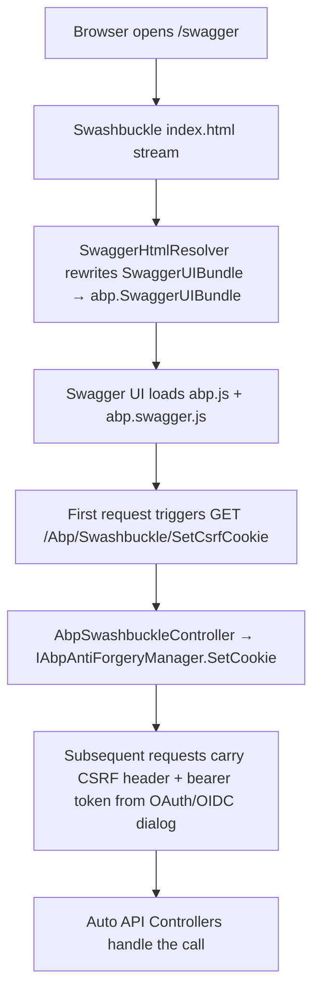

`Volo.Abp.Swashbuckle` is the framework's thin opinionated layer over `Swashbuckle.AspNetCore`. It does not replace Swashbuckle — every type your `Action<SwaggerGenOptions>` callback can touch is the same one you would touch in a vanilla ASP.NET Core app — but it pre-registers the bits ABP needs to play nicely with `Swagger`: a binary schema mapping for `IRemoteStreamContent`, a Swagger UI HTML resolver that injects ABP's antiforgery + OIDC helpers, an enum schema filter that emits string names instead of integers, and a document filter that hides the framework's own internal endpoints. The module also ships two ergonomic extension methods (`AddAbpSwaggerGenWithOAuth`, `AddAbpSwaggerGenWithOidc`) that bake the OpenIddict-friendly security definitions you would otherwise hand-write.

## File inventory

The whole module is roughly a dozen C# files plus two embedded JS assets.

| Path (under `framework/src/Volo.Abp.Swashbuckle/`) | Role |
| --- | --- |
| `Volo/Abp/Swashbuckle/AbpSwashbuckleModule.cs` | Module class; depends on `AbpAspNetCoreMvcModule` + `AbpVirtualFileSystemModule`, embeds the `wwwroot/` assets. |
| `Microsoft/Extensions/DependencyInjection/AbpSwaggerGenServiceCollectionExtensions.cs` | `AddAbpSwaggerGen`, `AddAbpSwaggerGenWithOAuth`, `AddAbpSwaggerGenWithOidc`. |
| `Microsoft/Extensions/DependencyInjection/AbpSwaggerGenOptionsExtensions.cs` | `HideAbpEndpoints()`, `UserFriendlyEnums()` helpers on `SwaggerGenOptions`. |
| `Microsoft/AspNetCore/Builder/AbpSwaggerUIBuilderExtensions.cs` | `UseAbpSwaggerUI` — injects `abp.js` + `abp.swagger.js` and replaces the index stream. |
| `Volo/Abp/Swashbuckle/AbpSwashbuckleDocumentFilter.cs` | `IDocumentFilter` that strips paths from non-application controllers (`Volo.*`). |
| `Volo/Abp/Swashbuckle/AbpSwashbuckleEnumSchemaFilter.cs` | `ISchemaFilter` that renders enums as `string` names. |
| `Volo/Abp/Swashbuckle/AbpSwaggerOidcFlows.cs` | Constants for OIDC flows accepted by `AddAbpSwaggerGenWithOidc`. |
| `Volo/Abp/Swashbuckle/SwaggerHtmlResolver.cs` (+ `ISwaggerHtmlResolver`) | Returns the patched `index.html` stream (`SwaggerUIBundle` → `abp.SwaggerUIBundle`). |
| `Volo/Abp/Swashbuckle/AbpSwashbuckleController.cs` | `Abp/Swashbuckle/SetCsrfCookie` endpoint — sets the antiforgery cookie before Swagger fires real requests. |
| `wwwroot/swagger/ui/abp.js` | Generic ABP runtime bootstrap copied into the Swagger UI page. |
| `wwwroot/swagger/ui/abp.swagger.js` | The patched `abp.SwaggerUIBundle` — adds tenant placeholder replacement, OIDC discovery rewriting, antiforgery header, and request/response interceptor chaining. |

## Module wiring

`AbpSwashbuckleModule` is intentionally tiny. It depends on the MVC integration so its `[Area("Abp")]` controller is picked up by the Auto-Controller convention, and on the VFS module so its embedded `wwwroot/` files are served back as virtual files.

```csharp title="framework/src/Volo.Abp.Swashbuckle/Volo/Abp/Swashbuckle/AbpSwashbuckleModule.cs"
[DependsOn(
    typeof(AbpVirtualFileSystemModule),
    typeof(AbpAspNetCoreMvcModule))]
public class AbpSwashbuckleModule : AbpModule
{
    public override void ConfigureServices(ServiceConfigurationContext context)
    {
        Configure<AbpVirtualFileSystemOptions>(options =>
        {
            options.FileSets.AddEmbedded<AbpSwashbuckleModule>();
        });
    }
}
```

<Tip>
Embedding the wwwroot means `abp.js` and `abp.swagger.js` resolve through the [Virtual File System](/vfs/overview) — no static file middleware configuration required on the consuming host.
</Tip>

## Registering Swagger generation

`AddAbpSwaggerGen` is a drop-in replacement for `services.AddSwaggerGen(...)`. It pre-maps the two stream-content schemas that ABP application services use for binary uploads/downloads, then yields control to your setup callback.

```csharp title="framework/src/Volo.Abp.Swashbuckle/Microsoft/Extensions/DependencyInjection/AbpSwaggerGenServiceCollectionExtensions.cs"
public static IServiceCollection AddAbpSwaggerGen(
    this IServiceCollection services,
    Action<SwaggerGenOptions>? setupAction = null)
{
    return services.AddSwaggerGen(
        options =>
        {
            Func<OpenApiSchema> remoteStreamContentSchemaFactory = () => new OpenApiSchema()
            {
                Type = "string",
                Format = "binary"
            };

            options.MapType<RemoteStreamContent>(remoteStreamContentSchemaFactory);
            options.MapType<IRemoteStreamContent>(remoteStreamContentSchemaFactory);

            setupAction?.Invoke(options);
        });
}
```

The two mappings matter because `RemoteStreamContent` is what ABP's [Auto API Controllers](/web/auto-api-controllers) project for an `IRemoteStreamContent` parameter; without the override, Swashbuckle would generate a class schema that is impossible to upload via Swagger UI.

### Typical call site

In a host module's `ConfigureServices`:

```csharp
context.Services.AddAbpSwaggerGen(options =>
{
    options.SwaggerDoc("v1", new OpenApiInfo { Title = "BookStore API", Version = "v1" });
    options.DocInclusionPredicate((docName, description) => true);
    options.CustomSchemaIds(type => type.FullName);
    options.HideAbpEndpoints();         // see below
    options.UserFriendlyEnums();        // see below
});
```

## OAuth and OIDC helpers

Two extension methods sit on top of `AddAbpSwaggerGen` and wire the security definitions needed when ABP's Account/Auth Server is the identity provider.

### `AddAbpSwaggerGenWithOAuth`

```csharp title="framework/src/Volo.Abp.Swashbuckle/Microsoft/Extensions/DependencyInjection/AbpSwaggerGenServiceCollectionExtensions.cs"
public static IServiceCollection AddAbpSwaggerGenWithOAuth(
    this IServiceCollection services,
    [NotNull] string authority,
    [NotNull] Dictionary<string, string> scopes,
    Action<SwaggerGenOptions>? setupAction = null,
    string authorizationEndpoint = "/connect/authorize",
    string tokenEndpoint = "/connect/token")
```

It registers an `oauth2` security scheme using the **authorization code** flow, derives `authorizationUrl`/`tokenUrl` from the supplied `authority`, and emits a global `OpenApiSecurityRequirement` referencing that scheme so the **Authorize** button appears in Swagger UI on every operation.

```csharp
context.Services.AddAbpSwaggerGenWithOAuth(
    authority: configuration["AuthServer:Authority"]!,
    scopes: new Dictionary<string, string>
    {
        { "BookStore",    "BookStore API" },
        { "AdministrationService", "Administration Service API" }
    },
    options =>
    {
        options.SwaggerDoc("v1", new OpenApiInfo { Title = "BookStore API", Version = "v1" });
        options.DocInclusionPredicate((_, _) => true);
        options.CustomSchemaIds(type => type.FullName);
    });
```

### `AddAbpSwaggerGenWithOidc`

For OpenIddict / IdentityServer hosts that prefer client-side OIDC discovery you can register an `openIdConnect` security scheme instead:

```csharp title="framework/src/Volo.Abp.Swashbuckle/Microsoft/Extensions/DependencyInjection/AbpSwaggerGenServiceCollectionExtensions.cs"
public static IServiceCollection AddAbpSwaggerGenWithOidc(
    this IServiceCollection services,
    [NotNull] string authority,
    string[]? scopes = null,
    string[]? flows = null,
    string? discoveryEndpoint = null,
    Action<SwaggerGenOptions>? setupAction = null)
```

The implementation:

1. Builds a discovery URL (defaulting to `{authority}/.well-known/openid-configuration`).
2. Stuffs `oidcSupportedFlows`, `oidcSupportedScopes`, and `oidcDiscoveryEndpoint` into `SwaggerUIOptions.ConfigObject.AdditionalItems` — those values are read by `abp.swagger.js` at runtime to drive the Swagger UI OIDC flow selector.
3. Adds an `oidc` security definition pointing at the discovery document and a matching global security requirement.

Allowed flow constants come from `AbpSwaggerOidcFlows`:

```csharp title="framework/src/Volo.Abp.Swashbuckle/Volo/Abp/Swashbuckle/AbpSwaggerOidcFlows.cs"
public static class AbpSwaggerOidcFlows
{
    public const string AuthorizationCode = "authorization_code";
    public const string Implicit = "implicit";
    public const string Password = "password";
    public const string ClientCredentials = "client_credentials";
}
```

If you don't pass `flows`, the helper assumes `AuthorizationCode` only.

## Filters on `SwaggerGenOptions`

Two helpers on `AbpSwaggerGenOptionsExtensions` light up the framework-specific filters.

```csharp title="framework/src/Volo.Abp.Swashbuckle/Microsoft/Extensions/DependencyInjection/AbpSwaggerGenOptionsExtensions.cs"
public static class AbpSwaggerGenOptionsExtensions
{
    public static void HideAbpEndpoints(this SwaggerGenOptions swaggerGenOptions)
    {
        swaggerGenOptions.DocumentFilter<AbpSwashbuckleDocumentFilter>();
    }

    public static void UserFriendlyEnums(this SwaggerGenOptions swaggerGenOptions)
    {
        swaggerGenOptions.SchemaFilter<AbpSwashbuckleEnumSchemaFilter>();
    }
}
```

### `AbpSwashbuckleDocumentFilter`

The framework auto-projects controllers for every ABP application service via [Auto API Controllers](/web/auto-api-controllers) — including the ones embedded in `Volo.Abp.*` modules. In most apps you don't want those internal endpoints (account, audit logs, permission management, …) cluttering your **own** Swagger document. `HideAbpEndpoints()` adds the document filter below; it keeps only the paths whose action `DisplayName` does **not** start with `Volo.`, after stripping `:regex(...)` and other inline route constraints.

```csharp title="framework/src/Volo.Abp.Swashbuckle/Volo/Abp/Swashbuckle/AbpSwashbuckleDocumentFilter.cs"
public class AbpSwashbuckleDocumentFilter : IDocumentFilter
{
    protected virtual string[] ActionUrlPrefixes { get; set; } = new[] { "Volo." };
    protected virtual string RegexConstraintPattern => @":regex\(([^()]*)\)";

    public virtual void Apply(OpenApiDocument swaggerDoc, DocumentFilterContext context)
    {
        var actionUrls = context.ApiDescriptions
            .Select(apiDescription => apiDescription.ActionDescriptor)
            .Where(actionDescriptor => !string.IsNullOrEmpty(actionDescriptor.DisplayName) &&
                                       ActionUrlPrefixes.Any(actionUrlPrefix => !actionDescriptor.DisplayName.Contains(actionUrlPrefix)))
            .DistinctBy(actionDescriptor => actionDescriptor.AttributeRouteInfo?.Template)
            .Select(RemoveRouteParameterConstraints)
            .Where(actionUrl => !string.IsNullOrEmpty(actionUrl))
            .ToList();

        swaggerDoc
            .Paths
            .RemoveAll(path => !actionUrls.Contains(path.Key));
    }
    // ...
}
```

To **keep** a particular framework prefix or hide additional ones, subclass and override `ActionUrlPrefixes`:

```csharp
public class MyDocumentFilter : AbpSwashbuckleDocumentFilter
{
    protected override string[] ActionUrlPrefixes { get; set; } = new[] { "Volo.", "Acme.Internal." };
}
```

### `AbpSwashbuckleEnumSchemaFilter`

Vanilla Swashbuckle renders enums as integers, which makes generated clients ugly. `UserFriendlyEnums()` turns every enum into a string with the literal member names:

```csharp title="framework/src/Volo.Abp.Swashbuckle/Volo/Abp/Swashbuckle/AbpSwashbuckleEnumSchemaFilter.cs"
public class AbpSwashbuckleEnumSchemaFilter : ISchemaFilter
{
    public void Apply(OpenApiSchema schema, SchemaFilterContext context)
    {
        if (context.Type.IsEnum)
        {
            schema.Enum.Clear();
            schema.Type = nameof(String);
            schema.Format = nameof(String);
            Enum.GetNames(context.Type)
                .ToList()
                .ForEach(name => schema.Enum.Add(new OpenApiString($"{name}")));
        }
    }
}
```

<Warning>
This filter mutates the JSON schema only — your *server-side* request still expects a value that the `JsonStringEnumConverter` can deserialise. If you don't already configure that converter (`AbpSystemTextJsonSerializerOptions` does), the generated request will fail at deserialisation time. See [JSON serialization](/serialization/json-system-text).
</Warning>

## Mounting Swagger UI

`UseAbpSwaggerUI` wraps `UseSwaggerUI` and rewires two things:

1. Injects `ui/abp.js` and `ui/abp.swagger.js` (served from the embedded `wwwroot/`).
2. Replaces the `IndexStream` with `SwaggerHtmlResolver.Resolver()` so the bootstrapped HTML calls **`abp.SwaggerUIBundle`** instead of the stock `SwaggerUIBundle`.

```csharp title="framework/src/Volo.Abp.Swashbuckle/Microsoft/AspNetCore/Builder/AbpSwaggerUIBuilderExtensions.cs"
public static IApplicationBuilder UseAbpSwaggerUI(
    this IApplicationBuilder app,
    Action<SwaggerUIOptions>? setupAction = null)
{
    var resolver = app.ApplicationServices.GetService<ISwaggerHtmlResolver>();

    return app.UseSwaggerUI(options =>
    {
        options.InjectJavascript("ui/abp.js");
        options.InjectJavascript("ui/abp.swagger.js");
        options.IndexStream = () => resolver?.Resolver();

        setupAction?.Invoke(options);
    });
}
```

The resolver simply takes Swashbuckle's embedded `index.html`, swaps the bundle constructor name, and hands back a `MemoryStream`:

```csharp title="framework/src/Volo.Abp.Swashbuckle/Volo/Abp/Swashbuckle/SwaggerHtmlResolver.cs"
public class SwaggerHtmlResolver : ISwaggerHtmlResolver, ITransientDependency
{
    public virtual Stream Resolver()
    {
        var stream = typeof(SwaggerUIOptions).GetTypeInfo().Assembly
            .GetManifestResourceStream("Swashbuckle.AspNetCore.SwaggerUI.index.html");

        var html = new StreamReader(stream!)
            .ReadToEnd()
            .Replace("SwaggerUIBundle(configObject)", "abp.SwaggerUIBundle(configObject)");

        return new MemoryStream(Encoding.UTF8.GetBytes(html));
    }
}
```

You can replace `ISwaggerHtmlResolver` if you need to ship a fully custom Swagger UI shell.

### Pipeline snippet

```csharp
public override void OnApplicationInitialization(ApplicationInitializationContext context)
{
    var app = context.GetApplicationBuilder();

    app.UseSwagger();
    app.UseAbpSwaggerUI(options =>
    {
        options.SwaggerEndpoint("/swagger/v1/swagger.json", "BookStore API");
        options.OAuthClientId(configuration["AuthServer:SwaggerClientId"]);
        options.OAuthScopes("BookStore");
    });
}
```

## The Swagger UI JavaScript bridge

`abp.swagger.js` extends the Swagger UI bundle to play with ABP's runtime:

- **Antiforgery handshake** — before the first non-token request, Swagger UI calls `abp/Swashbuckle/SetCsrfCookie` (handled by `AbpSwashbuckleController`) so the antiforgery cookie is set. Subsequent requests automatically carry the matching header.
- **Tenant placeholders** — recognises `{{tenantId}}`, `{{tenantName}}`, and `{0}` in OIDC discovery URLs and replaces them with the active tenant from `abp.appPath` / configuration.
- **OIDC discovery override** — when `oidcDiscoveryEndpoint` is supplied via `AddAbpSwaggerGenWithOidc`, Swagger UI's well-known fetch is rewritten to the explicit URL.
- **Interceptor chaining** — the user's `configObject.requestInterceptor` and `responseInterceptor` are wrapped, not replaced.

```csharp title="framework/src/Volo.Abp.Swashbuckle/Volo/Abp/Swashbuckle/AbpSwashbuckleController.cs"
[Area("Abp")]
[Route("Abp/Swashbuckle/[action]")]
[DisableAuditing]
[RemoteService(false)]
[ApiExplorerSettings(IgnoreApi = true)]
public class AbpSwashbuckleController : AbpController
{
    protected readonly IAbpAntiForgeryManager AntiForgeryManager;

    public AbpSwashbuckleController(IAbpAntiForgeryManager antiForgeryManager)
    {
        AntiForgeryManager = antiForgeryManager;
    }

    [HttpGet]
    public virtual void SetCsrfCookie()
    {
        AntiForgeryManager.SetCookie();
    }
}
```

Note `[DisableAuditing]` (no audit log entry for the constant cookie pings), `[RemoteService(false)]` (excluded from generated proxies), and `[ApiExplorerSettings(IgnoreApi = true)]` (hidden from the Swagger document itself).

## End-to-end flow



## Customisation patterns

<AccordionGroup>
  <Accordion title="Per-module Swagger docs">
    Call `options.SwaggerDoc("module-name", ...)` for each microservice and combine them with `options.DocInclusionPredicate((docName, apiDesc) => apiDesc.GroupName == docName)`. Then expose multiple endpoints in `UseAbpSwaggerUI`.
  </Accordion>
  <Accordion title="Hide specific controllers from a tenant boundary">
    Replace `AbpSwashbuckleDocumentFilter` with a subclass that filters by `[RemoteService(IsEnabled = false)]` or by a custom attribute on the controller.
  </Accordion>
  <Accordion title="Include XML comments">
    Standard Swashbuckle pattern — turn on `<GenerateDocumentationFile>` in your `csproj`, then add `options.IncludeXmlComments(Path.Combine(AppContext.BaseDirectory, "MyAssembly.xml"))` inside the `AddAbpSwaggerGen` callback.
  </Accordion>
  <Accordion title="Inject extra JS or CSS">
    Pass a `setupAction` to `UseAbpSwaggerUI` and call `options.InjectStylesheet(...)` / `options.InjectJavascript(...)`. ABP's two scripts are added first, so anything you add runs after them.
  </Accordion>
  <Accordion title="Custom OIDC scopes UI">
    Override `ISwaggerHtmlResolver` (its registration is `ITransientDependency`) and serve your own `index.html`. The default implementation only does a single `Replace`, so it's easy to extend.
  </Accordion>
</AccordionGroup>

## Things this module does **not** do

- It does not generate gRPC reflection documents — only OpenAPI v3.
- It does not enforce that `Authorize` succeeds — the actual token validation is your authentication handler's job (see [ASP.NET Core module](/web/aspnet-core-module)).
- It does not replace `Swashbuckle.AspNetCore.SwaggerGen` types; everything you can do in stock Swashbuckle still works inside the `setupAction` callback.

## Related pages

- [/web/overview](/web/overview) — how ASP.NET Core hosts wire ABP modules.
- [/web/auto-api-controllers](/web/auto-api-controllers) — what generates the controllers whose endpoints Swagger documents.
- [/web/api-explorer-and-models](/web/api-explorer-and-models) — how the API description tree is built before Swashbuckle sees it.
- [/web/anti-forgery](/web/anti-forgery) — the `IAbpAntiForgeryManager` Swagger UI talks to.
- [/auth/openiddict-module](/auth/openiddict-server) — the identity authority you'll typically point Swagger at.
