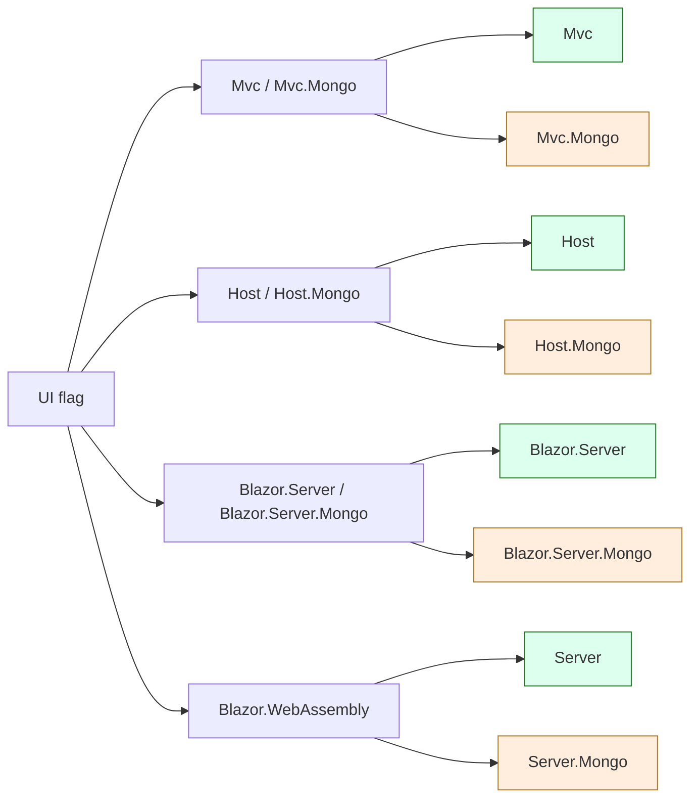

The `app-nolayers` template at `templates/app-nolayers/aspnet-core/` is ABP's "single-project" startup. It throws away the strict Domain → Application → HttpApi → Web split and ships one project per UI choice — `Mvc`, `Host`, `Blazor.Server`, `Blazor.WebAssembly` — with every entity, service, DTO and Razor page sitting in folders inside that one project. For each EF Core project there is a sibling `*.Mongo` project pre-wired with the MongoDB provider; the CLI deletes the one you did not pick. The result is a flatter codebase that suits small APIs and prototypes, at the cost of the layering boundaries the standard `app` template enforces. See [App Template](/templates/app-template) for the layered counterpart and [Templates Overview](/templates/overview) for the catalog.

<Note>
"No layers" does not mean "no ABP". The single project still depends on the Account / Identity / Tenant / Feature / Setting / OpenIddict modules and runs an `AbpModule` — only the *consumer's* code is unsplit.
</Note>

## Directory layout

```text templates/app-nolayers/aspnet-core/
├── MyCompanyName.MyProjectName.sln
├── NuGet.Config
├── README.md
├── migrate-database.ps1
├── MyCompanyName.MyProjectName.Mvc/
├── MyCompanyName.MyProjectName.Mvc.Mongo/
├── MyCompanyName.MyProjectName.Host/
├── MyCompanyName.MyProjectName.Host.Mongo/
├── MyCompanyName.MyProjectName.Blazor.Server/
├── MyCompanyName.MyProjectName.Blazor.Server.Mongo/
└── MyCompanyName.MyProjectName.Blazor.WebAssembly/
    ├── Client/
    ├── Server/
    ├── Server.Mongo/
    └── Shared/
```

There is no `src/` or `test/` separation, and no `Directory.Build.props` — the projects sit at the solution root next to `MyCompanyName.MyProjectName.sln`. The pipeline `MoveFolderStep("/aspnet-core/", "/")` then promotes everything one level up in the output.

## Project inventory

| Project (folder) | UI | DB | Role |
| --- | --- | --- | --- |
| `MyCompanyName.MyProjectName.Mvc/` | MVC / Razor Pages | EF Core | Full ABP web app: Account, Identity, Tenant Management UIs and `Pages/Index.cshtml` for the home page. |
| `MyCompanyName.MyProjectName.Mvc.Mongo/` | MVC / Razor Pages | MongoDB | Same shape as `Mvc/`, EF Core swapped for `Volo.Abp.MongoDB`. |
| `MyCompanyName.MyProjectName.Host/` | None (API only) | EF Core | Headless ASP.NET Core API host with Swagger + auto-controllers. |
| `MyCompanyName.MyProjectName.Host.Mongo/` | None (API only) | MongoDB | API-only host with MongoDB. |
| `MyCompanyName.MyProjectName.Blazor.Server/` | Blazor Server | EF Core | Blazor Server SPA with the Lepton-X-Lite theme. |
| `MyCompanyName.MyProjectName.Blazor.Server.Mongo/` | Blazor Server | MongoDB | Blazor Server with MongoDB. |
| `MyCompanyName.MyProjectName.Blazor.WebAssembly/Client/` | Blazor WASM | — | WebAssembly client (depends on `Shared`). |
| `MyCompanyName.MyProjectName.Blazor.WebAssembly/Server/` | Blazor WASM | EF Core | API back-end for the WASM client. |
| `MyCompanyName.MyProjectName.Blazor.WebAssembly/Server.Mongo/` | Blazor WASM | MongoDB | API back-end for the WASM client (Mongo). |
| `MyCompanyName.MyProjectName.Blazor.WebAssembly/Shared/` | Blazor WASM | — | DTOs / interfaces shared by Client and Server. |

The pipeline keeps **exactly one** of these projects (or for WASM, the matching `Client + Server + Shared` triplet) and removes the rest — see `AppNoLayersMoveProjectsStep` and `AppNoLayersDatabaseManagementSystemChangeStep` in `framework/src/Volo.Abp.Cli.Core/Volo/Abp/Cli/ProjectBuilding/Building/Steps/`.

## Inside a single project — `MyCompanyName.MyProjectName.Mvc`

```text templates/app-nolayers/aspnet-core/MyCompanyName.MyProjectName.Mvc/
├── MyCompanyName.MyProjectName.Mvc.csproj
├── MyProjectNameBrandingProvider.cs
├── MyProjectNameModule.cs            # the [DependsOn] module
├── Program.cs                        # WebApplication.CreateBuilder entry point
├── abp.resourcemapping.js
├── appsettings.json
├── package.json
├── web.config
├── wwwroot/
├── Properties/                       # launchSettings.json
├── Pages/                            # Razor Pages (Index.cshtml + ViewImports)
├── Menus/                            # ABP menu contributors
├── Localization/                     # JSON resource files + Resource class
├── Entities/                         # aggregate roots (empty in template)
├── Data/                             # DbContext, DbContextFactory, migrator
├── Migrations/                       # EF Core migrations
├── ObjectMapping/                    # AutoMapper profile
└── Services/                         # Application services + Dtos/
    └── Dtos/
```

The `.csproj` is `Microsoft.NET.Sdk.Web` — i.e. a single ASP.NET Core project — and references every ABP module the layered template would have split across `Domain`, `Application`, `HttpApi` and `Web`:

```xml templates/app-nolayers/aspnet-core/MyCompanyName.MyProjectName.Mvc/MyCompanyName.MyProjectName.Mvc.csproj
<Project Sdk="Microsoft.NET.Sdk.Web">
  <PropertyGroup>
    <TargetFramework>net8.0</TargetFramework>
    <Nullable>enable</Nullable>
    <ImplicitUsings>enable</ImplicitUsings>
    <GenerateEmbeddedFilesManifest>true</GenerateEmbeddedFilesManifest>
  </PropertyGroup>
  <ItemGroup>
    <PackageReference Include="Serilog.AspNetCore" Version="8.0.0" />
    <PackageReference Include="Serilog.Sinks.Async" Version="1.5.0" />
  </ItemGroup>
  <ItemGroup>
    <ProjectReference Include="..\..\..\..\framework\src\Volo.Abp.AspNetCore.Mvc\Volo.Abp.AspNetCore.Mvc.csproj" />
    <ProjectReference Include="..\..\..\..\framework\src\Volo.Abp.Autofac\Volo.Abp.Autofac.csproj" />
    <ProjectReference Include="..\..\..\..\framework\src\Volo.Abp.AutoMapper\Volo.Abp.AutoMapper.csproj" />
    <ProjectReference Include="..\..\..\..\framework\src\Volo.Abp.Swashbuckle\Volo.Abp.Swashbuckle.csproj" />
    <ProjectReference Include="..\..\..\..\framework\src\Volo.Abp.AspNetCore.Serilog\Volo.Abp.AspNetCore.Serilog.csproj" />
    <ProjectReference Include="..\..\..\..\framework\src\Volo.Abp.EntityFrameworkCore.SqlServer\Volo.Abp.EntityFrameworkCore.SqlServer.csproj" />
  </ItemGroup>
  <!-- Account, Identity, Permission, Tenant, Feature, Setting, OpenIddict module refs follow -->
</Project>
```

### `Program.cs` — single entry point with `--migrate-database`

The same executable hosts the web app **and** the database-migration command (passed via the `--migrate-database` switch handled in `IsMigrateDatabase`):

```csharp templates/app-nolayers/aspnet-core/MyCompanyName.MyProjectName.Mvc/Program.cs
public class Program
{
    public async static Task<int> Main(string[] args)
    {
        // ...Serilog setup...
        try
        {
            var builder = WebApplication.CreateBuilder(args);
            builder.Host.AddAppSettingsSecretsJson()
                .UseAutofac()
                .UseSerilog();
            if (IsMigrateDatabase(args))
            {
                builder.Services.AddDataMigrationEnvironment();
            }
            await builder.AddApplicationAsync<MyProjectNameModule>();
            var app = builder.Build();
            await app.InitializeApplicationAsync();

            if (IsMigrateDatabase(args))
            {
                await app.Services.GetRequiredService<MyProjectNameDbMigrationService>().MigrateAsync();
                return 0;
            }

            Log.Information("Starting MyCompanyName.MyProjectName.");
            await app.RunAsync();
            return 0;
        }
        // ...
    }

    private static bool IsMigrateDatabase(string[] args)
    {
        return args.Any(x => x.Contains("--migrate-database", StringComparison.OrdinalIgnoreCase));
    }
}
```

That eliminates the dedicated `DbMigrator` console project the layered template uses — the helper script `migrate-database.ps1` at the solution root just calls `dotnet run -- --migrate-database`.

### `MyProjectNameModule.cs` — every dependency in one place

```csharp templates/app-nolayers/aspnet-core/MyCompanyName.MyProjectName.Mvc/MyProjectNameModule.cs
[DependsOn(
    // ABP Framework packages
    typeof(AbpAspNetCoreMvcModule),
    typeof(AbpAutofacModule),
    typeof(AbpAutoMapperModule),
    typeof(AbpEntityFrameworkCoreSqlServerModule),
    typeof(AbpSwashbuckleModule),
    typeof(AbpAspNetCoreSerilogModule),
    typeof(AbpAspNetCoreMvcUiLeptonXLiteThemeModule),

    // Account module packages
    typeof(AbpAccountApplicationModule),
    typeof(AbpAccountHttpApiModule),
    typeof(AbpAccountWebOpenIddictModule),

    // Identity module packages
    typeof(AbpPermissionManagementDomainIdentityModule),
    typeof(AbpPermissionManagementDomainOpenIddictModule),
    typeof(AbpIdentityApplicationModule),
    typeof(AbpIdentityHttpApiModule),
    typeof(AbpIdentityEntityFrameworkCoreModule),
    typeof(AbpOpenIddictEntityFrameworkCoreModule),
    typeof(AbpIdentityWebModule),
    // ...audit logging, feature management, setting management, tenant management
)]
public class MyProjectNameModule : AbpModule
{
    // ConfigureServices / OnApplicationInitialization etc.
}
```

### Sub-folders in detail

| Folder | What lives here | Layered equivalent |
| --- | --- | --- |
| `Data/` | `MyProjectNameDbContext`, `MyProjectNameDbContextFactory` (design-time), `MyProjectNameDbMigrationService`, `MyProjectNameEFCoreDbSchemaMigrator`. | `EntityFrameworkCore/` project + `DbMigrator/` |
| `Entities/` | Aggregate roots and child entities. Empty in the template. | `Domain/` |
| `Services/` | `*AppService` classes deriving from `ApplicationService`. The CLI's "Suite" / "abp generate" workflows scaffold into here. | `Application/` |
| `Services/Dtos/` | Input/output DTOs and create/update inputs. | `Application.Contracts/` |
| `ObjectMapping/MyProjectNameAutoMapperProfile.cs` | AutoMapper config. | `Application/...AutoMapperProfile.cs` |
| `Pages/` | Razor pages (only on Mvc / Blazor.Server variants). The default `Index.cshtml` is the home page. | `Web/Pages/` |
| `Menus/` | `IMenuContributor` implementations. | `Web/Menus/` |
| `Localization/MyProjectName/*.json` + `MyProjectNameResource.cs` | JSON resource files keyed by culture. | `Domain.Shared/Localization/` |
| `Migrations/` | EF Core migrations (removed when MongoDB chosen). | `EntityFrameworkCore/Migrations/` |
| `wwwroot/` | Static assets bundled by `abp.resourcemapping.js`. | `Web/wwwroot/` |
| `Properties/launchSettings.json` | HTTPS / port profile. The CLI rewrites the port via `TemplateRandomSslPortStep`. | Same |

## The `.Mongo` siblings

Each EF Core project has a sibling with `.Mongo` appended:

```text templates/app-nolayers/aspnet-core/MyCompanyName.MyProjectName.Mvc.Mongo/
├── MyCompanyName.MyProjectName.Mvc.Mongo.csproj
├── MyProjectNameBrandingProvider.cs
├── MyProjectNameModule.cs
├── Data/                  # Mongo DbContext + index/seed
├── Entities/              # same aggregates as Mvc/Entities
├── Services/              # same shape — these compile against MongoDB module
├── Pages/                 # same Razor pages
├── ObjectMapping/
├── Localization/
└── Properties/
```

The `Data/` folder swaps the EF Core `DbContext` for `AbpMongoDbContext`, and there is no `Migrations/` directory because MongoDB schema migration is collection-based.

The pipeline picks one or the other:

```csharp framework/src/Volo.Abp.Cli.Core/Volo/Abp/Cli/ProjectBuilding/Building/Steps/AppNoLayersMoveProjectsStep.cs
// Pseudocode — keep the variant matching context.BuildArgs.UiFramework + DatabaseProvider
//  and delete the rest, then rename folder/csproj from "*.Mongo" → "*" if Mongo was chosen.
```

After the rewrite the user only ever sees one of `Mvc / Mvc.Mongo`, not both — and the Mongo variant is renamed to drop the `.Mongo` suffix so the user-visible name is identical regardless of provider.

## Blazor WebAssembly variant

`MyCompanyName.MyProjectName.Blazor.WebAssembly/` is the only triple-project case:

| Folder | Project type | Role |
| --- | --- | --- |
| `Client/` | `Microsoft.NET.Sdk.BlazorWebAssembly` | Browser SPA. References `Shared/`. |
| `Server/` | `Microsoft.NET.Sdk.Web` | ASP.NET Core back-end serving the WASM payload + auto-controllers. EF Core. |
| `Server.Mongo/` | `Microsoft.NET.Sdk.Web` | Mongo variant of `Server/`. |
| `Shared/` | `netstandard2.0` library | Localization keys, multi-tenancy DTOs, service interfaces. |

```text templates/app-nolayers/aspnet-core/MyCompanyName.MyProjectName.Blazor.WebAssembly/
├── Client/
│   ├── Menus/
│   ├── Pages/
│   ├── Properties/
│   └── wwwroot/
├── Server/
│   ├── Data/
│   ├── Entities/
│   ├── Migrations/
│   ├── ObjectMapping/
│   ├── Properties/
│   ├── Services/
│   └── wwwroot/
├── Server.Mongo/
│   ├── Data/
│   ├── Entities/
│   ├── ObjectMapping/
│   ├── Properties/
│   ├── Services/
│   └── wwwroot/
└── Shared/
    ├── Localization/
    ├── MultiTenancy/
    └── Services/
```

The `Client/Pages/` folder holds Razor components (`*.razor`) and the `Client/Menus/` folder holds the SPA navigation. `Shared/Services/` carries the DTO/interface contracts so the same C# types compile in the browser and on the server.

## Mongo vs EF Core matrix



`AppNoLayersDatabaseManagementSystemChangeStep` chooses one branch and `AppNoLayersMoveProjectsStep` deletes the other.

## Migration helper

The solution ships a `migrate-database.ps1` at the root:

```text templates/app-nolayers/aspnet-core/migrate-database.ps1
# Calls the chosen project with --migrate-database to apply pending migrations / seed.
```

That is the only "extra" the no-layers template needs because the database migration logic lives inside the same web project as the runtime.

## What the user actually gets

For `Acme.BookStore`, EF Core SQL Server, MVC UI, the pipeline emits:

| Output | Source |
| --- | --- |
| `Acme.BookStore.sln` | `MyCompanyName.MyProjectName.sln` |
| `Acme.BookStore/` (was `Acme.BookStore.Mvc`) | `MyCompanyName.MyProjectName.Mvc/` |
| `Acme.BookStore/Program.cs`, `MyProjectNameModule.cs` (renamed to `BookStoreModule.cs`) | Same |
| `migrate-database.ps1` | Same |
| `NuGet.Config`, `README.md` | Same |

Deleted: every `*.Mongo` sibling, `Host`, `Blazor.Server`, `Blazor.WebAssembly` and the `angular/` tree.

## Cross-references

<CardGroup cols={2}>
  <Card title="Templates overview" href="/templates/overview" icon="layer-group">
    Catalog of every template folder.
  </Card>
  <Card title="App template" href="/templates/app-template" icon="layer-group">
    The layered counterpart of this template.
  </Card>
  <Card title="Structure & replacements" href="/templates/template-structure-and-replacements" icon="wand-magic-sparkles">
    `MyCompanyName.MyProjectName` rename, port randomisation, DBMS swap.
  </Card>
  <Card title="CLI: new & update" href="/cli/new-and-update" icon="terminal">
    The `abp new -t app-nolayers` invocation that materialises this template.
  </Card>
</CardGroup>
