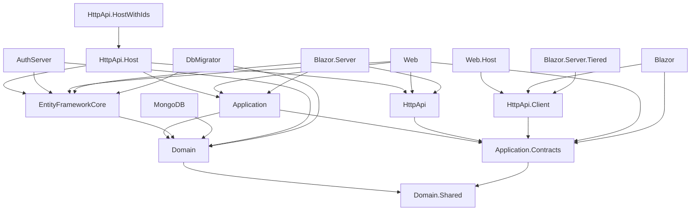

The `app` template at `templates/app/aspnet-core/` is the layered, DDD-flavoured ABP startup solution. When the CLI builds `abp new Acme.BookStore -t app`, it copies this tree, runs `SolutionRenameStep` to swap every `MyCompanyName.MyProjectName` placeholder for `Acme.BookStore`, deletes the projects that do not match the selected UI / database provider, and emits a ready-to-run solution. This page is a project-by-project tour of what comes out: every `.csproj`, what it depends on, which `*Module.cs` boots it, and how the dependency graph fits together. Cross-reference [Templates Overview](/templates/overview) for the catalog and [Template Structure & Replacements](/templates/template-structure-and-replacements) for the pipeline that does the rewriting.

<Info>
The folder layout shown here is the *template source* — i.e. what the maintainers edit. The generated solution drops `MyCompanyName.` from the Web/HttpApi/AuthServer hosts only when a flag asks for it; otherwise the names you see are exactly the ones the user gets, with the placeholder replaced. See `SolutionRenameStep` in [Template Structure & Replacements](/templates/template-structure-and-replacements#solutionrenamestep).
</Info>

## Solution layout

```text templates/app/aspnet-core/
├── MyCompanyName.MyProjectName.sln
├── MyCompanyName.MyProjectName.sln.DotSettings
├── NuGet.Config
├── README.md
├── common.props
├── src/
│   ├── MyCompanyName.MyProjectName.Domain.Shared/
│   ├── MyCompanyName.MyProjectName.Domain/
│   ├── MyCompanyName.MyProjectName.Application.Contracts/
│   ├── MyCompanyName.MyProjectName.Application/
│   ├── MyCompanyName.MyProjectName.EntityFrameworkCore/
│   ├── MyCompanyName.MyProjectName.MongoDB/
│   ├── MyCompanyName.MyProjectName.HttpApi/
│   ├── MyCompanyName.MyProjectName.HttpApi.Client/
│   ├── MyCompanyName.MyProjectName.HttpApi.Host/
│   ├── MyCompanyName.MyProjectName.HttpApi.HostWithIds/
│   ├── MyCompanyName.MyProjectName.AuthServer/
│   ├── MyCompanyName.MyProjectName.Web/
│   ├── MyCompanyName.MyProjectName.Web.Host/
│   ├── MyCompanyName.MyProjectName.Blazor/
│   ├── MyCompanyName.MyProjectName.Blazor.Server/
│   ├── MyCompanyName.MyProjectName.Blazor.Server.Tiered/
│   └── MyCompanyName.MyProjectName.DbMigrator/
└── test/
    ├── MyCompanyName.MyProjectName.TestBase/
    ├── MyCompanyName.MyProjectName.Domain.Tests/
    ├── MyCompanyName.MyProjectName.Application.Tests/
    ├── MyCompanyName.MyProjectName.EntityFrameworkCore.Tests/
    ├── MyCompanyName.MyProjectName.MongoDB.Tests/
    ├── MyCompanyName.MyProjectName.HttpApi.Client.ConsoleTestApp/
    └── MyCompanyName.MyProjectName.Web.Tests/
```

The companion `templates/app/angular/` tree (covered in [Angular Template](/templates/angular-template)) is removed by `RemoveFolderStep("/angular")` when `-u angular` is not selected — see `AppTemplateBase.DeleteUnrelatedProjects`.

## Project inventory

### Domain layer

| Project | Role |
| --- | --- |
| `src/MyCompanyName.MyProjectName.Domain.Shared/MyCompanyName.MyProjectName.Domain.Shared.csproj` | Constants, enums, error codes and localization that *both* the Domain layer and clients can reference safely. |
| `src/MyCompanyName.MyProjectName.Domain/MyCompanyName.MyProjectName.Domain.csproj` | Aggregate roots, domain services, repositories' interfaces, value objects. Depends on Identity, OpenIddict, TenantManagement, AuditLogging, BackgroundJobs Domain modules. |

```xml templates/app/aspnet-core/src/MyCompanyName.MyProjectName.Domain/MyCompanyName.MyProjectName.Domain.csproj
<Project Sdk="Microsoft.NET.Sdk">
  <Import Project="..\..\common.props" />
  <PropertyGroup>
    <TargetFramework>net8.0</TargetFramework>
    <Nullable>enable</Nullable>
    <RootNamespace>MyCompanyName.MyProjectName</RootNamespace>
  </PropertyGroup>
  <ItemGroup>
    <ProjectReference Include="..\MyCompanyName.MyProjectName.Domain.Shared\MyCompanyName.MyProjectName.Domain.Shared.csproj" />
  </ItemGroup>
  <ItemGroup>
    <ProjectReference Include="..\..\..\..\..\framework\src\Volo.Abp.Emailing\Volo.Abp.Emailing.csproj" />
    <ProjectReference Include="..\..\..\..\..\modules\identity\src\Volo.Abp.Identity.Domain\Volo.Abp.Identity.Domain.csproj" />
    <ProjectReference Include="..\..\..\..\..\modules\identity\src\Volo.Abp.PermissionManagement.Domain.Identity\Volo.Abp.PermissionManagement.Domain.Identity.csproj" />
    <ProjectReference Include="..\..\..\..\..\modules\background-jobs\src\Volo.Abp.BackgroundJobs.Domain\Volo.Abp.BackgroundJobs.Domain.csproj" />
    <ProjectReference Include="..\..\..\..\..\modules\audit-logging\src\Volo.Abp.AuditLogging.Domain\Volo.Abp.AuditLogging.Domain.csproj" />
    <ProjectReference Include="..\..\..\..\..\modules\tenant-management\src\Volo.Abp.TenantManagement.Domain\Volo.Abp.TenantManagement.Domain.csproj" />
    <ProjectReference Include="..\..\..\..\..\modules\feature-management\src\Volo.Abp.FeatureManagement.Domain\Volo.Abp.FeatureManagement.Domain.csproj" />
    <ProjectReference Include="..\..\..\..\..\modules\setting-management\src\Volo.Abp.SettingManagement.Domain\Volo.Abp.SettingManagement.Domain.csproj" />
    <ProjectReference Include="..\..\..\..\..\modules\openiddict\src\Volo.Abp.OpenIddict.Domain\Volo.Abp.OpenIddict.Domain.csproj" />
    <ProjectReference Include="..\..\..\..\..\modules\openiddict\src\Volo.Abp.PermissionManagement.Domain.OpenIddict\Volo.Abp.PermissionManagement.Domain.OpenIddict.csproj" />
  </ItemGroup>
</Project>
```

The Domain module class wires those packages in via `[DependsOn(...)]` and seeds the languages list:

```csharp templates/app/aspnet-core/src/MyCompanyName.MyProjectName.Domain/MyProjectNameDomainModule.cs
[DependsOn(
    typeof(MyProjectNameDomainSharedModule),
    typeof(AbpAuditLoggingDomainModule),
    typeof(AbpBackgroundJobsDomainModule),
    typeof(AbpFeatureManagementDomainModule),
    typeof(AbpIdentityDomainModule),
    typeof(AbpOpenIddictDomainModule),
    typeof(AbpPermissionManagementDomainOpenIddictModule),
    typeof(AbpPermissionManagementDomainIdentityModule),
    typeof(AbpSettingManagementDomainModule),
    typeof(AbpTenantManagementDomainModule),
    typeof(AbpEmailingModule)
)]
public class MyProjectNameDomainModule : AbpModule
{
    public override void ConfigureServices(ServiceConfigurationContext context)
    {
        Configure<AbpLocalizationOptions>(options =>
        {
            options.Languages.Add(new LanguageInfo("en", "en", "English", "gb"));
            // ...many more languages
        });
        // ...
    }
}
```

### Application layer

| Project | Role |
| --- | --- |
| `src/MyCompanyName.MyProjectName.Application.Contracts/MyCompanyName.MyProjectName.Application.Contracts.csproj` | Application service interfaces, DTOs, permissions. Referenced by both the host and any client (HttpApi.Client). |
| `src/MyCompanyName.MyProjectName.Application/MyCompanyName.MyProjectName.Application.csproj` | Concrete `IApplicationService` implementations, AutoMapper profile. Depends on Domain + Application.Contracts and Account/Identity/Permission/Tenant/Feature/Setting Application modules. |

```xml templates/app/aspnet-core/src/MyCompanyName.MyProjectName.Application/MyCompanyName.MyProjectName.Application.csproj
<Project Sdk="Microsoft.NET.Sdk">
  <Import Project="..\..\common.props" />
  <PropertyGroup>
    <TargetFramework>net8.0</TargetFramework>
    <Nullable>enable</Nullable>
    <RootNamespace>MyCompanyName.MyProjectName</RootNamespace>
  </PropertyGroup>
  <ItemGroup>
    <ProjectReference Include="..\MyCompanyName.MyProjectName.Domain\MyCompanyName.MyProjectName.Domain.csproj" />
    <ProjectReference Include="..\MyCompanyName.MyProjectName.Application.Contracts\MyCompanyName.MyProjectName.Application.Contracts.csproj" />
  </ItemGroup>
  <ItemGroup>
    <ProjectReference Include="..\..\..\..\..\modules\account\src\Volo.Abp.Account.Application\Volo.Abp.Account.Application.csproj" />
    <ProjectReference Include="..\..\..\..\..\modules\identity\src\Volo.Abp.Identity.Application\Volo.Abp.Identity.Application.csproj" />
    <ProjectReference Include="..\..\..\..\..\modules\permission-management\src\Volo.Abp.PermissionManagement.Application\Volo.Abp.PermissionManagement.Application.csproj" />
    <ProjectReference Include="..\..\..\..\..\modules\tenant-management\src\Volo.Abp.TenantManagement.Application\Volo.Abp.TenantManagement.Application.csproj" />
    <ProjectReference Include="..\..\..\..\..\modules\feature-management\src\Volo.Abp.FeatureManagement.Application\Volo.Abp.FeatureManagement.Application.csproj" />
    <ProjectReference Include="..\..\..\..\..\modules\setting-management\src\Volo.Abp.SettingManagement.Application\Volo.Abp.SettingManagement.Application.csproj" />
  </ItemGroup>
</Project>
```

### Persistence providers

| Project | Role |
| --- | --- |
| `src/MyCompanyName.MyProjectName.EntityFrameworkCore/MyCompanyName.MyProjectName.EntityFrameworkCore.csproj` | `MyProjectNameDbContext`, EF Core migrations (when `HasDbMigrations` is true), `DbContextFactory` for design-time tooling. References `Volo.Abp.EntityFrameworkCore.SqlServer` by default. |
| `src/MyCompanyName.MyProjectName.MongoDB/MyCompanyName.MyProjectName.MongoDB.csproj` | `MyProjectNameMongoDbContext`, schema migrator implementation. |

Inside the EF Core project, the `EntityFrameworkCore/` folder lays out the canonical files:

```text templates/app/aspnet-core/src/MyCompanyName.MyProjectName.EntityFrameworkCore/EntityFrameworkCore/
├── EntityFrameworkCoreMyProjectNameDbSchemaMigrator.cs
├── MyProjectNameDbContext.cs
├── MyProjectNameDbContextFactory.cs
├── MyProjectNameEfCoreEntityExtensionMappings.cs
└── MyProjectNameEntityFrameworkCoreModule.cs
```

Only one of the two provider projects survives the build pipeline — `SwitchDatabaseProvider` in `AppTemplateBase` removes whichever is not selected by `-d`.

### HTTP API surface

| Project | Role |
| --- | --- |
| `src/MyCompanyName.MyProjectName.HttpApi/MyCompanyName.MyProjectName.HttpApi.csproj` | Auto-controllers and controller bases exposing application services as REST endpoints. |
| `src/MyCompanyName.MyProjectName.HttpApi.Client/MyCompanyName.MyProjectName.HttpApi.Client.csproj` | Dynamic HTTP proxy client — references Application.Contracts and the ABP dynamic-proxy module so external apps can `IRemoteServiceProxy`. |
| `src/MyCompanyName.MyProjectName.HttpApi.Host/MyCompanyName.MyProjectName.HttpApi.Host.csproj` | ASP.NET Core API host (Kestrel + Swagger). Used when the front-end is Angular / Blazor WASM / MAUI Blazor (the host has *no* identity server endpoints). |
| `src/MyCompanyName.MyProjectName.HttpApi.HostWithIds/MyCompanyName.MyProjectName.HttpApi.HostWithIds.csproj` | Same host but with embedded OpenIddict — used for non-tiered deployments where API + auth share one process. |

The `Program.cs` for the API host is a small Serilog + Autofac bootstrapper:

```csharp templates/app/aspnet-core/src/MyCompanyName.MyProjectName.HttpApi.Host/Program.cs
public class Program
{
    public async static Task<int> Main(string[] args)
    {
        Log.Logger = new LoggerConfiguration()
            // ...
            .CreateLogger();
        try
        {
            Log.Information("Starting MyCompanyName.MyProjectName.HttpApi.Host.");
            var builder = WebApplication.CreateBuilder(args);
            builder.Host.AddAppSettingsSecretsJson()
                .UseAutofac()
                .UseSerilog();
            await builder.AddApplicationAsync<MyProjectNameHttpApiHostModule>();
            var app = builder.Build();
            await app.InitializeApplicationAsync();
            await app.RunAsync();
            return 0;
        }
        // ...
    }
}
```

### Auth server & web hosts

| Project | Role |
| --- | --- |
| `src/MyCompanyName.MyProjectName.AuthServer/MyCompanyName.MyProjectName.AuthServer.csproj` | Standalone OpenIddict authorization server (login, consent, account pages). Kept only for tiered builds. |
| `src/MyCompanyName.MyProjectName.Web/MyCompanyName.MyProjectName.Web.csproj` | MVC / Razor Pages UI. In non-tiered mode it embeds auth; in tiered mode it becomes an OAuth client of `AuthServer`. |
| `src/MyCompanyName.MyProjectName.Web.Host/MyCompanyName.MyProjectName.Web.Host.csproj` | Tier-mode MVC host. Selected when `--tiered` is passed. |

The `AuthServer` project includes the `Pages/` Razor area, `OpenIddict/` data seed, `appsettings.json` and `Program.cs`:

```text templates/app/aspnet-core/src/MyCompanyName.MyProjectName.AuthServer/
├── MyCompanyName.MyProjectName.AuthServer.csproj
├── MyProjectNameAuthServerModule.cs
├── MyProjectNameBrandingProvider.cs
├── Pages/
├── Program.cs
├── Properties/
├── abp.resourcemapping.js
├── appsettings.Development.json
├── appsettings.json
├── package.json
├── web.config
└── wwwroot/
```

### Blazor variants

| Project | Role |
| --- | --- |
| `src/MyCompanyName.MyProjectName.Blazor/MyCompanyName.MyProjectName.Blazor.csproj` | Blazor WebAssembly client. Removed unless `-u blazor` is chosen. |
| `src/MyCompanyName.MyProjectName.Blazor.Server/MyCompanyName.MyProjectName.Blazor.Server.csproj` | Blazor Server (non-tiered) host. |
| `src/MyCompanyName.MyProjectName.Blazor.Server.Tiered/MyCompanyName.MyProjectName.Blazor.Server.Tiered.csproj` | Blazor Server tiered variant (auth via separate `AuthServer`). |

`AppTemplateBase.DeleteUnrelatedProjects` removes the `Blazor*` projects whenever the chosen UI is neither WASM nor Server:

```csharp framework/src/Volo.Abp.Cli.Core/Volo/Abp/Cli/ProjectBuilding/Templates/App/AppTemplateBase.cs
if (context.BuildArgs.UiFramework != UiFramework.Blazor &&
    context.BuildArgs.UiFramework != UiFramework.BlazorServer)
{
    steps.Add(new RemoveProjectFromSolutionStep("MyCompanyName.MyProjectName.Blazor"));
}

if (context.BuildArgs.UiFramework != UiFramework.BlazorServer)
{
    steps.Add(new RemoveProjectFromSolutionStep("MyCompanyName.MyProjectName.Blazor.Server"));
    steps.Add(new RemoveProjectFromSolutionStep("MyCompanyName.MyProjectName.Blazor.Server.Tiered"));
}
```

### Database migrator

| Project | Role |
| --- | --- |
| `src/MyCompanyName.MyProjectName.DbMigrator/MyCompanyName.MyProjectName.DbMigrator.csproj` | Console host that applies EF Core migrations and seeds initial data (admin user, OpenIddict client/scope, tenants). |

```csharp templates/app/aspnet-core/src/MyCompanyName.MyProjectName.DbMigrator/Program.cs
class Program
{
    static async Task Main(string[] args)
    {
        Log.Logger = new LoggerConfiguration()
            .MinimumLevel.Information()
            // ...
            .CreateLogger();

        await CreateHostBuilder(args).RunConsoleAsync();
    }

    public static IHostBuilder CreateHostBuilder(string[] args) =>
        Host.CreateDefaultBuilder(args)
            .AddAppSettingsSecretsJson()
            .ConfigureLogging((context, logging) => logging.ClearProviders())
            .ConfigureServices((hostContext, services) =>
            {
                services.AddHostedService<DbMigratorHostedService>();
            });
}
```

The `DbMigratorHostedService` boots an `AbpApplicationFactory.CreateAsync<MyProjectNameDbMigratorModule>` inside `StartAsync`, runs the schema migrator and exits.

### Tests

| Project | Role |
| --- | --- |
| `test/MyCompanyName.MyProjectName.TestBase/MyCompanyName.MyProjectName.TestBase.csproj` | Shared xUnit test base — fixture, data seed contributor, claim faker. |
| `test/MyCompanyName.MyProjectName.Domain.Tests/MyCompanyName.MyProjectName.Domain.Tests.csproj` | Tests that exercise domain entities and domain services. |
| `test/MyCompanyName.MyProjectName.Application.Tests/MyCompanyName.MyProjectName.Application.Tests.csproj` | Application-service tests using the in-memory test base. |
| `test/MyCompanyName.MyProjectName.EntityFrameworkCore.Tests/MyCompanyName.MyProjectName.EntityFrameworkCore.Tests.csproj` | EF Core-specific integration tests (SQLite in-memory). Removed when MongoDB is selected. |
| `test/MyCompanyName.MyProjectName.MongoDB.Tests/MyCompanyName.MyProjectName.MongoDB.Tests.csproj` | Mongo2Go-backed integration tests. Removed when EF Core is selected. |
| `test/MyCompanyName.MyProjectName.HttpApi.Client.ConsoleTestApp/MyCompanyName.MyProjectName.HttpApi.Client.ConsoleTestApp.csproj` | Smoke-test console hitting the API with the dynamic HTTP client. |
| `test/MyCompanyName.MyProjectName.Web.Tests/MyCompanyName.MyProjectName.Web.Tests.csproj` | MVC integration tests with a `WebApplicationFactory`. |

## Project-reference graph



Solid arrows mean a `<ProjectReference>` exists in the `.csproj`; the host projects (`HttpApi.Host`, `Web`, `Blazor.Server`) additionally reference the provider project (`EF` *or* `MongoDB`) the build kept.

## Tiered vs non-tiered

Use `abp new ... -t app --tiered` to get an authorization-server-separated topology. The pipeline keeps `MyCompanyName.MyProjectName.AuthServer` and `MyCompanyName.MyProjectName.HttpApi.Host`, removes `MyCompanyName.MyProjectName.HttpApi.HostWithIds`, and rewrites client configuration to point at the standalone auth server. For the MVC UI it also swaps `Web` (embedded auth) for `Web.Host` (OAuth client). The same logic applies to Blazor Server: `Blazor.Server` is kept for non-tiered, replaced by `Blazor.Server.Tiered` when `--tiered`.

<Tip>
Run `abp new Acme.BookStore -t app -u blazor-server --tiered -d ef --dbms PostgreSQL` and watch the CLI log: it prints every `RemoveProjectFromSolutionStep` it executes — that's the exact set this page describes.
</Tip>

## Database provider switching

When `-d mongodb` is supplied, `AppTemplateSwitchEntityFrameworkCoreToMongoDbStep` is added to the pipeline:

```csharp framework/src/Volo.Abp.Cli.Core/Volo/Abp/Cli/ProjectBuilding/Templates/App/AppTemplateBase.cs
if (context.BuildArgs.DatabaseProvider == DatabaseProvider.MongoDb)
{
    steps.Add(new AppTemplateSwitchEntityFrameworkCoreToMongoDbStep(HasDbMigrations));
}

if (context.BuildArgs.DatabaseProvider != DatabaseProvider.EntityFrameworkCore)
{
    steps.Add(new RemoveProjectFromSolutionStep("MyCompanyName.MyProjectName.EntityFrameworkCore"));
    steps.Add(new RemoveProjectFromSolutionStep(
        "MyCompanyName.MyProjectName.EntityFrameworkCore.Tests",
        projectFolderPath: "/aspnet-core/test/MyCompanyName.MyProjectName.EntityFrameworkCore.Tests"));
}

if (context.BuildArgs.DatabaseProvider != DatabaseProvider.MongoDb)
{
    steps.Add(new RemoveProjectFromSolutionStep("MyCompanyName.MyProjectName.MongoDB"));
    steps.Add(new RemoveProjectFromSolutionStep(
        "MyCompanyName.MyProjectName.MongoDB.Tests",
        projectFolderPath: "/aspnet-core/test/MyCompanyName.MyProjectName.MongoDB.Tests"));
}
```

For EF Core, `--dbms` further triggers `DatabaseManagementSystemChangeStep` to swap the `Volo.Abp.EntityFrameworkCore.SqlServer` reference for MySQL / PostgreSQL / Oracle / SQLite — see [Template Structure & Replacements](/templates/template-structure-and-replacements#dbms-symbols).

## Shared build properties

Every project imports the central `common.props`:

```text templates/app/aspnet-core/common.props
<Project>
  <Import Project="..\..\..\Directory.Build.props" />
  ...
</Project>
```

That keeps `<TargetFramework>net8.0</TargetFramework>`, `<RootNamespace>` and analyzer settings consistent. `NuGet.Config` lists the official ABP feed; `UpdateNuGetConfigStep` in the pipeline rewrites it for users who run with a different feed.

## What the user actually gets

Once the pipeline finishes, the user sees (for `Acme.BookStore`, EF Core SQL Server, MVC, non-tiered):

| Generated project | Where it came from |
| --- | --- |
| `Acme.BookStore.Domain.Shared` | `MyCompanyName.MyProjectName.Domain.Shared` |
| `Acme.BookStore.Domain` | `MyCompanyName.MyProjectName.Domain` |
| `Acme.BookStore.Application.Contracts` | `MyCompanyName.MyProjectName.Application.Contracts` |
| `Acme.BookStore.Application` | `MyCompanyName.MyProjectName.Application` |
| `Acme.BookStore.EntityFrameworkCore` | `MyCompanyName.MyProjectName.EntityFrameworkCore` |
| `Acme.BookStore.HttpApi` | `MyCompanyName.MyProjectName.HttpApi` |
| `Acme.BookStore.HttpApi.Client` | `MyCompanyName.MyProjectName.HttpApi.Client` |
| `Acme.BookStore.Web` | `MyCompanyName.MyProjectName.Web` |
| `Acme.BookStore.DbMigrator` | `MyCompanyName.MyProjectName.DbMigrator` |
| `Acme.BookStore.*.Tests` (5 projects) | Same names under `test/` |

Removed: `MongoDB`, `MongoDB.Tests`, `AuthServer`, `HttpApi.Host`, `Web.Host`, `Blazor*`, the `angular/` and `react-native/` folders.

## Cross-references

<CardGroup cols={2}>
  <Card title="Templates overview" href="/templates/overview" icon="layer-group">
    Top-level catalog of every template directory.
  </Card>
  <Card title="Structure & replacements" href="/templates/template-structure-and-replacements" icon="wand-magic-sparkles">
    How `MyCompanyName.MyProjectName` becomes `Acme.BookStore`.
  </Card>
  <Card title="CLI: new & update" href="/cli/new-and-update" icon="terminal">
    The `abp new` command surface that materialises this template.
  </Card>
  <Card title="Project building" href="/cli/project-building-and-templates" icon="hammer">
    `TemplateInfo`, `ProjectBuilder`, ZIP source stores.
  </Card>
</CardGroup>
