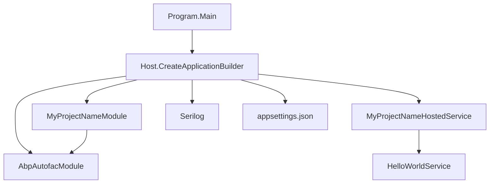

The `console` template at `templates/console/` is the smallest possible ABP solution: one project, no web stack, just `Host.CreateApplicationBuilder(args)` + an `AbpModule` + an `IHostedService` that prints "Hello World!" through ABP's DI container. It is the template you reach for when you want background workers, schedulers, message-bus consumers or migration utilities that still need ABP's modularity, options binding, virtual file system, logging and Autofac integration — but absolutely no Kestrel. See [Templates Overview](/templates/overview) for the catalog and [Template Structure & Replacements](/templates/template-structure-and-replacements) for the pipeline that materialises it.

<Info>
`ConsoleTemplate.TemplateName` is the literal string `"console"`. It maps to `ConsoleTemplateBase` which adds **no** custom pipeline steps beyond the shared rename + port randomisation — there is nothing UI-, database- or tier-specific to delete.
</Info>

## Directory layout

```text templates/console/
└── src/
    └── MyCompanyName.MyProjectName/
        ├── MyCompanyName.MyProjectName.csproj
        ├── Program.cs
        ├── MyProjectNameModule.cs
        ├── MyProjectNameHostedService.cs
        ├── HelloWorldService.cs
        ├── Properties/
        │   └── launchSettings.json
        └── appsettings.json
```

That is the *entire* template — one project, six source files (counting `launchSettings.json` and `appsettings.json`). Compare with `templates/app/aspnet-core/` (a dozen projects in `src/` + seven in `test/`).

## Project inventory

| File | Role |
| --- | --- |
| `src/MyCompanyName.MyProjectName/MyCompanyName.MyProjectName.csproj` | The console executable. `<OutputType>Exe</OutputType>`, `net8.0`, references `Volo.Abp.Autofac` and the Serilog + `Microsoft.Extensions.Hosting` packages. |
| `Program.cs` | Entry point. Builds a `Host.CreateApplicationBuilder` and adds the `MyProjectNameModule` via `AddApplicationAsync`. |
| `MyProjectNameModule.cs` | The `AbpModule` — only declares `[DependsOn(typeof(AbpAutofacModule))]`. |
| `MyProjectNameHostedService.cs` | `IHostedService` that calls the sample service on `StartAsync`. |
| `HelloWorldService.cs` | Sample `ITransientDependency` showing how DI resolves services inside the host. |
| `appsettings.json` | Plain JSON config with one demo key (`MySettingName`). |
| `Properties/launchSettings.json` | Visual Studio / `dotnet run` profile. |

## The csproj

```xml templates/console/src/MyCompanyName.MyProjectName/MyCompanyName.MyProjectName.csproj
<Project Sdk="Microsoft.NET.Sdk">
    <Import Project="..\..\common.props" />
    <PropertyGroup>
        <OutputType>Exe</OutputType>
        <TargetFramework>net8.0</TargetFramework>
        <Nullable>enable</Nullable>
    </PropertyGroup>
    <ItemGroup>
        <ProjectReference Include="..\..\..\..\framework\src\Volo.Abp.Autofac\Volo.Abp.Autofac.csproj" />
    </ItemGroup>
    <ItemGroup>
      <PackageReference Include="Microsoft.Extensions.Hosting" Version="8.0.0" />
      <PackageReference Include="Serilog.Extensions.Hosting" Version="8.0.0" />
      <PackageReference Include="Serilog.Extensions.Logging" Version="8.0.0" />
      <PackageReference Include="Serilog.Sinks.Async" Version="1.5.0" />
      <PackageReference Include="Serilog.Sinks.Console" Version="5.0.0" />
      <PackageReference Include="Serilog.Sinks.File" Version="5.0.0" />
    </ItemGroup>
    <ItemGroup>
        <Content Include="appsettings.json">
            <CopyToPublishDirectory>PreserveNewest</CopyToPublishDirectory>
            <CopyToOutputDirectory>Always</CopyToOutputDirectory>
        </Content>
        <Content Include="appsettings.secrets.json" Condition="Exists('appsettings.secrets.json')">
            <CopyToPublishDirectory>PreserveNewest</CopyToPublishDirectory>
            <CopyToOutputDirectory>Always</CopyToOutputDirectory>
        </Content>
    </ItemGroup>
</Project>
```

The `<Import Project="..\..\common.props" />` brings central package versions in from the template root.

## `Program.cs` — startup walkthrough

```csharp templates/console/src/MyCompanyName.MyProjectName/Program.cs
public class Program
{
    public async static Task<int> Main(string[] args)
    {
        Log.Logger = new LoggerConfiguration()
#if DEBUG
            .MinimumLevel.Debug()
#else
            .MinimumLevel.Information()
#endif
            .MinimumLevel.Override("Microsoft", LogEventLevel.Information)
            .Enrich.FromLogContext()
            .WriteTo.Async(c => c.File("Logs/logs.txt"))
            .WriteTo.Async(c => c.Console())
            .CreateLogger();

        try
        {
            Log.Information("Starting console host.");

            var builder = Host.CreateApplicationBuilder(args);

            builder.Configuration.AddAppSettingsSecretsJson();
            builder.Logging.ClearProviders().AddSerilog();

            builder.ConfigureContainer(builder.Services.AddAutofacServiceProviderFactory());

            builder.Services.AddHostedService<MyProjectNameHostedService>();

            await builder.Services.AddApplicationAsync<MyProjectNameModule>();

            var host = builder.Build();

            await host.InitializeAsync();

            await host.RunAsync();

            return 0;
        }
        catch (Exception ex)
        {
            if (ex is HostAbortedException)
            {
                throw;
            }

            Log.Fatal(ex, "Host terminated unexpectedly!");
            return 1;
        }
        finally
        {
            Log.CloseAndFlush();
        }
    }
}
```

Steps to notice:

1. **Serilog first.** A static Serilog logger is wired before anything else so even pre-host failures are captured.
2. **Generic Host.** `Host.CreateApplicationBuilder(args)` (the .NET 8 builder) replaces the older `Host.CreateDefaultBuilder` pattern.
3. **Autofac.** `builder.ConfigureContainer(builder.Services.AddAutofacServiceProviderFactory())` swaps the default DI container for Autofac, which ABP needs for property injection and conventional registration.
4. **Hosted service.** `MyProjectNameHostedService` is added as the long-running worker.
5. **ABP boot.** `AddApplicationAsync<MyProjectNameModule>()` registers ABP's module system; `host.InitializeAsync()` runs the `OnApplicationInitialization` hooks before `host.RunAsync()` blocks.
6. **Exit code.** Returning a value from `Main` lets shell scripts react to `1` on fatal errors. The `HostAbortedException` re-throw lets EF Core design-time tooling (`dotnet ef`) probe the host without recording a "crash".

## The module

```csharp templates/console/src/MyCompanyName.MyProjectName/MyProjectNameModule.cs
[DependsOn(
    typeof(AbpAutofacModule)
)]
public class MyProjectNameModule : AbpModule
{
    public override Task OnApplicationInitializationAsync(ApplicationInitializationContext context)
    {
        var logger = context.ServiceProvider.GetRequiredService<ILogger<MyProjectNameModule>>();
        var configuration = context.ServiceProvider.GetRequiredService<IConfiguration>();
        logger.LogInformation($"MySettingName => {configuration["MySettingName"]}");

        var hostEnvironment = context.ServiceProvider.GetRequiredService<IHostEnvironment>();
        logger.LogInformation($"EnvironmentName => {hostEnvironment.EnvironmentName}");

        return Task.CompletedTask;
    }
}
```

A bare `AbpModule` — the only `[DependsOn]` is the Autofac integration module. The override demonstrates how to read configuration *and* hosting environment from the ABP service provider.

## The hosted service

```csharp templates/console/src/MyCompanyName.MyProjectName/MyProjectNameHostedService.cs
public class MyProjectNameHostedService : IHostedService
{
    private readonly HelloWorldService _helloWorldService;

    public MyProjectNameHostedService(HelloWorldService helloWorldService)
    {
        _helloWorldService = helloWorldService;
    }

    public async Task StartAsync(CancellationToken cancellationToken)
    {
        await _helloWorldService.SayHelloAsync();
    }

    public Task StopAsync(CancellationToken cancellationToken)
    {
        return Task.CompletedTask;
    }
}
```

`MyProjectNameHostedService` is registered as the long-lived worker by `builder.Services.AddHostedService<MyProjectNameHostedService>()` in `Program.cs`. It receives `HelloWorldService` via constructor injection.

## The sample service

```csharp templates/console/src/MyCompanyName.MyProjectName/HelloWorldService.cs
public class HelloWorldService : ITransientDependency
{
    public ILogger<HelloWorldService> Logger { get; set; }

    public HelloWorldService()
    {
        Logger = NullLogger<HelloWorldService>.Instance;
    }

    public Task SayHelloAsync()
    {
        Logger.LogInformation("Hello World!");
        return Task.CompletedTask;
    }
}
```

Two ABP conventions are on display:

- Marker interface `ITransientDependency` triggers ABP's conventional registration — no `AddTransient<HelloWorldService>()` call is needed.
- Property-injected `ILogger` defaults to `NullLogger.Instance`; Autofac fills the actual logger at resolve time.

## Component graph



## What the user actually gets

`ConsoleTemplateBase` does not override `GetCustomSteps`, so the only pipeline transforms are the inherited ones from `TemplateInfo.GetCustomSteps`:

- `SolutionRenameStep` rewrites `MyCompanyName.MyProjectName` to the user's value.
- `TemplateRandomSslPortStep` runs but finds nothing to change (the console has no Kestrel ports).
- `TemplateCodeDeleteStep` strips `<TEMPLATE-REMOVE>` / `<TEMPLATE-REMOVE IF-NOT='...'>` regions.
- `UpdateNuGetConfigStep` fixes the NuGet feed list if the user supplied a custom one.

For `abp new Acme.HelloConsole -t console` the output is:

| File | Source |
| --- | --- |
| `src/Acme.HelloConsole/Acme.HelloConsole.csproj` | `MyCompanyName.MyProjectName.csproj` |
| `src/Acme.HelloConsole/Program.cs` | Same, with namespace rewritten. |
| `src/Acme.HelloConsole/HelloConsoleModule.cs` | `MyProjectNameModule.cs` (file + class renamed). |
| `src/Acme.HelloConsole/HelloConsoleHostedService.cs` | `MyProjectNameHostedService.cs`. |
| `src/Acme.HelloConsole/HelloWorldService.cs` | Same. |
| `src/Acme.HelloConsole/appsettings.json` | Same. |
| `src/Acme.HelloConsole/Properties/launchSettings.json` | Same. |

`dotnet run` then prints `Hello World!` and exits when you press Ctrl+C.

## Extending the template

Common follow-ups:

- **Add a database.** Add `<ProjectReference Include="...Volo.Abp.EntityFrameworkCore.SqlServer..." />` and `[DependsOn(typeof(AbpEntityFrameworkCoreSqlServerModule))]`. The console is now a CLI tool that can run migrations.
- **Schedule work.** Add `Volo.Abp.BackgroundWorkers` and register an `IBackgroundWorker` instead of `IHostedService` so ABP coordinates start/stop with the module lifecycle.
- **Talk to a remote API.** Reference `Volo.Abp.Http.Client` and an existing module's `*.HttpApi.Client.csproj`; ABP's dynamic proxy will generate clients you can resolve from `HelloWorldService`'s constructor.

## Cross-references

<CardGroup cols={2}>
  <Card title="Templates overview" href="/templates/overview" icon="layer-group">
    Top-level catalog of every template directory.
  </Card>
  <Card title="Structure & replacements" href="/templates/template-structure-and-replacements" icon="wand-magic-sparkles">
    How the rename pipeline turns `MyCompanyName.MyProjectName` into your name.
  </Card>
  <Card title="CLI: new & update" href="/cli/new-and-update" icon="terminal">
    `abp new -t console` invocation surface.
  </Card>
  <Card title="WPF template" href="/templates/wpf-template" icon="window">
    Closest sibling — also one project, also Autofac-only.
  </Card>
</CardGroup>
