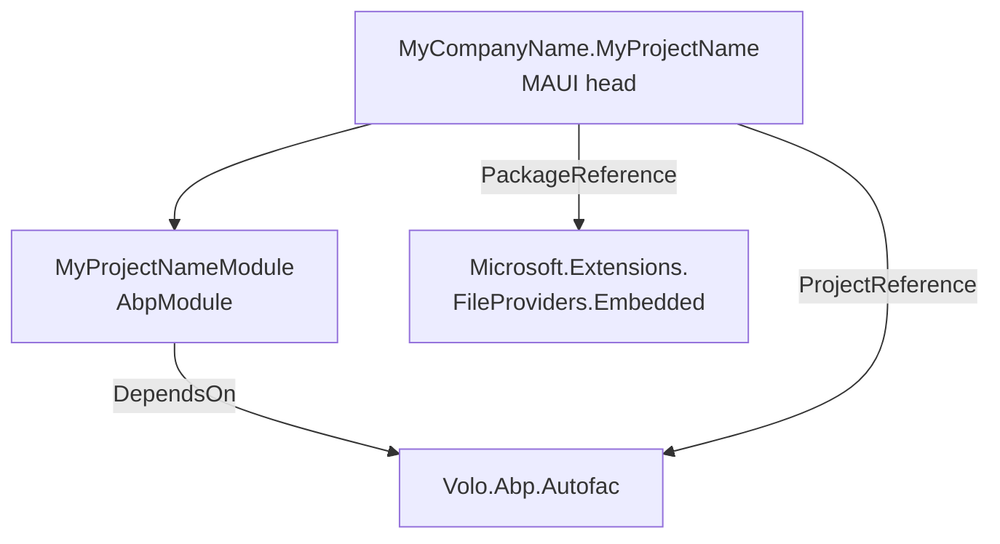

The `templates/maui` folder is the single-project source for ABP's native cross-platform startup template. It produces a .NET MAUI application that targets Android, iOS, MacCatalyst, Windows (and optionally Tizen), wires the ABP framework into the MAUI host through `AbpAutofacServiceProviderFactory`, and loads its `appsettings.json` as an embedded resource so the same binary works on every platform. Unlike the layered `app` template it is **not** an aspnet-core solution — it is a single MAUI head with a single ABP module class. When you run `abp new Acme.BookStore -t maui`, the CLI streams this folder's ZIP through the pipeline in [`TemplateProjectBuildPipelineBuilder`](/cli/project-building-and-templates), invokes `MauiTemplateBase.GetCustomSteps` (which only adds `MauiChangeApplicationIdGuidStep`), then runs the universal `SolutionRenameStep` + `TemplateCodeDeleteStep` + `ProjectReferenceReplaceStep` + `CreateProjectResultZipStep` to produce the final archive.

<Info>
This page documents the standalone `maui` template (`templates/maui`). The MAUI Blazor head that ships *inside* the `app` template (selected via `-u maui-blazor`) is a different artifact and is generated by the layered application pipeline. See [Clients — MAUI](/clients/maui) for the runtime side and [Templates Overview](/templates/overview) for the catalog.
</Info>

## Folder layout

The template is one MAUI project under `src/`. There is no separate `Application`, `Domain`, or `HttpApi.Client` project — everything lives in `MyCompanyName.MyProjectName`.

```
templates/maui/
├── common.props
└── src/
    └── MyCompanyName.MyProjectName/
        ├── App.xaml / App.xaml.cs
        ├── AppShell.xaml / AppShell.xaml.cs
        ├── MainPage.xaml / MainPage.xaml.cs
        ├── MauiProgram.cs
        ├── MyProjectNameModule.cs
        ├── HelloWorldService.cs
        ├── MyCompanyName.MyProjectName.csproj
        ├── appsettings.json
        ├── Platforms/
        │   ├── Android/
        │   ├── iOS/
        │   ├── MacCatalyst/
        │   ├── Windows/
        │   └── Tizen/
        ├── Properties/
        └── Resources/
            ├── AppIcon/
            ├── Fonts/
            ├── Images/
            ├── Raw/
            ├── Splash/
            └── Styles/
```

### Project inventory

| Path | Role |
| --- | --- |
| `src/MyCompanyName.MyProjectName/MyCompanyName.MyProjectName.csproj` | Single MAUI head project, `<UseMaui>true</UseMaui>`, multi-targets `net8.0-android;net8.0-ios;net8.0-maccatalyst`, conditionally `net8.0-windows10.0.19041.0` on Windows. |
| `src/MyCompanyName.MyProjectName/MauiProgram.cs` | Static `CreateMauiApp` entry point. Configures fonts, registers Autofac as the DI container, loads embedded `appsettings.json`, calls `AddApplication<MyProjectNameModule>` and initializes the ABP module system. |
| `src/MyCompanyName.MyProjectName/App.xaml.cs` | `Application` subclass that sets `MainPage = new AppShell()`. |
| `src/MyCompanyName.MyProjectName/AppShell.xaml` | Shell with a single `ShellContent` pointing at `MainPage`, flyout disabled. |
| `src/MyCompanyName.MyProjectName/MainPage.xaml.cs` | Sample page that injects `HelloWorldService` via constructor injection and updates `HelloLab.Text`. Implements `ISingletonDependency`. |
| `src/MyCompanyName.MyProjectName/HelloWorldService.cs` | Sample service marked `ITransientDependency` so ABP's conventional registration picks it up. |
| `src/MyCompanyName.MyProjectName/MyProjectNameModule.cs` | ABP module class — depends on `AbpAutofacModule`. The entire module body is empty by default. |
| `src/MyCompanyName.MyProjectName/appsettings.json` | Embedded JSON: `{ "AppName": "MyProjectName" }`. |
| `Platforms/Android/`, `Platforms/iOS/`, etc. | Standard MAUI platform heads (MainActivity, AppDelegate, …). |
| `Resources/Fonts/` | OpenSans-Regular.ttf, OpenSans-Semibold.ttf — registered in `MauiProgram`. |
| `common.props` | Shared MSBuild props (`<LangVersion>latest</LangVersion>`, `<Version>0.1.0</Version>`), imported by the csproj. |

## Project graph

The MAUI head references `Volo.Abp.Autofac` directly from the framework source. There are no other ABP project references in the template — at runtime the MAUI app talks to an ABP HTTP API over `HttpClient`, but that is consumer code, not part of the template.



## MauiProgram bootstrap

The host follows the standard MAUI `MauiAppBuilder` pattern, but inserts two ABP hooks: `ConfigureContainer(new AbpAutofacServiceProviderFactory(...))` to swap the DI container, and `AddApplication<MyProjectNameModule>` to register the ABP module graph.

```csharp templates/maui/src/MyCompanyName.MyProjectName/MauiProgram.cs lines icon="bolt"
using System.Reflection;
using Microsoft.Extensions.Configuration;
using Microsoft.Extensions.FileProviders;
using Volo.Abp;
using Volo.Abp.Autofac;

namespace MyCompanyName.MyProjectName;

public static class MauiProgram
{
    public static MauiApp CreateMauiApp()
    {
        var builder = MauiApp.CreateBuilder();
        builder
            .UseMauiApp<App>()
            .ConfigureFonts(fonts =>
            {
                fonts.AddFont("OpenSans-Regular.ttf", "OpenSansRegular");
                fonts.AddFont("OpenSans-Semibold.ttf", "OpenSansSemibold");
            })
            .ConfigureContainer(new AbpAutofacServiceProviderFactory(new Autofac.ContainerBuilder()));

        ConfigureConfiguration(builder);

        builder.Services.AddApplication<MyProjectNameModule>(options =>
        {
            options.Services.ReplaceConfiguration(builder.Configuration);
        });

        var app = builder.Build();

        app.Services.GetRequiredService<IAbpApplicationWithExternalServiceProvider>().Initialize(app.Services);

        return app;
    }

    private static void ConfigureConfiguration(MauiAppBuilder builder)
    {
        var assembly = typeof(App).GetTypeInfo().Assembly;
        builder.Configuration.AddJsonFile(new EmbeddedFileProvider(assembly), "appsettings.json", optional: false,false);
    }
}
```

A few details worth calling out:

<AccordionGroup>
  <Accordion title="Embedded appsettings.json">
    `appsettings.json` is shipped as an `EmbeddedResource` (see the `<ItemGroup>` in the csproj) and read through `EmbeddedFileProvider` against `typeof(App).Assembly`. This is necessary because MAUI apps do not have a writable working directory on iOS / Android the way an ASP.NET Core app does, and `AddJsonFile("appsettings.json")` against the filesystem would fail at runtime.
  </Accordion>
  <Accordion title="External service provider initialization">
    The line `app.Services.GetRequiredService<IAbpApplicationWithExternalServiceProvider>().Initialize(app.Services);` is the ABP equivalent of `host.RunAsync()` for module initialization — it calls every `OnApplicationInitialization` hook in the module dependency graph. Without it, the ABP module system would be wired up but never started.
  </Accordion>
  <Accordion title="Autofac requirement">
    `AbpAutofacServiceProviderFactory` is mandatory because several ABP modules rely on property injection, named services, and child container scoping that the default Microsoft DI cannot express. Removing the `ConfigureContainer` call will compile but throw at first resolve.
  </Accordion>
</AccordionGroup>

## The MAUI csproj

```xml templates/maui/src/MyCompanyName.MyProjectName/MyCompanyName.MyProjectName.csproj lines icon="file-code"
<Project Sdk="Microsoft.NET.Sdk">

	<Import Project="..\..\common.props" />

	<PropertyGroup>
		<TargetFrameworks>net8.0-android;net8.0-ios;net8.0-maccatalyst</TargetFrameworks>
		<TargetFrameworks Condition="$([MSBuild]::IsOSPlatform('windows'))">$(TargetFrameworks);net8.0-windows10.0.19041.0</TargetFrameworks>
		<Nullable>enable</Nullable>
		<OutputType>Exe</OutputType>
		<RootNamespace>MyCompanyName.MyProjectName</RootNamespace>
		<UseMaui>true</UseMaui>
		<SingleProject>true</SingleProject>
		<ImplicitUsings>enable</ImplicitUsings>

		<ApplicationTitle>MyCompanyName.MyProjectName</ApplicationTitle>
		<ApplicationId>com.mycompanyname.myprojectname</ApplicationId>
		<ApplicationIdGuid>27317750-B571-4690-B433-B358B2480E01</ApplicationIdGuid>

		<ApplicationDisplayVersion>1.0</ApplicationDisplayVersion>
		<ApplicationVersion>1</ApplicationVersion>
	</PropertyGroup>

	<ItemGroup>
		<ProjectReference Include="..\..\..\..\framework\src\Volo.Abp.Autofac\Volo.Abp.Autofac.csproj" />
		<PackageReference Include="Microsoft.Extensions.FileProviders.Embedded" Version="8.0.0" />
	</ItemGroup>

	<ItemGroup>
		<None Remove="appsettings.json" />
		<EmbeddedResource Include="appsettings.json" />
	</ItemGroup>

</Project>
```

The `ApplicationIdGuid` is a fixed GUID in the template (`27317750-B571-4690-B433-B358B2480E01`). At generation time the CLI rewrites it to a new random GUID — that is the single job of `MauiChangeApplicationIdGuidStep`, described below.

## Module wiring

The ABP module is intentionally empty. Application-side conventional registration (`ITransientDependency`, `ISingletonDependency`, `IScopedDependency`) is enough to pick up `HelloWorldService` and `MainPage` — no manual `context.Services.AddSingleton<MainPage>()` calls are necessary because `MainPage : ISingletonDependency`.

```csharp templates/maui/src/MyCompanyName.MyProjectName/MyProjectNameModule.cs lines icon="layer-group"
using Volo.Abp.Autofac;
using Volo.Abp.Modularity;

namespace MyCompanyName.MyProjectName;

[DependsOn(typeof(AbpAutofacModule))]
public class MyProjectNameModule : AbpModule
{
}
```

```csharp templates/maui/src/MyCompanyName.MyProjectName/HelloWorldService.cs lines icon="message"
using Volo.Abp.DependencyInjection;

namespace MyCompanyName.MyProjectName;

public class HelloWorldService : ITransientDependency
{
    public string SayHello()
    {
        return "Hello, World!";
    }
}
```

```csharp templates/maui/src/MyCompanyName.MyProjectName/MainPage.xaml.cs lines icon="window"
using Volo.Abp.DependencyInjection;

namespace MyCompanyName.MyProjectName;

public partial class MainPage : ContentPage, ISingletonDependency
{
    private readonly HelloWorldService _helloWorldService;

    int count = 0;

    public MainPage(HelloWorldService helloWorldService)
    {
        _helloWorldService = helloWorldService;
        InitializeComponent();
        SetHelloLabText();
    }

    private void SetHelloLabText()
    {
        HelloLab.Text = _helloWorldService.SayHello();
    }
}
```

## Shell and pages

`AppShell` is a single-tab Shell that points at `MainPage` — no flyout, no navigation graph. This is the minimum surface needed to demonstrate DI into a page.

```xml templates/maui/src/MyCompanyName.MyProjectName/AppShell.xaml lines icon="compass"
<?xml version="1.0" encoding="UTF-8" ?>
<Shell
    x:Class="MyCompanyName.MyProjectName.AppShell"
    xmlns="http://schemas.microsoft.com/dotnet/2021/maui"
    xmlns:x="http://schemas.microsoft.com/winfx/2009/xaml"
    xmlns:local="clr-namespace:MyCompanyName.MyProjectName"
    Shell.FlyoutBehavior="Disabled">

    <ShellContent
        Title="Home"
        ContentTemplate="{DataTemplate local:MainPage}"
        Route="MainPage" />

</Shell>
```

```csharp templates/maui/src/MyCompanyName.MyProjectName/App.xaml.cs lines icon="rocket"
namespace MyCompanyName.MyProjectName;

public partial class App : Application
{
    public App()
    {
        InitializeComponent();

        MainPage = new AppShell();
    }
}
```

## How the CLI generates a MAUI solution

The MAUI template has the simplest pipeline of any template in this repo. `MauiTemplate` is a one-liner that sets the template name to `"maui"` and points at the docs URL:

```csharp framework/src/Volo.Abp.Cli.Core/Volo/Abp/Cli/ProjectBuilding/Templates/Maui/MauiTemplate.cs lines icon="terminal"
namespace Volo.Abp.Cli.ProjectBuilding.Templates.Maui;

public class MauiTemplate : MauiTemplateBase
{
    /// <summary>
    /// "maui".
    /// </summary>
    public const string TemplateName = "maui";

    public MauiTemplate()
        : base(TemplateName)
    {
        DocumentUrl = CliConsts.DocsLink + "/en/abp/latest/Startup-Templates/MAUI";
    }
}
```

`MauiTemplateBase.GetCustomSteps` is a hard-coded list with a single entry:

```csharp framework/src/Volo.Abp.Cli.Core/Volo/Abp/Cli/ProjectBuilding/Templates/Maui/MauiTemplateBase.cs lines icon="gears"
public override IEnumerable<ProjectBuildPipelineStep> GetCustomSteps(ProjectBuildContext context)
{
    var steps = new List<ProjectBuildPipelineStep>
    {
        new MauiChangeApplicationIdGuidStep()
    };

    return steps;
}
```

`MauiChangeApplicationIdGuidStep` rewrites the `<ApplicationIdGuid>` element in the csproj so two `abp new` invocations of the maui template do not collide on the same Android / Windows application identity:

```csharp framework/src/Volo.Abp.Cli.Core/Volo/Abp/Cli/ProjectBuilding/Templates/Maui/MauiChangeApplicationIdGuidStep.cs lines icon="dice"
public class MauiChangeApplicationIdGuidStep: ProjectBuildPipelineStep
{
    public override void Execute(ProjectBuildContext context)
    {
        var projectFile = context.Files.FirstOrDefault(f =>
            f.Name.EndsWith("MyCompanyName.MyProjectName.csproj") ||
            f.Name.EndsWith("MyCompanyName.MyProjectName.Maui.csproj"));

        if (projectFile == null)
        {
            return;
        }

        using (var stream = StreamHelper.GenerateStreamFromString(projectFile.Content))
        {
            var doc = new XmlDocument { PreserveWhitespace = true };
            doc.Load(stream);

            var node = doc.SelectSingleNode("/Project/PropertyGroup/ApplicationIdGuid");
            // ... replaces inner text with Guid.NewGuid()
        }
    }
}
```

After `GetCustomSteps` returns, the universal pipeline takes over:

<Steps>
  <Step title="FileEntryListReadStep">
    Unzips the template archive into `context.Files`.
  </Step>
  <Step title="MauiChangeApplicationIdGuidStep">
    Replaces the fixed `27317750-…` GUID with a fresh `Guid.NewGuid()`.
  </Step>
  <Step title="ProjectReferenceReplaceStep">
    If the build was launched with `--local-framework-ref`, swaps `<ProjectReference>` paths to point at a local checkout; otherwise rewrites the `Volo.Abp.Autofac` `ProjectReference` to a `PackageReference` against the released NuGet version.
  </Step>
  <Step title="TemplateCodeDeleteStep">
    Strips `<TEMPLATE-REMOVE>` / `<TEMPLATE-REMOVE-IF-NOT>` markers from `.cs`, `.csproj`, `.json`, `.xml`, `.cshtml`, `.ts`, `.css`, and Dockerfiles.
  </Step>
  <Step title="SolutionRenameStep">
    Renames every `MyCompanyName` → company name, every `MyProjectName` → project name, every `myCompanyName` / `myProjectName` lowercase variant, plus the `com.mycompanyname.myprojectname` ApplicationId.
  </Step>
  <Step title="CreateProjectResultZipStep">
    Re-zips `context.Files` into `context.Result.ZipContent`, which the CLI writes to disk.
  </Step>
</Steps>

There is **no** `SwitchDatabaseProvider`, no `UiFrameworkRemoveStep`, no theme step, no SSL port randomization — the MAUI template does not have an ASP.NET Core component, so none of those concerns apply. See [Template Structure & Replacements](/templates/template-structure-and-replacements) for the full step catalog and which templates use which.

## What you do not get

<Warning>
The standalone `maui` template is intentionally minimal. It does not include:

- An HTTP API client — there is no `.HttpApi.Client` project. You add `Volo.Abp.Http.Client` and a `[RemoteService]` interface yourself.
- Authentication — no OpenIddict / OIDC wiring. The MAUI Blazor head inside the `app` template handles this differently; see [Clients — MAUI](/clients/maui).
- A `MyProjectName.Application.Contracts` or `MyProjectName.Domain.Shared` project — those are layered-application concepts. The MAUI template is a single-project head and brings in only what `Volo.Abp.Autofac` transitively depends on.
- Theming, navigation, or localization beyond the OpenSans font registration in `MauiProgram`.
</Warning>

If you need a richer starting point, generate the `app` template with `-u maui-blazor`. That produces a layered solution where the MAUI head consumes the same `.HttpApi.Client.ConsoleTestApp` interfaces the web hosts do.

## Customizing the template

Because the build pipeline is so short, almost any change you make to the files under `templates/maui/src/MyCompanyName.MyProjectName/` will round-trip through `abp new` unchanged. The only files the pipeline touches are:

| File | Touched by |
| --- | --- |
| `MyCompanyName.MyProjectName.csproj` | `MauiChangeApplicationIdGuidStep`, `ProjectReferenceReplaceStep`, `SolutionRenameStep` |
| `*.cs`, `*.xaml`, `*.json` | `TemplateCodeDeleteStep`, `SolutionRenameStep` |
| `appsettings.json` | `SolutionRenameStep` only |

Adding a new platform head (e.g. enabling `net8.0-tizen`) is a matter of uncommenting the line in the csproj — the build pipeline does not care about MSBuild target frameworks.

## Cross-references

- [CLI `new` and `update`](/cli/new-and-update) — how `abp new -t maui` resolves and invokes this template.
- [Project Building & Templates](/cli/project-building-and-templates) — the broader `TemplateProjectBuildPipelineBuilder` and `TemplateInfo` design.
- [Template Structure & Replacements](/templates/template-structure-and-replacements) — every pipeline step in `ProjectBuilding/Building/Steps`, and which template uses each one.
- [Clients — MAUI](/clients/maui) — runtime documentation for the generated MAUI app (HTTP client setup, authentication, deployment).
- [Templates Overview](/templates/overview) — catalog of every template folder in the repo.
- [WPF Template](/templates/wpf-template) — the sibling desktop template, structured very similarly.
