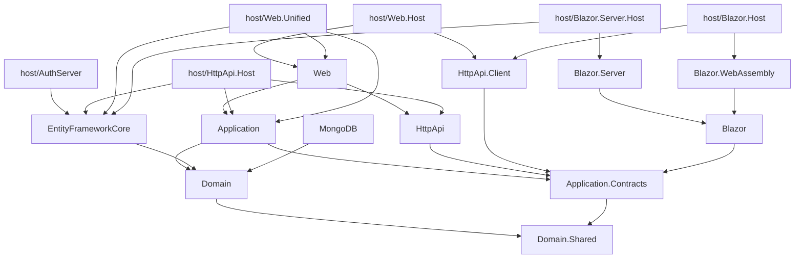

The `module` template at `templates/module/aspnet-core/` is for building *reusable* ABP modules — components you ship to other ABP solutions as NuGet packages, similar in shape to `Volo.Abp.Identity` or `Volo.Abp.AuditLogging`. The layout is the same Domain → Application → HttpApi → Web split you see in the layered `app` template, but every project is a `netstandard` library (so it can be referenced from any host), there is **no application host of its own** inside `src/`, and a separate `host/` folder ships a matrix of integration hosts (MVC, Blazor, AuthServer) that consumers can use during development. See [App Template](/templates/app-template) for the runnable-app counterpart and [Templates Overview](/templates/overview) for the catalog.

<Info>
A "module" is functionally a library, but ABP modularity adds metadata (`[DependsOn]`, virtual file system, embedded resources, permissions, settings) so a consuming app can plug it in by declaring a `[DependsOn(typeof(MyProjectNameWebModule))]`.
</Info>

## Directory layout

```text templates/module/aspnet-core/
├── MyCompanyName.MyProjectName.sln
├── MyCompanyName.MyProjectName.abpmdl       # ABP Suite module metadata
├── MyCompanyName.MyProjectName.abpsln
├── NuGet.Config
├── common.props
├── docker-compose.yml
├── docker-compose.override.yml
├── docker-compose.migrations.yml
├── database/
├── src/
│   ├── MyCompanyName.MyProjectName.Domain.Shared/
│   ├── MyCompanyName.MyProjectName.Domain/
│   ├── MyCompanyName.MyProjectName.Application.Contracts/
│   ├── MyCompanyName.MyProjectName.Application/
│   ├── MyCompanyName.MyProjectName.EntityFrameworkCore/
│   ├── MyCompanyName.MyProjectName.MongoDB/
│   ├── MyCompanyName.MyProjectName.HttpApi/
│   ├── MyCompanyName.MyProjectName.HttpApi.Client/
│   ├── MyCompanyName.MyProjectName.Web/
│   ├── MyCompanyName.MyProjectName.Blazor/
│   ├── MyCompanyName.MyProjectName.Blazor.Server/
│   ├── MyCompanyName.MyProjectName.Blazor.WebAssembly/
│   └── MyCompanyName.MyProjectName.Installer/
├── host/
│   ├── MyCompanyName.MyProjectName.AuthServer/
│   ├── MyCompanyName.MyProjectName.HttpApi.Host/
│   ├── MyCompanyName.MyProjectName.Web.Host/
│   ├── MyCompanyName.MyProjectName.Web.Unified/
│   ├── MyCompanyName.MyProjectName.Blazor.Host/
│   ├── MyCompanyName.MyProjectName.Blazor.Server.Host/
│   └── MyCompanyName.MyProjectName.Host.Shared/
└── test/
    ├── MyCompanyName.MyProjectName.TestBase/
    ├── MyCompanyName.MyProjectName.Domain.Tests/
    ├── MyCompanyName.MyProjectName.Application.Tests/
    ├── MyCompanyName.MyProjectName.EntityFrameworkCore.Tests/
    ├── MyCompanyName.MyProjectName.MongoDB.Tests/
    └── MyCompanyName.MyProjectName.HttpApi.Client.ConsoleTestApp/
```

A parallel `templates/module/angular/` directory holds the Angular NPM package version (a workspace project under `projects/my-project-name/` plus a `dev-app/` consumer); the pipeline removes that tree when `-u angular` is not selected — see `ModuleTemplateBase.DeleteUnrelatedProjects` in `framework/src/Volo.Abp.Cli.Core/Volo/Abp/Cli/ProjectBuilding/Templates/Module/`.

## Project inventory — `src/`

| Project | TFM | Role |
| --- | --- | --- |
| `MyCompanyName.MyProjectName.Domain.Shared.csproj` | `netstandard2.0;netstandard2.1;net8.0` | Constants, enums, localization, error codes safe to reference from any consumer. |
| `MyCompanyName.MyProjectName.Domain.csproj` | `netstandard2.0;netstandard2.1;net8.0` | Entities, domain services, repository interfaces. Depends on `Volo.Abp.Ddd.Domain`. |
| `MyCompanyName.MyProjectName.Application.Contracts.csproj` | `netstandard` + `net8.0` | Application-service interfaces, DTOs, permission definitions (`Permissions/`). |
| `MyCompanyName.MyProjectName.Application.csproj` | `netstandard` + `net8.0` | Application services + AutoMapper profile, depending on Domain + Application.Contracts. |
| `MyCompanyName.MyProjectName.EntityFrameworkCore.csproj` | `netstandard` + `net8.0` | EF Core repositories and `DbContext` extensions for module entities. |
| `MyCompanyName.MyProjectName.MongoDB.csproj` | `netstandard` + `net8.0` | MongoDB repositories and `DbContext` extensions. |
| `MyCompanyName.MyProjectName.HttpApi.csproj` | `netstandard` + `net8.0` | Controllers / controller bases exposing the application services. |
| `MyCompanyName.MyProjectName.HttpApi.Client.csproj` | `netstandard` + `net8.0` | Dynamic HTTP proxy client over the same contracts. |
| `MyCompanyName.MyProjectName.Web.csproj` | `net8.0` | Razor Pages / MVC UI. Embedded as a virtual file system into hosts that consume the module. |
| `MyCompanyName.MyProjectName.Blazor.csproj` | `net8.0` | Shared Blazor UI components (used by both Server and WebAssembly). |
| `MyCompanyName.MyProjectName.Blazor.Server.csproj` | `net8.0` | Blazor Server specific bits (services, page registrations). |
| `MyCompanyName.MyProjectName.Blazor.WebAssembly.csproj` | `net8.0` | Blazor WASM specific bits. |
| `MyCompanyName.MyProjectName.Installer.csproj` | `net8.0` | ABP CLI-friendly installer assembly that lets `abp add-module` wire up references automatically. |

### Domain & shared

```xml templates/module/aspnet-core/src/MyCompanyName.MyProjectName.Domain/MyCompanyName.MyProjectName.Domain.csproj
<Project Sdk="Microsoft.NET.Sdk">
  <Import Project="..\..\common.props" />
  <PropertyGroup>
    <TargetFrameworks>netstandard2.0;netstandard2.1;net8.0</TargetFrameworks>
    <Nullable>enable</Nullable>
    <RootNamespace>MyCompanyName.MyProjectName</RootNamespace>
  </PropertyGroup>
  <ItemGroup>
    <ProjectReference Include="..\..\..\..\..\framework\src\Volo.Abp.Ddd.Domain\Volo.Abp.Ddd.Domain.csproj" />
    <ProjectReference Include="..\MyCompanyName.MyProjectName.Domain.Shared\MyCompanyName.MyProjectName.Domain.Shared.csproj" />
  </ItemGroup>
</Project>
```

Unlike the `app` template, the module `Domain` does **not** pull in Identity / OpenIddict / TenantManagement — a module should not transitively force those onto its consumers. Notice the multi-targeting: shipping `netstandard2.0` keeps the library reachable from any .NET host the consumer might use.

Each src project carries a sibling `.abppkg` JSON file (e.g. `MyCompanyName.MyProjectName.Domain.abppkg`) — Suite metadata used to wire the module up via `abp add-module`.

### Application & contracts

The `Application.Contracts` project includes a `Permissions/` folder pre-seeded with a permission provider, and a `Samples/` folder with a hello-world DTO and interface so the consumer immediately sees the convention:

```text templates/module/aspnet-core/src/MyCompanyName.MyProjectName.Application.Contracts/
├── MyCompanyName.MyProjectName.Application.Contracts.csproj
├── MyProjectNameApplicationContractsModule.cs
├── MyProjectNameRemoteServiceConsts.cs
├── Permissions/
└── Samples/
```

The matching `Application/` project mirrors that with concrete services under `Samples/`.

### Persistence providers

| Folder | Notable files |
| --- | --- |
| `MyCompanyName.MyProjectName.EntityFrameworkCore/EntityFrameworkCore/` | Module-scoped `DbContext` interface (`IMyProjectNameDbContext`), `DbContextModelCreatingExtensions`, repository implementations. |
| `MyCompanyName.MyProjectName.MongoDB/MongoDB/` | Mongo `DbContext` interface, collection mappings, repositories. |

The `MyProjectNameDbProperties.cs` constant in Domain holds the table-prefix / connection-string-name the module is published with — that file lets a consumer override the prefix from their own host's `Configure<MyProjectNameDbProperties>`.

### HTTP and UI projects

| Project | Highlights |
| --- | --- |
| `MyCompanyName.MyProjectName.HttpApi/` | `MyProjectNameController` base class, attribute-routed sample controllers under `Samples/`. |
| `MyCompanyName.MyProjectName.HttpApi.Client/` | Empty client that delegates to the framework's `IDynamicProxy` system. |
| `MyCompanyName.MyProjectName.Web/Pages/` | `_ViewImports.cshtml` plus a `MyProjectName/` folder of Razor Pages. |
| `MyCompanyName.MyProjectName.Web/Menus/` | `MyProjectNameMenuContributor` adding a top-level menu item. |

### Blazor trio

```text templates/module/aspnet-core/src/MyCompanyName.MyProjectName.Blazor/
├── MyProjectNameBlazorModule.cs       (shared)
├── Menus/                             (NavMenuContributor)
└── Pages/                             (.razor components)
```

`MyCompanyName.MyProjectName.Blazor.Server` and `MyCompanyName.MyProjectName.Blazor.WebAssembly` add render-mode-specific service registrations on top.

### Installer

`MyCompanyName.MyProjectName.Installer.csproj` does not contain runtime logic — it is a marker assembly the CLI inspects when the user runs `abp add-module MyCompanyName.MyProjectName` so it knows how to wire the rest of the projects into their solution.

## Project inventory — `host/`

The hosts are *not* shipped to consumers; they exist so the module maintainer (and the CLI test pipeline) can run the module end-to-end.

| Host | Role |
| --- | --- |
| `host/MyCompanyName.MyProjectName.Host.Shared/` | Common bootstrapping (multi-tenancy contributor, `appsettings.json` template). |
| `host/MyCompanyName.MyProjectName.AuthServer/` | OpenIddict authorization server with EF Core (`EntityFrameworkCore/`, `Migrations/`, `OpenIddict/` data seed, `Pages/` for login UI). |
| `host/MyCompanyName.MyProjectName.HttpApi.Host/` | Standalone API host that mounts `MyProjectNameHttpApiModule`. Has `Controllers/`, `EntityFrameworkCore/` and `Properties/`. |
| `host/MyCompanyName.MyProjectName.Web.Host/` | MVC host consuming the module as an OAuth client of the AuthServer. Has `Pages/`, `Views/`, `Controllers/`. |
| `host/MyCompanyName.MyProjectName.Web.Unified/` | MVC host with embedded auth (no separate AuthServer) — used for the non-tiered dev workflow. |
| `host/MyCompanyName.MyProjectName.Blazor.Host/` | Blazor WebAssembly host. |
| `host/MyCompanyName.MyProjectName.Blazor.Server.Host/` | Blazor Server host. |

`ModuleTemplateBase.DeleteUnrelatedProjects` removes whichever hosts do not match the chosen UI, and when `no-ui` is set, removes the Web / Blazor hosts entirely:

```csharp framework/src/Volo.Abp.Cli.Core/Volo/Abp/Cli/ProjectBuilding/Templates/Module/ModuleTemplateBase.cs
if (!context.BuildArgs.ExtraProperties.ContainsKey("no-ui"))
{
    return;
}

steps.Add(new RemoveProjectFromSolutionStep("MyCompanyName.MyProjectName.Web"));
steps.Add(new RemoveProjectFromSolutionStep("MyCompanyName.MyProjectName.Blazor"));
steps.Add(new RemoveProjectFromSolutionStep("MyCompanyName.MyProjectName.Blazor.Server"));
steps.Add(new RemoveProjectFromSolutionStep("MyCompanyName.MyProjectName.Blazor.WebAssembly"));
steps.Add(new RemoveProjectFromSolutionStep(
    "MyCompanyName.MyProjectName.Blazor.Host",
    projectFolderPath: "/aspnet-core/host/MyCompanyName.MyProjectName.Blazor.Host"));
steps.Add(new RemoveProjectFromSolutionStep(
    "MyCompanyName.MyProjectName.Blazor.Server.Host",
    projectFolderPath: "/aspnet-core/host/MyCompanyName.MyProjectName.Blazor.Server.Host"));
steps.Add(new RemoveProjectFromSolutionStep(
    "MyCompanyName.MyProjectName.Web.Host",
    projectFolderPath: "/aspnet-core/host/MyCompanyName.MyProjectName.Web.Host"));
steps.Add(new RemoveProjectFromSolutionStep(
    "MyCompanyName.MyProjectName.Web.Unified",
    projectFolderPath: "/aspnet-core/host/MyCompanyName.MyProjectName.Web.Unified"));

steps.Add(new RemoveFolderStep("/angular"));
```

It also wipes the migration history under `host/*/Migrations/` so the consumer's first run regenerates them from scratch:

```csharp framework/src/Volo.Abp.Cli.Core/Volo/Abp/Cli/ProjectBuilding/Templates/Module/ModuleTemplateBase.cs
steps.Add(new RemoveFolderStep("/aspnet-core/host/MyCompanyName.MyProjectName.AuthServer/Migrations"));
steps.Add(new RemoveFolderStep("/aspnet-core/host/MyCompanyName.MyProjectName.Blazor.Server.Host/Migrations"));
steps.Add(new RemoveFolderStep("/aspnet-core/host/MyCompanyName.MyProjectName.Web.Unified/Migrations"));
```

## Project inventory — `test/`

| Project | Role |
| --- | --- |
| `test/MyCompanyName.MyProjectName.TestBase/` | xUnit test base with `Samples/` data seed, `Security/` claim faker. |
| `test/MyCompanyName.MyProjectName.Domain.Tests/` | Pure-domain tests. The `Samples/` folder has reference tests against the sample entity. |
| `test/MyCompanyName.MyProjectName.Application.Tests/` | Application-service tests. |
| `test/MyCompanyName.MyProjectName.EntityFrameworkCore.Tests/` | SQLite-in-memory EF Core tests under `EntityFrameworkCore/`. |
| `test/MyCompanyName.MyProjectName.MongoDB.Tests/` | Mongo2Go-backed tests under `MongoDB/`. |
| `test/MyCompanyName.MyProjectName.HttpApi.Client.ConsoleTestApp/` | Console app smoke-testing the HTTP client. |

## Project-reference graph



## docker-compose & database

The solution root carries three compose files:

| File | What it brings up |
| --- | --- |
| `docker-compose.yml` | SQL Server / PostgreSQL container the hosts connect to. |
| `docker-compose.override.yml` | Local-dev port + volume overrides. |
| `docker-compose.migrations.yml` | One-shot job that runs the migrator service. |

`database/` keeps SQL scripts (when shipped) — `RemoveFolderStep` purges it if the consumer chose MongoDB.

## What the user actually gets

For `Acme.LoyaltyCard`, EF Core, MVC UI, no `--no-ui`:

| Output | Source |
| --- | --- |
| `Acme.LoyaltyCard.sln` | `MyCompanyName.MyProjectName.sln` |
| `src/Acme.LoyaltyCard.Domain.Shared/` | `src/MyCompanyName.MyProjectName.Domain.Shared/` |
| `src/Acme.LoyaltyCard.Domain/` | Same with EF/Mongo provider kept |
| `src/Acme.LoyaltyCard.Application*/` | Same |
| `src/Acme.LoyaltyCard.EntityFrameworkCore/` | Kept (Mongo removed) |
| `src/Acme.LoyaltyCard.HttpApi*/` | Same |
| `src/Acme.LoyaltyCard.Web/` | Kept (Blazor removed because UI is MVC) |
| `host/Acme.LoyaltyCard.Web.Unified/` | Kept; `Web.Host` removed since this is non-tiered |
| `host/Acme.LoyaltyCard.HttpApi.Host/` | Kept |
| `host/Acme.LoyaltyCard.Host.Shared/` | Kept |
| `test/Acme.LoyaltyCard.*.Tests/` | All except `MongoDB.Tests` |

The `angular/` and `react-native/` siblings disappear, and SSL ports are randomised between 44300–44305 by `TemplateRandomSslPortStep` (see [Template Structure & Replacements](/templates/template-structure-and-replacements#port-randomisation)).

## Cross-references

<CardGroup cols={2}>
  <Card title="Templates overview" href="/templates/overview" icon="layer-group">
    Top-level catalog of every template directory.
  </Card>
  <Card title="App template" href="/templates/app-template" icon="layer-group">
    Layered application counterpart of the module template.
  </Card>
  <Card title="Structure & replacements" href="/templates/template-structure-and-replacements" icon="wand-magic-sparkles">
    Project rename, port randomisation, NuGet config swap.
  </Card>
  <Card title="CLI: new & update" href="/cli/new-and-update" icon="terminal">
    `abp new -t module` invocation and `abp add-module` consumer flow.
  </Card>
</CardGroup>
