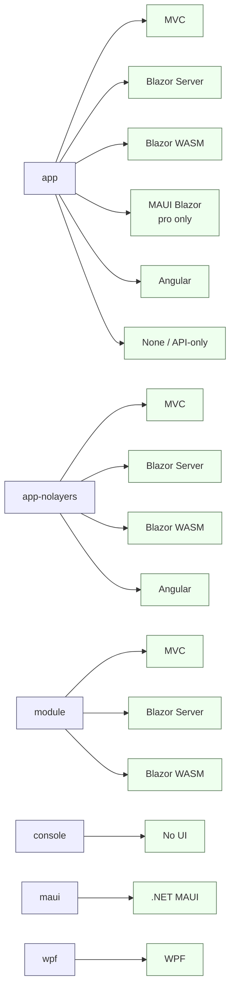

The `templates/` folder at the root of the `abpframework/abp` repository is the source for every startup template the ABP CLI knows how to materialize. When you run `abp new Acme.BookStore -t app -u blazor -d ef`, the CLI does not synthesize a project tree from scratch — it pulls a ZIP that was built from one of these folders, replays a pipeline of pipeline steps over it (rename placeholders, delete unused projects, randomize secrets, switch database provider), and emits the result. This page is the catalog: it enumerates every directory under `templates/`, the UI matrix each one supports, and the database providers and tiering options the build pipeline can apply.

<Info>
The templates here are the upstream / community edition. The commercial `app-pro` and `microservice-pro` templates live in a separate repository and are not part of this codebase, but the pipeline classes in `Volo.Abp.Cli.Core/Volo/Abp/Cli/ProjectBuilding/Templates/` are shared between editions. See [CLI New & Update](/cli/new-and-update) and [Project Building & Templates](/cli/project-building-and-templates) for how the CLI consumes them.
</Info>

## Top-level directory

<Card title="templates/" icon="folder" horizontal>
Holds every startup template, the shared `Directory.Packages.props`, a `NuGet.Config`, and a `zip-templates.ps1` helper that produces the binary ZIPs the CLI downloads.
</Card>

| Path | Template name | Folder layout |
| --- | --- | --- |
| `templates/app` | `app` | `aspnet-core/` + `angular/` + `react-native/` |
| `templates/app-nolayers` | `app-nolayers` | `aspnet-core/` + `angular/` |
| `templates/module` | `module` | `aspnet-core/` + `angular/` |
| `templates/console` | `console` | single `src/MyCompanyName.MyProjectName/` |
| `templates/maui` | `maui` | single `src/MyCompanyName.MyProjectName/` |
| `templates/wpf` | `wpf` | single `src/MyCompanyName.MyProjectName/` |
| `templates/Directory.Packages.props` | — | Central package versions shared by all templates. |
| `templates/NuGet.Config` | — | Feeds used while restoring the templates locally. |
| `templates/zip-templates.ps1` | — | Packs each template directory into a ZIP for distribution. |

The CLI binds each folder name to a `TemplateInfo` subclass via the constant `TemplateName`:

```csharp templates/app — AppTemplate
public class AppTemplate : AppTemplateBase
{
    /// <summary>
    /// "app".
    /// </summary>
    public const string TemplateName = "app";

    public const Theme DefaultTheme = Theme.LeptonXLite;

    public AppTemplate()
        : base(TemplateName)
    {
        DocumentUrl = CliConsts.DocsLink + "/en/abp/latest/Startup-Templates/Application";
    }
}
```
*File: `framework/src/Volo.Abp.Cli.Core/Volo/Abp/Cli/ProjectBuilding/Templates/App/AppTemplate.cs`*

```csharp templates/console — ConsoleTemplate
public class ConsoleTemplate : ConsoleTemplateBase
{
    /// <summary>
    /// "console".
    /// </summary>
    public const string TemplateName = "console";

    public ConsoleTemplate()
        : base(TemplateName)
    {
        DocumentUrl = CliConsts.DocsLink + "/en/abp/latest/Startup-Templates/Console";
    }
}
```
*File: `framework/src/Volo.Abp.Cli.Core/Volo/Abp/Cli/ProjectBuilding/Templates/Console/ConsoleTemplate.cs`*

Equivalent classes — `AppNoLayersTemplate`, `ModuleTemplate`, `MauiTemplate`, `WpfTemplate` — live alongside, each declaring its `TemplateName` constant. See [Template Structure & Replacements](/templates/template-structure-and-replacements) for how those classes drive the pipeline.

## Templates at a glance



## UI matrix

The UI is selected with the `-u` / `--ui` flag on `abp new`. The build pipeline deletes any project that does not belong to the chosen UI — see `AppTemplateBase.DeleteUnrelatedProjects` referenced in [Template Structure & Replacements](/templates/template-structure-and-replacements#ui-selection).

| Template | `-u mvc` | `-u blazor-server` | `-u blazor` (WASM) | `-u maui-blazor` | `-u angular` | `-u none` |
| --- | --- | --- | --- | --- | --- | --- |
| `app` | ✅ (`Web`, `Web.Host`) | ✅ (`Blazor.Server`, `Blazor.Server.Tiered`) | ✅ (`Blazor`) | (recognised by `UiFramework.MauiBlazor` in `AppTemplateBase`; MauiBlazor project ships in the commercial `app-pro` template, not the community `app/aspnet-core/src/` tree) | ✅ (separate `angular/` tree) | ✅ |
| `app-nolayers` | ✅ (`MyCompanyName.MyProjectName.Mvc`) | ✅ (`Blazor.Server`) | ✅ (`Blazor.WebAssembly`) | — | ✅ (`/angular`) | ✅ (`Host`) |
| `module` | ✅ (`Web`) | ✅ (`Blazor.Server`) | ✅ (`Blazor.WebAssembly` / `Blazor`) | — | (Angular package projects under `angular/`) | — |
| `console` | — | — | — | — | — | ✅ (only no-UI) |
| `maui` | — | — | — | (native MAUI, not MAUI Blazor) | — | — |
| `wpf` | — | — | — | — | — | (native WPF) |

The native `maui` template targets `.NET MAUI` shells/pages directly (XAML), not MAUI Blazor. The `app` template's CLI pipeline supports `-u maui-blazor` (see `ConfigureWithMauiBlazorUi` in `AppTemplateBase.cs`), but the MauiBlazor head project itself ships only in the commercial `app-pro` template — the community `templates/app/aspnet-core/src/` tree contains `Web`, `Web.Host`, `Blazor`, `Blazor.Server`, and `Blazor.Server.Tiered`.

## Database providers

The `-d` / `--database-provider` flag of `abp new` selects EF Core or MongoDB. The pipeline removes the unused provider project from the solution. See `AppTemplateBase.SwitchDatabaseProvider`:

```csharp framework/src/Volo.Abp.Cli.Core/Volo/Abp/Cli/ProjectBuilding/Templates/App/AppTemplateBase.cs
protected void SwitchDatabaseProvider(ProjectBuildContext context, List<ProjectBuildPipelineStep> steps)
{
    if (context.BuildArgs.DatabaseProvider == DatabaseProvider.MongoDb)
    {
        steps.Add(new AppTemplateSwitchEntityFrameworkCoreToMongoDbStep(HasDbMigrations));
    }

    if (context.BuildArgs.DatabaseProvider != DatabaseProvider.EntityFrameworkCore)
    {
        ...
        steps.Add(new RemoveProjectFromSolutionStep("MyCompanyName.MyProjectName.EntityFrameworkCore"));
        ...
    }
    ...
    if (context.BuildArgs.DatabaseProvider != DatabaseProvider.MongoDb)
    {
        steps.Add(new RemoveProjectFromSolutionStep("MyCompanyName.MyProjectName.MongoDB"));
        steps.Add(new RemoveProjectFromSolutionStep("MyCompanyName.MyProjectName.MongoDB.Tests",
            projectFolderPath: "/aspnet-core/test/MyCompanyName.MyProjectName.MongoDB.Tests"));
    }
}
```

| Template | EF Core | MongoDB | DBMS choice (`--dbms`) |
| --- | --- | --- | --- |
| `app` | ✅ `MyCompanyName.MyProjectName.EntityFrameworkCore` | ✅ `MyCompanyName.MyProjectName.MongoDB` | SqlServer / MySql / PostgreSql / Oracle / OracleDevart / SQLite |
| `app-nolayers` | ✅ Mvc/Host/Blazor.* projects | ✅ `*.Mongo` siblings (`Host.Mongo`, `Mvc.Mongo`, `Blazor.Server.Mongo`) | SqlServer (default) |
| `module` | ✅ `MyCompanyName.MyProjectName.EntityFrameworkCore` | ✅ `MyCompanyName.MyProjectName.MongoDB` | n/a (module ships both) |
| `console` | — | — | — |
| `maui` | — | — | — |
| `wpf` | — | — | — |

For DBMS, `SetDbmsSymbols` in `AppTemplateBase` adds one of `SqlServer`, `MySql`, `PostgreSql`, `Oracle`, `SqLite` as a preprocessor symbol so the EF Core configuration files include the correct provider package.

## Tier vs non-tier

A "tiered" solution moves the identity / OpenIddict server into a separate process and turns the MVC/Blazor Server app into a confidential OAuth2 client. The `--tiered` flag adds a separate `MyCompanyName.MyProjectName.AuthServer` project and renames pieces of the pipeline accordingly. The `app` template directory already contains both variants side-by-side; the pipeline keeps whichever the flag asks for.

| Project (under `templates/app/aspnet-core/src/`) | Non-tiered | Tiered |
| --- | --- | --- |
| `MyCompanyName.MyProjectName.HttpApi.Host` | ✅ | ✅ |
| `MyCompanyName.MyProjectName.HttpApi.HostWithIds` | ✅ (used when no separate AuthServer) | — |
| `MyCompanyName.MyProjectName.AuthServer` | — | ✅ |
| `MyCompanyName.MyProjectName.Web` (MVC) | ✅ embedded auth | ✅ as OAuth client |
| `MyCompanyName.MyProjectName.Web.Host` | — | ✅ (host-mode MVC) |
| `MyCompanyName.MyProjectName.Blazor.Server` | ✅ | — |
| `MyCompanyName.MyProjectName.Blazor.Server.Tiered` | — | ✅ |

The `module` template's `host/` folder mirrors the same idea: it contains `Web.Host`, `Web.Unified`, `Blazor.Host`, `Blazor.Server.Host` and `HttpApi.Host` hosts that the pipeline picks between based on the chosen UI and tiering.

## Per-template page map

<CardGroup cols={2}>
  <Card title="App template" href="/templates/app-template" icon="layer-group">
    The classic layered DDD solution: `Domain`, `Application`, `EntityFrameworkCore`, `HttpApi`, `Web`, `DbMigrator`, etc.
  </Card>
  <Card title="App (no layers)" href="/templates/app-nolayers-template" icon="file">
    Single project per UI (`Mvc`, `Host`, `Blazor.Server`, `Blazor.WebAssembly`) with `Mongo` variants.
  </Card>
  <Card title="Module template" href="/templates/module-template" icon="puzzle-piece">
    Reusable module: `Domain`, `Application`, `HttpApi`, `Web`, `Blazor.*` plus host projects under `host/`.
  </Card>
  <Card title="Console template" href="/templates/console-template" icon="terminal">
    Single `MyCompanyName.MyProjectName.csproj` using `Host.CreateApplicationBuilder` + `AbpModule`.
  </Card>
  <Card title="MAUI template" href="/templates/maui-template" icon="mobile">
    `MauiProgram.CreateMauiApp()` + `Platforms/`, `Resources/` and a `MyProjectNameModule`.
  </Card>
  <Card title="WPF template" href="/templates/wpf-template" icon="window">
    `App.xaml.cs` boots `AbpApplicationFactory.CreateAsync<MyProjectNameModule>` and shows `MainWindow`.
  </Card>
  <Card title="Angular template" href="/templates/angular-template" icon="angular">
    `templates/app/angular`: `src/app/`, `src/environments/`, `angular.json`, `tsconfig.*`.
  </Card>
  <Card title="Structure & replacements" href="/templates/template-structure-and-replacements" icon="wand-magic-sparkles">
    How `MyCompanyName.MyProjectName` placeholders are rewritten, GUIDs randomized, connection strings injected.
  </Card>
</CardGroup>

## Where the CLI registers them

All template classes derive from `TemplateInfo` and are listed in the project-building infrastructure:

| Template class | Constant | Base | Source |
| --- | --- | --- | --- |
| `AppTemplate` | `"app"` | `AppTemplateBase` | `Templates/App/AppTemplate.cs` |
| `AppNoLayersTemplate` | `"app-nolayers"` | `AppNoLayersTemplateBase` | `Templates/App/AppNoLayersTemplate.cs` |
| `ModuleTemplate` | `"module"` | `ModuleTemplateBase` | `Templates/Module/ModuleTemplate.cs` |
| `ConsoleTemplate` | `"console"` | `ConsoleTemplateBase` | `Templates/Console/ConsoleTemplate.cs` |
| `MauiTemplate` | `"maui"` | `MauiTemplateBase` | `Templates/Maui/MauiTemplate.cs` |
| `WpfTemplate` | `"wpf"` | `WpfTemplateBase` | `Templates/Wpf/WpfTemplate.cs` |

Each `*TemplateBase` overrides `GetCustomSteps(ProjectBuildContext)` to add the pipeline steps that transform the raw `templates/<name>/...` tree into the final user project — that pipeline is the focus of [Template Structure & Replacements](/templates/template-structure-and-replacements).

## Cross-references

- [CLI: `new` and `update`](/cli/new-and-update) — the command surface that invokes these templates.
- [Project building & templates](/cli/project-building-and-templates) — `TemplateInfo`, `ProjectBuilder`, source code stores.
- [App template](/templates/app-template) — DDD-layered solution drill-down.
- [Module template](/templates/module-template) — reusable module structure.
