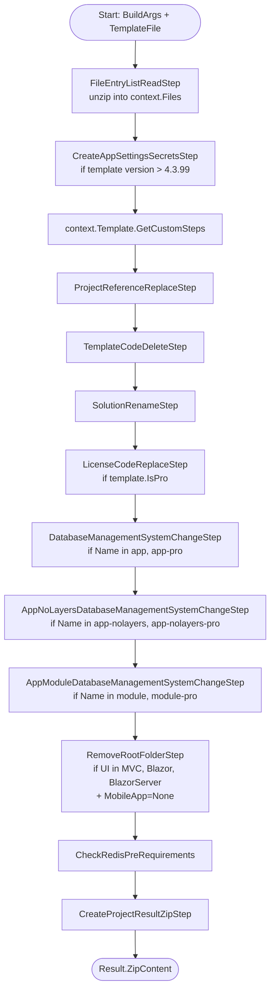

`abp new Acme.BookStore -t app -u blazor -d ef` does not generate code from string templates. It downloads a ZIP that was built from one of the `templates/*` folders in this repo and then runs the file entries through a deterministic pipeline of `ProjectBuildPipelineStep` instances. This page walks the pipeline end-to-end: how `TemplateProjectBuildPipelineBuilder.Build` composes it, what each `TemplateInfo` subclass contributes through `GetCustomSteps`, and what every concrete step under `framework/src/Volo.Abp.Cli.Core/Volo/Abp/Cli/ProjectBuilding/Building/Steps/` actually does. Most readers will only ever encounter the steps tangentially through CLI flags (`-d`, `-u`, `--separate-auth-server`), but anyone forking the templates, debugging a corrupt generation, or contributing a new template will work primarily with the classes documented here.

<Info>
Read this alongside [CLI Project Building & Templates](/cli/project-building-and-templates) (which covers `ProjectBuildContext`, `BuildArgs`, and `TemplateInfo` from the consumer side) and the per-template walkthroughs ([App](/templates/app-template), [App No-Layers](/templates/app-nolayers-template), [Module](/templates/module-template), [Console](/templates/console-template), [MAUI](/templates/maui-template), [WPF](/templates/wpf-template)).
</Info>

## The pipeline at a glance

Every template generation flows through `TemplateProjectBuildPipelineBuilder.Build(ProjectBuildContext)`. The builder constructs a `ProjectBuildPipeline`, appends a small set of *always-on* steps, splices in the per-template steps from `context.Template.GetCustomSteps(context)`, then appends another set of *closing* steps. The shape:



```csharp framework/src/Volo.Abp.Cli.Core/Volo/Abp/Cli/ProjectBuilding/Building/TemplateProjectBuildPipelineBuilder.cs lines icon="recycle"
public static ProjectBuildPipeline Build(ProjectBuildContext context)
{
    var pipeline = new ProjectBuildPipeline(context);

    pipeline.Steps.Add(new FileEntryListReadStep());

    if (SemanticVersion.Parse(context.TemplateFile.Version) > new SemanticVersion(4, 3, 99))
    {
        pipeline.Steps.Add(new CreateAppSettingsSecretsStep());
    }

    pipeline.Steps.AddRange(context.Template.GetCustomSteps(context));

    pipeline.Steps.Add(new ProjectReferenceReplaceStep());
    pipeline.Steps.Add(new TemplateCodeDeleteStep());
    pipeline.Steps.Add(new SolutionRenameStep());

    if (context.Template.IsPro())
    {
        pipeline.Steps.Add(new LicenseCodeReplaceStep());
    }

    if (context.Template.Name == AppTemplate.TemplateName ||
        context.Template.Name == AppProTemplate.TemplateName)
    {
        pipeline.Steps.Add(new DatabaseManagementSystemChangeStep(
            context.Template.As<AppTemplateBase>().HasDbMigrations));
    }

    if (context.Template.Name == AppNoLayersTemplate.TemplateName ||
        context.Template.Name == AppNoLayersProTemplate.TemplateName)
    {
        pipeline.Steps.Add(new AppNoLayersDatabaseManagementSystemChangeStep());
    }

    if (context.Template.Name == ModuleTemplate.TemplateName ||
        context.Template.Name == ModuleProTemplate.TemplateName)
    {
        pipeline.Steps.Add(new AppModuleDatabaseManagementSystemChangeStep());
    }

    if ((context.BuildArgs.UiFramework == UiFramework.Mvc
            || context.BuildArgs.UiFramework == UiFramework.Blazor
            || context.BuildArgs.UiFramework == UiFramework.BlazorServer)
        && context.BuildArgs.MobileApp == MobileApp.None
        && context.Template.Name != MicroserviceProTemplate.TemplateName
        && context.Template.Name != MicroserviceServiceProTemplate.TemplateName)
    {
        pipeline.Steps.Add(new RemoveRootFolderStep());
    }

    pipeline.Steps.Add(new CheckRedisPreRequirements());
    pipeline.Steps.Add(new CreateProjectResultZipStep());

    return pipeline;
}
```

## TemplateInfo subclasses

`TemplateInfo` is the abstract base. Each concrete template inherits from it (or a `*Base` intermediary) and optionally overrides `GetCustomSteps`. The override is where every UI-framework / database / theme / port decision is enforced.

### AppTemplate

`AppTemplate.cs` is a name + docs URL:

```csharp framework/src/Volo.Abp.Cli.Core/Volo/Abp/Cli/ProjectBuilding/Templates/App/AppTemplate.cs lines icon="folder"
public class AppTemplate : AppTemplateBase
{
    /// <summary>
    /// "app".
    /// </summary>
    public const string TemplateName = "app";

    public const Theme DefaultTheme = Theme.LeptonXLite;

    public AppTemplate()
        : base(TemplateName)
    {
        DocumentUrl = CliConsts.DocsLink + "/en/abp/latest/Startup-Templates/Application";
    }
}
```

`AppTemplateBase.GetCustomSteps` is the largest override in the codebase (~700 lines). It composes the steps in this order:

```csharp framework/src/Volo.Abp.Cli.Core/Volo/Abp/Cli/ProjectBuilding/Templates/App/AppTemplateBase.cs lines icon="gears"
public override IEnumerable<ProjectBuildPipelineStep> GetCustomSteps(ProjectBuildContext context)
{
    var steps = base.GetCustomSteps(context).ToList();

    ConfigureTenantSchema(context, steps);
    SwitchDatabaseProvider(context, steps);
    DeleteUnrelatedProjects(context, steps);
    RemoveMigrations(context, steps);
    ConfigureTieredArchitecture(context, steps);
    ConfigurePublicWebSite(context, steps);
    ConfigureTheme(context, steps);
    ConfigureVersion(context, steps);
    RemoveUnnecessaryPorts(context, steps);
    RandomizeSslPorts(context, steps);
    RandomizeStringEncryption(context, steps);
    RandomizeAuthServerPassPhrase(context, steps);
    UpdateNuGetConfig(context, steps);
    ConfigureDockerFiles(context, steps);
    ChangeConnectionString(context, steps);
    CleanupFolderHierarchy(context, steps);

    return steps;
}
```

Each helper appends zero or more concrete steps. For example, `SwitchDatabaseProvider` emits `RemoveProjectFromSolutionStep` calls for the unused EF Core or MongoDB project, plus an `AppTemplateSwitchEntityFrameworkCoreToMongoDbStep` if the user picked Mongo. `DeleteUnrelatedProjects` branches on `context.BuildArgs.UiFramework` and calls `ConfigureWithoutUi`, `ConfigureWithAngularUi`, `ConfigureWithBlazorUi`, `ConfigureWithBlazorServerUi`, `ConfigureWithMauiBlazorUi`, or `ConfigureWithMvcUi`.

### AppNoLayersTemplate

The no-layers variant is a stripped-down version of `AppTemplate`. There are no tier / public-website / migration concerns because the template has only one project per UI framework:

```csharp framework/src/Volo.Abp.Cli.Core/Volo/Abp/Cli/ProjectBuilding/Templates/App/AppNoLayersTemplateBase.cs lines icon="gears"
public override IEnumerable<ProjectBuildPipelineStep> GetCustomSteps(ProjectBuildContext context)
{
    var steps = base.GetCustomSteps(context).ToList();

    SwitchDatabaseProvider(context, steps);
    DeleteUnrelatedProjects(context, steps);
    RemoveMigrations(context, steps);
    RandomizeSslPorts(context, steps);
    RandomizeStringEncryption(context, steps);
    RandomizeAuthServerPassPhrase(context, steps);
    UpdateNuGetConfig(context, steps);
    ChangeConnectionString(context, steps);
    ConfigureDockerFiles(context, steps);
    ConfigureTheme(context, steps);
    CleanupFolderHierarchy(context, steps);

    return steps;
}
```

Notable: `AppNoLayersDatabaseManagementSystemChangeStep` (added by the outer builder, not by `GetCustomSteps`) renames Blazor.WebAssembly subprojects when Mongo is chosen. The `Server.Mongo` folder is **renamed to** `Server` rather than the EF version being kept — `AppNoLayersMoveProjectsStep` is the one that flattens that nested layout.

### ModuleTemplate

The module template is the simplest layered case. It rejects no-UI by removing every web/blazor project, randomizes SSL ports, and updates the NuGet config:

```csharp framework/src/Volo.Abp.Cli.Core/Volo/Abp/Cli/ProjectBuilding/Templates/Module/ModuleTemplateBase.cs lines icon="gears"
public override IEnumerable<ProjectBuildPipelineStep> GetCustomSteps(ProjectBuildContext context)
{
    var steps = base.GetCustomSteps(context).ToList();

    DeleteUnrelatedProjects(context, steps);
    RandomizeSslPorts(context, steps);
    UpdateNuGetConfig(context, steps);
    RemoveMigrations(context, steps);
    ChangeConnectionString(context, steps);
    CleanupFolderHierarchy(context, steps);

    return steps;
}
```

`DeleteUnrelatedProjects` only acts when `--no-ui` is set; it removes the `.Web`, `.Blazor`, `.Blazor.Server`, and `.Blazor.WebAssembly` heads.

### ConsoleTemplate

The console template has the **simplest possible** `TemplateInfo` — no override at all:

```csharp framework/src/Volo.Abp.Cli.Core/Volo/Abp/Cli/ProjectBuilding/Templates/Console/ConsoleTemplateBase.cs lines icon="terminal"
public abstract class ConsoleTemplateBase : TemplateInfo
{
    protected ConsoleTemplateBase([NotNull] string name) :
        base(name)
    {
    }
}
```

`TemplateInfo.GetCustomSteps` defaults to returning an empty list — so a console generation runs only the universal steps from the outer pipeline. No database, no UI, no ports, no theme.

### MauiTemplate

The MAUI template adds a single step:

```csharp framework/src/Volo.Abp.Cli.Core/Volo/Abp/Cli/ProjectBuilding/Templates/Maui/MauiTemplateBase.cs lines icon="mobile"
public override IEnumerable<ProjectBuildPipelineStep> GetCustomSteps(ProjectBuildContext context)
{
    var steps = new List<ProjectBuildPipelineStep>
    {
        new MauiChangeApplicationIdGuidStep()
    };

    return steps;
}
```

That step rewrites the `<ApplicationIdGuid>` in the csproj to a fresh GUID. See [MAUI Template](/templates/maui-template) for details.

### WpfTemplate

Like console, WPF does not override `GetCustomSteps`:

```csharp framework/src/Volo.Abp.Cli.Core/Volo/Abp/Cli/ProjectBuilding/Templates/Wpf/WpfTemplateBase.cs lines icon="window"
public class WpfTemplateBase : TemplateInfo
{
    protected WpfTemplateBase([NotNull] string name) :
        base(name)
    {
    }
}
```

Pure universal-pipeline generation. See [WPF Template](/templates/wpf-template).

### Summary

| Template | Class | Custom step count | Why |
| --- | --- | --- | --- |
| `app` / `app-pro` | `AppTemplateBase` | ~50–100 (depends on flags) | Layered solution with database, UI, tiering, theme, ports, public site, Docker. |
| `app-nolayers` / `app-nolayers-pro` | `AppNoLayersTemplateBase` | ~30–60 | Single-project per UI, still needs DB / UI / theme / ports. |
| `module` / `module-pro` | `ModuleTemplateBase` | ~10–20 | UI heads to optionally remove, SSL ports, NuGet config. |
| `console` | `ConsoleTemplateBase` | 0 | No web, no DB. Universal steps only. |
| `maui` | `MauiTemplateBase` | 1 | `MauiChangeApplicationIdGuidStep`. |
| `wpf` | `WpfTemplateBase` | 0 | Universal steps only. |

## Universal pipeline steps

These run on **every** template, regardless of `GetCustomSteps`.

### FileEntryListReadStep

Reads the template `.zip` from `context.TemplateFile.FileBytes` and unzips it into `context.Files` as a `FileEntryList`. Every subsequent step operates against this in-memory list — no temp directories.

### CreateAppSettingsSecretsStep

Walks `appsettings.json` files (skipping `node_modules` and Docker-mounted variants) and replaces an `<!--APPSETTINGS-SECRETS-->` placeholder with the contents of a sibling `appsettings.secrets.json`, then deletes the secrets file. Only runs for template versions > 4.3.99.

### ProjectReferenceReplaceStep

If `--local-framework-ref` is set, rewrites `<ProjectReference>` entries to point at a local ABP checkout (`context.BuildArgs.AbpGitHubLocalRepositoryPath`). Otherwise, replaces `<ProjectReference>` to framework projects with `<PackageReference>` against the published NuGet version.

### TemplateCodeDeleteStep

```csharp framework/src/Volo.Abp.Cli.Core/Volo/Abp/Cli/ProjectBuilding/Building/Steps/TemplateCodeDeleteStep.cs lines icon="scissors"
public override void Execute(ProjectBuildContext context)
{
    foreach (var file in context.Files)
    {
        if (file.Name.EndsWith(".cs") ||
            file.Name.EndsWith(".csproj") ||
            file.Name.EndsWith(".cshtml") ||
            file.Name.EndsWith(".json") ||
            file.Name.EndsWith(".gitignore") ||
            file.Name.EndsWith(".yml") ||
            file.Name.EndsWith(".yaml") ||
            file.Name.EndsWith(".md") ||
            file.Name.EndsWith(".ps1") ||
            file.Name.EndsWith(".html") ||
            file.Name.EndsWith(".ts") ||
            file.Name.EndsWith(".css") ||
            file.Name.Contains("Dockerfile"))
        {
            file.RemoveTemplateCode(context.Symbols);
            file.RemoveTemplateCodeMarkers();
        }
    }
}
```

`RemoveTemplateCode` reads `// <TEMPLATE-REMOVE-IF-NOT 'symbol'>` … `</TEMPLATE-REMOVE-IF-NOT>` markers (and `<TEMPLATE-REMOVE>` for unconditional blocks) and deletes the enclosed content if the symbol is missing from `context.Symbols`. Symbols are added throughout `GetCustomSteps` — `EFCORE`, `dbms:SQLServer`, `ui:angular`, etc.

### SolutionRenameStep

Runs `SolutionRenamer` to replace `MyCompanyName`/`MyProjectName` (and lowercase variants) across every file. For microservice service templates it also handles the `MicroserviceName` placeholder.

### LicenseCodeReplaceStep

(Pro templates only.) Replaces the `<--LICENSE-CODE-->` placeholder in `appsettings.json` and `appsettings.secrets.json` with the value passed via `--license-code`.

### DatabaseManagementSystemChangeStep, AppNoLayersDatabaseManagementSystemChangeStep, AppModuleDatabaseManagementSystemChangeStep

Inserts the right `Use<Database>()` call in the EF Core configuration based on `context.BuildArgs.DatabaseManagementSystem` (SQLServer, MySQL, PostgreSQL, Oracle, OracleDevart, SQLite). The three variants differ only in which file paths they target — see the project folder structure for each template.

### RemoveRootFolderStep

For non-mobile MVC / Blazor / BlazorServer generations of non-microservice-pro templates, strips the leading `/aspnet-core/` root folder from every file name so the on-disk solution is flat rather than nested.

### CheckRedisPreRequirements

Scans every `*Module.cs` for a `Redis:Configuration` string. If found, sets `BuildArgs.ExtraProperties["PreRequirements:Redis"] = "true"`, which the CLI uses later to print a Redis startup notice.

### CreateProjectResultZipStep

Zips `context.Files` into `context.Result.ZipContent`. The CLI then writes that byte array to disk as the output project.

## Cross-cutting steps composed by GetCustomSteps

These are the helpers invoked from `AppTemplateBase.GetCustomSteps`, `AppNoLayersTemplateBase.GetCustomSteps`, and `ModuleTemplateBase.GetCustomSteps`. The same step classes appear in multiple templates with different parameter lists.

### Identity / port / secret randomization

| Step | Purpose |
| --- | --- |
| [`TemplateRandomSslPortStep`](#templaterandomsslportstep) | Picks one random port between 44300–44399 per built-in SSL URL, rewrites `launchSettings.json`, `appsettings.json`, and Angular `environment.ts`. |
| `RandomizeStringEncryptionStep` | Replaces the default `StringEncryption:DefaultPassPhrase` value (`gsKnGZ041HLL4IM8`) in every `appsettings.json` with a fresh random pass phrase. |
| `RandomizeAuthServerPassPhraseStep` | Replaces the `00000000-0000-0000-0000-000000000000` placeholder used for `Kestrel__Certificates__Default__Password`, `localhost.pfx`, `openiddict.pfx`, and `AddProductionEncryptionAndSigningCertificate` calls. Generates two random GUIDs — one for Kestrel, one for OpenIddict — across `.cs`, `.json`, `.md`, `.ps1`. |
| `MicroserviceServiceStringEncryptionStep` | Subclass of `RandomizeStringEncryptionStep`. Inherits an existing pass phrase from the parent solution's auth-server `appsettings.json` if present, otherwise generates a new one. Lets each microservice service share an encryption secret. |

#### TemplateRandomSslPortStep

```csharp framework/src/Volo.Abp.Cli.Core/Volo/Abp/Cli/ProjectBuilding/Templates/TemplateRandomSslPortStep.cs lines icon="lock"
public TemplateRandomSslPortStep(
    List<string> buildInSslSslUrls,
    int minSslPort = 44300,
    int maxSslPort = 44399)
{
    _buildInSslUrls = buildInSslSslUrls;

    _minSslPort = minSslPort;
    _maxSslPort = maxSslPort;
}
```

The constructor takes the list of URLs the template ships with hard-coded (e.g. `https://localhost:44300`, `https://localhost:44305`). Each URL is replaced with a fresh random port from the configured range, with the replacement applied across `launchSettings.json`, `appsettings.json`, and Angular `environment*.ts` files.

### UI framework removal

`AppTemplateBase.DeleteUnrelatedProjects` is the dispatcher; underneath it calls helpers that combine these steps:

| Step | Purpose |
| --- | --- |
| `RemoveProjectFromSolutionStep` | Deletes a single `<Project>` line from `.sln` and removes the matching project folder. Used dozens of times per `app` generation. |
| `RemoveFolderStep` | Removes every file whose path starts with a given folder + the folder itself. |
| `RemoveFileStep` | Removes a single file by exact path. |
| `RemoveFilesStep` | Removes every file whose path **contains** a substring (looser than `RemoveFileStep`). |
| `MoveFolderStep` | Renames every file whose path starts with a source folder to start with a target folder. Used to flatten `Blazor.WebAssembly/Server.Mongo` to `Blazor.WebAssembly/Server` when MongoDB is picked. |
| `MoveFileStep` | Moves a single file by exact path. |
| `ProjectRenameStep` | Renames a `.csproj` (and rewrites `<ProjectReference>` paths) — e.g. `MyCompanyName.MyProjectName.Host.Mongo` → `MyCompanyName.MyProjectName.Host`. |
| `TemplateProjectRenameStep` | Bulk rename via `RenameHelper.RenameAll`. Used in `ConfigureTenantSchema` to swap `EntityFrameworkCoreWithSeparateDbContext` → `EntityFrameworkCore`. |
| `RemoveDependencyFromPackageJsonFileStep` | Removes an NPM package from a `package.json` (also removes `node_modules` matches). |
| `RemoveProjectFromTyeStep` | Deletes the matching block from `/tye.yaml`. |
| `RenameProjectInTyeStep` | Renames a project in `/tye.yaml`. |
| `RemoveProjectFromPrometheusStep` | Deletes the matching scrape target from `/etc/prometheus/prometheus.yml`. |
| `AppNoLayersMoveProjectsStep` | Flattens `Blazor.WebAssembly/Client`, `Server`, `Shared` into `Blazor`, `Host`, `Contracts` (no-layers Blazor only). |

### Connection strings, themes, and ports

| Step | Purpose |
| --- | --- |
| `ConnectionStringChangeStep` | Rewrites the `Default` connection string in every `appsettings.json` for the chosen DBMS — SQL Server, MySQL, PostgreSQL, Oracle, OracleDevart, SQLite each have a built-in template string. |
| `ConnectionStringRenameStep` | Pro-template only — rewrites `MyProjectNamePro` to `MyProjectName` in connection strings. |
| `ChangeThemeStep` | Swaps `ThemeBasic`, `ThemeLeptonXLite`, `ThemeLeptonX`, `ThemeLepton` modules in `*Module.cs` based on `BuildArgs.Theme`. |
| `ChangeThemeStyleStep` | LeptonX-only — sets the theme style (Dim, Light, System) in `appsettings.json`. |
| `ChangeLocalhostPortStep` | Targeted port change in a single `launchSettings.json` (used by ConfigureTieredArchitecture and ConfigurePublicWebSite). |
| `ChangeDbMigratorPublicPortStep` | When the public web site is enabled, retargets the DbMigrator `appsettings.json` from `44304` to `44306`. |
| `ChangePublicAuthPortStep` | Retargets `MyCompanyName.MyProjectName.Web.Public/appsettings.json` from `44303` to `44305` (or `44313` for BlazorServer). |
| `RemoveUnnecessaryPortsStep` | Strips extra `applicationUrl` entries from `*.HttpApi.Host/appsettings.json`. |
| `MicroserviceServiceRandomPortStep` | (Microservice service templates only.) Picks a random port and replaces it across the service's `launchSettings.json`, `appsettings.json`, and `tye.yaml`. |

### NuGet config

```csharp framework/src/Volo.Abp.Cli.Core/Volo/Abp/Cli/ProjectBuilding/Templates/UpdateNuGetConfigStep.cs lines icon="package"
public override void Execute(ProjectBuildContext context)
{
    var file = context.Files.FirstOrDefault(f => f.Name == _nugetConfigFilePath);
    if (file == null)
    {
        return;
    }

    var apiKey = context.BuildArgs.ExtraProperties.GetOrDefault("api-key");
    if (apiKey.IsNullOrEmpty())
    {
        return;
    }

    const string placeHolder = "<!-- {ABP_COMMERCIAL_NUGET_SOURCE} -->";
    var nugetSourceTag = $"<add key=\"ABP Commercial NuGet Source\" value=\"https://nuget.abp.io/{apiKey}/v3/index.json\" />";

    file.ReplaceText(placeHolder, nugetSourceTag);
}
```

The step targets a specific `nuget.config` path (passed via constructor). It looks for the `<!-- {ABP_COMMERCIAL_NUGET_SOURCE} -->` placeholder and replaces it with an authenticated commercial NuGet source. If `--api-key` was not passed, the placeholder is left in place (so OSS users see no commercial reference).

### Proxy / HTTP / embedding

| Step | Purpose |
| --- | --- |
| `MakeProxyJsonFileEmbeddedStep` | Walks every `.HttpApi.Client.csproj` and marks `*.generated.json` (proxy definitions) as `<EmbeddedResource>` so the client assembly carries them. |

### MSBuild props

| Step | Purpose |
| --- | --- |
| `ReplaceCommonPropsStep` | Inlines the contents of `common.props` into each csproj, replacing the `<Import Project="...common.props" />` line. Used when the template is shipped without the common.props file. |
| `ReplaceConfigureAwaitPropsStep` | Same pattern for `configureawait.props`. |

## Per-template specialty steps

Each template folder ships a small number of bespoke steps that live next to its `TemplateInfo` class rather than under `Building/Steps/`.

### App / AppNoLayers (under `Templates/App/`)

| Step | Trigger |
| --- | --- |
| `AppTemplateSwitchEntityFrameworkCoreToMongoDbStep` | `BuildArgs.DatabaseProvider == MongoDb`. Rewrites the EF Core DbContext modules / `*EntityFrameworkCoreModule.cs` references to MongoDB equivalents. |
| `AppTemplateChangeDbMigratorPortSettingsStep` | When the auth server is separated from the HttpApi.Host, retargets the DbMigrator to the new auth-server port. |
| `AppTemplateChangeConsoleTestClientPortSettingsStep` | Same idea for the `ConsoleTestApp` client. |
| `AngularEnvironmentFilePortChangeForSeparatedAuthServersStep` | (`-u angular --separate-auth-server`.) Rewrites the `issuer` URL in `environment.ts` / `environment.prod.ts` to point at the new auth-server port. |
| `ReactEnvironmentFilePortChangeForSeparatedAuthServersStep` | Same for the React Native client's `EnvironmentConfig.ts`. |
| `BlazorAppsettingsFilePortChangeForSeparatedAuthServersStep` | Same for the Blazor WASM client's `appsettings.json`. |
| `MauiBlazorPortChangeForSeparatedAuthServersStep` | Same for the MAUI Blazor client. |
| `MauiBlazorChangeApplicationIdGuidStep` | Re-GUIDs the MAUI Blazor csproj `<ApplicationIdGuid>` (the sibling of `MauiChangeApplicationIdGuidStep` but for the layered MAUI Blazor head). |

### Maui (under `Templates/Maui/`)

| Step | Purpose |
| --- | --- |
| `MauiChangeApplicationIdGuidStep` | Replaces the fixed `27317750-B571-4690-B433-B358B2480E01` GUID with a random one. |
| `MauiChangePortStep` | Updates the MAUI app's `appsettings.json` `OAuthConfig` issuer URL to match the randomized HttpApi.Host port. Used by the layered MAUI Blazor head, **not** the standalone `maui` template. |

## ProjectBuildContext — the working surface

Every step operates against `ProjectBuildContext`. The interesting properties:

| Property | Purpose |
| --- | --- |
| `Files` | The mutable `FileEntryList` — your view of the unzipped template. Every step adds / removes / mutates entries here. |
| `Symbols` | A `HashSet<string>` of feature flags consumed by `TemplateCodeDeleteStep`. `GetCustomSteps` overrides `Add` symbols like `"EFCORE"`, `"dbms:SQLServer"`, `"ui:angular"`. |
| `BuildArgs` | The parsed CLI arguments — `TemplateName`, `SolutionName`, `DatabaseProvider`, `DatabaseManagementSystem`, `UiFramework`, `MobileApp`, `Theme`, `ThemeStyle`, `ExtraProperties` (a `Dictionary<string,string>` that captures every flag like `--separate-auth-server`, `--no-ui`, `--local-framework-ref`). |
| `Template` | The `TemplateInfo` instance whose `GetCustomSteps` was invoked. |
| `TemplateFile` | The downloaded template ZIP — `FileBytes` + `Version`. |
| `Result` | Has `ZipContent` (set by `CreateProjectResultZipStep`) which the CLI writes to disk. |

## Complete step catalog

Every concrete step class under `framework/src/Volo.Abp.Cli.Core/Volo/Abp/Cli/ProjectBuilding/Building/Steps/`:

| Class | Used by |
| --- | --- |
| `AppModuleDatabaseManagementSystemChangeStep` | `ModuleTemplate` (always-on appendix) |
| `AppNoLayersDatabaseManagementSystemChangeStep` | `AppNoLayersTemplate` (always-on appendix) |
| `AppNoLayersMigrateDatabaseChangeStep` | `AppNoLayersTemplateBase.GetCustomSteps` |
| `AppNoLayersMoveProjectsStep` | `AppNoLayersTemplateBase.GetCustomSteps` (flattens Blazor.WebAssembly) |
| `ChangeDbMigratorPublicPortStep` | `AppTemplateBase.ConfigurePublicWebSite` |
| `ChangeLocalhostPortStep` | Multiple — passed a launchSettings path + port |
| `ChangePublicAuthPortStep` | `AppTemplateBase.ConfigurePublicWebSite` |
| `ChangeThemeStep` | `AppTemplateBase.ConfigureTheme`, `AppNoLayersTemplateBase.ConfigureTheme` |
| `ChangeThemeStyleStep` | Same — only when `Theme == LeptonX` |
| `CheckRedisPreRequirements` | Always-on (universal pipeline) |
| `ConnectionStringChangeStep` | `AppTemplateBase.ChangeConnectionString`, `AppNoLayersTemplateBase.ChangeConnectionString`, `ModuleTemplateBase.ChangeConnectionString` |
| `CreateAppSettingsSecretsStep` | Always-on (universal pipeline, template version > 4.3.99) |
| `CreateProjectResultZipStep` | Always-on (universal pipeline, last step) |
| `DatabaseManagementSystemChangeStep` | `AppTemplate` (always-on appendix) |
| `FileEntryListReadStep` | Always-on (universal pipeline, first step) |
| `LicenseCodeReplaceStep` | Universal — when `template.IsPro()` |
| `MakeProxyJsonFileEmbeddedStep` | Module template (HTTP API Client embedding) |
| `MicroserviceServiceRandomPortStep` | Microservice service templates only |
| `MoveFileStep` | Many — by exact path |
| `MoveFolderStep` | Many — by folder prefix |
| `ProjectReferenceReplaceStep` | Always-on (universal pipeline) |
| `ProjectRenameStep` | Many — `(oldName, newName)` |
| `RemoveDependencyFromPackageJsonFileStep` | UI removal helpers |
| `RemoveFileStep` | Many — by exact path |
| `RemoveFilesStep` | Many — by substring |
| `RemoveFolderStep` | Many — recursive |
| `RemoveProjectFromPrometheusStep` | Microservice templates |
| `RemoveProjectFromSolutionStep` | Universal — every `Delete*Projects` helper |
| `RemoveProjectFromTyeStep` | Microservice templates |
| `RemoveRootFolderStep` | Universal — for non-mobile MVC/Blazor/BlazorServer (non-microservice-pro) |
| `RenameProjectInTyeStep` | Microservice templates |
| `ReplaceCommonPropsStep` | Used when `common.props` is inlined |
| `ReplaceConfigureAwaitPropsStep` | Used when `configureawait.props` is inlined |
| `SolutionRenameStep` | Always-on (universal pipeline) |
| `TemplateCodeDeleteStep` | Always-on (universal pipeline) |

Plus, under `framework/src/Volo.Abp.Cli.Core/Volo/Abp/Cli/ProjectBuilding/Templates/`:

| Class | Used by |
| --- | --- |
| `MicroserviceServiceStringEncryptionStep` | Microservice service templates |
| `RandomizeAuthServerPassPhraseStep` | `AppTemplateBase.RandomizeAuthServerPassPhrase`, `AppNoLayersTemplateBase.RandomizeAuthServerPassPhrase` |
| `RandomizeStringEncryptionStep` | Same helpers as above |
| `RemoveUnnecessaryPortsStep` | `AppTemplateBase.RemoveUnnecessaryPorts` |
| `TemplateProjectRenameStep` | Tenant-schema split / many ad-hoc renames |
| `TemplateRandomSslPortStep` | `AppTemplateBase.RandomizeSslPorts`, `AppNoLayersTemplateBase.RandomizeSslPorts`, `ModuleTemplateBase.RandomizeSslPorts` |
| `UpdateNuGetConfigStep` | `AppTemplateBase.UpdateNuGetConfig`, `AppNoLayersTemplateBase.UpdateNuGetConfig`, `ModuleTemplateBase.UpdateNuGetConfig` |

## Adding a new template

If you fork the repo to add `templates/myteam-app/`:

<Steps>
  <Step title="Author the template files">
    Use `MyCompanyName.MyProjectName` placeholders for solution names and `00000000-0000-0000-0000-000000000000` for any GUID secrets — `SolutionRenameStep` and `RandomizeAuthServerPassPhraseStep` will handle them automatically.
  </Step>
  <Step title="Create MyTemplate.cs and MyTemplateBase.cs">
    Inherit from `TemplateInfo`, set `TemplateName`, optionally override `GetCustomSteps`.
  </Step>
  <Step title="Compose existing steps where possible">
    `RemoveProjectFromSolutionStep`, `TemplateRandomSslPortStep`, `UpdateNuGetConfigStep`, `ConnectionStringChangeStep` cover most needs. Only write a new `ProjectBuildPipelineStep` for behaviour not already in the catalog above.
  </Step>
  <Step title="Register the template">
    Add the type to the `TemplateInfoProvider` registration (CLI module) so `abp new -t myteam-app` resolves it.
  </Step>
  <Step title="Add a Mintlify page">
    Document the layout the same way the per-template pages here do. Cross-link to this page so users can decode which steps fired.
  </Step>
</Steps>

<Warning>
The order of helpers inside `GetCustomSteps` matters — `SwitchDatabaseProvider` runs before `DeleteUnrelatedProjects` because the UI removal logic needs to know whether the EF Core or MongoDB projects are still in the solution. Re-ordering can cause `RemoveProjectFromSolutionStep` to target a project that has already been renamed or removed, which silently no-ops and ships a broken solution.
</Warning>

## Cross-references

- [CLI `new` and `update`](/cli/new-and-update) — the CLI command that invokes this pipeline.
- [CLI Project Building & Templates](/cli/project-building-and-templates) — `ProjectBuildContext`, `BuildArgs`, `TemplateFile` types.
- [App Template](/templates/app-template) — the layered template that exercises the most steps.
- [App No-Layers Template](/templates/app-nolayers-template) — single-project variant.
- [Module Template](/templates/module-template) — reusable module starter.
- [Console Template](/templates/console-template) — minimum-pipeline reference.
- [MAUI Template](/templates/maui-template) — `MauiChangeApplicationIdGuidStep` only.
- [WPF Template](/templates/wpf-template) — no custom steps.
- [Angular Template](/templates/angular-template) — touched by `AngularEnvironmentFilePortChangeForSeparatedAuthServersStep` inside the layered `app` pipeline.
- [Templates Overview](/templates/overview) — catalog of every template folder.
