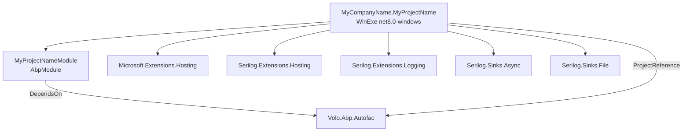

The `templates/wpf` folder is the source for ABP's Windows Presentation Foundation startup template. It is a single-project, `WinExe`-output, `net8.0-windows`-targeted application whose `App.xaml.cs` overrides `OnStartup` to build an `IAbpApplicationWithInternalServiceProvider` through `AbpApplicationFactory.CreateAsync<MyProjectNameModule>(...)`, initialize the module graph asynchronously, resolve `MainWindow` from the ABP service provider, and show it. Logging is pre-wired to Serilog with a rolling file sink. On shutdown, `OnExit` calls `ShutdownAsync` so module dispose hooks run cleanly. The CLI side is the simplest of any template here: `WpfTemplate.cs` sets the template name to `"wpf"` and `WpfTemplateBase` does not override `GetCustomSteps`, so the pipeline runs only the universal renamers and template-code stripper.

<Info>
This is the standalone desktop template for ABP. There is no companion "WPF inside `app`" head the way there is for MAUI Blazor — if you generate the layered application template you do not get a WPF project automatically. See [Clients — WPF](/clients/wpf-template) for the runtime guide and [CLI `new`](/cli/new-and-update) for the command surface.
</Info>

## Folder layout

The template is a single project under `src/`. Everything compiles to one `WinExe`.

```
templates/wpf/
├── common.props
└── src/
    └── MyCompanyName.MyProjectName/
        ├── App.xaml / App.xaml.cs
        ├── MainWindow.xaml / MainWindow.xaml.cs
        ├── AssemblyInfo.cs
        ├── HelloWorldService.cs
        ├── MyProjectNameModule.cs
        ├── MyCompanyName.MyProjectName.csproj
        └── appsettings.json
```

### Project inventory

| Path | Role |
| --- | --- |
| `src/MyCompanyName.MyProjectName/MyCompanyName.MyProjectName.csproj` | The single WPF project. `<OutputType>WinExe</OutputType>`, `<TargetFramework>net8.0-windows</TargetFramework>`, `<UseWPF>true</UseWPF>`. References `Volo.Abp.Autofac` and Serilog sinks. |
| `src/MyCompanyName.MyProjectName/App.xaml.cs` | Overrides `OnStartup` to build the ABP application, initialize modules, resolve and show `MainWindow`. Overrides `OnExit` to call `ShutdownAsync`. |
| `src/MyCompanyName.MyProjectName/App.xaml` | Empty `Application.Resources` — no app-level merged dictionaries. |
| `src/MyCompanyName.MyProjectName/MainWindow.xaml` | A single `Label` named `HelloLabel`. Title "MainWindow", 800×450. |
| `src/MyCompanyName.MyProjectName/MainWindow.xaml.cs` | Window class with constructor injection of `HelloWorldService`. Sets `HelloLabel.Content` in `OnContentRendered`. |
| `src/MyCompanyName.MyProjectName/MyProjectNameModule.cs` | ABP module. Depends on `AbpAutofacModule`. Explicitly registers `MainWindow` as a singleton. |
| `src/MyCompanyName.MyProjectName/HelloWorldService.cs` | Sample `ITransientDependency` service with `ILogger<HelloWorldService>` property injection. |
| `src/MyCompanyName.MyProjectName/AssemblyInfo.cs` | Standard WPF theme/UI-culture attributes. |
| `src/MyCompanyName.MyProjectName/appsettings.json` | Empty `{}` placeholder. Marked `Content` with `CopyToOutputDirectory=Always` in the csproj. |
| `common.props` | Shared MSBuild props (`<LangVersion>latest</LangVersion>`, `<Version>0.1.0</Version>`). |

## Project graph

The WPF head references `Volo.Abp.Autofac` and a handful of Serilog packages. Nothing else.



## The application bootstrap

`App.xaml.cs` is where every interesting decision lives. The class fields a private nullable `_abpApplication`, configures Serilog before any ABP code runs, builds the ABP application with `AbpApplicationFactory.CreateAsync`, initializes modules, and pulls `MainWindow` out of the resulting service provider. The factory variant used (`CreateAsync` returning `IAbpApplicationWithInternalServiceProvider`) means ABP **owns** the DI container — there is no external `IHostBuilder`, unlike the MAUI template.

```csharp templates/wpf/src/MyCompanyName.MyProjectName/App.xaml.cs lines icon="bolt"
using System;
using System.Windows;
using Microsoft.Extensions.DependencyInjection;
using Serilog;
using Serilog.Events;
using Volo.Abp;

namespace MyCompanyName.MyProjectName;

/// <summary>
/// Interaction logic for App.xaml
/// </summary>
public partial class App : Application
{
    private IAbpApplicationWithInternalServiceProvider? _abpApplication;

    protected override async void OnStartup(StartupEventArgs e)
    {
        Log.Logger = new LoggerConfiguration()
#if DEBUG
            .MinimumLevel.Debug()
#else
            .MinimumLevel.Information()
#endif
            .MinimumLevel.Override("Microsoft", LogEventLevel.Information)
            .Enrich.FromLogContext()
            .WriteTo.Async(c => c.File("Logs/logs.txt"))
            .CreateLogger();

        try
        {
            Log.Information("Starting WPF host.");

            _abpApplication =  await AbpApplicationFactory.CreateAsync<MyProjectNameModule>(options =>
            {
                options.UseAutofac();
                options.Services.AddLogging(loggingBuilder => loggingBuilder.AddSerilog(dispose: true));
            });

            await _abpApplication.InitializeAsync();

            _abpApplication.Services.GetRequiredService<MainWindow>()?.Show();

        }
        catch (Exception ex)
        {
            Log.Fatal(ex, "Host terminated unexpectedly!");
        }
    }

    protected override async void OnExit(ExitEventArgs e)
    {
        if (_abpApplication != null)
        {
            await _abpApplication.ShutdownAsync();
        }
        Log.CloseAndFlush();
    }
}
```

<AccordionGroup>
  <Accordion title="Why CreateAsync + InitializeAsync are split">
    `CreateAsync` builds the module graph and registers services into ABP's own `IServiceCollection`, but does **not** run any module `OnApplicationInitialization` hooks. `InitializeAsync` is what fires those hooks. Splitting them means you have a fully resolvable `_abpApplication.Services` even if initialization throws — useful for diagnostics, but in practice you should always call both.
  </Accordion>
  <Accordion title="Why MainWindow is singleton-registered">
    `_abpApplication.Services.GetRequiredService<MainWindow>()` requires that `MainWindow` is a registered service. ABP conventional registration skips classes that inherit from framework types it does not understand, so `MainWindow` is added explicitly in `MyProjectNameModule.ConfigureServices`. Without that line, the resolve throws `InvalidOperationException`.
  </Accordion>
  <Accordion title="Async void on OnStartup">
    `OnStartup` returns `void` per WPF's `Application` contract, so `async void` is unavoidable. Exceptions raised after the first `await` propagate to `AppDomain.UnhandledException`, not back into the WPF dispatcher. The `try`/`catch` around the body funnels them through Serilog instead.
  </Accordion>
  <Accordion title="Serilog file sink writes to Logs/logs.txt">
    `WriteTo.Async(c => c.File("Logs/logs.txt"))` writes to a relative path under the working directory — on Windows that is typically `bin\Debug\net8.0-windows\Logs\logs.txt` during development. There is no rolling policy configured by default; add `.File("Logs/logs.txt", rollingInterval: RollingInterval.Day)` if you need rotation.
  </Accordion>
</AccordionGroup>

## The WPF csproj

```xml templates/wpf/src/MyCompanyName.MyProjectName/MyCompanyName.MyProjectName.csproj lines icon="file-code"
<Project Sdk="Microsoft.NET.Sdk">

    <Import Project="..\..\common.props" />

    <PropertyGroup>
        <OutputType>WinExe</OutputType>
        <TargetFramework>net8.0-windows</TargetFramework>
        <Nullable>enable</Nullable>
        <UseWPF>true</UseWPF>
    </PropertyGroup>

    <ItemGroup>
        <ProjectReference Include="..\..\..\..\framework\src\Volo.Abp.Autofac\Volo.Abp.Autofac.csproj" />
    </ItemGroup>

    <ItemGroup>
        <PackageReference Include="Microsoft.Extensions.Hosting" Version="8.0.0" />
        <PackageReference Include="Serilog.Extensions.Hosting" Version="8.0.0" />
        <PackageReference Include="Serilog.Extensions.Logging" Version="8.0.0" />
        <PackageReference Include="Serilog.Sinks.Async" Version="1.5.0" />
        <PackageReference Include="Serilog.Sinks.File" Version="5.0.0" />
    </ItemGroup>

    <ItemGroup>
      <None Remove="appsettings.json" />
      <Content Include="appsettings.json">
        <CopyToOutputDirectory>Always</CopyToOutputDirectory>
      </Content>
    </ItemGroup>

</Project>
```

The `appsettings.json` handling is different from the MAUI template — WPF apps **do** have a writable working directory, so the JSON is copied as `Content` rather than embedded. The included file is `{}`; you fill it in.

## The module

The module's only job is to register `MainWindow` as a singleton so `OnStartup` can resolve it. Everything else (the `HelloWorldService` etc.) is picked up by ABP conventional registration via `ITransientDependency`.

```csharp templates/wpf/src/MyCompanyName.MyProjectName/MyProjectNameModule.cs lines icon="layer-group"
using Microsoft.Extensions.DependencyInjection;
using Volo.Abp.Autofac;
using Volo.Abp.Modularity;

namespace MyCompanyName.MyProjectName;

[DependsOn(typeof(AbpAutofacModule))]
public class MyProjectNameModule : AbpModule
{
    public override void ConfigureServices(ServiceConfigurationContext context)
    {
        context.Services.AddSingleton<MainWindow>();
    }
}
```

```csharp templates/wpf/src/MyCompanyName.MyProjectName/HelloWorldService.cs lines icon="message"
using Microsoft.Extensions.Logging;
using Microsoft.Extensions.Logging.Abstractions;
using Volo.Abp.DependencyInjection;

namespace MyCompanyName.MyProjectName;

public class HelloWorldService : ITransientDependency
{
    public ILogger<HelloWorldService> Logger { get; set; }

    public HelloWorldService()
    {
        Logger = NullLogger<HelloWorldService>.Instance;
    }
    public string SayHello()
    {
        Logger.LogInformation("Call SayHello");
        return "Hello world!";
    }
}
```

`Logger` is a *property*, not a constructor parameter. ABP's property-injection support (one of the reasons Autofac is required) fills it in after construction, falling back to `NullLogger` if the container has no `ILoggerFactory` — important because the property is set in the constructor before ABP gets a chance to inject anything.

## Main window

```xml templates/wpf/src/MyCompanyName.MyProjectName/MainWindow.xaml lines icon="window"
<Window x:Class="MyCompanyName.MyProjectName.MainWindow"
        xmlns="http://schemas.microsoft.com/winfx/2006/xaml/presentation"
        xmlns:x="http://schemas.microsoft.com/winfx/2006/xaml"
        xmlns:d="http://schemas.microsoft.com/expression/blend/2008"
        xmlns:mc="http://schemas.openxmlformats.org/markup-compatibility/2006"
        xmlns:local="clr-namespace:MyCompanyName.MyProjectName"
        mc:Ignorable="d"
        Title="MainWindow" Height="450" Width="800">
    <Grid>
        <Label Name="HelloLabel" FontSize="90" Margin="58,129,-58,-129"/>
    </Grid>
</Window>
```

```csharp templates/wpf/src/MyCompanyName.MyProjectName/MainWindow.xaml.cs lines icon="window"
using System;
using System.Windows;

namespace MyCompanyName.MyProjectName;

/// <summary>
/// Interaction logic for MainWindow.xaml
/// </summary>
public partial class MainWindow : Window
{
    private readonly HelloWorldService _helloWorldService;

    public MainWindow(HelloWorldService helloWorldService)
    {
        _helloWorldService = helloWorldService;
        InitializeComponent();
    }

    protected override void OnContentRendered(EventArgs e)
    {
        HelloLabel.Content = _helloWorldService.SayHello();
    }
}
```

`OnContentRendered` is the first WPF lifecycle hook that fires after the visual tree is fully realized — that is why the assignment happens there rather than in the constructor. Inside the constructor, `HelloLabel` is technically assigned by `InitializeComponent()`, but writing to it before render can cause measurement passes to recompute.

## How the CLI generates a WPF solution

The WPF template has the **emptiest** CLI pipeline of any template in this repo. `WpfTemplate.cs`:

```csharp framework/src/Volo.Abp.Cli.Core/Volo/Abp/Cli/ProjectBuilding/Templates/Wpf/WpfTemplate.cs lines icon="terminal"
namespace Volo.Abp.Cli.ProjectBuilding.Templates.Wpf;

public class WpfTemplate : WpfTemplateBase
{
    /// <summary>
    /// "wpf".
    /// </summary>
    public const string TemplateName = "wpf";

    public WpfTemplate()
        : base(TemplateName)
    {
        DocumentUrl = CliConsts.DocsLink + "/en/abp/latest/Startup-Templates/WPF";
    }
}
```

`WpfTemplateBase.cs`:

```csharp framework/src/Volo.Abp.Cli.Core/Volo/Abp/Cli/ProjectBuilding/Templates/Wpf/WpfTemplateBase.cs lines icon="gears"
using JetBrains.Annotations;
using Volo.Abp.Cli.ProjectBuilding.Building;

namespace Volo.Abp.Cli.ProjectBuilding.Templates.Wpf;

public class WpfTemplateBase : TemplateInfo
{
    protected WpfTemplateBase([NotNull] string name) :
        base(name)
    {
    }
}
```

`WpfTemplateBase` does **not** override `GetCustomSteps`. That means the default `TemplateInfo.GetCustomSteps` returns an empty list — every WPF generation runs the bare universal pipeline.

<Steps>
  <Step title="FileEntryListReadStep">
    Unzips the WPF template archive into `context.Files`.
  </Step>
  <Step title="(no custom steps)">
    `WpfTemplateBase.GetCustomSteps` is the default empty implementation.
  </Step>
  <Step title="ProjectReferenceReplaceStep">
    Rewrites the `<ProjectReference>` to `Volo.Abp.Autofac` into a `<PackageReference>` against the released version (unless `--local-framework-ref` is used).
  </Step>
  <Step title="TemplateCodeDeleteStep">
    Strips template markers from `.cs`, `.csproj`, `.xaml`, `.json` files.
  </Step>
  <Step title="SolutionRenameStep">
    Renames `MyCompanyName` → company name, `MyProjectName` → project name, and the matching lowercase identifiers across every file.
  </Step>
  <Step title="CheckRedisPreRequirements + CreateProjectResultZipStep">
    Final scan for any `Redis:Configuration` keys in module files (none in this template), then zips `context.Files` and emits the archive.
  </Step>
</Steps>

There is **no** database step, no UI framework step, no SSL port randomization, no theme step, no embedded-resource fixup. The WPF template is a desktop client only — it has no ASP.NET Core surface, no database connection string of its own, and no notion of UI framework selection.

## What is intentionally missing

<Warning>
This template is a starting point, not a finished application. It does not include:

- **HTTP client integration** — no `Volo.Abp.Http.Client`, no remote service proxies. You add them when you need to talk to an ABP HTTP API.
- **Authentication** — no OpenIddict / IdentityModel.OidcClient wiring. WPF + OIDC requires a hosted system browser flow that the template does not set up.
- **MVVM toolkit** — no CommunityToolkit.Mvvm, no INotifyPropertyChanged base class. The sample window is code-behind only.
- **Localization** — `AbpLocalizationModule` is not referenced. Strings in `MainWindow.xaml` are literal English.
- **Settings UI** — `appsettings.json` is shipped empty; there is no settings provider or strongly-typed options class.
</Warning>

## Customizing the template

Because the pipeline is so minimal, the project that lands on disk is essentially a 1:1 copy of `templates/wpf/src/MyCompanyName.MyProjectName/` with namespace replacements. Anything you commit to that folder will appear in every future `abp new -t wpf` run after the template archive is rebuilt and published.

| File | Touched by the pipeline |
| --- | --- |
| `MyCompanyName.MyProjectName.csproj` | `ProjectReferenceReplaceStep` (replaces `Volo.Abp.Autofac` ProjectReference with PackageReference), `SolutionRenameStep` |
| `*.cs`, `*.xaml` | `TemplateCodeDeleteStep`, `SolutionRenameStep` |
| `appsettings.json` | `SolutionRenameStep` only |

## Cross-references

- [Clients — WPF](/clients/wpf-template) — runtime guide for the generated WPF application.
- [CLI `new` and `update`](/cli/new-and-update) — `abp new -t wpf` command surface.
- [Project Building & Templates](/cli/project-building-and-templates) — `TemplateProjectBuildPipelineBuilder` architecture.
- [Template Structure & Replacements](/templates/template-structure-and-replacements) — the universal step pipeline shared by every template.
- [MAUI Template](/templates/maui-template) — sibling cross-platform template with a similar single-project layout.
- [Templates Overview](/templates/overview) — catalog of every template folder.
