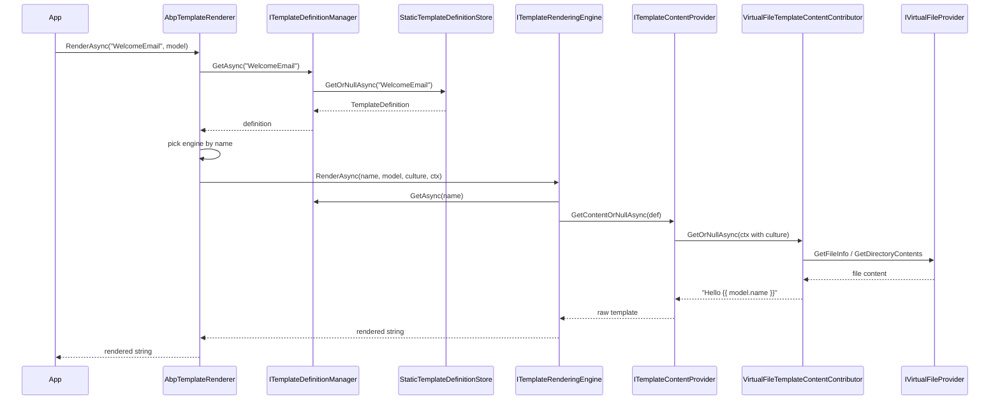

ABP's **text templating** subsystem renders strings — emails, SMS bodies, PDF source, code-gen output, anything textual — from named templates defined by modules and stored as virtual files, files on disk, dynamic database rows, or in-memory strings. The Core module wires up a definition store, a content provider, and a dispatching `ITemplateRenderer` that delegates to a *rendering engine* (Razor or Scriban) selected per template. This page walks the Core abstractions; the engine-specific pages cover [Razor](/templating/razor-engine) and [Scriban](/templating/scriban-engine).

The Core package is **`Volo.Abp.TextTemplating.Core`** and pulls in [`AbpVirtualFileSystemModule`](/vfs/overview) and `AbpLocalizationAbstractionsModule`. Templates are referenced by string name (e.g. `"WelcomeEmail"`), have a [`TemplateDefinition`](#templatedefinition) registered by an [`ITemplateDefinitionProvider`](#itemplatedefinitionprovider), and resolve their actual text content through chained [`ITemplateContentContributor`](#itemplatecontentcontributor)s — by default a virtual-file contributor backed by the VFS.

## File inventory

The Core assembly ships a small, focused surface:

| File | Type | Role |
| --- | --- | --- |
| `Volo/Abp/TextTemplating/AbpTextTemplatingCoreModule.cs` | `AbpModule` | Auto-registers providers/contributors via `OnRegistered`. |
| `Volo/Abp/TextTemplating/AbpTextTemplatingOptions.cs` | Options | Provider lists, contributor lists, engine map, default engine. |
| `Volo/Abp/TextTemplating/AbpTemplateRenderer.cs` | `ITemplateRenderer` | Dispatches to `ITemplateRenderingEngine` by name. |
| `Volo/Abp/TextTemplating/ITemplateRenderer.cs` | Interface | Public render entry point. |
| `Volo/Abp/TextTemplating/ITemplateContentProvider.cs` | Interface | Fetches raw template content for a name + culture. |
| `Volo/Abp/TextTemplating/TemplateContentProvider.cs` | Implementation | Runs contributor chain with culture fallback. |
| `Volo/Abp/TextTemplating/TemplateDefinition.cs` | Definition | Name, display name, layout, render engine, properties. |
| `Volo/Abp/TextTemplating/TemplateDefinitionExtensions.cs` | Extensions | `WithVirtualFilePath`, `GetVirtualFilePathOrNull`. |
| `Volo/Abp/TextTemplating/ITemplateDefinitionProvider.cs` | Interface | `PreDefine`/`Define`/`PostDefine` lifecycle. |
| `Volo/Abp/TextTemplating/TemplateDefinitionProvider.cs` | Base | Abstract base for definition providers. |
| `Volo/Abp/TextTemplating/ITemplateDefinitionContext.cs` | Interface | `Add`, `GetOrNull`, `GetAll` while defining. |
| `Volo/Abp/TextTemplating/TemplateDefinitionContext.cs` | Implementation | Dictionary-backed context. |
| `Volo/Abp/TextTemplating/ITemplateDefinitionManager.cs` | Interface | `GetAsync` / `GetAllAsync` over merged static+dynamic stores. |
| `Volo/Abp/TextTemplating/TemplateDefinitionManager.cs` | Implementation | Static-wins merge of the two stores. |
| `Volo/Abp/TextTemplating/IStaticTemplateDefinitionStore.cs` | Interface | Static definitions sourced from providers. |
| `Volo/Abp/TextTemplating/StaticTemplateDefinitionStore.cs` | Implementation | Builds dictionary lazily by running providers. |
| `Volo/Abp/TextTemplating/IDynamicTemplateDefinitionStore.cs` | Interface | Hook for DB-backed dynamic templates. |
| `Volo/Abp/TextTemplating/NullIDynamicTemplateDefinitionStore.cs` | Default | No-op fallback when no module supplies one. |
| `Volo/Abp/TextTemplating/ITemplateRenderingEngine.cs` | Interface | Engine contract: `Name`, `RenderAsync`. |
| `Volo/Abp/TextTemplating/TemplateRenderingEngineBase.cs` | Base | Localizer + content lookup helpers for engines. |
| `Volo/Abp/TextTemplating/ITemplateContentContributor.cs` | Interface | Pluggable content source. |
| `Volo/Abp/TextTemplating/TemplateContentContributorContext.cs` | Context | Carries definition + culture + scope. |
| `Volo/Abp/TextTemplating/VirtualFiles/*.cs` | VFS bridge | Reads content from `IVirtualFileProvider`. |

The legacy `Volo.Abp.TextTemplating` package contains only:

```csharp Volo/Abp/TextTemplating/AbpTextTemplatingModule.cs
[Obsolete("This module will be removed in the future. Please use AbpTextTemplatingScribanModule or AbpTextTemplatingRazorModule.")]
[DependsOn(typeof(AbpTextTemplatingScribanModule))]
public class AbpTextTemplatingModule : AbpModule
{

}
```

New modules should depend directly on `AbpTextTemplatingScribanModule`, `AbpTextTemplatingRazorModule`, or both.

## `AbpTextTemplatingCoreModule`

The Core module's only behavior is *auto-registration*: it scans the DI container as classes are registered and stuffs anything implementing `ITemplateDefinitionProvider` or `ITemplateContentContributor` into `AbpTextTemplatingOptions`. You never call `Add<MyProvider>()` manually — the convention-based ABP DI registrar surfaces every class implementing these markers, and the module picks them up in `PreConfigureServices`.

```csharp Volo/Abp/TextTemplating/AbpTextTemplatingCoreModule.cs
[DependsOn(
    typeof(AbpVirtualFileSystemModule),
    typeof(AbpLocalizationAbstractionsModule)
    )]
public class AbpTextTemplatingCoreModule : AbpModule
{
    public override void PreConfigureServices(ServiceConfigurationContext context)
    {
        AutoAddProvidersAndContributors(context.Services);
    }

    private static void AutoAddProvidersAndContributors(IServiceCollection services)
    {
        var definitionProviders = new List<Type>();
        var contentContributors = new List<Type>();

        services.OnRegistered(context =>
        {
            if (typeof(ITemplateDefinitionProvider).IsAssignableFrom(context.ImplementationType))
            {
                definitionProviders.Add(context.ImplementationType);
            }

            if (typeof(ITemplateContentContributor).IsAssignableFrom(context.ImplementationType))
            {
                contentContributors.Add(context.ImplementationType);
            }
        });

        services.Configure<AbpTextTemplatingOptions>(options =>
        {
            options.DefinitionProviders.AddIfNotContains(definitionProviders);
            options.ContentContributors.AddIfNotContains(contentContributors);
        });
    }
}
```

<Note>
The Core module does **not** register any rendering engine. Without depending on `AbpTextTemplatingScribanModule` or `AbpTextTemplatingRazorModule`, `AbpTextTemplatingOptions.RenderingEngines` is empty and `AbpTemplateRenderer.RenderAsync` will throw `AbpException("There is no rendering engine found with template name: …")`.
</Note>

## `AbpTextTemplatingOptions`

```csharp Volo/Abp/TextTemplating/AbpTextTemplatingOptions.cs
public class AbpTextTemplatingOptions
{
    public ITypeList<ITemplateDefinitionProvider> DefinitionProviders { get; }
    public ITypeList<ITemplateContentContributor> ContentContributors { get; }
    public IDictionary<string, Type> RenderingEngines { get; }

    public string? DefaultRenderingEngine { get; set; }

    public HashSet<string> DeletedTemplates { get; }
    // …
}
```

| Property | Populated by | Used by |
| --- | --- | --- |
| `DefinitionProviders` | `OnRegistered` scan | `StaticTemplateDefinitionStore` builds its dictionary by instantiating each provider. |
| `ContentContributors` | `OnRegistered` scan | `TemplateContentProvider` iterates them in reverse order. |
| `RenderingEngines` | Razor/Scriban modules in `ConfigureServices` | `AbpTemplateRenderer` looks up the engine by name. |
| `DefaultRenderingEngine` | Razor/Scriban modules | Fallback when a `TemplateDefinition.RenderEngine` is null/whitespace. |
| `DeletedTemplates` | App code | Reserved hook so a downstream module can suppress an inherited template name (read by dynamic stores). |

The Razor module sets `DefaultRenderingEngine = "Razor"` *only* if no default is set yet, while the Scriban module overrides it unconditionally — load order therefore matters when both engines are wired in.

## `TemplateDefinition`

A `TemplateDefinition` describes *what* a template is, not its content. Properties include name, layout, localization resource, default culture, render engine, and an open `Properties` dictionary used by extension methods like `WithVirtualFilePath`.

```csharp Volo/Abp/TextTemplating/TemplateDefinition.cs
public class TemplateDefinition : IHasNameWithLocalizableDisplayName
{
    public const int MaxNameLength = 128;

    [NotNull] public string Name { get; }
    [NotNull] public ILocalizableString DisplayName { get; set; }

    public bool IsLayout { get; }
    public string? Layout { get; set; }

    public string? LocalizationResourceName { get; set; }
    public bool IsInlineLocalized { get; set; }
    public string? DefaultCultureName { get; }

    public string? RenderEngine { get; set; }

    public Dictionary<string, object?> Properties { get; }

    public TemplateDefinition(
        [NotNull] string name,
        string? localizationResourceName = null,
        ILocalizableString? displayName = null,
        bool isLayout = false,
        string? layout = null,
        string? defaultCultureName = null) { /* … */ }

    public virtual TemplateDefinition WithProperty(string key, object value) { /* … */ }
    public virtual TemplateDefinition WithRenderEngine(string renderEngine) { /* … */ }
}
```

A `TemplateDefinition`'s `Layout` references another template by name. When the renderer finishes rendering the body, it re-enters with the layout name and the body string as `body` — Razor passes it as `template.Body`, Scriban passes it as a `globalContext["content"]` variable.

### `WithVirtualFilePath`

The most common way to attach content is via the VFS:

```csharp Volo/Abp/TextTemplating/TemplateDefinitionExtensions.cs
public static class TemplateDefinitionExtensions
{
    public static TemplateDefinition WithVirtualFilePath(
        [NotNull] this TemplateDefinition templateDefinition,
        [NotNull] string virtualPath,
        bool isInlineLocalized)
    {
        templateDefinition.IsInlineLocalized = isInlineLocalized;
        return templateDefinition.WithProperty(
            VirtualFileTemplateContentContributor.VirtualPathPropertyName,
            virtualPath
        );
    }

    public static string? GetVirtualFilePathOrNull(
        [NotNull] this TemplateDefinition templateDefinition) { /* … */ }
}
```

`isInlineLocalized: true` means the template file is a single `.tpl`/`.cshtml` that handles localization inside its content (e.g. via the `L["Key"]` helper). `isInlineLocalized: false` means the virtual path is a *folder* and each file inside it is a per-culture content file named like `en.tpl`, `tr-TR.tpl`, etc.

## `ITemplateDefinitionProvider`

Modules implement an `ITemplateDefinitionProvider` (or extend `TemplateDefinitionProvider`) and register templates inside `Define`:

```csharp Volo/Abp/TextTemplating/ITemplateDefinitionProvider.cs
public interface ITemplateDefinitionProvider
{
    void PreDefine(ITemplateDefinitionContext context);
    void Define(ITemplateDefinitionContext context);
    void PostDefine(ITemplateDefinitionContext context);
}
```

```csharp Volo/Abp/TextTemplating/TemplateDefinitionProvider.cs
public abstract class TemplateDefinitionProvider : ITemplateDefinitionProvider, ITransientDependency
{
    public virtual void PreDefine(ITemplateDefinitionContext context) { }
    public abstract void Define(ITemplateDefinitionContext context);
    public virtual void PostDefine(ITemplateDefinitionContext context) { }
}
```

All three phases run in three passes across **every** provider in turn — `PreDefine` on all providers, then `Define` on all, then `PostDefine` on all. `PostDefine` is the place to mutate templates that other modules registered (e.g. attaching a layout to all of a module's templates).

The context passed in is a `TemplateDefinitionContext`:

```csharp Volo/Abp/TextTemplating/TemplateDefinitionContext.cs
public class TemplateDefinitionContext : ITemplateDefinitionContext
{
    public virtual IReadOnlyList<TemplateDefinition> GetAll() { /* … */ }
    public virtual TemplateDefinition? GetOrNull(string name) { /* … */ }
    public virtual void Add(params TemplateDefinition[] definitions) { /* … */ }
}
```

## Definition lookup: static + dynamic

`ITemplateDefinitionManager` is the abstraction code reads from. Internally it composes two stores:

```csharp Volo/Abp/TextTemplating/TemplateDefinitionManager.cs
public class TemplateDefinitionManager : ITemplateDefinitionManager, ISingletonDependency
{
    protected readonly IStaticTemplateDefinitionStore StaticStore;
    protected readonly IDynamicTemplateDefinitionStore DynamicStore;

    public virtual async Task<TemplateDefinition?> GetOrNullAsync(string name)
    {
        return await StaticStore.GetOrNullAsync(name) ?? await DynamicStore.GetOrNullAsync(name);
    }

    public virtual async Task<IReadOnlyList<TemplateDefinition>> GetAllAsync()
    {
        var staticTemplates = await StaticStore.GetAllAsync();
        var staticTemplateNames = staticTemplates.Select(p => p.Name).ToImmutableHashSet();
        var dynamicTemplates = await DynamicStore.GetAllAsync();

        /* We prefer static Templates over dynamics */
        return staticTemplates
            .Concat(dynamicTemplates.Where(d => !staticTemplateNames.Contains(d.Name)))
            .ToImmutableList();
    }
}
```

Static definitions always win over dynamic ones of the same name. The dynamic store defaults to `NullIDynamicTemplateDefinitionStore`, which returns empty results — modules like the Text Template Management module substitute their own implementation when present.

The static store builds its dictionary lazily on first read, running the three definition phases inside a scope:

```csharp Volo/Abp/TextTemplating/StaticTemplateDefinitionStore.cs
protected virtual IDictionary<string, TemplateDefinition> CreateTextTemplateDefinitions()
{
    var templates = new Dictionary<string, TemplateDefinition>();

    using (var scope = ServiceProvider.CreateScope())
    {
        var providers = Options.DefinitionProviders
            .Select(p => (scope.ServiceProvider.GetRequiredService(p) as ITemplateDefinitionProvider)!)
            .ToList();

        var context = new TemplateDefinitionContext(templates);

        foreach (var provider in providers) provider.PreDefine(context);
        foreach (var provider in providers) provider.Define(context);
        foreach (var provider in providers) provider.PostDefine(context);
    }

    return templates;
}
```

## `ITemplateContentProvider`

Renderers do not read files directly. They ask `ITemplateContentProvider` for a culture-resolved string, and the provider runs a *contributor chain* with culture-fallback rules.

```csharp Volo/Abp/TextTemplating/ITemplateContentProvider.cs
public interface ITemplateContentProvider
{
    Task<string?> GetContentOrNullAsync(
        [NotNull] string templateName,
        string? cultureName = null,
        bool tryDefaults = true,
        bool useCurrentCultureIfCultureNameIsNull = true
    );

    Task<string?> GetContentOrNullAsync(
        [NotNull] TemplateDefinition templateDefinition,
        string? cultureName = null,
        bool tryDefaults = true,
        bool useCurrentCultureIfCultureNameIsNull = true
    );
}
```

The default implementation resolves content in this order:

1. The requested `cultureName` (or `CultureInfo.CurrentUICulture.Name` if not specified).
2. The base culture without the country code (e.g. `tr` after `tr-TR`).
3. If `IsInlineLocalized`: a culture-independent lookup (`Culture = null`).
4. Otherwise: the `DefaultCultureName` set on the `TemplateDefinition`.

Contributors are iterated in **reverse** registration order, so later-loaded modules can override built-in content sources:

```csharp Volo/Abp/TextTemplating/TemplateContentProvider.cs
protected virtual ITemplateContentContributor[] CreateTemplateContentContributors(IServiceProvider serviceProvider)
{
    return Options.ContentContributors
        .Select(type => (ITemplateContentContributor)serviceProvider.GetRequiredService(type))
        .Reverse()
        .ToArray();
}
```

If no contributor returns content for any attempted culture, the method returns `null` — the renderer's behavior on null content is engine-specific (Razor throws, Scriban renders an empty string).

## `ITemplateContentContributor`

```csharp Volo/Abp/TextTemplating/ITemplateContentContributor.cs
public interface ITemplateContentContributor
{
    Task<string?> GetOrNullAsync(TemplateContentContributorContext context);
}
```

```csharp Volo/Abp/TextTemplating/TemplateContentContributorContext.cs
public class TemplateContentContributorContext
{
    [NotNull] public TemplateDefinition TemplateDefinition { get; }
    [NotNull] public IServiceProvider ServiceProvider { get; }
    public string? Culture { get; }
}
```

The built-in contributor reads from the VFS using the `VirtualPath` property attached by `WithVirtualFilePath`:

```csharp Volo/Abp/TextTemplating/VirtualFiles/VirtualFileTemplateContentContributor.cs
public class VirtualFileTemplateContentContributor : ITemplateContentContributor, ITransientDependency
{
    public const string VirtualPathPropertyName = "VirtualPath";

    public virtual async Task<string?> GetOrNullAsync(TemplateContentContributorContext context)
    {
        var localizedReader = await _localizedTemplateContentReaderFactory
            .CreateAsync(context.TemplateDefinition);

        return localizedReader.GetContentOrNull(context.Culture);
    }
}
```

The reader factory inspects whether the virtual path points to a single file or a folder, and chooses one of two readers:

| Reader | `GetContentOrNull(culture)` returns |
| --- | --- |
| `FileInfoLocalizedTemplateContentReader` | The file content if `culture == null`, otherwise `null`. Used for inline-localized templates. |
| `VirtualFolderLocalizedTemplateContentReader` | The content of `{culture}.tpl` (or `.cshtml`) from the folder, or `null` if no such file. |

```csharp Volo/Abp/TextTemplating/VirtualFiles/LocalizedTemplateContentReaderFactory.cs
protected virtual async Task<ILocalizedTemplateContentReader> CreateInternalAsync(TemplateDefinition templateDefinition)
{
    var virtualPath = templateDefinition.GetVirtualFilePathOrNull();
    if (virtualPath == null)
    {
        return NullLocalizedTemplateContentReader.Instance;
    }

    var fileInfo = VirtualFileProvider.GetFileInfo(virtualPath);
    if (!fileInfo.Exists)
    {
        var directoryContents = VirtualFileProvider.GetDirectoryContents(virtualPath);
        if (!directoryContents.Exists)
        {
            throw new AbpException("Could not find a file/folder at the location: " + virtualPath);
        }
        fileInfo = new VirtualDirectoryFileInfo(virtualPath, virtualPath, DateTimeOffset.UtcNow);
    }

    if (fileInfo.IsDirectory)
    {
        //TODO: Configure file extensions.
        var folderReader = new VirtualFolderLocalizedTemplateContentReader(new[] { ".tpl", ".cshtml" });
        await folderReader.ReadContentsAsync(VirtualFileProvider, virtualPath);
        return folderReader;
    }
    else //File
    {
        var singleFileReader = new FileInfoLocalizedTemplateContentReader();
        await singleFileReader.ReadContentsAsync(fileInfo);
        return singleFileReader;
    }
}
```

Readers are cached per template name, so file I/O happens once per process.

## `ITemplateRenderer` — the dispatching entry point

```csharp Volo/Abp/TextTemplating/ITemplateRenderer.cs
public interface ITemplateRenderer
{
    Task<string> RenderAsync(
        [NotNull] string templateName,
        object? model = null,
        string? cultureName = null,
        Dictionary<string, object>? globalContext = null
    );
}
```

The default implementation, `AbpTemplateRenderer`, looks up the template definition, picks the right engine, and forwards the call:

```csharp Volo/Abp/TextTemplating/AbpTemplateRenderer.cs
public virtual async Task<string> RenderAsync(
    string templateName,
    object? model = null,
    string? cultureName = null,
    Dictionary<string, object>? globalContext = null)
{
    var templateDefinition = await TemplateDefinitionManager.GetAsync(templateName);

    var renderEngine = templateDefinition.RenderEngine;

    if (renderEngine.IsNullOrWhiteSpace())
    {
        renderEngine = Options.DefaultRenderingEngine;
    }

    var providerType = Options.RenderingEngines.GetOrDefault(renderEngine!);

    if (providerType != null && typeof(ITemplateRenderingEngine).IsAssignableFrom(providerType))
    {
        using (var scope = ServiceScopeFactory.CreateScope())
        {
            var templateRenderingEngine = (ITemplateRenderingEngine)scope.ServiceProvider.GetRequiredService(providerType);
            return await templateRenderingEngine.RenderAsync(templateName, model, cultureName, globalContext);
        }
    }

    throw new AbpException("There is no rendering engine found with template name: " + templateName);
}
```

A new scope is created per render call so engine instances and their per-render state are scoped to the request.

## End-to-end render flow



## Rendering engine contract

Every concrete engine implements `ITemplateRenderingEngine`:

```csharp Volo/Abp/TextTemplating/ITemplateRenderingEngine.cs
public interface ITemplateRenderingEngine
{
    string Name { get; }

    Task<string> RenderAsync(
        [NotNull] string templateName,
        object? model = null,
        string? cultureName = null,
        Dictionary<string, object>? globalContext = null
    );
}
```

The shared base wires the localizer and content lookup so engines focus on parsing/execution:

```csharp Volo/Abp/TextTemplating/TemplateRenderingEngineBase.cs
public abstract class TemplateRenderingEngineBase : ITemplateRenderingEngine
{
    public abstract string Name { get; }

    protected readonly ITemplateDefinitionManager TemplateDefinitionManager;
    protected readonly ITemplateContentProvider TemplateContentProvider;
    protected readonly IStringLocalizerFactory StringLocalizerFactory;

    protected virtual async Task<string?> GetContentOrNullAsync(TemplateDefinition templateDefinition)
    {
        return await TemplateContentProvider.GetContentOrNullAsync(templateDefinition);
    }

    protected virtual IStringLocalizer? GetLocalizerOrNull(TemplateDefinition templateDefinition)
    {
        if (templateDefinition.LocalizationResourceName != null)
        {
            return StringLocalizerFactory.CreateByResourceName(templateDefinition.LocalizationResourceName);
        }

        return StringLocalizerFactory.CreateDefaultOrNull();
    }
}
```

## Defining a template — a worked example

A typical setup combines all of the above:

```csharp Modules/Email/EmailTemplateDefinitionProvider.cs (illustrative)
public class EmailTemplateDefinitionProvider : TemplateDefinitionProvider
{
    public override void Define(ITemplateDefinitionContext context)
    {
        context.Add(
            new TemplateDefinition(
                name: "WelcomeEmail",
                localizationResourceName: LocalizationResourceNameAttribute.GetName(typeof(EmailResource)),
                displayName: new LocalizableString(typeof(EmailResource), "Templates:WelcomeEmail"),
                defaultCultureName: "en"
            )
            .WithVirtualFilePath("/Templates/Welcome", isInlineLocalized: false)
        );

        context.Add(
            new TemplateDefinition("Layout", isLayout: true)
                .WithVirtualFilePath("/Templates/Layout.tpl", isInlineLocalized: true)
        );
    }
}
```

With a virtual file layout like:

```
Templates/
  Layout.tpl
  Welcome/
    en.tpl
    tr.tpl
    de.tpl
```

Calling `await renderer.RenderAsync("WelcomeEmail", new { Name = "Ada" }, cultureName: "tr-TR")` would:

1. Resolve `WelcomeEmail` from `StaticTemplateDefinitionStore`.
2. Pick the default rendering engine (Scriban or Razor, depending on which module is loaded).
3. Ask `TemplateContentProvider` for `tr-TR` — folder reader returns null, fallback retries with `tr`, returns `tr.tpl`.
4. Render that content with the model.
5. Render the layout with the body string.

## Related modules and packages

| Package | Adds | Page |
| --- | --- | --- |
| `Volo.Abp.TextTemplating.Razor` | Razor engine, compiled view provider, layout chaining via `Body`. | [Razor engine](/templating/razor-engine) |
| `Volo.Abp.TextTemplating.Scriban` | Scriban engine, `L["…"]` helper, layout chaining via `content` global. | [Scriban engine](/templating/scriban-engine) |
| `Volo.Abp.TextTemplating` *(legacy)* | Thin `[Obsolete]` re-export of the Scriban module. | — |

## Cross-cutting integrations

- **Virtual File System** — the only built-in content source. See [`/vfs/overview`](/vfs/overview) for the file set registration that makes `/Templates/Welcome` resolvable.
- **Localization** — `TemplateDefinition.LocalizationResourceName` drives the `IStringLocalizer` exposed to templates (Razor `Localizer`, Scriban `L`). See [`/localization/overview`](/localization/overview).
- **Blob Storing** — modules that render binary documents (e.g. PDF reports) typically render the text body with `ITemplateRenderer` and persist the resulting bytes through [`/blobs/overview`](/blobs/overview).
- **Web** — emails sent from web pipelines via `IEmailSender` resolve their bodies through `ITemplateRenderer`; see [`/web/overview`](/web/overview) for the hosting context.
