The Scriban engine renders text templates using [Scriban](https://github.com/scriban/scriban), a lightweight Liquid-/Jekyll-inspired template language that needs no compilation step — templates are parsed once and executed against a `TemplateContext` populated with the model, your globals, and a custom `L["…"]` localizer function. Because Scriban templates are pure data, this engine is the right default for SMS bodies, JSON payloads, code-gen snippets, and any rendering that runs outside the ASP.NET Core hosting model. This page covers `AbpTextTemplatingScribanModule`, `ScribanTemplateRenderingEngine`, and the `ScribanTemplateLocalizer` script function it injects.

The underlying definitions, content provider, and dispatcher live in Core — see [`/templating/overview`](/templating/overview).

## File inventory

| File | Type | Role |
| --- | --- | --- |
| `Volo/Abp/TextTemplating/Scriban/AbpTextTemplatingScribanModule.cs` | `AbpModule` | Registers Scriban as the default engine. |
| `Volo/Abp/TextTemplating/Scriban/ScribanTemplateRenderingEngine.cs` | Engine | Implements `ITemplateRenderingEngine` for `"Scriban"`. |
| `Volo/Abp/TextTemplating/Scriban/ScribanTemplateLocalizer.cs` | Script function | `L["Key", args]` exposed to templates. |
| `Volo/Abp/TextTemplating/Scriban/ScribanTemplateDefinitionExtensions.cs` | Extensions | `.WithScribanEngine()` shortcut on `TemplateDefinition`. |

## `AbpTextTemplatingScribanModule`

The module hooks into `AbpTextTemplatingOptions` to register the engine and **unconditionally** sets the default engine to Scriban. It depends on the Core module (which auto-discovers the rendering engine class through `ITransientDependency`).

```csharp Volo/Abp/TextTemplating/Scriban/AbpTextTemplatingScribanModule.cs
[DependsOn(
    typeof(AbpTextTemplatingCoreModule)
)]
public class AbpTextTemplatingScribanModule : AbpModule
{
    public override void ConfigureServices(ServiceConfigurationContext context)
    {
        Configure<AbpTextTemplatingOptions>(options =>
        {
            options.DefaultRenderingEngine = ScribanTemplateRenderingEngine.EngineName;
            options.RenderingEngines[ScribanTemplateRenderingEngine.EngineName] = typeof(ScribanTemplateRenderingEngine);
        });
    }
}
```

<Note>
The Scriban module sets `DefaultRenderingEngine` **unconditionally**, in contrast to the Razor module which only sets it if it was empty. When both modules are loaded together the engine that's loaded last on the dependency graph wins for *unannotated* templates. To leave nothing to chance, pin the engine per template:

```csharp Volo/Abp/TextTemplating/Scriban/ScribanTemplateDefinitionExtensions.cs
public static class ScribanTemplateDefinitionExtensions
{
    public static TemplateDefinition WithScribanEngine([NotNull] this TemplateDefinition templateDefinition)
    {
        return templateDefinition.WithRenderEngine(ScribanTemplateRenderingEngine.EngineName);
    }
}
```
</Note>

## Engine name and entry point

```csharp Volo/Abp/TextTemplating/Scriban/ScribanTemplateRenderingEngine.cs
public class ScribanTemplateRenderingEngine : TemplateRenderingEngineBase, ITransientDependency
{
    public const string EngineName = "Scriban";
    public override string Name => EngineName;

    public ScribanTemplateRenderingEngine(
        ITemplateDefinitionManager templateDefinitionManager,
        ITemplateContentProvider templateContentProvider,
        IStringLocalizerFactory stringLocalizerFactory)
        : base(templateDefinitionManager, templateContentProvider, stringLocalizerFactory)
    {
    }
    // …
}
```

`AbpTemplateRenderer` in Core dispatches to this engine when a definition's `RenderEngine == "Scriban"` or when `Scriban` is the default. The engine extends `TemplateRenderingEngineBase`, so it inherits the helpers for content resolution (`GetContentOrNullAsync`) and localizer resolution (`GetLocalizerOrNull`).

## `RenderAsync` and culture handling

```csharp Volo/Abp/TextTemplating/Scriban/ScribanTemplateRenderingEngine.cs
public override async Task<string> RenderAsync(
    [NotNull] string templateName,
    object? model = null,
    string? cultureName = null,
    Dictionary<string, object>? globalContext = null)
{
    Check.NotNullOrWhiteSpace(templateName, nameof(templateName));

    if (globalContext == null)
    {
        globalContext = new Dictionary<string, object>();
    }

    if (cultureName == null)
    {
        return await RenderInternalAsync(
            templateName,
            globalContext,
            model
        );
    }
    else
    {
        using (CultureHelper.Use(cultureName))
        {
            return await RenderInternalAsync(
                templateName,
                globalContext,
                model
            );
        }
    }
}
```

When a `cultureName` is supplied, the entire render runs inside `CultureHelper.Use(cultureName)` so `CultureInfo.CurrentCulture` and `CurrentUICulture` swap for the duration. The `IStringLocalizer` later resolved by `GetLocalizerOrNull` honors that swap, so the `L["…"]` function returns culture-correct translations.

## Layout chaining

Scriban does not have a built-in `_Layout` concept, but ABP adds one by re-entering with the layout template and **passing the rendered body as a `content` variable on the global context**:

```csharp Volo/Abp/TextTemplating/Scriban/ScribanTemplateRenderingEngine.cs
protected virtual async Task<string> RenderInternalAsync(
    string templateName,
    Dictionary<string, object> globalContext,
    object? model = null)
{
    var templateDefinition = await TemplateDefinitionManager.GetAsync(templateName);

    var renderedContent = await RenderSingleTemplateAsync(
        templateDefinition,
        globalContext,
        model
    );

    if (templateDefinition.Layout != null)
    {
        globalContext["content"] = renderedContent;
        renderedContent = await RenderInternalAsync(
            templateDefinition.Layout,
            globalContext
        );
    }

    return renderedContent;
}
```

The layout template therefore references the inner body simply as `{{ content }}`. Layout chains are recursive, so a layout template can itself reference a parent layout.

<Warning>
Storing the body in `globalContext["content"]` means a key named `content` in the *user-supplied* `globalContext` will be overwritten while rendering a layout. Pick another key for application data.
</Warning>

## Rendering a single template

The body of a Scriban render is a single `Parse` + `RenderAsync` call against a constructed `TemplateContext`:

```csharp Volo/Abp/TextTemplating/Scriban/ScribanTemplateRenderingEngine.cs
protected virtual async Task<string> RenderSingleTemplateAsync(
    TemplateDefinition templateDefinition,
    Dictionary<string, object> globalContext,
    object? model = null)
{
    var rawTemplateContent = await GetContentOrNullAsync(templateDefinition);

    return await RenderTemplateContentWithScribanAsync(
        templateDefinition,
        rawTemplateContent!,
        globalContext,
        model
    );
}

protected virtual async Task<string> RenderTemplateContentWithScribanAsync(
    TemplateDefinition templateDefinition,
    string templateContent,
    Dictionary<string, object> globalContext,
    object? model = null)
{
    var context = CreateScribanTemplateContext(
        templateDefinition,
        globalContext,
        model
    );

    return await Template
            .Parse(templateContent)
            .RenderAsync(context);
}
```

`GetContentOrNullAsync` is the helper on `TemplateRenderingEngineBase` that calls `ITemplateContentProvider.GetContentOrNullAsync(templateDefinition)`. If no contributor produces content (the contributor chain returns `null`), the `!` operator hands `null` to `Template.Parse`, which Scriban tolerates as an empty template. Compared to the Razor engine — which throws `AbpException` when content is null — this is a quieter failure mode worth keeping in mind during template authoring.

## `CreateScribanTemplateContext`

The heart of the engine is how it builds the `Scriban.TemplateContext`. Three things go in:

```csharp Volo/Abp/TextTemplating/Scriban/ScribanTemplateRenderingEngine.cs
protected virtual TemplateContext CreateScribanTemplateContext(
    TemplateDefinition templateDefinition,
    Dictionary<string, object> globalContext,
    object? model = null)
{
    var context = new TemplateContext();

    var scriptObject = new ScriptObject();

    scriptObject.Import(globalContext);

    if (model != null)
    {
        scriptObject["model"] = model;
    }

    var localizer = GetLocalizerOrNull(templateDefinition);
    if (localizer != null)
    {
        scriptObject.SetValue("L", new ScribanTemplateLocalizer(localizer), true);
    }

    context.PushGlobal(scriptObject);
    context.PushCulture(System.Globalization.CultureInfo.CurrentCulture);

    return context;
}
```

| What | Exposed in template as | Notes |
| --- | --- | --- |
| `globalContext` dictionary entries | `{{ Key }}` for each key | Imported via `ScriptObject.Import`. |
| `model` (caller-supplied) | `{{ model.Property }}` | Only set when `model != null`. |
| `IStringLocalizer` | `{{ L "Resource:Key" arg0 arg1 }}` | Bound as a `ScriptFunctionCall`; see below. The third arg to `SetValue` (`true`) marks it read-only. |
| `CultureInfo.CurrentCulture` | `culture` builtins | Pushed onto the context so Scriban's date/number formatting honors it. |

## `ScribanTemplateLocalizer`

The localizer is a Scriban *custom function* — implementing `IScriptCustomFunction` lets it accept a positional argument list of any size, which is what `IStringLocalizer.this[name, args]` requires for format-string parameters:

```csharp Volo/Abp/TextTemplating/Scriban/ScribanTemplateLocalizer.cs
public class ScribanTemplateLocalizer : IScriptCustomFunction
{
    private readonly IStringLocalizer _localizer;

    public ScribanTemplateLocalizer(IStringLocalizer localizer)
    {
        _localizer = localizer;
    }

    public object Invoke(TemplateContext context, ScriptNode callerContext, ScriptArray arguments,
        ScriptBlockStatement blockStatement)
    {
        return GetString(arguments);
    }

    public ValueTask<object> InvokeAsync(TemplateContext context, ScriptNode callerContext, ScriptArray arguments,
        ScriptBlockStatement blockStatement)
    {
        return new ValueTask<object>(GetString(arguments));
    }

    private string GetString(ScriptArray arguments)
    {
        if (arguments.IsNullOrEmpty())
        {
            return string.Empty;
        }

        var name = arguments[0];
        if (name == null || name.ToString().IsNullOrWhiteSpace())
        {
            return string.Empty;
        }

        var args = arguments.Skip(1).Where(x => x != null && !x.ToString().IsNullOrWhiteSpace()).ToArray();
        return args.Any() ? _localizer[name.ToString()!, args] : _localizer[name.ToString()!];
    }

    public int RequiredParameterCount => 1;
    public int ParameterCount => ScriptFunctionCall.MaximumParameterCount - 1;
    public ScriptVarParamKind VarParamKind => ScriptVarParamKind.Direct;
    public Type ReturnType => typeof(object);

    public ScriptParameterInfo GetParameterInfo(int index)
    {
        return index == 0
            ? new ScriptParameterInfo(typeof(string), "template_name")
            : new ScriptParameterInfo(typeof(object), "value")
        ;
    }
}
```

Key behaviors to keep in mind when writing templates:

- The function silently returns the empty string when called with no arguments or a null/blank key.
- Format arguments that are themselves null or whitespace are **filtered out** before being passed to `_localizer[name, args]`. So a missing variable does not crash the render, but it also will not show up as `null` in the formatted message — it simply vanishes.
- The function is registered with name `"L"`, so a template uses it as `{{ L "WelcomeMessage" model.name }}`.

The `IStringLocalizer` is the same `GetLocalizerOrNull` resolution as Razor:

```csharp Volo/Abp/TextTemplating/TemplateRenderingEngineBase.cs
protected virtual IStringLocalizer? GetLocalizerOrNull(TemplateDefinition templateDefinition)
{
    if (templateDefinition.LocalizationResourceName != null)
    {
        return StringLocalizerFactory.CreateByResourceName(templateDefinition.LocalizationResourceName);
    }

    return StringLocalizerFactory.CreateDefaultOrNull();
}
```

When `TemplateDefinition.LocalizationResourceName` is `null` and no default localizer exists, `L` is not registered, so referencing it in a template would raise a Scriban runtime error.

## Putting it together

```mermaid
flowchart LR
  A[ITemplateRenderer.RenderAsync] --> B[AbpTemplateRenderer]
  B -->|RenderEngine == Scriban| C[ScribanTemplateRenderingEngine.RenderAsync]
  C -->|cultureName!=null| D[CultureHelper.Use]
  D --> E[RenderInternalAsync]
  E --> F[GetContentOrNullAsync]
  F --> G[Template.Parse]
  G --> H[CreateScribanTemplateContext]
  H --> I[Template.RenderAsync ctx]
  I -->|Layout!=null| E
  I --> J[Return string]
```



### Example template

```liquid /Templates/Welcome/en.tpl (illustrative)
{{ L "Greeting" model.Name }}

{{ L "OrderSummary" model.OrderId model.Total }}

{{ if model.IsTrial }}
{{ L "TrialFooter" }}
{{ end }}
```

### Definition wiring

```csharp DefinitionProvider (illustrative)
public override void Define(ITemplateDefinitionContext context)
{
    context.Add(
        new TemplateDefinition(
            name: "WelcomeEmail",
            localizationResourceName: LocalizationResourceNameAttribute.GetName(typeof(EmailResource)),
            layout: "EmailLayout",
            defaultCultureName: "en"
        )
        .WithScribanEngine()
        .WithVirtualFilePath("/Templates/Welcome", isInlineLocalized: false)
    );

    context.Add(
        new TemplateDefinition("EmailLayout", isLayout: true)
            .WithScribanEngine()
            .WithVirtualFilePath("/Templates/EmailLayout.tpl", isInlineLocalized: true)
    );
}
```

With this in place, `EmailLayout.tpl` references the rendered welcome content as `{{ content }}` and can itself call `{{ L "Header" }}` against the same resource.

### Calling site

```csharp (illustrative)
public class WelcomeService
{
    private readonly ITemplateRenderer _renderer;

    public WelcomeService(ITemplateRenderer renderer) => _renderer = renderer;

    public Task<string> RenderAsync(WelcomeModel model, string cultureName)
    {
        return _renderer.RenderAsync(
            templateName: "WelcomeEmail",
            model: model,
            cultureName: cultureName,
            globalContext: new Dictionary<string, object>
            {
                ["appName"] = "My App",
                ["year"] = DateTime.UtcNow.Year
            });
    }
}
```

In the template, `{{ appName }}` and `{{ year }}` reach the global context, `{{ model.Name }}` walks the model, and `{{ L "Greeting" model.Name }}` localizes through the registered resource.

## Authoring guidelines

1. **Reference the model** as `model.Property` — not `Model.Property`. Scriban is case-sensitive by default and the engine sets `scriptObject["model"] = model` (lower-case).
2. **Use `L` for any user-visible text** so culture switching at the call site works automatically.
3. **Avoid the key `content`** in your `globalContext` — it is reserved for layout chaining.
4. **Pin the engine** via `.WithScribanEngine()` when both engines are loaded; otherwise the default engine depends on module load order.
5. **Use folders for per-culture variants** (`isInlineLocalized: false`) so the [content provider](/templating/overview#itemplatecontentprovider) can match `en.tpl`, `tr.tpl`, etc.; use a single file with `L["…"]` calls for templates whose layout is identical across cultures.

## Cross-cutting integrations

- **Template content** flows through the [Core content provider](/templating/overview#itemplatecontentprovider) and ultimately the [Virtual File System](/vfs/overview).
- **Localization** — `L` resolves against the same `IStringLocalizer` registry covered in [`/localization/overview`](/localization/overview).
- **Blob storage** — rendered Scriban output destined for files (PDF source, JSON manifests) is typically streamed into [`/blobs/overview`](/blobs/overview).
- **Web** — email sending pipelines in the [`/web`](/web/overview) layer call `ITemplateRenderer` to produce HTML/plain-text bodies.
