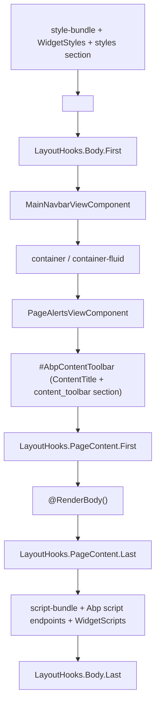
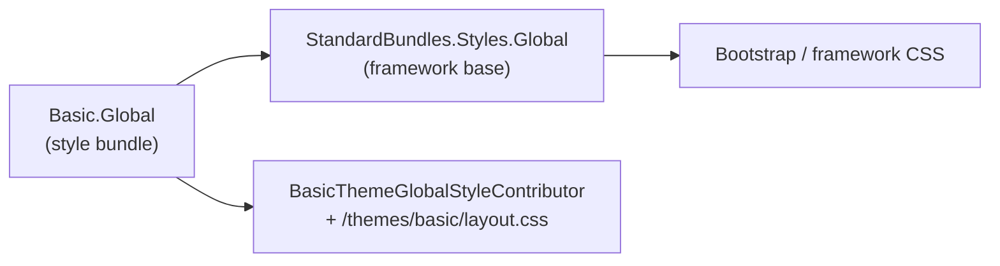
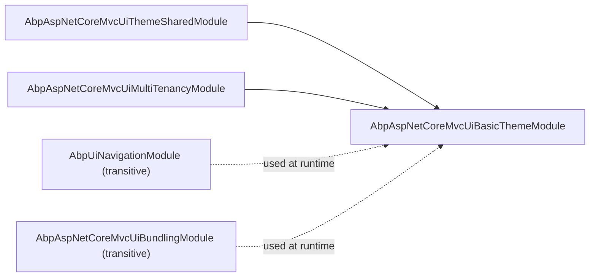

The Basic Theme is the reference theme that ships with ABP and is the default in most starter templates. It is a deliberately minimal Bootstrap-based theme that other themes (LeptonX Lite, LeptonX, commercial themes) build on top of — meaning every concept here is part of the public theming contract documented in [Themes overview](/themes/overview). This page walks the MVC variant module-by-module: the `AbpModule` class, the `ITheme` registration, bundle contributors, the application layout, and the view components that compose the navbar.

## Project layout

```text modules/basic-theme/src/Volo.Abp.AspNetCore.Mvc.UI.Theme.Basic/
AbpAspNetCoreMvcUiBasicThemeModule.cs
BasicTheme.cs
Bundling/
  BasicThemeBundles.cs
  BasicThemeGlobalScriptContributor.cs
  BasicThemeGlobalStyleContributor.cs
Themes/Basic/
  _ViewImports.cshtml
  Layouts/
    Application.cshtml
    Account.cshtml
    Empty.cshtml
  Components/
    Brand/{MainNavbarBrandViewComponent.cs,Default.cshtml}
    ContentTitle/{ContentTitleViewComponent.cs,Default.cshtml}
    MainNavbar/{MainNavbarViewComponent.cs,Default.cshtml}
    Menu/{MainNavbarMenuViewComponent.cs,Default.cshtml,_MenuItem.cshtml}
    PageAlerts/{PageAlertsViewComponent.cs,Default.cshtml}
    Toolbar/{MainNavbarToolbarViewComponent.cs,Default.cshtml,
            LanguageSwitch/{LanguageSwitchViewComponent.cs,...},
            UserMenu/{UserMenuViewComponent.cs,Default.cshtml}}
Toolbars/
  BasicThemeMainTopToolbarContributor.cs
Pages/  Views/  wwwroot/
```

## File inventory

| File / Folder                                  | Responsibility                                                                              |
| ---------------------------------------------- | ------------------------------------------------------------------------------------------- |
| `AbpAspNetCoreMvcUiBasicThemeModule.cs`        | `AbpModule` that registers the theme, bundles, toolbar contributor, and embedded VFS files. |
| `BasicTheme.cs`                                | `[ThemeName("Basic")] ITheme` that maps `StandardLayouts` → `.cshtml` paths.                |
| `Bundling/BasicThemeBundles.cs`                | Bundle key constants (`Basic.Global` for styles and scripts).                               |
| `Bundling/BasicThemeGlobalStyleContributor.cs` | Contributes `/themes/basic/layout.css` to the global style bundle.                          |
| `Bundling/BasicThemeGlobalScriptContributor.cs`| Contributes `/themes/basic/layout.js` to the global script bundle.                          |
| `Themes/Basic/Layouts/Application.cshtml`      | Main layout for authenticated/anonymous app pages.                                          |
| `Themes/Basic/Layouts/Account.cshtml`          | Layout for login/register/account pages.                                                    |
| `Themes/Basic/Layouts/Empty.cshtml`            | Bare layout used by error pages and full-screen flows.                                      |
| `Themes/Basic/Components/MainNavbar/*`         | Top navbar composition (brand + menu + toolbar).                                            |
| `Themes/Basic/Components/Menu/*`               | Renders the main `ApplicationMenu` from `IMenuManager`.                                     |
| `Themes/Basic/Components/Toolbar/*`            | Renders the main toolbar (language switch, user menu).                                      |
| `Themes/Basic/Components/PageAlerts/*`         | Renders flash alerts from the `IAlertManager`.                                              |
| `Toolbars/BasicThemeMainTopToolbarContributor.cs` | Adds language switch + user menu items to the main toolbar when active theme is Basic.   |

## The module class

`AbpAspNetCoreMvcUiBasicThemeModule` is the entry point. It depends on the shared theming module and the multi-tenancy UI module, registers the application part (so its view components / pages are discovered by MVC), adds the theme to `AbpThemingOptions`, registers the toolbar contributor, and defines the global bundles.

```csharp modules/basic-theme/src/Volo.Abp.AspNetCore.Mvc.UI.Theme.Basic/AbpAspNetCoreMvcUiBasicThemeModule.cs
[DependsOn(
    typeof(AbpAspNetCoreMvcUiThemeSharedModule),
    typeof(AbpAspNetCoreMvcUiMultiTenancyModule)
    )]
public class AbpAspNetCoreMvcUiBasicThemeModule : AbpModule
{
    public override void PreConfigureServices(ServiceConfigurationContext context)
    {
        PreConfigure<IMvcBuilder>(mvcBuilder =>
        {
            mvcBuilder.AddApplicationPartIfNotExists(typeof(AbpAspNetCoreMvcUiBasicThemeModule).Assembly);
        });
    }

    public override void ConfigureServices(ServiceConfigurationContext context)
    {
        Configure<AbpThemingOptions>(options =>
        {
            options.Themes.Add<BasicTheme>();

            if (options.DefaultThemeName == null)
            {
                options.DefaultThemeName = BasicTheme.Name;
            }
        });

        Configure<AbpVirtualFileSystemOptions>(options =>
        {
            options.FileSets.AddEmbedded<AbpAspNetCoreMvcUiBasicThemeModule>("Volo.Abp.AspNetCore.Mvc.UI.Theme.Basic");
        });

        Configure<AbpToolbarOptions>(options =>
        {
            options.Contributors.Add(new BasicThemeMainTopToolbarContributor());
        });

        Configure<AbpBundlingOptions>(options =>
        {
            options
                .StyleBundles
                .Add(BasicThemeBundles.Styles.Global, bundle =>
                {
                    bundle
                        .AddBaseBundles(StandardBundles.Styles.Global)
                        .AddContributors(typeof(BasicThemeGlobalStyleContributor));
                });

            options
                .ScriptBundles
                .Add(BasicThemeBundles.Scripts.Global, bundle =>
                {
                    bundle
                        .AddBaseBundles(StandardBundles.Scripts.Global)
                        .AddContributors(typeof(BasicThemeGlobalScriptContributor));
                });
        });
    }
}
```

Key invariants:

- `AddApplicationPartIfNotExists` is called from `PreConfigureServices` because MVC discovery needs the assembly registered before `ConfigureServices` runs in downstream modules.
- The bundle declaration uses `AddBaseBundles(StandardBundles.Styles.Global)` so it chains in the framework's base CSS before the theme's `layout.css`. Bundles are merged in order, so global resets stay first.
- `Configure<AbpVirtualFileSystemOptions>` registers the embedded `Themes/`, `wwwroot/`, `Pages/`, and `Views/` files into the VFS so consumer apps can override any single file by name without forking the theme.

## The `ITheme` implementation

```csharp modules/basic-theme/src/Volo.Abp.AspNetCore.Mvc.UI.Theme.Basic/BasicTheme.cs
[ThemeName(Name)]
public class BasicTheme : ITheme, ITransientDependency
{
    public const string Name = "Basic";

    public virtual string GetLayout(string name, bool fallbackToDefault = true)
    {
        switch (name)
        {
            case StandardLayouts.Application:
                return "~/Themes/Basic/Layouts/Application.cshtml";
            case StandardLayouts.Account:
                return "~/Themes/Basic/Layouts/Account.cshtml";
            case StandardLayouts.Empty:
                return "~/Themes/Basic/Layouts/Empty.cshtml";
            default:
                return fallbackToDefault ? "~/Themes/Basic/Layouts/Application.cshtml" : null;
        }
    }
}
```

The `~/Themes/...` paths are resolved through the virtual file system, so the layouts can be overridden in the consuming app by placing a file at the same relative path.

## Layout composition

The Application layout is the most-used layout. Its structure is:



The relevant excerpt:

```cshtml modules/basic-theme/src/Volo.Abp.AspNetCore.Mvc.UI.Theme.Basic/Themes/Basic/Layouts/Application.cshtml
<body class="abp-application-layout @rtl">
    @await Component.InvokeLayoutHookAsync(LayoutHooks.Body.First, StandardLayouts.Application)

    @(await Component.InvokeAsync<MainNavbarViewComponent>())

    <div class="@containerClass">
        @(await Component.InvokeAsync<PageAlertsViewComponent>())
        <div id="AbpContentToolbar">
            <div class="row mb-2">
                @(await Component.InvokeAsync<ContentTitleViewComponent>())
                <div class="col">
                    <div class="text-end">
                        @await RenderSectionAsync("content_toolbar", false)
                    </div>
                </div>
            </div>
        </div>
        @await Component.InvokeLayoutHookAsync(LayoutHooks.PageContent.First, StandardLayouts.Application)
        @RenderBody()
        @await Component.InvokeLayoutHookAsync(LayoutHooks.PageContent.Last, StandardLayouts.Application)
    </div>

    <abp-script-bundle name="@BasicThemeBundles.Scripts.Global" />

    <script src="~/Abp/ApplicationLocalizationScript?cultureName=@CultureInfo.CurrentUICulture.Name"></script>
    <script src="~/Abp/ApplicationConfigurationScript"></script>
    <script src="~/Abp/ServiceProxyScript"></script>
```

A few notes on what this layout commits the host to:

- **RTL handling** — culture-derived `dir="rtl"` and an `rtl` class are applied automatically based on `CultureHelper.IsRtl`.
- **Layout hooks** — every position is exposed via `LayoutHooks.*` so other modules can append HTML without forking the layout. See `Volo.Abp.AspNetCore.Mvc.UI.Components.LayoutHook` for the hook contract.
- **Page title** — derived from `IPageLayout.Content.Title` and `IBrandingProvider.AppName`. The branding provider is configured in shared theming and is the single source of app name + logos.
- **Script endpoints** — the three `~/Abp/*Script` routes are served by `Volo.Abp.AspNetCore.Mvc` and provide localization strings, the current `ApplicationConfigurationDto`, and dynamic JS service proxies, respectively. See [HTTP client](/http) for proxy details.

## View components

The navbar is built from independently overridable view components, each pair `*ViewComponent.cs` + `Default.cshtml`. The two most important are the menu and the toolbar.

### Menu

```csharp modules/basic-theme/src/Volo.Abp.AspNetCore.Mvc.UI.Theme.Basic/Themes/Basic/Components/Menu/MainNavbarMenuViewComponent.cs
public class MainNavbarMenuViewComponent : AbpViewComponent
{
    protected IMenuManager MenuManager { get; }

    public MainNavbarMenuViewComponent(IMenuManager menuManager)
    {
        MenuManager = menuManager;
    }

    public virtual async Task<IViewComponentResult> InvokeAsync()
    {
        var menu = await MenuManager.GetMainMenuAsync();
        return View("~/Themes/Basic/Components/Menu/Default.cshtml", menu);
    }
}
```

The component is a one-liner: ask `IMenuManager` for the main menu, hand the `ApplicationMenu` to the view. The view in turn delegates each item to the partial `_MenuItem.cshtml`, which recursively renders sub-menus. The "main menu" is composed of all `IMenuContributor` outputs for the `AbpNavigationOptions.MainMenuNames` list — see [Menu contributors](/navigation/menu-contributors).

### Toolbar

```csharp modules/basic-theme/src/Volo.Abp.AspNetCore.Mvc.UI.Theme.Basic/Themes/Basic/Components/Toolbar/MainNavbarToolbarViewComponent.cs
public class MainNavbarToolbarViewComponent : AbpViewComponent
{
    protected IToolbarManager ToolbarManager { get; }

    public MainNavbarToolbarViewComponent(IToolbarManager toolbarManager)
    {
        ToolbarManager = toolbarManager;
    }

    public virtual async Task<IViewComponentResult> InvokeAsync()
    {
        var toolbar = await ToolbarManager.GetAsync(StandardToolbars.Main);
        return View("~/Themes/Basic/Components/Toolbar/Default.cshtml", toolbar);
    }
}
```

`IToolbarManager.GetAsync(StandardToolbars.Main)` walks `AbpToolbarOptions.Contributors` and returns the composed toolbar — the Basic Theme registers its own contributor below.

### Toolbar contributor

```csharp modules/basic-theme/src/Volo.Abp.AspNetCore.Mvc.UI.Theme.Basic/Toolbars/BasicThemeMainTopToolbarContributor.cs
public class BasicThemeMainTopToolbarContributor : IToolbarContributor
{
    public async Task ConfigureToolbarAsync(IToolbarConfigurationContext context)
    {
        if (context.Toolbar.Name != StandardToolbars.Main)
        {
            return;
        }

        if (!(context.Theme is BasicTheme))
        {
            return;
        }

        var languageProvider = context.ServiceProvider.GetService<ILanguageProvider>();

        //TODO: This duplicates GetLanguages() usage. Can we eleminate this?
        var languages = await languageProvider.GetLanguagesAsync();
        if (languages.Count > 1)
        {
            context.Toolbar.Items.Add(new ToolbarItem(typeof(LanguageSwitchViewComponent)));
        }

        if (context.ServiceProvider.GetRequiredService<ICurrentUser>().IsAuthenticated)
        {
            context.Toolbar.Items.Add(new ToolbarItem(typeof(UserMenuViewComponent)));
        }
    }
}
```

Note the dual guard: the contributor is registered globally, but is inert unless `context.Toolbar.Name == StandardToolbars.Main` **and** `context.Theme is BasicTheme`. Multiple theme modules can coexist in the same process safely.

## Other view components

| Component                       | Responsibility                                                                        |
| ------------------------------- | ------------------------------------------------------------------------------------- |
| `MainNavbarViewComponent`       | Top-level navbar that composes brand + menu + toolbar.                                |
| `MainNavbarBrandViewComponent`  | Renders logo/app name from `IBrandingProvider`.                                       |
| `ContentTitleViewComponent`     | Renders the page title and breadcrumbs from `IPageLayout`.                            |
| `PageAlertsViewComponent`       | Renders deferred alerts from `IAlertManager` (success / warning / error toasts).      |
| `LanguageSwitchViewComponent`   | Dropdown of available cultures, posts back via the language switch handler.           |
| `UserMenuViewComponent`         | Renders the user-menu items contributed via `IUserMenuContributor`.                   |

Each view component lives in its own folder with a `Default.cshtml` sibling. To override one in a downstream app, drop a file at the same VFS path and the embedded version is shadowed.

## Bundling — what ends up on the page

When `<abp-style-bundle name="Basic.Global" />` is rendered, the bundling system resolves a tree of bundles:



The script bundle is symmetric. In development each file is emitted as a separate `<link>`/`<script>` (configurable via `AbpBundlingOptions`); in production the bundler concatenates and minifies based on `IWebHostEnvironment.IsDevelopment()` and the bundle definitions.

<Tip>
To add app-specific CSS, register a custom `BundleContributor` and attach it to `Basic.Global` instead of inserting a `<link>` in your `_Layout.cshtml`. The contributor pattern keeps your additions inside the cache and minification pipeline.
</Tip>

## Static assets and overrides

The theme ships a `wwwroot/themes/basic/layout.css` and `layout.js`. These are embedded in the assembly via the VFS registration above, so:

- `app.UseStaticFiles()` in the host picks them up via the ABP-extended static file middleware backed by VFS.
- Replacing the file in the host `wwwroot/themes/basic/layout.css` shadows the embedded one — no theme fork required.
- Razor pages and view components are similarly overridable; the VFS lookup happens before the application part lookup.

## Branding

Branding is intentionally external to the theme. The layout reads `IBrandingProvider.AppName` and `MainNavbarBrandViewComponent` reads it for the logo. To rebrand:

```csharp
public class MyBrandingProvider : DefaultBrandingProvider
{
    public override string AppName => "Acme Corp";
}
```

…and register it as a singleton replacement in your host module. No theme code changes.

## Module dependency snapshot



`Volo.Abp.UI.Navigation` is reached transitively through `AbpAspNetCoreMvcUiThemeSharedModule`, which is why the menu view component can resolve `IMenuManager` without the Basic Theme declaring a direct dependency.

## Practical checklists

<AccordionGroup>
  <Accordion title="Override a single view component">
    1. Create a file in your host at the exact VFS path — e.g. `Themes/Basic/Components/Brand/Default.cshtml`.
    2. The VFS shadows the embedded copy. Restart the host (so the file is picked up); no rebuild of the theme assembly is needed.
    3. Optional: derive from `MainNavbarBrandViewComponent` and replace the registration in DI to change behaviour, not just markup.
  </Accordion>
  <Accordion title="Add a global stylesheet">
    1. Implement `BundleContributor` and add your CSS path to `context.Files`.
    2. In your host module: `Configure<AbpBundlingOptions>(o => o.StyleBundles.Configure(BasicThemeBundles.Styles.Global, b => b.AddContributors(typeof(MyContributor))));`
    3. The contributor joins the cache key so the change invalidates the minified output.
  </Accordion>
  <Accordion title="Hide the language switch">
    The toolbar items are added only when `languages.Count > 1`. If your app has a single language registered, the dropdown is automatically suppressed. To force-hide it, write a contributor that removes the item by predicate.
  </Accordion>
</AccordionGroup>

## See also

- [Themes overview](/themes/overview) — the contract the Basic Theme implements.
- [Navigation overview](/navigation/overview) — how `IMenuManager` composes the menu the navbar renders.
- [Menu contributors](/navigation/menu-contributors) — adding items to the main menu from your modules.
- [HTTP client](/http) — `ApplicationConfigurationScript` and `ServiceProxyScript` endpoints the layout emits.
- [Authorization](/authz) — `ICurrentUser` and permission checks used by the toolbar contributor.
