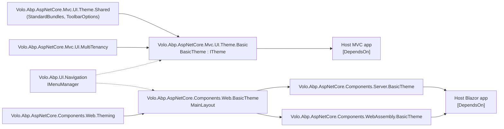

ABP treats the visual layer of an application as a swappable module. A small set of theming abstractions — `ITheme`, `IThemingOptions`, layout name constants, bundle contributors, view component slots — lives in shared infrastructure projects, and any number of "theme modules" plug into those abstractions to provide concrete HTML/CSS/JS. The reference implementation that ships in this repository is the **Basic Theme**, distributed across MVC, Blazor Server, Blazor WebAssembly, and MauiBlazor variants under `modules/basic-theme/`. Other themes (LeptonX Lite, commercial themes) follow exactly the same contract; this page is the map between the concept and the source.

## Where theming lives in the repo

Theming is split between three concerns:

1. **Shared base** — abstractions and standard layout/bundle constants used by every theme. For MVC this lives in `Volo.Abp.AspNetCore.Mvc.UI.Theme.Shared`; for Blazor in `Volo.Abp.AspNetCore.Components.Web.Theming`.
2. **Theme modules** — concrete `ITheme` registrations + layouts. The reference implementation is `modules/basic-theme/src/*`.
3. **Consumer module** — the host project depends on a theme module via `[DependsOn(...)]`. Switching themes is a one-line dependency change.

<Info>
The theming layer is intentionally thin. It owns layout selection and bundle plumbing; everything else (menus, toolbars, branding, layout hooks) lives in adjacent abstractions consumed by the theme. See [Navigation overview](/navigation/overview) for how menus reach a theme's main navbar.
</Info>

## File inventory — Basic Theme module

| Project                                                       | Purpose                                                                              |
| ------------------------------------------------------------- | ------------------------------------------------------------------------------------ |
| `Volo.Abp.AspNetCore.Mvc.UI.Theme.Basic`                      | MVC/Razor theme: `BasicTheme : ITheme`, `cshtml` layouts, view components, bundles.  |
| `Volo.Abp.AspNetCore.Components.Web.BasicTheme`               | Shared Blazor components/layout used by both Server and WebAssembly hosts.           |
| `Volo.Abp.AspNetCore.Components.Server.BasicTheme`            | Blazor Server host wiring for the Basic Theme.                                       |
| `Volo.Abp.AspNetCore.Components.WebAssembly.BasicTheme`       | Blazor WebAssembly host wiring for the Basic Theme.                                  |
| `Volo.Abp.BasicTheme.Installer`                               | NuGet installer project used by the CLI to add the theme to existing solutions.      |

Source: `modules/basic-theme/src/` (listed via `ls modules/basic-theme/src/`).

## The `ITheme` contract

Every theme module ships at least one class decorated with `[ThemeName(...)]` and registered with `AbpThemingOptions.Themes`. The MVC implementation maps a `StandardLayouts` constant to a `.cshtml` virtual path:

```csharp modules/basic-theme/src/Volo.Abp.AspNetCore.Mvc.UI.Theme.Basic/BasicTheme.cs
[ThemeName(Name)]
public class BasicTheme : ITheme, ITransientDependency
{
    public const string Name = "Basic";

    public virtual string GetLayout(string name, bool fallbackToDefault = true)
    {
        switch (name)
        {
            case StandardLayouts.Application:
                return "~/Themes/Basic/Layouts/Application.cshtml";
            case StandardLayouts.Account:
                return "~/Themes/Basic/Layouts/Account.cshtml";
            case StandardLayouts.Empty:
                return "~/Themes/Basic/Layouts/Empty.cshtml";
            default:
                return fallbackToDefault ? "~/Themes/Basic/Layouts/Application.cshtml" : null;
        }
    }
}
```

The Blazor variant returns `Type` instead of a virtual path:

```csharp modules/basic-theme/src/Volo.Abp.AspNetCore.Components.Web.BasicTheme/BasicTheme.cs
[ThemeName(Name)]
public class BasicTheme : ITheme, ITransientDependency
{
    public const string Name = "Basic";

    public virtual Type GetLayout(string name, bool fallbackToDefault = true)
    {
        switch (name)
        {
            case StandardLayouts.Application:
            case StandardLayouts.Account:
            case StandardLayouts.Empty:
                return typeof(MainLayout);
            default:
                return fallbackToDefault ? typeof(MainLayout) : typeof(NullLayout);
        }
    }
}
```

Both implementations are `ITransientDependency`, so the consuming module just registers them via `AbpThemingOptions`.

## Registering a theme

The Basic Theme registers itself in `ConfigureServices`. Note the defensive `DefaultThemeName == null` pattern — a theme module is polite and only becomes the default when no other theme has claimed the slot:

```csharp modules/basic-theme/src/Volo.Abp.AspNetCore.Mvc.UI.Theme.Basic/AbpAspNetCoreMvcUIBasicThemeModule.cs
Configure<AbpThemingOptions>(options =>
{
    options.Themes.Add<BasicTheme>();

    if (options.DefaultThemeName == null)
    {
        options.DefaultThemeName = BasicTheme.Name;
    }
});
```

The Blazor module mirrors the same pattern:

```csharp modules/basic-theme/src/Volo.Abp.AspNetCore.Components.Web.BasicTheme/AbpAspNetCoreComponentsWebBasicThemeModule.cs
Configure<AbpThemingOptions>(options =>
{
    options.Themes.Add<BasicTheme>();

    if (options.DefaultThemeName == null)
    {
        options.DefaultThemeName = BasicTheme.Name;
    }
});
```

<Tip>
To switch themes in a downstream app, the host project drops the Basic Theme dependency and adds the new theme's module instead. If both are referenced, set `options.DefaultThemeName` explicitly in the host module's `PreConfigureServices` so the registration order does not decide the outcome.
</Tip>

## Theme module dependency graph



Arrows reflect `[DependsOn(...)]` attributes on the module classes. Dotted arrows show runtime consumption (e.g. the theme's view components inject `IMenuManager`).

## Bundle contributors

Themes ship CSS/JS through ABP's bundling system rather than `<link>`/`<script>` tags. Each theme defines bundle keys, then registers contributors that base off the standard bundles:

```csharp modules/basic-theme/src/Volo.Abp.AspNetCore.Mvc.UI.Theme.Basic/Bundling/BasicThemeBundles.cs
public static class BasicThemeBundles
{
    public static class Styles  { public const string Global = "Basic.Global"; }
    public static class Scripts { public const string Global = "Basic.Global"; }
}
```

```csharp modules/basic-theme/src/Volo.Abp.AspNetCore.Mvc.UI.Theme.Basic/AbpAspNetCoreMvcUIBasicThemeModule.cs
Configure<AbpBundlingOptions>(options =>
{
    options.StyleBundles.Add(BasicThemeBundles.Styles.Global, bundle =>
    {
        bundle
            .AddBaseBundles(StandardBundles.Styles.Global)
            .AddContributors(typeof(BasicThemeGlobalStyleContributor));
    });

    options.ScriptBundles.Add(BasicThemeBundles.Scripts.Global, bundle =>
    {
        bundle
            .AddBaseBundles(StandardBundles.Scripts.Global)
            .AddContributors(typeof(BasicThemeGlobalScriptContributor));
    });
});
```

The contributors are tiny — each just contributes one file:

```csharp modules/basic-theme/src/Volo.Abp.AspNetCore.Mvc.UI.Theme.Basic/Bundling/BasicThemeGlobalStyleContributor.cs
public class BasicThemeGlobalStyleContributor : BundleContributor
{
    public override void ConfigureBundle(BundleConfigurationContext context)
    {
        context.Files.Add("/themes/basic/layout.css");
    }
}
```

```csharp modules/basic-theme/src/Volo.Abp.AspNetCore.Mvc.UI.Theme.Basic/Bundling/BasicThemeGlobalScriptContributor.cs
public class BasicThemeGlobalScriptContributor : BundleContributor
{
    public override void ConfigureBundle(BundleConfigurationContext context)
    {
        context.Files.Add("/themes/basic/layout.js");
    }
}
```

The files themselves are static assets shipped via embedded VFS (`wwwroot/themes/basic/...`). `AddBaseBundles` chains in the standard layout bundle, so the theme only contributes its own incremental files.

## Layout composition

The Basic Theme layout demonstrates the composition pattern most themes follow — the `<head>` and `<body>` are bracketed by layout hooks, a main navbar view component renders branding + menu + toolbar, and bundles emit CSS and JS via tag helpers:

```cshtml modules/basic-theme/src/Volo.Abp.AspNetCore.Mvc.UI.Theme.Basic/Themes/Basic/Layouts/Application.cshtml
<abp-style-bundle name="@BasicThemeBundles.Styles.Global" />
@await Component.InvokeAsync(typeof(WidgetStylesViewComponent))
@await RenderSectionAsync("styles", false)
@await Component.InvokeLayoutHookAsync(LayoutHooks.Head.Last, StandardLayouts.Application)
...
@(await Component.InvokeAsync<MainNavbarViewComponent>())

<div class="@containerClass">
    @(await Component.InvokeAsync<PageAlertsViewComponent>())
    ...
    @await Component.InvokeLayoutHookAsync(LayoutHooks.PageContent.First, StandardLayouts.Application)
    @RenderBody()
    @await Component.InvokeLayoutHookAsync(LayoutHooks.PageContent.Last, StandardLayouts.Application)
</div>

<abp-script-bundle name="@BasicThemeBundles.Scripts.Global" />
<script src="~/Abp/ApplicationLocalizationScript?cultureName=@CultureInfo.CurrentUICulture.Name"></script>
<script src="~/Abp/ApplicationConfigurationScript"></script>
<script src="~/Abp/ServiceProxyScript"></script>
```

The three `~/Abp/*Script` URLs are not part of the theme — they come from the MVC client integration. See the [HTTP client](/http) section for how `ApplicationConfigurationScript` is produced.

## Toolbar contributors

Themes do not hard-code login/logout/language buttons. Instead they participate in `AbpToolbarOptions` via `IToolbarContributor` and let other modules add items:

```csharp modules/basic-theme/src/Volo.Abp.AspNetCore.Mvc.UI.Theme.Basic/Toolbars/BasicThemeMainTopToolbarContributor.cs
public class BasicThemeMainTopToolbarContributor : IToolbarContributor
{
    public async Task ConfigureToolbarAsync(IToolbarConfigurationContext context)
    {
        if (context.Toolbar.Name != StandardToolbars.Main) return;
        if (!(context.Theme is BasicTheme)) return;

        var languageProvider = context.ServiceProvider.GetService<ILanguageProvider>();
        var languages = await languageProvider.GetLanguagesAsync();
        if (languages.Count > 1)
        {
            context.Toolbar.Items.Add(new ToolbarItem(typeof(LanguageSwitchViewComponent)));
        }

        if (context.ServiceProvider.GetRequiredService<ICurrentUser>().IsAuthenticated)
        {
            context.Toolbar.Items.Add(new ToolbarItem(typeof(UserMenuViewComponent)));
        }
    }
}
```

The pattern — guard on `Toolbar.Name` and `context.Theme is XTheme` — keeps the contributor inert when a different theme is active, so multiple theme modules can coexist in the DI container.

<Note>
Contributors check authentication via `ICurrentUser.IsAuthenticated`, not via direct claims inspection. See [Authorization](/authz) for the unified identity surface.
</Note>

## Navigation and menus inside the theme

Themes don't define the menu — they render it. `MainNavbarMenuViewComponent` injects `IMenuManager` and asks for the main menu:

```csharp modules/basic-theme/src/Volo.Abp.AspNetCore.Mvc.UI.Theme.Basic/Themes/Basic/Components/Menu/MainNavbarMenuViewComponent.cs
public class MainNavbarMenuViewComponent : AbpViewComponent
{
    protected IMenuManager MenuManager { get; }

    public MainNavbarMenuViewComponent(IMenuManager menuManager)
    {
        MenuManager = menuManager;
    }

    public virtual async Task<IViewComponentResult> InvokeAsync()
    {
        var menu = await MenuManager.GetMainMenuAsync();
        return View("~/Themes/Basic/Components/Menu/Default.cshtml", menu);
    }
}
```

This is the canonical seam: theme renders, navigation module owns the data, application modules contribute menu items via `IMenuContributor`. See [Navigation overview](/navigation/overview) and [Menu contributors](/navigation/menu-contributors).

## The Blazor side: navigation extension

The Blazor Basic Theme exposes a small helper that lets a menu item carry a Blazor component reference in its `CustomData`:

```csharp modules/basic-theme/src/Volo.Abp.AspNetCore.Components.Web.BasicTheme/Navigation/BasicThemeNavigationExtensions.cs
public static class BasicThemeNavigationExtensions
{
    public const string CustomDataComponentKey = "BasicTheme.CustomComponent";

    public static ApplicationMenuItem UseComponent(this ApplicationMenuItem applicationMenuItem, Type componentType)
    {
        return applicationMenuItem.WithCustomData(CustomDataComponentKey, componentType);
    }

    [CanBeNull]
    public static Type GetComponentTypeOrDefault(this ApplicationMenuItem applicationMenuItem)
    {
        if (applicationMenuItem.CustomData.TryGetValue(CustomDataComponentKey, out object componentType))
        {
            return componentType as Type;
        }

        return default;
    }
}
```

It is the Blazor equivalent of the MVC `Url` property — the layout reads it back and renders the component when the user clicks the menu item.

## Module dependency summary

| Theme module                                                 | `[DependsOn(...)]`                                                                                                                         |
| ------------------------------------------------------------ | ------------------------------------------------------------------------------------------------------------------------------------------ |
| `AbpAspNetCoreMvcUiBasicThemeModule`                         | `AbpAspNetCoreMvcUiThemeSharedModule`, `AbpAspNetCoreMvcUiMultiTenancyModule`                                                              |
| `AbpAspNetCoreComponentsWebBasicThemeModule`                 | `AbpAspNetCoreComponentsWebThemingModule`                                                                                                  |
| `AbpAspNetCoreMvcUiThemeSharedModule`                        | `AbpUiNavigationModule`, bundle/toolbar/branding infrastructure                                                                            |

The dotted line is important: a theme depends on shared theming, which itself depends on `Volo.Abp.UI.Navigation`. So pulling in a theme transitively gives you the menu manager registered in DI.

## Building your own theme

The mechanical recipe:

<Steps>
  <Step title="Create the module project">
    Reference `Volo.Abp.AspNetCore.Mvc.UI.Theme.Shared` (MVC) or `Volo.Abp.AspNetCore.Components.Web.Theming` (Blazor).
  </Step>
  <Step title="Implement ITheme">
    Add `[ThemeName("MyTheme")]` and return your layouts. Mark the class `ITransientDependency` so DI picks it up automatically.
  </Step>
  <Step title="Register in AbpThemingOptions">
    Inside `ConfigureServices`, call `options.Themes.Add<MyTheme>()` and conditionally set `DefaultThemeName`.
  </Step>
  <Step title="Ship layout assets">
    Use embedded VFS (`AbpVirtualFileSystemOptions.FileSets.AddEmbedded<...>(...)`) so layouts and static files travel with the assembly.
  </Step>
  <Step title="Add bundle contributors">
    Define your bundle keys, then `AddBaseBundles(StandardBundles.*.Global)` and contribute your own files.
  </Step>
  <Step title="Render the menu and toolbar">
    Inject `IMenuManager` and `IToolbarManager` in your view components — do not parse navigation yourself.
  </Step>
</Steps>

<Check>
A correctly built theme should be substitutable for the Basic Theme by changing exactly one `[DependsOn]` line. If your layouts, view components, and bundle contributors all consume only the shared abstractions, you have the contract right.
</Check>

## See also

- [Basic Theme module deep dive](/themes/basic-theme-module) — every view component, layout, and bundle in the reference theme.
- [Navigation overview](/navigation/overview) — `IMenuManager`, `ApplicationMenu`, contributor pipeline.
- [Menu contributors](/navigation/menu-contributors) — how feature modules add items to the navbar a theme renders.
- [HTTP client](/http) — `~/Abp/ApplicationConfigurationScript` and the proxy-script endpoints rendered by the layout.
- [Authorization](/authz) — `ICurrentUser` and permission checks used by toolbar contributors.
