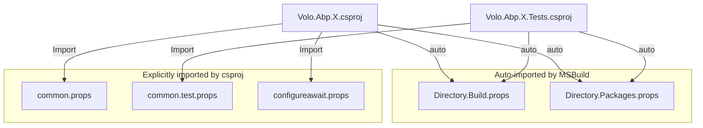

The ABP repository keeps over 400 csproj files in sync with five small XML files at the root. `Directory.Build.props` and `Directory.Packages.props` are auto-imported by MSBuild for every project. The other three — `common.props`, `common.test.props`, and `configureawait.props` — are explicit `<Import>`s in the project files that opt into the framework's NuGet metadata, test conventions, and async-cleanup weaver. This page walks each file, identifies every property it sets, and shows how a typical csproj composes them.

## Inventory

<Files>
```
abp/
├── Directory.Build.props          # auto-imported; defines IsTestProject + coverlet
├── Directory.Packages.props       # auto-imported; central PackageVersion list
├── common.props                   # explicit import; NuGet metadata + Version
├── common.test.props              # explicit import; LangVersion + GenerateRuntimeConfig
├── configureawait.props           # explicit import; ConfigureAwait.Fody on Release
├── NuGet.Config                   # restore feeds (nuget.org only)
├── global.json                    # SDK pin: 8.0.100, rollForward latestFeature
└── NuGet.md                       # PackageReadmeFile content embedded in every .nupkg
```
</Files>



## `Directory.Build.props` — auto-import at the root

MSBuild walks up the directory tree from every csproj and merges the first `Directory.Build.props` it finds. ABP's version is small and specific:

```xml title="Directory.Build.props"
<Project>
  <PropertyGroup>
    <IsTestProject Condition="$(MSBuildProjectFullPath.Contains('test')) and ($(MSBuildProjectName.EndsWith('.Tests')) or $(MSBuildProjectName.EndsWith('.TestBase')))">true</IsTestProject>
  </PropertyGroup>

  <ItemGroup>
    <PackageReference Condition="'$(IsTestProject)' == 'true'" Include="coverlet.collector">
        <PrivateAssets>all</PrivateAssets>
        <IncludeAssets>runtime; build; native; contentfiles; analyzers</IncludeAssets>
    </PackageReference>
  </ItemGroup>

</Project>
```

It does two things:

<CardGroup cols={2}>
  <Card title="Defines IsTestProject" icon="vial">
    A project is a test project iff its full path contains `test` *and* its name ends with `.Tests` or `.TestBase`. This double-check stops a folder named `tested-something` under `framework/src/` from accidentally tripping the flag.
  </Card>
  <Card title="Injects coverlet.collector" icon="syringe">
    Every test project automatically gets `coverlet.collector`, with `PrivateAssets="all"` so it doesn't propagate to consumers. That is what makes `dotnet test --collect:"XPlat Code Coverage"` produce output in [ops/build-and-pack](/ops/build-and-pack)'s `test-all.ps1`.
  </Card>
</CardGroup>

The `Include` list of `runtime; build; native; contentfiles; analyzers` is the conventional `IncludeAssets` for tool-package references — it imports the analyzers/targets that Coverlet ships without leaking them out the public API.

## `common.props` — NuGet metadata + version

This is the file that turns a project into a publishable NuGet package with ABP branding. It is *explicitly* imported by every shipping csproj — see [tooling/nuget-publish](/tooling/nuget-publish) for the import pattern.

```xml title="common.props"
<Project>
  <PropertyGroup>
    <LangVersion>latest</LangVersion>
    <Version>8.0.2</Version>
    <NoWarn>$(NoWarn);CS1591;CS0436</NoWarn>
    <PackageIconUrl>https://abp.io/assets/abp_nupkg.png</PackageIconUrl>
    <PackageProjectUrl>https://abp.io/</PackageProjectUrl>
    <PackageLicenseExpression>LGPL-3.0-only</PackageLicenseExpression>
    <RepositoryType>git</RepositoryType>
    <RepositoryUrl>https://github.com/abpframework/abp/</RepositoryUrl>
    <PackageReadmeFile>NuGet.md</PackageReadmeFile>
    <PackageTags>aspnetcore boilerplate framework web best-practices angular maui blazor mvc csharp webapp</PackageTags>
    <GenerateDocumentationFile>true</GenerateDocumentationFile>
    <!-- Include symbol files (*.pdb) in the built .nupkg -->
    <AllowedOutputExtensionsInPackageBuildOutputFolder>$(AllowedOutputExtensionsInPackageBuildOutputFolder);.pdb</AllowedOutputExtensionsInPackageBuildOutputFolder>
  </PropertyGroup>
  <ItemGroup>
    <None Include="..\..\NuGet.md" Pack="true" PackagePath="\"/>
  </ItemGroup>
  <ItemGroup>
    <PackageReference Include="Microsoft.SourceLink.GitHub">
      <PrivateAssets>all</PrivateAssets>
      <IncludeAssets>runtime; build; native; contentfiles; analyzers</IncludeAssets>
    </PackageReference>
  </ItemGroup>
  <ItemGroup Condition="'$(UsingMicrosoftNETSdkWeb)' != 'true' AND '$(UsingMicrosoftNETSdkRazor)' != 'true'">
    <None Remove="*.abppkg.analyze.json" />
    <Content Include="*.abppkg.analyze.json">
        <Pack>true</Pack>
        <PackagePath>content\</PackagePath>
    </Content>
  </ItemGroup>
  <ItemGroup>
    <None Remove="*.abppkg" />
    <Content Include="*.abppkg">
        <Pack>true</Pack>
        <PackagePath>content\</PackagePath>
    </Content>
  </ItemGroup>
  <ItemGroup Condition="$(AssemblyName.EndsWith('HttpApi.Client'))">
    <EmbeddedResource Include="**\*generate-proxy.json" />
    <Content Remove="**\*generate-proxy.json" />
  </ItemGroup>
</Project>
```

### Property reference

| Property | Value | Effect |
| --- | --- | --- |
| `LangVersion` | `latest` | Compiler accepts every feature the installed SDK supports. |
| `Version` | `8.0.2` | **The single source of truth for every shipping NuGet and npm package** — `publish-utils.js` reads this very element by string slice. |
| `NoWarn` | `+CS1591;CS0436` | Disables "missing XML doc comment" and "imported type conflicts" warnings. |
| `PackageIconUrl` | `https://abp.io/assets/abp_nupkg.png` | Hosted icon embedded in the `.nuspec`. |
| `PackageProjectUrl` | `https://abp.io/` | Shown on nuget.org's project page. |
| `PackageLicenseExpression` | `LGPL-3.0-only` | SPDX expression. ABP is LGPLv3. |
| `RepositoryType` / `RepositoryUrl` | `git` / `github.com/abpframework/abp/` | Used by NuGet client to link the package back to source. |
| `PackageReadmeFile` | `NuGet.md` | Inlined into the nuget.org listing. |
| `PackageTags` | `aspnetcore boilerplate framework web best-practices angular maui blazor mvc csharp webapp` | Searchable on nuget.org. |
| `GenerateDocumentationFile` | `true` | Produces the XML doc next to the DLL — required for IntelliSense in consuming IDEs. |
| `AllowedOutputExtensionsInPackageBuildOutputFolder` | `+ .pdb` | Includes the PDB in the `.nupkg` so SourceLink can find symbols. |

### Item-group reference

The four `<ItemGroup>`s do more interesting work:

<Steps>
  <Step title="Pack the NuGet.md readme">
    `<None Include="..\..\NuGet.md" Pack="true" PackagePath="\"/>` — every shipping package gets the same readme. The relative path `..\..\NuGet.md` assumes the csproj lives at `framework/src/X/` or `modules/.../src/X/`.
  </Step>
  <Step title="Reference Microsoft.SourceLink.GitHub">
    Embeds repo-relative source paths into the PDB so debuggers can step into ABP source straight from a consuming app. `PrivateAssets="all"` keeps SourceLink out of the consumer's transitive dep graph.
  </Step>
  <Step title="Pack *.abppkg and *.abppkg.analyze.json">
    These are ABP's own package-metadata files (see [source-code-tooling](/source-code-tooling)). They get copied into `content/` of the `.nupkg` so the `abp` CLI can read them. The `UsingMicrosoftNETSdkWeb`/`Razor` guard is because Web/Razor SDKs already include content via different conventions.
  </Step>
  <Step title="HttpApi.Client embedded proxies">
    When the assembly name ends with `HttpApi.Client`, every `*generate-proxy.json` under the project becomes an `EmbeddedResource` (not a `Content`) — the dynamic proxy generator reads them at runtime from the assembly manifest.
  </Step>
</Steps>

<Tip>
The `<Version>8.0.2</Version>` line is the *only* place release version strings change in the dotnet half of the repo. The npm half stays in sync because `npm/publish-utils.js` reads this exact tag, and `npm/lerna.json` is hand-updated by the maintainer to the same value during the publish PR.
</Tip>

## `configureawait.props` — Fody on Release

```xml title="configureawait.props"
<Project>
  <ItemGroup Condition="'$(Configuration)' == 'Release'">
      <PackageReference Include="ConfigureAwait.Fody" PrivateAssets="All" />
      <PackageReference Include="Fody">
        <PrivateAssets>All</PrivateAssets>
        <IncludeAssets>runtime; build; native; contentfiles; analyzers</IncludeAssets>
      </PackageReference>
  </ItemGroup>
</Project>
```

This is one of the most consequential lines of XML in the repository. When `Configuration == Release`, every `await` in every project that imports this file is rewritten to `.ConfigureAwait(false)` by Fody. Two follow-ons:

<CardGroup cols={2}>
  <Card title="Debug builds preserve sync context" icon="bug">
    In Debug, `ConfigureAwait.Fody` is *not* referenced — debugging keeps the original sync-context behavior so breakpoints behave intuitively in UI scenarios.
  </Card>
  <Card title="Don't hand-write .ConfigureAwait" icon="ban">
    Hand-written `ConfigureAwait(false)` calls are routinely removed during code review. The codebase trusts Fody. See [ops/contributing](/ops/contributing).
  </Card>
</CardGroup>

For Fody to actually run, projects also need a `FodyWeavers.xml` — those exist in the test-base projects and a handful of shipping projects (e.g. `framework/src/Volo.Abp.TestBase/FodyWeavers.xml`).

## `common.test.props` — the test counterpart

Test projects use a simpler set of properties:

```xml title="common.test.props"
<Project>
  <PropertyGroup>
    <LangVersion>latest</LangVersion>
    <NoWarn>$(NoWarn);CS1591;CS0436</NoWarn>
    <GenerateRuntimeConfigurationFiles>true</GenerateRuntimeConfigurationFiles>
    <GenerateAssemblyConfigurationAttribute>false</GenerateAssemblyConfigurationAttribute>
    <GenerateAssemblyCompanyAttribute>false</GenerateAssemblyCompanyAttribute>
    <GenerateAssemblyProductAttribute>false</GenerateAssemblyProductAttribute>
  </PropertyGroup>
</Project>
```

| Property | Why |
| --- | --- |
| `LangVersion=latest` / `NoWarn` | Mirrors `common.props`. |
| `GenerateRuntimeConfigurationFiles=true` | Produces `*.runtimeconfig.json` so test hosts can find shared frameworks correctly when running via `dotnet test`. |
| `GenerateAssemblyConfigurationAttribute=false` | Test DLLs don't need `[AssemblyConfiguration("Debug")]`. |
| `GenerateAssemblyCompanyAttribute=false` | Avoids stamping "abp" as the Company on every test assembly. |
| `GenerateAssemblyProductAttribute=false` | Same, for Product. |

Test projects also do *not* import `common.props` — so they don't get a `<Version>`, don't ship to NuGet, and don't pack the readme.

## `Directory.Packages.props` — Central Package Management

The 171-line `Directory.Packages.props` enables MSBuild's Central Package Management feature: every `<PackageReference>` in every project specifies only the package id, and the version is resolved here.

```xml title="Directory.Packages.props (header)"
<Project>
  <PropertyGroup>
    <ManagePackageVersionsCentrally>true</ManagePackageVersionsCentrally>
  </PropertyGroup>
  <ItemGroup>
    <PackageVersion Include="AlibabaCloud.SDK.Dysmsapi20170525" Version="2.0.24" />
    <PackageVersion Include="aliyun-net-sdk-sts" Version="3.1.2" />
    <PackageVersion Include="Aliyun.OSS.SDK.NetCore" Version="2.13.0" />
    <PackageVersion Include="AsyncKeyedLock" Version="6.2.2" />
    <PackageVersion Include="Autofac" Version="8.0.0" />
    <PackageVersion Include="Autofac.Extensions.DependencyInjection" Version="9.0.0" />
    <PackageVersion Include="Autofac.Extras.DynamicProxy" Version="7.1.0" />
    <PackageVersion Include="AutoMapper" Version="12.0.1" />
    <PackageVersion Include="AWSSDK.S3" Version="3.7.300.2" />
    ...
```

The file contains 164 `<PackageVersion>` entries — every transitive dependency the framework cares about is pinned here. Highlights by family:

| Family | Pinned versions |
| --- | --- |
| Microsoft.AspNetCore.* | 8.0.0 |
| Microsoft.EntityFrameworkCore.* | 8.0.0 |
| Microsoft.Extensions.* | 8.0.0 |
| Autofac | 8.0.0 |
| AutoMapper | 12.0.1 |
| Castle.Core | 5.1.1 |
| OpenIddict.* | 5.0.0 |
| MongoDB.Driver | 2.22.0 |
| Newtonsoft.Json | 13.0.3 |
| Serilog | 3.1.1 / 8.0.0 (AspNetCore) |
| Hangfire.AspNetCore | 1.8.6 |
| Quartz | 3.7.0 |
| Polly | 8.2.0 |
| xunit | 2.6.1 |
| Shouldly | 4.2.1 |
| NSubstitute | 5.1.0 |
| Microsoft.NET.Test.Sdk | 17.8.0 |
| coverlet.collector | 6.0.0 |
| ConfigureAwait.Fody | 3.3.2 |
| Fody | 6.8.0 |

A typical csproj that consumes the central versions looks like:

```xml title="Volo.Abp.X.csproj (excerpt)"
<ItemGroup>
  <PackageReference Include="Autofac" />
  <PackageReference Include="Microsoft.Extensions.Hosting" />
</ItemGroup>
```

No `Version="…"` on the references — they resolve through `Directory.Packages.props`. That's why bumping an entry in `Directory.Packages.props` is a single-file change that ripples through hundreds of projects.

<Warning>
Test projects also use central versions. So adding a new test-only dependency means adding a `<PackageVersion>` to `Directory.Packages.props` *and* a `<PackageReference>` to the test csproj. The reference will fail to resolve until the central entry exists.
</Warning>

The `build-and-test.yml` workflow has `Directory.Packages.props` in its `paths:` trigger, so any change to this file re-runs CI even when no `.cs` file changed — see [ops/devops](/ops/devops).

## `NuGet.Config` and `global.json`

Two more files complete the configuration:

```xml title="NuGet.Config"
<?xml version="1.0" encoding="utf-8"?>
<configuration>
    <packageSources>
        <add key="nuget.org" value="https://api.nuget.org/v3/index.json" />
    </packageSources>
</configuration>
```

There are no private feeds for restore — everything resolves against nuget.org. This is the canonical setup for a fully open-source repo.

```json title="global.json"
{
  "sdk": {
    "version": "8.0.100",
    "rollForward": "latestFeature"
  }
}
```

`rollForward: latestFeature` means any 8.0.x feature-band SDK ≥ 8.0.100 is acceptable. CI sets `dotnet-version: 8.0.100` to match.

## How a typical csproj composes everything

A shipping framework project — say `Volo.Abp.TestBase` itself — wires up the props files explicitly:

```xml title="framework/src/Volo.Abp.TestBase/Volo.Abp.TestBase.csproj"
<Project Sdk="Microsoft.NET.Sdk">

  <Import Project="..\..\..\configureawait.props" />
  <Import Project="..\..\..\common.props" />

  <PropertyGroup>
    <TargetFrameworks>netstandard2.0;netstandard2.1;net8.0</TargetFrameworks>
    <Nullable>enable</Nullable>
    <WarningsAsErrors>Nullable</WarningsAsErrors>
    <AssemblyName>Volo.Abp.TestBase</AssemblyName>
    <PackageId>Volo.Abp.TestBase</PackageId>
    <AssetTargetFallback>$(AssetTargetFallback);portable-net45+win8+wp8+wpa81;</AssetTargetFallback>
    <GenerateAssemblyConfigurationAttribute>false</GenerateAssemblyConfigurationAttribute>
    <GenerateAssemblyCompanyAttribute>false</GenerateAssemblyCompanyAttribute>
    <GenerateAssemblyProductAttribute>false</GenerateAssemblyProductAttribute>
    <RootNamespace />
  </PropertyGroup>

  <ItemGroup>
    <ProjectReference Include="..\Volo.Abp.Core\Volo.Abp.Core.csproj" />
  </ItemGroup>

</Project>
```

A test project — `framework/test/AbpTestBase/AbpTestBase.csproj` — uses the test variant instead:

```xml title="framework/test/AbpTestBase/AbpTestBase.csproj"
<Project Sdk="Microsoft.NET.Sdk">

  <Import Project="..\..\..\common.test.props" />

  <PropertyGroup>
    <TargetFramework>net8.0</TargetFramework>
    <AssemblyName>AbpTestBase</AssemblyName>
    <PackageId>AbpTestBase</PackageId>
    <RootNamespace />
  </PropertyGroup>

  <ItemGroup>
    <ProjectReference Include="..\..\src\Volo.Abp.TestBase\Volo.Abp.TestBase.csproj" />
  </ItemGroup>

  <ItemGroup>
    <PackageReference Include="Microsoft.NET.Test.Sdk" />
    <PackageReference Include="NSubstitute" />
    <PackageReference Include="Shouldly" />
    <PackageReference Include="xunit" />
    <PackageReference Include="xunit.extensibility.execution" />
    <PackageReference Include="xunit.runner.visualstudio" />
  </ItemGroup>

</Project>
```

Note that the test csproj imports *only* `common.test.props` — it does not import `common.props` (no `<Version>`, no nuget metadata) and does not import `configureawait.props` (test code should keep the original async semantics for debuggability). `Directory.Build.props` is still applied automatically, which is what injects `coverlet.collector`.

## Summary: what each file owns

| File | Auto-imported? | Owns |
| --- | --- | --- |
| `Directory.Build.props` | Yes | `IsTestProject` heuristic, `coverlet.collector` injection |
| `Directory.Packages.props` | Yes | All 164 transitive `<PackageVersion>` pins, Central Package Management toggle |
| `common.props` | No (explicit) | Single-source `<Version>`, NuGet metadata, SourceLink, `.abppkg` packing, HttpApi.Client embedded proxies |
| `common.test.props` | No (explicit) | LangVersion + GenerateRuntimeConfigurationFiles, suppression of assembly attributes |
| `configureawait.props` | No (explicit) | `ConfigureAwait.Fody` weaver on Release only |
| `NuGet.Config` | Implicit | Restore feed list (nuget.org only) |
| `global.json` | Implicit | SDK pin (8.0.100, latestFeature roll-forward) |

## Related

- [tooling/nuget-publish](/tooling/nuget-publish) — how the `<Version>` in `common.props` reaches nuget.org.
- [tooling/npm-publish](/tooling/npm-publish) — how the same `<Version>` reaches npm via `publish-utils.js`.
- [ops/build-and-pack](/ops/build-and-pack) — the build scripts that consume these props.
- [ops/testing](/ops/testing) — the test projects that pick up `common.test.props`.
- [source-code-tooling](/source-code-tooling) — the role of the packed `*.abppkg` and `*.abppkg.analyze.json` files.
