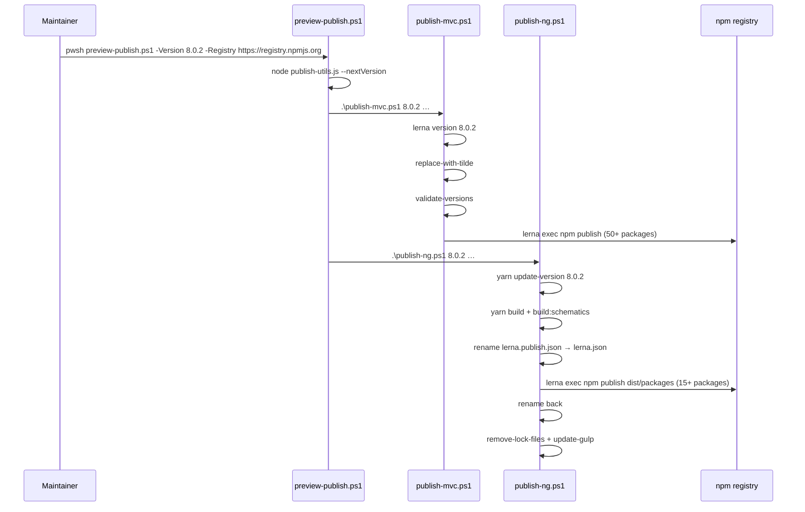

The npm half of an ABP release publishes two distinct package universes from one repository: the MVC/Bootstrap/jQuery wrappers under `npm/packs/`, and the Angular libraries under `npm/ng-packs/packages/`. Both live in the same source tree, both come out at the same version, but they use completely different tooling — Lerna 3 for the first, Nx (with a Lerna swap-in) for the second. The bridge between them is `npm/publish-utils.js`, which reads the `<Version>` element from the root `common.props` so the npm version always matches the NuGet version.

This page walks both pipelines, identifies the Lerna and Nx config files, and shows the umbrella PowerShell wrapper that runs them in sequence.

## Inventory

<Files>
```
abp/
├── common.props                          # <Version>8.0.2</Version>
├── npm/
│   ├── lerna.json                        # Lerna 3 root, packs/*
│   ├── package.json                      # devDeps: lerna, glob, fs-extra, semver
│   ├── publish-utils.js                  # reads common.props → version
│   ├── replace-with-tilde.js             # ^ → ~ on @abp/*
│   ├── update-gulp.js                    # bumps @abp/* in MVC templates' wwwroot
│   ├── preview-publish.ps1               # umbrella: mvc then ng
│   ├── publish-mvc.ps1                   # packs/* via Lerna
│   ├── publish-ng.ps1                    # ng-packs/* via Nx
│   ├── packs/                            # 50+ @abp/* MVC packages
│   │   ├── core/package.json             # @abp/core
│   │   ├── jquery/package.json           # @abp/jquery
│   │   └── ...                           # one folder per @abp/* package
│   ├── scripts/                          # TypeScript helpers for both halves
│   │   ├── package.json                  # "abp-npm-scripts"
│   │   ├── change-package-version.ts
│   │   ├── validate-versions.ts
│   │   └── remove-lock-files.ts
│   ├── ng-packs/
│   │   ├── lerna.json                    # version: 7.2.3, packs: packages/*
│   │   ├── lerna.publish.json            # version: 1.0.0, packs: dist/packages/*
│   │   ├── nx.json                       # defaultBase: dev
│   │   ├── package.json                  # @nx/angular workspace scripts
│   │   ├── packages/                     # @abp/ng.* sources (Angular libs)
│   │   └── scripts/
│   │       ├── publish.ts                # the real Nx publish entry
│   │       ├── build.ts
│   │       └── replace-with-preview.ts
│   └── verdaccio-containers/             # local registry rehearsal
```
</Files>

## The single version bridge

Both halves of the npm release call into `publish-utils.js`, which reads `common.props`:

```javascript title="npm/publish-utils.js"
const { program } = require('commander');
const fse = require('fs-extra');
const semverParse = require('semver/functions/parse');

program.version('0.0.1');
program.option('-n, --nextVersion', 'version in common.props');
program.option('-pr, --prerelease', 'whether version is prerelease');
program.option('-cv, --customVersion <customVersion>', 'set exact version');

program.parse(process.argv);

if (program.nextVersion) console.log(getVersion());

if (program.prerelease)
  console.log(!!semverParse(getVersion()).prerelease?.length);

function getVersion() {
  if (program.customVersion) return program.customVersion;
  const commonProps = fse.readFileSync('../common.props').toString();
  const versionTag = '<Version>';
  const versionEndTag = '</Version>';
  const first = commonProps.indexOf(versionTag) + versionTag.length;
  const last = commonProps.indexOf(versionEndTag);
  return commonProps.substring(first, last);
}
```

The string-slice is intentional — no XML parser is pulled in, no schema validation is done. Whatever sits between `<Version>` and `</Version>` is treated as the version. That keeps the helper trivially fast and means it never lags behind future MSBuild XML quirks.

The two CLI flags:

| Flag | Output |
| --- | --- |
| `--nextVersion` | The current version string from `common.props` (or the `--customVersion` override). |
| `--prerelease` | `"true"` or `"false"` based on whether `semver.parse(version).prerelease.length > 0`. |

Both `publish-mvc.ps1` and `publish-ng.ps1` shell out to this script to decide their defaults — see [npm/build-scripts](/npm/build-scripts) and [ops/build-and-pack](/ops/build-and-pack) for the call sites.

## The MVC half: Lerna 3 over `npm/packs/`

### Lerna root configuration

```json title="npm/lerna.json"
{
  "version": "8.0.2",
  "packages": [
    "packs/*"
  ],
  "npmClient": "yarn",
  "lerna": "3.18.4"
}
```

This is a *fixed-version* (not independent) Lerna workspace: every `packs/*/package.json` shares the same `8.0.2`. The `lerna version $Version` step in `publish-mvc.ps1` (below) rewrites every package's `package.json` in lockstep.

The 50+ packages under `npm/packs/` cover the MVC UI layer:

| Folder | Published as |
| --- | --- |
| `core/` | `@abp/core` |
| `utils/` | `@abp/utils` |
| `jquery/` | `@abp/jquery` |
| `bootstrap/` | `@abp/bootstrap` |
| `bootstrap-datepicker/` | `@abp/bootstrap-datepicker` |
| `datatables.net/` | `@abp/datatables.net` |
| `aspnetcore.mvc.ui/` | `@abp/aspnetcore.mvc.ui` |
| `aspnetcore.mvc.ui.theme.shared/` | `@abp/aspnetcore.mvc.ui.theme.shared` |
| `chart.js/` | `@abp/chart.js` |
| `signalr/` | `@abp/signalr` |
| ... | (50+ more, one per third-party JS lib ABP wraps) |

A typical `package.json` looks like:

```json title="npm/packs/core/package.json"
{
  "version": "8.0.2",
  "name": "@abp/core",
  "repository": {
    "type": "git",
    "url": "https://github.com/abpframework/abp.git",
    "directory": "npm/packs/core"
  },
  "publishConfig": {
    "access": "public"
  },
  "dependencies": {
    "@abp/utils": "~8.0.2"
  },
  ...
}
```

The `~8.0.2` (tilde, not caret) is the result of `replace-with-tilde.js` — see below.

### `publish-mvc.ps1` — the Lerna publish

```powershell title="npm/publish-mvc.ps1 (command list)"
$PacksPublishCommand = "npm run lerna -- exec 'npm publish --registry $Registry'"

$IsPrerelease = $(node publish-utils.js --prerelease --customVersion $Version) -eq "true";

if ($IsPrerelease) {
  $PacksPublishCommand = $PacksPublishCommand.Substring(0, $PacksPublishCommand.Length - 1) + " --tag next'"
}

$commands = (
  "npm run lerna -- version $Version --yes --no-commit-hooks --no-git-tag-version --no-push --force-publish",
  "yarn replace-with-tilde",
  "cd scripts",
  "yarn install",
  "yarn validate-versions --compareVersion $Version --path ../packs",
  "cd ..",
  $PacksPublishCommand
)
```

Reading the command array:

<Steps>
  <Step title="lerna version $Version">
    Lerna rewrites every `packs/*/package.json` to `$Version`. The flags strip every git side-effect: `--no-commit-hooks`, `--no-git-tag-version`, `--no-push`, and `--force-publish` (so every package is treated as changed even when its source files were untouched). The `--yes` skips the interactive confirmation.
  </Step>
  <Step title="yarn replace-with-tilde">
    Runs `replace-with-tilde.js`. Every `@abp/*` dependency that Lerna wrote with a `^` prefix is rewritten to `~`:
    
    ```javascript title="npm/replace-with-tilde.js"
    function replace(filePath) {
      const pkg = fse.readJsonSync(filePath);
      const { dependencies } = pkg;
      if (!dependencies) return;
      Object.keys(dependencies).forEach((key) => {
        if (key.includes("@abp/")) {
          dependencies[key] = dependencies[key].replace("^", "~");
        }
      });
      fse.writeJsonSync(filePath, { ...pkg, dependencies }, { spaces: 2 });
    }
    ```
    
    This pins all `@abp/*` siblings to patch-band — important when the next release introduces breaking changes in a minor bump.
  </Step>
  <Step title="cd scripts && yarn install">
    Drops into `npm/scripts/` (a TypeScript project independent of Lerna) and resolves its deps.
  </Step>
  <Step title="yarn validate-versions">
    Runs `validate-versions.ts`, which walks every `../packs/*/package.json` and asserts that every `@abp/*` dependency matches `$Version` exactly. If `replace-with-tilde` missed something, this fails loudly *before* publishing.
  </Step>
  <Step title="cd ..">
    Back to `npm/`.
  </Step>
  <Step title="npm run lerna -- exec 'npm publish --registry …'">
    The actual publish. Lerna executes one `npm publish` per package against the chosen registry. If `$IsPrerelease`, the command is rewritten to append `--tag next` inside the single-quoted argument.
  </Step>
</Steps>

The whole loop is wrapped in a `foreach` that times each step and bails on any non-zero exit (except for the `cd …` lines, which don't reset `$LASTEXITCODE`):

```powershell title="npm/publish-mvc.ps1 (loop)"
foreach ($command in $commands) {
  $timer = [System.Diagnostics.Stopwatch]::StartNew()
  Write-Host $command
  Invoke-Expression $command
  if ($LASTEXITCODE -ne '0' -And $command -notlike '*cd *') {
    Write-Host ("Process failed! " + $command)
    Set-Location $RootFolder
    exit $LASTEXITCODE
  }
  $timer.Stop()
  Write-Output "$command command took $($timer.Elapsed)"
}
```

```mermaid
flowchart TD
  V[publish-utils.js<br/>reads common.props] -->|version| L[lerna version $Version]
  L -->|writes every package.json| P[packs/*/package.json<br/>now 8.0.2]
  P --> T[replace-with-tilde.js]
  T -->|^ → ~| P2[packs/*/package.json<br/>@abp/* deps tilde-pinned]
  P2 --> VV[scripts/validate-versions.ts]
  VV -->|all match $Version| LP[lerna exec npm publish]
  LP --> REG[npmjs.org or Verdaccio]
```

## The Angular half: Nx with a Lerna swap-in

The Angular libraries publish through a more elaborate dance because they need to be built first (TypeScript → Ivy JS) and the published artifacts are emitted to `dist/packages/` rather than the source tree.

### Two `lerna*.json` files

`ng-packs/` contains two Lerna manifests:

```json title="npm/ng-packs/lerna.json"
{
  "version": "7.2.3",
  "packages": [
    "packages/*"
  ],
  "npmClient": "yarn"
}
```

```json title="npm/ng-packs/lerna.publish.json"
{
  "version": "1.0.0",
  "packages": ["dist/packages/*"],
  "npmClient": "yarn"
}
```

The "active" `lerna.json` points at the source tree — that's what Nx's `affected` graph and the Angular CLI use during development. The `lerna.publish.json` points at the build output. During publish, `scripts/publish.ts` *renames* one to the other so Lerna sees the dist artifacts:

```typescript title="npm/ng-packs/scripts/publish.ts (excerpt)"
try {
    await fse.rename('../lerna.publish.json', '../lerna.json');

    let tag: string;
    if (program.preview) tag = 'preview';
    else if (semverParse(program.nextVersion).prerelease?.length) tag = 'next';

    await execa(
      'yarn',
      ['lerna', 'exec', '--', `"npm publish --registry ${registry}${tag ? ` --tag ${tag}` : ''}"`],
      {
        stdout: 'inherit',
        cwd: '../',
      },
    );

    await fse.rename('../lerna.json', '../lerna.publish.json');
  } catch (error) {
    // …roll back the rename in the error path…
    await fse.rename('../lerna.json', '../lerna.publish.json');
    process.exit(1);
  }
```

This rename-publish-rename sandwich is the simplest way to point Lerna at a different folder without forking Lerna's config schema. The catch block makes sure the rename rolls back even on failure, leaving the workspace in a clean state.

### `nx.json` — the Nx workspace

```json title="npm/ng-packs/nx.json (excerpt)"
{
  "affected": {
    "defaultBase": "dev"
  },
  "workspaceLayout": {
    "libsDir": "packages",
    "appsDir": ""
  },
  "cli": {
    "analytics": false
  },
  "defaultProject": "dev-app",
  ...
}
```

| Setting | Effect |
| --- | --- |
| `affected.defaultBase: dev` | `nx affected:*` compares against `dev` by default. The `angular.yml` workflow overrides this with `--base=remotes/origin/${{ github.base_ref }}` on PRs. |
| `workspaceLayout.libsDir: packages` | All publishable libs live under `packages/`. `apps/` contains the `dev-app` and Storybook hosts. |
| `defaultProject: dev-app` | `nx serve` boots the dev playground without an explicit project name. See [npm/dev-app](/npm/dev-app). |

### Packages under `ng-packs/packages/`

| Folder | Published as |
| --- | --- |
| `core/` | `@abp/ng.core` |
| `theme-shared/` | `@abp/ng.theme.shared` |
| `theme-basic/` | `@abp/ng.theme.basic` |
| `identity/` | `@abp/ng.identity` |
| `account/` | `@abp/ng.account` |
| `account-core/` | `@abp/ng.account.core` |
| `feature-management/` | `@abp/ng.feature-management` |
| `permission-management/` | `@abp/ng.permission-management` |
| `setting-management/` | `@abp/ng.setting-management` |
| `tenant-management/` | `@abp/ng.tenant-management` |
| `oauth/` | `@abp/ng.oauth` |
| `components/` | `@abp/ng.components` |
| `generators/` | `@abp/ng.generators` |
| `schematics/` | `@abp/ng.schematics` |

### `publish-ng.ps1` — the umbrella

```powershell title="npm/publish-ng.ps1 (command list)"
$UpdateNgPacksCommand = "yarn update-version $Version"
$NgPacksPublishCommand = "npm run publish-packages -- --nextVersion $Version --skipGit --registry $Registry --skipVersionValidation"
$UpdateGulpCommand = "yarn update-gulp --registry $Registry"

$IsPrerelease = $(node publish-utils.js --prerelease --customVersion $Version) -eq "true";

if ($IsPrerelease) {
  $UpdateGulpCommand += " --prerelease"
  $UpdateNgPacksCommand += " --prerelease"
}

$commands = (
  "cd ng-packs",
  "yarn install",
  $UpdateNgPacksCommand,
  "cd scripts",
  "yarn install",
  $NgPacksPublishCommand,
  "cd ../../",
  "cd scripts",
  "yarn remove-lock-files",
  "cd ..",
  $UpdateGulpCommand
)
```

The steps:

| # | Command | Action |
| --- | --- | --- |
| 1 | `cd ng-packs && yarn install` | Install Nx workspace dependencies. |
| 2 | `yarn update-version $Version` | Rewrite `lerna.version.json` and every `packages/*/package.json` to `$Version`. |
| 3 | `cd scripts && yarn install` | Enter the Nx publish helper at `ng-packs/scripts/`. |
| 4 | `npm run publish-packages -- --nextVersion $Version --skipGit --registry $Registry --skipVersionValidation` | Invokes `publish.ts`, which builds and runs the rename-publish-rename. |
| 5 | `cd ../../scripts && yarn remove-lock-files` | Runs `remove-lock-files.ts`. |
| 6 | `cd .. && yarn update-gulp --registry …` | Runs `update-gulp.js` against the MVC templates' `wwwroot/libs`. |

### Inside `publish.ts`

The actual publish entry has its own option parsing, build step, and publish loop:

```typescript title="npm/ng-packs/scripts/publish.ts (top)"
program
  .option(
    '-v, --nextVersion <version>',
    'next semantic version. Available versions: ["major", "minor", "patch", "premajor", "preminor", "prepatch", "prerelease", "or type a custom version"]',
  )
  .option('-r, --registry <registry>', 'target npm server registry')
  .option('-p, --preview', 'publishes with preview tag')
  .option('-sg, --skipGit', 'skips git push')
  .option('-sv, --skipVersionValidation', 'skips version validation');

(async () => {
  const oldVersion = fse.readJSONSync('../lerna.version.json').version;

  if (!program.nextVersion) {
    console.error('Please provide a version with --nextVersion attribute');
    process.exit(1);
  }

  const registry = program.registry || 'https://registry.npmjs.org';

  try {
    await fse.remove('../dist/packages');

    if (!program.skipVersionValidation) {
      await execa(
        'yarn',
        ['validate-versions', '--compareVersion', program.nextVersion,
         '--path', '../ng-packs/packages'],
        { stdout: 'inherit', cwd: '../../scripts' },
      );
    }

    if (program.preview) await replaceWithPreview(program.nextVersion);

    await execa('yarn', ['build', '--noInstall', '--skipNgcc'], { stdout: 'inherit' });
    await execa('yarn', ['build:schematics'], { stdout: 'inherit' });
  } catch (error) {
    console.error(error.stderr);
    console.error('\n\nAn error has occurred! Rolling back the changed package versions.');
    await updateVersion(oldVersion);
    process.exit(1);
  }
```

So the sequence inside `publish.ts` is:

1. Read the *previous* version from `lerna.version.json` so we can roll back on error.
2. Wipe `dist/packages/`.
3. Cross-validate versions against the cross-repo `scripts/validate-versions.ts`.
4. If `--preview`, rewrite versions with `-preview.X`.
5. `yarn build` (Nx run-many) and `yarn build:schematics`.
6. Rename `lerna.publish.json` → `lerna.json` and `lerna exec npm publish` against `dist/packages/*`.
7. Rename back.

The `--tag` logic mirrors `publish-mvc.ps1`: `preview` → tagged `preview`, prerelease → tagged `next`, stable → no tag (defaults to `latest`).

### `update-gulp.js` — keep MVC templates in sync

After Angular packages publish, the templates' `wwwroot/libs` still references old versions. `update-gulp.js` walks them and re-runs the gulp build with `ncu` to bump every `@abp/*`:

```javascript title="npm/update-gulp.js (excerpt)"
const updatePackages = (pkgJsonPath) => {
  try {
    const result = childProcess
      .execSync(
        `ncu "/^@abp.*$/" --packageFile ${pkgJsonPath} -u${
          program.prerelease ? ' --target newest' : ''
        } --registry ${program.registry}`
```

Then a per-folder gulp pass repopulates `wwwroot/libs`:

```javascript title="npm/update-gulp.js (excerpt)"
const gulp = (folderPath) => {
  if (
    !fse.existsSync(folderPath + 'gulpfile.js') ||
    !glob.sync(folderPath + '*.csproj').length
  ) {
    return;
  }

  try {
    fse.removeSync(`${folderPath}/wwwroot/libs`);
    execa.sync('yarn', ['install'], { cwd: folderPath, stdio: 'inherit' });
    execa.sync('yarn', ['gulp'], { cwd: folderPath, stdio: 'inherit' });
  } catch (error) {
    console.log('\x1b[31m', 'Error: ' + error.message);
  }
};
```

So the *MVC* templates also end up with refreshed JS assets even though the Angular publish triggered it.

## The umbrella: `preview-publish.ps1`

The script you actually invoke for a release rehearsal is:

```powershell title="npm/preview-publish.ps1"
param(
  [string]$Version,
  [string]$Registry
)
$commands = (
  ".\publish-mvc.ps1 $Version $Registry",
  ".\publish-ng.ps1 $Version $Registry"
);

$NextVersion = $(node publish-utils.js --nextVersion)
$RootFolder = (Get-Item -Path "./" -Verbose).FullName

if(-Not $Version) {
$Version = $NextVersion;
}

if(-Not $Registry) {
exit
}
```

Three guarantees:

<CardGroup cols={2}>
  <Card title="Version defaulting" icon="tag">
    If you omit `$Version`, it falls back to `<Version>` from `common.props` — keeping npm and NuGet in lockstep without any explicit coordination.
  </Card>
  <Card title="Registry is required" icon="server">
    Omitting `$Registry` exits silently. There is no default to nuget.org for npm — the maintainer must pass `https://registry.npmjs.org` (or a private Verdaccio URL) explicitly.
  </Card>
</CardGroup>

Order matters: MVC packages publish *first* because some Angular packages depend on them transitively through `@abp/utils` and `@abp/core` (the JS utility helpers used by both halves).

## End-to-end timeline



## Verdaccio rehearsal

For pre-release testing against a private registry, the repo ships a Docker Compose stack:

```
npm/verdaccio-containers/
├── README.md
├── docker-compose.yml
├── package.json
├── prepare.js
├── publish-packages/
└── serve-app/
```

The README walks the rehearsal:

> Removes the containers if worked before
> - Builds the containers
> - Runs the containers.
> The processes may take 30~ minutes.

It publishes the @abp/* packages to a Verdaccio container at `http://localhost:4873` and serves the Angular pro template that consumes them. The Angular app then connects to a real ASP.NET Core backend running on `localhost:44305`. This is the canonical way to validate a release candidate end-to-end *without* publishing to npmjs.org.

## Summary

| Concern | Where it lives |
| --- | --- |
| Source-of-truth version | `common.props` `<Version>` |
| Bridge to npm | `npm/publish-utils.js` |
| MVC packages | `npm/packs/*` + `npm/lerna.json` |
| MVC publish driver | `npm/publish-mvc.ps1` |
| Angular packages | `npm/ng-packs/packages/*` + `nx.json` |
| Angular publish driver | `npm/publish-ng.ps1` → `npm/ng-packs/scripts/publish.ts` |
| Cross-package validation | `npm/scripts/validate-versions.ts` |
| Tilde-pinning | `npm/replace-with-tilde.js` |
| Template asset refresh | `npm/update-gulp.js` |
| Local registry rehearsal | `npm/verdaccio-containers/` |

## Related

- [tooling/nuget-publish](/tooling/nuget-publish) — the NuGet pipeline that reads the same `<Version>`.
- [tooling/directory-build-props](/tooling/directory-build-props) — the props file where the version actually lives.
- [ops/build-and-pack](/ops/build-and-pack) — the umbrella PowerShell walk-through.
- [npm/build-scripts](/npm/build-scripts) — JavaScript-centric tour of the same scripts.
- [npm/dev-app](/npm/dev-app) — the Nx `dev-app` that exercises `ng-packs/packages` without publishing.
- [npm/aspnetcore-mvc-ui-packages](/npm/aspnetcore-mvc-ui-packages) — catalogue of the `@abp/*` MVC packages.
- [ops/devops](/ops/devops) — `publish-release.yml` and `update-versions.yml` that bracket this pipeline.
