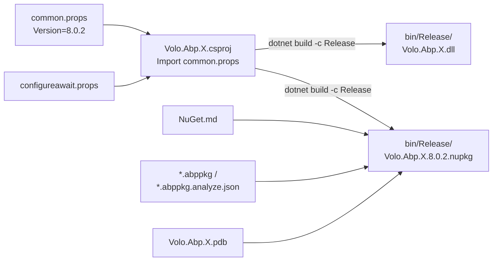
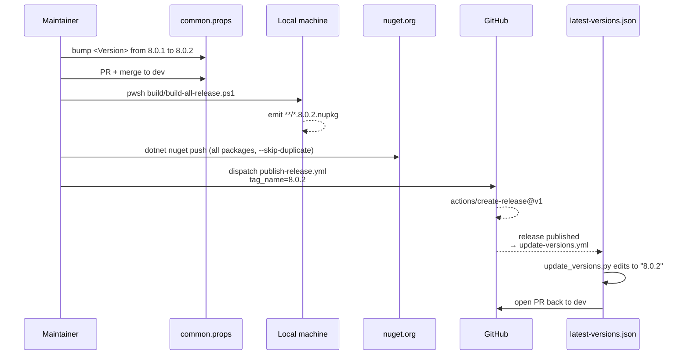

The ABP repository publishes roughly 200 NuGet packages on every release — every `framework/src/*`, every `modules/*/src/*`, the templates, and the CLI. There is no separate "pack" script; packing happens as a side effect of `dotnet build --configuration Release` when `common.props` is imported. The push to nuget.org is performed manually by a maintainer from their workstation. This page walks the end-to-end path from the `<Version>8.0.2</Version>` element in `common.props` to the live nuget.org listing.

## Inventory

<Files>
```
abp/
├── common.props                # the single <Version> element
├── NuGet.Config                # restore feed (nuget.org only)
├── NuGet.md                    # PackageReadmeFile content
├── Directory.Packages.props    # central dependency versions
├── latest-versions.json        # post-publish marker, bumped by update_versions.py
├── build/
│   ├── common.ps1              # loops every solution
│   └── build-all-release.ps1   # dotnet build -c Release /maxcpucount
└── .github/
    ├── workflows/
    │   ├── publish-release.yml   # creates GitHub Release (manual)
    │   └── update-versions.yml   # bumps latest-versions.json
    └── scripts/
        └── update_versions.py
```
</Files>

## The single source of truth

Every shipping NuGet package gets its version from one place:

```xml title="common.props"
<Project>
  <PropertyGroup>
    <LangVersion>latest</LangVersion>
    <Version>8.0.2</Version>
    ...
```

`<Version>` is set once at the top of the file. Every csproj that `<Import Project="..\..\..\common.props" />` picks it up and stamps it into the `.nupkg`.

The same string is also read by the npm side via a Node helper:

```javascript title="npm/publish-utils.js (excerpt)"
function getVersion() {
  if (program.customVersion) return program.customVersion;
  const commonProps = fse.readFileSync('../common.props').toString();
  const versionTag = '<Version>';
  const versionEndTag = '</Version>';
  const first = commonProps.indexOf(versionTag) + versionTag.length;
  const last = commonProps.indexOf(versionEndTag);
  return commonProps.substring(first, last);
}
```

So bumping `common.props` to `8.0.3` is sufficient to align both the dotnet and the npm halves — there are no other version files to keep in sync.

## What `common.props` puts into every package

Re-reading the property group from [tooling/directory-build-props](/tooling/directory-build-props) through a packaging lens, every property maps to a field in the resulting `.nuspec`:

| `common.props` property | `.nuspec` element |
| --- | --- |
| `<Version>` | `<version>` |
| `<PackageIconUrl>` | `<iconUrl>` |
| `<PackageProjectUrl>` | `<projectUrl>` |
| `<PackageLicenseExpression>` | `<license type="expression">` |
| `<RepositoryType>` + `<RepositoryUrl>` | `<repository type="git" url="…">` |
| `<PackageReadmeFile>` | `<readme>NuGet.md</readme>` (file packed via the `<None Include>`) |
| `<PackageTags>` | `<tags>` |

Two `<ItemGroup>`s in `common.props` also affect what physically ends up inside the `.nupkg`:

```xml title="common.props (packaging item groups)"
<ItemGroup>
  <None Include="..\..\NuGet.md" Pack="true" PackagePath="\"/>
</ItemGroup>

<ItemGroup>
  <PackageReference Include="Microsoft.SourceLink.GitHub">
    <PrivateAssets>all</PrivateAssets>
    <IncludeAssets>runtime; build; native; contentfiles; analyzers</IncludeAssets>
  </PackageReference>
</ItemGroup>

<ItemGroup Condition="'$(UsingMicrosoftNETSdkWeb)' != 'true' AND '$(UsingMicrosoftNETSdkRazor)' != 'true'">
  <None Remove="*.abppkg.analyze.json" />
  <Content Include="*.abppkg.analyze.json">
      <Pack>true</Pack>
      <PackagePath>content\</PackagePath>
  </Content>
</ItemGroup>

<ItemGroup>
  <None Remove="*.abppkg" />
  <Content Include="*.abppkg">
      <Pack>true</Pack>
      <PackagePath>content\</PackagePath>
  </Content>
</ItemGroup>
```

What that buys:

<CardGroup cols={2}>
  <Card title="NuGet.md as readme" icon="file-lines">
    The top-level `NuGet.md` is packed into every `.nupkg` root. nuget.org renders it as the package's landing page.
  </Card>
  <Card title="SourceLink" icon="link">
    `Microsoft.SourceLink.GitHub` embeds git-relative source paths in the PDB. Consumers can step into ABP code from their IDE.
  </Card>
  <Card title="*.abppkg packed under content/" icon="cube">
    The CLI reads these JSON descriptors from `nupkg/content/` to recognize a package as an ABP module. See [source-code-tooling](/source-code-tooling).
  </Card>
  <Card title="PDB in the .nupkg" icon="microscope">
    `<AllowedOutputExtensionsInPackageBuildOutputFolder>$(…);.pdb</…>` includes the symbol file directly in the package — no separate `.snupkg`.
  </Card>
</CardGroup>

## The pack step is automatic

A standard ABP csproj does not call `dotnet pack` explicitly. Instead, `common.props` relies on the default `<IsPackable>true</IsPackable>` for class libraries, and the build itself produces the `.nupkg`. Watch what happens during a release build:

```powershell title="build/build-all-release.ps1"
. ".\common.ps1" -f

foreach ($solutionPath in $solutionPaths) {
    $solutionAbsPath = (Join-Path $rootFolder $solutionPath)
    Set-Location $solutionAbsPath
    dotnet build --configuration Release -- /maxcpucount
    if (-Not $?) {
        Write-Host ("Build failed for the solution: " + $solutionPath)
        Set-Location $rootFolder
        exit $LASTEXITCODE
    }
}
```

`dotnet build --configuration Release` on a project that imports `common.props` and has `IsPackable=true` (the default for class libraries) emits both the DLL/PDB *and* the `.nupkg` under `bin/Release/`. Test projects don't pack because of `<IsPackable>false</IsPackable>` set by the test SDK template.

Why this matters:

<Steps>
  <Step title="One pass, every package">
    `build-all-release.ps1` walks every solution once. By the end of the loop, every packable project has produced its `.nupkg`.
  </Step>
  <Step title="Configuration-gated weaver">
    `configureawait.props` only activates on Release (`Condition="'$(Configuration)' == 'Release'"`). So the `.nupkg` ships ConfigureAwait-woven assemblies even though Debug developer builds don't.
  </Step>
  <Step title="No central output folder">
    Packages stay under each project's `bin/Release/`. The maintainer's push script (kept local — see below) collects them with a glob like `**/bin/Release/*.nupkg`.
  </Step>
</Steps>



## The restore feed

`NuGet.Config` declares the *restore* feeds only:

```xml title="NuGet.Config"
<?xml version="1.0" encoding="utf-8"?>
<configuration>
    <packageSources>
        <add key="nuget.org" value="https://api.nuget.org/v3/index.json" />
    </packageSources>
</configuration>
```

There is no private feed in the file. Consequences:

- Every transitive dependency must be resolvable from nuget.org. The 165 `<PackageVersion>` entries in `Directory.Packages.props` (see [tooling/directory-build-props](/tooling/directory-build-props)) are all public packages.
- Nightly builds are hosted on the [MyGet abp-nightly feed](https://docs.abp.io/en/abp/latest/Nightly-Builds), but consuming them is up to the developer — the `NuGet.Config` in the repo doesn't reference it.
- The publish target (where packages *go*) is not encoded in any file in the repo. It is supplied as the `--source` argument to `nuget push` at publish time.

## The push step

Unlike the npm side (which has `publish-mvc.ps1` and `publish-ng.ps1` in the repo), the dotnet push step is **not** committed to the repository. The actual command a maintainer runs from their workstation is:

```powershell title="maintainer-local nuget push (typical)"
# After build-all-release.ps1 has produced .nupkg files
$apiKey = "<nuget.org API key>"
$source = "https://api.nuget.org/v3/index.json"

Get-ChildItem -Recurse -Filter "*.nupkg" |
    Where-Object { $_.FullName -like "*bin\Release*" } |
    ForEach-Object {
        dotnet nuget push $_.FullName --api-key $apiKey --source $source --skip-duplicate
    }
```

The `--skip-duplicate` flag matters because a single release attempt can be partially complete — packages that already published successfully don't fail the second pass.

<Warning>
Because the push command is out-of-band, the version on nuget.org and the version stamped into the `.nupkg` must be kept in sync manually. The discipline is: bump `common.props`, run the Release build, push, then trigger the GitHub Actions release workflow.
</Warning>

## The release workflow handshake

The dotnet publish is composed with three GitHub Actions workflows. The flow is:



Each step:

### Step 1 — bump and merge `common.props`

A PR changes `<Version>8.0.1</Version>` to `<Version>8.0.2</Version>`. The `build-and-test.yml` workflow re-runs because `Directory.Build.props`/`Directory.Packages.props` and `common.props` aren't in its `paths:` list, but C# changes typically are batched in the same release branch. The PR merges into `dev`.

### Step 2 — Release build and push

The maintainer runs `build-all-release.ps1` locally (see [ops/build-and-pack](/ops/build-and-pack)) and then runs the `dotnet nuget push` loop above. There is no CI-driven push because the API key never leaves the maintainer's machine.

### Step 3 — `publish-release.yml`

The workflow is `workflow_dispatch`:

```yaml title=".github/workflows/publish-release.yml"
on:
  workflow_dispatch:
    inputs:
      tag_name:
        description: 'Tag Name'
        required: true
      prerelease:
        description: 'Pre-release?'
        required: true
      branchName:
        description: 'Branch Name'
        required: true

jobs:
  build:
    runs-on: ubuntu-latest
    steps:
      - name: Checkout code
        uses: actions/checkout@v2
        with:
          ref: ${{ github.event.inputs.branchName }}

      - name: Create Release
        id: create_release
        uses: actions/create-release@v1
        env:
          GITHUB_TOKEN: ${{ secrets.RELEASE_TOKEN }}
        with:
          tag_name: ${{ github.event.inputs.tag_name }}
          release_name: ${{ github.event.inputs.tag_name }}
          draft: false
          prerelease: ${{ github.event.inputs.prerelease }}
```

This step creates the GitHub Release and tag but doesn't push anything to NuGet — the publish has already happened.

### Step 4 — `update-versions.yml`

The published release triggers the version-marker bump:

```yaml title=".github/workflows/update-versions.yml"
on:
  release:
    types:
      - published

jobs:
  update-versions:
    runs-on: ubuntu-latest
    steps:
      - name: Checkout repository
        uses: actions/checkout@v2

      - name: Set up Python
        uses: actions/setup-python@v2
        with:
          python-version: 3.x

      - name: Install dependencies
        run: |
          python -m pip install --upgrade pip
          pip install PyGithub

      - name: Update latest-versions.json and create PR
        env:
          GITHUB_TOKEN: ${{ secrets.RELEASE_TOKEN }}
        run: |
          python .github/scripts/update_versions.py
```

The script:

```python title=".github/scripts/update_versions.py"
def update_latest_versions():
    version = os.environ["GITHUB_REF"].split("/")[-1]

    if "rc" in version:
        return False

    with open("latest-versions.json", "r") as f:
        latest_versions = json.load(f)

    latest_versions[0]["version"] = version

    with open("latest-versions.json", "w") as f:
        json.dump(latest_versions, f, indent=2)

    return True
```

A pre-release tag (one containing `rc`) does *not* bump the marker — only stable releases do.

The marker file itself:

```json title="latest-versions.json"
[
  {
    "version": "7.4.2",
    "releaseDate": "",
    "type": "stable",
    "message": ""
  }
]
```

This is the file consumed by `docs.abp.io` and the `abp` CLI's update check. After 8.0.2 publishes, the script opens a PR to set it to `"8.0.2"`, routed to three maintainers (`ebicoglu`, `gizemmutukurt`, `skoc10`) — see [ops/devops](/ops/devops) for the full review-request invocation.

## Package family overview

The 200+ packages decompose into a handful of families. The package id always equals the assembly name (set in each csproj's `<PackageId>` or defaulted from `<AssemblyName>`):

| Family | Example IDs | Source folder |
| --- | --- | --- |
| Core framework | `Volo.Abp.Core`, `Volo.Abp.Ddd.Domain`, `Volo.Abp.Modularity` | `framework/src/Volo.Abp.*` |
| ASP.NET Core integration | `Volo.Abp.AspNetCore`, `Volo.Abp.AspNetCore.Mvc`, `Volo.Abp.AspNetCore.SignalR` | `framework/src/Volo.Abp.AspNetCore.*` |
| Data layer | `Volo.Abp.EntityFrameworkCore`, `Volo.Abp.EntityFrameworkCore.SqlServer`, `Volo.Abp.MongoDB`, `Volo.Abp.Dapper` | `framework/src/Volo.Abp.EntityFrameworkCore*` / `Volo.Abp.MongoDB` |
| Test bases | `Volo.Abp.TestBase`, `Volo.Abp.AspNetCore.TestBase` | `framework/src/Volo.Abp.*.TestBase` (see [ops/testing](/ops/testing)) |
| Modules | `Volo.Abp.Identity.Domain`, `Volo.Abp.OpenIddict.AspNetCore`, `Volo.Abp.TenantManagement.Application` | `modules/<name>/src/Volo.Abp.<Name>.*` |
| CLI | `Volo.Abp.Cli`, `Volo.Abp.Cli.Core` | `framework/src/Volo.Abp.Cli*` (see [cli/overview](/cli/overview)) |

Every one of these projects imports `common.props` and therefore inherits the `<Version>` from there.

## Symbols, source-link, and licensing

A few more details that hold across every package:

| Concern | Mechanism |
| --- | --- |
| Symbols | PDB embedded in the `.nupkg` via `AllowedOutputExtensionsInPackageBuildOutputFolder` |
| SourceLink | `Microsoft.SourceLink.GitHub` package reference |
| License | SPDX `LGPL-3.0-only` (no `licenseUrl`) |
| Readme | `NuGet.md` packed at the root |
| Icon | `PackageIconUrl=https://abp.io/assets/abp_nupkg.png` (hosted, not embedded) |

The combination of SourceLink + embedded PDB means a consumer can right-click "Go to Definition" on any ABP method, hit F11 in the debugger, and step straight into the GitHub-hosted source.

## Recap: where each piece of data lives

| Concern | File / location |
| --- | --- |
| Package version | `common.props` `<Version>` |
| Restore feed | `NuGet.Config` |
| Push feed | not in repo — passed as `--source` |
| Readme | `NuGet.md` |
| Central dependency versions | `Directory.Packages.props` |
| Coverlet injection (tests) | `Directory.Build.props` |
| Release weaver | `configureawait.props` |
| Tag and GH release | `.github/workflows/publish-release.yml` |
| Latest-stable marker | `latest-versions.json` (bumped by `update_versions.py`) |

## Related

- [tooling/directory-build-props](/tooling/directory-build-props) — the props files that drive the pack step.
- [tooling/npm-publish](/tooling/npm-publish) — the parallel npm pipeline that reads the same `<Version>`.
- [ops/build-and-pack](/ops/build-and-pack) — `build-all-release.ps1` and the pack-as-side-effect mechanism.
- [ops/devops](/ops/devops) — `publish-release.yml` and `update-versions.yml`.
- [source-code-tooling](/source-code-tooling) — how the `*.abppkg` files packed under `content/` are consumed by the CLI.
- [cli/overview](/cli/overview) — the `abp` CLI, which is itself a published NuGet tool.
