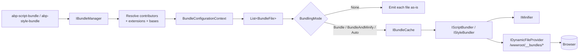

`Volo.Abp.AspNetCore.Mvc.UI.Bundling` is the runtime side of ABP's bundling
story. The package consumes the configuration model defined in
[Bundling abstractions](/ui-mvc/bundling-abstractions) — `AbpBundlingOptions`,
`BundleConfiguration` and `IBundleContributor` — and turns it into actual
CSS/JS content served to browsers. It owns the `BundleManager` orchestrator,
two `BundlerBase` implementations for scripts and styles, a process‑wide
`IBundleCache`, a per‑request `IWebRequestResources` deduplicator, and the
`abp-script-bundle` / `abp-style-bundle` tag helpers used inside theme
layouts.

## Module entry point

```csharp title="framework/src/Volo.Abp.AspNetCore.Mvc.UI.Bundling/Volo/Abp/AspNetCore/Mvc/UI/Bundling/AbpAspNetCoreMvcUiBundlingModule.cs"
[DependsOn(
    typeof(AbpAspNetCoreMvcUiBootstrapModule),
    typeof(AbpMinifyModule),
    typeof(AbpAspNetCoreMvcUiBundlingAbstractionsModule)
)]
public class AbpAspNetCoreMvcUiBundlingModule : AbpModule
{
}
```

The dependencies make the contract explicit: bundling sits on top of the
[Bootstrap tag helpers](/ui-mvc/bootstrap) (because its own helpers extend
`AbpTagHelper`), the [Minify](/ui-mvc/minify) package (for
`IJavascriptMinifier`/`ICssMinifier`), and the abstractions package that
defines the bundle model.

## Pipeline



The flow is single‑pass per bundle name and amortised across requests
through `IBundleCache`. File system watches invalidate the cache when any
contributing file changes.

## IBundleManager

```csharp title="framework/src/Volo.Abp.AspNetCore.Mvc.UI.Bundling/Volo/Abp/AspNetCore/Mvc/UI/Bundling/IBundleManager.cs"
public interface IBundleManager
{
    Task<IReadOnlyList<BundleFile>> GetStyleBundleFilesAsync(string bundleName);
    Task<IReadOnlyList<BundleFile>> GetScriptBundleFilesAsync(string bundleName);
}
```

A single call returns the URL list to embed into the layout — whether or
not the files are bundled is an internal decision based on
`AbpBundlingOptions.Mode` and the hosting environment.

### BundleManager

```csharp title="framework/src/Volo.Abp.AspNetCore.Mvc.UI.Bundling/Volo/Abp/AspNetCore/Mvc/UI/Bundling/BundleManager.cs"
public class BundleManager : IBundleManager, ITransientDependency
{
    public BundleManager(
        IOptions<AbpBundlingOptions> options,
        IOptions<AbpBundleContributorOptions> contributorOptions,
        IScriptBundler scriptBundler,
        IStyleBundler styleBundler,
        IWebHostEnvironment hostingEnvironment,
        IServiceProvider serviceProvider,
        IDynamicFileProvider dynamicFileProvider,
        IBundleCache bundleCache,
        IWebRequestResources requestResources)
    { /* ... */ }

    public virtual Task<IReadOnlyList<BundleFile>> GetStyleBundleFilesAsync(string bundleName)
        => GetBundleFilesAsync(Options.StyleBundles, bundleName, StyleBundler);

    public virtual Task<IReadOnlyList<BundleFile>> GetScriptBundleFilesAsync(string bundleName)
        => GetBundleFilesAsync(Options.ScriptBundles, bundleName, ScriptBundler);
}
```

`GetBundleFilesAsync` runs the contributor pipeline (`PreConfigureBundle` →
`ConfigureBundle` → `PostConfigureBundle`), records the produced files into
the per‑request `IWebRequestResources` (so the same file is never emitted
twice on a page), then asks the bundler to merge the local files when
bundling is enabled.

### Bundle naming and caching

The cache key for a bundle is derived from the bundle name **and** the
sequence of file paths it produced, so contributor‑driven variations (RTL
vs LTR Bootstrap, language packs) get their own physical file:

```csharp
var bundleRelativePath =
    Options.BundleFolderName.EnsureEndsWith('/') +
    bundleName + "." + bundleFiles.JoinAsString("|").ToMd5() + "." + bundler.FileExtension;
```

The result is stored in `IBundleCache` and the file is materialised through
`IDynamicFileProvider` under `/wwwroot/__bundles/<bundleName>.<hash>.<ext>`,
which is served by the standard static files middleware.

### Mode resolution

```csharp
protected virtual bool IsBundlingEnabled()
{
    switch (Options.Mode)
    {
        case BundlingMode.None:            return false;
        case BundlingMode.Bundle:
        case BundlingMode.BundleAndMinify: return true;
        case BundlingMode.Auto:            return !HostingEnvironment.IsDevelopment();
    }
}

protected virtual bool IsMinficationEnabled()
{
    switch (Options.Mode)
    {
        case BundlingMode.None:
        case BundlingMode.Bundle:          return false;
        case BundlingMode.BundleAndMinify: return true;
        case BundlingMode.Auto:            return !HostingEnvironment.IsDevelopment();
    }
}
```

`BundlingMode.Auto` is the default — development emits one `<script>` per
file (better stack traces, hot reload), other environments produce a
minified single file.

## IBundleCache

```csharp title="framework/src/Volo.Abp.AspNetCore.Mvc.UI.Bundling/Volo/Abp/AspNetCore/Mvc/UI/Bundling/IBundleCache.cs"
public interface IBundleCache
{
    BundleCacheItem GetOrAdd(string bundleName, Func<BundleCacheItem> factory);
    bool Remove(string bundleName);
}
```

The default implementation is a `ConcurrentDictionary<string, BundleCacheItem>`
registered as a singleton:

```csharp title="framework/src/Volo.Abp.AspNetCore.Mvc.UI.Bundling/Volo/Abp/AspNetCore/Mvc/UI/Bundling/BundleCache.cs"
public class BundleCache : IBundleCache, ISingletonDependency
{
    private readonly ConcurrentDictionary<string, BundleCacheItem> _cache;
    public BundleCacheItem GetOrAdd(string bundleName, Func<BundleCacheItem> factory)
        => _cache.GetOrAdd(bundleName, factory);
    public bool Remove(string bundleName) => _cache.TryRemove(bundleName, out _);
}
```

`BundleCacheItem` carries the resolved `BundleFile` list and a list of
`IDisposable` watch handles. When the manager builds a bundle it subscribes
to `IWebHostEnvironment.WebRootFileProvider.Watch(file)` for each member
file and stores the registration in `WatchDisposeHandles`. A change disposes
the handles, removes the cache entry, and deletes the dynamic file so the
next request rebuilds the bundle.

## IWebRequestResources

`IWebRequestResources` is scoped per request and tracks every file that the
manager already emitted, so a page that pulls in two bundles sharing
contributors (for example Bootstrap referenced by Global *and* a widget
bundle) doesn't end up loading `bootstrap.bundle.js` twice.

```csharp title="framework/src/Volo.Abp.AspNetCore.Mvc.UI.Bundling/Volo/Abp/AspNetCore/Mvc/UI/Resources/IWebRequestResources.cs"
public interface IWebRequestResources
{
    List<BundleFile> TryAdd(List<BundleFile> resources);
}
```

## Bundlers

Both bundlers derive from `BundlerBase`, which handles file loading, the
`.min.<ext>` / `.prod.<ext>` short‑circuit, minification through `IMinifier`
and the per‑file pre/post‑processing hook `ProcessBeforeAddingToTheBundle`.

```csharp title="framework/src/Volo.Abp.AspNetCore.Mvc.UI.Bundling/Volo/Abp/AspNetCore/Mvc/UI/Bundling/BundlerBase.cs"
public abstract class BundlerBase : IBundler, ITransientDependency
{
    private static string[] _minFileSuffixes = { "min", "prod" };

    protected BundlerBase(IWebHostEnvironment hostEnvironment,
                          IMinifier minifier,
                          IOptions<AbpBundlingOptions> bundlingOptions) { /* ... */ }

    public abstract string FileExtension { get; }

    public BundleResult Bundle(IBundlerContext context)
    {
        // For each file: read from WebRootFileProvider, prefer a pre-minified
        // sibling (.min.js / .prod.js) when minification is on, otherwise run
        // through Minifier.Minify().
    }

    protected virtual string ProcessBeforeAddingToTheBundle(IBundlerContext context, string filePath, string fileContent)
        => fileContent;
}
```

### ScriptBundler

```csharp title="framework/src/Volo.Abp.AspNetCore.Mvc.UI.Bundling/Volo/Abp/AspNetCore/Mvc/UI/Bundling/Scripts/ScriptBundler.cs"
public class ScriptBundler : BundlerBase, IScriptBundler
{
    public override string FileExtension => "js";

    public ScriptBundler(IWebHostEnvironment hostEnvironment,
                         IJavascriptMinifier minifier,
                         IOptions<AbpBundlingOptions> bundlingOptions)
        : base(hostEnvironment, minifier, bundlingOptions) { }

    protected override string ProcessBeforeAddingToTheBundle(
        IBundlerContext context, string filePath, string fileContent)
    {
        return fileContent.EnsureEndsWith(';') + Environment.NewLine;
    }
}
```

The override defends against scripts that omit the trailing semicolon —
something jQuery plug‑ins were notorious for — so the concatenated bundle
still parses correctly.

### StyleBundler

```csharp title="framework/src/Volo.Abp.AspNetCore.Mvc.UI.Bundling/Volo/Abp/AspNetCore/Mvc/UI/Bundling/Styles/StyleBundler.cs"
public class StyleBundler : BundlerBase, IStyleBundler
{
    public override string FileExtension => "css";

    public StyleBundler(IWebHostEnvironment hostEnvironment,
                        ICssMinifier minifier,
                        IOptions<AbpBundlingOptions> bundlingOptions)
        : base(hostEnvironment, minifier, bundlingOptions) { /* ... */ }

    protected override string ProcessBeforeAddingToTheBundle(
        IBundlerContext context, string filePath, string fileContent)
    {
        return CssRelativePath.Adjust(
            fileContent,
            GetAbsolutePath(filePath),
            GetAbsolutePath(context.BundleRelativePath));
    }
}
```

The override rewrites every `url(...)` and `@import` in the bundled CSS
relative to the destination bundle path, so fonts and images keep
resolving once two style sheets from different folders are concatenated
into one file under `/wwwroot/__bundles`.

### BundlerContext / IBundler

```csharp title="framework/src/Volo.Abp.AspNetCore.Mvc.UI.Bundling/Volo/Abp/AspNetCore/Mvc/UI/Bundling/BundlerContext.cs"
public class BundlerContext : IBundlerContext
{
    public string BundleRelativePath { get; }
    public IReadOnlyList<string> ContentFiles { get; }
    public bool IsMinificationEnabled { get; }
}
```

```csharp
public interface IBundler
{
    string FileExtension { get; }
    BundleResult Bundle(IBundlerContext context);
}

public interface IScriptBundler : IBundler { }
public interface IStyleBundler  : IBundler { }
```

## Contributor extensions

`AbpBundleContributorOptions` is the seam other modules use to graft new
files onto an existing contributor without redefining the bundle:

```csharp title="framework/src/Volo.Abp.AspNetCore.Mvc.UI.Bundling/Volo/Abp/AspNetCore/Mvc/UI/Bundling/AbpBundleContributorOptions.cs"
public class AbpBundleContributorOptions
{
    public ConcurrentDictionary<Type, BundleContributorCollection> AllExtensions { get; }

    public BundleContributorCollection Extensions<TContributor>()
        => Extensions(typeof(TContributor));

    public BundleContributorCollection Extensions(Type contributorType)
        => AllExtensions.GetOrAdd(contributorType, _ => new BundleContributorCollection());
}
```

A module can plug `MyExtraThemeStyleContributor` after
`SharedThemeGlobalStyleContributor` with a single line:

```csharp
Configure<AbpBundleContributorOptions>(options =>
{
    options.Extensions<SharedThemeGlobalStyleContributor>()
           .Add<MyExtraThemeStyleContributor>();
});
```

`BundleManager.GetContributors` walks the list and, for every contributor,
inserts the extensions immediately after it in the pipeline.

## Tag helpers

The package exposes both per‑file tag helpers (`abp-script`, `abp-style`)
and bundle tag helpers (`abp-script-bundle`, `abp-style-bundle`).

```csharp title="framework/src/Volo.Abp.AspNetCore.Mvc.UI.Bundling/Volo/Abp/AspNetCore/Mvc/UI/Bundling/TagHelpers/AbpScriptBundleTagHelper.cs"
[HtmlTargetElement("abp-script-bundle", TagStructure = TagStructure.NormalOrSelfClosing)]
public class AbpScriptBundleTagHelper : AbpBundleTagHelper<AbpScriptBundleTagHelper, AbpScriptBundleTagHelperService>, IBundleTagHelper
{
    [HtmlAttributeName("defer")]
    public bool Defer { get; set; }
}
```

```csharp title="framework/src/Volo.Abp.AspNetCore.Mvc.UI.Bundling/Volo/Abp/AspNetCore/Mvc/UI/Bundling/TagHelpers/AbpStyleBundleTagHelper.cs"
[HtmlTargetElement("abp-style-bundle", TagStructure = TagStructure.NormalOrSelfClosing)]
public class AbpStyleBundleTagHelper : AbpBundleTagHelper<AbpStyleBundleTagHelper, AbpStyleBundleTagHelperService>, IBundleTagHelper
{
    [HtmlAttributeName("preload")]
    public bool Preload { get; set; }
}
```

```csharp title="framework/src/Volo.Abp.AspNetCore.Mvc.UI.Bundling/Volo/Abp/AspNetCore/Mvc/UI/Bundling/TagHelpers/AbpScriptTagHelper.cs"
[HtmlTargetElement("abp-script", TagStructure = TagStructure.NormalOrSelfClosing)]
public class AbpScriptTagHelper : AbpBundleItemTagHelper<AbpScriptTagHelper, AbpScriptTagHelperService>, IBundleItemTagHelper
{
    [HtmlAttributeName("defer")] public bool Defer { get; set; }
    protected override string GetFileExtension() => "js";
}
```

```csharp title="framework/src/Volo.Abp.AspNetCore.Mvc.UI.Bundling/Volo/Abp/AspNetCore/Mvc/UI/Bundling/TagHelpers/AbpStyleTagHelper.cs"
[HtmlTargetElement("abp-style", TagStructure = TagStructure.NormalOrSelfClosing)]
public class AbpStyleTagHelper : AbpBundleItemTagHelper<AbpStyleTagHelper, AbpStyleTagHelperService>, IBundleItemTagHelper
{
    [HtmlAttributeName("preload")] public bool Preload { get; set; }
    protected override string GetFileExtension() => "css";
}
```

Razor:

```cshtml
@* Pre-declared bundle assembled by contributors *@
<abp-script-bundle name="@StandardBundles.Scripts.Global" defer="true" />
<abp-style-bundle  name="@StandardBundles.Styles.Global"  preload="true" />

@* Ad-hoc inline bundle (lazy bundle) *@
<abp-script-bundle name="MyPage.Scripts">
    <abp-script src="/js/my-page.js" />
    <abp-script type="@(typeof(MyExtraContributor))" />
</abp-script-bundle>
```

When the body of `abp-script-bundle`/`abp-style-bundle` contains
`abp-script`/`abp-style` items, the helper service registers the
contributor list with `BundleConfigurationCollection.Configure(...)`, so
the bundle is materialised lazily on its first use.

A `ScriptNonceTagHelper` is also provided to stamp a CSP nonce onto every
emitted script.

## File inventory — `Volo.Abp.AspNetCore.Mvc.UI.Bundling`

| Folder | Notable types | Purpose |
| --- | --- | --- |
| `AbpAspNetCoreMvcUiBundlingModule.cs` | `AbpAspNetCoreMvcUiBundlingModule` | Module entry |
| `BundleManager.cs` | `BundleManager`, `IBundleManager` | Resolves contributors, runs the pipeline, manages bundling/caching |
| `BundleCache.cs` / `BundleCacheItem.cs` / `IBundleCache.cs` | `BundleCache`, `BundleCacheItem` | Singleton cache + file watcher handles |
| `BundlerBase.cs` | `BundlerBase` | Shared file loading + minification logic |
| `BundlerContext.cs` / `IBundlerContext.cs` | `BundlerContext` | Per‑bundle input passed to bundlers |
| `BundleResult.cs` | `BundleResult` | Output (`Content` string) of a bundling pass |
| `AbpBundleContributorOptions.cs` | `AbpBundleContributorOptions` | Contributor extensions seam |
| `Scripts/ScriptBundler.cs` | `ScriptBundler`, `IScriptBundler` | JS bundler |
| `Styles/StyleBundler.cs` | `StyleBundler`, `IStyleBundler`, `CssRelativePath` | CSS bundler + url() rewriting |
| `Resources/IWebRequestResources.cs` / `WebRequestResources.cs` | `IWebRequestResources` | Per‑request file dedup |
| `TagHelpers/AbpScriptBundleTagHelper.cs` | `AbpScriptBundleTagHelper` | `<abp-script-bundle>` |
| `TagHelpers/AbpStyleBundleTagHelper.cs` | `AbpStyleBundleTagHelper` | `<abp-style-bundle>` |
| `TagHelpers/AbpScriptTagHelper.cs` | `AbpScriptTagHelper` | `<abp-script>` (file or contributor) |
| `TagHelpers/AbpStyleTagHelper.cs` | `AbpStyleTagHelper` | `<abp-style>` (file or contributor) |
| `TagHelpers/AbpBundleTagHelper.cs` / `AbpBundleItemTagHelper.cs` | `AbpBundleTagHelper<,>`, `AbpBundleItemTagHelper<,>` | Common base classes |
| `TagHelpers/AbpTagHelperResourceService.cs` | `AbpTagHelperResourceService` | Shared rendering helper |
| `TagHelpers/AbpTagHelperScriptService.cs` / `AbpTagHelperStyleService.cs` | services | Per‑helper service logic |
| `TagHelpers/ScriptNonceTagHelper.cs` | `ScriptNonceTagHelper` | CSP nonce support |
| `TagHelpers/AbpTagHelperConsts.cs` | constants | Razor item keys |

## Related pages

<CardGroup cols={2}>
  <Card title="Bundling abstractions" href="/ui-mvc/bundling-abstractions">
    The configuration model (AbpBundlingOptions, BundleConfiguration,
    IBundleContributor) that this package consumes.
  </Card>
  <Card title="Packages &amp; tag helpers" href="/ui-mvc/packages-tag-helpers">
    Ready-made BundleContributor implementations for jQuery, Bootstrap,
    DataTables, Select2 and friends.
  </Card>
  <Card title="Minify" href="/ui-mvc/minify">
    The IJavascriptMinifier / ICssMinifier abstractions used by BundlerBase.
  </Card>
  <Card title="Virtual File System" href="/vfs/overview">
    Where the contributor files live — embedded resources resolved through
    IWebHostEnvironment.WebRootFileProvider.
  </Card>
</CardGroup>
