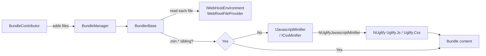

`Volo.Abp.Minify` is the small abstraction package that the
[Bundling](/ui-mvc/bundling) pipeline uses whenever
`BundlingMode` is set to `BundleAndMinify` (or `Auto` outside development).
It defines three minifier contracts — `IJavascriptMinifier`,
`ICssMinifier`, `IHtmlMinifier` — that all extend a single `IMinifier`
interface, and ships [NUglify](https://github.com/xoofx/NUglify) backed
implementations registered as transient services. The bundlers consume
them through their typed interfaces so you can replace any of the three
without touching the rest of the stack.

## Module entry point

```csharp title="framework/src/Volo.Abp.Minify/Volo/Abp/Minify/AbpMinifyModule.cs"
public class AbpMinifyModule : AbpModule
{
}
```

The module is empty — there is no configuration to register. The
implementations register themselves via `ITransientDependency` on
`NUglifyMinifierBase`, and they implement the three typed marker
interfaces so the ABP DI conventional registration picks them up
automatically.

## IMinifier

`IMinifier` is the common contract. It takes the source text, an optional
relative `fileName` (used by NUglify for error messages and source maps)
and an `originalFileName` used in exception text:

```csharp title="framework/src/Volo.Abp.Minify/Volo/Abp/Minify/IMinifier.cs"
public interface IMinifier
{
    string Minify(
        string source,
        string? fileName = null,
        string? originalFileName = null);
}
```

The three typed interfaces are empty markers — they exist purely so the
DI container can resolve "the JS minifier" or "the CSS minifier"
independently:

```csharp title="framework/src/Volo.Abp.Minify/Volo/Abp/Minify/Scripts/IJavascriptMinifier.cs"
public interface IJavascriptMinifier : IMinifier { }
```

```csharp title="framework/src/Volo.Abp.Minify/Volo/Abp/Minify/Styles/ICssMinifier.cs"
public interface ICssMinifier : IMinifier { }
```

```csharp title="framework/src/Volo.Abp.Minify/Volo/Abp/Minify/Html/IHtmlMinifier.cs"
public interface IHtmlMinifier : IMinifier { }
```

<Info>
The bundling layer only injects `IJavascriptMinifier` (into `ScriptBundler`)
and `ICssMinifier` (into `StyleBundler`). `IHtmlMinifier` is provided for
applications and other modules that need to inline-minify Razor / HTML
output — for example email templates rendered via the
[Razor templating engine](/templating/overview).
</Info>

## NUglifyMinifierBase

Every concrete minifier inherits from `NUglifyMinifierBase`, which owns
the exception handling and the post‑condition check on the NUglify
result. Subclasses override one method — `UglifySource` — to invoke the
right NUglify entry point.

```csharp title="framework/src/Volo.Abp.Minify/Volo/Abp/Minify/NUglify/NUglifyMinifierBase.cs"
public abstract class NUglifyMinifierBase : IMinifier, ITransientDependency
{
    private static void CheckErrors(UglifyResult result, string? originalFileName)
    {
        if (result.HasErrors)
        {
            var errorMessage = "There are some errors on uglifying the given source code!";
            if (originalFileName != null) errorMessage += " Original file: " + originalFileName;

            throw new NUglifyException(
                $"{errorMessage}{Environment.NewLine}{result.Errors.Select(err => err.ToString()).JoinAsString(Environment.NewLine)}",
                result.Errors);
        }
    }

    public string Minify(string source, string? fileName = null, string? originalFileName = null)
    {
        try
        {
            var result = UglifySource(source, fileName);
            CheckErrors(result, originalFileName);
            return result.Code;
        }
        catch (Exception e)
        {
            var errorMessage = "There is an error in uglifying the given source code!";
            if (originalFileName != null) errorMessage += " Original file: " + originalFileName;
            throw new NUglifyException($"{errorMessage}{Environment.NewLine}{e.Message}", e);
        }
    }

    protected abstract UglifyResult UglifySource(string source, string? fileName);
}
```

The base class is registered as a transient dependency, which means the
three concrete subclasses below are auto-registered for every interface
they implement.

## Concrete minifiers

The three concrete classes each delegate to one NUglify entry point and
fill in their typed marker interface.

```csharp title="framework/src/Volo.Abp.Minify/Volo/Abp/Minify/NUglify/NUglifyJavascriptMinifier.cs"
public class NUglifyJavascriptMinifier : NUglifyMinifierBase, IJavascriptMinifier
{
    protected override UglifyResult UglifySource(string source, string? fileName)
        => Uglify.Js(source, fileName);
}
```

```csharp title="framework/src/Volo.Abp.Minify/Volo/Abp/Minify/NUglify/NUglifyCssMinifier.cs"
public class NUglifyCssMinifier : NUglifyMinifierBase, ICssMinifier
{
    protected override UglifyResult UglifySource(string source, string? fileName)
        => Uglify.Css(source, fileName);
}
```

```csharp title="framework/src/Volo.Abp.Minify/Volo/Abp/Minify/NUglify/NUglifyHtmlMinifier.cs"
public class NUglifyHtmlMinifier : NUglifyMinifierBase, IHtmlMinifier
{
    protected override UglifyResult UglifySource(string source, string? fileName)
        => Uglify.Html(source, sourceFileName: fileName);
}
```

Notice the asymmetry of the HTML overload: NUglify uses a named parameter
`sourceFileName` for HTML where it's a positional `fileName` for JS/CSS.

## Error reporting

NUglify exposes both *errors* (parse failures, syntax issues) and *info*
diagnostics. The minifier base class promotes errors to an
`NUglifyException` carrying every reported `UglifyError`:

```csharp title="framework/src/Volo.Abp.Minify/Volo/Abp/Minify/NUglify/NUglifyException.cs"
public class NUglifyException : AbpException
{
    public List<UglifyError>? Errors { get; set; }

    public NUglifyException(string message, List<UglifyError> errors) : base(message)
    {
        Errors = errors;
    }

    public NUglifyException(string message, Exception innerException) : base(message, innerException) { }

    public NUglifyException(SerializationInfo serializationInfo, StreamingContext context)
        : base(serializationInfo, context) { }
}
```

The bundling layer catches this exception in `BundlerBase.GetAndMinifyFileContent`
and logs a warning instead of failing the request — the bundle still serves
the *un*minified version of the offending file:

```csharp
catch (Exception ex)
{
    Logger.LogWarning($"Unable to minify the file: {fileName}. Return file content without minification.", ex);
}
return fileContent;
```

So a single bad file (typically a third‑party library that the bundler
shouldn't touch in the first place) degrades gracefully to "served as is"
rather than tearing down the whole bundle.

## Bypassing minification

Two mechanisms in the bundling layer make it easy to keep already
minified or sensitive files away from NUglify:

1. **`AbpBundlingOptions.MinificationIgnoredFiles`** — a `HashSet<string>`
   of file paths the bundler treats as opaque. See
   [Bundling abstractions](/ui-mvc/bundling-abstractions#abpbundlingoptions).
2. **`.min.<ext>` / `.prod.<ext>` siblings** — `BundlerBase` automatically
   prefers a pre‑minified sibling file when one exists next to the
   contributor file. See
   [Bundling: BundlerBase](/ui-mvc/bundling#bundlers).

## Replacing the minifier

Because the three minifiers are registered as transient services via
`ITransientDependency`, you can replace any of them with a custom
implementation through the standard ABP DI conventions — for example to
preserve license headers, target a specific ECMAScript version, or feed
the source through a different engine entirely:

```csharp
[Dependency(ReplaceServices = true)]
public class MyJavascriptMinifier : NUglifyMinifierBase, IJavascriptMinifier
{
    protected override UglifyResult UglifySource(string source, string? fileName)
    {
        var settings = new CodeSettings
        {
            PreserveImportantComments = true,
            EvalTreatment = EvalTreatment.MakeImmediateSafe,
        };
        return Uglify.Js(source, fileName, settings);
    }
}
```

Drop that into any module in the dependency graph and the
[`ScriptBundler`](/ui-mvc/bundling#scriptbundler) will pick it up.

## Use from the bundling pipeline



`ScriptBundler` injects `IJavascriptMinifier`, `StyleBundler` injects
`ICssMinifier` — neither bundler ever sees `NUglifyJavascriptMinifier`
directly, which is why swapping the implementation is enough.

## File inventory — `Volo.Abp.Minify`

| File | Purpose |
| --- | --- |
| `AbpMinifyModule.cs` | Empty marker module |
| `IMinifier.cs` | Root `Minify(source, fileName, originalFileName)` contract |
| `Scripts/IJavascriptMinifier.cs` | Typed marker interface for JS |
| `Styles/ICssMinifier.cs` | Typed marker interface for CSS |
| `Html/IHtmlMinifier.cs` | Typed marker interface for HTML |
| `NUglify/NUglifyMinifierBase.cs` | Shared exception/error handling, `ITransientDependency` |
| `NUglify/NUglifyJavascriptMinifier.cs` | `IJavascriptMinifier` ⇒ `Uglify.Js` |
| `NUglify/NUglifyCssMinifier.cs` | `ICssMinifier` ⇒ `Uglify.Css` |
| `NUglify/NUglifyHtmlMinifier.cs` | `IHtmlMinifier` ⇒ `Uglify.Html` |
| `NUglify/NUglifyException.cs` | `AbpException` subclass carrying `List<UglifyError>` |

## Direct use outside bundling

Nothing prevents a module from injecting a minifier directly. A typical
example is a Razor templating module that wants to inline‑minify the
rendered HTML before sending it as an email:

```csharp
public class EmailRenderer : ITransientDependency
{
    private readonly IHtmlMinifier _htmlMinifier;
    private readonly ITemplateRenderer _renderer;

    public EmailRenderer(IHtmlMinifier htmlMinifier, ITemplateRenderer renderer)
    {
        _htmlMinifier = htmlMinifier;
        _renderer     = renderer;
    }

    public async Task<string> RenderAsync(string templateName, object model)
    {
        var html = await _renderer.RenderAsync(templateName, model);
        return _htmlMinifier.Minify(html, fileName: templateName);
    }
}
```

The `fileName` argument is only used in NUglify's diagnostics and the
exception message — it doesn't need to correspond to an on‑disk file.

## When does the bundler call the minifier?

The bundler does *not* always run the minifier. It checks three rules in
`BundlerBase`:

| Condition | Action |
| --- | --- |
| `BundlingOptions.MinificationIgnoredFiles.Contains(file)` | Skip minification — append the file as-is |
| File ends with `.min.<ext>` or `.prod.<ext>` | Skip — already minified |
| A `.min.<ext>` / `.prod.<ext>` sibling exists | Use the sibling instead of running the minifier |
| `context.IsMinificationEnabled == false` | Skip — bundling mode is `None` or `Bundle` |
| Otherwise | Pass the content through `IMinifier.Minify(...)` |

This is the only path where `NUglifyJavascriptMinifier` and
`NUglifyCssMinifier` are exercised in a typical request. Errors are
caught and reduced to log warnings; the non-minified content is still
emitted into the bundle so the page keeps rendering. See
[Bundling: bundlers](/ui-mvc/bundling#bundlers) for the surrounding code.

## Related pages

<CardGroup cols={2}>
  <Card title="Bundling" href="/ui-mvc/bundling">
    Where IJavascriptMinifier and ICssMinifier are consumed — ScriptBundler,
    StyleBundler and BundlerBase.
  </Card>
  <Card title="Bundling abstractions" href="/ui-mvc/bundling-abstractions">
    MinificationIgnoredFiles and BundlingMode that control when the
    minifier is actually invoked.
  </Card>
  <Card title="MVC UI overview" href="/ui-mvc/overview">
    How the MVC UI stack fits together.
  </Card>
  <Card title="Exception handling" href="/web/exception-handling">
    The pipeline that turns AbpException subclasses (like NUglifyException)
    into structured error responses.
  </Card>
</CardGroup>
