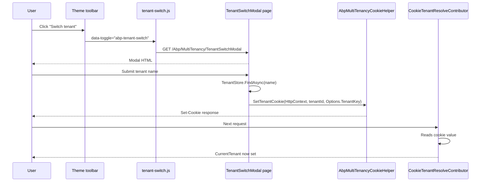

`Volo.Abp.AspNetCore.Mvc.UI.MultiTenancy` is a tiny module that adds a
ready‑made **tenant switch UI** to any ABP MVC application. It exposes
a Razor Page modal (`TenantSwitchModal`) that authenticates the entered
tenant name, sets the multi‑tenancy cookie through
`AbpMultiTenancyCookieHelper`, and a companion read‑only API
(`AbpTenantController` / `AbpTenantAppService`) so client‑side code can
look tenants up without going through the page. The module sits on top
of [Theme.Shared](/ui-mvc/theme-shared) and the
[multi‑tenancy ASP.NET Core resolvers](/multitenancy/aspnet-core-resolvers),
so its only responsibility is the **UI** layer of tenant switching.

## Module entry point

```csharp title="framework/src/Volo.Abp.AspNetCore.Mvc.UI.MultiTenancy/Volo/Abp/AspNetCore/Mvc/UI/MultiTenancy/AbpAspNetCoreMvcUiMultiTenancyModule.cs"
[DependsOn(
    typeof(AbpAspNetCoreMvcUiThemeSharedModule),
    typeof(AbpAspNetCoreMultiTenancyModule)
)]
public class AbpAspNetCoreMvcUiMultiTenancyModule : AbpModule
{
    public override void PreConfigureServices(ServiceConfigurationContext context)
    {
        PreConfigure<AbpMvcDataAnnotationsLocalizationOptions>(options =>
        {
            options.AddAssemblyResource(
                typeof(AbpUiMultiTenancyResource),
                typeof(AbpAspNetCoreMvcUiMultiTenancyModule).Assembly
            );
        });

        PreConfigure<IMvcBuilder>(mvcBuilder =>
        {
            mvcBuilder.AddApplicationPartIfNotExists(typeof(AbpAspNetCoreMvcUiMultiTenancyModule).Assembly);
        });
    }

    public override void ConfigureServices(ServiceConfigurationContext context)
    {
        Configure<AbpVirtualFileSystemOptions>(options =>
        {
            options.FileSets.AddEmbedded<AbpAspNetCoreMvcUiMultiTenancyModule>();
        });

        Configure<AbpLocalizationOptions>(options =>
        {
            options.Resources
                .Add<AbpUiMultiTenancyResource>("en")
                .AddVirtualJson("/Volo/Abp/AspNetCore/Mvc/UI/MultiTenancy/Localization");
        });

        Configure<AbpBundlingOptions>(options =>
        {
            options.ScriptBundles
                .Get(StandardBundles.Scripts.Global)
                .AddFiles(
                    "/Pages/Abp/MultiTenancy/tenant-switch.js"
                );
        });
    }
}
```

The startup work is small but layered:

- `[DependsOn]` pulls in `AbpAspNetCoreMultiTenancyModule` (which provides
  `AbpAspNetCoreMultiTenancyOptions` and `AbpMultiTenancyCookieHelper`)
  and `AbpAspNetCoreMvcUiThemeSharedModule` (for the global bundle and
  the layouts the modal renders in).
- The assembly is registered as an MVC application part so the
  `TenantSwitchModal` Razor Page and `AbpTenantController` light up.
- Embedded files are mounted into the [Virtual File System](/vfs/overview)
  and the localization resource is wired through
  `AbpLocalizationOptions`.
- `tenant-switch.js` (the client‑side glue that opens the modal and posts
  it) is appended to the **global script bundle** declared by
  [Theme.Shared](/ui-mvc/theme-shared), so every page using the global
  bundle gets the behaviour for free.

<Info>
`AbpAspNetCoreMvcUiMultiTenancyModule` does **not** ship an
`ITenantUiResolver`. ABP's tenant resolution lives in
`Volo.Abp.AspNetCore.MultiTenancy` (route, header, cookie, domain) — see
[ASP.NET Core tenant resolvers](/multitenancy/aspnet-core-resolvers).
This module only writes the cookie that one of those resolvers will pick
up on the next request.
</Info>

## AbpTenantAppService

A thin application service exposes "find tenant by name / id" using the
framework's `ITenantStore`:

```csharp title="framework/src/Volo.Abp.AspNetCore.Mvc.UI.MultiTenancy/Pages/Abp/MultiTenancy/AbpTenantAppService.cs"
public class AbpTenantAppService : ApplicationService, IAbpTenantAppService
{
    protected ITenantStore TenantStore { get; }

    public AbpTenantAppService(ITenantStore tenantStore) { TenantStore = tenantStore; }

    public virtual async Task<FindTenantResultDto> FindTenantByNameAsync(string name)
    {
        var tenant = await TenantStore.FindAsync(name);
        if (tenant == null) return new FindTenantResultDto { Success = false };

        return new FindTenantResultDto
        {
            Success  = true,
            TenantId = tenant.Id,
            Name     = tenant.Name,
            IsActive = tenant.IsActive
        };
    }

    public virtual async Task<FindTenantResultDto> FindTenantByIdAsync(Guid id)
    {
        var tenant = await TenantStore.FindAsync(id);
        if (tenant == null) return new FindTenantResultDto { Success = false };
        return new FindTenantResultDto
        {
            Success  = true,
            TenantId = tenant.Id,
            Name     = tenant.Name,
            IsActive = tenant.IsActive
        };
    }
}
```

The `IAbpTenantAppService` interface, `FindTenantResultDto` and
`AbpMultiTenancyCookieHelper` are defined in
`Volo.Abp.AspNetCore.MultiTenancy` — see
[Current tenant](/multitenancy/current-tenant) for how the cookie is
read back on subsequent requests.

## AbpTenantController

```csharp title="framework/src/Volo.Abp.AspNetCore.Mvc.UI.MultiTenancy/Pages/Abp/MultiTenancy/AbpTenantController.cs"
[Area("abp")]
[RemoteService(Name = "abp")]
[Route("api/abp/multi-tenancy")]
public class AbpTenantController : AbpControllerBase, IAbpTenantAppService
{
    private readonly IAbpTenantAppService _abpTenantAppService;

    public AbpTenantController(IAbpTenantAppService abpTenantAppService)
    {
        _abpTenantAppService = abpTenantAppService;
    }

    [HttpGet]
    [Route("tenants/by-name/{name}")]
    public virtual async Task<FindTenantResultDto> FindTenantByNameAsync(string name)
        => await _abpTenantAppService.FindTenantByNameAsync(name);

    [HttpGet]
    [Route("tenants/by-id/{id}")]
    public virtual async Task<FindTenantResultDto> FindTenantByIdAsync(Guid id)
        => await _abpTenantAppService.FindTenantByIdAsync(id);
}
```

The controller is a thin REST facade over `IAbpTenantAppService`. Endpoints:

| Method + Route | Returns |
| --- | --- |
| `GET /api/abp/multi-tenancy/tenants/by-name/{name}` | `FindTenantResultDto` |
| `GET /api/abp/multi-tenancy/tenants/by-id/{id}` | `FindTenantResultDto` |

Notice the `[RemoteService(Name = "abp")]` attribute — ABP's
[API explorer](/web/api-explorer-and-models) groups the endpoints under
the `abp` application API, so generated clients see them as a sibling
of the rest of the system APIs.

## TenantSwitchModal

The Razor Page that powers the actual modal is at
`/Pages/Abp/MultiTenancy/TenantSwitchModal.cshtml`. It binds a single
text input — the tenant name — and on POST resolves the tenant, validates
its active status, and writes the cookie:

```csharp title="framework/src/Volo.Abp.AspNetCore.Mvc.UI.MultiTenancy/Pages/Abp/MultiTenancy/TenantSwitchModal.cshtml.cs"
public class TenantSwitchModalModel : AbpPageModel
{
    [BindProperty]
    public TenantInfoModel Input { get; set; } = default!;

    protected ITenantStore TenantStore { get; }
    protected AbpAspNetCoreMultiTenancyOptions Options { get; }

    public TenantSwitchModalModel(
        ITenantStore tenantStore,
        IOptions<AbpAspNetCoreMultiTenancyOptions> options)
    {
        TenantStore = tenantStore;
        Options     = options.Value;
        LocalizationResourceType = typeof(AbpUiMultiTenancyResource);
    }

    public virtual async Task OnGetAsync()
    {
        Input = new TenantInfoModel();
        if (CurrentTenant.IsAvailable)
        {
            var tenant = await TenantStore.FindAsync(CurrentTenant.GetId());
            Input.Name = tenant?.Name;
        }
    }

    public virtual async Task OnPostAsync()
    {
        Guid? tenantId = null;
        if (!Input.Name.IsNullOrEmpty())
        {
            var tenant = await TenantStore.FindAsync(Input.Name!);
            if (tenant == null)
                throw new UserFriendlyException(L["GivenTenantIsNotExist", Input.Name!]);

            if (!tenant.IsActive)
                throw new UserFriendlyException(L["GivenTenantIsNotAvailable", Input.Name!]);

            tenantId = tenant.Id;
        }

        AbpMultiTenancyCookieHelper.SetTenantCookie(HttpContext, tenantId, Options.TenantKey);
    }

    public class TenantInfoModel
    {
        [InputInfoText("SwitchTenantHint")]
        public string? Name { get; set; }
    }
}
```

A few points worth flagging:

- The page uses **`AbpPageModel`** from
  [`AbpAspNetCoreMvcUiModule`](/ui-mvc/overview#abppagemodel-and-friends),
  so it inherits `CurrentUser`, `CurrentTenant`, `L`, `LazyServiceProvider`
  and friends.
- `LocalizationResourceType = typeof(AbpUiMultiTenancyResource)` overrides
  the default localization resource for `L`, so all strings come from this
  module's JSON files.
- On POST it throws `UserFriendlyException`. ABP's exception handling
  middleware (see [Exception handling](/web/exception-handling)) converts
  that into a 4xx with a JSON payload, which `tenant-switch.js` shows in a
  Toastr/SweetAlert prompt.
- The cookie is set with `Options.TenantKey` — the same key the
  [`CookieTenantResolveContributor`](/multitenancy/aspnet-core-resolvers)
  reads on the next request.

### The view

```cshtml title="framework/src/Volo.Abp.AspNetCore.Mvc.UI.MultiTenancy/Pages/Abp/MultiTenancy/TenantSwitchModal.cshtml"
@page
@using Microsoft.AspNetCore.Mvc.Localization
@using Pages.Abp.MultiTenancy
@using Volo.Abp.AspNetCore.Mvc.UI.Bootstrap.TagHelpers.Modal
@using Volo.Abp.AspNetCore.Mvc.UI.MultiTenancy.Localization
@model TenantSwitchModalModel
@inject IHtmlLocalizer<AbpUiMultiTenancyResource> L
@{
    Layout = null;
}
<abp-dynamic-form abp-model="@Model.Input" asp-page="/Abp/MultiTenancy/TenantSwitchModal">
    <abp-modal>
        <abp-modal-header title="@L["SwitchTenant"].Value"></abp-modal-header>
        <abp-modal-body>
            <abp-form-content />
        </abp-modal-body>
        <abp-modal-footer buttons="@(AbpModalButtons.Cancel|AbpModalButtons.Save)"></abp-modal-footer>
    </abp-modal>
</abp-dynamic-form>
```

The markup is a one‑liner thanks to the [Bootstrap tag helpers](/ui-mvc/bootstrap):
`abp-dynamic-form` renders the `Input` model, the placeholder
`abp-form-content` slot expands into the tenant name input, and the
`AbpModalButtons.Cancel | Save` flags ask for the standard footer button
row.

## tenant-switch.js

The client side script is included into the global bundle via
`AbpBundlingOptions.ScriptBundles.Get(StandardBundles.Scripts.Global).AddFiles(...)`
above. It binds to the toolbar element that themes render (typically a
`<a data-toggle="abp-tenant-switch">` link), opens the modal through
ABP's `ModalManager` and posts the form back to the page.

## End-to-end flow



## Localization resource

```csharp title="framework/src/Volo.Abp.AspNetCore.Mvc.UI.MultiTenancy/Volo/Abp/AspNetCore/Mvc/UI/MultiTenancy/Localization/AbpUiMultiTenancyResource.cs"
[LocalizationResourceName("AbpUiMultiTenancy")]
public class AbpUiMultiTenancyResource
{
}
```

The empty marker class drives the localization key `AbpUiMultiTenancy`.
The matching JSON files live under
`Volo/Abp/AspNetCore/Mvc/UI/MultiTenancy/Localization/` and are mounted
through `AddVirtualJson(...)` in the module's `ConfigureServices`.

## File inventory — `Volo.Abp.AspNetCore.Mvc.UI.MultiTenancy`

| File | Purpose |
| --- | --- |
| `Volo/Abp/AspNetCore/Mvc/UI/MultiTenancy/AbpAspNetCoreMvcUiMultiTenancyModule.cs` | Module entry: VFS, localization, global bundle, MVC app part |
| `Volo/Abp/AspNetCore/Mvc/UI/MultiTenancy/Localization/AbpUiMultiTenancyResource.cs` | `[LocalizationResourceName("AbpUiMultiTenancy")]` marker |
| `Pages/Abp/MultiTenancy/AbpTenantAppService.cs` | `IAbpTenantAppService` implementation (uses `ITenantStore`) |
| `Pages/Abp/MultiTenancy/AbpTenantController.cs` | `[Area("abp")] [Route("api/abp/multi-tenancy")]` REST facade |
| `Pages/Abp/MultiTenancy/TenantSwitchModal.cshtml` | Razor Page view (modal markup using `abp-modal` + `abp-dynamic-form`) |
| `Pages/Abp/MultiTenancy/TenantSwitchModal.cshtml.cs` | `TenantSwitchModalModel` (POST: validate tenant + set cookie) |
| `Pages/Abp/MultiTenancy/_ViewImports.cshtml` | Razor imports |
| `Pages/Abp/MultiTenancy/tenant-switch.js` (added to global bundle) | Client-side modal opener / poster |

## Related pages

<CardGroup cols={2}>
  <Card title="Multi-tenancy overview" href="/multitenancy/overview">
    The framework-level abstractions (`ICurrentTenant`, `ITenantStore`, ...).
  </Card>
  <Card title="ASP.NET Core tenant resolvers" href="/multitenancy/aspnet-core-resolvers">
    Where AbpMultiTenancyCookieHelper.SetTenantCookie writes to and how
    the cookie is read back.
  </Card>
  <Card title="Theme.Shared" href="/ui-mvc/theme-shared">
    The base module that ships the global bundle this module appends to.
  </Card>
  <Card title="Bootstrap tag helpers" href="/ui-mvc/bootstrap">
    abp-modal / abp-dynamic-form / abp-form-content used in the view.
  </Card>
</CardGroup>
