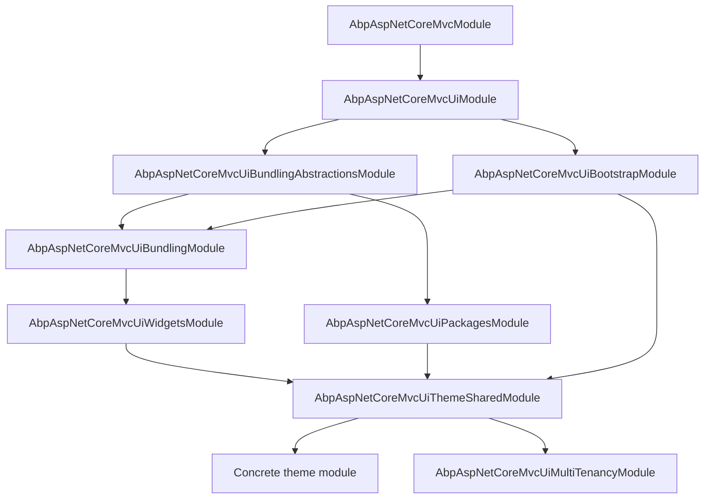

The ABP MVC UI layer is the bridge between the framework's modular runtime and a
classical ASP.NET Core MVC / Razor Pages application. It owns theming, layout
selection, alerts, the [`AbpPageModel`](https://github.com/abpframework/abp/blob/dev/framework/src/Volo.Abp.AspNetCore.Mvc.UI/Volo/Abp/AspNetCore/Mvc/UI/RazorPages/AbpPageModel.cs)
base class and a family of helper packages — Bootstrap tag helpers, a bundling
pipeline, widgets, third‑party client packages, and the Theme.Shared base that
every concrete theme builds on. The packages all live under
`framework/src/Volo.Abp.AspNetCore.Mvc.UI*` in the
[abpframework/abp](https://github.com/abpframework/abp) repository and are
designed to compose: an MVC theme module typically depends on Theme.Shared,
which pulls in Widgets, Bundling, Packages and Bootstrap, which themselves
depend on the bare `AbpAspNetCoreMvcUiModule` and the web layer described in
[Web overview](/web/overview).

## Packages at a glance

Each row below is an independent NuGet package and ABP module. The
`[DependsOn]` graph is what wires them together at runtime — picking the
left‑most module you need typically pulls the rest.

| Package | Module class | Purpose |
| --- | --- | --- |
| `Volo.Abp.AspNetCore.Mvc.UI` | `AbpAspNetCoreMvcUiModule` | Theming abstractions, `AbpPageModel`, `IPageLayout`, alerts, layout hooks |
| `Volo.Abp.AspNetCore.Mvc.UI.Bootstrap` | `AbpAspNetCoreMvcUiBootstrapModule` | Bootstrap 5 tag helpers (form, grid, card, modal, tabs, ...) |
| `Volo.Abp.AspNetCore.Mvc.UI.Bundling.Abstractions` | `AbpAspNetCoreMvcUiBundlingAbstractionsModule` | `AbpBundlingOptions`, `BundleConfiguration`, `IBundleContributor` |
| `Volo.Abp.AspNetCore.Mvc.UI.Bundling` | `AbpAspNetCoreMvcUiBundlingModule` | `BundleManager`, JS/CSS bundlers, `abp-script*`/`abp-style*` tag helpers |
| `Volo.Abp.AspNetCore.Mvc.UI.Widgets` | `AbpAspNetCoreMvcUiWidgetsModule` | `[Widget]` attribute, `IWidgetManager`, `IPageWidgetManager` |
| `Volo.Abp.AspNetCore.Mvc.UI.Packages` | `AbpAspNetCoreMvcUiPackagesModule` | `BundleContributor` implementations for jQuery, Bootstrap, DataTables, Select2, ... |
| `Volo.Abp.AspNetCore.Mvc.UI.Theme.Shared` | `AbpAspNetCoreMvcUiThemeSharedModule` | Shared layouts, error page, toolbars, page toolbars, `Global` bundles |
| `Volo.Abp.AspNetCore.Mvc.UI.MultiTenancy` | `AbpAspNetCoreMvcUiMultiTenancyModule` | Tenant switch modal, `AbpTenantController`, `tenant-switch.js` |
| `Volo.Abp.Minify` | `AbpMinifyModule` | `IJavascriptMinifier`, `ICssMinifier`, `IHtmlMinifier` via NUglify |

<Info>
The MVC UI stack is independent of any concrete theme. A theme module (for
example `Volo.Abp.AspNetCore.Mvc.UI.Theme.Basic`, LeptonX, or a commercial
theme) plugs into these abstractions by implementing
[`ITheme`](https://github.com/abpframework/abp/blob/dev/framework/src/Volo.Abp.AspNetCore.Mvc.UI/Volo/Abp/AspNetCore/Mvc/UI/Theming/ITheme.cs)
and registering through `AbpThemingOptions`. See
[Theming overview](/themes/overview).
</Info>

## AbpAspNetCoreMvcUiModule

`AbpAspNetCoreMvcUiModule` is the smallest piece of the stack. It registers
the assembly as an MVC application part and mounts its embedded files into the
[Virtual File System](/vfs/overview) so views, view components and static
client assets are discoverable by other modules.

```csharp title="framework/src/Volo.Abp.AspNetCore.Mvc.UI/Volo/Abp/AspNetCore/Mvc/UI/AbpAspNetCoreMvcUiModule.cs"
[DependsOn(typeof(AbpAspNetCoreMvcModule))]
[DependsOn(typeof(AbpUiNavigationModule))]
public class AbpAspNetCoreMvcUiModule : AbpModule
{
    public override void PreConfigureServices(ServiceConfigurationContext context)
    {
        PreConfigure<IMvcBuilder>(mvcBuilder =>
        {
            mvcBuilder.AddApplicationPartIfNotExists(typeof(AbpAspNetCoreMvcUiModule).Assembly);
        });
    }

    public override void ConfigureServices(ServiceConfigurationContext context)
    {
        Configure<AbpVirtualFileSystemOptions>(options =>
        {
            options.FileSets.AddEmbedded<AbpAspNetCoreMvcUiModule>();
        });
    }
}
```

It depends on `AbpAspNetCoreMvcModule` (the MVC integration discussed in
[ASP.NET Core MVC module](/web/aspnet-core-module)) and on
`AbpUiNavigationModule` for the menu abstractions referenced by the theming
layer.

### AbpMvcUiOptions

A small options object exposes a couple of URLs that the framework needs to
know about — for redirects in [`AbpPageModel`](#abppagemodel-and-friends) and
for theme components that render Login/Logout links.

```csharp title="framework/src/Volo.Abp.AspNetCore.Mvc.UI/Volo/Abp/AspNetCore/Mvc/UI/AbpMvcUiOptions.cs"
public class AbpMvcUiOptions
{
    public string LoginUrl  { get; set; } = "/Account/Login";
    public string LogoutUrl { get; set; } = "/Account/Logout";
}
```

## Architecture



Reading the graph from top to bottom: `Ui` provides theming primitives and
the `AbpPageModel` base; `Bootstrap` and the bundling layer compose CSS/JS
delivery; `Widgets` and `Packages` add reusable building blocks; and
`Theme.Shared` glues everything into the layouts, toolbars and error pages
that concrete themes specialise.

## Theming abstractions

Themes are first‑class citizens. The runtime exposes a single
`IThemeManager` that returns the active theme; the theme itself is a tiny
contract that maps a logical layout name to a Razor view path.

```csharp title="framework/src/Volo.Abp.AspNetCore.Mvc.UI/Volo/Abp/AspNetCore/Mvc/UI/Theming/IThemeManager.cs"
public interface IThemeManager
{
    ITheme CurrentTheme { get; }
}
```

```csharp title="framework/src/Volo.Abp.AspNetCore.Mvc.UI/Volo/Abp/AspNetCore/Mvc/UI/Theming/ITheme.cs"
public interface ITheme
{
    string GetLayout(string name, bool fallbackToDefault = true);
}
```

Standard layout names are a closed set of constants so that themes and
applications agree on intent without hard‑coding strings:

```csharp title="framework/src/Volo.Abp.AspNetCore.Mvc.UI/Volo/Abp/AspNetCore/Mvc/UI/Theming/StandardLayouts.cs"
public static class StandardLayouts
{
    public const string Application = "Application";
    public const string Account     = "Account";
    public const string Public      = "Public";
    public const string Empty       = "Empty";
}
```

Themes are registered through `AbpThemingOptions.Themes` (a
`ThemeDictionary` keyed by name), with an optional default:

```csharp title="framework/src/Volo.Abp.AspNetCore.Mvc.UI/Volo/Abp/AspNetCore/Mvc/UI/Theming/AbpThemingOptions.cs"
public class AbpThemingOptions
{
    public ThemeDictionary Themes { get; }
    public string? DefaultThemeName { get; set; }
}
```

A `[ThemeName("Basic")]` attribute on the `ITheme` implementation feeds
`ThemeInfo.Name`, which is what the `ThemeDictionary` is indexed by. Selection
flows through `IThemeSelector`, which the default
`DefaultThemeManager` reads to materialise `CurrentTheme`.

<Info>
The full theming lifecycle — selectors, theme modules, where Basic Theme and
LeptonX hook in — is covered in [Theming overview](/themes/overview). This
page only describes the surface area that lives inside the MVC UI layer.
</Info>

## Page layout and breadcrumbs

Each request has a scoped `IPageLayout` that carries page‑level metadata
(title, current menu item, breadcrumb items) consumed by the layout. The
default implementation is registered as `IScopedDependency`:

```csharp title="framework/src/Volo.Abp.AspNetCore.Mvc.UI/Volo/Abp/AspNetCore/Mvc/UI/Layout/PageLayout.cs"
public class PageLayout : IPageLayout, IScopedDependency
{
    public ContentLayout Content { get; }

    public PageLayout()
    {
        Content = new ContentLayout();
    }
}
```

`ContentLayout` owns the breadcrumb model and decides whether the bar should
render:

```csharp title="framework/src/Volo.Abp.AspNetCore.Mvc.UI/Volo/Abp/AspNetCore/Mvc/UI/Layout/ContentLayout.cs"
public class ContentLayout
{
    public string? Title { get; set; }
    public BreadCrumb BreadCrumb { get; }
    public string? MenuItemName { get; set; }

    public virtual bool ShouldShowBreadCrumb()
    {
        if (BreadCrumb.Items.Any())            return true;
        if (BreadCrumb.ShowCurrent && !Title.IsNullOrEmpty()) return true;
        return false;
    }
}
```

```csharp title="framework/src/Volo.Abp.AspNetCore.Mvc.UI/Volo/Abp/AspNetCore/Mvc/UI/Layout/BreadCrumb.cs"
public class BreadCrumb
{
    public bool ShowHome    { get; set; } = true;
    public bool ShowCurrent { get; set; } = true;
    public List<BreadCrumbItem> Items { get; }

    public void Add(string text, string? url = null, string? icon = null)
    {
        Items.Add(new BreadCrumbItem(text, url, icon));
    }
}
```

Pages typically populate these in `OnGet`:

```csharp
public void OnGet()
{
    PageLayout.Content.Title = L["Books"].Value;
    PageLayout.Content.BreadCrumb.Add(L["Library"].Value, "/library");
    PageLayout.Content.MenuItemName = "Books";
}
```

The current theme's `_Layout.cshtml` reads `PageLayout.Content` and renders
the breadcrumb only when `ShouldShowBreadCrumb()` returns `true`.

## Alerts

`IAlertManager` is the request‑scoped store used to surface "flash" style
messages (errors, success notifications, warnings) into the layout.

```csharp title="framework/src/Volo.Abp.AspNetCore.Mvc.UI/Volo/Abp/AspNetCore/Mvc/UI/Alerts/IAlertManager.cs"
public interface IAlertManager
{
    AlertList Alerts { get; }
}
```

```csharp title="framework/src/Volo.Abp.AspNetCore.Mvc.UI/Volo/Abp/AspNetCore/Mvc/UI/Alerts/AlertType.cs"
public enum AlertType
{
    Default, Primary, Secondary, Success,
    Danger, Warning, Info, Light, Dark
}
```

```csharp title="framework/src/Volo.Abp.AspNetCore.Mvc.UI/Volo/Abp/AspNetCore/Mvc/UI/Alerts/AlertMessage.cs"
public class AlertMessage
{
    public string  Text       { get; set; }
    public AlertType Type     { get; set; }
    public string? Title      { get; set; }
    public bool    Dismissible { get; set; }

    public AlertMessage(AlertType type, string text, string? title = null, bool dismissible = true)
    {
        Type = type; Text = text; Title = title; Dismissible = dismissible;
    }
}
```

`AbpPageModel` exposes `Alerts` as a shortcut so handlers can write
`Alerts.Success(L["Saved"]);` and have the layout render the message on the
next view.

## AbpPageModel and friends

`AbpPageModel` is the base class every ABP Razor Page inherits from. It
exposes lazily‑resolved framework services — current user, clock, settings,
authorization, object mapper, alerts, app URL provider, page layout — so
page models stay focused on request logic.

```csharp title="framework/src/Volo.Abp.AspNetCore.Mvc.UI/Volo/Abp/AspNetCore/Mvc/UI/RazorPages/AbpPageModel.cs"
public abstract class AbpPageModel : PageModel
{
    public IAbpLazyServiceProvider LazyServiceProvider { get; set; } = default!;

    protected IClock              Clock              => LazyServiceProvider.LazyGetRequiredService<IClock>();
    protected AlertList           Alerts             => AlertManager.Alerts;
    protected IUnitOfWorkManager  UnitOfWorkManager  => LazyServiceProvider.LazyGetRequiredService<IUnitOfWorkManager>();
    protected IObjectMapper       ObjectMapper       => /* resolved via ObjectMapperContext */;
    protected IGuidGenerator      GuidGenerator      => LazyServiceProvider.LazyGetService<IGuidGenerator>(SimpleGuidGenerator.Instance);
    protected IStringLocalizer    L                  => /* created via StringLocalizerFactory */;
    protected ICurrentUser        CurrentUser        => LazyServiceProvider.LazyGetRequiredService<ICurrentUser>();
    protected ICurrentTenant      CurrentTenant      => LazyServiceProvider.LazyGetRequiredService<ICurrentTenant>();
    protected ISettingProvider    SettingProvider    => LazyServiceProvider.LazyGetRequiredService<ISettingProvider>();
    protected IAuthorizationService AuthorizationService => LazyServiceProvider.LazyGetRequiredService<IAuthorizationService>();
    protected IAlertManager       AlertManager       => LazyServiceProvider.LazyGetRequiredService<IAlertManager>();
    protected IAppUrlProvider     AppUrlProvider     => LazyServiceProvider.LazyGetRequiredService<IAppUrlProvider>();
}
```

It also offers helpers:

| Member | Purpose |
| --- | --- |
| `ValidateModel()` | Calls `IModelStateValidator.Validate(ModelState)`; throws `AbpValidationException` on failure. |
| `CheckPolicyAsync(string)` | Delegates to `IAuthorizationService.CheckAsync(...)`. |
| `RedirectSafely(returnUrl, returnUrlHash)` | Returns `Redirect` to a *safe* URL — local URL or whitelisted by `IAppUrlProvider.IsRedirectAllowedUrl`; falls back to `~/` otherwise. |
| `PartialView<TModel>(viewName, model)` | Convenience overload preserving `ViewData`/`TempData`. |
| `LocalizationResourceType` | Lets a page select a specific localization resource for `L`. |

`AbpPage` mirrors the same pattern for Razor `Page` classes that aren't using
the page‑model style.

## Layout hooks

The MVC UI module ships a `LayoutHookViewComponent` that materialises
named hook points in a layout, so themes don't need to know what extensions
applications or other modules want to render.

```csharp title="framework/src/Volo.Abp.AspNetCore.Mvc.UI/Volo/Abp/AspNetCore/Mvc/UI/Components/LayoutHook/LayoutHookViewComponent.cs"
public virtual IViewComponentResult Invoke(string name, string? layout)
{
    var hooks = Options.Hooks.GetOrDefault(name)?
        .Where(x => IsViewComponent(x) && (string.IsNullOrWhiteSpace(x.Layout) || x.Layout == layout))
        .ToArray() ?? Array.Empty<LayoutHookInfo>();

    return View(
        "~/Volo/Abp/AspNetCore/Mvc/UI/Components/LayoutHook/Default.cshtml",
        new LayoutHookViewModel(hooks, layout)
    );
}
```

There's a matching extension method so views read naturally:

```csharp title="framework/src/Volo.Abp.AspNetCore.Mvc.UI/Volo/Abp/AspNetCore/Mvc/UI/Components/LayoutHook/ViewComponentHelperLayoutHookExtensions.cs"
public static Task<IHtmlContent> InvokeLayoutHookAsync(
    this IViewComponentHelper componentHelper,
    string name,
    string layout)
{
    return componentHelper.InvokeAsync(
        typeof(LayoutHookViewComponent),
        new { name = name, layout = layout });
}
```

Hooks are registered through `AbpLayoutHookOptions` and consumed by themes
inside `_Layout.cshtml` with calls like
`@await Component.InvokeLayoutHookAsync(LayoutHooks.Head.Last, "Application")`.
The hook names themselves come from the navigation/theming modules; see
[Theming overview](/themes/overview).

## File inventory — `Volo.Abp.AspNetCore.Mvc.UI`

| Folder | Notable types | Purpose |
| --- | --- | --- |
| `AbpAspNetCoreMvcUiModule.cs` | `AbpAspNetCoreMvcUiModule` | Module entry point: app part + embedded VFS |
| `AbpMvcUiOptions.cs` | `AbpMvcUiOptions` | `LoginUrl`, `LogoutUrl` defaults |
| `Theming/` | `IThemeManager`, `ITheme`, `AbpThemingOptions`, `DefaultThemeManager`, `DefaultThemeSelector`, `IThemeSelector`, `ThemeDictionary`, `ThemeInfo`, `ThemeNameAttribute`, `StandardLayouts` | Theme contract + selection |
| `Layout/` | `IPageLayout`, `PageLayout`, `ContentLayout`, `BreadCrumb`, `BreadCrumbItem` | Page‑scoped layout metadata |
| `Alerts/` | `IAlertManager`, `AlertManager`, `AlertList`, `AlertMessage`, `AlertType` | Flash messages |
| `RazorPages/` | `AbpPage`, `AbpPageModel`, `ServiceBasedPageModelActivatorProvider` | Razor Pages base classes |
| `Components/LayoutHook/` | `LayoutHookViewComponent`, `Default.cshtml`, `ViewComponentHelperLayoutHookExtensions` | Layout hook rendering |
| `ObjectExtending/` | `MvcUiObjectExtensionPropertyInfoExtensions` | Extension‑property → UI metadata helpers |

## Where to go next

<CardGroup cols={2}>
  <Card title="Bootstrap tag helpers" href="/ui-mvc/bootstrap">
    Form, grid, card, modal, tabs, alerts — every abp-* tag helper that
    ships with Bootstrap 5.
  </Card>
  <Card title="Bundling" href="/ui-mvc/bundling">
    BundleManager, AbpBundlingOptions, runtime bundling and minification.
  </Card>
  <Card title="Bundling abstractions" href="/ui-mvc/bundling-abstractions">
    BundleConfiguration, IBundleContributor, the dependency‑aware contributor
    pipeline.
  </Card>
  <Card title="Widgets" href="/ui-mvc/widgets">
    The [Widget] attribute, IWidgetManager and IPageWidgetManager.
  </Card>
  <Card title="Packages &amp; tag helpers" href="/ui-mvc/packages-tag-helpers">
    Bundle contributors for jQuery, Bootstrap, DataTables, Select2,
    SweetAlert2, Moment, Luxon, ...
  </Card>
  <Card title="Theme.Shared" href="/ui-mvc/theme-shared">
    Shared layouts, global bundles, error page, toolbars, page toolbars.
  </Card>
  <Card title="Multi-tenancy UI" href="/ui-mvc/multi-tenancy-ui">
    AbpTenantController and the tenant switch modal.
  </Card>
  <Card title="Minify" href="/ui-mvc/minify">
    IJavascriptMinifier, ICssMinifier and the NUglify implementation.
  </Card>
</CardGroup>
