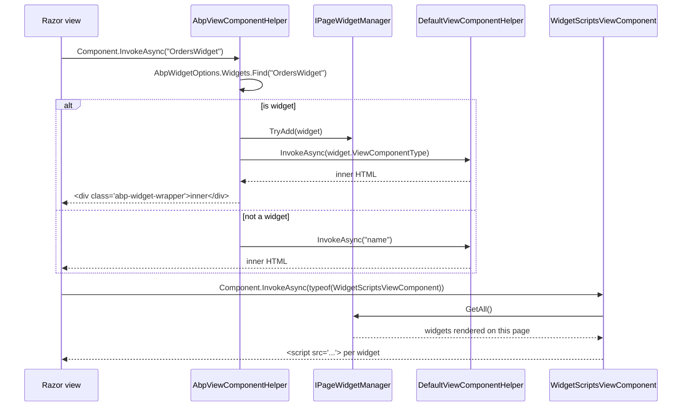

`Volo.Abp.AspNetCore.Mvc.UI.Widgets` upgrades plain ASP.NET Core view
components into *widgets*: discoverable, authorizable, refreshable building
blocks that themes assemble into dashboards. The package adds the
`[Widget]` attribute, the `WidgetDefinition` model, an `IWidgetManager` for
authorization checks, a per‑request `IPageWidgetManager` that tracks which
widgets actually rendered on the current page, two view components that
emit the corresponding script/style markup at the bottom of the layout,
and an `AbpViewComponentHelper` that wraps `IViewComponentHelper` so the
plumbing kicks in transparently whenever Razor calls
`@await Component.InvokeAsync(...)`.

## Module entry point

```csharp title="framework/src/Volo.Abp.AspNetCore.Mvc.UI.Widgets/Volo/Abp/AspNetCore/Mvc/UI/Widgets/AbpAspNetCoreMvcUiWidgetsModule.cs"
[DependsOn(
    typeof(AbpAspNetCoreMvcUiBootstrapModule),
    typeof(AbpAspNetCoreMvcUiBundlingModule)
)]
public class AbpAspNetCoreMvcUiWidgetsModule : AbpModule
{
    public override void PreConfigureServices(ServiceConfigurationContext context)
    {
        PreConfigure<IMvcBuilder>(mvcBuilder =>
        {
            mvcBuilder.AddApplicationPartIfNotExists(typeof(AbpAspNetCoreMvcUiWidgetsModule).Assembly);
        });

        AutoAddWidgets(context.Services);
    }

    public override void ConfigureServices(ServiceConfigurationContext context)
    {
        context.Services.AddTransient<DefaultViewComponentHelper>();

        Configure<AbpVirtualFileSystemOptions>(options =>
        {
            options.FileSets.AddEmbedded<AbpAspNetCoreMvcUiWidgetsModule>();
        });
    }

    private static void AutoAddWidgets(IServiceCollection services)
    {
        var widgetTypes = new List<Type>();
        services.OnRegistered(context =>
        {
            if (WidgetAttribute.IsWidget(context.ImplementationType))
            {
                widgetTypes.Add(context.ImplementationType);
            }
        });

        services.Configure<AbpWidgetOptions>(options =>
        {
            foreach (var widgetType in widgetTypes)
            {
                options.Widgets.Add(new WidgetDefinition(widgetType));
            }
        });
    }
}
```

Two highlights:

1. **Auto‑registration.** `AutoAddWidgets` hooks `services.OnRegistered`,
   the ABP DI extension that fires for every service the framework
   registers. Any type marked with `[Widget]` is converted to a
   `WidgetDefinition` and added to `AbpWidgetOptions.Widgets`.
2. **`DefaultViewComponentHelper`.** The default MVC helper is added as a
   transient service so that the ABP override (`AbpViewComponentHelper`)
   can delegate to it whenever the requested component is *not* a widget.

## [Widget] attribute

`[Widget]` marks a view component as a widget and carries everything the
runtime needs to render it safely:

```csharp title="framework/src/Volo.Abp.AspNetCore.Mvc.UI.Widgets/Volo/Abp/AspNetCore/Mvc/UI/Widgets/WidgetAttribute.cs"
[AttributeUsage(AttributeTargets.Class)]
public class WidgetAttribute : Attribute
{
    public string[]? StyleFiles  { get; set; }
    public Type[]?   StyleTypes  { get; set; }
    public string[]? ScriptFiles { get; set; }
    public Type[]?   ScriptTypes { get; set; }

    public string? DisplayName          { get; set; }
    public Type?   DisplayNameResource  { get; set; }

    public string[]? RequiredPolicies     { get; set; }
    public bool      RequiresAuthentication { get; set; }

    public string? RefreshUrl    { get; set; }
    public bool    AutoInitialize { get; set; }

    public static bool IsWidget(Type type)
        => type.IsSubclassOf(typeof(ViewComponent))
        && type.IsDefined(typeof(WidgetAttribute), true);

    public static WidgetAttribute Get(Type viewComponentType)
        => viewComponentType.GetCustomAttribute<WidgetAttribute>(true)
           ?? throw new AbpException($"Given type '{viewComponentType.AssemblyQualifiedName}' does not declare a {typeof(WidgetAttribute).AssemblyQualifiedName}");
}
```

| Property | Purpose |
| --- | --- |
| `StyleFiles` / `StyleTypes` | CSS files or `BundleContributor` types this widget needs |
| `ScriptFiles` / `ScriptTypes` | Equivalent for JavaScript |
| `DisplayName` / `DisplayNameResource` | Localizable display name shown in admin UIs |
| `RequiredPolicies` | Authorization policy names; all must succeed |
| `RequiresAuthentication` | Anonymous users blocked when no `RequiredPolicies` are specified |
| `RefreshUrl` | URL invoked by `widget-manager.js` to re‑render the widget |
| `AutoInitialize` | Render `data-widget-auto-init="true"` so the front‑end manager initialises it on load |

A real widget looks like:

```csharp
[Widget(
    RefreshUrl   = "/Dashboard/RefreshOrdersWidget",
    AutoInitialize = true,
    ScriptFiles  = new[] { "/widgets/orders/widget.js" },
    StyleFiles   = new[] { "/widgets/orders/widget.css" },
    RequiredPolicies = new[] { "Dashboard.Orders" }
)]
public class OrdersWidgetViewComponent : AbpViewComponent
{
    public IViewComponentResult Invoke() => View(new OrdersWidgetViewModel());
}
```

## WidgetDefinition

`WidgetDefinition` is the canonical model registered into
`AbpWidgetOptions`. It snapshots the attribute into immutable lists, derives
a unique name (the explicit `[ViewComponent(Name="...")]` if present,
otherwise the class name minus the `ViewComponent` suffix), and exposes
fluent `With*` helpers for programmatic registration:

```csharp title="framework/src/Volo.Abp.AspNetCore.Mvc.UI.Widgets/Volo/Abp/AspNetCore/Mvc/UI/Widgets/WidgetDefinition.cs"
public class WidgetDefinition
{
    public string                 Name              { get; }
    public WidgetAttribute        WidgetAttribute   { get; }
    public ILocalizableString     DisplayName       { get; set; }
    public Type                   ViewComponentType { get; }
    public List<string>           RequiredPolicies  { get; }
    public bool                   RequiresAuthentication { get; set; }
    public List<WidgetResourceItem> Styles  { get; }
    public List<WidgetResourceItem> Scripts { get; }
    public string?                RefreshUrl     { get; set; }
    public bool                   AutoInitialize { get; set; }

    public WidgetDefinition WithRequiredPolicies(params string[] policyNames);
    public WidgetDefinition WithRequiresAuthentication(bool value = true);
    public WidgetDefinition WithStyles(params string[] files);
    public WidgetDefinition WithStyles(params Type[] bundleContributorTypes);
    public WidgetDefinition WithScripts(params string[] files);
    public WidgetDefinition WithScripts(params Type[] bundleContributorTypes);
    public WidgetDefinition WithRefreshUrl(string refreshUrl);
}
```

`WidgetResourceItem` is a small discriminated value object that holds
either a literal file path or a `BundleContributor` type:

```csharp title="framework/src/Volo.Abp.AspNetCore.Mvc.UI.Widgets/Volo/Abp/AspNetCore/Mvc/UI/Widgets/WidgetResourceItem.cs"
public class WidgetResourceItem
{
    public string? Src  { get; }
    public Type?   Type { get; }

    public WidgetResourceItem(string src)  { Src  = src; }
    public WidgetResourceItem(Type type)   { Type = type; }
}
```

## AbpWidgetOptions

```csharp title="framework/src/Volo.Abp.AspNetCore.Mvc.UI.Widgets/Volo/Abp/AspNetCore/Mvc/UI/Widgets/AbpWidgetOptions.cs"
public class AbpWidgetOptions
{
    public WidgetDefinitionCollection Widgets { get; }
    public AbpWidgetOptions() { Widgets = new WidgetDefinitionCollection(); }
}
```

`WidgetDefinitionCollection` is dual‑indexed (by name and by
`ViewComponentType`) so the runtime can resolve a widget from either
identifier:

```csharp title="framework/src/Volo.Abp.AspNetCore.Mvc.UI.Widgets/Volo/Abp/AspNetCore/Mvc/UI/Widgets/WidgetDefinitionCollection.cs"
public class WidgetDefinitionCollection
{
    public void Add(WidgetDefinition widget);
    public WidgetDefinition Add<TViewComponent>(ILocalizableString? displayName = null);
    public WidgetDefinition Add(Type viewComponentType, ILocalizableString? displayName = null);

    public WidgetDefinition? Find(string name);
    public WidgetDefinition? Find<TViewComponent>();
    public WidgetDefinition? Find(Type viewComponentType);

    public IReadOnlyCollection<WidgetDefinition> GetAll();
}
```

Programmatic registration (skipping the attribute) is therefore just:

```csharp
Configure<AbpWidgetOptions>(options =>
{
    options.Widgets
        .Add<OrdersWidgetViewComponent>()
        .WithRequiredPolicies("Dashboard.Orders")
        .WithScripts("/widgets/orders/widget.js")
        .WithRefreshUrl("/Dashboard/RefreshOrdersWidget");
});
```

## IWidgetManager

Authorization is centralised behind `IWidgetManager`. Themes call it to
decide whether to render a widget link or button; the rendering pipeline
itself does **not** call it — see [Authorization on render](#authorization-on-render).

```csharp title="framework/src/Volo.Abp.AspNetCore.Mvc.UI.Widgets/Volo/Abp/AspNetCore/Mvc/UI/Widgets/IWidgetManager.cs"
public interface IWidgetManager : ITransientDependency
{
    Task<bool> IsGrantedAsync(Type widgetComponentType);
    Task<bool> IsGrantedAsync(string name);
}
```

```csharp title="framework/src/Volo.Abp.AspNetCore.Mvc.UI.Widgets/Volo/Abp/AspNetCore/Mvc/UI/Widgets/WidgetManager.cs"
public class WidgetManager : IWidgetManager
{
    public async Task<bool> IsGrantedAsync(Type widgetComponentType)
    {
        var widget = Options.Widgets.Find(widgetComponentType);
        return await IsGrantedAsyncInternal(widget, widgetComponentType.FullName!);
    }

    public async Task<bool> IsGrantedAsync(string name)
    {
        var widget = Options.Widgets.Find(name);
        return await IsGrantedAsyncInternal(widget, name);
    }

    private async Task<bool> IsGrantedAsyncInternal(WidgetDefinition? widget, string wantedWidgetName)
    {
        if (widget == null) throw new ArgumentNullException(wantedWidgetName);

        if (widget.RequiredPolicies.Any())
        {
            foreach (var requiredPolicy in widget.RequiredPolicies)
            {
                if (!(await AuthorizationService.AuthorizeAsync(requiredPolicy)).Succeeded)
                    return false;
            }
        }
        else if (widget.RequiresAuthentication && !CurrentUser.IsAuthenticated)
        {
            return false;
        }

        return true;
    }
}
```

The rules are simple and deterministic:

- If `RequiredPolicies` is non‑empty **all** must succeed.
- Otherwise, if `RequiresAuthentication` is true and the user is anonymous,
  access is denied.
- Otherwise the widget is granted.

## IPageWidgetManager

`IPageWidgetManager` records which widgets actually rendered on the
current page so the two trailing view components can emit the right
`<script>`/`<link>` tags. It is scoped per request and backed by the
`HttpContext.Items` bag so it survives any async boundary inside a single
request.

```csharp title="framework/src/Volo.Abp.AspNetCore.Mvc.UI.Widgets/Volo/Abp/AspNetCore/Mvc/UI/Widgets/IPageWidgetManager.cs"
public interface IPageWidgetManager
{
    bool TryAdd(WidgetDefinition widget);
    IReadOnlyList<WidgetDefinition> GetAll();
}
```

```csharp title="framework/src/Volo.Abp.AspNetCore.Mvc.UI.Widgets/Volo/Abp/AspNetCore/Mvc/UI/Widgets/PageWidgetManager.cs"
public class PageWidgetManager : IPageWidgetManager, IScopedDependency
{
    public const string HttpContextItemName = "__AbpCurrentWidgets";

    public bool TryAdd(WidgetDefinition widget)
        => GetWidgetList().AddIfNotContains(widget);

    private List<WidgetDefinition> GetWidgetList()
    {
        var httpContext = _httpContextAccessor.HttpContext
            ?? throw new AbpException(
                $"{typeof(PageWidgetManager).AssemblyQualifiedName} should be used in a web request!");

        if (httpContext.Items[HttpContextItemName] is not List<WidgetDefinition> widgets)
        {
            widgets = new List<WidgetDefinition>();
            httpContext.Items[HttpContextItemName] = widgets;
        }

        return widgets;
    }
}
```

## AbpViewComponentHelper

`AbpViewComponentHelper` replaces the default `IViewComponentHelper` via
`[Dependency(ReplaceServices = true)]`. Every `@await Component.InvokeAsync(...)`
in a Razor view goes through this class:

```csharp title="framework/src/Volo.Abp.AspNetCore.Mvc.UI.Widgets/Volo/Abp/AspNetCore/Mvc/UI/Widgets/AbpViewComponentHelper.cs"
[Dependency(ReplaceServices = true)]
public class AbpViewComponentHelper : IViewComponentHelper, IViewContextAware, ITransientDependency
{
    public virtual async Task<IHtmlContent> InvokeAsync(string name, object? arguments)
    {
        var widget = Options.Widgets.Find(name);
        if (widget == null)
            return await DefaultViewComponentHelper.InvokeAsync(name, arguments);
        return await InvokeWidgetAsync(arguments, widget);
    }

    public virtual async Task<IHtmlContent> InvokeAsync(Type componentType, object? arguments)
    {
        var widget = Options.Widgets.Find(componentType);
        if (widget == null)
            return await DefaultViewComponentHelper.InvokeAsync(componentType, arguments);
        return await InvokeWidgetAsync(arguments, widget);
    }

    protected virtual async Task<IHtmlContent> InvokeWidgetAsync(object? arguments, WidgetDefinition widget)
    {
        PageWidgetManager.TryAdd(widget);

        var wrapperAttributesBuilder = new StringBuilder(
            $"class=\"abp-widget-wrapper\" data-widget-name=\"{widget.Name}\"");

        if (widget.RefreshUrl != null)
            wrapperAttributesBuilder.Append($" data-refresh-url=\"{widget.RefreshUrl}\"");

        if (widget.AutoInitialize)
            wrapperAttributesBuilder.Append(" data-widget-auto-init=\"true\"");

        return new HtmlContentBuilder()
            .AppendHtml($"<div {wrapperAttributesBuilder}>")
            .AppendHtml(await DefaultViewComponentHelper.InvokeAsync(widget.ViewComponentType, arguments))
            .AppendHtml("</div>");
    }
}
```

For a widget the helper:

1. records the widget in `IPageWidgetManager`,
2. wraps the inner component output in an `<div class="abp-widget-wrapper">`
   carrying the widget metadata (`data-widget-name`, `data-refresh-url`,
   `data-widget-auto-init`),
3. delegates the actual render to the original
   `DefaultViewComponentHelper`.

For a non‑widget component it transparently forwards to the default
helper, so existing view components keep behaving exactly as before.

### Authorization on render

`AbpViewComponentHelper` does **not** call `IWidgetManager.IsGrantedAsync`
itself. The convention is that the **caller** (a layout, a dashboard view,
a menu) checks `IsGrantedAsync` before invoking the widget, typically
inside a conditional in Razor. That way unauthorized widgets are skipped
entirely instead of rendering an empty wrapper.

## Resource view components

Two view components emit the cumulative resources for every widget that
rendered on the page. Themes render them at the end of `_Layout.cshtml`.

```csharp title="framework/src/Volo.Abp.AspNetCore.Mvc.UI.Widgets/Volo/Abp/AspNetCore/Mvc/UI/Widgets/Components/WidgetScripts/WidgetScriptsViewComponent.cs"
public class WidgetScriptsViewComponent : AbpViewComponent
{
    public virtual IViewComponentResult Invoke()
        => View(
            "~/Volo/Abp/AspNetCore/Mvc/UI/Widgets/Components/WidgetScripts/Default.cshtml",
            new WidgetResourcesViewModel { Widgets = PageWidgetManager.GetAll() });
}
```

`WidgetStylesViewComponent` is the mirror image for stylesheets. The
shared view model is dead simple:

```csharp title="framework/src/Volo.Abp.AspNetCore.Mvc.UI.Widgets/Volo/Abp/AspNetCore/Mvc/UI/Widgets/Components/WidgetResourcesViewModel.cs"
public class WidgetResourcesViewModel
{
    public IReadOnlyList<WidgetDefinition> Widgets { get; set; } = default!;
}
```

In a theme layout these are invoked alongside the global bundle:

```cshtml
<abp-style-bundle name="@StandardBundles.Styles.Global" />
@await Component.InvokeAsync(typeof(WidgetStylesViewComponent))

@RenderBody()

<abp-script-bundle name="@StandardBundles.Scripts.Global" />
@await Component.InvokeAsync(typeof(WidgetScriptsViewComponent))
```

## End-to-end sequence



## File inventory — `Volo.Abp.AspNetCore.Mvc.UI.Widgets`

| File | Purpose |
| --- | --- |
| `AbpAspNetCoreMvcUiWidgetsModule.cs` | Module entry + auto‑discovery + `DefaultViewComponentHelper` registration |
| `AbpWidgetOptions.cs` | Options carrier (`Widgets`) |
| `WidgetAttribute.cs` | `[Widget(...)]` attribute |
| `WidgetDefinition.cs` | Snapshot model + fluent `With*` helpers |
| `WidgetDefinitionCollection.cs` | Dual-indexed (name, type) registry |
| `WidgetDimensions.cs` | Optional `Width`/`Height` helper for grid layouts |
| `WidgetResourceItem.cs` | One CSS/JS resource (file or contributor type) |
| `IWidgetManager.cs` / `WidgetManager.cs` | Authorization check (policies / authn) |
| `IPageWidgetManager.cs` / `PageWidgetManager.cs` | Per-request set of rendered widgets |
| `AbpViewComponentHelper.cs` | `IViewComponentHelper` override |
| `Components/WidgetScripts/WidgetScriptsViewComponent.cs` + `Default.cshtml` | Trailing script block |
| `Components/WidgetStyles/WidgetStylesViewComponent.cs` + `Default.cshtml` | Trailing style block |
| `Components/WidgetResourcesViewModel.cs` | Shared view model |

## Related pages

<CardGroup cols={2}>
  <Card title="MVC UI overview" href="/ui-mvc/overview">
    AbpAspNetCoreMvcUiModule, theming, and the package map.
  </Card>
  <Card title="Bundling" href="/ui-mvc/bundling">
    How widget StyleTypes / ScriptTypes participate in the bundling
    pipeline.
  </Card>
  <Card title="Theme.Shared" href="/ui-mvc/theme-shared">
    Where widget-manager.js and the supporting JavaScript live.
  </Card>
  <Card title="Authorization" href="/authz/overview">
    The IAuthorizationService that backs IWidgetManager.IsGrantedAsync.
  </Card>
</CardGroup>
