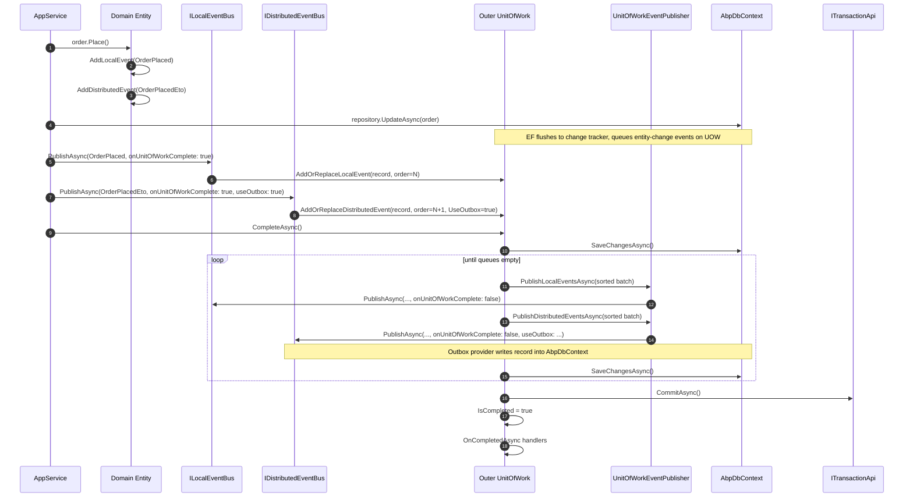

ABP's Unit of Work and Event Bus modules cooperate so that events raised during an application service call are *not* dispatched immediately. They are queued on the active UoW, sorted by emission order, and flushed only when the outermost UoW completes successfully — so an exception or rollback never leaks events to subscribers. The component that performs that flush is `UnitOfWorkEventPublisher`, a transient service that lives in `Volo.Abp.EventBus` and replaces the no-op default registered by `Volo.Abp.Uow`.

This page covers the contract (`IUnitOfWorkEventPublisher`), the queueing mechanics on `IUnitOfWork`, the actual publisher in `Volo.Abp.EventBus/Volo/Abp/EventBus/UnitOfWorkEventPublisher.cs`, and the order-of-operations during `CompleteAsync`. For the full commit/rollback machinery see [Transactions & SaveChanges](/uow/transactions-and-savechanges); for higher-level event-bus concepts see [Events](/events/overview).

## The contract: `IUnitOfWorkEventPublisher`

The interface is intentionally tiny — flush a batch of local events, flush a batch of distributed events:

```csharp title="framework/src/Volo.Abp.Uow/Volo/Abp/Uow/IUnitOfWorkEventPublisher.cs"
public interface IUnitOfWorkEventPublisher
{
    Task PublishLocalEventsAsync(IEnumerable<UnitOfWorkEventRecord> localEvents);

    Task PublishDistributedEventsAsync(IEnumerable<UnitOfWorkEventRecord> distributedEvents);
}
```

The default implementation is a no-op — it lets the UoW module work standalone in scenarios where neither event bus is referenced:

```csharp title="framework/src/Volo.Abp.Uow/Volo/Abp/Uow/NullUnitOfWorkEventPublisher.cs"
public class NullUnitOfWorkEventPublisher : IUnitOfWorkEventPublisher, ISingletonDependency
{
    public Task PublishLocalEventsAsync(IEnumerable<UnitOfWorkEventRecord> localEvents)
        => Task.CompletedTask;

    public Task PublishDistributedEventsAsync(IEnumerable<UnitOfWorkEventRecord> distributedEvents)
        => Task.CompletedTask;
}
```

When `Volo.Abp.EventBus` is referenced, the real publisher takes over via `[Dependency(ReplaceServices = true)]`.

## The queue: `UnitOfWorkEventRecord`

Every queued event is wrapped in this lightweight record:

```csharp title="framework/src/Volo.Abp.Uow/Volo/Abp/Uow/UnitOfWorkEventRecord.cs"
public class UnitOfWorkEventRecord
{
    public object EventData { get; }
    public Type EventType { get; }
    public long EventOrder { get; }
    public bool UseOutbox { get; }

    /// <summary>Extra properties can be used if needed.</summary>
    public Dictionary<string, object> Properties { get; } = new Dictionary<string, object>();

    public UnitOfWorkEventRecord(
        Type eventType,
        object eventData,
        long eventOrder,
        bool useOutbox = true)
    {
        EventType = eventType;
        EventData = eventData;
        EventOrder = eventOrder;
        UseOutbox = useOutbox;
    }
}
```

Two important fields:

- **`EventOrder`** is allocated from `EventOrderGenerator.GetNext()` — a process-wide `Interlocked.Increment` counter. This is how the publisher preserves causal order across mixed local/distributed events emitted by deeply nested calls.
- **`UseOutbox`** is forwarded to the distributed event bus so that — when the outbox pattern is configured — the publisher can write the event to an outbox table instead of the broker. This is a distributed-event-only concern; local publication ignores the flag.

```csharp title="framework/src/Volo.Abp.Uow/Volo/Abp/Uow/EventOrderGenerator.cs"
public static class EventOrderGenerator
{
    private static long _lastOrder;

    public static long GetNext()
    {
        return Interlocked.Increment(ref _lastOrder);
    }
}
```

## How events get into the queue

`IUnitOfWork` exposes two add/replace methods:

```csharp title="framework/src/Volo.Abp.Uow/Volo/Abp/Uow/IUnitOfWork.cs"
void AddOrReplaceLocalEvent(
    UnitOfWorkEventRecord eventRecord,
    Predicate<UnitOfWorkEventRecord>? replacementSelector = null
);

void AddOrReplaceDistributedEvent(
    UnitOfWorkEventRecord eventRecord,
    Predicate<UnitOfWorkEventRecord>? replacementSelector = null
);
```

`UnitOfWork` keeps two ordered lists and uses the same helper for both:

```csharp title="framework/src/Volo.Abp.Uow/Volo/Abp/Uow/UnitOfWork.cs"
protected List<UnitOfWorkEventRecord> DistributedEvents { get; } = new List<UnitOfWorkEventRecord>();
protected List<UnitOfWorkEventRecord> LocalEvents { get; } = new List<UnitOfWorkEventRecord>();

public virtual void AddOrReplaceLocalEvent(
    UnitOfWorkEventRecord eventRecord,
    Predicate<UnitOfWorkEventRecord>? replacementSelector = null)
{
    AddOrReplaceEvent(LocalEvents, eventRecord, replacementSelector);
}

public virtual void AddOrReplaceDistributedEvent(
    UnitOfWorkEventRecord eventRecord,
    Predicate<UnitOfWorkEventRecord>? replacementSelector = null)
{
    AddOrReplaceEvent(DistributedEvents, eventRecord, replacementSelector);
}

public virtual void AddOrReplaceEvent(
    List<UnitOfWorkEventRecord> eventRecords,
    UnitOfWorkEventRecord eventRecord,
    Predicate<UnitOfWorkEventRecord>? replacementSelector = null)
{
    if (replacementSelector == null)
    {
        eventRecords.Add(eventRecord);
    }
    else
    {
        var foundIndex = eventRecords.FindIndex(replacementSelector);
        if (foundIndex < 0)
        {
            eventRecords.Add(eventRecord);
        }
        else
        {
            eventRecords[foundIndex] = eventRecord;
        }
    }
}
```

`replacementSelector` is the entry point for **event coalescing**. EF Core's entity-change tracker uses it heavily: if an entity gets four `EntityUpdatedEto` events during a single UoW, the tracker replaces them with the latest, so subscribers receive one logical "update" instead of a noisy stream.

`ChildUnitOfWork` forwards both add methods to the parent, so events raised by deeply nested service calls end up on the outer UoW's queue with strictly increasing `EventOrder`:

```csharp title="framework/src/Volo.Abp.Uow/Volo/Abp/Uow/ChildUnitOfWork.cs"
public void AddOrReplaceLocalEvent(
    UnitOfWorkEventRecord eventRecord,
    Predicate<UnitOfWorkEventRecord>? replacementSelector = null)
{
    _parent.AddOrReplaceLocalEvent(eventRecord, replacementSelector);
}

public void AddOrReplaceDistributedEvent(
    UnitOfWorkEventRecord eventRecord,
    Predicate<UnitOfWorkEventRecord>? replacementSelector = null)
{
    _parent.AddOrReplaceDistributedEvent(eventRecord, replacementSelector);
}
```

### Where the queueing call originates

`ILocalEventBus.PublishAsync` and `IDistributedEventBus.PublishAsync` take an `onUnitOfWorkComplete` parameter (default `true`). When that flag is true and `IUnitOfWorkManager.Current != null`, the bus does not invoke handlers — it enqueues a `UnitOfWorkEventRecord` on the current UoW. When the UoW is null, or the caller passes `onUnitOfWorkComplete: false`, the bus dispatches immediately.

That dispatch-vs-queue decision is owned by the event bus classes (`LocalEventBus`, `DistributedEventBusBase` and friends in `Volo.Abp.EventBus`). The UoW just provides the storage and the deferred publication hook described below.

## `UnitOfWorkEventPublisher` — the real implementation

The publisher itself is a thin adapter that hands records off to the two buses, passing `onUnitOfWorkComplete: false` so they do **not** re-queue:

```csharp title="framework/src/Volo.Abp.EventBus/Volo/Abp/EventBus/UnitOfWorkEventPublisher.cs"
[Dependency(ReplaceServices = true)]
public class UnitOfWorkEventPublisher : IUnitOfWorkEventPublisher, ITransientDependency
{
    private readonly ILocalEventBus _localEventBus;
    private readonly IDistributedEventBus _distributedEventBus;

    public UnitOfWorkEventPublisher(
        ILocalEventBus localEventBus,
        IDistributedEventBus distributedEventBus)
    {
        _localEventBus = localEventBus;
        _distributedEventBus = distributedEventBus;
    }

    public async Task PublishLocalEventsAsync(IEnumerable<UnitOfWorkEventRecord> localEvents)
    {
        foreach (var localEvent in localEvents)
        {
            await _localEventBus.PublishAsync(
                localEvent.EventType,
                localEvent.EventData,
                onUnitOfWorkComplete: false
            );
        }
    }

    public async Task PublishDistributedEventsAsync(IEnumerable<UnitOfWorkEventRecord> distributedEvents)
    {
        foreach (var distributedEvent in distributedEvents)
        {
            await _distributedEventBus.PublishAsync(
                distributedEvent.EventType,
                distributedEvent.EventData,
                onUnitOfWorkComplete: false,
                useOutbox: distributedEvent.UseOutbox
            );
        }
    }
}
```

Three details to note:

1. **`[Dependency(ReplaceServices = true)]`** — the registration replaces `NullUnitOfWorkEventPublisher` whenever `Volo.Abp.EventBus` is loaded. There is no manual wire-up in user code.
2. **Sequential `await` per event.** The publisher does not parallelize — handlers run in the order ABP assigned via `EventOrder`. A throwing local handler aborts the loop, the exception bubbles back into `CompleteAsync`, and the UoW is failed/rolled back.
3. **`useOutbox: distributedEvent.UseOutbox`** is passed through. If the distributed event bus is wired to an outbox provider, the event is appended to the outbox table inside the same DB transaction — which is exactly why `CompleteAsync` interleaves event-publishing with `SaveChangesAsync` (see below).

## Publishing during `CompleteAsync`

The publish loop inside `CompleteAsync` is the heart of the integration:

```csharp title="framework/src/Volo.Abp.Uow/Volo/Abp/Uow/UnitOfWork.cs"
await SaveChangesAsync(cancellationToken);

while (LocalEvents.Any() || DistributedEvents.Any())
{
    if (LocalEvents.Any())
    {
        var localEventsToBePublished = LocalEvents.OrderBy(e => e.EventOrder).ToArray();
        LocalEvents.Clear();
        await UnitOfWorkEventPublisher.PublishLocalEventsAsync(localEventsToBePublished);
    }

    if (DistributedEvents.Any())
    {
        var distributedEventsToBePublished = DistributedEvents.OrderBy(e => e.EventOrder).ToArray();
        DistributedEvents.Clear();
        await UnitOfWorkEventPublisher.PublishDistributedEventsAsync(distributedEventsToBePublished);
    }

    await SaveChangesAsync(cancellationToken);
}

await CommitTransactionsAsync(cancellationToken);
```

### Why the `while` loop matters

A local event handler is allowed to modify state (e.g. write to a repository). When it does, EF Core's change tracker will queue *more* events — entity-change events, audit logs — and any of those handlers can in turn write more state. The loop guarantees:

- Every event handler runs inside the open DB transaction.
- Every state change made by a handler is flushed to the database (`SaveChangesAsync`) before the next round of events publishes.
- The loop converges only when both queues are empty after a save.

Distributed events use the same loop; the outbox provider typically captures them with the `SaveChangesAsync` call that follows.

### Why the queue is cleared *before* publishing

`LocalEvents.Clear()` runs before `PublishLocalEventsAsync` so that handlers can append new events to a fresh queue without conflicting with the in-flight batch. If clearing happened after publishing, a handler that emits a follow-up event would have its addition wiped out.

### Ordering across local and distributed

The loop publishes *all* pending local events first, then *all* pending distributed events. Within each batch, records are sorted by `EventOrder`. Across batches, locals always run before distributeds in the same iteration — but new locals raised by a distributed handler are picked up on the next iteration. The cross-bus ordering is intentional: local handlers are typically in-process projections that the distributed handlers might rely on.

## End-to-end sequence



If any step between `Begin` and `Commit` throws, the `using` block disposes the UoW without `IsCompleted = true`. Queued events are **discarded** — they never reach the buses — so subscribers see consistent state and the database is rolled back via `RollbackAsync` / `Dispose`.

## Why this design? Three guarantees you get for free

<CardGroup cols={3}>
  <Card title="No phantom events on rollback" icon="ban">
    Events queue on the UoW, not on the bus. A failed transaction drops them with the rest of the in-flight work.
  </Card>
  <Card title="Causal ordering across nesting" icon="diagram-project">
    `EventOrder` is a monotonic counter, and child UoWs forward to the outer queue. Events fire in the order they were raised, regardless of which method emitted them.
  </Card>
  <Card title="Outbox coexists with the same transaction" icon="inbox">
    Because the publisher runs inside `CompleteAsync` *before* the commit, outbox writes are part of the same DB transaction — the broker can be down and no event is lost.
  </Card>
</CardGroup>

## Direct queueing from infrastructure

Most application code never calls `AddOrReplaceLocalEvent` / `AddOrReplaceDistributedEvent` directly — they use `ILocalEventBus.PublishAsync` and `IDistributedEventBus.PublishAsync`, which delegate to the UoW when `onUnitOfWorkComplete` is true (the default).

Infrastructure code that needs deduplication uses the direct API with a `replacementSelector`. The change-tracker integration in `Volo.Abp.Domain` is the canonical example: it produces `EntityCreatedEto` / `EntityUpdatedEto` / `EntityDeletedEto` records and merges duplicates by entity key so that subscribers receive one event per logical change per UoW.

Constructing a record manually:

```csharp
var record = new UnitOfWorkEventRecord(
    eventType: typeof(EntityUpdatedEto<UserEto>),
    eventData: new EntityUpdatedEto<UserEto>(userEto),
    eventOrder: EventOrderGenerator.GetNext(),
    useOutbox: true
);

uow.AddOrReplaceDistributedEvent(
    record,
    existing => existing.EventType == record.EventType
              && ((EntityUpdatedEto<UserEto>)existing.EventData).Entity.Id == userEto.Id
);
```

## Per-event metadata via `Properties`

`UnitOfWorkEventRecord.Properties` is a free-form dictionary intended for cross-cutting metadata (correlation IDs, tenant IDs at time of emission, retry counts written by outbox processors). The base UoW does not read it; only specific bus implementations consult it.

## Surface summary

| Symbol | File | Role |
| --- | --- | --- |
| `IUnitOfWorkEventPublisher` | `framework/src/Volo.Abp.Uow/Volo/Abp/Uow/IUnitOfWorkEventPublisher.cs` | Contract: `PublishLocalEventsAsync`, `PublishDistributedEventsAsync`. |
| `NullUnitOfWorkEventPublisher` | `framework/src/Volo.Abp.Uow/Volo/Abp/Uow/NullUnitOfWorkEventPublisher.cs` | Default no-op singleton when `Volo.Abp.EventBus` is not referenced. |
| `UnitOfWorkEventPublisher` | `framework/src/Volo.Abp.EventBus/Volo/Abp/EventBus/UnitOfWorkEventPublisher.cs` | Real publisher; forwards to `ILocalEventBus` and `IDistributedEventBus` with `onUnitOfWorkComplete: false`. |
| `UnitOfWorkEventRecord` | `framework/src/Volo.Abp.Uow/Volo/Abp/Uow/UnitOfWorkEventRecord.cs` | Queued event: `EventType`, `EventData`, `EventOrder`, `UseOutbox`, `Properties`. |
| `EventOrderGenerator` | `framework/src/Volo.Abp.Uow/Volo/Abp/Uow/EventOrderGenerator.cs` | `Interlocked.Increment` counter. |
| `IUnitOfWork.AddOrReplaceLocalEvent` / `AddOrReplaceDistributedEvent` | `framework/src/Volo.Abp.Uow/Volo/Abp/Uow/IUnitOfWork.cs` | Queue API used by the buses and by infrastructure. |
| `UnitOfWork.CompleteAsync` (publish loop) | `framework/src/Volo.Abp.Uow/Volo/Abp/Uow/UnitOfWork.cs` | The save / publish / save / commit choreography. |

## Common gotchas

<AccordionGroup>
<Accordion title="Event handlers see committed-but-not-yet-published state">
By the time `PublishLocalEventsAsync` runs, the corresponding writes are already in the open transaction. Handlers can read back their own changes — but if the UoW eventually rolls back, those reads were essentially "dirty" from outside the transaction's perspective. Handlers should be idempotent.
</Accordion>

<Accordion title="Distributed handlers run in-process during the same UoW only if onUnitOfWorkComplete is false">
`UnitOfWorkEventPublisher.PublishDistributedEventsAsync` passes `onUnitOfWorkComplete: false`, so the distributed bus dispatches to the configured provider (or outbox) right there. The downstream consumer is a separate process; do not assume in-process ordering across services.
</Accordion>

<Accordion title="Don't publish from inside an OnCompleted handler">
`OnCompletedAsync` runs *after* the transaction has been committed and `IsCompleted = true`. Calling `LocalEventBus.PublishAsync` from there with `onUnitOfWorkComplete: true` will not queue anywhere useful — the UoW is finished. Publish with `onUnitOfWorkComplete: false` for fire-and-forget delivery instead.
</Accordion>

<Accordion title="UseOutbox is per-record, not per-publisher">
The flag is set when the record is constructed. Make sure your publish helper (or the auto entity-change tracker) passes the right `useOutbox` based on the publishing context — most production setups want `true`.
</Accordion>
</AccordionGroup>

## See also

<CardGroup cols={2}>
  <Card title="Events overview" icon="paper-plane" href="/events/overview">
    Local + distributed event bus, handlers, ETOs.
  </Card>
  <Card title="Distributed events" icon="bolt" href="/events/distributed-event-bus">
    Outbox/inbox patterns and provider integrations.
  </Card>
  <Card title="UoW transactions" icon="database" href="/uow/transactions-and-savechanges">
    The commit / rollback / SaveChanges flow that hosts the publisher.
  </Card>
  <Card title="Manager API" icon="boxes-stacked" href="/uow/unit-of-work-manager">
    Begin, Reserve, options.
  </Card>
</CardGroup>
